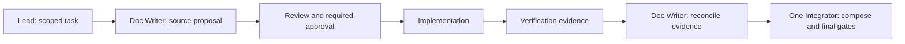

# Developer team responsibilities

These six responsibilities do not require six concurrent agents. Assign named
participants per task. ATHER may combine Lead and Integrator; an independent
Reviewer may also verify. Do not describe a manual assignment as an installed
agent or treat the author as their own independent reviewer.

| Stable role | Responsibility | Definition shipped here |
|---|---|---|
| `dev-lead` | Scope, complexity/RCA, parent/peer decisions, task packet and existing approvals | Manual assignment |
| `dev-doc-writer` | Draft/reconcile canonical documentation, rationale, diagrams and evidence | [Doc Writer](roles/doc-writer.md), native name `zuri-doc-writer` |
| `dev-implementer` | Implement the approved slice in its assigned worktree | Manual assignment |
| `dev-reviewer` | Independently review meaning, contracts, diff and evidence | Manual assignment |
| `dev-verifier` | Execute relevant checks and return exact revision and results | Manual assignment |
| `dev-integrator` | Compose shared sources, regenerate outputs and validate the combined result | Manual assignment |

Persona, domain expertise and model choice are separate from role identity.
Only Doc Writer has a role card, skill and adapters in this first increment.
The owner approved this specialist and its handoffs on 2026-10-04; that approval
does not promote candidate orchestration standards or approve new product behavior.

## Documentation handoff

1. Lead supplies the objective, source/qualified IDs, constraints, parent/peer
   references, existing approval scope, worktree, write set and exit criteria.
2. Doc Writer drafts the source change and source-linked views. Unresolved
   business/design choices return to Lead or owner as explicit questions.
3. Independent review checks meaning and impact. Obtain owner approval where the
   existing doc-first rules require it; reuse a valid approval already supplied.
4. Implementer works against the approved documentation. Verifier records the
   checks actually executed on the implementation revision.
5. Doc Writer reconciles documentation with that evidence, keeping planned,
   implemented, locally verified and deployed states distinct. A newly discovered
   behavior change returns to the relevant review/approval boundary.
6. One Integrator composes shared source changes, runs generators and gates on the
   combined result, and sends any new semantic conflict resolution back for review.

This diagram describes the development procedure, not a running orchestration
service. Runtime leases, locks, retry and dispatch are outside this increment.

## Version diff

0.0 → 0.1.0: records six responsibilities, adds Doc Writer before implementation
and after verification, and identifies the five manually assigned roles.
