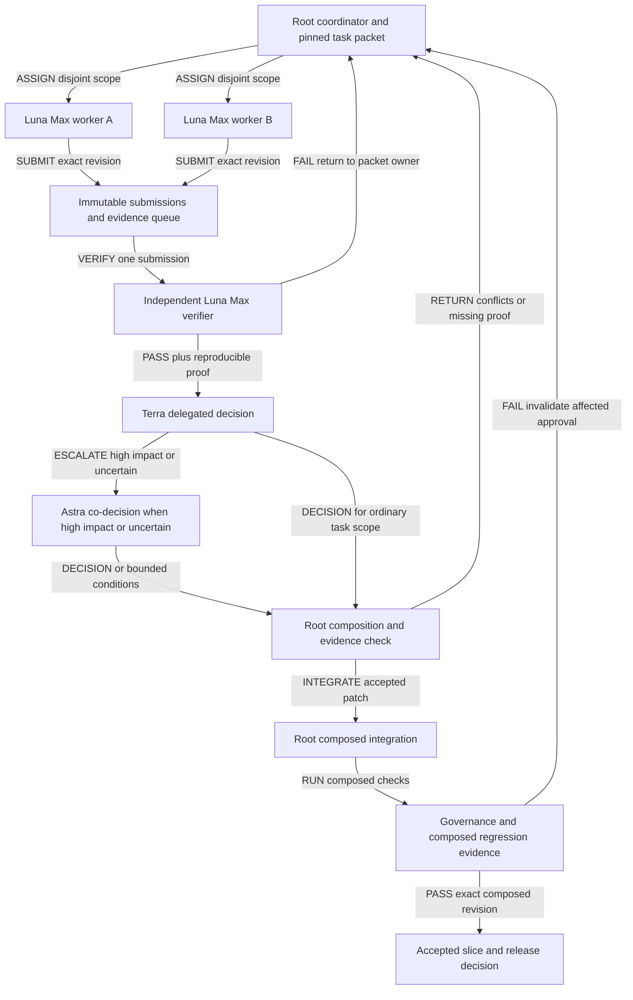
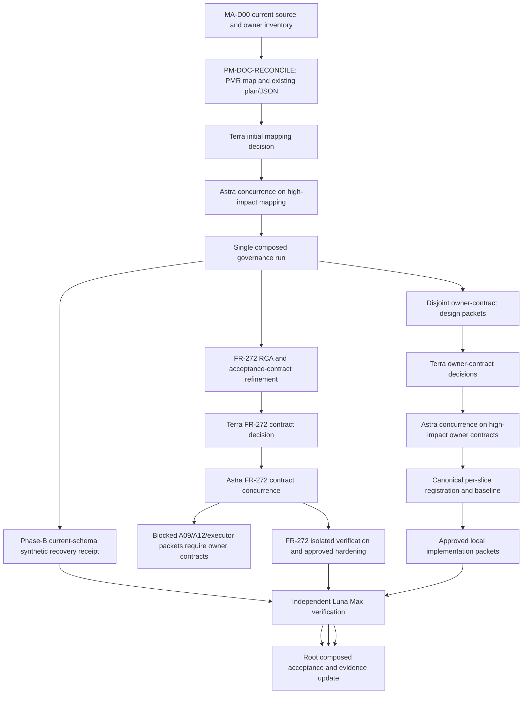
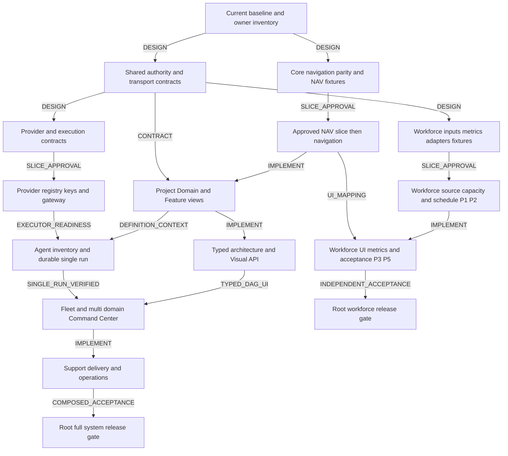

# Multi-agent execution — Luna Max workers → Terra decision gate → Astra escalation

**Version:** 0.9.32b · **Status:** Candidate · **Version diff:** 0.9.31b to 0.9.32b records the exact MA-D01 v0.1.8b and MA-D02 A4 .4.3/.4.4 candidate review outcomes plus bounded NFR applicability concurrence; the DAG and package states remain unchanged and owner/G0/SPEC/dispatch/implementation gates stay closed.

**แผนหลัก:** ใช้ `gpt-5.6-luna` / reasoning `max` สอง agents ทำงานขนานใน packet ที่ไม่ชนกัน และใช้ Luna Max อีก agent ตรวจ revision จริงอย่างอิสระ. ผู้ใช้มอบหมายให้ `gpt-5.6-terra` / reasoning `max` เป็น decision agent สำหรับการตัดสินใจใน task นี้; เรื่องสำคัญ ผลกระทบสูง หรือยังไม่แน่ใจให้ `gpt-6-astra` / reasoning `max` ร่วมตัดสิน. Root เป็น coordinator และ integrator; ไม่แทนการตัดสินที่มอบหมายไว้. การมอบหมายนี้ไม่เปลี่ยนอำนาจ Identity, reviewer, owner หรือ segregation-of-duties ขณะระบบทำงาน

งานนี้ทำ **execution DAG และดำเนิน packet ที่ผ่าน gate** ใน worktree แยก. JSON ยังคงเป็นข้อมูลวางแผน candidate และไม่ถูกส่งไปรันอัตโนมัติ. ทุก packet ต้องมี mapping กับ requirement ปัจจุบัน, owner, allowlist, acceptance และ baseline. การอนุมัติ task นี้ไม่รวม external provider calls, credential issuance, foreign-owner writes, data migration, release, deployment หรือ activation

## ก่อนเริ่ม task และเมื่อกลับมาหลัง compaction

1. ตรวจ task ID, scope, selected plan revision/raw-byte SHA-256, latest decision receipt และข้อห้ามของงานนี้จากไฟล์จริง.
2. อ่านข้อกฎที่เกี่ยวข้องผ่านตารางด้านล่าง แล้วแนบ [rule-check record](#pm-rule-check) ใน task evidence.
3. Summary/session note เป็น pointer ให้ค้นต่อ; เมื่อไม่ตรงกับ source ให้หยุดการตัดสินที่พึ่งข้อขัดแย้งและ reconcile ก่อน.
4. การอ่าน/ตีความกฎไม่ถือเป็น owner approval, G0 passage หรือ dispatch authority.

| กำลังจะทำอะไร | ข้อกฎที่ต้องทวนจากต้นฉบับ |
|---|---|
| มอบหมาย/รับงาน | [§2 บทบาท](#pm-roles), [§4 gate](#pm-gates), [§5 packet](#pm-packet) และ [§6 ownership](#pm-composition) |
| ทำซ้ำ/สร้าง successor | [§10 retry และ stale dependency](#pm-retry) |
| เลือก candidate/ประกอบ pointer | [§4 G3/G3b/G4](#pm-gates), [§5 final receipt](#pm-packet), [§6 root ownership](#pm-composition) และ decision receipt ของ exact revision |
| สรุปสถานะ/เขียน RCA | [§5 หลักฐานและ claim reconciliation](#pm-packet), [§11 metrics](#pm-metrics), [§12 exit criteria](#pm-exit) และ exact selected plan |

ตารางนี้เป็น navigation; authoritative clauses อยู่ใน section เดิม. อ่านเฉพาะกฎที่เกี่ยวข้อง ไม่ต้องอ่านประวัติทั้งหมดทุก turn. State/count/hash ใน baseline และประวัติเป็น receipt-time observations; current task state ต้องเลือกจาก exact plan และ latest decision receipt ของ task.

## 1. Baseline และขอบเขต

- ปรับแผนเดิม v0.8.0b เป็น v0.9.0b เพื่อสะท้อน execution DAG, role delegation, current source baseline และ 33 PMR dispositions; ไม่เปลี่ยนความหมายของ canonical IDs
- [16 Spec readiness](16-SPEC-READINESS-AND-API-REFERENCE.md) ยังมี SPEC-G01–G09. Plan/review PASS ไม่ทำให้ gap เหล่านี้ปิดเอง
- [07 Delivery](07-DELIVERY-AND-VERIFICATION.md) ยังคง P0–P7; [15 Workforce](15-WORKFORCE-CAPACITY-SCHEDULE-AND-PERFORMANCE.md) ยังคง PMR-033-P1→P5 เป็นสายงานอิสระจาก Provider/Agent/Fleet
- [13 Navigation](13-DOMAIN-TAXONOMY-AND-NAVIGATION-BOUNDARIES.md) และ [14 Existing tabs](14-EXISTING-PROJECT-TAB-SEMANTICS.md) เป็นข้อกำหนดล่าสุด: Top bar = Domain, sidebar = subdomain/module, local tabs = views และ Business Home = shortcuts
- `projects` และ canonical IDs เดิมรักษา identity; Inventory เป็น operational read model, Team เดิมแสดง Business Membership, Resources/Risks เดิมยัง Planned. Team/Employment ไม่ให้สิทธิ์เพิ่มโดยอัตโนมัติ
- The original MA-D01 remains pinned at its reviewed hash and is still the historical MA-D06 design input. Its v0.1.4b directional successor passed exact-byte review by Terra (`GO-WITH-LIMITS`) and Astra (`APPROVE_WITH_LIMITATIONS`); no MA-D06 rebind is implied. MA-D03 v0.1.2 is `CANDIDATE_READY_FOR_REVIEW` after Luna Max authoring-verification PASS (not an independent review), Terra APPROVE_WITH_LIMITATIONS and Astra CONCUR WITH LIMITS. Candidate SHA-256 `2e50154e92e79a7696b2be3efaf61b023849555cdd82792758045a153b4bdbc2` directly succeeds v0.1.1 SHA-256 `f60d8b8e6e1fac97e8532979f3fd58fc16381ac77dcf9f1ad055e4952db36a7e`; 13/13 inputs matched at review and 10/13 remain current after receipt composition. Owner acceptance and canonical workforce composition remain open. PMR-033 v0.1.2 (contracts/pmr-033-workforce-source.v0.1.2.candidate.json, SHA-256 25840b20749659ba7abd18e9f875fcff312340df41df89e2445899ec78665a1c) received Luna Max PASS, Terra APPROVE_WITH_LIMITATIONS and Astra CONCUR WITH LIMITS against delivery-plan preimage 375124d5cf761c6f0cd76545bf526029d2f0ef4775262d099505aec632b90850; 31/31 inputs matched at review and 30/31 remain current after this composition. PMR-032 v0.2.1 (contracts/pmr-032-governance-gap.v0.2.1.candidate.json, SHA-256 63ab976574e2069357c5826494d512f6b51078f7a395bb67379e34ceabc64977) received Luna Max PASS, Terra APPROVE_WITH_LIMITATIONS and Astra CONCUR WITH LIMITS; 25/25 sourceManifest hashes matched at exact review. The 24/25 figure was an intermediate snapshot after an earlier document 20 source change; the latest refresh found 23/25 current because the document 16 and 20 pins are stale. All nine PMR-032 gaps remain open and candidate-specific composition verification is NOT_RUN.
- PMR-020/026/029/031, MA-D01/02/06 and FR-272 retain historical candidate pins and review receipts in [08 Evidence and Review](08-EVIDENCE-AND-REVIEW.md). Current PMR-032 v0.2.1 and PMR-033 v0.1.2 successors and their exact review receipts are recorded in document 08 and the delivery-plan receipt ledger. PMR-025 predecessor SHA-256 `2efcd0d8c794dccbe12828a776a117a4a2d639d65df7b2e50aa4691b5d6cc23a` remains unchanged; its v0.1.1 successor and the MA-D01 v0.1.4b successor are linked through the user direction receipt and exact-review receipts for pre-review plan SHA-256 `71302a0c05a677e3bf274078fdeed39ae5aa3e7daa9d50ff7fc433f5775513a2`. User direction closes PMR-025 import target (not its bundle relationship), partly selects export details, and accepts Workforce principles only; technical owner gates, canonical composition, registration and implementation remain pending.
- Design base `087f30258a6831865afd751e28804e36505aff30` เป็น historical snapshot. Accepted program baseline remains `a34ceaf79c112e02b1bcfdbf0a84122d835b002e`. On 2026-09-30, local `origin/main` is observed at `5582ec5811f4d7f9e5986be2287703692da2613b`, following the previous observation `cd3c9f304dca6903daa38792278116275ad969fd`; the two paths in that incremental delta are outside this PM packet scope. This local ref does not prove remote freshness. Keep the accepted program baseline distinct from each packet's source baseline; pin and verify exact inputs per packet, and record any scoped rebind instead of silently relabeling either baseline. PMR-033 v0.1.2 binds 31 raw shared-working-tree inputs based at the accepted program baseline and checkout HEAD a34ceaf79c112e02b1bcfdbf0a84122d835b002e; this does not claim the pinned bytes equal that commit tree. The predecessor cd3c9f304dca6903daa38792278116275ad969fd baseline is historical only; local origin/main 5582ec5811f4d7f9e5986be2287703692da2613b remains freshness UNVERIFIED.
- The inherited plan-wide `baseline.sourceDigests` map is historical, not current-source proof: an independent raw-byte comparison found 15 of 22 hashes match this worktree and seven differ (documents 08, 13, 14, 16 and 29, root `openapi.candidate.yaml`, and `pm-requirement-index.json`). The old digest recorded for document 08 has no verified source commit among inspected `a34`, `cd3` or `558` refs. Every new G0 must recompute and pin its complete current read set instead of reusing that map as a current pin.
- **NFR applicability decision — 2026-10-03:** the PRD defines NFR-001..025. The delegated GPT-6-Sol fallback accepts a candidate-only scope map in `contracts/delivery-plan.candidate.json`: six requirements are direct PM obligations within bounded scope (NFR-001/003/004/005/006/008); seven are inherited/shared or conditional gates (NFR-002/007/011/014/015/016/019); NFR-024/025 overlap PM inference packages only partially and retain FEAT-043 ownership for the full inference/LINE delivery scope; ten remain outside PM scope (NFR-009/010/012/013/017/018/020/021/022/023). All PM execution evidence remains NOT_RUN. NFR-024/025 status prose says “not registered” although both rows exist in the PRD and ID ledger, and the FEAT-043 row says repository declaration is pending although the feature is present in FEATURES.md and the ID ledger. Record these as unresolved status discrepancies, without changing canonical IDs or registries.
- ใช้ [delivery plan index](contracts/delivery-plan.candidate.json) เป็น planning data เท่านั้น: `dispatchable=false`, `implementationAuthorized=false`. ไม่ใช่ runtime WorkflowDefinition และไม่นำ JSON นี้ไปรัน shell/agent อัตโนมัติ

### User direction receipt and rollback baseline — 29 September 2026

The direct reply `1 snapshot, 2 ArtifactRevision, 3 ใช้, 4 ผมอนุมัติ แต่สำรองไว้เเผื่อ rollbackด้วย` is recorded in [`user-direction-receipt-2026-09-29.candidate.json`](contracts/user-direction-receipt-2026-09-29.candidate.json). Approval is limited to candidate product direction: PMR-025 import writes DesignSnapshot/bindings only and does not create/update ExecutionPlan records; exports use immutable ArtifactRevision with a scoped reference/download handle; Workforce direction is one PM allocation writer, CRM Person identity, canonical remainingMinutes, Identity authorization, and People availability as a read-only input when applicable.

The PMR-025 exact bundle relationship remains open. PMR-025 technical owner questions and PMR-033 A-Q1–A-Q8 remain open. MA-D01 PROPOSED-D01-05 is not approved by this reply. Exact transport, port, storage lifecycle, security and persistence contracts remain gated. Existing PMR-025 and MA-D01 review inputs remain unchanged; MA-D06 keeps its original MA-D01 hash pin.

Terra returned `GO-WITH-LIMITS` and Astra returned `APPROVE_WITH_LIMITATIONS` after independently verifying the exact successor and receipt hashes listed above and the pre-review delivery-plan hash `71302a0c05a677e3bf274078fdeed39ae5aa3e7daa9d50ff7fc433f5775513a2`. Their decisions approve this candidate composition only; D01-05, technical owner contracts, canonical registration, implementation and runtime remain open.

The composed `npm run govern` run exited 0 on this candidate tree: graph generation and `docs:check` passed; strict preflight found 0 criticals, 22 warnings and 34 info across 558 documents and 330 routes. The 22 warnings include broken `llms-full.txt` links, five dangling legacy test edges and 18 untracked candidate documents. Product tests/build and implementation were not run.

Before these direction artifacts were created, all 71 files in this architecture directory were archived. The local rollback archive is `zuri-ai-pm-spec-pre-decision-20260929`, SHA-256 `25710d8b409c8fb761287c87aa9b27cbaf6ecd0d0fa2a9dc4d51fefffde3cd74`; the restored copy matched 71/71 manifest hashes. It covers documentation only and grants no execution authority.

## 2. ทีมและจำนวนงานพร้อมกัน

| Role | Model / effort | หน้าที่ | ขอบเขตการเขียน |
|---|---|---|---|
| Coordinator / integrator | Root agent | แตก packet, pin baseline, จัดการ allowlist, ประกอบ patch และบันทึกผลตรวจ | Shared contracts/registry/generated outputs; ไม่ตัดสินแทน owner หรือ delegated reviewer |
| Worker A | `gpt-5.6-luna` / `max` | ทำ packet ที่พร้อม, ตรวจตนเอง, ส่งหลักฐาน | เฉพาะ allowlist ใน isolated lane ของ packet |
| Worker B | `gpt-5.6-luna` / `max` | ทำอีก packet ที่ไม่ชนไฟล์/owner/contract dependency | เฉพาะ allowlist ใน isolated lane ของ packet |
| Independent verifier | `gpt-5.6-luna` / `max`, คนละ agent กับผู้ทำ | ตรวจ diff/spec และหลักฐานของ revision จริง; รายงาน PASS/FAIL/BLOCKED | Evidence/report; ไม่แก้ implementation และไม่ merge |
| Delegated decision agent | `gpt-5.6-terra` / `max` | ตัดสิน task-level gates และ owner/peer conflicts ตามอำนาจที่ผู้ใช้มอบหมาย | Decision ledger; ไม่เปลี่ยน runtime authorization |
| High-impact co-decision | `gpt-6-astra` / `max` | ร่วมตัดสินเรื่องสำคัญ ผลกระทบสูง หรือไม่แน่ใจ | Decision ledger เฉพาะประเด็นที่ส่ง escalation |

ใช้สูงสุด **4 agent slots**. ปกติ root + Luna workers 2 + verifier หรือ delegated reviewer 1. จัด Terra/Astra/verifier review เป็น gate turn; ถ้าต้องมี reviewer และ verifier พร้อมกัน ให้หยุด worker หนึ่งคนก่อนเพื่อไม่เกินขีดจำกัด. Luna ทำพร้อมกันได้สูงสุดสอง packets ที่ไม่ชนกัน

Verifier ดูทีละ submission. เมื่อคิวตรวจมี 2 submissions ให้ชะลอ dispatch งานใหม่และให้ worker แก้ข้อที่ถูกส่งกลับก่อน เพื่อไม่สะสมงานที่ยังไม่ตรวจ. อย่าให้ worker ตรวจอนุมัติผลงานตนเองหรือใช้ session ของผู้เขียนมาสวมบท verifier

ผล verifier และ decision agent ต้องอ้าง revision, artifact และหลักฐานที่ตรวจจริง. หาก Luna Max หรือ reviewer model ที่ระบุใช้ไม่ได้ ให้รายงานและรอการตัดสิน; ห้ามเปลี่ยน model เงียบ ๆ. ประเด็น authorization, concurrency, migration, owner boundary, data retention และ external effects ต้องระบุชัดใน Astra escalation checklist

## 3. MA01 — Directed gate flow

เส้นคือชนิด handoff มีทิศทางชัดเจน. `PASS` จาก verifier หมายถึงผ่าน acceptance ของ packet นั้น; `ACCEPTED` เกิดหลัง root ตรวจและต้นไม้รวมผ่าน. สถานะ merged/deployed/activated เป็นคนละหลักฐาน

## 4. Gate contract

| Gate | ใครรับผิดชอบ | ผ่านเมื่อ | หากไม่ผ่าน |
|---|---|---|---|
| G0 — Ready to assign | Root prepares; Terra decides unresolved task gates | Dependency artifacts มี digest, scope/owner/allowlist ชัด, relevant spec gaps ปิดระดับที่ slice ต้องใช้, approved docs สำหรับ code, baseline และ verification environment พร้อม | เก็บ BLOCKED/NEEDS_DECISION พร้อมเหตุผล; ไม่เริ่ม code จาก placeholder |
| G1 — Worker self-check | Worker | Deliverables ครบ, diff อยู่ใน scope, required local checks มีจำนวนที่รันจริง, negative cases และ limitations แนบ | Worker แก้ใน lane เดิม; self-check ไม่ใช่ independent approval |
| G2 — Independent verification | Luna Max verifier | อ่าน requirement/parent/peer เอง, ยืนยัน exact artifact hash, ตรวจผลและ rerun checks ตามความเสี่ยง, ไม่พบ required acceptance failure | FAIL/REWORK หรือ BLOCKED; ส่ง finding แบบทำซ้ำได้กลับผู้ทำ |
| G3 — Delegated decision | Terra; Astra joins high-impact/uncertain cases | ตัดสิน disposition, owner conflict, approved scope และเงื่อนไขจากหลักฐาน; Astra concurrence เมื่อเข้าเงื่อนไข escalation | HOLD/REVISE/NO-GO หรือส่ง packet กลับพร้อมเงื่อนไข |
| G3b — Integration review | Root | ตรวจว่า composition ตรง decision ledger, diff/allowlist และ exact worker/verifier evidence; ไม่แทน G3 decision | ส่งกลับพร้อม scope ที่ต้องแก้ หรือหยุด integration |
| G4 — Composed integration | Root | Apply/cherry-pick revision ที่ผ่าน gate, regenerate outputs ครั้งเดียว, รัน composed governance/tests/build ตาม slice; diff และ source hashesตรงกับผลตรวจ | ไม่ promote; เมื่อ integration แก้ semantics ต้อง reverify ส่วนที่เปลี่ยน |
| G5 — Release / activation | Root + เจ้าของตาม authority | Target/SHA/env/migration/rollback/CI และ approval ครบตาม release scope | ไม่ merge/deploy/activate โดยถือ G2 PASS เป็น permission |

### เกณฑ์ปฏิเสธที่ต้องบังคับ

- Baseline/contract hash เปลี่ยน, diff นอก allowlist, fake/stale evidence, test รัน 0 ข้อ, required test skipped/flaky, artifact ไม่มี bytes หรือ verification environment ไม่ตรง → ห้าม PASS
- Cross-tenant/Business leakage, duplicate side effect, lost update, unsafe migration, wrong authority หรือ uncertainty ที่กระทบ acceptance → FAIL/BLOCKED จนแก้หรือมีข้อมูลครบ
- Test tooling เริ่มไม่สำเร็จ = NOT_RUN ไม่ใช่ PASS. ไม่เพิ่ม timeout หรือลด assertion เพื่อให้ผลดูผ่าน
- คะแนน/เมตริกที่ยังไม่มีแหล่งข้อมูลต้องมี UNKNOWN/PARTIAL/N/A ตาม spec; ห้ามอนุมานว่าไม่มีงานหรือ performance เป็นศูนย์
- แก้เชิงความหมายหลัง verify แล้ว ต้องสร้าง submission revision ใหม่และตรวจ affected checks ใหม่. Root ไม่ใช้ผล PASS เก่ารับ patch ที่แก้เองโดยไม่มีหลักฐานใหม่

## 5. Task packet และผลส่งกลับ

### Input packet ที่ root ต้องให้ก่อน dispatch

| Field | Required meaning |
|---|---|
| `packetId`, `attempt`, `workPackageId` | ID ภายในแผน; ไม่ใช่ canonical FR/FEAT |
| `ownerDomain`, `requirements`, `phase` | ผู้เขียนข้อมูลหลัก, PMR/canonical mapping ที่อนุมัติ, phase ย่อย |
| `baseCommit`, `sourceDigests`, `approvedSpecRefs` | Exact revision และ hash ของเอกสาร/contract ที่อ่าน รวม staged design ถ้ามี; HEAD อย่างเดียวไม่ครอบคลุม uncommitted docs |
| `dependsOn`, `inputArtifacts` | ต้องเป็น accepted dependency revision; ไม่อ่านไฟล์ครึ่งทางจาก worker อีกตัว |
| `allowedFiles`, `forbiddenEffects`, `risk` | Allowlist รายไฟล์หรือแคบกว่าระดับ module; ห้ามใช้ wildcard ทั้ง repository เป็น writer scope |
| `acceptance`, `verificationPlan` | ผลที่ต้องเห็น, negative/race cases, commands/environment ที่ได้รับอนุญาต, mandatory vs optional |
| `deliverables`, `stopConditions` | Patch/commit/docs/tests/report; หยุดเมื่อจำเป็นต้องเปลี่ยน owner/shared contract หรือพบ stale baseline |
| `worker`, `verifier`, `decisionAgent`, `highImpactReviewer` | Worker/verifier คนละ Luna Max instance; Terra เป็น delegated decision agent; Astra ร่วมตัดสิน high-impact/uncertain cases |

### Rule-check และ resume record

แนบ rule-check record ต่อ task ที่ใช้ตัดสิน โดยระบุ taskId, action, trigger, source document ID/path/version/raw-byte SHA-256, section locator, relevant clause, applicability, read-command/evidence locator และ uncertainty. Trigger ใช้ TASK_START, POST_COMPACTION, RULE_CONFLICT หรือ SOURCE_CHANGED ตามเหตุที่ทราบจริง; หากไม่มี compaction event ให้ใช้ TASK_START หรือก่อน RCA/decision ตาม action ที่เกิดจริง ไม่สร้าง event ปลอม.

กฎ retry ต้องระบุ acceptance revision ที่กำลังตรวจ จำนวนรอบที่มีหลักฐาน และ next permissible action. หากประวัติรอบไม่ครบให้ UNKNOWN/NEEDS_DECISION; ห้ามตั้ง round เป็นศูนย์จากการจำไม่ได้. เมื่อ source เปลี่ยน ให้ตรวจ affected meaning ตาม [§10](#pm-retry); อย่าอ้างว่า hash เดิมยัง current. การอ่านโดยไม่มี applicability ยังไม่พอสำหรับ action ที่อาศัยกฎนั้น.

Worker submission, Verify receipt และ Final receipt ต้องอ้าง rule-check record ที่ใช้กับ action ของตน. เก็บเฉพาะ relevant clause และหลักฐานที่จำเป็น ไม่เก็บ private reasoning/chain-of-thought. เวลาคำสั่งที่ไม่มีในหลักฐานต้อง UNKNOWN; ไม่ใช้ turn-start timestamp แทน read time.

### ตรวจข้อสรุปก่อนส่ง RCA หรือ decision

ก่อนส่ง RCA หรือ decision ให้แนบตาราง claim → source clause → applicability → counterevidence → disposition สำหรับข้อสรุปที่มีผลต่อการเดินงาน. ข้ออ้างว่าไม่มีเอกสาร/กฎ/receipt ต้องระบุขอบเขตที่ enumerate และเนื้อหาที่ตรวจ. เมื่อพบ clause หรือ receipt ที่ขัดกับข้ออ้าง ให้แก้ข้อสรุปก่อนส่ง; ถ้าข้อมูลยังไม่ครบให้ UNKNOWN. Reviewer ตรวจทั้งการมีอยู่ของ source และความสอดคล้องของข้อสรุปกับ clause.

ตัวอย่าง: summary ไม่กล่าวถึง retry แต่ §10 กำหนด acceptance repair สองรอบ ต้องสรุปว่ามีกฎดังกล่าว; ความครอบคลุม provenance/tool retry และการปฏิบัติตามในอดีตต้องตรวจแยก ไม่สรุปว่าไม่มี bounded retry rule.

### Worker submission

ส่ง `packetId`, baseline, exact commit หรือ patch digest, changed-file list, requirement→change→test mapping, commands/exit codes/actual counts, environment/runtime versions, artifacts+digests, known limitations, failure/recovery notes และ outstanding decisions. ข้อความ “done” อย่างเดียวรับไม่ได้. ไม่ส่ง secrets หรือข้อมูลพนักงานจริงใน report รวม

### Verify receipt

ส่ง `reviewedRevision`, `verifiedDigests`, `verifierIdentity`, `model`, `effort`, verdict `PASS|FAIL|BLOCKED|NEEDS_DECISION`, checklist ราย acceptance, rerun commands/counts, negative cases, findings พร้อมตำแหน่ง/วิธีทำซ้ำ, limitations และเวลาตรวจ. Verifier ไม่แก้ code ของ submission แล้วออก receipt ให้ code เก่าต่อ

### Final receipt

Root บันทึก verdict, worker/verifier revisions ที่ใช้, integrated revision, conflict resolutions, composed check results, risk/rollback และสิ่งที่ยัง NOT_RUN. ไฟล์/evidence เหล่านี้อยู่ใน task artifact ที่มี scope เหมาะสม; ไม่บังคับเพิ่ม runtime registry หรือ API ใหม่ให้ระบบ PM เพื่อรันงานพัฒนานี้

## 6. Ownership, worktree และการประกอบ

1. Root enumerate current source/registry แล้วเลือก base ที่ตรวจได้. Primary checkout เป็น reference; ไม่ checkout/reset/stash/commit ใน shared primary
2. Implementation workers ใช้คนละ worktree/branch ชื่อ `codex/...` หลัง G0. ตรวจ command cwd และ runtime/DB target ก่อนทุก mutation; shared `node_modules` หรือ Docker Compose ไม่ถือว่า isolated
3. Worker เตรียมคำเสนอแก้ shared contract เป็น patch/diff ใน lane ตน. Root เป็นผู้ประกอบและยึดเป็น baselineก่อน dependent workers เริ่ม. ห้ามสอง agent เขียน API contract/schema/ID ledger เดียวกันพร้อมกัน
4. ไฟล์ร่วมที่ root ถือ: PRD/FEATURES/ROADMAP/ID ledger, root route/config manifests, shared OpenAPI/schema/event/owner ports, Prisma schemas/migrations, shared dependency manifests/lockfiles, composed generated outputs. **การเป็น integrator ไม่แทน authority ของ domain owner**
5. Worker domain เดียวใช้ขอบเขต source/test ที่ root เลือกจากไฟล์จริง. Verifier ใช้ checkout/snapshot ของ submission คงที่; log และ test data อยู่ในพื้นที่ของ verifier
6. Root แก้ source conflicts ก่อน แล้ว run `npm run govern` รอบเดียวจาก composed tree. ห้าม concatenate generated graphs/TRACE/DOMAIN-MAP และไม่รัน govern ซ้อนกันใน worktree เดียว
7. Scope ที่เปลี่ยน routes/models/requirements ต้องผ่าน governance. Implementation ใช้ tests/build/lint/e2e ตาม definition of done; full `npm run verify` บน integrated sourceเมื่อปิด slice ที่จะส่งมอบ. Cross-app changes ต้องใช้ dependencies และ checks ของ Server/Edge ที่เกี่ยวข้อง
8. Merge/release ใช้ hosted checksของ exact revisionและ approvalตามคำสั่งที่มีอยู่; deployment กับ runtime activation แยกจากกัน. งานแผนนี้ไม่ขอเปิด production service

## 7. Work packages และ dependency plan

<!-- BEGIN WORK_PACKAGES -->
### 7.0 Current PMR disposition and execution DAG

การจัดกลุ่มนี้เป็นผลจากการตรวจ source/registry ณ `a34ceaf79c112e02b1bcfdbf0a84122d835b002e`. PMR เป็น proposal-local key สำหรับ proposal และ acceptance trace; เมื่อ registry ระบุ canonical mapping แล้ว mapping นั้นเป็น canonical identity โดยไม่จัดสรร ID ใหม่. PMR-013 ลงทะเบียนเป็น FR-272 แล้ว. เฉพาะ `NEW`/`NEW_CANDIDATE` ที่ยังไม่มี canonical mapping เท่านั้นที่ยังไม่จัดสรร FR ID จน Terra/Astra ตัดสินตามกติกา ID ledger. `PARTIAL` หมายถึงพบ implementation ที่เกี่ยวข้อง แต่ยังไม่ผ่าน acceptance ของ PMR นั้น

**MA-D00: ACCEPTED by root** — isolated worktree pinned at `a34ceaf79c112e02b1bcfdbf0a84122d835b002e`; enumerated the 33 proposal files and PM architecture folder, plus 1,121 server source files and 958 server test files; captured 21 canonical/peer/spec digests in the planning JSON. The baseline is a source inventory only; it does not certify runtime behavior or close any PMR acceptance.

| PMR | Disposition | Canonical/owner evidence | Next packet or hold |
|---|---|---|---|
| 001 | EXTEND | FR-003 / FR-069 / FR-108 · PM | Reconcile Project/Feature view scope and imports |
| 002 | EXTEND | FR-251 · PM | Verify cross-feature identity and aggregation |
| 003 | EXTEND | FR-252 · PM | Reconcile phase-B persistence and recovery acceptance |
| 004 | EXTEND | FR-007; typed architecture remains candidate · PM | Close typed-node/edge and owner/port contract first |
| 005 | EXTEND | FR-019 / FR-106 · PM | Close explorer and try-it-out contract |
| 006 | NEW | Agent inventory · PM | Canonical ID and approved slice required |
| 007 | NEW | Fleet inventory · PM | Canonical ID; single-run proof precedes fleet |
| 008 | DEFER | Generic Command Center belongs to Integration | Owner contract and Integration packet required |
| 009 | DEFER | Provider registry belongs to Integration | No PM duplicate registry |
| 010 | DEFER | MCP registry belongs to Integration | No PM duplicate registry |
| 011 | DEFER | Inference gateway belongs to Integration | Provider/Identity contract and Astra review required |
| 012 | DEFER | Broader key/grant authority belongs to Identity | PM consumes scoped permission port only |
| 013 | REUSE | Registered FR-272 · PM | Preserve the existing PMR-013 → FR-272 mapping; keep PMT acceptance projections PLANNED_NOT_RUN until verified |
| 014 | NEW | Typed architecture validation · PM | Canonical ID and accepted model contract required |
| 015 | EXTEND | FR-124 · PM | Add cross-artifact trace only after exact contract mapping |
| 016 | EXTEND | Existing weighted progress strategy · PM | Prove usage/progress/unknown distinction |
| 017 | EXTEND | FR-268 · PM | Cost/evidence gap; capacity portion waits for PMR-033 contracts |
| 018 | CANDIDATE_ONLY | Release lifecycle spans PM and Integration | No release implementation or activation in this task |
| 019 | PARTIAL / DEFER | FR-198 exists; Identity owns broader authority | Preserve FR-198; define only missing scoped evidence |
| 020 | PARTIAL / SPLIT_OWNER | FR-239/240 programme telemetry stays Platform Control; Integration owns any separately approved scoped invocation usage; PM consumes a scoped projection | Freeze run attribution, dedupe, token categories, price provenance and redaction before code |
| 021 | PARTIAL / DEFER | LINE-specific lease/UNKNOWN behavior exists; generic executor is Integration | Do not treat LINE behavior as generic execution proof |
| 022 | PARTIAL / DEFER | FR-254 is Knowledge-owned | PM uses approved Knowledge port; no direct GKS/GenesisBlockDB access |
| 023 | NEW | PM collaboration/revision capability | Candidate-only until canonical ID and owner acceptance |
| 024 | PARTIAL / DEFER | Notion/LINE delivery receipts are provider-specific · Integration | Generic recipient/subscription contract remains open |
| 025 | EXTEND | FR-108 plan import exists · PM | Design-bundle manifest/export semantics first; no second writer |
| 026 | DEFER | Identity owns grants; CRM owns Person/consent/retention; PM owns artifacts | Produce owner matrix; no PM-owned generic grant/purge |
| 027 | EXTEND | FR-124 readiness projection · PM | Six-state promotion/evidence lifecycle remains open |
| 028 | PARTIAL / DEFER | FR-053 evaluator · Agent/Integration owners | Bind evaluation to approved agent/provider/workflow versions |
| 029 | PARTIAL | FR-252 backup/restore evidence · PM plus service owners | Rebind synthetic proof to current schema; map load/backpressure to actual owners |
| 030 | PARTIAL / DEFER | LINE polling is contextual reuse; general scheduler is Integration | Trigger/misfire semantics and scheduler owner contract required |
| 031 | CLARIFIED / DEFER | PMR-031 means source-code management; Integration owns repository/check adapters; PM owns evidence acceptance; existing `SCM` domain is Supply Chain Management | Use explicit source-control wording; do not route to Supply Chain or change its domain key |
| 032 | PARTIAL / NEW GAP | Existing root governance generators; uncovered approved-spec divergence check | Reuse generators; no duplicate governance system |
| 033 | BLOCKED | Workforce source ports and permission seams · PM/CRM/Identity | Contract design may proceed; no mutation service, route, or active UI before owner approval |

เส้นทาง `FR272V`, recovery และ owner-contract packets แยกทำขนานได้เมื่อ allowlist ไม่ชนกัน. ต้อง pin artifact ก่อน verifier; shared registry, schema, OpenAPI และ generated outputs ทำโดย root ทีละรอบ. งานที่ `DEFER`, `BLOCKED` หรือรอ owner ไม่ถูกนับเป็น DONE จากการปิด DAG ฝั่ง PM

### 7.1 ปิด design gaps ก่อน code

IDs `MA-*` เป็นหมายเลขงานในแผน ไม่ใช่ FR/FEAT ใหม่. รายการระดับ work package ต้องถูกแตกเป็น dispatch packet ที่มี owner เดียวและ file allowlist ก่อนเริ่มทำจริง

| ID | งาน / owner | Dependency | Gap scope | ผลส่งมอบและหลักฐานหลัก |
|---|---|---|---|---|
| MA-D00 | ตรวจ current source และ pin baseline · root | — | SPEC-G09 | Registry/source/owner reuse inventory, source+spec digests, collision list; ไม่ reset shared primary; ตรวจ: Enumerated routes/models/tests, staged candidate bytes included, current registries read before any new ID |
| MA-D01 | Shared authority, allocation owner และ transport · project-manager | MA-D00 | SPEC-G01, SPEC-G05 | One allocation writer; Person/resource mapping; hours/minutes compatibility; common error, requestId, ETag, auth/session/CSRF and refusal matrix; ตรวจ: PM vs Identity vs CRM authority; foreign-scope refusal; idempotency/error and required headers; owner sign-off per affected interface |
| MA-D02 | Core Navigation / UX parity และ NAV fixtures · project-manager | MA-D00 | SPEC-G06, SPEC-G08 | Domain→module→tabs mapping, nine sections/14 routes/seven views and core NAV fixtures; Workforce contract bindings are deferred to D02W; ตรวจ: Old/new route crosswalk, stable keys, Business Home shortcuts, Inventory read-only and Membership Team semantics; named Resources/Risks remain planned; no orphan core navigation ref |
| MA-D02W | Workforce screen / operation / G14 bindings · project-manager | MA-D02, MA-D01, MA-D04 | SPEC-G06, SPEC-G08 | Six workforce screens linked to stable input/metric/operation contracts and G14 model; remaining mapping scope after core NAV; ตรวจ: WF-R01–06 schema/operation/field parity; no stale metric variant or hours/minutes binding; one linked graph authority and trace refs |
| MA-D03 | Workforce inputs และประวัติ · project-manager | MA-D01, PMR-033-WORKFORCE-SOURCE-CONTRACT | SPEC-G02 | Typed estimates, calendars, availability, team shares, effective assignments/history and seven-mode status maps; dispatch only after root accepts and composes both D01 and PMR-033 proposal artifacts; ตรวจ: Missing inputs remain PARTIAL; effective-date/reassignment and duplicate event examples; agent/unresolved assignee cannot become Person |
| MA-D04 | Metric variants, policy และ corrections · project-manager | MA-D03 | SPEC-G03, SPEC-G04 | Twelve metric result shapes, Business/person/team review and correction lifecycle, reviewer authority; ตรวจ: Each metric has typed value/sample/coverage/cohort; denominator zero, small samples, quantiles, changed due date, reopened work and history corrections |
| MA-D05 | Physical adapter และ migration design · project-manager | MA-D03, MA-D04 | SPEC-G07 | Per-owner table reuse, exact SQLite/Postgres mapping, transaction/RLS/grant/backfill/rollback design; ตรวจ: Retain source composite keys; person/day conflict locking; no blanket creation of 54 records; migration design vs execution proof separated |
| MA-D06 | Provider / agent / ledger compatibility contracts · integration | MA-D01 | SPEC-G05, SPEC-G07, SPEC-G08 | Cloud/private/paired locations, model vs MCP protocols, key/secret owner, ledger profile and typed handoff contracts plus conformance fixtures; ตรวจ: Existing PipelineRun required definition and unique attempt identity preserved; vault/revoke/private network, lease/epoch/UNKNOWN, no arbitrary execution |
| MA-D07 | Workforce conformance fixtures และ test design · project-manager | MA-D03, MA-D04, MA-D05, MA-D02W | SPEC-G08 | Request/response/error/lifecycle example matrix and PMT-033 A–P test design; ตรวจ: Positive and invalid payloads; overlaps/dedup/zero capacity; stale preview and concurrent commit; permission revocation; fixtures are not service tests |
| MA-D08 | Register และอนุมัติ baseline ราย slice · root | MA-D00, PM-DOC-RECONCILE | SPEC-G09 | Per-slice REUSE/EXTEND/NEW canonical mapping, exact approved docs/contracts, ledger and phase receipt; ตรวจ: Selected slice relevant design outputs and entry-proof accepted; preserve IDs; shared FR with ordered phases; govern after composed registration |

**MA-D08 เป็น control ที่ทำซ้ำราย slice** ไม่ใช่ barrier ที่รอ D01–D07 เสร็จทั้งโปรแกรม. ตัวอย่าง NAV ใช้ D02 + canonical registration + NAV entry fixtures; ไม่รอ metric/provider gaps. Workforce screen bindings ใช้ D02W หลัง input/metric contracts พร้อม; SPEC-G06 ทั้งชุดยังไม่ปิดเพียงเพราะ core NAV ผ่าน. Workforce ใช้ D01/D03/D04/D05/D07 ใน scope ที่ phase ต้องใช้. D06 ปิด provider/ledger contracts ได้ก่อน UI canvas เสร็จ แต่ต้องมี approved P2 contract references

**G07/G08 แบ่งสองระดับ:** ก่อน code ต้องมี reviewed adapter/migration design, fixture/schema/negative-case plan และ acceptance ที่ทดสอบได้; executable service/migration/concurrency evidence ต้องผ่านหลัง implementation ก่อน G4/G5. จึงไม่กำหนดเงื่อนไขวนว่า code ยังห้ามเขียนแต่ต้องมี service test ผ่านแล้วก่อนเริ่ม

### 7.2 Implementation waves หลัง approved slice baseline

ทุกแถวต้องผ่าน MA-D08/G0 ของ slice ตน แม้ไม่เขียน dependency ซ้ำทุกแถว. วันที่/ชั่วโมงยังไม่กำหนด; เรียงตาม dependency และคิวตรวจจริง

| ID | งาน / owner | Phase / dependency | Acceptance ของ verify gate |
|---|---|---|---|
| MA-I01 | Navigation เดิมและ named planned states · project-manager | NAV-P1; MA-D02, MA-D08 | 9 sections/14 routes/7 Work views, deep links/history/active states, keyboard/mobile, scope/refusal and planned Risks/Resources |
| MA-I02 | Project / Domain / Feature views และ strategy progress · project-manager | P1; MA-I01, MA-D01 | Scope before aggregate; cross-feature dedup; immutable identities; objective/import transaction; weighted evidence progress |
| MA-I03 | Typed architecture, Visual API, trace/import and drift · project-manager | P2; MA-I02, MA-D01 | Typed edge direction/owner/port/cycle tests, read-only API parity, forbidden imported code, stale evidence and spec/code drift checks |
| MA-I04 | Workforce source ports และ persistence · project-manager | PMR-033-P1; MA-D03, MA-D05, MA-D07, MA-D08 | Calendar/estimate/assignment/history authority; legacy count compatibility; approved adapter constraints, source coverage and historical attribution |
| MA-I05 | Capacity calculator และ schedule preview/commit · project-manager | PMR-033-P2; MA-I04 | PMT-033 A–F/O/P; interval union, timezone, dedup, ordered locking/CAS, same-key same receipt, same-key changed payload denied |
| MA-I06 | Resources UI / person-team workload / schedule · project-manager | PMR-033-P3; MA-I05, MA-I01, MA-D02W | WF-R01–03/R05, count vs load distinction, per-person overload visible under team average, empty/partial/error and 200% zoom; no new Membership grants |
| MA-I07 | Performance / evidence / policy review / correction · project-manager | PMR-033-P4; MA-I06, MA-D04, MA-D07 | WF-R04/R06; twelve formulas; PMT-033 G–L/N; immutable cohort, pooled ratios/recomputed quantiles, no invented ranking |
| MA-I08 | Workforce acceptance และ scoped pilot readiness · root | PMR-033-P5; MA-I07 | All PMT-033 A–P executed; contract/unit/UI/e2e counts; representative-data pilot requires authorized data/environment; root final composed gate |
| MA-I09 | Provider / connection / deployment / MCP registry · integration | P3; MA-D06, MA-D08 | Model capability probe, protocol/tool-schema digest, consent, cloud/private/paired-local differentiation, credentials never in UI/logs |
| MA-I10 | Scoped inference keys และ authorization/audit ports · identity | P3; MA-D01, MA-D06, MA-D08 | Audience/scope/model allowlist, expiry/revoke/rotation, CSRF and redacted audit; no key misuse across Business |
| MA-I11 | Inference gateway / private or paired executor binding · integration | P3; MA-I09, MA-I10 | Raw serving port private, gateway refusal/quota, executor readiness, no browser-localhost assumption and failure recovery |
| MA-I12 | Agent inventory และ immutable version approval · project-manager | P4; MA-I02, MA-I09 | Approved version immutable; tool/model/executor pins, stale hash refused, fixtures and eval prerequisites captured |
| MA-I13 | Durable single run / lease / receipt / recovery · integration | P4; MA-I12, MA-I11 | Claim race/epoch fence, crash after effect, late result, duplicate receipts, UNKNOWN reconciliation, cancel/pause and isolation |
| MA-I14 | Fleet inventory / typed DAG / handoffs · project-manager | P5; MA-I03, MA-I12, MA-I13 | One durable single-run proof first; cycle/ref/type/owner checks, immutable member pins, terminal result selection, no recursive fleet spawn |
| MA-I15 | Multi-domain execution / Command Center / triggers · integration | P5; MA-I14, MA-I13 | Lane serialization, typed artifact handoff, cancellation/fencing, budget exposure, trigger timezone/misfire/dedup/loop suppression |
| MA-I16 | PM support: risks/issues/scope/cost and collaboration · project-manager | P6; MA-I03, MA-I15, MA-D03, MA-D05 | Risks/Issues/ChangeRequest lifecycle, capacity calls existing single writer, revised scope evidence, comment revision and optimistic conflict |
| MA-I17 | Knowledge retrieval, share/retention และ notifications · root | P6; MA-I03, MA-I15 | Knowledge provenance/authorized results; Identity revoke/retention and no cached leak; Integration recipient reauthorization and receipts |
| MA-I18 | SCM/CI, release evidence, eval and operations · root | P6–P7; MA-I16, MA-I17 | Exact SHA/env signatures, golden/adversarial eval, actual usage provenance, SLO/load, backup/restore, RLS/grants and migration/rollback evidence |

**Independent Workforce release:** MA-I08 → MA-RWF ส่ง scoped workforce release ให้ root ตรวจได้โดยไม่ต้องรอ MA-I09–I18. ยังคง required CI/schema/security/rollback/approval ของ workforce เอง. MA-I18 คือ full-system pilot ตาม P6–P7 ไม่ใช่ gate บังคับของ workforce

### 7.3 Candidate file ownership

| ID | พื้นที่งานที่ใช้แตก packet |
|---|---|
| MA-D00 | Source read-only; root controls baseline receipt |
| MA-D01 | `contracts/ma-d01-allocation-authority.candidate.json` only. Canonical 03/06/15 and both OpenAPI candidates are read-only; root alone composes accepted proposals. |
| MA-D02 | 09–14 and core navigation/ux model slices; root owns domain config |
| MA-D02W | 15 and Workforce-only navigation/ux/architecture/trace patches; root composes shared JSON |
| MA-D03 | 15/17/18 plus workforce contract proposals; CRM/Identity owner-port patches separate |
| MA-D04 | 15/17/18, workforce schemas/examples; root reconciles main review contract |
| MA-D05 | 18/19 and data-model proposals; root owns Prisma/schema/migration composition |
| MA-D06 | `contracts/ma-d06-provider-agent-ledger.candidate.json` only; canonical 04/05/06/19, schemas and OpenAPI read-only; Identity/Edge patches excluded |
| MA-D07 | workforce.examples.json, workforce OpenAPI and 15/07 acceptance map |
| MA-D08 | Readiness preparation only: `contracts/ma-d08-readiness.candidate.json`; PRD/FEATURES/ROADMAP/ID ledger/charters for registration remain root-only and use sanctioned writers |
| PMR-033-WORKFORCE-SOURCE-CONTRACT | Current candidate output: `contracts/pmr-033-workforce-source.v0.1.2.candidate.json` only; preserve v0.1.1 and `contracts/pmr-033-workforce-source.candidate.json` as historical. Canonical 15 and both OpenAPI candidates are read-only; root alone composes accepted proposals. |
| PMR-029-OPS-ACCEPTANCE-MAP | `contracts/pmr-029-ops-acceptance.candidate.json` only; canonical docs, registry, tests and runtime files are read-only |
| PMR-032-GOVERNANCE-GAP-MAP | `contracts/pmr-032-governance-gap.v0.2.1.candidate.json` only; no shared tooling or generated-output edits; root alone composes any accepted tooling changes. |
| MA-I01 | PM navigation components; root alone edits shared domain registry/layout contracts |
| MA-I02 | PM application/read-model services and matching owner routes/tests |
| MA-I03 | PM design/API-doc/visualization/import services and consumers; one shared schema baseline |
| MA-I04 | PM people/work repositories/ports; schema changes assembled by root; CRM and Identity ownership respected |
| MA-I05 | PM workforce application/calculation/transaction code and isolated fixtures/tests |
| MA-I06 | PM workforce UI/projections/components and route-scoped UI tests |
| MA-I07 | PM metric/evidence/policy UI and services; Identity review port stays owner-owned |
| MA-I08 | Verification branch/artifacts; no production effect before separate release approval |
| MA-I09 | Integration provider/MCP owner services and projections; PM consumes ports |
| MA-I10 | Identity key/grant services and their tests; Integration secret references via its own writer |
| MA-I11 | Integration inference gateway; any Edge/runtime change is a separate owner packet with cross-app contract tests |
| MA-I12 | PM AgentDefinition/Version and review/UI services |
| MA-I13 | Integration run ledger/executor adapters; PM Command Center read projection is a separate allowed-file packet |
| MA-I14 | PM fleet/workflow definitions and compiler-facing UI/contracts |
| MA-I15 | Integration scheduler/events/trigger/usage owners; PM UI consumes projections through separate packet |
| MA-I16 | PM support services/routes/UI; inventory is not stock write; individual features dispatched separately |
| MA-I17 | Split into Knowledge, Identity and Integration owner packets; no foreign-store write or automatic real message sending |
| MA-I18 | Split PM evaluation/release, Integration adapters/ops and Identity checks; final merge/deploy/activation by root under actual release scope |
| MA-RWF | Root release artifacts; no automatic deployment |

พื้นที่ข้างต้นเป็น boundary ไม่ใช่คำอ้างว่าไฟล์ใหม่มีอยู่แล้วหรือให้สิทธิ์แก้ทั้ง folder. Root enumerate ไฟล์จริงและประกาศ exact allowlist, spec revision และ reviewer ก่อน dispatch. MA-I17/I18 และส่วนข้าม owner ใน package อื่น **ห้ามส่งเป็น writer packet เดียว**; แยกหนึ่ง owner ต่อ packet และรับ typed handoff เท่านั้น

**Astra file-boundary ruling (2026-09-29):** MA-D01 and PMR-033 may run in parallel only on the exact, disjoint candidate JSON paths above. Both must treat canonical `15-WORKFORCE-CAPACITY-SCHEDULE-AND-PERFORMANCE.md` and both OpenAPI candidate files as read-only. Root is the sole composer. MA-D03 v0.1.1 is now candidate-ready after review; any implementation remains blocked until domain owners accept and root composes the canonical workforce contract. Separate worktrees alone do not establish file ownership.

<!-- END WORK_PACKAGES -->

## 8. MA02 — Delivery lanes

<!-- BEGIN DELIVERY_DIAGRAM -->

ภาพรวมย่อระดับ capability; ตารางและ JSON ระบุ dependency ของแต่ละ work package. Core Navigation ไม่รอ Workforce contracts; D02W ผูกหน้าจอ Workforce หลัง D01/D04 พร้อม. Workforce ไม่มี dependency ไปยัง Provider, Agent หรือ Fleet และ foundation P1/P2 ไม่รอ NAV implementation; NAV ต้องพร้อมตอน Resources UI. Agent definitions ใช้ Project context และ Provider registry โดยไม่รอ Visual API UI ทั้งชุด; Fleet ต้องมี typed graph และ durable single-run proof. ทุก SLICE_APPROVAL ผูกเอกสารและผลตรวจเฉพาะ scope

<!-- END DELIVERY_DIAGRAM -->

## 9. รอบแรกที่แนะนำ

<!-- BEGIN FIRST_WAVE -->
1. **Root:** ทำ MA-D00 เลือก current source baseline และแยกข้อเสนอจาก implementation ปัจจุบัน
2. **Root / PM-DOC-RECONCILE:** ปรับแผนนี้และ JSON เดิม, บันทึก disposition ครบ 33 PMR, exact baseline และ pending owner decisions; ห้ามจัดสรร ID เอง
3. **Terra decision gate; Astra co-decision as needed:** ตัดสิน mapping/owner ambiguity และล็อก packet ที่เริ่มได้
4. **Luna Max worker A / PM-FR272-ACCEPTANCE-DESIGN:** เตรียม RCA evidence และ freeze A-02/A-07/A-08 acceptance semantics; ยังไม่ patch ก่อน contract decision
5. **Luna Max worker B / PM-PHASEB-RECOVERY-REBIND:** เตรียม synthetic current-schema verification บน task-owned DB; เก็บ receipt ใหม่และ preserve หลักฐานประวัติศาสตร์
6. **Luna Max verifier:** ตรวจแต่ละ submission จาก snapshot คงที่; reviewer ใช้ Terra gate และเรียก Astra เมื่อมี high-impact/uncertainty
7. **หลัง docs + governance ผ่าน:** dispatch implementation เฉพาะ packet ที่มี canonical mapping, owner contract, exact allowlist และ Terra decision; Astra review ก่อน FR-272 code change, Workforce/schema/Identity/provider/executor changes
8. **Root:** ประกอบเฉพาะ accepted patch, regenerate outputs ครั้งเดียว และบันทึก ACCEPTED/BLOCKED/NOT_RUN แยกกัน. External-owner packets ไม่ถูกเขียนแทนเจ้าของ

<!-- END FIRST_WAVE -->

## 10. Retry, escalation และขอบเขตอัตโนมัติ

- Worker→Verifier→Worker มี repair rounds อัตโนมัติไม่เกิน 2 รอบต่อ acceptance revision. ยังไม่ผ่านให้ root หา RCA/ปรับ task หรือขอ decision ที่จำเป็น; ไม่เพิ่มรอบวนโดยไม่เปลี่ยนวิธี
- Spec ambiguity/unknown identity/contradictory authority ไม่ส่งไป “ลอง code ดู”; root ปิด decision หรือส่งกลับเป็น document task
- Required dependency เปลี่ยนหลัง dispatch → mark STALE, หยุด promotion, pin ใหม่ และ reverify affected work. ไม่รับเพียงข้อความว่า equivalent
- External effect ไม่ทราบว่าสำเร็จหรือไม่ → UNKNOWN, ตรวจ receipt/state ก่อน retry. ผล code-agent ใน local lane ไม่ให้สิทธิ์ส่งข้อความ ใช้เงินจริง หรือ deploy โดยอัตโนมัติ
- Budget/time guard เป็นค่าที่ root ต้องใส่เมื่อมีจริง. แผนนี้ไม่สร้าง token budget/ราคา/วันเสร็จขึ้นเอง. ถ้าต้องลด scope ให้แยก packet ที่ยังคง acceptance ชัดเจน
- กระบวนการนี้ใช้ agents ใน task ปัจจุบัน. ยังไม่มี persistent scheduler, background monitor หรือ PM runtime fleet ถูกเปิดใช้จากเอกสารนี้

### Applicability ก่อน repeat

ก่อน repeat ให้ระบุว่าเป็น acceptance repair, provenance successor, tool retry หรือ review ที่มีหลักฐานใหม่ พร้อม input revision, failure/evidence, owner ของการตัดสิน และ stop condition. เพดานสองรอบเดิมผูก acceptance revision; การเปลี่ยนชื่อไฟล์หรือ candidate version อย่างเดียวไม่พิสูจน์ว่ามี acceptance revision ใหม่.

ประเภทอื่นต้องมี explicit applicability/limit decision ก่อน repeat จากผู้มีอำนาจตาม §2/§4; ไม่ตั้งหนึ่งรอบหรือเพดานใหม่ขึ้นเอง. หากไม่ชัดว่าเข้ากฎใด ให้ NEEDS_DECISION พร้อมคำถามเฉพาะ. ไม่เปลี่ยนประเภท retry เพื่อหลีกเลี่ยงเพดาน และไม่วน review เพื่อแทน owner-blocked decision.

## 11. วัดประสิทธิภาพ workflow

| Metric | วิธีนับ |
|---|---|
| First-pass verification rate | Packets ที่ G2 PASS ใน submission แรก / packets ที่ตรวจแล้ว; ไม่รวมยังรอ |
| Rework and escaped findings | Repair rounds และ defect ที่ root/combined testsพบหลัง G2; แยกตาม severity/สาเหตุ |
| Lead time / queue time | เวลา task READY→ACCEPTED และเวลารอ verifier แยกจากเวลาทำงาน |
| Integration conflict rate | Submissions ที่ต้องแก้ source/contract conflict / submissions ที่ประกอบ |
| Evidence coverage | Acceptance ที่มี executed proof / acceptance ที่ต้องพิสูจน์ใน slice; PLANNED/NOT_RUN ไม่เป็นคะแนนผ่าน |
| Model usage | Tokens/latency/cost เฉพาะที่เครื่องมือรายงานพร้อมแหล่งที่มา; ไม่เดาค่าใช้จ่ายจากจำนวนงาน |

เริ่ม calibrate หลัง 2–3 packets แรกที่ตรวจจริง แล้วปรับขนาดงาน/จำนวน worker ตาม bottleneck. ไม่สรุปว่า max effort ทำให้คุณภาพผ่านเองหรือใช้คะแนนเดียวตัดสิน productivity ของบุคคล

## 12. Exit criteria ของแผนนี้

- แบ่งงานครบตาม scope เดิมและ SPEC-G01–G09 พร้อม dependency/owner/acceptance
- Worker/verifier ระบุ Luna Max; Terra เป็น delegated task decision agent; Astra ร่วมตัดสินเฉพาะ high-impact/uncertain cases; จำกัด concurrent slots และมี fail/rework paths
- PMR ทั้ง 33 ข้อมี disposition, owner boundary, dependency และ acceptance state ที่ตรวจได้; pending IDs ไม่ถูกอ้างเป็น canonical
- มี root composition, shared-file ownership, exact-revision evidence และ composed verification
- ไม่มี production migration/deployment/activation, provider call, external write หรือ runtime authority change จาก task นี้
- Independent Luna review, Terra decision และ Astra co-decision ถูกบันทึกแยกจาก product acceptance
- เอกสาร/JSON/diagrams/หน้า review สอดคล้องกัน และ governance/document checks ผ่านตามขอบเขตจริง

## 13. Version diff และสถานะ

| Before | After |
|---|---|
| v0.9.17b | v0.9.18b synchronizes A-07 acceptance across the design and FR-272 feature note, records exact-review findings in the RCA, and keeps race/rollback proof unverified |
| v0.9.16b | v0.9.17b clarifies A-07 same-decision idempotency, conflicting CAS decisions and audit rollback; the race/rollback proof remains UNVERIFIED and no implementation or dispatch authority is added |
| v0.9.14b | v0.9.15b records MA-D03 v0.1.2 authoring verification and exact Terra/Astra candidate decisions, plus the pre-v0.9.15b governance observation; MA-D03 remains candidate-only with 10/13 current input pins and owner/SPEC/G0/canonical/dispatch/implementation gates open |
| v0.9.12b | v0.9.13b records exact PMR-033 v0.1.1 reviews and its pre-receipt governance run; 31/31 inputs matched at review but the plan pin becomes stale after receipt composition. Post-receipt governance remains pending. PMR-033 stays candidate-only; owner answers, SPEC-G02, MA-D03 dispatch, G0, canonical and implementation gates remain open |
| v0.9.10b | v0.9.11b records exact PMR-025 docket and MA-D03 v0.1.1 reviews, baseline/inventory refresh and Terra's next G0 sequence; MA-D03 is candidate-ready for owner review but SPEC-G02 and domain-owner acceptance remain open |
| v0.8.0b มี Luna Max document planning waves แต่ไม่มี execution disposition ครบ 33 PMR และยังชี้ root เป็น final decision-maker | v0.9.8b เพิ่ม bounded execution DAG, current baseline, Terra decision authority, Astra escalation, all-PMR mapping, exact candidate hashes, MA-D08/PMR-025 receipts, reviewed MA-D02 A4, Phase-B metadata evidence, and the scoped user-direction receipt with rollback proof; technical owner and implementation gates stay open |
| v0.9.7b | v0.9.8b เพิ่มผู้ใช้อนุมัติ PMR-025 import/export และ Workforce direction ผ่าน successor candidates; preserve predecessor hashes and MA-D06 pin; add a verified rollback snapshot; keep exact packaging, owner contracts, D01-05 and implementation gates open |
| SPEC-G01–G09 เปิดอยู่ | ยังเปิดอยู่จนงานปิด gap แต่ละชิ้นผ่านตามหลักฐานที่ต้องใช้ |
| D01, PMR-033, navigation และ candidate packets ยังรอ exact review dispositions | PMR-020/026/029/031/032/033, MA-D01/02/06 และ FR-272 มี reviewed candidate outputs; PMR-025 has an exact-candidate review receipt with limitations; owner acceptance, contract resolution and canonical composition remain OPEN; MA-D03 ยังคง BLOCKED จน owner acceptance และ canonical workforce composition; MA-D02W ยังคง deferred |
| Product implementation/migration/tests ยังไม่เริ่มใน task ออกแบบ | แผนนี้ไม่ได้อ้างว่าปิด implementation; evidence ของ candidate packets ยังคง NOT_RUN จนมี revision, independent proof และ delegated decision receipt |

> **Receipt-time history:** §14 เป็นต้นไปบันทึก state/count/hash/approval ของ snapshot ที่แต่ละ receipt ตรวจ. ใช้ selected plan revision/raw-byte SHA-256 และ latest decision receipt ของ task สำหรับสถานะปัจจุบัน; อย่าใช้จำนวนหรือสถานะที่พบก่อนเป็น current. ประวัติและ approval เดิมไม่โอนมายัง revision ใหม่โดยอัตโนมัติ.

## 14. Receipt-time inventory and closure gates — 30 September 2026 (historical snapshot)

**Snapshot boundary:** Inventory, package states, pin counts and governance statements below are receipt-time facts from this historical section. “Current” describes only the recorded preimage and is superseded by the later bounded receipt in Section 23 and delivery-plan v0.9.29b where applicable.

The rollback enumeration was 71 files (33 Markdown and 38 contracts; 56 tracked, 15 untracked). A prior composition-time enumeration recorded 79 files: 33 Markdown documents and 46 contracts (44 JSON, 2 YAML), of which 56 were tracked and 23 were untracked. The current enumeration is 82 files: 33 Markdown documents and 49 contracts (47 JSON, 2 YAML), of which 56 are tracked and 26 are untracked. The three additional untracked candidates since that prior enumeration are `contracts/pmr-032-governance-gap.v0.2.1.candidate.json`, `contracts/pmr-033-workforce-source.v0.1.2.candidate.json` and `contracts/ma-d03-workforce-inputs-history.v0.1.2.candidate.json`. All untracked artifacts remain candidate proposals/receipts and do not become canonical through enumeration. The local rollback ZIP and manifest were verified at 71/71 file hashes; they cover the pre-decision PM architecture documentation tree only.

The 43-package DAG has 3 ACCEPTED, 11 CANDIDATE_READY_FOR_REVIEW, 25 PLANNED, 1 BLOCKED_FOR_DESIGN and 3 BLOCKED_OWNER_CONTRACT packages after PMR-020 was moved to PLANNED by the HOLD disposition. All 33 PMRs have dispositions and the dependency graph has no unresolved refs or cycle. There is no implementation packet ready for dispatch: exact candidate review does not substitute for each slice's owner contract, canonical baseline and G0 entry evidence. PMR-033 v0.1.2 remains candidate-only after exact review; 31/31 raw pins matched at review and 30/31 remain current after this composition. SPEC-G02, the Document 15 conflict and A-Q1–A-Q8 remain open, and MA-D03 stays blocked pending owner acceptance and canonical composition. PMR-020''s candidate is historical-only and needs a refreshed successor. PMR-026 v0.1.0b remains a candidate-only owner-review packet with 36/40 current source pins and twelve owner questions open. PMR-032 v0.2.1 remains historical static evidence only; its source manifest is currently 23/25, all three DAG-context hashes are stale, nine gaps remain open, and PMT-032 proof is NOT_RUN.

The MA-D02 A4 candidate outputs and G0 receipt have exact Luna Max, Terra and Astra reviews recorded in [Evidence & Review](08-EVIDENCE-AND-REVIEW.md). They remain candidate-only; inherited A3 ID/status hints require qualification against current source and the ID ledger, and SPEC-G06/G08 remain open. The Phase-B metadata delta was separately authorized by Terra and Astra and applied to exactly seven pointers; its distinct Luna post-write review, output hashes and unchanged 14 operation statuses are recorded in [the application receipt](contracts/phase-b/metadata-status-reconciliation-application-receipt.candidate.json). The receipt preimage transcription defect was corrected and has a separate RCA at `.brain/rca/2026-09-29-phase-b-application-receipt-preimage-truncation.md`. The original delta remains `candidateOnly=true` and `applyAuthorized=false`; the parent OpenAPI contract remains `CANDIDATE`.

Prior composed documentation governance exited 0 before the PMR-025 conformance candidate was added: 3,893 graph nodes, 16,441 edges, five dangling legacy test edges and two changed nodes; `docs:check` passed. Strict preflight reported zero criticals, 22 warnings and 34 info across 558 documents and 330 routes. Its warning classes included broken `llms-full.txt` references and 21 untracked candidate documents. The post-candidate v0.9.12b governance run also exited 0: graph 3,893 nodes / 16,441 edges / five dangling edges / two changed nodes; `docs:check` passed; strict preflight found 0 criticals, 22 warnings and 34 info across 558 documents and 330 routes. Warnings include broken `llms-full.txt` references, five dangling legacy test edges and 22 untracked candidate docs. A final `npm run govern` rerun after the v0.9.12b document and JSON receipt composition exited 0 with the same counts; `docs:check` passed. The plan records those governance receipts in `latestCompositionGovernance`. The v0.9.12b result is preserved verbatim as historical evidence under `previousCompositionGovernance`. The v0.9.13b pre-receipt `npm run govern` run is recorded under `latestCompositionGovernance` with command ID `exec-147825a8-858a-4bd0-84fc-87008be2bcbc`: exit 0, graph 3,893 nodes / 16,441 edges / five dangling edges / two changed nodes, `docs:check` PASS, and strict preflight 558 documents / 330 routes / 0 criticals / 22 warnings / 34 info (WARN). The before/after audit manifest is `fcce80040981263dfbd460b6a3bde178221252e4c8231ee68a88e44458b2b766`; all 49 dirty/untracked paths and hashes were unchanged, no out-of-allowlist path changed, and only three allowlisted ignored generated outputs changed. At the v0.9.13b record preimage, post-receipt governance was `PENDING_NOT_RUN`; this is a historical marker limited to that preimage. Product tests/build/implementation remain NOT_RUN.

Terra `GO-WITH-LIMITS` and Astra `APPROVE_WITH_LIMITATIONS` reviewed delivery-plan v0.9.11b snapshot SHA-256 `241329439e0ffd20b22d37bb3e6fdf27690c49c070331b03dbc2da40fa203226`; exact receipts and limitations are in the delivery plan. Terra authorized candidate-only preparation of the PMR-025 import/export conformance G0 on one JSON output path. The resulting candidate SHA-256 is `4e34216aadaef9bb788f1257109319b190168e4df954417ee28767f4436a6eee`; Luna Max returned PASS, Terra GO-WITH-LIMITS and Astra APPROVE_WITH_LIMITATIONS after all three verified the exact candidate and 47/47 input hashes. Astra found no remaining high-impact blocker for candidate readiness. The artifact remains `CANDIDATE_ONLY`; G0 is not passed, nine owner questions remain open, and ten conformance proofs remain `PLANNED_NOT_RUN`. Receipt composition then changed three candidate inputs (documents 08 and 20 and this delivery-plan JSON); therefore any affirmative G0 result needs a successor candidate bound to a fresh complete read set and new independent/Terra/Astra review. Hold MA-D04 until MA-D01 and PMR-033 owner contracts are resolved and composed. These reviews authorize no owner acceptance, canonical closure, dispatch or implementation.

All SPEC-G01–G09 remain open: allocation authority; Workforce inputs/history; metric result shapes; review/correction; shared security transport and owner contracts; navigation parity; physical adapter/migration; executable conformance tests; canonical registration/accepted baseline. PMR-025 user direction resolves only the import target and export direction; the bundle relationship, remaining technical details and all five technical owner areas remain open. Workforce D01/PMR-033 still need PM/CRM/Identity/People technical contracts; the user direction does not approve D01-05, calendar writes, or owner ports. PMR-020/026/031/029 and MA-D06 retain their listed Integration/Identity/CRM/PM/service-owner/Edge decisions. MA-D08 stays `PLANNED`; PMR-032 v0.2.0b clean cd3 comparisons remain historical; v0.2.1 exact review matched 25/25 source pins. A later intermediate snapshot showed 24/25 current after the document 20 source change; the latest refresh shows 23/25 because the document 16 and 20 pins are stale, and candidate-specific composition verification remains NOT_RUN. The user approval does not supply technical owner sign-off or canonical IDs.

## 15. MA-D03 v0.1.2 candidate review and governance observation — 30 September 2026

This section records v0.9.15b; the preceding v0.9.14b reconciliation remains historical.

**MA-D03 v0.1.2:** candidate SHA-256 `2e50154e92e79a7696b2be3efaf61b023849555cdd82792758045a153b4bdbc2`; direct predecessor v0.1.1 SHA-256 `f60d8b8e6e1fac97e8532979f3fd58fc16381ac77dcf9f1ad055e4952db36a7e`. Luna Max authoring-verification PASS (not an independent review), Terra APPROVE_WITH_LIMITATIONS and Astra CONCUR WITH LIMITS are recorded against these exact bytes; 13/13 declared input pins matched at review and this receipt composition leaves 10/13 current. MA-D03 remains `CANDIDATE_READY_FOR_REVIEW`, `candidateOnly=true`, and ownerAcceptance OPEN. PMR-033 remains candidate-only with 30/31 current pins; MA-D01 and PMR-033 owner acceptance, technical contracts, A-Q1–A-Q8, SPEC-G02/G0 and canonical workforce composition remain open. No registration, dispatch, implementation, tests or build are established.

**PRE_V0_9_15B_RECEIPT_COMPOSITION_OBSERVATION:** `npm run govern` exited 0 on the v0.9.14b preimages: graph 3,893 nodes / 16,441 edges / five dangling edges / two changed nodes; `docs:check` PASS; strict preflight 558 documents / 330 routes / 0 critical / 22 warnings / 34 info (WARN). The run's 51-path pre/post audit was unchanged; three allowlisted generated outputs changed and zero out-of-allowlist paths changed. Their before/after hashes are in the plan receipt. Existing `latestCompositionGovernance` remains historical v0.9.13b evidence; this newer observation predates and does not verify v0.9.15b. `POST_V0_9_15B_GOVERNANCE: PENDING_SEPARATE_AUTHORIZATION / NOT_RUN`. Product tests, build and implementation remain NOT_RUN.

## 16. Post-receipt v0.9.19b governance observation — 30 September 2026

The exact v0.9.19b post-receipt npm run govern observation is recorded under root-post-v0.9.19b-governance-observation-2026-09-30 in the plan decisionReceipts and detailed in Evidence & Review (08-EVIDENCE-AND-REVIEW.md). It exited 0: 3,893 graph nodes, 16,441 edges, 5 dangling edges, 6 changed, 0 added, 0 removed; docs:check PASS; strict preflight 558 documents, 330 routes, 905 test files enumerated, 0 critical, 22 warnings and 34 info (WARN). The test-file count is not test execution. Two allowlisted outputs changed and no out-of-allowlist path changed; exact hashes and the 15-entry rollback proof are in the evidence document and receipt.

This run predates the v0.9.20b result-recording composition and does not verify the composed sources. Older governance objects and PENDING markers remain historical for their recorded preimages. At the time of this v0.9.19b observation, the v0.9.20b run was pending; its later result is recorded in section 17 and an external receipt. That historic result does not verify the v0.9.21b composition. At that v0.9.20b preimage, the plan had 43 work packages (3 ACCEPTED, 12 CANDIDATE_READY_FOR_REVIEW, 24 PLANNED, 1 BLOCKED_FOR_DESIGN and 3 BLOCKED_OWNER_CONTRACT). The current v0.9.21b counts are recorded in section 17; dispatchable=false and implementationAuthorized=false remain in force. Product tests, build, implementation, G0, owner acceptance, canonical registration and SPEC gates remain NOT_RUN, open or blocked.

## 17. PMR decision dispositions and execution queue — 30 September 2026 receipt-time snapshot

### Receipt-time package states (historical snapshot; not current)

**Snapshot boundary:** The states, pin counts and queue below describe the 30 September receipt only. They do not supersede the later v0.9.29b candidate pointers and dispositions in Section 23.

| Package | State | Current meaning |
|---|---|---|
| PMR-020-USAGE-SCOPE | PLANNED | Terra HOLD; the existing packet is only a non-binding historical issue inventory. Refresh the authority read set and coverage vocabulary, then obtain a new exact review before candidate acceptance or downstream use. |
| PMR-026-OWNER-MATRIX | CANDIDATE_READY_FOR_REVIEW | Candidate owner-review packet only. Current source pins are 36/40; all twelve owner questions and owner approvals remain open. |
| PMR-032-GOVERNANCE-GAP-MAP | CANDIDATE_READY_FOR_REVIEW | Terra permits historical static gap evidence only. Current source pins are 23/25; all three DAG-context hashes are stale, nine gaps remain open, and PMT-032 proof is NOT_RUN. |

The 43-package DAG has 90 dependency edges and 13 topological waves, with no missing dependency references or cycle in the checked candidate inventory. Package totals are 3 ACCEPTED, 11 CANDIDATE_READY_FOR_REVIEW, 25 PLANNED, 1 BLOCKED_FOR_DESIGN and 3 BLOCKED_OWNER_CONTRACT. `dispatchable=false` and `implementationAuthorized=false`; no packet is ready to start implementation.

Luna Max, Terra and Astra reviewed the three exact PMR candidates against the v0.9.20b plan snapshot SHA-256 `817f1f8c2dd9edd551438dc11dec8102ced21afb9ed23b58409e91d0fa6c89e0`. The candidate-specific verdicts, input hashes and limits are recorded in the plan JSON and [Evidence & Review](08-EVIDENCE-AND-REVIEW.md). Those earlier receipts do not review or approve this v0.9.21b composition; its exact composition review remains pending.

The separate v0.9.20b `npm run govern` result is preserved externally at `C:\Users\pc\.codex\backups\zuri-ai-pm-spec-20260929\fr272-v0.9.20b-postrecord-governance-result-20260930.json` (SHA-256 `5cf60fd661c5597afecaa6896d9c3e06711270123f27bf634f9c070c83e0bb20`). It exited 0 with 3,893 graph nodes, 16,441 edges and 5 dangling edges; `docs:check` passed; strict preflight returned 0 criticals, 22 warnings and 34 info (WARN). This run verifies only its v0.9.20b source preimages. The exact v0.9.21b pre-receipt review and resulting v0.9.22b candidate composition are recorded below; a separate governance receipt binds its own exact preimages. Product tests, build and implementation remain NOT_RUN.

## 18. v0.9.21b root composition decision and v0.9.22b candidate — 30 September 2026

**Historical receipt boundary:** The “current” counts and package states in this section describe the reviewed v0.9.21b preimage only; later compositions supersede them where they differ.

Luna Max returned PASS on the exact pre-receipt composition; Terra returned `GO_WITH_LIMITS`, and Astra returned `CONCUR WITH LIMITS`. Their outcomes bind only these v0.9.21b source preimages: plan JSON `357b56d47f4edecfa64993b379055609bff5cbdefa63896771f754d8c168dc0e`, evidence document `0ac186d36474bfe442b34fc6232066b07a56e8ba9495b093b1179b88046626eb`, and this delivery-plan document `3900c0a69d5e112eb38d799c2fc837a99c9e1f16823dedf0e69c6af1c548c9d0`. The post-receipt v0.9.22b bytes are a new candidate composition, not the reviewed preimage.

The 43-package DAG, 90 dependency edges and 13 topological waves are unchanged; all 33 PMR dispositions resolve, and the candidate remains `dispatchable=false` and `implementationAuthorized=false`. PMR-032 is 23/25 current (documents 16 and 20 stale); 24/25 is an intermediate snapshot, its three DAG-context hashes are stale, all nine gaps remain open and PMT-032 proof is NOT_RUN. PMR-020 remains PLANNED for a refreshed successor and non-binding historical inventory only.

The decision authorizes recording this bounded candidate composition and the separately recorded documentation governance observation only. It does not open owner acceptance, canonical registration, SPEC/G0, dispatch, implementation, tests, build, runtime, provider, migration, deployment, release, product or production acceptance.

Rollback snapshot for the exact pre-receipt bytes: `C:\Users\pc\.codex\backups\zuri-ai-pm-v0.9.21b-prereceipt-20260930-123349`; manifest SHA-256 `f878e0df1a21f57864698ce7d856b501e1f775706e68c64ba1ccd072d72facf8`; all 68 entries verified. Reviewer verdicts, exact hashes and scope limits are in `contracts/delivery-plan.candidate.json`.

## 19. PMR-029 v0.1.2b exact candidate review and bounded receipt — 30 September 2026

Luna Max independently returned PASS for candidate SHA-256 809a0b62f675b0c0b8207eb87e00047d7af565c8c4825b4eedd76cc218796018; Terra returned CONDITIONAL GO for receipt composition only; Astra returned CONCUR WITH LIMITS. The requested assignments were gpt-6-luna/max, gpt-5.6-terra/max and gpt-6-astra/high; runtime model identity was not independently exposed. All three decisions bind to the v0.9.22b plan preimage SHA-256 9e0fcc435d73c1d822eaf273324eb5c20bda347678812f734118b52e052b577f and the external v0.1.1b backup SHA-256 62e66be073e0569667e90292cb82948461ea491c254111c10182e87e7af41f5e.

The reviewed artifact has 12/12 current raw source pins. It preserves the v0.1.0b → v0.1.1b → v0.1.2b predecessor chain. Seven gates are OPEN; promotionAllowed=false and promotionStatus=BLOCKED. Five owner approvals remain OPEN, 13 targets remain proposed, five scenarios remain NOT_RUN, all ten disabled flags remain false, and Executor/runner ownership remains unresolved. Remote freshness is UNVERIFIED.

The package still has state CANDIDATE_READY_FOR_REVIEW. Its plan pointer now binds v0.1.2b SHA-256 809a0b62f675b0c0b8207eb87e00047d7af565c8c4825b4eedd76cc218796018; the artifact itself retains its recorded plan-preimage binding and is not rewritten by this composition. PMR-029 remains proposal-local, pending canonical registration and owner acceptance. The existing PARTIAL_REUSE reference to FR-252 is not PMR-029 acceptance. The 43-package DAG, 90 dependency edges and 13 waves are unchanged; dispatchable=false and implementationAuthorized=false remain in force.

The exact pre-receipt rollback snapshot is C:\Users\pc\.codex\backups\zuri-ai-pm-v0.9.22b-prereceipt-20260930-224941; manifest SHA-256 5ba5fc9c7ff1fe51c8293f018c9bfc1883ccbdbe1b17cb957d642ea0f658ac3a, 13/13 entries verified. These decisions authorize only root composition of the candidate-only review/decision receipt. They do not approve targets, owner/canonical/SPEC/G0 gates, promotion, dispatch, codegen, implementation, tests, build, runtime, provider activity, credential use, migration, distribution, deployment, release, product acceptance or production operation. Luna Max, Terra and Astra subsequently reviewed these exact v0.9.23b preimage bytes; their outcomes and structural validation are recorded in section 20. The new v0.9.24b receipt remains candidate-only and does not grant any acceptance or execution authority.

## 20. PMR-029 v0.9.23b post-write validation and v0.9.24b composition — 30 September 2026

Luna Max returned PASS, Terra returned CONDITIONAL GO, and Astra returned CONCUR WITH LIMITS for the exact preimage hashes recorded in section 19 and `contracts/delivery-plan.candidate.json`. Review confirmed the PMR-029 candidate path and the distinct proposal source path/hash, strict JSON parsing, 43 packages, 90 dependencies, 13 topological waves, no missing dependencies/cycles, and all 12 candidate source pins.

Root created a fresh pre-receipt rollback snapshot before recording the validation outcome: `C:\Users\pc\.codex\backups\zuri-ai-pm-v0.9.23b-postwrite-validation-prereceipt-20260930-233322`, manifest SHA-256 `2c52d7ed0b9df16fd6f3f6fdff42c03abbfd0aa15a350f921212b03393d0cfaa`, 15/15 files verified. The plan receipt records these exact review decisions and hashes. The v0.9.24b bytes remain a candidate composition; this section does not claim post-composition governance.

All seven PMR-029 promotion gates remain OPEN; promotion is BLOCKED; owner approvals remain OPEN; targets are proposed, scenarios are NOT_RUN, and disabled authority flags remain false. Executor/runner ownership is UNRESOLVED. `dispatchable=false` and `implementationAuthorized=false`; no owner, canonical, SPEC/G0, target, promotion, dispatch, implementation or operational authority is added. See `.brain/rca/2026-09-30-pmr029-composition-json-and-version-mirror.md` for the composition syntax/version-mirror root cause and correction.

## 21. MA-D02 A4 current-byte audit and bounded status receipt — 1 October 2026

Luna Max independently verified all 12 current MA-D02 candidate artifact pins and all 17 G0 source/output/RCA pins against the dirty local checkout. G0 v0.1.1b remains GO_WITH_LIMITS_CANDIDATE_ONLY and records Luna PASS, Terra PASS and Astra APPROVE_WITH_LIMITATIONS for its exact candidate bytes. The separate independent Luna Max audit permits only a bounded candidate-only status receipt against the v0.9.24b plan preimage; the receipt does not clear the navigation/UX reviewBoundary fields that remain PENDING.

MA-D02 remains CANDIDATE_READY_FOR_REVIEW. SPEC-G06, SPEC-G08 and SPEC-G09 stay open; Business Home and Home/Risks owner decisions remain open; workforce bindings are deferred to MA-D02W; fixtures and product acceptance are NOT_RUN. The worktree remains dirty/detached at a34ceaf79c112e02b1bcfdbf0a84122d835b002e and remote freshness is UNVERIFIED. No package acceptance, promotion, dispatch, implementation, runtime or canonical-registration authority is implied.

The exact pre-receipt rollback snapshot is C:\Users\pc\.codex\backups\zuri-ai-pm-v0.9.24b-prereceipt-ma-d02-20261001-002440; manifest SHA-256 90853fc04ab1d3d6bcb7db40a81e9db9ed5b6eec995cb79e3405c20f3660713b, with 29/29 entries verified. The plan receipt binds preimage hashes for the delivery plan, evidence record and this document. Product tests/build were not run.

## 22. PM-FR272 exact review and candidate-only receipt — 1 October 2026

Luna Max, Terra and Astra independently reviewed the exact five current PM-FR272 candidate inputs against delivery-plan v0.9.25b preimage SHA-256 3818e842a692cf3d593b001944611136cf93da9420f6b6c1cb766e1dec8f1262; all five raw input pins matched. Their outcomes are PASS_WITH_LIMITATIONS, GO_WITH_LIMITS and APPROVE_WITH_LIMITATIONS. The earlier FR-272 receipts embedded in the candidate remain bound to historical v0.9.18b bytes and do not substitute for this current review.

Root recorded one bounded candidate-only review receipt after a 20/20 verified pre-write rollback snapshot at C:\Users\pc\.codex\backups\zuri-ai-pm-v0.9.25b-prereceipt-pm-fr272-verified-20261001-010029 (manifest SHA-256 bbe81adfb1b93624d6eb03e49b6c39c7071c0267a14ca851748538fe51df7a60). PM-FR272-ACCEPTANCE-DESIGN remains CANDIDATE_READY_FOR_REVIEW. The three A-07 proofs are UNVERIFIED; A-08/A-09/A-12 and Identity, Integration/domain, executor, deployment-owner and G0 gates remain OPEN or NOT_RUN. No owner acceptance, canonical/SPEC/G0 passage, dispatch, codegen, implementation, runtime, provider, migration, deployment, release or product acceptance is implied. Global dispatchable=false and implementationAuthorized=false are preserved. The v0.9.26b composition bytes are candidate-only and were not preapproved by the exact v0.9.25b decisions.

## 23. v0.9.29b five-candidate review batch and bounded cross-document receipt — 1 October 2026

This section records the exact candidate-pointer batch and the separately reviewed two-document synchronization. The candidate decisions bind delivery-plan v0.9.28b preimage SHA-256 720a82a4745dfc86f96eed469ffca3bb95969647c7c99af95eb28221a9094095. The cross-document sync decision binds delivery-plan v0.9.29b SHA-256 6497381b4f92d37adf17065a7b22758a3f7c6d40a9dd4c44033810d211191d6b, this document preimage SHA-256 687fbd85adbd5394c59672f061d72ddddebb32c0833a390f2f637c467ab0ed1c, and Document 08 preimage SHA-256 a892e5a1c6f52fe6d8f2cd5b6dba0f175212adfe6d759e2522dbc79ab7c93ddd.

| Package | Candidate pointer | Exact candidate SHA-256 | Luna Max | Terra-role decision | Astra decision |
|---|---|---|---|---|---|
| PMR-020-USAGE-SCOPE | contracts/pmr-020-invocation-usage.v0.1.3.candidate.json | ac7a7ff26dac134d15a0603106d76ff8aeb771d3eeccb01d381099ee546703dc | PASS | GO_WITH_LIMITS, user-authorized GPT-6-Sol fallback | AGREE_WITH_LIMITS |
| PMR-025-BUNDLE-DESIGN | contracts/pmr-025-design-bundle.v0.1.3.candidate.json | efd7887e3ffaf8b8cde2c8b0a8b765bf599560bec19fd9ce7df211fff18ba03f | PASS | GO_WITH_LIMITS, user-authorized GPT-6-Sol fallback | AGREE_WITH_LIMITS |
| PMR-031-SOURCE-CONTROL-CONTRACT | contracts/pmr-031-source-control-contract.v0.1.0.candidate.json | 9105ec64cc2e438328b525d806aae103ae74c67c8dd9d1b8240a0c4620e20c29 | PASS | GO_WITH_LIMITS, user-authorized GPT-6-Sol fallback | Literal delegated-receipt verdict GO_WITH_LIMITS; plan matrix normalizes it as AGREE_WITH_LIMITS |
| PMR-032-GOVERNANCE-GAP-MAP | contracts/pmr-032-governance-gap.v0.2.4.candidate.json | 1915e240a0deaf677f0d88357c682e45f3e5ebc1e25c7581d255807b65051037 | PASS | GO_WITH_LIMITS, user-authorized GPT-6-Sol fallback | AGREE_WITH_LIMITS |
| PMR-033-WORKFORCE-SOURCE-CONTRACT | contracts/pmr-033-workforce-source.v0.1.3.candidate.json | 713a5dab27205d87c08d07eecf9845cefdcc81bb6fa7b14b75beeda5fa6b7fe6 | PASS | GO_WITH_LIMITS, user-authorized GPT-6-Sol fallback | AGREE_WITH_LIMITS |

Candidate review preimages, pre-composition pin details, candidate-only dispositions, and the normalized PMR-031 reviewer matrix are preserved in root receipt root-v0.9.29b-five-candidate-review-batch-2026-10-01 in contracts/delivery-plan.candidate.json. PMR-031 literal Astra outcome is GO_WITH_LIMITS in its delegated decision receipt; the plan matrix is a normalized summary and is not quoted as the literal verdict.

The independently checked DAG contains 43 packages, 90 dependency edges and 13 topological waves, with no unresolved dependency references or cycle. Package counts are 3 ACCEPTED, 12 CANDIDATE_READY_FOR_REVIEW, 24 PLANNED, 1 BLOCKED_FOR_DESIGN and 3 BLOCKED_OWNER_CONTRACT. Only PMR-020 moved from PLANNED to CANDIDATE_READY_FOR_REVIEW; this is owner-review readiness, not acceptance. The five artifacts remain candidate-only.

Post-plan-only pin snapshots in the plan receipt predate this document sync and must not be represented as current. A raw-byte post-write audit of the v0.9.24b and v0.9.27b document pair verified these current source-pin matches: PMR-020 46/49; PMR-025 42/44; PMR-031 21/22; PMR-032 24/25 source and 0/3 context; PMR-033 30/31. These file-level match counts do not indicate acceptance or close owner, context, SPEC/G0 or execution gates.

PMR-020 governance HOLD remains unchanged. Prior generated-output differences retain cause UNKNOWN; a fresh external 13-path rollback audit and explicit Astra lift are still required before any governance run. Owner acceptance, canonical registration, G0/SPEC gates, downstream use and implementation remain OPEN, BLOCKED or NOT_AUTHORIZED. Remote freshness remains UNVERIFIED. Governance, product tests, build, implementation, runtime, deployment and release remain NOT_RUN. dispatchable=false and implementationAuthorized=false.

Before this docs-only composition, root created a local two-document rollback snapshot at C:\Users\pc\.codex\backups\zuri-ai-pm-docsync-prereceipt-20261001-095009 with manifest SHA-256 3c0bd2c20182bfd21eba32e46d7cfb2bb45bf5272276d4572e73af6c31910a6a; 2/2 preimages were verified. The source backup for the v0.9.29b plan composition remains the separate three-entry snapshot recorded in the plan receipt. This sync changes Documents 08 and 20 only and grants no owner acceptance, promotion, canonical registration, SPEC/G0, dispatch, implementation or operational authority.

## Six-candidate plan composition — 2026-10-03

This is the historical v0.9.33b composition snapshot. “Current” below means current at that composition; later plan versions do not change the six reviewed candidate bytes or their review-time evidence.

The current delivery-plan candidate is v0.9.33b, SHA-256 9212ac2c416ade963564ede455c5917e5a07c06c19bfd1bf6075696e74808695; root receipt: root-v0.9.33b-six-candidate-pointer-composition-2026-10-03. This is a pointer-only composition. Luna Max returned exact-candidate PASS; the user-authorized GPT-6-Sol fallback served as Terra's decision role (GO_WITH_LIMITS); Astra concurred with limits.

| Work package | Candidate pointer · version | SHA-256 | Current state |
|---|---|---|---|
| PMR-020-USAGE-SCOPE | contracts/pmr-020-invocation-usage.v0.1.4.candidate.json · 0.1.4b | 3722c6ff728cd6ffb00984fcba81bdcc5351a1cd422382b62a2851d862f7ef30 | CANDIDATE_READY_FOR_REVIEW |
| PMR-025-BUNDLE-DESIGN | contracts/pmr-025-design-bundle.v0.1.4.candidate.json · 0.1.4 | de4326ea6bb0d9aed378230b6def5dc9b8167b24640364c4a6b1923103561bc0 | CANDIDATE_READY_FOR_REVIEW |
| PMR-029-OPS-ACCEPTANCE-MAP | contracts/pmr-029-ops-acceptance.v0.1.4b.candidate.json · 0.1.4b | bbbab0fa27533a25d65782b03b4d022f5e055642e9f283b0679bbf85e0da5665 | CANDIDATE_READY_FOR_REVIEW |
| PMR-032-GOVERNANCE-GAP-MAP | contracts/pmr-032-governance-gap.v0.2.5.candidate.json · 0.2.5 | 54a8e72f1ef0b54ace3cc4342957ba5829ebdee1d547aba5fba9c877fe210736 | CANDIDATE_READY_FOR_REVIEW |
| MA-D03 | contracts/ma-d03-workforce-inputs-history.v0.1.4.candidate.json · 0.1.4 | f40775f4001a23bb134e87bc19d19e8fd5338f52db274b60a0a66f8e7a0d2bb6 | CANDIDATE_READY_FOR_REVIEW |
| MA-D06 | contracts/ma-d06-provider-agent-ledger.v0.1.2b.candidate.json · 0.1.2b | bd18d65d1160fdffb430ad8a6bc7d67e682cd2b293a8c824a9aa21c81eb35a5f | CANDIDATE_READY_FOR_REVIEW |

The DAG still contains 43 work packages, 90 dependency edges and 13 waves; current counts are 3 ACCEPTED, 12 CANDIDATE_READY_FOR_REVIEW, 24 PLANNED, 1 BLOCKED_FOR_DESIGN and 3 BLOCKED_OWNER_CONTRACT. Review-time source pins are historical against the composed plan; candidate bytes and review evidence are preserved.

All candidate owner questions, technical contracts, resource budgets and proof gaps remain open. No owner acceptance, canonical registration, accepted baseline, G0/SPEC closure, downstream adoption, dispatch or implementation authority is granted. dispatchable=false; implementationAuthorized=false; remote freshness is UNVERIFIED. The one Astra-lifted governance run passed with warnings before composition only. Governance after this Doc08/20 sync is PENDING/NOT_RUN pending a fresh 13-path snapshot and new Astra decision; see [Document 08](08-EVIDENCE-AND-REVIEW.md) for output hashes, receipt correction/RCA and rollback details. The verified document rollback manifest is C:/Users/pc/.codex/backups/pm-spec-docsync-v0933b-rebound-preimage-20261003-024403/manifest.json (SHA-256 c06b950f2cd5fbd0ac6b1527f8f75352470d248850aacdfa8dc93548d5fe4659).

## PMR-025 v0.1.1 candidate-preparation gate — 2026-10-03

The current delivery plan is v0.9.35b, SHA-256 `c47086175816de32c5a28894d8fbf7f73ce7e6a55d94420f3813023605bd8573`. Root receipt `root-pmr025-conformance-historical-unknown-resolution-2026-10-03` records Terra's user-authorized GPT-6-Sol fallback GO_WITH_LIMITS and Astra CONCUR_WITH_LIMITS. It resolves only the stop on candidate preparation: one v0.1.1 candidate may use a freshly enumerated exact current read set after this reviewed Doc08/Doc20 sync, while all three historical comparisons remain UNKNOWN. The prior v0.9.33b composition SHA `9212ac2c416ade963564ede455c5917e5a07c06c19bfd1bf6075696e74808695` is recoverable; it is distinct from v0.1.0's older plan input pin `a774f13d56016a5eafdd92cc4c2ca9563a137453515ef2786ed79a2bb64f0e76`.

The exact pre-sync document hashes are recorded in [Document 08](08-EVIDENCE-AND-REVIEW.md). The 2/2 rollback copies at `C:/Users/pc/.codex/backups/pmr025-successor-docsync-v0934b-preimage-20261003-b685651c` have manifest SHA-256 `6ae48114977b1da47d15a19ef882c929baea9147a688e9b55f3a92df33d3a0b5`; that snapshot's plan context remains v0.9.34b and is cited only for its exact document bytes.

The existing PMR-025 conformance candidate v0.1.0 remains the current pointer at SHA-256 `4e34216aadaef9bb788f1257109319b190168e4df954417ee28767f4436a6eee`; v0.1.1 is only an authorized output target, absent and unreviewed at this snapshot. All nine conformance owner questions remain open, all ten proofs remain PLANNED_NOT_RUN, and PMR025-Q11-EXPORT-LIFECYCLE remains a separate OPEN/UNASSIGNED design-bundle issue. G0 is false; technical selection, owner acceptance, canonical registration, pointer composition, downstream use, dispatch and implementation remain closed. Governance remains NOT_RUN pending a fresh 13-path snapshot and a separate Astra decision.

## MA-D08 v0.1.7 pointer composition — 2026-10-03

Delivery-plan v0.9.36b selects readiness candidate v0.1.7 under root receipt root-ma-d08-v017-pointer-composition-2026-10-03 after Luna Max exact-candidate PASS, Terra fallback candidate APPROVE_WITH_LIMITS, Astra candidate CONCUR_WITH_LIMITS, Terra fallback GPT-6-Sol pointer GO_WITH_LIMITS and Astra GPT-6-Astra pointer CONCUR_WITH_LIMITS on exact V9; exact postimage audit, insertion anchors and prewrite hashes remain mandatory. The versioned sibling was prepared under a one-time root exception because the existing MA-D08 fileBoundary and Doc20 writer row name the base readiness path; this composition selects v0.1.7 only as immutable read-only review evidence. The existing fileBoundary and writer row remain unchanged, and no general worker write scope is granted. All three v0.1.7 plan/Doc08/Doc20 pins are historical after composition (3/3 at review; 0/3 current afterward). Other plan-preimage pins in candidate packets also become historical; no review or acceptance transfers. MA-D08 remains PLANNED; registration/baseline/G0 pending; phase NOT_ISSUED; dispatch and implementation remain false. See Document 08 for hashes and rollback evidence.

## MA-D01, MA-D02 and NFR exact candidate reviews — 3 October 2026

This receipt records the exact review batch against delivery-plan v0.9.37b preimage SHA-256 `1c9b8548bcbd839d1a8d7ba47c26c8b11b3e0031b3103000f30c51dcba7bce3b` and the bounded v0.9.38b metadata composition. Documents 08 and 20 were synchronized from preimages `6a4a04ded6fa872803cdd69ce9f5c19195391fee97194bb267fca0932e7d27cb` and `010d33f4b12440a3d0e3a555006fc0bf0ac27062dccb4aecd6ca3aa69ffef571`.

| Scope | Exact artifact SHA-256 | Luna Max | Terra decision | Astra concurrence | Result |
|---|---|---|---|---|---|
| NFR applicability matrix | `5e76bbbe584047fbc218e8293900e51d6e6bfd2bc6c13859567ede52d0764ded` | — | GPT-6-Sol ACCEPT_WITH_LIMITS | GPT-6-Astra CONCUR_WITH_LIMITS | Scope mapping only; 6 direct/scoped, 7 shared/conditional, 2 partial, 10 outside PM; 15 applicable/overlap evidence rows NOT_RUN |
| MA-D01 v0.1.8b | `6d9b6231619ebf4a1445d06cef3c4b3d8fa2118fd2b6398ee0f1297ef20cc3dc` | PASS | GPT-6-Sol ACCEPT (candidate-only with limits) | GPT-6-Astra CONCUR_WITH_LIMITS | 33/33 pins matched against plan v0.9.36b at review; 32/33 current after .9.37b composition (15/16 document, 17/17 implementation; only the v0.9.36b plan pin is historical); 12 technical gates OPEN |
| MA-D02 navigation v0.4.3b | `fbbd0a6387607841ba3f6b8c09f528b6d0becd043d9750b3cdf70dc1fd0ba780` | PASS | GPT-6-Sol ACCEPT_WITH_LIMITS | GPT-6-Astra CONCUR_WITH_LIMITS | Candidate selection only |
| MA-D02 fixtures v0.4.3b | `35d2353de88bd35fa4e7343bf8050c99fdaceefb0b9402336ba1fa8ff0c99616` | PASS | GPT-6-Sol ACCEPT_WITH_LIMITS | GPT-6-Astra CONCUR_WITH_LIMITS | UX .4.3 refs and Doc11 .2.0 refs remain historical; execution NOT_RUN |
| MA-D02 UX v0.4.4b | `0adda57de64601c050a0e9b77b253c4575ee673d0bd7b1cd9476fcdbd5c90308` | PASS | GPT-6-Sol ACCEPT_WITH_LIMITS | GPT-6-Astra CONCUR_WITH_LIMITS | Binds Doc11 v0.2.1b; plan .9.36 context is historical |

G0 v0.1.3b remains UNINTEGRATED_NOT_SELECTED with PENDING_REVIEW; its Doc22 patch is PROPOSED_NOT_APPLIED and SPEC-G06/G08/G09 remain open. The exact NFR matrix bytes and candidate artifact bytes are unchanged. D01/D02 remain CANDIDATE_READY_FOR_REVIEW; MA-D02 G0 v0.1.3b remains PENDING_REVIEW and its fixture acceptance remains NOT_RUN. The internal NFR matrix PENDING marker is retained byte-for-byte while the plan-level receipt records the exact external reviews. NFR classification is not evidence of NFR satisfaction. NFR-024/025 and FEAT-043 registry prose discrepancies remain open. No owner acceptance, canonical registration, G0/SPEC passage, downstream adoption, dispatch or implementation is granted.

The DAG remains 43 packages, 90 edges and 13 waves with counts 3 ACCEPTED, 12 CANDIDATE_READY_FOR_REVIEW, 24 PLANNED, 1 BLOCKED_FOR_DESIGN and 3 BLOCKED_OWNER_CONTRACT. Global `dispatchable=false` and `implementationAuthorized=false`; remote freshness UNVERIFIED. Product tests, build, implementation, provider/runtime activity, migration, deployment and release are NOT_RUN. The four-entry rollback manifest is `C:/Users/pc/.codex/backups/pm-spec-receipt-preimage-20261003-223522/manifest.json`, SHA-256 `f1882209441726c81318a495fa515851dd250fe5f59d0d16a827a92085d9c3bc`. Governance remains NOT_RUN pending a fresh exact 13-path snapshot and separate Astra lift.
## CHANGELOG## CHANGELOG

## CHANGELOG

## CHANGELOG

| Version | Date | Status | Summary | Commit Hash | Agent |
|---|---|---|---|---|---|
| 0.9.32b | 2026-10-03 | candidate | Record exact MA-D01, MA-D02 A4 and NFR applicability decisions; preserve candidate-only states, exact rollback and open gates | uncommitted | Codex |
| 0.9.31b | 2026-10-03 | candidate | Add NFR-001..025 applicability mapping and reconcile the historical 22-source digest audit to 15/22 current; preserve candidate-only and closed execution gates | uncommitted | Codex |
| 0.9.30b | 2026-10-03 | candidate | Record bounded MA-D08 v0.1.7 pointer composition; preserve base writer boundary, historical pins, rollback and closed baseline/G0/dispatch/implementation gates | uncommitted | Codex |
| 0.9.29b | 2026-10-03 | candidate | Record v0.9.35b resolution of the PMR-025 historical UNKNOWN gate for candidate preparation only; preserve predecessor, pointer, open owner/proof and execution gates | uncommitted | Codex |
| 0.9.28b | 2026-10-03 | candidate | Record six exact candidate pointers and bounded v0.9.33b composition; retain candidate-only states, rollback evidence and open owner/G0/SPEC/implementation gates | uncommitted | Codex |
| 0.9.27b | 2026-10-01 | candidate | Record v0.9.29b five-candidate review outcomes and bounded Doc08/20 sync; label older package inventories historical and preserve every open gate | uncommitted | Codex |
| 0.9.26b | 2026-10-01 | candidate | Record the exact current PM-FR272 Luna/Terra/Astra candidate-only review receipt with a verified rollback snapshot; preserve owner, proof, canonical and execution gates | uncommitted | Codex |
| 0.9.25b | 2026-10-01 | candidate | Record exact MA-D02 A4 current-byte review and bounded candidate-only status receipt; preserve open owner, SPEC/G0, canonical and execution gates | uncommitted | Codex |
| 0.9.24b | 2026-09-30 | candidate | Record exact post-write PMR-029 v0.1.2b review and strict JSON/DAG validation receipt; preserve all promotion, owner and execution gates | uncommitted | Codex |
| 0.9.23b | 2026-09-30 | candidate | Record the exact PMR-029 v0.1.2b Luna Max/Terra/Astra candidate-only reviews and root receipt with verified rollback snapshot; preserve every owner and execution gate | uncommitted | Codex |
| 0.9.22b | 2026-09-30 | candidate | Compose Luna/Terra/Astra exact v0.9.21b pre-receipt outcomes; record the new candidate revision and rollback snapshot while preserving owner, SPEC/G0, canonical, dispatch and implementation gates | uncommitted | Codex |
| 0.9.21b | 2026-09-30 | candidate | Record exact PMR-020/026/032 decisions and corrected DAG package states; refresh current coordinator pin counts; preserve implementation and product gates | uncommitted | Codex |
| 0.9.20b | 2026-09-30 | candidate | Record the exact v0.9.19b post-receipt governance observation and rollback evidence; keep final v0.9.20b governance pending externally, all product gates unchanged | uncommitted | Codex |
| 0.9.19b | 2026-09-30 | candidate | Record exact Luna/Terra/Astra FR-272 v0.9.18b review receipts and pre-composition hashes; preserve A-07 UNVERIFIED proof and open owner, SPEC/G0, canonical, dispatch, implementation and governance gates | uncommitted | Codex |
| 0.9.18b | 2026-09-30 | candidate | Synchronize FR-272 A-07 behavior across design/feature docs and record the exact-review HOLD RCA; preserve open acceptance and all dispatch/implementation gates | uncommitted | Codex |
| 0.9.17b | 2026-09-30 | candidate | Clarify FR-272 A-07 idempotency, conflicting-decision race and audit-rollback acceptance; keep proof, owner/spec gates and dispatch/implementation disabled | uncommitted | Codex |
| 0.9.16b | 2026-09-30 | candidate | Reconcile canonical PMR-013 → FR-272 status across the delivery plan; keep A-07 unverified, owner/spec gates open and dispatch/implementation disabled | uncommitted | Codex |
| 0.9.15b | 2026-09-30 | candidate | Record MA-D03 v0.1.2 authoring verification and exact Terra/Astra candidate decisions, plus the v0.9.14b pre-receipt governance observation; preserve owner, SPEC/G0, canonical, dispatch and implementation gates | uncommitted | Codex |
| 0.9.14b | 2026-09-30 | candidate | Compose exact PMR-032 v0.2.1 and PMR-033 v0.1.2 review receipts; refresh the current inventory and preserve owner, SPEC/G0, canonical, MA-D03, implementation and governance gates | uncommitted | Codex |
| 0.9.0b | 2026-09-29 | candidate | Replace stale plan with current-source execution DAG; keep Luna Max workers/verifier, delegate task decisions to Terra, and escalate significant uncertainty to Astra; map all 33 PMRs | source a34ceaf7; uncommitted | Codex |
| 0.9.1b | 2026-09-29 | candidate | Apply Astra's disjoint-output ruling for MA-D01 and PMR-033; keep canonical workforce/OpenAPI files root-composed and gate MA-D03 on both accepted proposals | uncommitted | Codex |
| 0.9.2b | 2026-09-29 | candidate | Pin PMR-032 to one candidate evidence JSON; keep shared tooling and generated outputs root-owned | uncommitted | Codex |
| 0.9.3b | 2026-09-29 | candidate | Record MA-D01 candidate dependency receipt; authorize PMR-029 and MA-D06 one-file candidate design packets with pinned sources; keep MA-D03 blocked pending canonical workforce composition | uncommitted | Codex |
| 0.9.4b | 2026-09-29 | candidate | Record reviewed candidate outputs where receipts exist, preserve the unresolved PMR-025 review gate, and retain owner/canonical/implementation/product-acceptance limits | uncommitted | Codex |
| 0.9.5b | 2026-09-29 | candidate | Record MA-D08 readiness candidate and Luna/Terra/Astra review receipts; reconcile its dependency row to MA-D00 and PM-DOC-RECONCILE; keep canonical registration and baseline acceptance pending | uncommitted | Codex |
| 0.9.6b | 2026-09-29 | candidate | Record PMR-025 exact candidate-review receipts and coordinator hashes; keep its five owner-review areas and ten contract questions open; no canonical or implementation authority | uncommitted | Codex |
| 0.9.7b | 2026-09-29 | candidate | Record MA-D02 A4/G0 and Phase-B metadata application evidence, refresh artifact inventory, and keep all SPEC-G, owner, canonical and implementation gates open | uncommitted | Codex |
| 0.9.8b | 2026-09-29 | candidate | Record user-approved PMR-025 and Workforce direction through versioned successors and a root receipt; preserve historical pins, technical owner gates and a verified rollback snapshot | uncommitted | Codex |
| 0.9.9b | 2026-09-29 | candidate | Record exact Terra/Astra review receipts for the user-direction successors and bind them to the reviewed plan snapshot; keep technical-owner and execution gates open | uncommitted | Codex |
| 0.9.10b | 2026-09-29 | candidate | Record composed governance result after exact review; retain warnings and keep tests/build, owner, canonical and implementation gates open | uncommitted | Codex |
| 0.9.11b | 2026-09-30 | candidate | Record PMR-025 docket and MA-D03 v0.1.1 exact reviews, update baseline/inventory and candidate counts, retain rollback proof and owner/canonical/implementation gates | uncommitted | Codex |
| 0.9.12b | 2026-09-30 | candidate | Record exact review of PMR-025 conformance candidate and 47-input read set; G0, owner, canonical and implementation gates remain open | uncommitted | Codex |
| 0.9.13b | 2026-09-30 | candidate | Record PMR-033 v0.1.1 exact reviews and its reconciled pre-receipt governance run; retain the stale candidate plan pin, mark post-receipt governance pending, and keep owner/SPEC/G0/MA-D03/canonical/implementation gates open | uncommitted | Codex |
