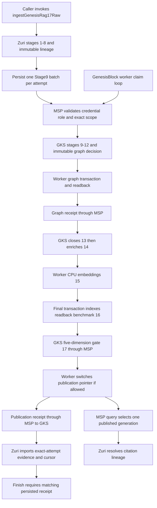

# ตรวจ flow จากโค้ดจริงเทียบ 17 stages

**ข้อสรุป: happy path เดินครบ 17 stages จริง แต่ยังไม่ตรงแบบทุกเงื่อนไข โดยเฉพาะ temporal mapping, semantic resolution, extraction และ crash recovery.** ผล acceptance เดิมยังเป็นหลักฐานว่าชุดข้อมูลที่ตรึงไว้ทำงานได้ ไม่ใช่หลักฐานว่ากรณีผิดพลาดหรือข้อมูลทุกรูปแบบถูกต้องทั้งหมด งานตรวจนี้เป็น C-3 / HIGH; ยังไม่ได้แก้ application code หรือขยาย production scope.

## ขอบเขตและ revision

ตรวจ branch `codex/ki17-integration` ใน worktree ทั้งสี่ ไม่ใช่ `main` ของ clone MSP/GKS:

| Repository | Head ที่ตรวจ |
|---|---|
| zuri | `436022a798c8bd46b9dd73904b9572790a9a8945` |
| MSP | `4707912583b800ecaa353162a1e5da7d2db7278a` |
| GKS | `373fd8d6ca09221e171e98e855fe5f519236eff7` |
| GenesisBlock worker | `022ad3d3144d40f1f33f80b53ec555bb40584799` |

อ้างอิง [spec 1.1.0b](../../docs/KNOWLEDGE-INGESTION-17-STAGE-SPEC.md), [flow 1.0.0b](../../docs/KNOWLEDGE-INGESTION-17-STAGE-FLOW.md), [wire contract 1.2.1b](../../docs/plans/GENESISRAG17-CONTRACT.md) และ [ADR-070](../../docs/decisions/ADR-070-GENESISRAG17-ISOLATED-EXECUTION-AND-PUBLICATION.md). Spec แยก current isolated profile ออกจาก product target ไว้แล้ว จึงไม่นับ PDF/OCR, LLM, full sensitivity lattice หรือ UI ใหม่เป็นข้อบกพร่องของงานรอบนี้.

## ทางเข้าที่มีจริง

ทางเข้าที่ acceptance ใช้คือ `ingestGenesisRag17Raw(input, options)` ซึ่งเป็น application/library entrypoint. มันตรวจ installation operator, ตรวจ Business → Tenant → Portfolio, สร้าง FR-071 run/attempt แล้ว execute local stages. ไม่มีการใส่ผลสำเร็จแทน stages ใน happy path.

จากการ enumerate tracked API/source files และตรวจ imports/calls: ยังไม่มี production route หรือ server bootstrap เรียก raw entrypoint/source loop ใหม่นี้. `/api/ingest/documents` เรียก [stageDocumentIntake](../../apps/server/src/app/api/ingest/documents/route.js); endpoint evidence pull เรียก [legacy importer](../../apps/server/src/app/api/pipelines/knowledge/evidence/pull/route.js). สิ่งนี้ตรงขอบเขต isolated implementation แต่ต้องไม่อธิบายว่าการอัปโหลดผ่าน UI ปัจจุบันจะวิ่งครบ 17 โดยอัตโนมัติ.

แผนภาพแสดงเส้นทางสำเร็จ การเขียน lexical index เกิดก่อน Stage13 receipt ในโค้ดจริง และ crash windows ที่ระบุด้านล่างยังทำให้เส้นทาง recovery ไม่ครบ.

## ตรวจทีละ stage

สถานะ “ตรง profile” หมายถึงตรงขอบเขตที่ตรึงไว้ ไม่ได้หมายถึง product target ทั้งหมดหรือไม่มี bug ในทุกกรณี.

| Stage | โค้ดและการทำงานจริง | ผลตรวจ |
|---|---|---|
| 1 Ingestion | [executor:775](../../apps/server/src/platform/integrations/core/genesisrag17-executor.js#L775) → `ensureCanonicalRawRecord` → `ensureRaw`; บันทึก RawExternalRecord/KnowledgeRawArtifact ก่อน terminal | ตรง profile; แต่การ resume อัตโนมัติก่อนมี batch ยังขาด |
| 2 Parse | [ensureParsedArtifact:477](../../apps/server/src/platform/integrations/core/genesisrag17-executor.js#L477) → [parseGenesisRag17Document](../../apps/server/src/modules/knowledge/genesisrag17-source.js#L68); เก็บ exact text, structure, parser version | ตรง text/Markdown profile; helper คำนวณ candidate chunks ด้วย แต่ยังไม่ persist chunks |
| 3 Provenance | [executor:793](../../apps/server/src/platform/integrations/core/genesisrag17-executor.js#L793) ตรวจ raw/parsed แล้วเก็บ digest/IDs; [resolver:588](../../apps/server/src/platform/integrations/core/genesisrag17-executor.js#L588) เดิน parent links และตรวจ chunk substring/hash | ตรง profile; page/cell/OCR mapping ยังเป็นงานต่อยอด |
| 4 Normalize | [executor:814](../../apps/server/src/platform/integrations/core/genesisrag17-executor.js#L814) เรียก normalizeValue(kind=text) แล้วเก็บ canonicalHash/rawHash | ตรง profileขั้นต่ำ; ไม่ส่ง canonical text ไปแทนข้อความที่ chunk/extract ใช้ |
| 5 Classification | [executor:823](../../apps/server/src/platform/integrations/core/genesisrag17-executor.js#L823) เก็บ scope และ allowEmbedding/allowPublication | ตรงสอง-flags profile; ไม่ใช่ automatic PII/sensitivity classification เต็มรูปแบบ |
| 6 Dedup/version | [executor:833](../../apps/server/src/platform/integrations/core/genesisrag17-executor.js#L833) compare prior same-scope sources แล้วเก็บ relationship/counts; correction สร้างแถวใหม่ | ตรง profile; ไม่ persist SUPERSEDES edges ที่ helper คำนวณ |
| 7 Chunk | [ensureChunks:502](../../apps/server/src/platform/integrations/core/genesisrag17-executor.js#L502) เรียก parser helper อีกครั้ง ตรวจ exact UTF-16 spans/hash/ordinal แล้ว persist | ตรง profile; default 80 whitespace tokens, ไม่มี chunker version แยกจาก parser |
| 8 Mentions | [extractGenesisRag17Mentions](../../apps/server/src/modules/knowledge/genesisrag17-source.js#L138) เก็บทุก occurrence; [executor:860](../../apps/server/src/platform/integrations/core/genesisrag17-executor.js#L860) รายงานจำนวน chunks/mentions | แยก occurrence ได้จริง แต่ regex สร้าง Person ปลอมใน compound sentence; failure metrics ไม่ตรงจำนวน input |
| 9 Resolve | [GKS service:341](https://github.com/Freshair129/Genesis-Knowledge-System/blob/373fd8d6ca09221e171e98e855fe5f519236eff7/packages/gks-core/src/index.mjs#L341) ตรวจ batch/hash, lookup canonical refs แล้ว [group mentions:163](https://github.com/Freshair129/Genesis-Knowledge-System/blob/373fd8d6ca09221e171e98e855fe5f519236eff7/packages/gks-core/src/pipeline.mjs#L163) | ไม่ตรง type-conflict semantics: key เดียวต่าง semantic type ถูก merge; timing ไม่รวม canonical lookup |
| 10 Facts | [GKS:192](https://github.com/Freshair129/Genesis-Knowledge-System/blob/373fd8d6ca09221e171e98e855fe5f519236eff7/packages/gks-core/src/pipeline.mjs#L192) structured .85 → explicit .90 → inferred .70/HELD | confidence/floor ตรง แต่ subject binding และ negation บางรูปสร้าง verified fact ที่ผิด |
| 11 Ontology | [GKS:230](https://github.com/Freshair129/Genesis-Knowledge-System/blob/373fd8d6ca09221e171e98e855fe5f519236eff7/packages/gks-core/src/pipeline.mjs#L230) map synonyms, ตรวจ WORKS_FOR Person→Organization และ PURCHASED Person/Organization→Product | ตรง profile แต่แก้ semantic identity ที่ผิดมาจาก 9/10 ไม่ได้ |
| 12 Temporal | [temporalClaim:120](https://github.com/Freshair129/Genesis-Knowledge-System/blob/373fd8d6ca09221e171e98e855fe5f519236eff7/packages/gks-core/src/pipeline.mjs#L120), [apply:257](https://github.com/Freshair129/Genesis-Knowledge-System/blob/373fd8d6ca09221e171e98e855fe5f519236eff7/packages/gks-core/src/pipeline.mjs#L257); regex ISO dates จาก chunk | ไม่ตรง: unmapped ถูกทำเป็น not_applicable และ reversed interval ทำให้ throw ReferenceError |
| 13 Graph | [worker:1659](https://github.com/Freshair129/GenesisBlock/blob/022ad3d3144d40f1f33f80b53ec555bb40584799/genesisrag17-worker/src/worker.mjs#L1659) graph commit/readback → graph receipt → GKS ตรวจ counts/hash/identity แล้วจบ stage | ลำดับ receipt ตรง; lexical.put เกิดที่ 1685 ก่อนจบ13 และ commit→receipt crash gap ยังไม่ recover ครบ |
| 14 Enrich | [GKS:374](https://github.com/Freshair129/Genesis-Knowledge-System/blob/373fd8d6ca09221e171e98e855fe5f519236eff7/packages/gks-core/src/pipeline.mjs#L374) distinct document/chunk/fact counts ต่อ entity; [service:396](https://github.com/Freshair129/Genesis-Knowledge-System/blob/373fd8d6ca09221e171e98e855fe5f519236eff7/packages/gks-core/src/index.mjs#L396) หลัง graph receipt | ตรง enrich_v1; derived/hash แยกจาก immutable decision และ verified facts |
| 15 Embed | [worker processDecision](https://github.com/Freshair129/GenesisBlock/blob/022ad3d3144d40f1f33f80b53ec555bb40584799/genesisrag17-worker/src/worker.mjs#L1730) → pinned Python embedder; chunk vectors 384d cosine | ตรง profile; actual CPU E5 และ artifact verification, policy deny เป็น failure |
| 16 Index | [worker:1801](https://github.com/Freshair129/GenesisBlock/blob/022ad3d3144d40f1f33f80b53ec555bb40584799/genesisrag17-worker/src/worker.mjs#L1801) final tx, flush/checkpoint, readback, benchmark, six-lane receipt | happy path ตรง; final native commit→durable receipt มี recovery gap; lexical ถูกเขียนก่อนหน้านี้แล้ว |
| 17 Gate/publish | [GKS gate:412](https://github.com/Freshair129/Genesis-Knowledge-System/blob/373fd8d6ca09221e171e98e855fe5f519236eff7/packages/gks-core/src/pipeline.mjs#L412) → [worker pointer:1887](https://github.com/Freshair129/GenesisBlock/blob/022ad3d3144d40f1f33f80b53ec555bb40584799/genesisrag17-worker/src/worker.mjs#L1887) → publication receipt → [zuri import:145](../../apps/server/src/platform/integrations/core/genesisrag17-importer.js#L145) → [finish guard](../../apps/server/src/platform/integrations/core/genesisrag17-publication.js#L56) | PASS+receipt path ตรง; conditional pointer fallback ไม่ atomic และ WARN publication path ไม่ครบ |

## Boundary ที่ตรวจข้าม repo

MSP ไม่มี stage เป็นของตัวเอง. [Handler](https://github.com/Freshair129/Memory-and-Soul-Passport/blob/4707912583b800ecaa353162a1e5da7d2db7278a/apps/msp-server/src/transport/handlers/pipeline-handlers.mjs#L6) ตรวจ runtime credential/role/scope ก่อนส่งต่อ ลบ caller actor/credential/principal แล้วใส่ authenticated principal จาก runtime grant. Query ไป worker loopback ด้วย token แยก; GKS เป็น passive authority. [Contract validator](https://github.com/Freshair129/Memory-and-Soul-Passport/blob/4707912583b800ecaa353162a1e5da7d2db7278a/packages/msp-contracts/src/contracts/pipeline.mjs#L51) ตรวจ scope รวม nested envelopes และ response.

[Zuri importer](../../apps/server/src/platform/integrations/core/genesisrag17-importer.js#L175) หา step/attempt จาก identity ที่ส่งมาและ batch เดิม ไม่เลือก “ล่าสุด”. ทั้ง page และ cursor commit ใน transaction ที่ [283](../../apps/server/src/platform/integrations/core/genesisrag17-importer.js#L283). [Finish](../../apps/server/src/platform/integrations/core/knowledge-ingestion-executor.js#L661) ต้องมี matching receipt จริงที่ zuri เก็บแล้ว ไม่รับ gate PASS อย่างเดียว.

Query หลัง ingestion: [queryGenesisRag17](../../apps/server/src/platform/integrations/core/genesisrag17-worker.js#L27) → MSP → [queryPublished](https://github.com/Freshair129/GenesisBlock/blob/022ad3d3144d40f1f33f80b53ec555bb40584799/genesisrag17-worker/src/worker.mjs#L2052) อ่าน pointer หนึ่งครั้ง เลือก generation ใน published history → คืน citation IDs/hash. การ resolve lineage เต็มเป็นการเรียก [resolveGenesisRag17RawLineage](../../apps/server/src/platform/integrations/core/genesisrag17-executor.js#L588) อีกครั้ง ไม่ได้เกิดอัตโนมัติจาก query response validator.

## ข้อค้นพบที่ต้องแก้

| ลำดับ | ผลกระทบและสาเหตุที่ยืนยัน | หลักฐาน |
|---|---|---|
| P1: temporal crash | `Alice purchased Atlas from 2026-09-08 to 2026-09-01.` → `ReferenceError: predicate is not defined` ที่ Stage12. build decision ล้มก่อน transactPipelineSubmit จึงไม่มี terminal ผล Stage12 ส่งกลับ และ source batch ยังรอ retry | [actual parser→GKS probes](genesisrag17-audit-source-to-gks.json); GKS pipeline:263 / service:347–349 |
| P1: wrong facts | `Alice works for neither Acme Limited nor Beacon Limited.` กลับได้ Alice WORKS_FOR Acme ที่ .90. `Alice works for Acme Limited and purchased Atlas.` สร้าง Person ชื่อ `Acme Limited and` แล้ว assert ว่าคนนี้ซื้อ Atlas ที่ .90 | probe เดียวกัน; Stage8 regex + GKS nearestMention/negation:103–117 |
| P1: recovery หลัง native commit | graph/final tx ใช้ stable transaction ID แต่ expected_frontier อ่านใหม่ทุก retry. หาก crash หลัง commit แต่ก่อน durable receipt, retry เปลี่ยน payload ของ ID เดิม; Rust ตรวจ full payload hash แล้ว reject. Hook test ชื่อ after-native-commit-before-receipt อยู่หลัง receipt/state/outbox ถูกเขียนแล้ว จึงไม่ครอบคลุมช่องว่างจริง | worker:1128–1144,1686–1707,1827–1857; native src/lib.rs:6527–6544 |
| P1: pointer fallback | เมื่อ rename แรกได้ EEXIST/EPERM/ENOTEMPTY โค้ดย้าย pointer เดิมไป backup แล้วจึงย้าย temp เป็น pointer. มีช่วงที่ pointer ไม่มีอยู่; process death ตรงกลางไม่เข้า catch เพื่อ restore. ไม่ได้หมายความว่า rename ปกติบน Windows ล้มทุกครั้ง | [focused probe](genesisrag17-audit-boundary-probes.json); worker:424–449 และ readPointer:2015–2017 |
| P2: semantic type collision | `Atlas purchased Atlas.` มี Person/Product occurrence แยกจริง แต่ Stage9 รวมเป็น Person เดียว ทำให้ Stage11 HELD invalid_endpoint แทนสอง canonical identities หรือ explicit type conflict | actual parser→GKS probes; pipeline:172–190 |
| P2: unmapped ถูกตีความเป็น NA | ไม่มี ISO date รวมถึง `on 7 September 2026` → validFrom/validTo=not_applicable เช่นเดียวกับ explicit no-temporal-claim. แบบกำหนดให้แยก unknown/unmapped/NA | actual parser→GKS probes; pipeline:120–133 |
| P2: resume ก่อน batch | source loop สแกนเฉพาะ GenesisRag17Batch. Crash ใน 1–8 ก่อน persistBatch ไม่มี queue row ให้ loop รับช่วงต่อ; ต้องให้ caller เรียก ingest ซ้ำเอง | executor:748–767,881–883; source worker:41–52,60–73 |
| P2: metric attribution | failure wrapper ให้ records_in=1 ทุก local stage แม้ Stage8 รับแปด chunks. Stage9 timer เริ่มหลัง asynchronous canonical lookup จึงไม่รวม lookup ใน duration | focused probe; executor:316 / GKS index:346–355, pipeline:170–190 |

ช่องว่าง recovery อีกจุดอยู่หลัง GKS รับ graph receipt: worker ลบ outbox ที่บรรทัด1717 ก่อน persist derived/graph_receipt_written ที่1718–1721. หาก process ตายตรงกลาง restart ไม่มี outbox และไม่มี derived ใน local state จึงเข้า graph commit ซ้ำและพบ transaction identity conflict แบบเดียวกัน. ข้อนี้ยืนยันจาก control flow ยังไม่ได้รัน native process-kill probe.

ข้อค้นพบและการป้องกันอยู่ใน [RCA](../rca/2026-09-08-genesisrag17-code-flow-audit.md). Recovery findings ไม่ได้อ้างว่ารัน complete crash-matrix ใหม่ทุกจุด; แยก static trace, focused fault simulation และ historical native proof ตามหลักฐานของแต่ละข้อ.

## ข้อจำกัดและความไม่สอดคล้องที่ต้องตัดสินก่อนต่อขยาย

- **WARN:** GKS สร้าง WARN ได้เมื่อมี HELD แต่ allowPublication ปัจจุบันเป็น true เฉพาะ PASS. Worker รองรับ PASS/WARN ที่ allow=true; GKS publication persistence และ zuri importer/finish รับเฉพาะ PASS. จึงยังไม่มี WARN+publish path ที่ใช้ได้ครบ chain. นี่เป็น fail-closed behavior และความตึงระหว่าง spec/wire/profile ไม่ใช่หลักฐานว่า worker ปัจจุบัน publish WARN แล้ว zuri ค้างเสมอ.
- **Pending acknowledgement:** wire ยอมให้ submit ตอบ decisionId=null/PENDING และ ingest ครั้งแรกรับได้ แต่ resumeGenesisRag17Worker ปฏิเสธ response นี้. GKS ปัจจุบันสร้าง decision แบบ synchronous จึงไม่ใช่ failure ปกติของ happy path; ต้องแก้ก่อนเพิ่ม async processing.
- **Stage13/16:** lexical.put ทำงานในช่วง13 แม้แบบแบ่ง indexing ไว้16. Candidate ยังไม่ query-visible จึงยังไม่ใช่ partial publication แต่ stage accounting/order ไม่ตรงทุก operation.
- **Stage2/7 versioning:** parser helper คำนวณทั้ง structure/chunks, parsed metadata มี chunkCount, และ identity ผูก parserVersion. การเพิ่ม chunk configuration ต้องออกแบบ derivation/version identity ร่วมกัน ไม่ใช่เปลี่ยน maxTokens แล้วคาดว่าจะ replay เป็น artifact ใหม่ได้เอง.
- **Stage8 recognizer:** รับ custom recognizer ได้แต่ evidence ระบุ rule_v1 เสมอ และ resume สร้าง mentions ใหม่ใน memory. ต้องมี version/provenance และ durable occurrence output ก่อนขยาย beyond fixed default.
- **Stage12 metadata:** batch ไม่มีช่อง temporal source metadata โดยตรง; ปัจจุบันอ่านได้จาก chunk text เท่านั้น. Native temporal API limits เป็นข้อจำกัดที่อนุมัติแล้ว แต่ไม่ได้อนุญาตให้ unmapped กลายเป็น not_applicable.
- **Six lanes:** lexical เป็น worker SQLite FTS5, vector เป็น native E5 collection, graph/SQLite/provenance ตรวจ physical readback; temporal เป็น applicability/API-dependent. ไม่ใช่หลักฐานว่ามี general six-lane query planner/reranker/LLM answer ครบแล้ว.

## หลักฐานการตรวจรอบนี้

อ่าน code/contracts/tests ของทั้งสี่ head และเทียบ stage dataflow; ตรวจ raw output จาก [PR native chain เดิม](genesisrag17-pr-native-chain.json) ซึ่งมี 17 terminal rows จริง. รัน focused probes ใหม่จากโค้ดจริง:

1. actual zuri parser/mention extraction → GKS decision builder, หก input cases; ไม่มี database และไม่มีการใส่ successful stage rows. ผลใน [JSON](genesisrag17-audit-source-to-gks.json).
2. source-function probes สำหรับ failure metrics, Pending/null acknowledgement และ WARN rejection ใช้ dependency stubs; conditional pointer probe ใช้ไฟล์สังเคราะห์และ inject EPERM ที่ rename แรก แล้วสังเกตว่าระหว่างสอง rename ไม่มี pointer. ไม่ใช่การ kill process จริง. ผลใน [JSON](genesisrag17-audit-boundary-probes.json).

ตรวจเอกสารรอบนี้: `npm run govern` ผ่าน (0 critical, 0 warning, 22 info เดิม); ตรวจ Markdown link targets 531 แห่ง ไม่พบ missing target. Generated domain-state สองไฟล์เปลี่ยนเฉพาะ generatedAt จึงคืน timestamp เดิม; ไม่มี semantic graph changes.

ไม่ได้รัน full 17-stage native suite ใหม่ในงาน audit นี้; ผล 17/17, build และ tests จากรอบ PR preparation ยังมี revision ของตัวเองใน [รายงานเดิม](GENESISRAG17-PR-READINESS.md). จำนวน **17 tests** คือ 17 scenarios ไม่ใช่หนึ่ง test ต่อหนึ่ง stage. Happy-path test ตรวจหนึ่ง run ครบ17; negative cases ครอบคลุมเฉพาะจุดที่เขียน assertions ไว้.

ข้อจำกัดสำคัญของ acceptance: corpus มีแปดประโยค employment/purchase ที่ง่ายและไม่มี temporal dates; parity tests เป็น helper parity ไม่ได้ทดสอบการ route วันที่ผ่าน Stage12 builder; crash hook ไม่อยู่ในทุก commit boundary; metric assertions ตรวจ nonnegative แต่ไม่ได้ reconcile ทุกค่ากับ actual work. Native setup มี tenant ที่มีข้อมูลหนึ่งราย ดังนั้น wrong-scope denial และ leak count=0 ยังไม่ใช่ populated two-tenant isolation test.

## ลำดับแก้ที่เสนอ

1. เพิ่ม failing regression fixtures สำหรับ semantic types, negation/compound subjects, unmapped/reversed dates และ actual failure counts; ตรึง expected outputs ก่อนแก้8–12.
2. ตรึง durable transaction intent/receipt recovery ของ13/16 และ pointer replacement ของ17 พร้อม kill tests ภายในช่องว่างจริง; ย้ายหรืออธิบาย ownership ของ lexical write ให้ตรง stage.
3. ตัดสิน WARN/pending semantics และ Tier1 pre-batch recovery contract; เพิ่ม source loop recovery ก่อนมี batch.
4. รัน complete native chain ใหม่ รวมหลาย tenant ที่มีข้อมูลจริงและ boundary fault matrix; ทบทวนรายงาน acceptance ก่อนถือว่าตรงแบบครบทุกเงื่อนไข.

งาน audit นี้เพิ่มรายงาน/RCA/หลักฐานเท่านั้น ไม่ได้เปลี่ยน contract, requirement IDs, runtime code หรือผล historical acceptance.

## CHANGELOG

| Version | Date | Status | Summary | Commit Hash | Agent |
|---|---|---|---|---|---|
| 1.0.0b | 2026-09-08 | under review | First code-level 17-stage conformance audit, counterexamples and recovery boundaries | audited zuri 436022a7 | RWANG |
