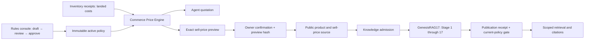

# FR-252 Pricing engine and rules console — local implementation report

Date: 2026-09-17. Complexity: C-3. Risk: HIGH (cross-domain pricing, authorization and additive schema).
Owner approval: Boss approved the proposed pricing engine, formula/variable editor and governed catalog-to-GenesisRAG17 integration in this task.
Branch: `codex/pricing-rules-engine-20260917`, based on `fb4b047a`. Changes are uncommitted in an isolated worktree.

## Delivered behavior

Commerce owns one deterministic pricing engine. `/commerce/pricing-rules` lets a Business OWNER import the approved source policy, edit typed formulas/variables, compare all quantity tiers, save a concurrency-checked draft, approve an immutable version and clone it for the next change. Mandatory price floors and rounding remain enforced outside editable formulas. Expressions use a bounded arithmetic parser, not executable code.

The existing Agent inventory quotation path calls that engine and fails closed without an active approved policy. Ledger receipt costs are already landed; they do not receive the default factory truck charge again. Explicit additional delivery is identified separately. Incomplete costs and invalid customization positions fail closed.

The catalog panel selects an Inventory SKU and quantity breaks, computes exact sell prices from ledger receipts, then requires explicit confirmation of the server preview hash. A rule or ledger change invalidates confirmation. Frozen retries preserve the approved content. Simulation inputs cannot become catalog evidence.

The allowlisted product and sell-price records enter the existing Knowledge source admission before Stage 1. Costs, margins, rules and private ledger/calculation evidence remain inside Commerce. Current-policy checks at Knowledge admission, publication and disclosure reject expired, revoked or superseded prices. `ADMITTED / NOT_VERIFIED` remains distinct from a Stage 17 publication receipt.

## Verification

| Check | Evidence/status |
|---|---|
| Engine policy, formula safety, exact money and legacy vectors | 90 tests passed; 53 captured legacy Python/browser vectors across 8 scenarios, with deliberate differences documented in fixtures |
| Rules/API/catalog/backup/publication checks | PASS; included in the final full regression run |
| Full Server regression suite | PASS exit 0: 6,136 tests passed, 32 existing skips; 723 files passed, 6 skipped; [log](fr252/full-verified.log) |
| Next.js production build | PASS locally; no deployment |
| Browser | PASS: 201 executed/passed, 4 existing skips, zero failures/flaky; includes final exact-price review and confirmation, persistence/immutability and outsider refusal; [log](fr252/e2e-final.log) |
| Native 17-stage regression | 36/36 PASS with pinned native runtime; [log](fr252/native-36-passed.log), [chain](fr252/native-regression-chain.json) |
| Final computed ledger catalog native proof | PASS 1/1 executed (10 unrelated cases excluded by filter); product and price each completed 17 stages, produced 1 publication receipt and passed real query/citation checks; [receipt and citation evidence](fr252-computed-catalog-native.json), [log](fr252/native-computed-final.log) |
| SQLite additive migration smoke | PASS (integrity and foreign keys); test databases only |
| PostgreSQL | Client generated and migration authored; migration NOT_EXECUTED |
| Governance | PASS exit 0; 0 critical, 1 existing warning from synthetic FR-500/501/502/503/999 test annotations; [log](fr252/govern-final.log) |

The earlier broad test run occurred while source was being finalized and found registry counts/navigation expectations and backup restore failures. The next frozen-source run passed 6,135 tests but exposed one deterministic shared-queue fixture interference. The new catalog fixture left three runnable ingestion rows; cleanup is now scoped to that fixture's Business. The exact seven-file reproduction changed from 79 passed/1 failed to 80/80 passed without altering production scheduling, assertions or timeouts. See [RCA](../rca/2026-09-17-pricing-catalog-test-queue-isolation.md), [before](fr252/queue-before.log), [after](fr252/queue-after.log) and [full-run diagnostic](fr252/full-before-fixture-cleanup.log). The final full rerun passed all 6,136 executed tests.

An initial native run used an obsolete companion checkout; the [RCA](../rca/2026-09-17-pricing-native-runtime-selection.md) records the protocol mismatch and corrected pinned-runtime selection. No gate was weakened. Saved evidence logs normalize trailing whitespace only.

## Runtime provenance and limits

Architecture review checked parent/peer ownership, exact arithmetic and landed-cost semantics, OWNER scope, stale browser responses, immutable preview/confirmation, public projection allowlist, and current-policy disclosure gates. No material findings remain in those reviewed implementation paths. The shared-worker fairness finding described in the fixture RCA remains outside this pricing slice; no scheduler behavior was changed.

Native acceptance uses separate local MSP, GKS and Genesis processes, Windows native retrieval and local multilingual-e5-small embeddings. The Genesis runtime is an isolated archive of deployment pin `7c9261c4a4d4193af4e2613db48896533eb28072`; the available native artifact SHA-256 is `108c1fca91be9179ff7c70cd968cb30249e5b8b6415d6035cb4d963e6ed22347`. This is isolated synthetic receipt/ledger acceptance, not a production customer catalog or Linux deployment result.

No production migration, production policy activation, live source cutover, legacy-store retirement, commit, PR or deployment has been performed. Production release requires the operator gates in ADR-057/075. The source-library clarification sent to task “ตรวจสอบสถานะระบบไฟล์” was separately authorized by Boss and does not create an additional implementation request.

Verified browser screenshots: [price review before confirmation](../../apps/server/output/playwright/fr252-pricing-catalog.png), [simulation and quantity tiers](../../apps/server/output/playwright/fr252-pricing-preview.png), [formula comparison](../../apps/server/output/playwright/fr252-pricing-rules.png). These screenshots show isolated synthetic test data.

## Version diff

- Added FR-252 and ADR-097; accepted feature note `0.1.0b → 1.0.0b`.
- Commerce charter `1.1.1b → 1.2.0b`; ADR-075 `1.3.0 → 1.3.1b` narrowly updates pricing execution ownership while retaining source admission before Stage 1.
- Added 2 models, 6 API route handlers / 7 operations, and 1 Business page. API inventory now 295 handlers / 394 operations.
- Formula execution and sell-side projection move into Commerce; GenesisRAG17 stage meanings remain unchanged.

Related root causes: [ledger cost boundary](../rca/2026-09-17-pricing-ledger-cost-boundary.md), [catalog identity](../rca/2026-09-17-pricing-catalog-identity.md).
