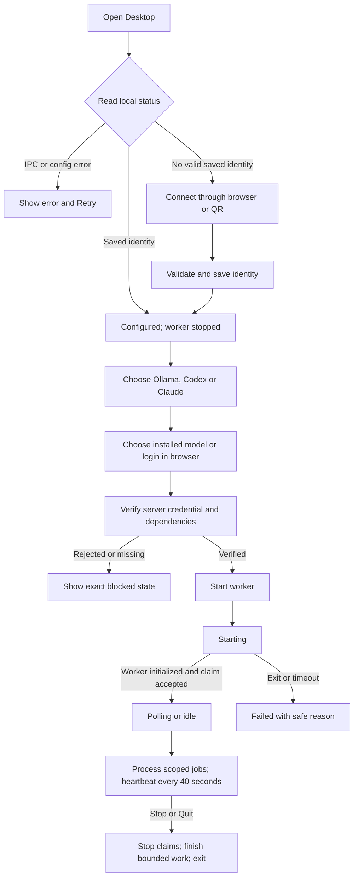

# Zuri Edge Device — Native Desktop Runtime & Multi-Lane Intelligent Node

## 1. Purpose, authority and evidence

Owner-approved update: the primary pairing flow is **Connect Zuri -> browser or
QR -> login -> select Business -> confirm -> automatic Desktop handover**.
See the [FR-144 browser/QR contract](../../../docs/domains/identity/features/FR-144-edge-device-credential.md#browser-and-qr-pairing--owner-approved-2026-09-08).
JSON import below is an advanced compatibility path. The next owner instruction,
"จัดการทั้งหมดแบบขนาน ใช้ luna max เป็นworker", approves completing browser login
for model providers, Ollama configuration and the supervised worker/package in
sections 6-10. Implementation approval is distinct from installed-device or
production acceptance; the 0.2.1 evidence below covers the earlier pairing slice.

The Desktop window is a Tauri application backed by Rust. The older local web
console at `:8787/gui` belongs to the explicitly selected legacy webhook process.
Neither a visible window nor a saved pairing file establishes worker readiness.

This revision replaces ambiguous present-tense capability claims with an observed
baseline and implemented contracts. Review baseline: `b17e7258`,
2026-09-08. The earlier pairing slice was implemented locally as Desktop 0.2.1;
[verification and limits](../../../docs/domains/identity/features/FR-144-edge-device-credential.md#local-implementation-evidence--2026-09-08)
record that historical Windows build and its tests. Desktop 0.3.0 adds the provider
and worker flow below. Production activation remains a separate acceptance gate.

Parent decisions: [ADR-041](../../../docs/decisions/ADR-041-ZURI-EDGE-DEVICE-TOPOLOGY.md),
[ADR-061](../../../docs/decisions/ADR-061-SERVER-LINE-AND-OPTIONAL-EDGE.md) and
[ADR-062](../../../docs/decisions/ADR-062-ZURI-SERVER-EDGE-MONOREPO-BOUNDARY.md).
ADR-061 owns current LINE transport; Desktop never starts legacy ingress as a
side effect of pairing. Root global requirement IDs retain their subjects.

Peer contracts:
[optional execution](SERVER-LINE-OPTIONAL-EDGE.md),
[FR-150-P2](../../../docs/domains/agent/features/PHASE-FR-150-P2-optional-edge-execution.md),
[heartbeat registry](../../../docs/domains/agent/features/FR-141-edge-device-heartbeat-registry.md).
The heartbeat note includes historical limitations; the current device-authenticated
route is the wire authority. Preserve existing device credentials and Business isolation.

[RCA and source evidence](../../../.brain/rca/2026-09-08-edge-desktop-runtime-contract-gap.md).

## 2. Observed implementation, not a completion checklist

| Area | Evidence at baseline | Required correction |
|---|---|---|
| Desktop shell | `src-tauri/tauri.conf.json` loads `public/index.html` | Identify this as Desktop; distinguish it from legacy web UI |
| Pairing import | Console exports `apiBaseUrl`; Rust only reads `cloudBaseUrl/cloud_base_url` | Consume the actual exported file; never silently retain localhost or a prior origin |
| Pairing status | Non-empty key sets `is_paired`; UI labels it PAIRED / READY | Saved credentials, server acceptance and execution readiness are separate |
| Status loading | Missing IPC returns mock success; load errors only reach console | Show loading/error/unavailable; never display a guessed pairing state |
| Heartbeat | Rust sends only on command and hardcodes healthy | Use observed runtime health; establish one periodic sender |
| Worker | Rust entrypoint registers commands but starts no worker | Supervise the existing TypeScript conversation executor |
| CLI diagnostic | Executes `--version`; UI always selects Codex; nonzero exit can be success | Report presence/version only, honor selected allow-listed CLI, bound duration |
| Updates/release | Update check exists; workflow builds/uploads a Rust exe only | Verify what is packaged; do not claim installed updates or bundled runtime without proof |

The existing Node `conversation serve` already polls scoped jobs and runs a
40-second heartbeat. Its source existence does not mean the Desktop launches it
or the released exe contains Node and its dependencies.

## 3. Scope and risk

Classification: **C-3**, architecture-driven implementation. Risk: **HIGH** because
local credentials, child-process ownership and release packaging are involved.

Assumption for review: "fix it" means repairing the Desktop operational flow,
including its connection to the existing optional worker, rather than implementing
every aspirational ingest lane from revision 1.0.0b.

Deliver in two ordered slices, both part of this proposal:
1. Correct pairing, status, diagnostics and claims; prove failure behavior.
2. Connect and package the existing worker; prove lifecycle, heartbeat and release.

No new LINE transport, MSP/GKS store, model fallback, database migration, OCR
engine, catalog scheduler or daily digest is introduced. Those broader capabilities
require their own approved contracts and implementation evidence. External model
execution remains subject to server policy and existing local containment.

## 4. User flow and state model

Show distinct fields:
- Configuration: LOADING, UNCONFIGURED, CONFIGURED, LOAD_ERROR.
- Server verification: UNVERIFIED, VERIFIED, REJECTED, UNREACHABLE; show last
  verification time, and never restore VERIFIED from a persisted boolean.
- Worker: STOPPED, STARTING, RUNNING, STOPPING, FAILED, or EXTERNAL_UNVERIFIED.
- Execution capability: AVAILABLE, DEGRADED or POLICY_BLOCKED, with a safe reason.
- Heartbeat: last attempt, last accepted time and reported health; timestamps
  display local timezone. Acceptance is not proof of model execution or LINE delivery.

RUNNING requires an initialized worker and an accepted claim response (including
204 idle), not just a PID. RUNNING may coexist with a blocked capability. A CLI
version check cannot set capability AVAILABLE. The existing stateless Codex
`LOCAL_POLICY_UNAVAILABLE` restriction remains enforced.

UI offers Import, Verify connection, Start, Stop, Retry status, Check selected CLI,
and a truthful update-check result. Prevent overlapping operations. Browser-only
preview disables native actions and clearly identifies unavailable native runtime.

## 5. Pairing contract and credential custody

Consume the actual Console export from `/platform/integrations`:
`deviceId`, `key`, `apiBaseUrl`, optional Business display metadata.
Keep documented legacy aliases `cloudBaseUrl/cloud_base_url`, `device_id`,
`token/device_key`. Conflicting alias values are rejected, not silently preferred.

Require a nonempty bounded device ID, credential and explicit origin. Validate
HTTPS except explicit loopback development; refuse URL credentials, paths other
than '/', queries, fragments and redirects. Set connection/overall timeouts.
Business authority comes from the server credential; display metadata cannot
choose tenant or Business scope. Invalid or partial files do not modify memory
or the previous saved configuration.

Validate a complete candidate, persist atomically, then replace in-memory state.
Store the key using Windows user-bound DPAPI protection; return only a redacted
status DTO to the webview. Import success means configuration saved. Verify with
the existing authenticated heartbeat route, reporting unavailable while no worker
is ready; only server acceptance sets VERIFIED.

Support migration of the Desktop's own old `edge-config.json` after a successful
protected write; report failure without discarding the old identity. Never import
or inspect the installed legacy checkout's `.env`. Do not infer a new server
origin for an old configuration that may have ignored `apiBaseUrl`; require the
operator to re-import the actual export or explicitly confirm its origin.

No credential in logs, diagnostic errors, status DTOs, process arguments, source
control or packaged artifacts. Hand the decrypted key only to the owned worker
via an inherited private pipe before loading its configuration. Child environment
and cwd are controlled; it must not discover a checkout's dotenv or LINE secrets.

## 6. Worker integration and ownership

Reuse `src/conversation/worker.ts`, its client/executor and existing lease/retention
policy. Add a small Desktop worker entrypoint, not a second answer engine.
Supervisor uses the packaged absolute Node path and a fixed entrypoint with
`shell=false`; pairing files, jobs and UI payloads cannot supply commands.

Map validated settings to `ZURI_AGENT_DEVICE_ID`, `ZURI_CLOUD_BASE_URL` and the
worker's credential configuration. Force SERVER transport. Local model/CLI settings
are explicit operator settings; do not enable external execution by default or
bypass the current Codex containment. Use the application's own data directory.
Probe declared loopback RAG/model prerequisites with bounded requests; do not start,
stop or reinstall unrelated Ollama, RAG, MSP, GKS or legacy services.

Use an owned private control channel with versioned bounded messages: initialize,
ready, claim result, heartbeat result, stop and safe failure code. Do not stream
question/answer text, credentials or raw CLI output into the GUI. Ignore malformed
events as errors; a readiness timeout must fail visibly.

Start is idempotent. Use a per-user/device lock across managed worker entrypoints.
For a detected existing external worker, show EXTERNAL_UNVERIFIED and do not adopt
or terminate it by guessed PID. Lock scope is not proof that older uncoordinated
processes are absent; initial installed-device activation checks existing launchers
and observed processes before enabling Start.

Stopping first prevents new claims, then waits for the current lease-bounded
operation. Grace deadline is bounded by remaining execution budget plus completion
timeout. If forced termination is required, terminate only the owned Windows
process tree; leave any unsettled lease to server recovery, never replay a send.
Changing pairing identity requires worker stop before replacement.

Closing the application means graceful stop and Quit in this remediation. Minimize
keeps the application running. Do not imply that initializing an autostart plugin
enabled login launch; login autostart, tray persistence and auto-restart are not
enabled implicitly by this change.

## 7. Heartbeat ownership and readiness

The managed Node worker owns the periodic heartbeat while running, using the
existing 40-second default and 120-second server liveness window. Desktop renders
its safe events; manual heartbeat requests are serialized through the same sender.
No competing Rust timer reports healthy over a degraded worker.

When stopped, Verify connection may send one bounded authenticated heartbeat with
status unavailable; successful authentication does not change worker state.
RAG/model probe failure reports degraded or unavailable as appropriate; do not
mask it with a successful network round trip. Preserve separate execution-policy
status so server health is not advertised as "Codex can answer".

Network errors use the existing bounded worker backoff and expose stale status.
401/403/404 or incompatible job contracts stop execution and require operator
correction. A saved last-success timestamp survives as history only.

## 8. Packaging and release truth

Package a Windows artifact containing Desktop exe, pinned compatible Node runtime,
compiled worker, production dependencies (including native modules), required
non-secret resources and a checksum manifest. Build native dependencies for the
same Windows architecture/Node ABI. Resolve resources from the package location,
never from the developer checkout or system PATH.

Use a portable zip for the complete runtime in this slice. A raw Rust exe is a
control-shell artifact until the companion resources have been packaged and tested;
`cargo build` alone does not produce an MSI installer. Do not advertise npm
`@zuri/edge` installation without a verified published package.

Release notes enumerate proven capabilities and verification limits. Updater
availability is shown only for a valid signed feed with corresponding artifacts;
otherwise report unavailable. A check is not an installed update. Full signed
installer/update distribution is a separate release prerequisite, not a mocked
success in the UI.

No production LINE webhook change, installed scheduled-task migration, device
pairing or real job execution occurs merely because a candidate package builds.

## 9. Acceptance and implementation order

| Gate | Required evidence |
|---|---|
| Export/import contract | Synthetic export using the real Console producer is accepted by production Rust parser, uses apiBaseUrl, and retains device identity |
| Invalid input | Missing/conflicting fields, unsafe URLs, corrupt config and failed writes leave prior identity intact; errors never expose keys |
| GUI state | Slow/rejected IPC and browser preview display unavailable/error, never mock success or default NOT PAIRED |
| Pairing verification | Correct key, wrong device, revoked key, timeout, redirect and DNS failure have distinct results; no READY from import |
| Lifecycle | Real owned child starts, reports readiness, remains single on repeated Start, stops gracefully, handles crash and restart without orphan or unrelated kills |
| Heartbeat | Immediate and periodic accepted ticks use one sender; stopped/unhealthy dependencies cannot report healthy; time and stale behavior verified |
| Executor regression | Existing LOCAL_ONLY, Codex containment, no retention, lease expiry, ambiguous completion and no-direct-LINE tests continue passing |
| Diagnostics | Selected allow-listed CLI, nonzero exit, missing binary and timeout tested; presence is not authentication or permission |
| Release | Windows package runs with no developer checkout or globally installed Node; missing/tampered assets fail visibly |
| CI | PR workflow runs Rust command tests plus Desktop/worker contract and UI tests; release workflow gates packaging on those tests |

Implement command tests against actual production functions, not a duplicate parser
inside a test module. Add the shared pairing producer fixture without copying real
downloaded credentials. Run relevant Node tests/typecheck/build, Rust tests/build,
Desktop frontend failure-state checks and `npm run govern`. Then test the packaged
Desktop lifecycle with a synthetic server and stub execution; publish evidence
separately from installed-device/production acceptance.

Definition of done: both slices satisfy these gates, source/docs/release descriptions
agree, no known regression in the touched flow remains, and the final report clearly
separates isolated tests, Windows package validation and any authorized live activation.

## 10. Approved provider setup and managed execution — 2026-09-08

This is a C-3 / HIGH extension of the approved flow, under ADR-061 and FR-150-P2.
The root agent owns shared contracts, Desktop UI, documentation/governance and
acceptance and packaging. Three Luna max workers own provider adapters, worker
supervision and Codex containment respectively. Their file ownership is disjoint; findings and
contracts are reconciled before integration. They must not weaken isolation to
turn a blocked provider into a success indicator.

User flow: pair the device -> choose Ollama, Codex or Claude -> configure/connect
the selected provider -> check readiness -> Start. Stop and the worker's real
state remain visible. Choosing Codex/Claude is distinct from signing into Zuri.
Changing provider or device identity requires stopping the worker first. No
automatic model/provider fallback, account switch, autostart or production LINE
activation follows from pairing or saving settings.

Ollama uses a bounded, redirect-refusing loopback HTTP adapter. Discover installed
models through /api/tags and persist the exact selected model; a missing service
or missing model must remain a visible error. Do not silently substitute a cloud
model or pull a large model. No provider login is required for local inference.

Codex and Claude have separate explicitly selected CLI adapters, model settings,
authentication status and Login/Cancel controls. The official CLI owns browser
authentication, credential persistence and refresh. Desktop never reads, copies,
displays or logs CLI token files. A CLI being installed or a login process exiting
is not sufficient proof of logged-in readiness; use its supported status command.
Only safe provider authentication URLs may open in a browser. Login attempts are
bounded and cancellable. Login and worker inference use the same provider home.

The managed provider home must not inherit arbitrary workstation MCP servers,
plugins, hooks or repository instructions. Codex remains blocked until fixture
tests demonstrate effective isolation and no conversation persistence. The
existing read-only pricing MCP and server job policy are the only declared
execution capabilities. LOCAL_ONLY jobs never use Claude/Codex external inference.
Provider selection permits configuration; external inference additionally needs
an explicit local setting and the server job's compatible policy.

Persist non-secret provider settings atomically with the Desktop's own config;
keep the device key DPAPI-protected. Use private child initialization for that key
and explicitly allow-listed environment for compute. Do not load checkout .env
or forward inherited LINE/database/provider API secrets. Provider credentials
remain owned by the chosen CLI. Avoid raw CLI stdout in UI or diagnostics.

Acceptance extends section 9: provider separation, missing CLI/model, auth failure,
cancel/timeout, no token exposure, unsupported/foreign URLs, inherited malicious
configuration, worker lifecycle and clean portable package checks. Synthetic
HTTP/CLI/child fixtures are local test evidence, never proof of a real account
login, charged model run, phone scan, installed-device pairing or LINE delivery.
Record exact verification coverage and any remaining external acceptance gates.

## 11. Local implementation evidence — Desktop 0.3.0

Implemented in `codex/edge-desktop-runtime-fix`, based on `b17e7258`; not yet
committed or deployed. Native commands coordinate pairing, atomic provider settings,
provider login/status, loopback model discovery and an explicitly started worker.
The Node entrypoint uses the existing conversation client/executor and gives LINE
transport ownership to Server. Credentials arrive through private stdin, never
arguments or inherited environment. Windows owns the process tree through a Job
Object and uses an exclusive file handle that releases after a crash.

Provider login and inference use distinct `providers/codex` and `providers/claude`
directories beneath Desktop's configuration root. Codex requires supported isolation
flags and keyring auth; unsupported versions fail closed. Claude uses its restricted
stateless mode and its own managed config directory. Model selection is explicit;
local-only jobs continue rejecting external inference. Ollama discovery on this
machine returned installed models through `http://127.0.0.1:11434/api/tags`; no
model was pulled or invoked for that read-only check.

| Local verification | Result and boundary |
|---|---|
| Full Edge Node suite | 926 passed, 3 skipped, 0 failed; all 74 test files included |
| Edge compilation | Typecheck and TypeScript build passed |
| Native Rust suite | 24 passed, 0 failed; one package-dependent test is deliberately ignored in this default run |
| Actual packaged worker | The ignored test was run explicitly: 1 passed, proving fixed packaged Node/worker startup, single PID on repeated Start, accepted idle claim/heartbeat, Stop and restart after an owned-process crash against synthetic HTTP |
| Desktop frontend | 8 passed using an explicit test-only native bridge, including failed-but-owned process Stop and provider separation |
| Server pairing browser flow | 2 passed with authenticated synthetic owner scope and one-use handover; combined run including warmup/Desktop: 10 passed |
| Windows binary | Rust release build passed; Desktop version changed from 0.2.1 to 0.3.0 |

The package script assembles the executable, pinned Node v24.19.0, compiled worker,
fresh production dependencies and per-file SHA-256 manifest. It excludes source
`.env`, state, catalogs and accounts. Release and Windows CI explicitly run the
package-dependent lifecycle test after assembly. These workflow changes have been
checked locally; hosted CI has not run for this uncommitted revision.

Final local artifact: `apps/edge/dist-desktop/zuri-edge-device-0.3.0-windows-x64.zip`
(107,482,310 bytes). SHA-256:
`179ae72d03be32de478389d526170bae35b80d68b5452ddb0fd2db448a216f07`.
All 14,569 manifest members were re-read from the ZIP and matched their hashes.
The final assembled runtime also passed the explicit native lifecycle proof
(66.12 seconds, including repeated verification/startup). The ZIP is ignored
build output; source/CI can reproduce assembly. Final Luna integration review
found no additional confirmed blocker after package-contract reconciliation.

Actual CLI account login, charged inference, phone-camera scan, installed Desktop
WebView/IPC, clean-VM installation, production Server cutover and LINE delivery
remain external acceptance gates. Synthetic CLI containment fixtures are not proof
of a real provider inference session. Local RAG service and business catalogs remain
separately provisioned prerequisites. The portable package is not a signed installer
or an automatic-update release. No production process or transport was changed.

## 12. Native title version and updater audit — 2026-09-08

Owner requested the version in the native Windows title bar and an audit of actual
auto-update operation. This is a C-1 / LOW presentation refinement within the
approved Desktop status scope. On native setup, set the title to
`Zuri Edge Device v<package version> — Control & Zero-Trust Pair`, using Tauri's
package metadata rather than a separately maintained version string. The unreleased
Desktop package remains 0.3.0. Building a new artifact does not modify an older
running EXE in Downloads.

The update audit is read-only. Live GET of the configured
`https://github.com/Freshair129/zuri.ai/releases/latest/download/latest.json`
returned HTTP 404. Authenticated GitHub release enumeration returned only `v0.2.0`
(published 2026-09-06) with a Windows EXE and `SHA256SUMS.txt`. There is no feed or
signed updater artifact in that release. The running Downloads EXE reports
product version 0.2.0.

Source inventory confirms `check_app_update` only calls `updater.check()`; the
frontend button displays the result. The native command registry has no update
download/install operation and startup has no update check. The configured public
key decodes to a placeholder minisign comment without an actual public-key record.
The release workflow creates a portable package and checksum, without updater
metadata or signatures. A checksum manifest is not an update signature.

The published `v0.2.0` tag's configuration has the same placeholder trust key and
endpoint. That installed generation cannot bootstrap a correctly signed update
through its current trust configuration; the initial corrected client will need
manual distribution. Do not weaken signature verification to bypass this.

The title change compiled successfully in the Windows release build and governance
passed with zero critical/warning findings. The refreshed portable artifact is
`apps/edge/dist-desktop/zuri-edge-device-0.3.0-titlebar-windows-x64.zip`.
It retains unreleased version 0.3.0 and replaces the prior local title presentation;
the running 0.2.0 process was not closed or modified during this audit.

Conclusion: automatic update is not operational; even manual update checking has
no reachable feed. Full remediation needs a real signing key/public-key contract,
published signed installer containing Desktop + Node + worker resources, valid
feed, and a coordinated stop/install/restart flow with installed-version upgrade
tests. This audit does not enable or publish that separate release capability.
See [Tauri updater requirements](https://v2.tauri.app/plugin/updater/) and the
[RCA](../../../.brain/rca/2026-09-08-edge-desktop-runtime-contract-gap.md).

## 13. Approved tabbed Desktop navigation and local diagnostics

The owner requested a no-scroll UX/UI redesign. The canonical
[Desktop interface inventory and wireframes](../../../docs/domains/agent/features/INVENTORY-FR-150-edge-desktop-ui.md)
define Overview, Connect, AI and Settings tabs with full-panel child pages,
pagination, keyboard navigation and viewport acceptance criteria. The owner
approved the combined inventory 0.2.0b before implementation. Existing
commands, provider isolation and worker ownership remain authoritative. The
application version remains 0.3.0; this documentation revision creates no release.

Inventory revision 0.2.0b adds the owner's real computer-name and automatic hardware
inspection request. A local read-only native command collects OS/CPU/RAM/GPU
and fixed-volume data at startup, with partial results and paginated detail pages.
It does not change device UUID/binding or add hardware to Server telemetry. Current
pairing label and OS computer name remain separate from the stable device UUID.
Implementation acceptance below must distinguish native reads from mock UI evidence.

## 14. Repair acceptance — 2026-09-09

Owner requested repair of the interrupted implementation under the approved
inventory. Complete bounded pages must replace overflow clipping. State read
failures must remain distinct from last-known process ownership and hardware
snapshots. Pairing browser/retry and provider draft actions require regression
coverage. The local acceptance run and portable artifact are recorded below.

The portable updater configuration contains no placeholder trust key or feed.
An unconfigured check returns `UPDATER_UNAVAILABLE`, `available: false` and
`currentVersion` without checking the network or claiming the installed build is
latest. This implements the existing truthful-unavailable contract in section 8;
it does not add a signed installer, install command or release publication.

Rechecked native and worker evidence in the isolated implementation worktree:

- Rust library: 36 passed, four explicitly ignored; the local machine suite run
  with ignored checks enabled: 10 passed. Work-area geometry tests cover
  100/125/150/200% scale mathematically; this is not physical display verification.
- Edge: 926 passed, three skipped, zero failed; typecheck and build passed.
- Server pairing unit/route/download/integration checks: 25 passed.
- Windows inventory was compared with this host's read-only OS evidence:
  DESKTOP-VETATMQ, Intel Core i7-14700KF, 20 physical/28 logical processors,
  two 16 GiB DIMMs and NVIDIA RTX 5060 Ti. These are verification observations,
  not defaults embedded in the application.

Final guarded headless UI run: **25 passed**, zero failed/skipped/flaky, with
`assert-tests-ran` confirming 25 executed tests. It covers all four specified
viewports, actual font enlargement to 200%, every provider's configuration and
Save/Start controls, Connect/Settings navigation, exact long-detail reconstruction,
worker freshness/ownership, pairing recovery and stale hardware. These use mock IPC.

The Windows release build passed. The fresh portable package's actual Node/worker
lifecycle test passed (one explicitly enabled test): start, heartbeat, stop and
recovery after its owned fixture process crashes, against a synthetic loopback
server. No live business worker or account login was activated.

Artifact: `apps/edge/dist-desktop/zuri-edge-device-0.3.0-tabs-windows-x64.zip`,
104,581,285 bytes; all 14,570 ZIP members verified against the package manifest
and source files. SHA-256:
`f74d52492dd425e6d7b52004a5a090982d927b6a6ff526fd3e961b063a3a53cd`.
Desktop version remains unreleased 0.3.0; Node is pinned to v24.19.0.

The newly packaged EXE was opened on this Windows host. Native title, resolved
status badge, four tabs, DESKTOP-VETATMQ, Windows 11 Pro, 32 GiB RAM and the
i7-14700KF's 20 cores/28 threads were observed in the real GUI. The earlier debug
window was closed after confirming it was unpaired with Stop disabled. This
portable instance is unpaired and has no default Server origin; configure the
intended Zuri Server and pair it before receiving real work. Native observation
was at the host's current display setting, not a physical multi-DPI/clean-VM test.
The real GUI's update button displayed the expected unavailable message with no
claim of being current or installing an update; the new instance remains open.

Evidence logs and mock/native screenshots are in ignored
`apps/edge/dist-desktop/verification-tabs/`. Earlier package results in sections
11–12 apply only to those historical artifacts. No release, commit, push or
production deployment was performed in this repair.

## CHANGELOG

Integration follow-up (2026-09-09): implementation was committed as `853fe6f0`
and integrated with Server main `3fb7d1a5`. Server's newer Live Chat repair and
trace/capability/knowledge routes are preserved; the combined inventory is 209
paths and 287 operations. Server build and governance passed locally. Full
Server tests and browser E2E are separate integration gates, with results in
`apps/edge/dist-desktop/verification-tabs/merged-server-*.log`. This integration
does not change the tested Edge runtime or publish the historical portable ZIP.
Release/production status must be taken from the subsequent deployment evidence,
not inferred from the source commit or the isolated acceptance above.

| Version | Date | Status | Summary | Commit Hash | Agent |
|---|---|---|---|---|---|
| 1.4.2b | 2026-09-09 | beta | Integrate current Server contracts and separate local artifact evidence from release status | 853fe6f0 implementation | RWANG |
| 1.4.1b | 2026-09-09 | beta | Follow-up approved UI repair and explicit unconfigured updater contract | uncommitted | RWANG |
| 1.4.0b | 2026-09-08 | beta | Owner approved tabbed Desktop UI and automatic local hardware diagnostics; acceptance recorded separately | uncommitted | RWANG |
| 1.3.3b | 2026-09-08 | beta | Linked candidate real machine-name and automatic local hardware inventory extension | uncommitted | RWANG |
| 1.3.2b | 2026-09-08 | beta | Linked candidate no-scroll Desktop inventory and wireframes without changing runtime behavior | uncommitted | RWANG |
| 1.3.1b | 2026-09-08 | beta | Native title reads package version; live updater audit confirms missing feed, signatures and install flow | uncommitted | RWANG |
| 1.3.0b | 2026-09-08 | beta | Owner approved separate provider browser login, Ollama setup and managed worker/package; parallel Luna max implementation | uncommitted | RWANG |
| 1.2.0b | 2026-09-08 | beta | Owner approved browser/QR pairing as the simple primary flow; worker supervision remains candidate | uncommitted | RWANG |
| 1.0.0b | 2026-09-07 | candidate | Original broad Desktop/runtime capability guide; not implementation evidence | original source | ATHER |
| 1.1.0b | 2026-09-08 | candidate | Observed gaps, export contract, truthful states, supervised worker, single heartbeat owner and release acceptance proposal | base b17e7258; uncommitted | RWANG |
