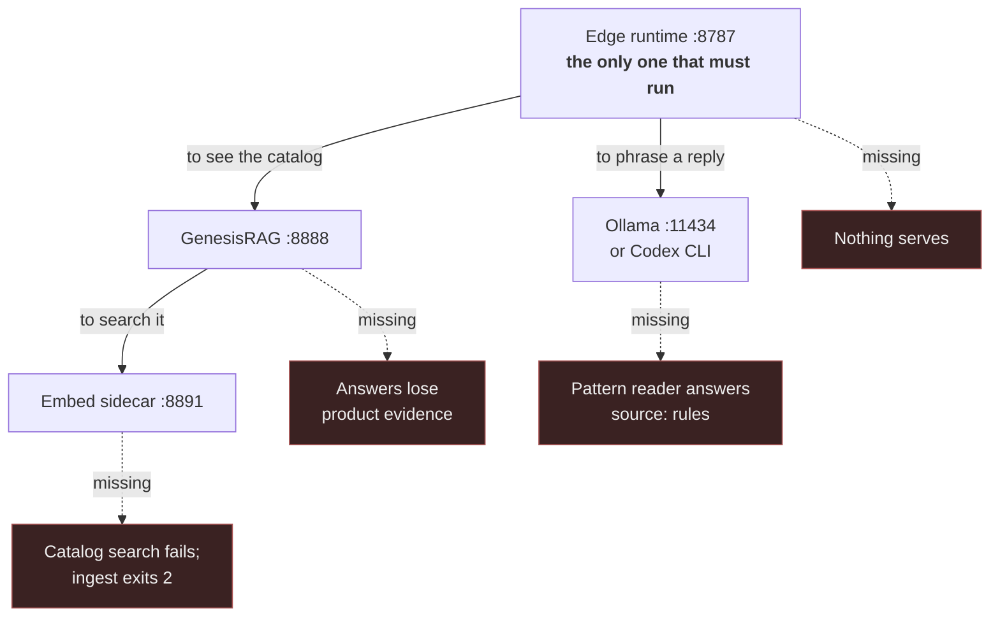
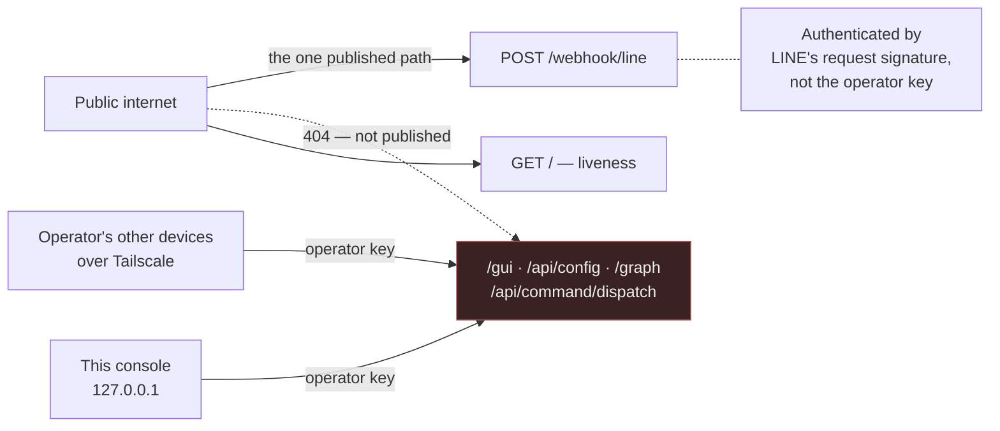

# Edge Device Setup

> Current transport decision: [Server-owned LINE and optional Edge](SERVER-LINE-OPTIONAL-EDGE.md)
> implements upstream ADR-061. New runtimes are compute-only; the transport behavior below
> applies only to explicitly selected `LEGACY_EDGE` installations during migration.


Everything below was executed on a clean machine, not transcribed from the specs. Where the
observed behaviour differs from `CLAUDE.md`, this file records what the code actually does.

## 0. The shape of it

Four processes. Only the first is strictly required; each one adds a capability.

| Process | Port | Start with | Without it |
| --- | --- | --- | --- |
| Edge runtime (LINE webhook + GUI + graph viewer) | 8787 | `node dist/cli/index.js webhook serve` | nothing serves |
| Embed sidecar | 8891 | `npm run embed:serve` | no ingest, no catalog search |
| GenesisRAG service | 8888 | `npm run rag:serve` | the agent cannot see the catalog |
| A model (Ollama, or the hosted Anthropic API) | 11434 | `ollama serve` | answers come from the pattern reader |

They are deliberately independent. The runtime answers with a degraded but correct reply when the
model or the catalog is missing — it never fails the customer to protect its own dependencies.



Read the dashed edges as the cost of each absence. Only the runtime's own absence is fatal; every
other gap degrades the answer rather than withholding it. §5 states the same thing as a table.

The full picture — trust boundaries, the message path, liveness — is in
[SYSTEM-DIAGRAMS.md](SYSTEM-DIAGRAMS.md).

## 1. Install

```bash
npm install
py -3 -m pip install -r scripts/requirements-sidecar.txt
npm run build
```

`npm install` now brings the GenesisBlock engine with it. Install it from npm, never the
`github:` URL — the git package pins its platform binaries to a version that was never published
and fails at require time.

## 2. Configure

Copy `.env.example` to `.env`. **Exactly two values are hard requirements**; everything else warns
and keeps going:

```bash
ZURI_AGENT_DEVICE_ID=zuri-edge-local-dev
ZURI_AGENT_DEVICE_TOKEN=<your device token>
```

Check it:

```bash
node dist/cli/index.js config check
```

`valid: true` with warnings is a healthy local dev state. Every `warn` is an off-by-default
capability, not a problem. The command exits non-zero and names the missing key when it is not.

### Pairing this device with the cloud

zuri-ai accepts exactly one machine credential: an `edgk_`-prefixed key minted per device. Mint it
in the console at **/platform/integrations → Edge** (a Business OWNER or the installation operator;
`POST /api/platform/edge-devices/credentials` is the same thing by API), and put it in `.env`:

```bash
ZURI_EDGE_DEVICE_KEY=edgk_…      # shown exactly once at mint time
ZURI_CLOUD_BASE_URL=…            # required alongside it
```

The key carries the Business: every route takes the Business from the credential and refuses (403)
a payload naming a different one. Nothing else authenticates — zuri-ai's viewer resolver reads a
session cookie and nothing else, so a bearer token of any other shape does not fall back to some
weaker path, it is `401 AUTH_REQUIRED` whatever its value. That includes the `.env.example`
placeholder in `ZURI_AGENT_DEVICE_TOKEN`.

These two are the *device* pair — where this device talks to the cloud as itself, and what it
presents when it does. The heartbeat and the extraction worker both use them.

`ZURI_COMMAND_API_BASE_URL` and `ZURI_AGENT_DEVICE_TOKEN` are a separate pair, for the command
endpoints, which are unbuilt upstream (see below). They are not borrowed for device calls, even
though both origins point at the same zuri-ai today — which is exactly why it is worth keeping them
apart rather than discovering the coupling the day they diverge. `ZURI_AGENT_DEVICE_TOKEN` stays a
required key because `config check` treats it as one, but it authenticates nothing.

Use `https://` for anything but loopback: this pair carries a Business-scoped credential.

Once paired, `webhook serve` reports liveness every 40s for as long as it is serving, and the
device shows in the console's Edge tab. It reports from inside the webhook rather than from the
launcher on purpose: what the tab should reflect is whether the process LINE talks to is still
answering, which a launcher that started it and walked away cannot know. A failing report is logged
and dropped — liveness telemetry must never take down the thing it reports on — so watch the
`heartbeat` diagnostic lines rather than assuming silence means health:

```bash
grep heartbeat state/startup-logs/webhook.log.err
# [DIAGNOSTIC] heartbeat {"ok":true,"ms":417}
```

With no `ZURI_EDGE_DEVICE_KEY` configured the heartbeat does not run at all, rather than 401ing
every 40 seconds into the log.

Verify by the endpoint, not by the config checkers — `config check` and `zuri-agent health` both
stay green through a total authentication failure, because they validate that a variable is *set*,
not that it works:

```bash
curl -s -o /dev/null -w "%{http_code}
" -X POST -H "content-type: application/json"   -H "Authorization: Bearer $ZURI_EDGE_DEVICE_KEY"   -d '{"deviceId":"zuri-edge-local-dev","status":"healthy"}'   "$ZURI_CLOUD_BASE_URL/api/agent/heartbeat"
```

`200` is paired. `401` means the key is not a live minted credential. `404` means the base URL is
wrong.

### Turning the webhook on

`webhook serve` refuses to start until the LINE archive is fully configured. It fails in three
stages, one message at a time, so work through them in order:

```bash
LINE_WEBHOOK_ENABLED=true
LINE_CHANNEL_SECRET=<channel secret>       # HMAC signature verification
LINE_HISTORY_HASH_KEY=<any local secret>   # derives conversation keys
LINE_HISTORY_GROUP_LEADERSHIP=true         # at least ONE alias must be allow-listed
```

That last one is easy to miss: with no `LINE_HISTORY_GROUP_<ALIAS>=true` anywhere, the server exits
with `At least one LINE_HISTORY_GROUP_<ALIAS>=true setting is required`. The allow-list is
positive by design — a group nobody named is a group this device will not archive.

### Turning the conversational layer on

Off by default, and off is a working state: the deterministic pattern reader answers instead. What
the model changes is how well a question is *understood*, not whether there is a reply.

Hosted:

```bash
ZURI_LLM_ENABLED=true
ANTHROPIC_API_KEY=sk-ant-...
```

Local, no key needed:

```bash
ZURI_LLM_ENABLED=true
ZURI_LLM_BASE_URL=http://localhost:11434/v1
ZURI_LLM_MODEL=qwen3.5:9b
ZURI_LLM_TIMEOUT_MS=25000
GENESIS_RAG_API_URL=http://localhost:8888
```

**`ZURI_LLM_TIMEOUT_MS` is capped at 25000 and `config check` rejects anything higher** — a LINE
reply token expires after about 30 seconds, so a slower model would produce an answer nobody can
receive. That cap is the single most important constraint on model choice.

`qwen3.5:9b` is not a preference, it is a measurement: 8/8 correct at p95 21.7s, against a 4B that
took 39.7s and several models Ollama refuses to give tools at all. See
`docs/LOCAL-MODEL-SELECTION.md` before substituting anything.

## 3. Run

```bash
npm run embed:serve                        # 1. sidecar (:8891) — leave running
npm run catalog:pipeline                   # 2. build the catalog store (once, ~22s)
npm run rag:serve                          # 3. catalog service (:8888)
node dist/cli/index.js webhook serve       # 4. edge runtime (:8787)
```

Steps 1–3 are the GenesisRAG pipeline; `docs/GENESIS-RAG-V4-PIPELINE-RUNBOOK.md` covers them in
depth. Step 2 is a one-off — it skips on every later run whose inputs are unchanged.

### Verify

```bash
curl http://127.0.0.1:8891/health          # {"model":"intfloat/multilingual-e5-small",...}
curl http://127.0.0.1:8888/health          # {"ok":true,"dbReady":true,"staleRun":false,...}
curl http://127.0.0.1:8787/                # {"status":"ok","service":"zuri-edge-webhook",...}
node dist/cli/index.js chat say --text "อยากได้ชุดของขวัญมีกระบอกน้ำ 100 ชุด งบ 1200 บาท" --role sales
```

The reply carries `source` and, when it fell back, `reason` — read those before anything else:

| `source` | Meaning |
| --- | --- |
| `model` | the model answered and its tool calls are listed in `toolCalls` |
| `rules` | the pattern reader answered; `reason` says why the model did not |

`source: rules` with `reason: model call failed: MODEL_HTTP_400` means the model does not support
tool calling. `reason: ...aborted due to timeout` means it is too slow for the 25s cap. Both are
model-selection problems, not configuration errors — and in both cases the customer still got a
correct, if plainer, answer.

### Auto-start

Nothing above survives a reboot on its own. Tailscale does — its service is Automatic, so the Funnel
URL comes back — which makes the failure quiet in the worst way: LINE keeps delivering to
`https://desktop-vetatmq.tail71c7d1.ts.net/webhook/line`, the tunnel keeps answering, and there is
no listener behind it. Those messages are gone; the outbox only protects work it has already
accepted.

```bash
powershell -ExecutionPolicy Bypass -File scripts/start-edge-stack.ps1 -Install
```

That registers a Scheduled Task (`ZuriEdgeStack`) running the same script at logon. Run the script
without `-Install` to bring the stack up now; `-Uninstall` removes the task.

It health-checks each service before starting it and skips the ones already answering, so running it
twice is harmless. It starts them in dependency order — embed sidecar, then the catalog service,
then the webhook last, so the webhook is not accepting messages before the catalog behind it can
answer them. The RAG service is the one that must never double-start: it holds the GenesisBlock
store's exclusive lock, and the health check is what keeps a second copy from trying.

It reports on Ollama but does not start it — Ollama registers its own autostart, and a second copy
would fight the first over the model files. Per-service output lands in `state/startup-logs/`.

At logon, not at boot: a boot trigger needs administrator rights to register. If this ever has to
come back after an unattended reboot with nobody signing in, that is a Windows service instead.

`start-edge-device.bat` is the old machine's launcher, kept only for reference — it hardcodes
`C:\Users\freshair\...` and `D:\workspace\...`, and force-kills every `node` process on the machine.
Do not run it here.

## 4. Pages

### Reaching them

Everything that reads or changes configuration, or that can send as the OA, needs the **operator
key**. Only `/` (liveness) and `/webhook/line` (authenticated by LINE's signature) are open.



The key is minted on first start and printed once to the runtime log:

```text
[zuri-edge] An operator key was generated for the settings page. It is shown once:

    zadm_…
```

Only its SHA-256 is kept, in `ZURI_EDGE_ADMIN_KEY_HASH`. Lost it? Clear that line and restart to
mint another — there is no recovery, by design. A device with no key configured answers 401 to the
whole surface rather than opening it.

Sign in at the page, or drive it with `Authorization: Bearer zadm_…` for scripts. A session lasts
twelve hours and does not survive a restart.

| From | Address | Reachable |
| --- | --- | --- |
| this machine | `http://127.0.0.1:8787/gui` | yes |
| the operator's other devices | `http://<tailscale-ip>:8787/gui` | yes, over the tailnet |
| the public internet | — | **no.** The Funnel publishes `/webhook/line` alone |

That last row is a control, not a default. The Funnel was originally configured for the whole port,
which published `GET /api/config` — returning the channel token, the channel secret and the device
token — and `POST /api/command/dispatch`, which sends as the OA, to anyone on the internet with no
credential at all. Narrowing it to one path is half the fix; the operator key is the other half,
because narrowing a tunnel does nothing about whoever can already reach the port.

Check it after any Tailscale change:

```bash
tailscale funnel status    # must list /webhook/line and nothing else
```

| URL | State |
| --- | --- |
| `http://127.0.0.1:8787/gui` | works, behind the operator key — Config GUI. Verify by checking the browser console for errors, not just that its five API endpoints respond: the page's whole `<script>` block silently failed to parse from `de3d72a` until it was fixed, and every endpoint still returned 200 the entire time — the API checks never would have caught it. |
| `http://127.0.0.1:8787/graph` | works, behind the operator key — Live Knowledge Graph Viewer. Read-only, but what it reads out is the customer's catalogue and pricing |

### `/api/graph`

`CLAUDE.md` documented `GET /api/graph` but nothing implemented it, so the viewer loaded its shell
and rendered an empty canvas. It exists now, in two parts:

- `src/rag/v4/graph-snapshot.ts` walks the store and builds a bounded subgraph; the RAG service
  serves it at `GET :8888/api/graph?limit=N`.
- The webhook server **proxies** it at `:8787/api/graph`. Proxy, not a direct read: the engine
  takes an exclusive lock on a store directory even when opened `readOnly`, so only `rag:serve` may
  hold it. When `:8888` is down the proxy answers `503` with an empty `nodes`/`edges` payload and a
  `hint`, so the viewer degrades to "empty" rather than a console stack trace.

Two things about the snapshot are worth knowing, because both were defects first:

- **It is a sample, not an export.** ~300 nodes of the store's ~3,150, chosen by per-label quota
  with offers expanded first. A plain breadth-first walk returns a *tree* — the spine
  (group → type → model → variant) has no cross-links, and every edge that makes this a graph hangs
  off CatalogOffer, which a root-first walk reaches last. `?limit=` scales the whole picture, since
  the quotas are proportions.
- **Four nodes are deliberately excluded**: the three branding options and the standard gift box.
  Every offer connects to all four, so they sat at degree ≈ offer-count and produced 37% of all
  edges — a hairball around four nodes that say nothing. They are a constant, not a relationship.

`graph-viewer.html` also needed a one-line fix: its `DEFAULT_ON` label set names the *older*
business graph (`Org`, `Brand`, `Customer`, …). None of the v4 catalog labels are in it, so the
intersection was empty and every node started hidden. It now falls back to showing all labels when
the preferred set matches nothing that arrived.

The force layout still clumps at a few hundred nodes — that is the viewer's own simulation, not the
data. Use the per-label checkboxes to narrow it, or `?limit=` for a smaller graph.

## 5. What runs without what

| Missing | Consequence |
| --- | --- |
| model (`ZURI_LLM_ENABLED=false`, or unreachable) | pattern reader answers; `source: rules` |
| RAG service (:8888 down) | the agent cannot search the catalog; answers lose product evidence |
| embed sidecar (:8891 down) | catalog search fails; ingest exits `2` before touching the store |
| `data/` store | `rag:serve` refuses to start with `RAG_STORE_EMPTY` |

## 6. Troubleshooting

| Symptom | Cause | Fix |
| --- | --- | --- |
| `config check` exits 1 | missing device id/token | set both; they are the only hard requirements |
| `LINE_WEBHOOK_DISABLED` | archive not enabled | `LINE_WEBHOOK_ENABLED=true` + secret + hash key |
| `At least one LINE_HISTORY_GROUP_<ALIAS>=true` | no group allow-listed | `LINE_HISTORY_GROUP_LEADERSHIP=true` |
| `ZURI_LLM_TIMEOUT_MS must stay at or under 25000` | LINE reply-token cap | lower it, or pick a faster model |
| `source: rules`, `MODEL_HTTP_400` | model has no tool support | use one from `LOCAL-MODEL-SELECTION.md` |
| `source: rules`, timeout | model too slow | warm it first, or use a smaller one |
| `/graph` renders empty | `rag:serve` not running | start it; the proxy returns 503 + a `hint` |
| `database is already open` | two processes on one store | only `rag:serve` may hold it |
| `GENESIS_NATIVE_BINDING_UNAVAILABLE` | engine installed from `github:` | `npm install @freshair129/gks-genesis-block-native@0.2.5` |
