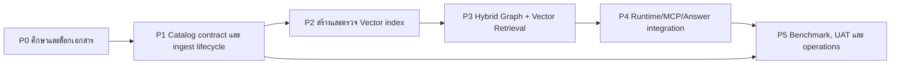

# Genesis Graph/Vector RAG — Phase Plan

## 0. Document status

เอกสารนี้เป็นแผนที่ได้รับอนุมัติสำหรับการทำงานแบบแบ่งเฟส ปัจจุบัน P1 subset ถูก
implement และ local-verified แล้ว ส่วน P2 vector และเฟสถัดไปยังเป็น gate แยก
ไม่ใช่ production-ready โดยอัตโนมัติ

การทำงานจะดำเนินการทีละเฟส โดยแต่ละเฟสมี gate ของตัวเอง เฟสถัดไปจะเริ่มได้เมื่อ
เอกสารและหลักฐานของเฟสก่อนหน้าผ่านการ review แล้ว

## 1. เป้าหมาย

ทำให้คำถามสินค้าและใบราคาใช้ข้อมูลที่ถูกแหล่ง ค้นได้เร็ว และแยกประเภท retrieval
อย่างชัดเจน:

1. ค้นรหัสหรือชื่อสินค้าตรงได้เร็วและตรวจสอบย้อนกลับได้
2. ค้นความหมายใกล้เคียงด้วย Vector Search ได้จริง
3. ใช้ Graph สำหรับหมวดหมู่ คุณสมบัติ และความสัมพันธ์ที่กำหนดไว้
4. รวมผลเป็น Hybrid Retrieval โดยไม่ให้โมเดลสร้างตัวเลขเอง
5. คำถามข้อมูลตรงไม่ต้องรอ Headless LLM
6. ทุกผลลัพธ์มี source, catalog version และ `as_of` ที่ตรวจสอบได้

## 2. หลักฐานจากระบบปัจจุบัน

| พื้นที่ | สถานะที่ตรวจพบ | ผลกระทบ |
|---|---|---|
| `src/rag/genesis-rag.ts` | เปิด GenesisBlock ด้วย `vectorDim: 384` | มี schema ของ vector แต่ยังไม่ยืนยันว่ามี embedding payload |
| `src/rag/genesis-rag.ts` | `seedCatalogIfEmpty()` ingest Catalog แบบวนทีละรายการ และไม่ได้ตรวจ empty state จริง | startup/re-init อาจ ingest ซ้ำและทำให้ช้า |
| `src/rag/genesis-rag.ts` | `searchProducts()` ใช้ HQL `name CONTAINS` | เป็น substring lookup ไม่ใช่ semantic vector search |
| `src/rag/genesis-rag.ts` | `getGraphData()` อ่าน JSON แล้วสร้าง nodes/edges เอง | Graph API ยังไม่ใช่ live Genesis graph query |
| `src/cli/index.ts` | เริ่ม `genesisRag.init()` แบบไม่ await แล้วค้นก่อนเรียก `answerConversation()` | readiness และ latency ของแต่ละช่วงยังปนกัน |
| `src/catalog/store.ts` และ `src/answer/tools.ts` | answer layer มี in-memory name search อีกเส้นทาง | มีหลาย retrieval path และเสี่ยงใช้ Catalog คนละชุด |
| `src/answer/respond.ts` | Headless layer มี priority เมื่อถูกเปิดใช้ | คำถามตรงอาจรอโมเดลนานเกินความจำเป็น |
| `src/mcp/genesis-mcp-server.ts` | `execute_hql` ส่ง HQL ทั้งก้อนไปที่ `searchProducts()` | MCP tool ยังไม่ execute HQL ตามชื่อที่ประกาศ |
| `data/genesis_smartgift_store` | มี graph/projection files แต่ `vec_default.bin` ที่ตรวจพบมีขนาด 0 bytes | ยังไม่มีหลักฐานว่า vector index ถูก populate แล้ว |
| Catalog | historical paths มากกว่าหนึ่งชุด; semantic download source ถูก exclude แล้ว | P1 active source ใช้ `smartgift-pricing` pricing catalog; future semantic source ต้อง approval แยก |

เอกสาร conversational answer ระบุอยู่แล้วว่า Headless มี latency ระดับหลายสิบวินาที
เมื่อใช้ tools ดังนั้น latency ต้องวัดแยกเป็น retrieval, pricing และ answer generation
ไม่รวมเป็นตัวเลขเดียว

## 3. ขอบเขต

### In scope

- Catalog source contract และ catalog versioning
- GenesisBlock store ownership และ lifecycle ของ graph/vector index
- Idempotent catalog ingest
- Embedding generation และ vector index verification
- Exact, HQL/property, vector และ graph retrieval
- Hybrid ranking และ evidence packet สำหรับ answer layer
- MCP/runtime routing, readiness, caching และ latency measurement
- Tests, benchmark, provenance และ operational runbook

### Out of scope

- การเขียนแก้ราคา ต้นทุน หรือข้อมูลกลับไปยัง Source of Truth
- การเชื่อมต่อโดยตรงกับ Zuri PostgreSQL หรือ LINE Messaging API
- การเปิด arbitrary SQL/HQL ให้ผู้ใช้หรือโมเดลส่งเข้าระบบ
- การ fine-tune หรือฝึก embedding model ใหม่
- การสร้างภาพสินค้าใหม่ใน image generation pipeline
- การเปลี่ยน permission, tenant policy หรือ delivery policy โดยไม่มีเอกสารอนุมัติแยก

## 4. ข้อกำหนดที่เสนอ

ข้อกำหนดชุดนี้เป็น proposal และจะถูกยืนยันใน `GENESIS-RAG-SPEC` ก่อน implementation

| ID | ข้อกำหนด | เกณฑ์ยอมรับเบื้องต้น |
|---|---|---|
| RAG-FR-001 | ใช้ Catalog Source of Truth เพียงชุดเดียว | ทุก path ระบุ source และ catalog version เดียวกัน |
| RAG-FR-002 | Ingest ต้อง idempotent | restart/retry ไม่สร้าง node, edge หรือ vector ซ้ำ |
| RAG-FR-003 | สร้างและตรวจสอบ product embeddings | จำนวน vector และ product identity ตรงกัน; vector storage ไม่ว่าง |
| RAG-FR-004 | รองรับ Hybrid Retrieval | exact/property, vector และ graph results รวมและ deduplicate ได้ |
| RAG-FR-005 | Graph query ต้องแยกจาก JSON projection | ระบุชัดว่า live graph หรือ cached projection เป็น source ของแต่ละ API |
| RAG-FR-006 | คำถามข้อมูลตรงตอบแบบ deterministic ได้ | ไม่ต้องเรียก LLM สำหรับ code, name, MOQ และข้อมูลที่มีอยู่ตรง ๆ |
| RAG-NFR-001 | แยกวัด latency ตาม stage | มี p50/p95 ของ warm/cold retrieval, pricing และ answer |
| RAG-NFR-002 | รักษา provenance | ผลลัพธ์มี source, version, `as_of` และ query path |
| RAG-SEC-001 | ไม่มี arbitrary query surface | ใช้ registered/safe query และ escape/parameterize input |
| RAG-OPS-001 | มี readiness และ single-owner guard | ไม่รับงานจน store พร้อม และไม่เปิด store ชนกันโดยเงียบ |

## 5. Phasing strategy



### P0 — ศึกษา, baseline และเอกสารสัญญา

**สถานะ:** เริ่มก่อนสุด; docs/read-only เท่านั้น

**วัตถุประสงค์**

- ยืนยันเส้นทาง query จริงใน runtime
- เลือก Catalog Source of Truth
- ยืนยัน GenesisBlock API ที่รองรับ node, edge, vector upsert, search และ metadata
- กำหนด embedding model, dimension, distance metric และ version policy
- เก็บ baseline latency/จำนวนข้อมูลก่อนเปลี่ยนระบบ

**เอกสารส่งมอบ**

1. `docs/GENESIS-RAG-SPEC.md` — functional, security, provenance และ runtime contract
2. `docs/GENESIS-RAG-ADR.md` หรือ ADR ใหม่ใน `docs/ARCHITECTURE.md` — ownership,
   source, vector/graph strategy และ rollback decision
3. `docs/GENESIS-RAG-BASELINE.md` — command, dataset, result และ evidence ของ baseline
4. อัปเดต `docs/appendices/D-traceability.md` ด้วย RAG requirement IDs

**Gate P0**

- Source of Truth ถูกเลือกและเจ้าของข้อมูลยืนยันแล้ว
- ไม่มีคำถามค้างเรื่อง embedding model/dimension/metric
- มี baseline แยก retrieval กับ LLM latency
- เอกสารได้รับ approval ก่อนเริ่ม implementation

**ความเสี่ยง:** Medium — ความคลุมเครือของ source หรือ API จะทำให้ทุกเฟสถัดไปผิดทิศ

### P1 — Catalog contract และ ingest lifecycle

**วัตถุประสงค์**

- รวม Catalog ให้เป็น schema เดียว
- เพิ่ม manifest/hash/version และ record count
- ทำ ingest แบบ idempotent และตรวจ duplicate
- กำหนด single process owner ของ Genesis store
- ทำ readiness state แยกจาก health ที่แค่ process ตอบอยู่

**Implementation checkpoint 2026-08-22**

P1 subset ที่ได้รับอนุมัติถูก implement แล้ว: ใช้ pricing Catalog เป็น active input,
ตัด semantic download source ออกจาก runtime defaults, canonical offer deduplication,
ProductFamily/Variant projection, duplicate provenance, bulk graph ingest และการปฏิเสธ
automatic refresh เมื่อ snapshot เปลี่ยนหรือ store ถูกเปิดโดย process อื่น การสร้าง vector
และการ route answer layer ยังเป็นเฟสถัดไปตามแผน

ผลตรวจ source จริง: 1,017 raw rows → 1,016 offers → 845 families, 1,016 variants,
107 review families, exact duplicate `TPT11-7` 1 กลุ่ม, conflicting duplicate codes 0.

Active local database ถูกสร้างเป็น `data/genesis_smartgift_store_family_v2` จาก snapshot
`d2afc2597c66656a8572a27e4189c99a38f4b1c247b53d32504e39d6ecdddd31`; store เดิม
`data/genesis_smartgift_store` ถูกเก็บไว้เป็น rollback/reference และไม่ถูกเขียนทับ
(`docs/GENESIS-RAG-DB-MIGRATION-REPORT.md`).

**ผลลัพธ์ที่ต้องได้**

- เปิดระบบซ้ำได้โดยไม่ ingest ซ้ำ
- catalog เปลี่ยนจึงค่อย re-ingest ตาม version/hash
- restart ระหว่าง ingest แล้ว resume หรือ rollback ได้ตามที่ spec ระบุ
- graph count, product count และ category count ตรวจสอบได้

**Gate P1**

- ingest ซ้ำสองครั้งให้ผลเชิงตรรกะเท่าเดิม
- ไม่มี process ที่เปิด store เดียวกันโดยไม่ประกาศ ownership
- พร้อมใช้ Catalog version เดียวกันทั้ง pricing, retrieval และ graph API

**ความเสี่ยง:** High — เกี่ยวข้องกับข้อมูลเดิมและ lifecycle ของ native store

### P2 — สร้างและตรวจ Vector index

**วัตถุประสงค์**

- สร้าง embedding จาก field ที่อนุมัติแล้ว เช่น code, name, description, category และ keywords
- บันทึก embedding model/version กับ product record หรือ index manifest
- populate vector collection ที่ dimension ตรงกับ model
- เพิ่ม verification command/report โดยไม่ต้อง dump ข้อมูลธุรกิจลง log

**ผลลัพธ์ที่ต้องได้**

- vector count ตรงกับ product count ที่ eligible
- similarity query คืนผลลัพธ์ที่มี score และ product identity
- index rebuild/rollback ทำได้โดยไม่ทำลาย graph หรือ Catalog source
- กรณี model/index ไม่พร้อม fail closed ไป exact search หรือ unavailable อย่างชัดเจน

**Gate P2**

- มี evidence ว่า vector payload ถูกเขียนจริง ไม่ใช่แค่ collection schema
- มี test set ภาษาไทย/อังกฤษ/รหัสสินค้าอย่างน้อยชุดหนึ่ง
- ผลลัพธ์ top-k ผ่านเกณฑ์ recall ที่กำหนดใน P0

**ความเสี่ยง:** High — model, native binding และ migration/index format เป็น external/runtime gates

### P3 — Hybrid Graph + Vector Retrieval

**วัตถุประสงค์**

- exact lookup สำหรับ code และชื่อที่ตรง
- vector similarity สำหรับคำอธิบายเชิงความหมาย
- graph expansion/filter สำหรับ category, branding, feature และ relation ที่มีจริง
- deduplicate, filter MOQ/budget/quotable state และ rerank โดย deterministic rules

**ผลลัพธ์ที่ต้องได้**

```text
user query
  -> intent/constraint extraction
  -> exact/property retrieval
  -> vector top-k
  -> graph expansion/filter
  -> deterministic ranking
  -> bounded evidence packet
```

โมเดลมีหน้าที่ช่วยทำความเข้าใจคำถามและเรียบเรียงเท่านั้น ตัวเลข ราคา และจำนวนผลลัพธ์
ต้องมาจาก evidence packet หรือ pricing engine

**Gate P3**

- query set เดียวกันสามารถเปรียบเทียบ exact-only, vector-only และ hybrid ได้
- hybrid ไม่คืนสินค้าที่อยู่นอก constraint ที่ผู้ใช้ระบุ
- ผลลัพธ์ทุกตัว trace กลับไปยัง product id และ catalog version ได้

**ความเสี่ยง:** Medium/High — ranking quality และการตีความภาษาไทยต้องมี golden set

### P4 — Runtime, MCP และ Answer integration

**วัตถุประสงค์**

- await และ expose readiness ของ Genesis runtime อย่างถูกต้อง
- ให้ `search_catalog` เรียก retrieval contract เดียวกับ CLI/LINE
- แก้ `execute_hql` ให้ตรงกับชื่อและ security contract หรือถอดออกหากไม่จำเป็น
- ไม่ส่ง raw user text ไปเป็น arbitrary HQL
- ให้คำถามข้อมูลตรงตอบแบบ deterministic ก่อน และใช้ LLM เป็น optional phrasing layer
- แยก retrieval timeout จาก headless timeout และรักษา fallback ที่ปลอดภัย

**Gate P4**

- CLI, MCP และ LINE ได้ผล retrieval รูปแบบเดียวกัน
- store ไม่พร้อมแล้วระบบรายงาน unavailable/queued อย่างตรงไปตรงมา
- คำถาม code/name/price ไม่เรียก Headless โดยไม่จำเป็น
- ไม่มี secret, raw business row หรือ arbitrary query ใน log/response

**ความเสี่ยง:** Medium — cross-module integration และ delivery behavior

**Taxonomy P4 slice (2026-08-23):** bounded read-only `taxonomy_preview` was
implemented for CLI and MCP through `taxonomy-serving-v1`. It validates the
proposed taxonomy_v3 manifest against the canonical snapshot and keeps
`activated: false`, vector `not_built`, and the v2 runtime default unchanged.
This slice removes the unregistered MCP `execute_hql` surface, but does not
change `search_catalog`, LINE retrieval, answer generation, pricing, or delivery.

**Taxonomy identity-review slice (2026-08-23, historical v0.1.x):** the approved
`BaseProduct -> PhysicalVariant -> CatalogOffer -> CustomizationProfile` model was
implemented as a deterministic, read-only review artifact. It uses optional semantic
catalog evidence for colors, physical anchors, and supported branding, retains all
1,016 offers, and leaves the active `family_v2`, taxonomy_v3 authority, pricing, and
delivery paths unchanged. Current provisional result: 606 base products, 972 physical
variants, 1 customization profile, 518 bundles, with 323 base-product groups requiring
review and 11 unclassified.

**Taxonomy identity graph slice (2026-08-23):** the approved graph-native model now
keeps `ProductMaster` as the atomic-product key, keeps every source SKU as a
`CatalogOffer` node, and decomposes set offers through one directed
`CONTAINS_COMPONENT` edge per component. Reverse lookup is an incoming traversal or
indexed adjacency lookup; no duplicate reverse edge or SKU-id array is introduced.
The slice remains read-only and leaves `family_v2`, taxonomy authority, pricing, and
delivery paths unchanged. Current provisional result: 425 atomic products, 1,126
physical variants, 1,016 offers, 984 set offers, and 3,166 component links; 43 auto,
327 review-required, and 55 unclassified.

### P5 — Benchmark, UAT และ operations

**วัตถุประสงค์**

- วัด cold start, warm query, ingest, vector search, graph expansion, pricing และ answer แยกกัน
- ทดสอบ catalog refresh, process crash, lock conflict, index mismatch และ fallback
- ทำ runbook สำหรับ rebuild, rollback, health/readiness และ stale index
- อัปเดต traceability, changelog และ release gate

**Gate P5**

- benchmark ผ่านเกณฑ์ที่อนุมัติใน P0
- UAT สินค้าจริงผ่านทั้ง exact, semantic, constraint และ quotation flows
- มีวิธีตรวจว่าใช้ Catalog/index version ใด
- ไม่มี known regression ในเส้นทางราคาและ delivery ที่มีอยู่

**ความเสี่ยง:** Medium — ความถูกต้องของข้อมูลจริงสำคัญกว่าคะแนนความเร็วเพียงอย่างเดียว

## 6. Critical path และงานที่ทำคู่ขนานได้

### Critical path

`P0 → P1 → P2 → P3 → P4 → P5`

### ทำคู่ขนานได้หลัง P0

- จัดทำ golden query set และ expected products
- ทำ benchmark harness แบบ read-only
- ตรวจ Genesis native API และ store inspection tools
- ร่าง answer/evidence schema
- ทำ security review ของ MCP surface

งานคู่ขนานเหล่านี้ห้ามเปลี่ยน runtime behavior หรือเขียนข้อมูลลง production-like store
จนกว่า P0 และ P1 จะได้รับอนุมัติ

## 7. Risk register เบื้องต้น

| ID | ความเสี่ยง | โอกาส | ผลกระทบ | ระดับ | การลดความเสี่ยง |
|---|---|---:|---:|---:|---|
| RAG-R1 | Catalog หลายชุดมีข้อมูล/จำนวนไม่ตรงกัน | 4 | 5 | 20 | เลือก Source of Truth และ version ก่อน ingest |
| RAG-R2 | Genesis store ถูกเปิดพร้อมกันหลาย process | 4 | 5 | 20 | single-owner lock, readiness และ explicit failure |
| RAG-R3 | collection มี schema แต่ไม่มี vector payload | 4 | 5 | 20 | verification count/search/manifest เป็น gate |
| RAG-R4 | embedding model ไม่เหมาะกับไทยหรือ domain สินค้า | 3 | 4 | 12 | golden set, compare model และ fallback exact |
| RAG-R5 | Headless LLM กลบ latency ของ retrieval | 4 | 4 | 16 | direct deterministic path และ stage-level metrics |
| RAG-R6 | MCP เปิด arbitrary HQL หรือ input injection | 3 | 5 | 15 | registered query contract และ negative tests |
| RAG-R7 | graph projection ไม่ตรงกับ live store | 3 | 4 | 12 | ระบุ source ของ graph API และ version check |
| RAG-R8 | index rebuild ทำให้ระบบบริการข้อมูลไม่ได้ | 3 | 5 | 15 | build beside current index, atomic swap และ rollback |

## 8. Definition of Done ระดับโครงการ

- เอกสาร P0 ได้รับ approval และ requirement IDs ถูก trace ใน doc graph
- Catalog source, schema, version และ provenance ถูกประกาศเป็นสัญญาเดียว
- Graph และ vector มี evidence ว่าประชากรครบตามเกณฑ์ ไม่ใช่ดูจากไฟล์ schema อย่างเดียว
- Hybrid retrieval ผ่าน golden query set และ constraint tests
- คำถามตรงไม่พึ่ง Headless โดยไม่จำเป็น
- latency มี p50/p95 แยกตาม stage พร้อมหลักฐานการวัด
- MCP/CLI/LINE ใช้ retrieval contract เดียวกัน
- มี rollback/rebuild/runbook และอัปเดตเอกสารที่เกี่ยวข้อง
- ไม่เปลี่ยน delivery, permission หรือ Source of Truth โดยไม่มี approval แยก

## 9. สิ่งที่ยังต้องอนุมัติก่อนเริ่ม P2

1. embedding model และ dimension/metric ที่รองรับใน GenesisBlock
2. จะให้ Graph API อ่าน live Genesis graph หรือ cached projection
3. เป้าหมาย latency และ recall ขั้นต่ำ
4. ขอบเขตของ MCP `execute_hql` — แก้เป็น registered query หรือถอดออก
5. ผู้อนุมัติการสร้าง/refresh index และ rollback

P1 ใช้ pricing Catalog เป็น active source และสร้าง family/variant/offer projection แล้ว
รายการข้างต้นยังเป็น gate แยกสำหรับ vector และ hybrid retrieval ไม่ได้ถูกอนุมัติจากงานนี้

## 10. Source documents and implementation evidence

- [`docs/PRD-SDD-v1.0.md`](PRD-SDD-v1.0.md) — parent requirements and governance
- [`docs/ARCHITECTURE.md`](ARCHITECTURE.md) — existing ADR authority
- [`docs/CONVERSATIONAL-ANSWER-SPEC.md`](CONVERSATIONAL-ANSWER-SPEC.md) — answer/fallback/latency contract
- [`docs/ROADMAP-CONVERSATIONAL-AGENT.md`](ROADMAP-CONVERSATIONAL-AGENT.md) — existing conversational roadmap
- [`docs/AGENT-RUNTIME-SPEC.md`](AGENT-RUNTIME-SPEC.md) — runtime boundaries and lifecycle
- [`src/rag/genesis-rag.ts`](../src/rag/genesis-rag.ts) — current Genesis integration
- [`src/cli/index.ts`](../src/cli/index.ts) — runtime wiring and answer path
- [`src/mcp/genesis-mcp-server.ts`](../src/mcp/genesis-mcp-server.ts) — current MCP surface
- [`docs/GENESIS-RAG-TAXONOMY-SERVING-SPEC.md`](GENESIS-RAG-TAXONOMY-SERVING-SPEC.md) — bounded taxonomy preview contract
- [`docs/GENESIS-RAG-DB-MIGRATION-REPORT.md`](GENESIS-RAG-DB-MIGRATION-REPORT.md) — active store migration and verification
- [`src/catalog/store.ts`](../src/catalog/store.ts) — current JSON/in-memory catalog search
- [`src/answer/respond.ts`](../src/answer/respond.ts) — deterministic fallback and Headless priority
- [`docs/.preflight-report.json`](.preflight-report.json) — latest preflight: 0 critical findings, 5 warnings

## CHANGELOG

| Version | Date | Status | Summary | Agent |
|---|---|---|---|---|
| 0.1.8b | 2026-08-23 | beta | Added the approved graph-native atomic ProductMaster and canonical SKU component-edge slice | ATHER |
| 0.1.7b | 2026-08-23 | beta | Corrected identity-review attribute extraction and refreshed the read-only evidence counts | ATHER |
| 0.1.6b | 2026-08-23 | beta | Added the approved read-only original-product identity review slice and its non-activation boundary | ATHER |
| 0.1.5b | 2026-08-23 | beta | Recorded bounded taxonomy P4 preview integration; full runtime/answer/vector gates remain separate | ATHER |
| 0.1.4b | 2026-08-22 | beta | Built and activated the versioned family_v2 local store; preserved the legacy store and recorded repeat-init verification | ATHER |
| 0.1.3b | 2026-08-22 | beta | Implemented pricing-only family/variant/offer projection and removed semantic download runtime default | ATHER |
| 0.1.2b | 2026-08-22 | beta | Implemented approved P1 catalog normalization and idempotent graph-ingest subset | ATHER |
| 0.1.1b | 2026-08-22 | beta | User-approved phase plan; P0 documentation package created | ATHER |
| 0.1.0b | 2026-08-22 | candidate | Initial phase plan for Genesis Graph/Vector RAG; docs-first, approval-gated | ATHER |
