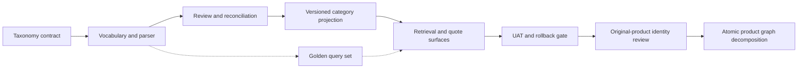

# SmartGift Catalog Taxonomy — Implementation Plan

## 0. Plan status

เอกสารนี้เป็นแผนสำหรับแก้ปัญหา “845 families ยังไม่ใช่จำนวนประเภทสินค้าจริง”
โดยแยกให้ชัดระหว่างสินค้าเดี่ยว, ส่วนประกอบของชุด, bundle และ source offer

P0 taxonomy contract ได้รับ approval จากผู้ใช้แล้ว จึงอนุญาตให้ทำ P1
ซึ่งเป็น pure parser และ deterministic fixtures ได้ และเตรียม P2 aggregate
review/reconciliation report ได้

ยังไม่อนุญาตให้เขียน mapping ถาวร, เปิด authoritative retrieval/runtime
หรือเปิด approved category assignment จนกว่าจะผ่าน P2/P3/P4/P5 ตาม approval gates

P2 aggregate review report ถูกสร้าง, replay จาก snapshot ปัจจุบัน และได้รับ approval
จากผู้ใช้แล้ว โดยแยก
taxonomy status ออกจาก existing merge-review status; approval ของ business/data
ครอบคลุม report และ unresolved policy แล้ว P3 projection contract ได้รับ approval
และ materialize เป็น side-by-side store แล้ว แต่ยังไม่มี approved category
assignment และยังไม่มีการเปิดใช้งาน runtime

P4 bounded read-only serving contract ถูกลงมือทำตามคำสั่งผู้ใช้แล้ว โดยแยก
`taxonomy_preview` ออกจาก `search_catalog` เดิม, ตรวจ snapshot/manifest/count
reconciliation ก่อนตอบ, และถอด arbitrary `execute_hql` ออกจาก MCP surface
การ preview ยังเป็น evidence ที่ไม่ใช่ authority; runtime default, ราคา, delivery
และ vector ยังไม่เปลี่ยน

P5 UAT แบบ read-only ผ่านชุดปัจจุบันแล้ว รวม Thai query aliases แบบ query-only,
exact offer lookup, mixed-bundle separation, count reconciliation, unknown
visibility, drift rejection และ full verification แต่ยังแนะนำ `HOLD` activation
เพราะ approved category count และ authoritative category edge ยังเป็นศูนย์

P6 original-product identity review model ได้รับ approval จากผู้ใช้แล้ว และสร้าง
read-only review artifact จาก semantic/pricing evidence โดยแยก `ProductMaster`,
`PhysicalVariant`, `CustomizationProfile` และ `CatalogOffer` ออกจากกัน

P7 graph-native atomic-product decomposition ได้รับ approval เพิ่มเติมแล้ว: สินค้าชิ้นเดี่ยว
เป็น `ProductMaster`, SKU เป็น `CatalogOffer` node, และ SKU เซ็ตใช้ edge เดียว
`CONTAINS_COMPONENT` ไปยัง atomic products หลายตัว ไม่สร้าง reverse edge ซ้ำ ผลลัพธ์ยังเป็น
provisional review เท่านั้น; ไม่เปลี่ยน active `family_v2`, taxonomy_v3 authority หรือ
stock/quote/delivery behavior

## 1. Verified starting point

| Metric | Current evidence |
|---|---:|
| Pricing source rows | 1,017 |
| Canonical offers | 1,016 |
| Current provisional families | 845 |
| Current variants | 1,016; one per offer, not confirmed physical variants |
| Review-required families | 107 |
| Exact duplicate rows | 1 (`TPT11-7`) |
| Conflicting duplicate codes | 0 |
| Official category nodes | 0; active pricing source has no category field |
| Vector index | `not_built` |
| Current store | `data/genesis_smartgift_store_family_v2` |

ข้อสรุป: ฐานปัจจุบันลด source-row duplication และรักษา offer ได้แล้ว แต่การรวม family
ใช้ normalized `englishName/name` เป็น provisional identity ยังไม่ได้ทำ controlled
taxonomy เช่น `drinkware`, `usb_flash_drive`, `umbrella` หรือ `notebook` อย่างเป็นทางการ

ฐานนี้เป็น catalog/pricing snapshot ไม่ใช่ inventory stock-on-hand จึงยังไม่มีจำนวน
สินค้าคงเหลือจริงในขอบเขตของแผนนี้

## 2. Source and readiness

| Source | Use |
|---|---|
| `docs/GENESIS-RAG-SPEC.md` | parent retrieval and approval boundary |
| `docs/GENESIS-RAG-CATALOG-FAMILY-VARIANT-SPEC.md` | family/variant/offer contract and merge rules |
| `docs/GENESIS-RAG-IMPLEMENTATION-PLAN.md` | P0–P5 dependency and vector gates |
| `docs/GENESIS-RAG-DB-MIGRATION-REPORT.md` | active family_v2 evidence and rollback boundary |
| `docs/GENESIS-RAG-TAXONOMY-PROJECTION-SPEC.md` | P3 side-by-side projection contract and non-activation boundary |
| `docs/GENESIS-RAG-TAXONOMY-SERVING-SPEC.md` | P4 read-only preview contract and CLI/MCP boundary |
| `docs/GENESIS-RAG-TAXONOMY-UAT-REPORT.md` | P5 UAT evidence, rollback/reference check, and activation recommendation |
| `docs/GENESIS-RAG-CATALOG-IDENTITY-REVIEW-SPEC.md` | approved base-product/variant/customization/offer identity contract |
| `docs/GENESIS-RAG-CATALOG-IDENTITY-REVIEW-REPORT.md` | P6/P7 read-only atomic identity counts, component edges, and review boundary |
| `.brain/rca/2026-08-23-taxonomy-thai-query-uat-gap.md` | RCA and prevention for the Thai query UAT gap |
| `data/genesis_smartgift_store_family_v2/catalog-manifest.json` | verified snapshot and provenance |
| `docs/.preflight-report.json` | 0 critical findings, 5 warnings |
| `docs/.doc-graph.json` | 58 nodes, 71 edges, 0 stale/contradiction edges; generated 2026-08-10 and requires refresh after this plan |

## 3. Definitions to lock before implementation

The final report must publish four different counts rather than one misleading number:

1. **Base category count** — distinct controlled product types, e.g. drinkware or USB flash drive.
2. **Product family count** — customer-facing configurations; current baseline is 845.
3. **Bundle family count** — families containing more than one component.
4. **Offer count** — source codes/pricing records; current baseline is 1,016.

Bundles are many-to-many with base categories. A family such as “mug + pen + USB” may
belong to three base categories but remains one bundle family. It must not be counted as
three separate products or merged with “mug + pen” without evidence.

The taxonomy vocabulary starts as a candidate list from the source names; the final number
is evidence-derived and must not be chosen in advance to fit a target such as 20 or 30.

## 4. Proposed target model

```text
CatalogOffer
    -> ProductVariant
        -> ProductFamily
            -> FamilyCategoryAssignment -> CatalogCategory
            -> ComponentSignature       -> CatalogComponent
```

### 4.1 CatalogCategory

| Field | Rule |
|---|---|
| `categoryId` | deterministic stable ID, not display text |
| `nameTh` / `nameEn` | approved display names |
| `parentCategoryId` | optional bounded hierarchy |
| `aliases` | normalized source phrases only |
| `status` | `candidate`, `approved`, `deprecated` |
| `taxonomyVersion` | version of the controlled vocabulary |

### 4.2 FamilyCategoryAssignment

| Field | Rule |
|---|---|
| `familyId` | existing family identity remains unchanged |
| `categoryId` | one or more approved base categories |
| `assignmentStatus` | `auto`, `review_required`, `approved`, `unclassified` |
| `ruleVersion` | deterministic parser version |
| `evidence` | matched phrase/source field and reason |

### 4.3 CatalogComponent and ComponentSignature

Components represent what is inside a bundle. The signature is sorted and deterministic,
for example:

```text
drinkware
drinkware+pen
drinkware+pen+usb_flash_drive
```

Different component signatures remain different families by default. Color, size,
material, packaging, and branding remain options only when the source or manual evidence
supports that interpretation.

## 5. Scope

### In scope

- define a controlled category vocabulary and alias policy
- parse product names into deterministic component tokens
- assign families to zero, one, or multiple base categories
- produce a review report for ambiguous and unmatched names
- expose separate counts for categories, families, bundles, variants, and offers
- build a side-by-side versioned category projection after approval
- preserve source file, source hash, source row, offer code, and snapshot lineage
- add exact/category/bundle lookup tests and repeat-ingest tests

### Out of scope

- claiming physical stock quantity or warehouse availability
- changing price, MOQ, supplier facts, or quote authority
- merging bundles only because they share one component
- guessing color/size/material/packaging from an image or LLM output
- deleting or overwriting `giftset.json`, `catalog-2026.json`, or family_v2
- building the vector index or changing delivery/LINE permissions

## 6. Plan-local requirements and complexity

These IDs are for this plan and do not replace the governed PRD IDs.

| ID | Requirement | Scope | Risk | Dependencies | Points |
|---|---|---:|---:|---:|---:|
| TAX-FR-001 | Define controlled categories, aliases, and count semantics | 2 | 5 | 1 | 8 |
| TAX-FR-002 | Parse names into reproducible components/signatures | 5 | 5 | 1 | 11 |
| TAX-FR-003 | Assign families with explainable evidence and unknown bucket | 2 | 5 | 1 | 8 |
| TAX-FR-004 | Review 107 current review families and unmatched/conflicting cases | 2 | 5 | 1 | 8 |
| TAX-FR-005 | Project category assignments into a versioned side-by-side store | 2 | 5 | 1 | 8 |
| TAX-NFR-001 | Repeat classification and ingest are deterministic/idempotent | 2 | 2 | 1 | 5 |
| TAX-NFR-002 | No source or family_v2 overwrite; rollback is explicit | 2 | 5 | 1 | 8 |
| TAX-NFR-003 | Counts and assignments carry snapshot/taxonomy provenance | 2 | 2 | 1 | 5 |

Base estimate: 61 points. With the required 25% risk buffer: approximately 76 points.
The manual review owner is on the critical path; engineering capacity alone cannot close
the review gate.

## 7. Phasing strategy

| Phase | Name | Sprint | Focus | Deliverable / gate |
|---|---|---|---|---|
| P0 | Taxonomy contract | S1 | definitions, scope, category semantics | approved taxonomy spec and sample decisions |
| P1 | Vocabulary and parser | S1–S2 | aliases, component parser, unknown handling | pure-function classifier + fixtures |
| P2 | Review and reconciliation | S2 | review 107 families and unmatched records | signed mapping/review report |
| P3 | Category projection | S3 | build beside family_v2 | taxonomy_v3 manifest and graph |
| P4 | Retrieval and quote surfaces | S3 | read-only category evidence/counts | taxonomy preview contract tests; no activation |
| P5 | UAT and operations | S4 buffer | verify aliases, counts, rollback, refresh | UAT report; HOLD activation pending category approval |
| P6 | Original-product identity review | S4 buffer | separate base product, physical variant, customization, and offer | deterministic identity report; owner review before promotion |
| P7 | Atomic product graph decomposition | S4 buffer | split set SKUs into ProductMaster components and one-way edges | graph-native review artifact; owner review before promotion |

### Critical path



Parallel work after P0: golden query set, source-name quality report, and read-only
performance harness. None may activate category assignments before P2 approval.

## 8. Sprint detail

### Sprint 1 — Contract and taxonomy vocabulary

**Goal:** agree what “ประเภท”, “family”, “bundle”, and “offer” mean before writing mappings.

| Task | IDs | Owner | Points | Dependency |
|---|---|---|---:|---|
| Write taxonomy contract and count definitions | TAX-FR-001 | Tech lead + business owner | 8 | none |
| Inspect all distinct name phrases and propose aliases | TAX-FR-001/002 | Engineer | 6 | contract draft |
| Create golden examples: mug, USB, umbrella, notebook, bundles | TAX-FR-002 | Engineer + reviewer | 4 | vocabulary draft |
| Define unknown/review/approved statuses | TAX-FR-003/004 | Tech lead + reviewer | 4 | contract draft |

**Sprint gate:** no code or database mutation; user approves taxonomy contract and sample
decisions. Estimated load: 22 points.

### Sprint 2 — Deterministic classification and review

**Goal:** classify all 845 families without silently merging different bundles.

| Task | IDs | Owner | Points | Dependency |
|---|---|---|---:|---|
| Implement pure parser and normalized alias rules | TAX-FR-002 | Engineer | 11 | P0 approval |
| Generate category/component/review report | TAX-FR-003/004 | Engineer | 8 | parser |
| Review 107 multi-offer families and unknown bucket | TAX-FR-004 | Business owner | 8 | report |
| Add deterministic fixtures and replay test | TAX-NFR-001/003 | QA + engineer | 5 | parser |

**Sprint gate:** mapping report has zero unexplained auto-merges; unresolved records are
explicitly `review_required` or `unclassified`; P2 report/policy approval is recorded.

### Sprint 3 — Side-by-side database and serving contract

**Goal:** create a category-aware projection without touching family_v2.

| Task | IDs | Owner | Points | Dependency |
|---|---|---|---:|---|
| Build taxonomy manifest and category graph batch | TAX-FR-005/TAX-NFR-003 | Engineer | 8 | P2 approved report/policy |
| Create proposed `genesis_smartgift_store_taxonomy_v3` beside v2 | TAX-FR-005/TAX-NFR-002 | Engineer | 8 | graph batch |
| Add category/family/bundle count queries | TAX-FR-003 | Engineer | 5 | manifest |
| Verify exact offer/code lookup and repeat init | TAX-NFR-001/002 | QA | 5 | v3 store |
| Connect category filters only after contract gate | TAX-FR-005 | Engineer | 5 | v3 verification |

**Sprint gate:** v3 first init, second init, rollback/reference check, and count report all
pass; current runtime remains on v2 until activation approval.

P3 execution evidence:

- first init: `ingest_empty_store`;
- replay: `skip_same_snapshot`;
- 2,906 nodes and 4,479 edges;
- 2,447 candidate category edges and 0 authoritative category edges;
- `status: proposed`, `activated: false`, vector `not_built`;
- evidence: `docs/GENESIS-RAG-TAXONOMY-PROJECTION-REPORT.md`.

P4 execution evidence:

- contract: `docs/GENESIS-RAG-TAXONOMY-SERVING-SPEC.md`;
- pure service: `src/rag/taxonomy-serving.ts` (`taxonomy-serving-v1`);
- exact source-code lookup preserves family/variant/offer identity and provenance;
- category, family, bundle, variant, and offer counts remain separate;
- `zuri-agent taxonomy preview` and MCP `taxonomy_preview` use the same service shape;
- MCP `execute_hql` was removed; no arbitrary HQL/SQL path was added;
- projection readiness is checked as `proposed`, `activated: false`, vector `not_built`;
- active `family_v2`, runtime default, pricing, delivery, and source files are unchanged.

P5 UAT execution evidence:

- `taxonomy-query-alias-v1` covers explicit query-only Thai terms without changing
  `taxonomy-p0-v1` or projection counts;
- English `mug` and `drinkware`, Thai `แก้ว`, `ร่ม`, and `ปากกา`, and exact code
  `TMK0514` returned bounded evidence;
- `drinkware+pen` and `drinkware+pen+usb_flash_drive` remained distinct with zero
  family-ID overlap;
- the first unclassified family remained visible under default review visibility;
- UAT report: `docs/GENESIS-RAG-TAXONOMY-UAT-REPORT.md`;
- activation recommendation: `HOLD`; v2 remains the rollback/reference authority.

P6 identity-review execution evidence:

- contract: `docs/GENESIS-RAG-CATALOG-IDENTITY-REVIEW-SPEC.md`;
- implementation: `src/rag/catalog-identity.ts`;
- generator: `scripts/build-catalog-identity-review.ts`;
- review snapshot: `5488a37eec8819bf1b744e0a2e6b09e7b7afe832dbcda99cba53ff14859bc8e0`;
- result: 606 provisional base products, 972 physical variants, 1 customization profile,
  1,016 offers, and 518 bundle products;
- status: 272 auto, 323 review_required, 11 unclassified;
- replay: identical artifact hash on two runs;
- active v2 snapshot remains `d2afc2597c66656a8572a27e4189c99a38f4b1c247b53d32504e39d6ecdddd31`;
- identity promotion remains `HOLD` pending review of 323 records and 11 unclassified records.

P7 graph-native atomic decomposition execution evidence:

- contract: `docs/GENESIS-RAG-CATALOG-IDENTITY-REVIEW-SPEC.md` v0.2.0b;
- result: 425 provisional atomic ProductMasters, 1,126 physical variants, 1,016 offers,
  984 set offers, and 3,166 `CONTAINS_COMPONENT` links;
- status: 43 auto, 327 review_required, 55 unclassified atomic products;
- graph artifact: 2,769 nodes and 10,158 directed edges;
- reverse lookup uses incoming traversal of the canonical edge; no duplicate reverse edge;
- active v2 snapshot and taxonomy authority remain unchanged.

### Sprint 4 — UAT and risk buffer

**Goal:** confirm that the category count answers the business question without losing
offers or changing quote authority.

- test Thai/English aliases and mixed bundle queries
- compare category count vs family count vs offer count in the report
- verify `mug + pen` is not merged with `mug + pen + USB`
- verify unknown/unclassified rows are visible and not hidden
- run full typecheck/build/test and a bounded UAT set
- produce activate/rollback recommendation

### Sprint 5 — Original-product identity review

**Goal:** answer “how many original products do we have?” without counting color,
branding, packaging, or customer-specific SKU records as new products.

- use semantic evidence only as a read-only review input;
- retain every pricing/source offer;
- group color-only names under one base product and separate physical variants;
- keep customer branding as customization profiles;
- flag physical-anchor conflicts and unknowns for owner review;
- do not promote identity or category authority in this sprint.

## 9. Team and capacity

| Role | Allocation | Responsibility |
|---|---:|---|
| Technical lead/engineer | 1.0 | contract, parser, projection, tests |
| SmartGift business reviewer | 0.5 | approve category aliases and ambiguous mappings |
| QA/data reviewer | 0.5 | replay, reconciliation, UAT and count checks |

No AI/ML engineer is required for P0–P6. LLM classification is explicitly prohibited as
the source of canonical decisions; it may only propose candidates for human review later.

## 10. Risk register

| ID | Risk | Prob. | Impact | Score | Mitigation |
|---|---|---:|---:|---:|---|
| TAX-R1 | Same name hides different physical products | 4 | 5 | 20 | keep offers; require review and component evidence |
| TAX-R2 | Pricing source lacks semantic/category fields | 5 | 4 | 20 | unknown bucket; approve aliases; do not guess |
| TAX-R3 | Bundle counts are mistaken for base category counts | 4 | 4 | 16 | publish four separate count types |
| TAX-R4 | Versioned store migration damages current retrieval | 3 | 5 | 15 | side-by-side build, manifest, rollback to v2 |
| TAX-R5 | No physical stock data exists in source | 4 | 4 | 16 | label output catalog/pricing only; add inventory source as separate project |
| TAX-R6 | Manual review delays the critical path | 4 | 4 | 16 | review queue, named owner, no auto-promotion |
| TAX-R7 | Scope expands into vector/branding/quote changes | 3 | 4 | 12 | keep P2 vector and quote changes gated separately |

## 11. Definition of done

- taxonomy contract is approved and versioned
- every current family has `approved`, `review_required`, or `unclassified` assignment
- every automatic assignment records alias, rule version, and source evidence
- base category, family, bundle, variant, and offer counts are reported separately
- no source rows, family_v2 files, prices, or offers are deleted/overwritten
- category projection is idempotent and uses a new manifest/store version
- exact code lookup still returns the same offer and provenance
- bundle differences are preserved; no silent cross-bundle merge
- typecheck, build, unit tests, fixture report, and UAT pass
- activation and rollback instructions are documented

## 12. Approval gates

1. **Approve P0:** taxonomy definitions, candidate vocabulary, count semantics, and sample mappings.
2. **Approve P2:** reviewed mapping report and unresolved-row policy.
3. **Approve P3:** side-by-side taxonomy_v3 projection contract, candidate relation,
   manifest, and dry-run evidence. **Approved 2026-08-23.**
4. **Approve P4:** bounded read-only category serving/retrieval contract after P3 verification. **Execution approved by user command 2026-08-23; activation remains gated.**
5. **Activate only after P5:** UAT evidence is recorded, but activation remains
   `HOLD` until the owner/business reviewer accepts candidate categories and the
   zero-approved-category boundary is explicitly changed by a separate gate.
6. **Approve P6 identity model:** base product, physical variant, customization, and
   offer semantics were approved by the user on 2026-08-23. The implementation is
   review-only; identity promotion remains a separate owner decision.
7. **Approve P7 atomic product graph model:** `ProductMaster` is the atomic-product
   primary key; `CatalogOffer` is the SKU node; set composition uses one directed
   `CONTAINS_COMPONENT` edge per component; reverse lookup is query/index behavior,
   not a second stored edge. Approved by the user on 2026-08-23.

Until these gates are approved, the active runtime remains on
`data/genesis_smartgift_store_family_v2` and reports the current provisional family model.

## CHANGELOG

| Version | Date | Status | Summary | Agent |
|---|---|---|---|---|
| 0.7.0b | 2026-08-23 | candidate | Added approved P7 graph-native atomic-product decomposition and one-way SKU component edges | ATHER |
| 0.6.1b | 2026-08-23 | candidate | Corrected identity-review color extraction and refreshed the P6 evidence counts | ATHER |
| 0.6.0b | 2026-08-23 | candidate | Implemented approved read-only original-product identity review with deterministic replay and HOLD promotion boundary | ATHER |
| 0.5.0b | 2026-08-23 | candidate | Completed P5 read-only UAT with Thai query aliases and HOLD activation recommendation | ATHER |
| 0.4.0b | 2026-08-23 | candidate | Implemented bounded P4 read-only taxonomy preview for CLI/MCP; activation and P5 remain gated | ATHER |
| 0.3.0b | 2026-08-23 | candidate | Implemented isolated P3 taxonomy_v3 projection and recorded evidence; P4 serving remains pending | ATHER |
| 0.2.0b | 2026-08-23 | candidate | Recorded P2 approval and added the P3 projection-spec gate | ATHER |
| 0.1.3b | 2026-08-23 | candidate | Added P2 merge-review/taxonomy-status reconciliation evidence; signed mapping approval remains pending | ATHER |
| 0.1.2b | 2026-08-23 | candidate | P2 aggregate review report and unresolved-row policy prepared; signed mapping approval remains pending | ATHER |
| 0.1.1b | 2026-08-23 | candidate | P0 approved; P1 pure parser and deterministic fixtures implemented; P2 review remains pending | ATHER |
| 0.1.0b | 2026-08-23 | candidate | Proposed phased taxonomy, bundle decomposition, review, and side-by-side category projection plan | ATHER |
