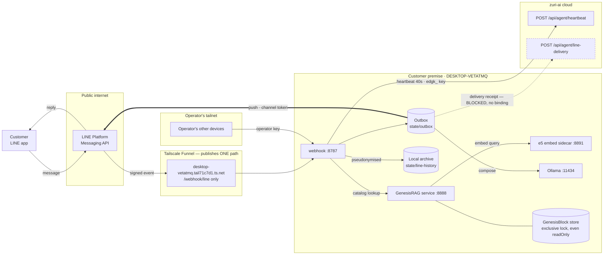
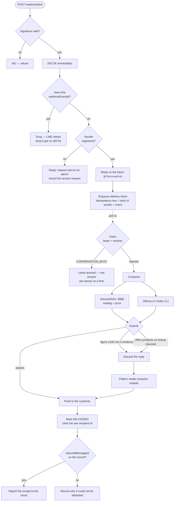
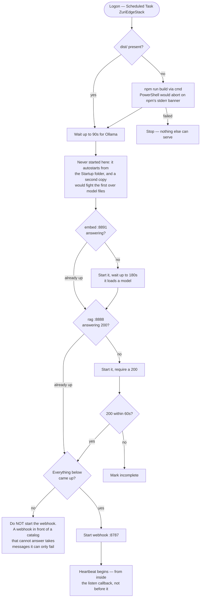
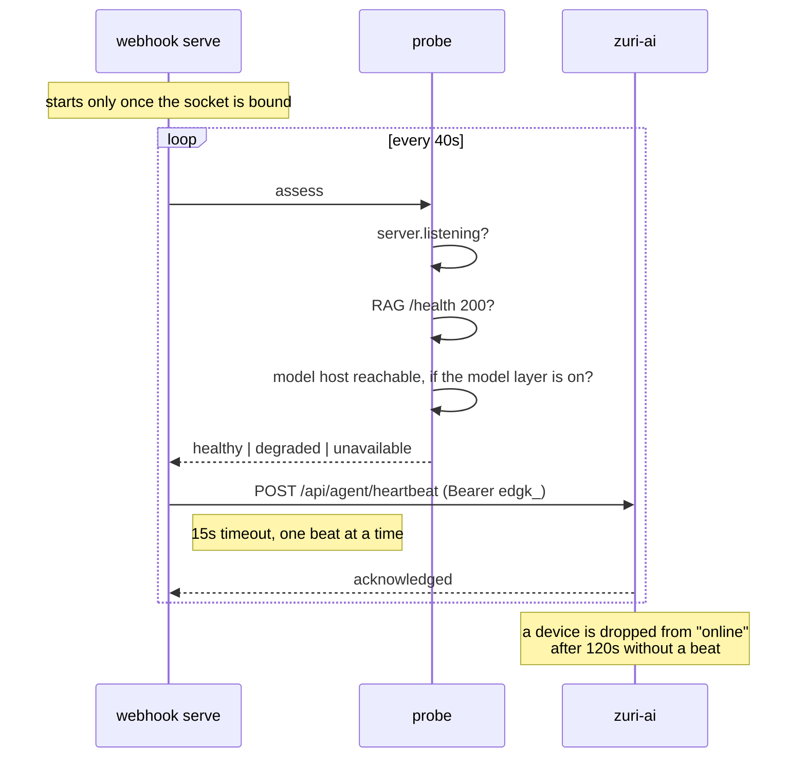
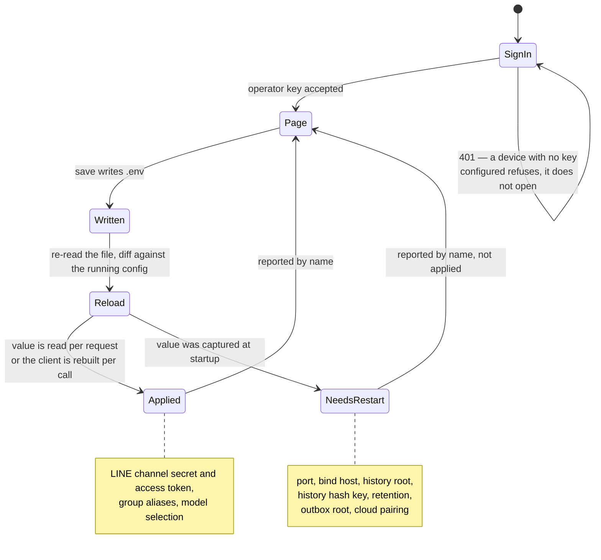

# System & activity diagrams

> Current transport decision: [Server-owned LINE and optional Edge](SERVER-LINE-OPTIONAL-EDGE.md)
> implements upstream ADR-061. New runtimes are compute-only; the transport behavior below
> applies only to explicitly selected `LEGACY_EDGE` installations during migration.

Drawn from the code as it stands at `95a5f82`, not from intent. Where a diagram shows something
that does not work yet, it says so on the arrow rather than omitting it — an architecture picture
that quietly leaves out the broken edge is how the gap survives.

Every element here is traceable: ports and paths from `.env` and `src/history/webhook-server.ts`,
the answer path from `src/answer/`, the queue from `src/delivery/`, liveness from
`src/zuri-api/heartbeat.ts`.

---

## 1. Deployment and trust boundaries

The question this answers: **what can reach what, and with which credential.**

**What the picture is claiming**

| Edge | Credential | Note |
| --- | --- | --- |
| LINE → webhook | LINE request signature | The only path the Funnel publishes. Everything else answers 404 from the internet |
| operator → webhook | operator key `zadm_…` | `/gui`, `/api/config`, `/api/graph`, `/api/command/dispatch`. Over the tailnet, not the internet |
| webhook → cloud | minted device key `edgk_…` | Liveness only |
| outbox → LINE | LINE channel access token | **The edge owns the send** (BR-003, retired; zuri-ai BR-011) |
| outbox → cloud | — | Dashed because it cannot run: a receipt needs the cloud's `Message.id`, which needs a server-owned LINE binding this device does not have. BR-008 |

The RAG service is a separate process for one reason: the GenesisBlock engine takes an **exclusive
lock on the store directory even when opened read-only**, so the webhook cannot open it and proxies
instead.

---

## 2. Answering a customer

The question this answers: **why the customer gets an acknowledgement before an answer.**

A LINE reply token expires in about thirty seconds. Composing an answer takes longer than that on
this hardware, so the reply token is spent immediately on an acknowledgement and the real answer
goes out later as a push. That is the whole reason the outbox exists.

**Guards worth naming.** `unverifiedNumbers` rejects a reply containing a figure of 100 or more that
appears neither in a recorded tool result nor in the customer's own words — the failure it prevents
is an invented price. `suggestsUnseenProducts` rejects a reply that offers products when the model
made no tool call at all. Both discard the model's text and fall through to the deterministic
reader, so the customer still gets a correct if plainer answer.

**The raw recipient id** is the one identifier stored unhashed anywhere in this project, and it is
cleared the moment the record reaches a terminal state — it exists only for the seconds a delivery
is in flight.

---

## 3. Bringing the stack up

The question this answers: **why the webhook starts last.**

**Why the RAG probe insists on a 200 while the skip check does not.** Two different questions.
*"Is something already holding this port?"* is answered by any reply at all, including a 5xx — and
it must be, because starting a second RAG service would fight the first over the store lock.
*"Did what I just started come up?"* is not: the RAG service answers `/health` with 503 while its
store or embedder is still loading.

---

## 4. Liveness

The question this answers: **what the cloud's Edge tab is actually telling you.**

`healthy` requires the dependencies to answer, not merely to exist. This distinction is not
theoretical: Ollama's server process died while its tray application kept running, every answer
fell back silently to the pattern reader, and the device reported healthy throughout — which is
what a hardcoded status buys you.

`unavailable` is reserved for the webhook's own listener being down, because at that point nothing
is serving LINE at all. A missing dependency is `degraded`: the device still accepts and answers,
just less well, and calling that unavailable teaches whoever reads the tab to ignore it.

---

## 5. Changing configuration

The question this answers: **why some settings take effect on save and others do not.**

Saving used to answer `{success:true}` regardless, which was true of the file and said nothing about
the device. A token rotation where the form still held the old value wrote the same bytes back and
looked exactly like success — and did, for an hour.

`dotenv.config()` is deliberately not used for the reload. It will not overwrite a variable already
present in `process.env`, so after the first load it can only ever return what the process started
with, which is the staleness being fixed.

---

## What these diagrams do not show

- **The Studio job lane.** `LineOaTransportJob` (zuri-ai ADR-060 D5) does not exist on `main` — no
  routes, no models, contract unpublished. When it ships, Studio-initiated sends report as the job's
  own result and must **not** also use the delivery route, or the Inbox records one send twice.
- **The command console dispatch path**, which resolves a recipient against configured aliases and
  refuses anything else. It is a small enough flow that the prose in `src/line-poc/targets.ts` says
  it better than a box would.
