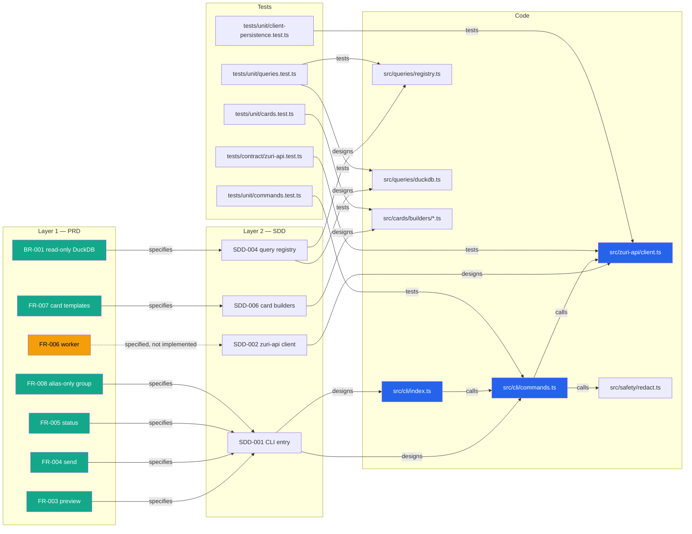

# Appendix D — Traceability Matrix

| Field | Value |
|-------|-------|
| **Version** | 1.7.0 |
| **Status** | Draft |
| **Author** | Boss |
| **Created** | 2026-08-10 |
| **Last Updated** | 2026-09-06 |
| **Approved By** | — |

## Version History

| Version | Date | Author | Changes |
|---------|------|--------|---------|
| 1.0.0 | 2026-08-10 | Boss | Initial creation via RWANG doc-architect |
| 1.1.0 | 2026-08-10 | Boss | `preview`/`send`/`status` wired to `MockZuriApiClient` (`src/cli/commands.ts`); FR-003/004/005/008, AC-002/003/007 move from pending to implemented; first unstructured requirement-ID comments appear in `src/` |
| 1.2.0 | 2026-08-31 | Claude | Re-checked against the working tree after a system-design review. FR-001/002 and NFR-001/SEC-004 corrected from stale "untested" to their actual, already-tested or newly-tested state; SEC-005 moved from "gap" to "partially implemented" (`src/config/secret.ts`); added D.9 (the two generations this PRD does not describe) and D.10 (the cross-repository requirement-id namespace collision behind the FR-092→FR-093 renumbering in commit `53996af`) |
| 1.3.0 | 2026-09-06 | Claude | The graph became the source of truth for this appendix. Structured `@req`/`@tested` annotations were added across `src/` and `tests/`, and a scanner defect that truncated namespaced ids was fixed — see §D.7 and §D.10. SEC-003 and SEC-006 were retired alongside BR-003. |
| 1.4.0 | 2026-09-06 | Claude | The scanner defect described in §D.10 was fixed upstream and released as `rwang` v1.4.0, and the official scanner now reproduces this graph's edges exactly. §D.7 records the independent check. |
| 1.5.0 | 2026-09-06 | Claude | BR-010 added: the archive now records what the runtime sends, not only what it receives. Figures refreshed. A bare requirement id written into §D.10's prose had registered itself as a requirement; described rather than spelled now. |
| 1.6.0 | 2026-09-06 | Claude | RAG-OPS-001 tested: no requirement now has code without a test. Figures refreshed. |
| 1.7.0 | 2026-09-06 | Claude | The GenesisBlock ingest is tested too, against a temporary store where the native binding is installed. Nothing in this repository is now excluded from testing on the grounds of needing an engine. |

Parent: [`../PRD-SDD-v1.0.md`](../PRD-SDD-v1.0.md). Maps every requirement/acceptance-criterion ID
to its implementing code and its verifying test, per IEEE 29148 traceability practice. Update this
table in the same commit that changes the mapped code or test — `doc-preflight` checks for drift.

*Re-checked on 2026-08-10 after wiring `preview`/`send`/`status` to `MockZuriApiClient`. Coverage:
**1/20** source files (`src/cli/commands.ts`) now carry unstructured (`FR-xxx`, `AC-xxx`)
requirement-ID comments; 0 files use the structured `@req`/`@spec`/`@designs`/`@tested` form — see
[§D.7](#d7-doc-graph-coverage-report). Mappings below for FR-003/004/005/008 are now verified
against real code (`src/cli/commands.ts`, `src/cli/index.ts`) and tests
(`tests/unit/commands.test.ts`); other mappings remain inferred from file/function purpose.*

## D.1 Functional requirements → code → test

| ID | Code | Test | Status |
|---|---|---|---|
| FR-001 | `src/cli/index.ts` (`handleConfigCheck`), `src/config/index.ts` (`validateConfig`) | `tests/unit/config.test.ts` (2026-08-31) | **Implemented, tested** — exercises `validateConfig`'s decision logic directly via an injectable `env` param; `handleConfigCheck`'s thin print/exit wrapper is not itself under test |
| FR-002 | `src/cli/index.ts` (`handleHealth`, `buildHealthReport`) | `tests/unit/config.test.ts` (2026-08-31) | **Implemented, tested** — `buildHealthReport` was extracted as a pure function specifically so this could be tested without triggering `handleHealth`'s `process.exit` path; see `src/cli/index.ts`'s entry-point guard |
| FR-003 | `src/cli/commands.ts` (`runPreview`), `src/cli/index.ts` (`handlePreview`) | `tests/unit/commands.test.ts` | **Implemented, tested** — against `MockZuriApiClient` only (ADR-005), not a real Zuri endpoint |
| FR-004 | `src/cli/commands.ts` (`runSend`), `src/cli/index.ts` (`handleSend`) | `tests/unit/commands.test.ts` | **Implemented, tested** — against `MockZuriApiClient` only; real delivery still gated (S7 entry gates, see [PRD-SDD-v1.0.md §2.8](../PRD-SDD-v1.0.md)) |
| FR-005 | `src/cli/commands.ts` (`runStatus`), `src/cli/index.ts` (`handleStatus`) | `tests/unit/commands.test.ts` | **Implemented, tested** |
| FR-006 | `src/zuri-api/client.ts` (`claimJob`/`sendHeartbeat`/`submitEvidence` interface + mock); no `src/bridge/` directory yet | `tests/contract/zuri-api.test.ts` (interface/mock only) | Interface + mock only, worker not implemented (S6) |
| FR-007 | `src/cards/builders/*.ts` | `tests/unit/cards.test.ts` | Implemented, tested |
| FR-008 | `src/cli/commands.ts` (`runSend` group validation + `isRawLineId` guard) | `tests/unit/commands.test.ts`, `tests/unit/redact.test.ts` | **Implemented, tested** |

## D.2 Non-functional requirements → code → test

| ID | Code | Test | Status |
|---|---|---|---|
| NFR-001 | `src/safety/redact.ts` | `tests/unit/redact.test.ts` | **Implemented, tested** — this row was stale; the test file already existed at the time of the 2026-08-31 review pass, this table had simply not been updated to match |
| NFR-002 | `src/cli/output.ts` | — | Implemented, untested — low risk (the module is `JSON.stringify` + a stdout write); not prioritized in the 2026-08-31 pass |
| NFR-003 | `src/bridge/` (planned) | — | Not yet implemented (S6) |
| NFR-004 | `src/cli/index.ts` / `src/bridge/` | — | Not yet implemented (S6–S7) |
| NFR-005 | `src/evidence/builder.ts` | — | Partially implemented; end-to-end trace not yet verifiable without S6/S7 |

## D.3 Acceptance criteria → verification

| ID | Verifying test / gate | Status |
|---|---|---|
| AC-001 | S8 operational verification (planned) | Pending |
| AC-002 | `tests/unit/commands.test.ts` (`runPreview` never calls a delivery path; `deliveryIntent: 'preview'` asserted) | **Implemented against the mock**; S8 end-to-end verification against real Zuri still pending |
| AC-003 | `tests/unit/commands.test.ts` (`runSend` requests `line_push` delivery intent; group-alias validation asserted); real send-vs-review decision requires a real Zuri policy snapshot, gated on Zuri Phase 2, G0, CR-003, CR-004 | **Command-request path implemented against the mock**; policy decision itself is out of this repo's control and still pending |
| AC-004 | S8 "stale lease" test (planned) | Pending (worker not yet implemented) |
| AC-005 | `tests/unit/queries.test.ts`, `tests/fixtures/duckdb.fixture.ts` cover schema/row-cap; evidence submission itself is pending S6 | Partial |
| AC-006 | S8 "offline bridge" test (planned) | Pending |
| AC-007 | `tests/unit/commands.test.ts` (`runStatus` returns `CommandJob` with no credential/PII fields, since `CommandJob` itself carries none) | **Implemented against the mock** |
| AC-008 | S8 operational verification (planned) | Pending |

## D.4 Business rules → enforcement point

| ID | Enforcement | Status |
|---|---|---|
| BR-001 | `src/queries/duckdb.ts` (read-only open), `src/queries/registry.ts` (fixed query IDs) | Implemented |
| BR-002 | `src/queries/types.ts` (`RegisteredQuery` shape), `src/queries/registry.ts` | Implemented |
| BR-003 | ~~Architectural — no LINE SDK/token path exists in `src/`~~ **Retired 2026-09-05.** The claim was never true: `src/line-poc/client.ts` has called `api.line.me` throughout. Replaced by BR-007 (token custody), BR-008 (delivery receipts, unmet) and BR-009 (the config surface requires the operator key) | `docs/LINE-REPLY-OWNERSHIP-DECISION.md` |
| BR-004 | `.env.example`, `.gitignore` | Implemented |
| BR-005 | Idempotency key handling | Not yet implemented (S6–S7) |
| BR-006 | `src/evidence/builder.ts` should reject a job without `policySnapshotId` | Needs explicit check — verify during S6 |

## D.5 Security requirements → enforcement point

| ID | Enforcement | Status |
|---|---|---|
| SEC-001 | Architectural — no PostgreSQL client dependency in `package.json` | Implemented by omission |
| SEC-002 | `src/queries/registry.ts` (fixed `sqlTemplate`, no dynamic SQL construction from input) | Implemented |
| SEC-003 | Architectural — no LINE SDK dependency | Implemented by omission |
| SEC-004 | `src/safety/redact.ts` | **Implemented, tested** — `tests/unit/redact.test.ts` (row corrected 2026-08-31; the test already existed) |
| SEC-005 | `src/config/secret.ts` (`resolveSecret`) — Docker-secret `${NAME}_FILE` adapter, applied to the device token, LINE channel secret, history hash key, POC push token, Anthropic key, and the stack binding bearer | **Partially implemented, 2026-08-31** — plaintext `.env` remains a valid input for local dev; an OS-credential-store (Windows Credential Manager) adapter is the remaining half, needed only once this runs unattended on a shared host |
| SEC-006 | External to this repo (Zuri host secret store) — nothing to trace here | N/A |

## D.6 Known gaps (surfaced by this pass)

1. ~~No CLI-level or redaction-level unit tests exist yet (FR-001/002, NFR-001/002)~~ **Resolved
   2026-08-31**: `tests/unit/config.test.ts` covers FR-001/002 directly (`validateConfig`,
   `buildHealthReport`); NFR-001/SEC-004 (`redact.ts`) already had `tests/unit/redact.test.ts` —
   this table had simply not been updated to say so. NFR-002 (`src/cli/output.ts`) remains
   untested, judged low-risk and not prioritized.
2. ~~`src/config/index.ts` reads device credentials straight from `.env`~~ **Partially resolved
   2026-08-31**: `src/config/secret.ts` adds the `${NAME}_FILE` half of SDD-007's "OS/Docker
   secret-reference adapter" role. The OS-credential-store half (Windows Credential Manager) is
   not built; plaintext `.env` remains the default for local dev.
3. `src/evidence/builder.ts` exists but BR-006 (reject job without valid `policySnapshotId`) has
   no visible enforcing check yet — confirm during S6 worker implementation.
4. ~~`src/zuri-api/client.ts` implements the full `IZuriApiClient` interface as an in-memory mock
   used only by `tests/contract/zuri-api.test.ts` — it is not yet called from `src/cli/index.ts`.~~
   **Resolved 2026-08-10**: `preview`/`send`/`status` now call it via `src/cli/commands.ts`
   (ADR-005). FR-006 (worker) is the remaining unwired piece.
5. `MockZuriApiClient` now persists to `defaultMockStatePath()` (an OS temp-dir file) so CLI
   invocations chain correctly — see ADR-005. This file must be retired (or the default path
   changed) once a real HTTP `IZuriApiClient` lands in S6, so `status` never silently serves state
   left over from the mock era.
6. `send`'s group-alias validation now rejects a raw LINE ID pattern (`isRawLineId`), but this is a
   client-side defense only — the authoritative check is still Zuri's, once a real endpoint exists.

## D.7 doc-graph coverage report

*Generated by `rwang:doc-graph` v2.0.0 from `docs/registry/`, 2026-09-06. `docs/.doc-graph.json` is
the machine-readable form and the source of truth; §D.1–D.5 are the human-readable narrative and can
lag it. `rwang:validate-graph` reports `ok: true` with zero findings.*

### Independently reproduced

The graph above was projected by a scanner written for this repository, and the defect in §D.10 was
found in that same scanner — so for a while the thing being checked and the thing doing the checking
had one author. That is no longer true. `rwang` v1.4.0 carries the fix and understands this
repository's annotation forms, and running it here reproduces the edge set exactly:

| | `rwang` v1.4.0 scanner | this repository's projection |
|---|---|---|
| `implements` claims | 80 | 80 |
| `verified_by` claims | 74 | 74 |

Not merely equal counts — the same set of `(file, requirement id)` pairs, from two implementations
written separately, in different languages, walking the tree by different means. Both of `rwang`'s
scanners agree with each other as well: 153 structured annotations, 77 distinct ids, from the
PowerShell and the shell reading alike.

Two properties this confirms rather than asserts:

- **The closed world is closed.** Every id named by an `@req` or `@tested` resolves to a registered
  requirement. Nothing annotated points at an id this registry does not own.
- **The `@spec` ids project no edge, on purpose.** `FR-052`, `FR-093`, `FR-143`, `FR-144`,
  `NFR-017` and — since ADR-061 landed — `ADR-061` and `FR-150` belong to zuri-ai; none is
  registered here. `SERVER-LINE-OPTIONAL-EDGE.md` puts it plainly: this runtime implements the
  edge half of upstream FR-150 *without forking that requirement*. A reconcile run registered
  both as owned once, because the upstream pattern was a hardcoded range that stopped at
  ADR-060 — the phantom-id mistake in the other direction: an id that exists, but not ours. `@spec` records that this code conforms to a
  decision without claiming ownership of it, which is exactly what a closed-world registry must not
  do.

| Metric | Value | Target |
|---|---|---|
| Registered requirements | 142 | — |
| Requirements with an `implements` edge from an `@req` annotation | 51% (72/142) | — |
| Requirements with a `verified_by` edge from an `@tested` annotation | 51% (72/142) | 90% of those with code |
| Requirements with code but no test | 0 | 0 | 0 |
| Graph size | 262 nodes, 347 edges (142 defines, 48 references, 81 implements, 76 verified_by) | — |

Every edge is projected from a structured annotation or a registry entry — nothing is inferred from
a file mentioning an id, which the 1.0.0 graph did and which v2 forbids. The migration proposal that
stood in this section is done: the annotations exist, so a `doc-graph` pass now verifies rather than
reconstructs.

### What is deliberately not traced

- **ADR-001..015 carry no `@req`.** An ADR is a decision the design conforms to, not a unit of work
  a file implements. `@spec` is the right predicate for those, and it projects no `implements` edge.
- **SDD-003 (`src/bridge/`)** — the directory does not exist. The PRD marks it *(planned S6)*, so
  the absence is the accurate answer, not a gap in the annotations.
- **AC-004, AC-008, FR-006** describe the bridge and the cloud's delivery-admission decision. Both
  live outside this runtime, so no file here can honestly claim them.
- **`RAG-OPS-001` was the last one-sided trace, and both its halves are now tested.** The claim
  that it could not be tested confused two things. The *refusals* — declining to serve before the
  catalog is ready, declining to adopt a store whose snapshot has moved — are decisions taken
  before anything is opened, and need no engine; that test asserts the refusal's type rather than
  its reason, because the reason differs on a host without the binding and the refusal does not.
  The *ingest* does need an engine, and is covered by an integration suite that builds a two-product
  catalog into a temporary store, checks the manifest records what was written, and asserts the
  store's lock refuses a second owner — `GENESIS_STORE_ALREADY_OPEN` is the single-owner claim made
  observable. It is skipped where the binding is absent, in the manner of the DuckDB slice: named
  and loud rather than silently green.
- **The 53 `ZPP-*` requirements** are registered but mostly untraced. The plugin platform is approved
  contract-only (P0/P1); `src/plugin/` implements the envelope, the command set and the auth
  boundary, and the rest is genuinely not built.

## D.8 Doc-code graph (visual)

The only remaining dashed edge is FR-006 (`worker`) — `IZuriApiClient.claimJob`/`submitEvidence`
exist and are contract-tested, but nothing calls them yet; there is no `src/bridge/` directory.

## D.9 Generations this PRD does not describe

*Added 2026-08-31, from a system-design review of the working tree against this document set.*

`git log` and `src/` both grew past this PRD's 2026-08-10 scope without the PRD following. Three
generations coexist in the repository today; only the first is what §1–2 above actually specify:

| Generation | What it is | Components (§2.2) | Governing spec |
|---|---|---|---|
| 1 — Command Agent | The CLI + bridge worker this PRD describes | SDD-001…008 | This document, `COMMAND-AGENT-SPEC.md`, `AGENT-RUNTIME-SPEC.md` |
| 2 — Local conversational answer | Role-scoped pricing answers over LINE DMs: three-layer answer stack, deny-by-default identity, durable push outbox | SDD-009…011, 014…016 | `CONVERSATIONAL-ANSWER-SPEC.md`, `PRICING-ENGINE-SPEC.md`, `LINE-HISTORY-ARCHIVE-SPEC.md`, `LINE-DM-FAST-POC-SPEC.md` (superseded) |
| 3 — Zuri V2 stack transport | This repo as a signature-verifying transport; Zuri V2 owns answer policy; delivery receipts close the outbound record (FR-092/093) | SDD-012, 017 | `LINE-STACK-ANSWER-PILOT-SPEC.md` |

This is not a defect in Generations 2–3 — each has its own spec, its own acceptance criteria, and
(per `AGENTS.md` v0.5.0b) its own permission-matrix rows. It is a defect in this PRD's currency: a
reader who opens only `PRD-SDD-v1.0.md` would not learn that roughly two-thirds of `src/` exists.
§2.2 now lists the components; the requirements in §1.4–1.7 remain Generation-1-only; each newer
generation's own spec remains the source of truth for its requirements and acceptance criteria
until someone folds them into a PRD v2.

## D.10 Cross-repository requirement-id namespace

*Added 2026-08-31.* This document's FR/NFR/BR/SEC/AC ids (§1.4–1.7, §2.5) are scoped to this
repository alone. Generation 3 code and commits (`957b56c`, `53996af`) cite ids owned by the Zuri
V2 stack repository instead — `FR-028`, `FR-050`, `FR-052`, `FR-092` (renumbered to `FR-093` once
the stack side's numbering landed, per `53996af`'s own commit message), and `NFR-017` — none of
which appear in this table because they were never this repository's requirements to trace.

That renumbering is the cost of not tracking the distinction: a same-named id space across two
repositories means a local id and a stack id can collide or drift without either side noticing
until a commit message has to explain the fix. Two ways to close this, either is sufficient:

1. Add an "Owning repo" column to a future ids table here, so `FR-050` (stack) and a local `FR-050`
   (should one ever be assigned) are visibly different rows; or
2. Adopt a prefix at the boundary — `STACK-FR-050` in this repo's own comments/docs — so the two
   spaces cannot collide by construction.

Not applied to existing code comments in this pass (that would touch files unrelated to the
gaps this pass closed); flagged here so the next requirement-id comment written in `src/stack/` or
`src/history/webhook-server.ts` picks one of the two conventions instead of continuing to cite a
bare `FR-0xx` that this table cannot resolve.

*Updated 2026-09-06.* Option 2 above turned out to be already in use inside this repository, and
the tooling did not know it. Three local namespaces exist — `ZPP-*` (plugin platform), `RAG-*`
(GenesisBlock RAG) and `TAX-*` (catalog taxonomy) — and the bootstrap scanner's pattern started
matching in the middle of them, taking the tail of `ZPP-FR-009` for a PRD-SDD id of the same
number. Twenty-five registry
entities named ids that do not exist, and twenty-seven more claimed a plugin, RAG or taxonomy spec
discussed a PRD-SDD requirement it had never mentioned.

The rule that fixes it is one line: an id match may not begin in the middle of an identifier. The
scanner now refuses to start after a `-` or an alphanumeric, so a namespaced id is captured whole
or not at all. The registry was rebuilt from the corrected scan and the validator is clean.

Worth stating plainly, because it is the argument for option 2 over option 1: the prefix convention
was doing its job the whole time. The documents were unambiguous; only the reader was not.

*Updated 2026-09-06, second pass.* The fix is no longer local. It was carried upstream and released
as [`rwang` v1.4.0](https://github.com/Freshair129/rwang-plugin/releases/tag/v1.4.0), where the same
defect existed in both of the shared scanners and failed in opposite directions: the shell one
reported the bare tail of `ZPP-FR-009` as though it were a PRD-SDD requirement, and the PowerShell
one reported nothing at all. Anyone running
the shared tooling against this repository now reads the namespaces correctly.

Two conventions this repository uses were also formalised there rather than left as local habit:

- **`@tested <requirement-id>` on a test file** is now part of the grammar, alongside
  `@tested <file>` on a source file. Both assert the same `verified_by` relation from opposite ends.
  Until v1.4.0 the shared scanner understood only the second form, so this repository's `tests/`
  tree read as **zero annotations** while holding sixty-nine — a silence, not a warning. Annotating
  from the test side is the more durable of the two here: the assertion and the claim that it
  verifies a requirement sit in one file, so deleting the test takes its claim with it.
- **A namespaced id is one id.** `ZPP-FR-009` is one identifier, not a prefix bolted to a shorter
  one, and tooling that starts
  matching in the middle of an identifier is not losing a prefix — it is naming a different
  requirement.

## Optional Edge containment review — 2026-09-06

Existing requirement ownership is unchanged. [FR-150 Edge execution](../SERVER-LINE-OPTIONAL-EDGE.md) references the upstream contract. [Approved containment](../CODEX-STATELESS-ISOLATION-PROPOSAL.md) is verified by headless and conversation worker regression tests (901 passing, 4 skipped locally). This appendix is a projection, not test evidence.
