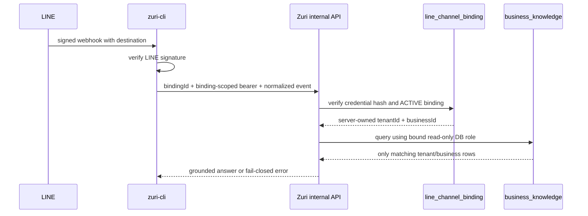

# ADR-018 — Supabase production tenant isolation

**Status:** Candidate — awaiting owner approval

| Field | Value |
|---|---|
| **Version** | 0.1.0b |
| **Status** | Candidate — awaiting owner approval |
| **Project** | `qcnmhyglarzcpudjorzc` |

## Context and observed risk

The owner designated Supabase project `qcnmhyglarzcpudjorzc` as the Zuri cloud database. The
project endpoint is reachable; an unauthenticated Data API inventory request returns `401`. This
proves reachability only. It does not prove the remote schema, migration state, grants, RLS,
backups, region, or production readiness because no database credential was inspected.

The current local Phase 1 migration is not safe enough to deploy as production tenancy:

1. `public.business_knowledge` has `business_id` but no `tenant_id`;
2. its uniqueness is `(business_id, product_code)` without a tenant/business ancestry FK;
3. the REST adapter uses a Supabase secret key, which bypasses RLS;
4. the internal LINE endpoint accepts `tenantId` and `businessId` from its request body;
5. the generated Prisma Postgres schema has application-level tenant checks but several
   cross-scope relations are not composite database foreign keys; and
6. `public` is an exposed Supabase schema by default.

Application filtering alone is not an isolation boundary. Production requires structural
integrity, database policy, least-privilege runtime identities, and server-owned channel binding.

## Decision

### D1 — Project and environment boundary

- `qcnmhyglarzcpudjorzc` is the **Zuri production cloud project**.
- Development, automated tests, previews, and staging must not create fake tenants inside this
  project. They use local Postgres/Supabase or a separate Supabase project.
- Supabase is cloud relational authority for hosted Zuri and LINE-facing reads. SQLite remains the
  offline/local adapter until a separately reconciled cutover; GenesisBlockDB remains agent
  memory/index infrastructure and does not replace Supabase relational/RLS authority.
- MSP keeps its own database/schema/role and must never use the Zuri runtime credential.

### D2 — Stable production identity reservation

The first production scope is reserved as follows. Display labels may change; IDs and codes do not.

| Entity | Internal UUID | Stable code | Initial label |
|---|---|---|---|
| Portfolio | `dfeaa9d2-7c65-48bc-9c30-ba083eac8439` | `PF-ZURI-OWNER` | Zuri Owner Portfolio |
| Tenant | `77cdbe70-3111-4a04-922a-8059be99a8b0` | `TNT-SMARTGIFT` | SmartGift Tenant |
| Business | `834fa869-62f3-431c-a287-e9a95e91175b` | `BUS-SMARTGIFT` | SmartGift |
| LINE binding | `84ed2c90-ab44-46f3-9618-1f24df0744b9` | `LINE-SMARTGIFT-OA` | SmartGift LINE OA |
| Bootstrap audit batch | `948076f9-6a0a-43f3-88f5-d7225345ac8a` | `BOOTSTRAP-PROD-001` | Initial isolated cloud bootstrap |

The existing export value `business_id="smartgift"` is a source/human code, not a production
primary or foreign key. Migration maps it to `BUS-SMARTGIFT` and the internal Business UUID.

SmartGift starts in its own Tenant. Another Business may join `TNT-SMARTGIFT` only after an
explicit data-sharing decision states that shared CRM/customer data is intended. Otherwise a new
Tenant is mandatory, even when both Businesses are owned by the same Portfolio.

### D3 — Database schemas and roles

```text
postgres / migration owner
  └─ deploys only; never used by application runtime

zuri_core (not exposed through Data API)
  ├─ Portfolio / Tenant / Business and operational tables
  ├─ business_knowledge
  ├─ line_channel_binding
  └─ immutable audit events

zuri_api (optional exposed contract surface)
  └─ explicit views/functions only; no base tables

public
  └─ no Zuri base tables; revoke broad runtime access
```

Runtime role separation:

- `zuri_migrator`: DDL/data migration only; stored only in deployment secrets;
- `zuri_app_runtime`: hosted Zuri API role, `NOBYPASSRLS`, no DDL;
- `zuri_line_smartgift_ro`: `NOBYPASSRLS`, SELECT-only, permanently bound to the SmartGift
  Tenant/Business scope; and
- `anon`, `authenticated`, and `service_role` receive no direct base-table grants for the Phase 1
  business-knowledge path.

Supabase secret/service-role keys bypass RLS and therefore cannot be the normal LINE knowledge
runtime credential. The existing REST secret-key adapter must be replaced or kept disabled before
production traffic.

### D4 — Structural tenant integrity

Every tenant-owned production row carries non-null `tenant_id`. Every business-owned row also
carries non-null `business_id`.

The database must enforce ancestry, not merely index it:

```text
Tenant(id) -> Business(tenant_id, id)
Business(tenant_id, id) -> BusinessKnowledge(tenant_id, business_id)
Business(tenant_id, id) -> LineChannelBinding(tenant_id, business_id)
```

`Business` receives a unique constraint on `(tenant_id, id)`. Child tables use a composite FK
`(tenant_id, business_id) -> Business(tenant_id, id)`. This rejects a valid Business UUID paired
with the wrong Tenant UUID before application code can read or write it.

The production cutover audit must inventory every table containing both tenant and business
dimensions. `Branch`, `Membership`, `Workspace`, `Customer`, local-workspace metadata, file
metadata, conversations, messages, and future CRM tables cannot pass the production gate with
only application-level ancestry checks.

The Prisma `String @default(uuid())` compatibility contract currently stores UUID strings as
Postgres text. Phase 1 preserves that representation and validates UUID form; changing all core
PK/FK columns to native `uuid` is a separate all-table migration, not an opportunistic edit.

### D5 — RLS and least privilege

- Enable and force RLS on every tenant-owned table in any accessible schema.
- Deny by default: absence of a matching policy returns no rows.
- Index every RLS equality path, beginning with `(tenant_id, business_id, is_active,
  product_code)` for business knowledge.
- Human/browser access later uses a verified Supabase Auth `auth.uid()` mapped to persisted Zuri
  Person/Membership authority. Client-editable `user_metadata` is never authorization input.
- `app_metadata` may cache non-authoritative routing hints, but persisted Membership remains the
  revocable authority because JWT claims can be stale.
- LINE machine access uses the scope-bound `zuri_line_smartgift_ro` database identity. It cannot
  choose another tenant by setting a session variable or request parameter.
- Migration/ops roles may bypass RLS only inside an audited deployment job and are never loaded by
  the public LINE runtime.

### D6 — LINE OA binding is server-owned

`line_channel_binding` stores:

```text
id, code, provider, tenant_id, business_id,
external_channel_id_hash, credential_hash, status,
valid_from, expires_at, rotated_at, created_at, updated_at, version
```

The LINE channel access token and channel secret remain in a secret manager, not in this table.
Only high-entropy credential hashes and destination/channel hashes are persisted.

The internal webhook contract changes from client-selected scope to server-resolved scope:



`tenantId` and `businessId` in an inbound request body are rejected or ignored. A binding mismatch,
unknown destination, expired/rotated credential, inactive tenant/business, or database error fails
before knowledge/model/reply calls.

### D7 — Migration order and remote preflight

No SQL is applied until the following read-only evidence is captured:

1. link/identify project ref `qcnmhyglarzcpudjorzc` without printing credentials;
2. inventory remote schemas, tables, roles, grants, RLS policies, extensions, and migration history;
3. confirm Point-in-Time Recovery/backups appropriate to the paid plan or take a verified logical
   backup before first mutation;
4. run database/security advisors and record findings;
5. determine whether `public.business_knowledge` or any Zuri core table already exists;
6. compare local and remote migration histories; never rewrite an applied migration; and
7. create a rollback/checkpoint artifact before inserting production identity rows.

Then execute in bounded transactions:

1. create private schemas and least-privilege roles without embedding passwords in migrations;
2. deploy core Portfolio/Tenant/Business structure;
3. add composite ancestry constraints and RLS policies;
4. insert the reserved Portfolio/Tenant/Business and LINE binding metadata idempotently;
5. deploy tenant-aware `business_knowledge`;
6. transform the 74 approved records to internal tenant/business UUIDs and import;
7. reconcile counts, source hashes, null price policy, grants, policies, and negative cross-tenant
   probes; and
8. keep LINE answering disabled until all production gates pass.

### D8 — Audit, observability, and rollback

Audit events record actor/service identity, tenant/business, migration ID, operation, row count,
artifact SHA-256, policy result, timestamp, and correlation ID. They never record credentials or
raw LINE/customer content.

Minimum negative probes:

- SmartGift role can read the 74 approved SmartGift rows;
- a second test Tenant/Business role reads zero SmartGift rows;
- a SmartGift Business UUID paired with another Tenant UUID is rejected by FK;
- `anon`, `authenticated`, and an invalid binding read zero base rows;
- service secret is absent from runtime configuration;
- inactive/expired binding reaches neither model nor LINE Reply API; and
- query plans use tenant-leading indexes under RLS.

Rollback disables the LINE kill switch first, revokes the runtime role, marks the binding inactive,
and quarantines imported rows by bootstrap batch. Source DuckDB and export artifacts remain
unchanged. Production rollback never drops the whole Supabase project or deletes unrelated rows.

## Threat model

| Threat | Required control |
|---|---|
| Caller supplies another Tenant/Business ID | Scope absent from body; resolve from binding and DB role |
| Valid Business paired with wrong Tenant | Composite FK rejects it |
| Missing application filter | Forced RLS and tenant-leading policy |
| Secret key leak | Secret/service key absent from LINE runtime; least-privilege role rotation |
| Stale user JWT | Persisted Membership authorization; short expiry/revocation checks for sensitive actions |
| Cross-tenant prompt assembly | Evidence packet asserts one tenant/business and rejects mixed rows |
| Unknown LINE OA/destination | No default tenant; fail before identity, knowledge, model, or reply |
| Staging data in production | Separate Supabase project; never a staging Tenant |
| Migration rerun/race | Idempotent IDs/codes, transaction, advisory lock, reconciliation |

## Acceptance and exit gates

1. Remote inventory and backup evidence exist before mutation.
2. Reserved IDs are inserted idempotently with exact ancestry.
3. Every Phase 1 knowledge row has exact `tenant_id` and internal `business_id`.
4. Cross-tenant positive and negative database tests pass under real runtime roles.
5. No application runtime uses `postgres`, `service_role`, or a Supabase secret key.
6. LINE scope comes only from an active server-owned binding.
7. RLS, grants, FK constraints, indexes, advisors, migration list, and reconciliation pass.
8. Production kill switch remains off until a real canary passes.

## Approval gate

This ADR reserves identifiers and proposes the production boundary only. It does not claim the
remote database was inspected or changed. After owner approval, implementation starts test-first
with remote read-only inventory, then creates migrations and applies them only with an approved
database migration credential supplied through the local secret environment.

Canonical requirement labels are intentionally not registered in the PRD yet. Registration happens
with the first real code/test anchors after approval so the document graph does not claim false
implementation coverage.

## CHANGELOG

| Version | Date | Status | Summary | Commit Hash | Agent |
|---|---|---|---|---|---|
| 0.1.0b | 2026-08-14 | candidate | Proposed production Supabase schemas, stable IDs, composite tenancy, RLS roles, LINE binding and gated bootstrap | working-tree | ATHER |
