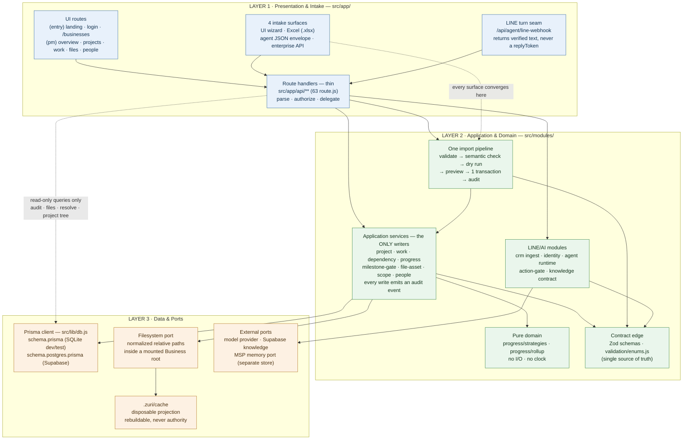
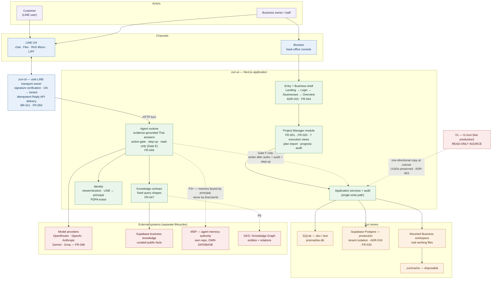
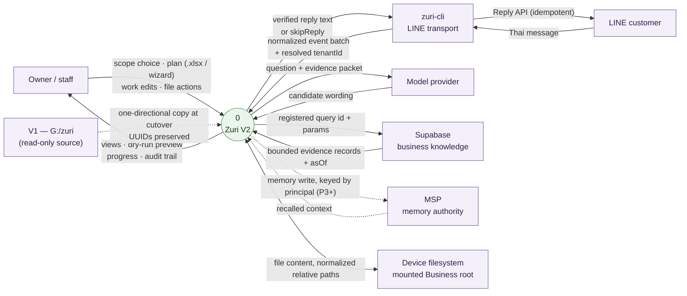
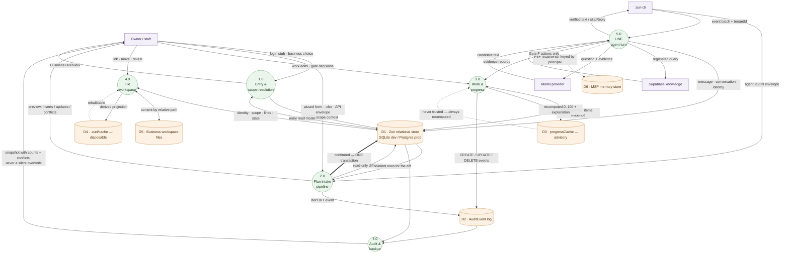
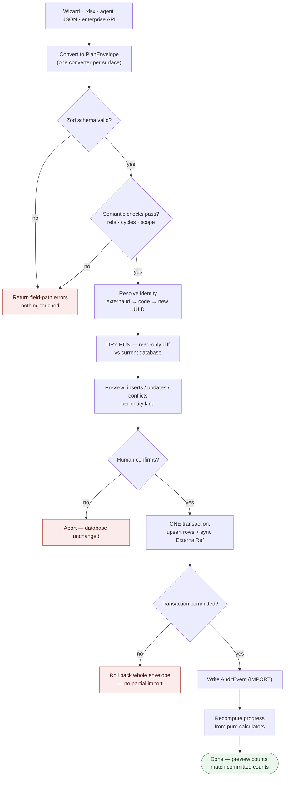
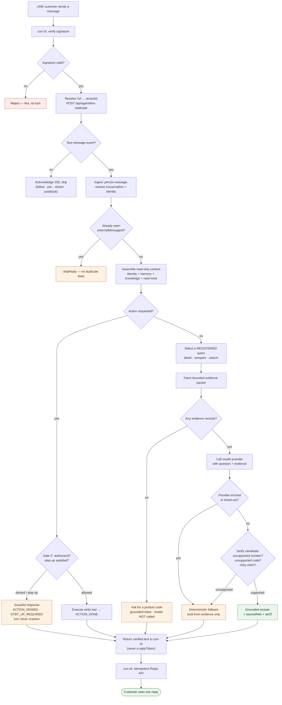

# Architecture Diagrams — Zuri V2

| Field | Value |
|-------|-------|
| **Version** | 1.1.0 |
| **Status** | Draft |
| **Author** | Claude |
| **Date** | 2026-08-15 |
| **Relates to** | [ARCHITECTURE.md](ARCHITECTURE.md), [PRODUCT.md](PRODUCT.md), [ADR-003](decisions/ADR-003-V2-REPLACES-V1-BY-REUSE.md), [ADR-007](decisions/ADR-007-LINE-AI-STACK-SEQUENCING.md), [ADR-016](decisions/ADR-016-SQLITE-AUTHORITY-AND-MANAGED-LOCAL-FILE-WORKSPACE.md), [ADR-018](decisions/ADR-018-SUPABASE-PRODUCTION-TENANT-ISOLATION.md), BR-007, BR-009, BR-010, BR-011, SDD-009, FR-012, FR-019, FR-027, FR-030, FR-045, FR-047…FR-050 |

Four views of the same system:

| § | View | Answers |
|---|---|---|
| **1** | Three-layer architecture | Where does code live, and what may call what |
| **2** | System architecture | Which processes and stores exist, and who may talk to whom |
| **3** | Data flow diagram (L0 + L1) | What **data** moves, from which source to which store |
| **4** | System flowcharts | What **decides** — the branches, the fail-closed paths |

`ARCHITECTURE.md` keeps the domain-shaped diagrams (context chain, execution
hierarchy, progress engine); this document keeps the structural ones.

Diagrams describe **what is in the tree today**, with unbuilt phases marked. Anything
gated by ADR-007 (`P3 Identity` onward) is drawn dashed.

---

## 1. Three-layer architecture

One Next.js app, three layers, dependencies pointing **downward only**. A layer never
imports from the layer above it, and Layer 1 never writes to Layer 3 directly.

### What each layer owns

| Layer | Owns | Lives in | May **not** |
|---|---|---|---|
| **1 · Presentation & Intake** | Rendering, routing, request parsing, authorization check, shaping the response | `src/app/(entry)`, `src/app/(pm)`, `src/app/api` | Contain business rules; **write** to the database (reads are allowed) |
| **2 · Application & Domain** | Business rules, transactions, audit events, progress maths, the import pipeline, AI turn logic | `src/modules/*/application`, `progress/`, `import/`, `src/lib/validation` | Know about HTTP, React, or a specific database engine beyond the Prisma client |
| **3 · Data & Ports** | Persistence, file content, cache projection, outbound calls to MSP / model providers / Supabase | `prisma/`, `src/lib/db.js`, `local-files/`, port modules | Contain domain decisions; be reached from Layer 1 for a **write** |

### The rules the arrows encode

1. **Every write goes through a service** (`application/`), and that service records an
   audit event. Route handlers stay thin — four of them query Prisma directly, all
   read-only (`audit`, `files`, `resolve`, `projects/[id]/tree`).
2. **Four intake surfaces, one pipeline.** UI wizard, Excel, agent JSON and the
   enterprise API all converge on the same envelope → validate → semantic check →
   read-only dry run → preview → single transaction → audit (BR-009, SDD-009). A new
   surface adds a converter, never a second write path.
3. **Progress is recomputed, never trusted from cache.** Layer 2's calculators are pure
   — no I/O, no clock — so a page and an API can never disagree; `progressCache` is
   advisory only.
4. **SQLite is the single relational authority** (ADR-016, BR-010). The filesystem port
   holds content; `.zuri/cache` holds only derived artifacts that can be deleted and
   rebuilt.
5. **Plans are data, never code.** Nothing arriving in an envelope is executed
   (BR-007, SEC-002).
6. **Enums are strings in the database** with `src/lib/validation/enums.js` as the one
   source — Excel dropdowns, the OpenAPI document and validation all derive from it.

---

## 2. System architecture

Processes, surfaces and stores. The **LINE surface is primary** (AI-native intake); the
web app is the back-office console for detail, complex edits and audit.

### Boundaries the diagram is drawing

| Boundary | Statement | Source |
|---|---|---|
| **Transport ⇄ brain** | `zuri-cli` owns LINE signature verification and Reply API delivery; `zuri-ai` owns the knowledge contract, provider invocation and answer verification | ADR-007 (2026-08-14 amendment) |
| **Zuri DB ≠ MSP DB** | May share one Postgres *instance*, never the same database/schema/role — an MSP migration must never drag CRM/POS/invoice down | ADR-007 §P4 |
| **AI never writes directly** | Every AI-derived change is previewed and confirmed by a human; the agent is read-only until Gate F (authorization + audit + step-up auth all proven) | BR-007, ADR-007 |
| **Memory is keyed by principal** | `lineUserId` is a channel fact, not an identity. Memory binds to `tenant:… / principal:…` — which is why Identity (P3) precedes Memory | ADR-007 |
| **One tenant, one system** | A tenant is owned by exactly one system at any instant; LINE OA + workers + writes flip together, or the shop gets double LINE blasts and double charges | ADR-003 §D8 |
| **Reuse is one-directional** | `G:\zuri` is never modified. V1 → V2 copying is allowed; the reverse and any mutation are not. Migrated rows keep V1's UUIDs | AGENTS.md §1, ADR-003 §D4 |
| **External ids are never keys** | Internal UUID + human `code` + `ExternalRef` mapping | BR-002 |

### Build state (2026-08-15)

| Drawn as | Meaning | Which parts |
|---|---|---|
| **Solid** | In the tree, tested | Web shell, Project Manager module, four intake surfaces, application services + audit, SQLite, managed local file workspace, Phase-1 LINE knowledge (FR-047…FR-050) |
| **Dashed** | Decided and gated, not wired | MSP memory (P1/P3), GKS projection (P5), agent write path (Gate F), V1 cutover copy |
| **Postgres** | Schema and migration path exist (`schema.postgres.prisma`, `prisma/postgres/`, `scripts/migrate-to-postgres.mjs`); production provisioning still needs the owner-supplied project and secret boundary | FR-030, ADR-018 |

---

## 3. Data flow diagram

Shapes: `▭` external entity · `(  )` process · `[(  )]` data store. Dashed = gated,
not wired yet.

### 3.1 Level 0 — context diagram

The whole system as one process, with everything it exchanges data with.

### 3.2 Level 1 — processes and stores

### What the store boundaries mean

| Store | Authority | Rule |
|---|---|---|
| **D1** Zuri relational store | **The** authority for identity, ownership, links, status, versions | Only application services write to it; every write emits D2 |
| **D2** AuditEvent | Append-only history | Written inside the same transaction as the change |
| **D3** progressCache | None — advisory | A read may never return a number a page would disagree with; recompute wins |
| **D4** `.zuri/cache` | None — derived | Deleting it is safe; it is rebuilt from D1 + D5 |
| **D5** Workspace files | File **content** only | Relations stay queryable links in D1, never folder structure |
| **D6** MSP memory | Agent memory | Physically separate database from D1 (ADR-007 §P4); keyed by principal, never by `lineUserId` |

---

## 4. System flowcharts

### 4.1 Plan intake — every surface, one pipeline

Four surfaces, one path. Nothing in a plan is ever executed — a plan is data
(BR-007, SEC-002).

### 4.2 LINE agent turn — read-only, fail closed

The whole point of this flowchart is the two guards: **evidence before generation**,
and **verification after it**. The model's wording is advisory; the evidence packet is
authoritative.

**Both flowcharts fail closed.** In §4.1 an invalid or unconfirmed envelope leaves
the database byte-identical. In §4.2 every path that cannot be grounded degrades to
evidence-only text rather than to a plausible sentence — an unverifiable price,
product code, or "ส่งฟรี / มีสต็อก" claim is dropped, not sent.
