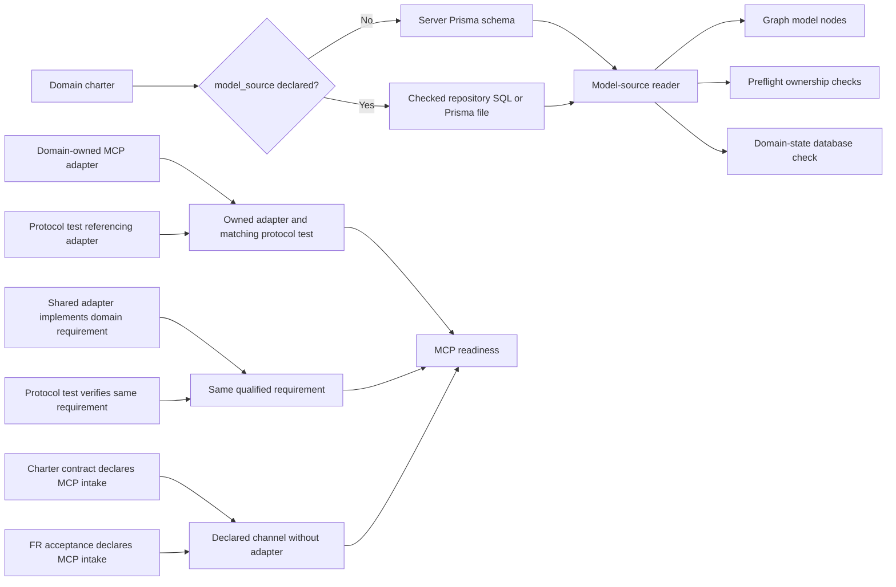

# Domain model evidence sources

This contract implements the owner-approved File governance source proposal
(approval recorded 2026-10-06). It changes evidence attribution, not runtime
ownership or deployment state.

Domain charters remain the ownership source under ADR-025. A charter may declare
one repository-relative `model_source` in frontmatter when its models are owned
by a standalone service rather than the Server Prisma schema:

```yaml
model_source: services/file-management/migrations/0001_file_management.sql
owns_models:
  - FileRecord
  - FileVersion
  - FileOperation
```

Without `model_source`, Server charters continue to use
`apps/server/prisma/schema.prisma`. The source must be an existing, readable
`.prisma` or `.sql` file inside this repository. SQL `CREATE TABLE` names use
snake_case to PascalCase for charter comparison. A planned model without a
declaration in that source remains unimplemented evidence, even if prose names it.
Missing, outside-repository, empty, or conflicting sources cannot establish a
verified database check. The graph, preflight, and domain-state projection use
the same source rule; duplicate model ownership remains a critical preflight
finding. The domain-state `generatedFrom` list includes each declared source.

MCP readiness uses a domain-owned adapter with a protocol test that references
it, or a shared adapter whose code and protocol test both point to the same
domain requirement. A protocol test for another domain cannot verify this
domain. Only executable adapter dispatch and protocol assertions count;
comment-only tests and UI mock data cannot verify an adapter. A domain with no
adapter is `not_implemented` when its charter's contract section and an FR
feature's acceptance criteria both declare MCP as an intake channel; the gap
records the missing transport. Incidental prose about future or prohibited MCP
use does not establish responsibility and remains `not_applicable`. This is
repository evidence only; it is not a deployment or production-runtime claim.

## Evidence flow



Version diff (2026-10-06, 0.1.3): distinguishes a paired, explicit MCP intake
contract from incidental future or prohibition prose; missing declared
transport remains a visible gap. No runtime contract or deployment change.

Version diff (2026-10-06, 0.1.2): makes source lineage and fail-closed source
declarations explicit; clarifies that UI mocks, incidental prose and comments
cannot verify MCP. No runtime contract or deployment change.

Version diff (2026-10-06, 0.1.1): adds the C-3 evidence-flow diagram; no
behavior or contract change.

Version diff (2026-10-06): records the approved standalone model-source and
domain-scoped MCP evidence contract. No ownership, model, or deployment is
declared by this document itself.
