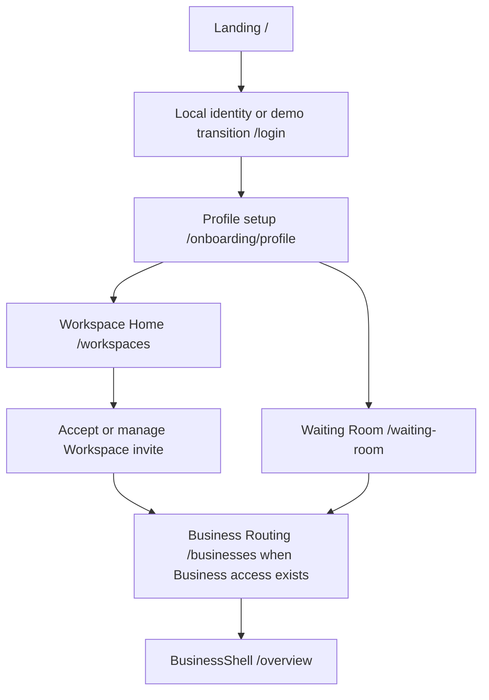
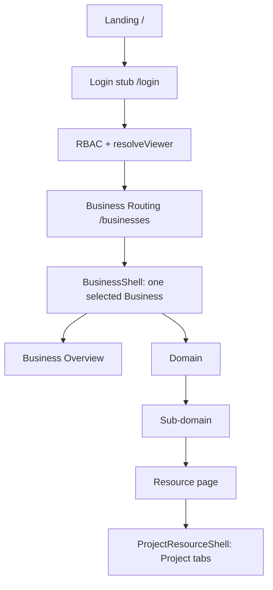
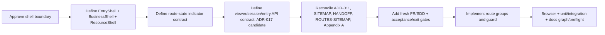

# Zuri V2 — Interface Inventory and Shell Boundary

| Field | Value |
|---|---|
| **Version** | 0.4.0 |
| **Status** | FR-044 and FR-046 verified beta |
| **Date** | 2026-08-14 |
| **Scope** | Entry, Business shell, domains, sub-domains, Project resources, content, indicators, and API contracts |
| **Authority** | ADR-008, ADR-011, ADR-015, ADR-017, ADR-027; SITEMAP-V2-DOMAIN-NAV, HANDOFF-SHELL-V2-CODEX |

## Executive finding

The approved direction for this slice is:

```text
Landing → Login stub → RBAC/viewer resolution → Business Routing → Business shell → domain → sub-domain → resource
```

The FR-044 runtime boundary is now implemented. `src/app/layout.jsx` is provider-only;
`src/app/(pm)/layout.jsx` mounts the guarded BusinessShell, while `/`, `/login`, and
`/businesses` remain outside final shell chrome. The guard resolves viewer, Business,
domain, and Project ownership decisions before AppShell renders.

The immediate architectural rule for the next change is:

> Business is selected before `BusinessShell` mounts. `BusinessShell` never renders a
> Business picker and never operates as an unscoped group overview.

This inventory is an evidence document and current implementation record. Any
remaining IA discrepancies are explicitly tracked as follow-up work rather than
silently treated as delivered by FR-044.

## Approved next onboarding boundary (ADR-027)

The next approved interface starts with Profile rather than Business creation:



This is a design target, not a runtime claim. A Profile-only or Workspace-only
member remains outside BusinessShell. The top-level collaboration Workspace is
the UI presentation of `Portfolio`; the existing schema `Workspace` remains
Project Manager **Space** context. Workspace membership is not Business
authorization.

## 1. Canonical interface hierarchy



### 1.1 Logical shells (target)

| Shell | Entry condition | Chrome | Owns | Status |
|---|---|---|---|---|
| **EntryShell** | no authenticated viewer or no Business selected | minimal Zuri identity and entry content; no domain bar, sidebar, or Business context | `/`, `/login` | **implemented** (`EntryShell.jsx`) |
| **BusinessRoutingShell** | demo login complete; Business not selected | viewer-visible Business list; Portfolio/Tenant ancestry labels; no final domain/sidebar chrome | `/businesses` | **implemented** (route surface) |
| **BusinessShell** | viewer resolved and `activeBusinessId` is present | Topbar, Business context, domain bar, active-domain sidebar, breadcrumb, content | `/overview`, all Business domains and sub-domains | **implemented** as guarded PM layout |
| **ProjectResourceShell** | BusinessShell + opened `projectId` | BusinessShell plus Project tabs; Space is secondary metadata | `/projects/[projectId]/**` | **implemented** as nested Project layout |

`EntryShell` and `BusinessShell` are separate interface contracts even if they reuse
tokens and small primitives. A route must not use BusinessShell merely because it is
inside the same Next.js root layout.

### 1.2 Layout files versus logical layouts

| Layer | Target | Current evidence |
|---|---|---|
| Provider/root layout | one provider-only root layout | `src/app/layout.jsx` ✅ |
| Entry surface | one no-chrome EntryShell surface | `src/components/layouts/EntryShell.jsx`, `/`, `/login` ✅ |
| Business routing surface | one minimal BusinessRoutingShell surface | `/(entry)/businesses/page.jsx` ✅ |
| Business layout | one guarded BusinessShell layout | `src/app/(pm)/layout.jsx`, `BusinessShellGuard.jsx` ✅ |
| Project resource layout | one nested ProjectResourceShell layout | `src/app/(pm)/projects/[projectId]/layout.jsx` ✅ |

Logical interface layers: **5** (provider, entry, business routing, business, project resource). Actual
route layout files: **3** (root, guarded PM, project resource). Actual reusable chrome files:
**6** (`AppShell`, `Topbar`, `DomainBar`, `Sidebar`, `Breadcrumb`,
`CommandPalette`).

## 2. Current page/view/content inventory

### 2.1 Page routes (35 page files)

| Surface | Count | Current routes |
|---|---:|---|
| Entry/routing | 3 | `/` Landing, `/login` demo stub, `/businesses` Business Routing |
| BusinessShell root | 1 | `/overview` Business Overview |
| Development top-level | 9 | `/projects`, `/projects/new`, `/work`, `/execution`, `/execution/[mode]`, `/timeline`, `/dependencies`, `/milestones`, `/repositories` |
| HR / People | 2 | `/people`, `/people/directory` |
| Platform / identity | 5 | `/platform/users`, `/profile`, `/settings`, `/audit`, `/backup` |
| Workspace compatibility pages | 2 | `/workspaces`, `/workspaces/[workspaceId]` |
| Project resource pages | 12 | `/projects/[projectId]` plus `all-work`, `board`, `dependencies`, `execution/[mode]`, `files`, `import`, `milestones`, `repositories`, `structure`, `team`, `timeline` |
| **Total** | **34** | `Get-ChildItem -Recurse src/app -Filter page.jsx` |

`/login` and `/businesses` are implemented as pre-shell surfaces. The PM route-group
guard redirects missing viewer/business context before BusinessShell renders; the
login action remains deliberately non-authenticated for this slice.

### 2.2 View and content building blocks

| Category | Count | Evidence |
|---|---:|---|
| Project Manager view modules | 12 files | `src/modules/project-manager/views/` (WBS, board, execution, universal views, dependency map, import) |
| Shared UI primitives | 11 exports | `src/components/ui/index.jsx` (`PageHeader`, `Card`, `SectionTitle`, `StatusPill`, `ProgressBar`, `Kpi`, `EmptyState`, `ErrorState`, `Modal`, `Field`, `DataTable`) |
| Chrome/layout components | 6 files | `src/components/layouts/` |
| Tests | Vitest + Playwright suites | `tests/` (full unit/integration suite plus E2E route proof) |

“View” is used here for a reusable content renderer; “page” is a routable interface.
The PM content and entry surfaces now share a route-state contract through
`resolveBusinessShellDecision`; loading, error, empty, and offline indicators still
reuse existing primitives.

## 3. Domain and sub-domain inventory

### 3.1 Domain count

The runtime registry `src/config/domains.js` contains **7 domain keys**:

```text
commerce · customer · growth · operations · people · projects · platform
```

Display labels are Commerce, CRM, Marketing, Operations, HR / People, Development,
and Platform. **Business Overview is not a domain**; it is the BusinessShell root.

`domains.js` now keeps `/overview` as the explicit BusinessShell root (`basePath`) and
excludes it from the Development sidebar. `DomainBar`, the sidebar header, and the
Business Overview links all preserve that root path while Development sub-domains
remain project capabilities.

### 3.2 Current sub-domain count

The registry currently declares **19 sub-domain entries**:

| Runtime domain | Current entries | Count | Status |
|---|---|---:|---|
| Commerce | Dashboard | 1 | reserved/soon |
| CRM (`customer`) | Dashboard | 1 | reserved/soon |
| Marketing (`growth`) | Dashboard, Campaigns | 2 | reserved/soon |
| Operations | Dashboard | 1 | reserved/soon |
| HR / People | Dashboard, People Directory | 2 | active |
| Development (`projects`) | Projects, All Work, Execution, Timeline, Dependencies, Milestones & Gates, Repositories | 7 | active; Business Overview is the shell root |
| Platform | Dashboard, Users, Audit, Backup, Settings | 5 | active |
| **Total** |  | **19** |  |

The Business domain registry has **19** current sub-domain entries; `/overview` is
counted once as the BusinessShell root and is not a sub-domain entry.

### 3.3 Documented future sub-domain inventory

SITEMAP-V2 defines the future lifted domain surface as **48 sub-domain entries** (excluding
the Business Overview root): Commerce 9, Customer 7, Growth 7, Operations 7,
Development 7, HR / People 2, Platform 9. Most are reserved lift slots, not shipped
features. The runtime registry intentionally contains only the 19 current entries above.

## 4. Feature inventory

The Project Manager PRD currently declares **67 functional requirements** (`FR-001` to
`FR-067`). FR-001…065 are the existing implementation/history set; FR-066/067 are
design-approved Profile/Workspace requirements and have no runtime anchors yet.

FR-044 now records the implemented interface boundary:

- login page and demo transition (without real authentication);
- pre-shell route guard / redirect state;
- Landing and Business Routing as no-final-chrome entry surfaces;
- Business selection as a prerequisite rather than a shell control;
- Business Overview as the first Development sidebar entry;
- route-state indicators for `AUTH_REQUIRED`, `BUSINESS_REQUIRED`, `READY`, `FORBIDDEN`,
  `NOT_FOUND`, `LOADING`, `ERROR`, `EMPTY`, and `OFFLINE`.

These are not safe to silently fold into FR-031/032/039 because they change the
meaning of the shell boundary. They are specified by accepted FR-044/ADR-015/SDD-022
and covered by route, unit, and browser proof.

FR-066/067 are intentionally separate from FR-044: they add Profile-only and
Workspace-only states before Business Routing and define a new Workspace
membership/invite authority. They must not be marked live until the route, session,
authorization, audit and replay tests exist.

## 5. Indicator/state inventory

### 5.1 Required route states

| State | Meaning | Correct surface | Current support |
|---|---|---|---|
| `AUTH_REQUIRED` | viewer/session is absent | EntryShell → `/login` | `BusinessShellGuard` decision + redirect ✅ |
| `BUSINESS_REQUIRED` | viewer has one or more Businesses but none selected | BusinessRoutingShell → `/businesses` | explicit selection required, including one Business ✅ |
| `READY` | Business is selected and authorized | BusinessShell | guarded PM layout mounts AppShell ✅ |
| `FORBIDDEN` | viewer lacks domain/business grant | guarded content state | viewer/domain/business decision + redirect ✅ |
| `NOT_FOUND` | resource or route does not exist | route error boundary | unknown Project decision returns error state ✅ |
| `LOADING` / `ERROR` / `EMPTY` | async content states | page content | local `LoadingCard`, `ErrorState`, `EmptyState` primitives exist |
| `OFFLINE` | local-first runtime has no network | shell/footer and content | footer says local; no centralized indicator contract |

### 5.2 Current failure observed

When no Business is selected, `/overview` now redirects to `/businesses` before the
Topbar/DomainBar/Sidebar mount. If viewer resolution fails, the guard redirects to
`/login`; a selected authorized Business mounts the final shell.

## 6. API/interface inventory

### 6.1 Route coverage

There are **55 API route handlers** under `src/app/api`. Appendix A lists their route
families, including the FR-046 entry and demo-session endpoints.

Key existing interfaces:

| Interface | Role | Status |
|---|---|---|
| `GET /api/viewer` | request-session compatibility seam: principal, role, visible Business IDs, visible domain keys | present; fail-closed without trusted request session |
| `GET /api/scope` | portfolio/tenant/business/workspace/project inventory | present; currently returns the full scope inventory and relies on client filtering |
| `GET /api/business/strategy?businessId=` | Business roadmap and goal read model | present |
| `GET /api/people?businessId=` | Business-scoped people directory | present |
| `GET /api/projects?businessId=` | Business-owned Project list | present |
| `GET /api/projects/[id]` | Project detail with Business + Space context | present |
| `GET /api/entry` | minimized viewer plus authorized Business ancestry for Business Routing | present; implemented beta |
| `POST /api/session/demo` | explicit non-production demo-session capability | present; production returns 404 |
| remaining handlers | PM, import, audit, backup, agent, repository, work, and progress contracts | present and listed by family in Appendix A |

### 6.2 Implemented production-shaped entry contract

FR-046 / ADR-017 implements the first four boundaries below:

1. a trusted request-session consumer seam (the concrete login provider remains undecided);
2. a server-side entry decision (`AUTH_REQUIRED` vs an authenticated empty/ready response);
3. protected routes resolving the same trusted viewer before authorization;
4. one minimal `GET /api/entry` response replacing client intersection of broad `/api/scope`; and
5. per-Business enabled-domain resolution (the BusinessModule registry is documented as
   deferred, while `visibleDomains` is currently role/domain-grant based).

Appendix A records the implemented entry endpoints. Credential-provider selection and
session persistence remain future owner decisions.

## 7. Documentation coverage audit

| Document | Covers | Finding |
|---|---|---|
| ADR-008 | Business-centric shell, dual lens, entry journey | FR-044 supplies the accepted pre-shell boundary; legacy entry wording is retained for traceability |
| ADR-011 | three context labels and Business ceiling | says the shell may select context; must be clarified as selection-before-shell for this request |
| SITEMAP-V2 §2b/§3/§5 | journey, domain/sub-domain map, URL intent | aligned; Business Overview is the root and Development contains capabilities only |
| HANDOFF §4 | screen inventory and status | aligned to FR-044; historical Group Overview rows remain traceability only |
| `docs/ROUTES-SITEMAP.md` | route/shell tree | aligned to 34 page files and FR-044 shell boundaries |
| Appendix A | API path families | path coverage is 43/43; no login API by deliberate FR-044 scope |
| UI-DESIGN-SYSTEM / ADR-010 | tokens, primitives, accessibility states | visual system is documented; shell-state and route-gate indicators are not centralized |
| PRD-SDD | FR-031…043 and SDD-011…021 | feature traceability is green; no separate accepted contract for login/pre-shell routing |

Current generated governance checks remain green: `docs:graph` has 0 dangling edges and
`docs:preflight` reports 0 critical / 0 warning (22 pre-existing info findings). Green
graph health does not mean the interface boundary is conceptually complete; it only means
the currently declared requirements are linked.

## 8. Proposed change DAG (documentation/design gate before code)



No code should be changed at W6 until W0–W5 are approved. The existing Project
Business ownership (`businessId` + `workspaceId`) remains valid and is downstream of
this shell boundary; it should not be undone.

## 9. Owner decisions and follow-up

1. **Implemented:** `/` and `/login` are EntryShell routes, `/businesses` is
   BusinessRoutingShell, and none has final BusinessShell chrome.
2. **Implemented:** `/overview` is Business Overview and the first Development sidebar
   entry; the registry and navigation proof enforce the boundary.
3. **Implemented:** no selected Business redirects to `/businesses`; no viewer redirects
   to `/login`; unauthorized domain returns `FORBIDDEN`/Business Overview.
4. **Implemented beta:** `/api/scope` stays outside pre-shell routing; atomic,
   viewer-scoped `GET /api/entry` is active (ADR-017 / FR-046).

FR-044, N1/N2 and N4 are implemented and verified. A concrete login provider and
persisted session remain separately gated.
