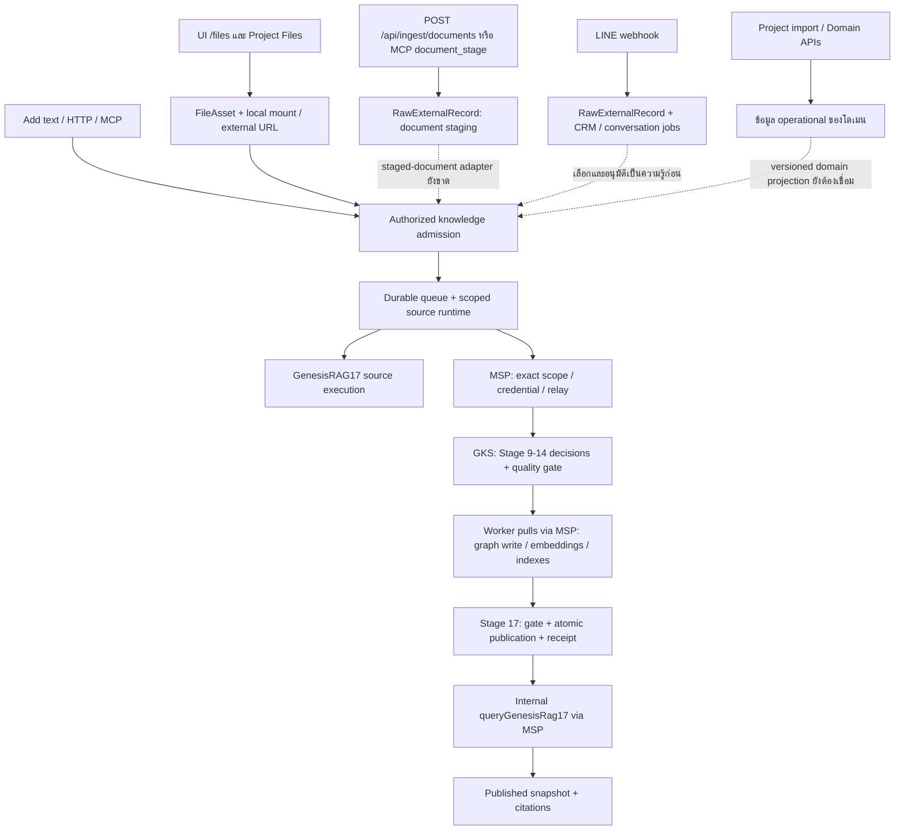

# Knowledge ingestion — surfaces, data flow และ user journey

## 1. ขอบเขตและสถานะของ phases 0–4

เอกสารนี้เป็น surface inventory ที่ reconcile จาก baseline audit เป็นสัญญาและโค้ดปัจจุบันของ phases 0–4 ภายใต้ [ADR-072](decisions/ADR-072-KNOWLEDGE-ADMISSION-AND-CORPUS-PUBLICATION.md), [Knowledge admission contract](plans/KNOWLEDGE-ADMISSION-CONTRACT.md) และ [FR-173 ใน PRD/SDD](PRD-SDD-v1.0.md#fr-172) ขอบเขตที่ส่งมอบแล้วคือ admission กลางสำหรับ Text/Markdown และ managed FileAsset ที่อ่านเป็น UTF-8 ได้, durable status, published-only query/citation, correction และ source withdrawal ใน Business หรือ Project corpus เดียวกัน

- **Surface implementation:** HTTP มี 5 paths / 6 operations; MCP ใช้ `POST /api/mcp` เดิมและเพิ่ม 6 knowledge tools; Files และ Project Files ใช้ `ManagedFilesPanel` เดิมและเรียก admission service เดียวกัน
- **Authorization boundary:** session viewer ใช้สิทธิ์ปัจจุบันจากระบบเดิม; HTTP รองรับ explicit configured bearer/API grant ที่ตรง `serviceAccountId + tenantId + businessId + action`; MCP entrypoint ยัง authenticate และ re-resolve ด้วย session viewer เดิม ไม่รับ API grant เป็นสิทธิ์ใหม่ให้ tools อื่น
- **Evidence meaning:** “รองรับ” ในตาราง U01–U16 หมายถึงมี service/route/transport/UI contract และ isolated unit/DB coverage ตามไฟล์ evidence ที่ระบุ ไม่ได้หมายความว่า native worker ได้รันจริงใน deployment ใด
- **Acceptance limit:** actual native 17-stage multi-document HTTP/browser acceptance, restart/resume ใน runtime จริง และ production activation ยังรออยู่ เอกสารนี้จึงไม่ประกาศ production readiness หรือ production completion
- **Out of scope:** PDF/DOCX/Excel/image/OCR, external URL fetch, folder/Drive/connectors, conversation promotion, org-wide/shared corpus, cross-business federation และ cross-store routing ยังเป็น deferred phases

ระดับงาน C-3; ความเสี่ยง architecture/security เป็น HIGH การปรับครั้งนี้เป็นเอกสาร inventory เท่านั้น ไม่เปลี่ยน schema/runtime

### คำที่ต้องแยก

| คำ | ความหมายใน flow นี้ |
|---|---|
| Surface | หน้าจอ ช่องทางสนทนา API หรือ connector ที่รับคำขอ |
| Endpoint | นับ URL path แยกจาก HTTP operation เช่น GET และ POST บน path เดียวคือ 1 path / 2 operations |
| Knowledge Base | ความรู้ที่ผ่านการจัดการสิทธิ์และเผยแพร่ให้ค้นได้ |
| GraphRAG | การใช้ความสัมพันธ์/graph ร่วมกับการค้นคืนและสร้างคำตอบ ไม่ใช่ปลายทางนำเข้าอีกชุดโดยอัตโนมัติ |
| GenesisRAG17 | implementation profile ของ ingestion 17 stages ข้าม zuri → MSP → GKS → GenesisBlock worker |
| Run | งานประมวลผลหนึ่งงาน; baseline หนึ่งเอกสารต่อ run |
| Shared pipeline | ใช้สัญญาและโค้ดขั้นตอนร่วมกัน ไม่รวมข้อมูลทุก tenant เป็นคลังเดียว |

**ข้อจำกัดที่สำคัญ:** baseline ต้องมี `portfolioId`, `tenantId`, `businessId`, `workspaceId`, `agentId`, `visibility`; visibility รับเฉพาะ `private` และ portfolio/tenant/business ต้องไม่ว่าง การค้นหลาย business, org-wide corpus และ fair scheduling ของ worker pool ไม่ได้เกิดขึ้นจากการมี schema นี้โดยอัตโนมัติ Source-worker options ผูก scope และ native worker ผูก store/scope ของ runtime ต้องออกแบบ dispatcher และ query orchestration เพิ่มก่อนกล่าวว่ามีบริการกลาง multi-business แบบครบวงจร

## 2. แผนที่เส้นทางปัจจุบัน

เส้นทึบคือ caller ที่มีอยู่ใน phases 0–4; เส้นประคือ source surface ที่ยัง deferred ไม่ใช่ network call ที่มีอยู่แล้ว



ข้อสรุปที่แก้จาก baseline: HTTP/MCP/UI มี caller เข้าสู่ durable admission แล้ว แต่ admission ไม่เรียก raw executor โดยตรงและไม่เปิด worker/operator gate ให้ end user; queue/runtime เป็นผู้ผูก native execution ภายใต้ scoped capability ของ root integration การสร้าง PipelineRun หรือบันทึก Stage report เองก็ยังไม่ทำให้เอกสารผ่าน 17 stages

## 3. Endpoint inventory — ของจริงที่เกี่ยวข้องโดยตรงใน Server

นับจาก `git ls-files apps/server/src/app/api/**/route.js` และ exported HTTP methods ในกลุ่มด้านล่าง: baseline เดิมมี **23 paths / 28 operations**; phases 0–4 เพิ่ม knowledge surface อีก **5 paths / 6 operations** จึงเป็น **28 paths / 34 operations** เมื่อรวมกลุ่มที่เกี่ยวข้องโดยตรง ตัวเลขนี้ไม่รวม API ทั้งระบบ, LINE/asset/project-import ที่เป็นต้นทางข้างเคียง, Edge HTTP หรือ MCP tool names และไม่ใช่จำนวนช่องทางที่พิสูจน์ว่าวิ่งครบ 17 stages

| กลุ่ม | Paths | Operations | บทบาท |
|---|---:|---:|---|
| Document staging | 1 | 2 | รับ extracted contract และอ่านสถานะ staging |
| Pipeline ledger / knowledge reports | 9 | 10 | สร้าง/อ่าน run, events, replay, stage/gate/finish/evidence |
| File manager + Project Files | 12 | 15 | เก็บ/อ่าน metadata, content, mount และดูแลไฟล์ |
| Server MCP transport | 1 | 1 | JSON-RPC ที่รวมหลาย tools |
| Knowledge admission / corpus | 5 | 6 | รับ source, status, query, citation และ withdrawal |
| รวมกลุ่มข้างต้น | 28 | 34 | ไม่รวมซ้ำระหว่างกลุ่ม; MCP tools ยังนับเป็น POST path เดียว |

### 3.1 Document staging — 1 path / 2 operations

| Method | Path | Input → output / สิ่งที่ไม่ควรสับสน |
|---|---|---|
| POST | `/api/ingest/documents` | `{connectionId, contract}` → receipt / raw record; contract เป็น `smartgift.document-intake.v1`, domain `product` หรือ `customer`, target `STAGING_ONLY`; ไม่ใช่อัปโหลด binary แล้วได้ published KB |
| GET | `/api/ingest/documents` | `connectionId` หรือ `businessId`, optional rawRecordId/domain/limit → redacted staging monitor |

POST ใช้ authenticated viewer และ installation-operator gate; scope มาจาก connection ที่ระบบ resolve รูปแบบ contract มีชนิด PDF/DOCX/Excel/image และ extraction method แต่เป็น **ผลการสกัดที่ส่งเข้ามาแล้ว** ไม่ใช่หลักฐานว่า endpoint นี้รัน OCR หรือ GenesisRAG binary parser ให้ การขึ้น `SUCCEEDED` ของ staging IngestionRun หมายถึง staging สำเร็จ ไม่ใช่ Stage 17 เผยแพร่แล้ว

### 3.2 Run / reporter — 9 paths / 10 operations

| Method | Path | บทบาท |
|---|---|---|
| GET, POST | `/api/pipelines/runs` | list / create execution ledger |
| GET | `/api/pipelines/runs/{executionRunId}` | อ่านรายละเอียด run |
| POST | `/api/pipelines/runs/{executionRunId}/events` | บันทึก execution event |
| POST | `/api/pipelines/runs/{executionRunId}/replay` | ขอ replay ตามสัญญา FR-071; ไม่ใช่ generic file upload |
| GET | `/api/pipelines/knowledge/{executionRunId}` | อ่าน job และ stage identities |
| POST | `/api/pipelines/knowledge/{executionRunId}/stages` | รับ aggregate stage report; ไม่ execute stage แทนเจ้าของ |
| POST | `/api/pipelines/knowledge/{executionRunId}/gate` | รับ gate evidence ตาม reporter contract |
| POST | `/api/pipelines/knowledge/{executionRunId}/finish` | ปิด run โดยตรวจ guard; GenesisRAG ต้องมี matching receipt |
| POST | `/api/pipelines/knowledge/evidence/pull` | operator-triggered legacy evidence importer ผ่าน MSP; handler เรียก `pullKnowledgeStageEvidence` ไม่ใช่ `pullGenesisRag17Evidence` |

Reporter routes ตรวจ identity ตามแต่ละ handler ผ่าน request viewer / SoT data-plane viewer ไม่ใช่ public API ที่ให้ผู้ใช้รายงานว่า stage สำเร็จเอง ส่วน GenesisRAG worker loop ใช้ exact-attempt importer อีกเส้นทาง อย่าใช้ reporter endpoint แทนการ execute acceptance

### 3.3 Files — 12 paths / 15 operations

| Method | Path | บทบาท |
|---|---|---|
| GET, POST | `/api/files` | list / create managed FileAsset |
| DELETE | `/api/files/{id}` | ลบ metadata ตาม service policy; ไม่ใช่ revoke published knowledge อัตโนมัติ |
| GET | `/api/files/{id}/content` | อ่านเนื้อหาไฟล์ที่ service รองรับและมีสิทธิ์ |
| POST | `/api/files/{id}/relink` | ผูก relative path / mount ใหม่ |
| POST | `/api/files/{id}/reveal` | เปิด File Explorer ผ่าน local capability |
| GET, POST | `/api/files/mounts` | อ่าน / ตั้งค่า device-local mount |
| POST | `/api/files/reconcile` | reconcile ไฟล์กับ metadata |
| POST | `/api/files/cache/rebuild` | สร้าง file cache ใหม่; ไม่ใช่ rebuild RAG indexes |
| POST | `/api/files/migrate` | ย้าย metadata รูปแบบเดิม |
| GET | `/api/business/files` | business file read model |
| GET, POST | `/api/projects/{id}/files` | compatibility API ของ Project Files |
| DELETE | `/api/projects/{id}/files/{fileId}` | ลบ project file ตาม compatibility service |

UI `/files` และ `/projects/{projectId}/files` ใช้ `ManagedFilesPanel` เดียวกัน; ปุ่ม Add file ส่ง `/api/files` ทั้งสองหน้า และปุ่ม knowledge ใน panel ส่ง `/api/knowledge/ingestions` สำหรับ Text/Markdown เท่านั้น ไม่ได้ทำ duplicate project-specific upload pipeline UI เลือกได้ Local file หรือ External URL; service ยังมี MANAGED_BLOB contract แต่อย่าอ้างว่า UI นี้มี blob upload picker การเก็บ External URL ยังเป็น FileAsset metadata และยังไม่ใช่ knowledge admission

### 3.4 MCP — 1 HTTP path, 15 tools

`POST /api/mcp` เป็น authenticated JSON-RPC transport ไม่ใช่ endpoint หนึ่งจุดต่อ tool ปัจจุบันมี **15 tools**: 4 `project_manager.*`, 5 `data_pipeline.*` และ 6 `knowledge.*` การนับนี้ยังเป็น 1 HTTP path / 1 HTTP operation; `tools/list` เปิดเผย schema และ `tools/call` dispatches ไป service ที่ได้รับอนุญาต

| Tool | บทบาท |
|---|---|
| `data_pipeline.run_create` | สร้าง run จาก businessCode |
| `data_pipeline.document_stage` | `{executionRunId, contract}` → resolve connection จาก run → document staging |
| `data_pipeline.event_record` | บันทึก event |
| `data_pipeline.monitor_read` | อ่าน monitor |
| `data_pipeline.replay_request` | ขอ replay |

| Tool | หน้าที่ |
|---|---|
| `knowledge.ingestion_create` | รับ strict `{businessId, projectId?, idempotencyKey, source}` และสร้าง durable `QUEUED` admission |
| `knowledge.ingestion_list` | อ่านรายการ job ใน Business/Project scope โดยไม่คืน raw content |
| `knowledge.ingestion_status` | อ่าน admission id และ `executionRunId` แยกกัน |
| `knowledge.query` | ค้น corpus generation ที่มีสิทธิ์และคืนผลพร้อม citation |
| `knowledge.citation` | resolve citation แบบผูก source/version/chunk และตรวจ ACL ปัจจุบัน |
| `knowledge.source_withdraw` | ถอน source ด้วย `expectedVersion` และ CAS publication |

MCP ใช้ session authentication เดิมของ `/api/mcp` ทั้งตอนเริ่ม request และ callback ที่ re-resolve viewer ระหว่าง query/citation; ไม่เปิด Enterprise API grant ให้ MCP tools อื่นโดยอัตโนมัติและไม่รับ scope/policy/actor/credential จาก tool arguments

`project_manager.plan_dry_run`, `plan_commit`, `work_read`, `work_status_update` เป็นงาน Project Manager การ import plan ไม่ได้ ingest เอกสารเข้าคลัง GenesisRAG

### 3.5 ต้นทางและเส้นทางข้างเคียง — ไม่นับใน 28 direct paths / 34 operations

| Surface / API / script | สิ่งที่ทำจริง | ความสัมพันธ์กับ GenesisRAG17 |
|---|---|---|
| `/projects/{projectId}/import`; POST `/api/import/dry-run`, `/api/import/commit`, `/api/import/bundle/dry-run`, `/api/import/bundle/commit`, `/api/import/xlsx`; GET `/api/import/template` | PlanEnvelope / workbook → validate, preview, commit operational plan | ยังไม่มี automatic knowledge admission |
| POST `/api/line-oa/accounts/{id}/webhook` | native LINE ingress ตาม account scope → raw/CRM/job | ไม่ใช่เอกสารเข้า 17 stages โดยอัตโนมัติ |
| POST `/api/agent/line-webhook` | normalized bound LINE ingress → raw evidence; text จึงเดิน agent turn | raw message ไม่เท่ากับ approved knowledge |
| POST `/api/agent/line-asset-handoff` | opaque FileAsset IDs → Asset intake ตาม trusted binding | เข้า asset domain ไม่ใช่ GenesisRAG |
| POST `/api/assets/import/xlsx`, `/api/assets/import/sheets` | Asset import/preview ตาม contract ของโดเมน | ต้องมี adapter เพิ่มถ้าจะเผยแพร่เป็นความรู้ |
| `/platform/sot-pipeline`, `/platform/sot-pipeline/inbox`, `/platform/sot-pipeline/graph` | SoT plan / review decisions / visualization | ไม่ใช่ KB upload และหน้า graph ไม่รับรองว่าเป็น native Genesis graph |
| Data Migration execution view | อ่าน `/api/ingest/documents` และ run monitor | เป็น read/monitor surface ไม่ใช่ generic knowledge upload |
| `build_business_knowledge_import.py` | สร้าง governed SQL import ไป `zuri_core.business_knowledge` | เป็น business-knowledge path อีกชุด ไม่ผ่าน native 17-stage profile |

### 3.6 MSP / GKS — tool calls ไม่ใช่ HTTP upload endpoints

| Runtime | Transport ที่ตรวจ | จำนวน tools ทั้ง server | เฉพาะ GenesisRAG17 |
|---|---|---:|---:|
| MSP | stdin/stdout NDJSON JSON-RPC; static tool dispatch | 31 | 9 |
| GKS | stdin/stdout NDJSON JSON-RPC; มี tools/list | 17 | 8 |

จำนวนนี้นับ tool definitions ที่ register ใน runtime ไม่ได้บวกเข้าจำนวน HTTP paths ของ Server MSP/GKS ไม่ได้มี public file-upload HTTP route ใน runtime ที่ตรวจ

| Operation | MSP tool | GKS tool / ปลายทาง |
|---|---|---|
| ส่ง batch | `msp_pipeline_submit` | `gks_pipeline_submit` |
| worker ขอ decision | `msp_pipeline_claim` | `gks_pipeline_claim` |
| หลักฐาน graph write | `msp_pipeline_graph_receipt` | `gks_pipeline_graph_receipt` |
| หลักฐาน embedding/index write | `msp_pipeline_write_receipt` | `gks_pipeline_write_receipt` |
| รายงาน stage failure | `msp_pipeline_stage_failure` | `gks_pipeline_stage_failure` |
| ขอ gate verdict | `msp_pipeline_gate` | `gks_pipeline_gate` |
| หลักฐาน publication | `msp_pipeline_publication_receipt` | `gks_pipeline_publication_receipt` |
| source ดึง evidence | `msp_pipeline_evidence` | `gks_pipeline_evidence` |
| ค้น published snapshot | `msp_pipeline_query` | worker loopback POST `/query`; ไม่มี GKS pipeline-query counterpart |

MSP grant ผูก credential → source/worker role → exact six-field scope แล้วตรวจ nested scope ก่อน relay; ไม่เชื่อ actor ที่ caller ส่งมา GKS ตรวจ relay credential และ authenticated principal อีกชั้น

`msp_pipeline_submit` รับ batch ที่มี inline content/chunks/mentions/hashes/offsets พร้อมแล้ว จึงเป็น boundary **Stage 8 → 9** ไม่ใช่ public upload ที่เริ่ม Stage 1 การให้ user ส่ง batch นี้โดยตรงจะไม่พิสูจน์ raw-to-17 source path

มีอีกสามทางที่ห้ามเรียกรวมเป็น ingestion เดียว:

1. `msp_memory_upsert` / `msp_memory_search` เก็บและค้น memory ภายใน vault; ไม่เรียก GKS อัตโนมัติ
2. `msp_knowledge_promote` อาจ relay ไป legacy `gks_knowledge_promote`; `gks_search`, `gks_entity_get`, `gks_relations_get`, `gks_artifact_link` และ review tools เป็น canonical entity/relation path อีกชุด ไม่ใช่หลักฐานว่าผ่าน GenesisRAG17
3. `msp_pipeline_query` ค้น published native snapshot ผ่าน worker ตาม configuration; ไม่ใช่ memory search หรือ legacy GKS entity lookup

`msp_workspace_register(workspace_path, project_id)` ลงทะเบียน vault metadata ไม่อ่านหรือเดินไฟล์ ส่วน `msp_context_resolve(workspace_root)` ไม่ใช่ folder crawler Current GenesisRAG17 wire scope **ไม่มี projectId/domainId**; admission จึงเก็บ Project association และตรวจ Project ACL ที่ Tier 1 แต่ไม่ได้อ้างว่า native store แยกตาม Project หรือมี cross-store routing ใน phases 0–4

Evidence ใน sibling repos: MSP `apps/msp-server/src/server.mjs`, `transport/handlers/pipeline-handlers.mjs`, `vault-handlers.mjs`, `context-handlers.mjs`; GKS `apps/gks-server/src/server.mjs`, `packages/gks-contracts/src/tool-definitions.mjs`, `pipeline.mjs`, `packages/gks-core/src/index.mjs`, `packages/gks-persistence/src/index.mjs` ไม่ใช่การตรวจ production configuration

### 3.7 GenesisBlock worker — 1 query HTTP operation

แพ็กเกจ `genesisrag17-worker` มี CLI `src/cli.mjs` สำหรับเปิด process, อ่าน explicit runtime configuration, เปิด listener และ resume polling; ingest งานผ่านการ claim จาก MSP ไม่รับ user file upload

HTTP ของ worker profile นี้มี **POST `/query` หนึ่ง operation** บน loopback พร้อม bearer token; implementation อยู่ `src/worker.mjs` วิธี HTTP/path อื่นไม่ใช่ API ที่รองรับ การมี server/native APIs อื่นใน GenesisBlock engine ไม่ควรนับรวมว่าเป็น ingestion route ของ profile นี้

หนึ่ง CLI instance รับ `GENESIS_WORKER_SCOPE` กับ `GENESIS_WORKER_DB_PATH` ที่กำหนดไว้ จึงเป็น scope-owned store/process ปัจจุบัน ไม่ใช่ process เดียวเปิด store ของทุกธุรกิจให้ค้นรวมได้เอง MSP ยังมี worker URL/token ที่ต้อง configure การขยายหลาย worker ต้องมี routing/configuration ที่เข้ากับ scope ไม่ใช่ตั้งตัวแปร worker URL เดียวแล้วถือว่าครบ multi-business deployment

### 3.8 Edge — catalog/LINE/extraction runtime อีกชุด

Edge ใน monorepo มีการอ่านไฟล์และทำ native catalog ingestion จริง แต่ไม่ได้เรียก GenesisRAG17 admission, MSP pipeline receipts หรือ worker `/query` ของ profile นี้ อย่าสับสนเพียงเพราะมีชื่อ Genesis/Graph/RAG เหมือนกัน

| Surface | จำนวน/จุดที่ตรวจ | Flow ปัจจุบัน |
|---|---|---|
| v4 catalog HTTP | 4 operations: GET `/health`, GET `/api/graph`, POST `/api/rag/search`, POST `/api/rag/price` | อ่าน catalog v4; ไม่มี upload operation ใน server นี้ |
| Catalog batch CLI | `catalog:ingest-v4` → `scripts/ingest-catalog-v4.ts` | อ่าน identity/catalog/FlowAccount workbook/category map/aliases → graph/vectors → flush/state/manifest/CURRENT; ไม่ใช่ GenesisRAG17 |
| Genesis MCP | 2 tools: `search_catalog`, `taxonomy_preview` | stdio หรือ SSE; query catalog/native path |
| Genesis MCP HTTP transport | GET `/sse`, POST `/messages`, GET `/health` และ OPTIONS handling | transport endpoints ไม่ใช่ 3 ingestion APIs |
| Pricing MCP | 5 read-only tools: `quote_price`, `find_within_budget`, `search_products`, `lead_time`, `explain_policy` | stdio pricing/catalog interface |
| Conversation compute | `conversation serve` / `once` | poll leased server jobs → local allowed execution → ส่งผลตาม contract |
| Asset extraction | `extraction serve` / `once` | poll งาน extraction ของ asset-evidence lane; ไม่ใช่ canonical KB publication |
| Legacy LINE webhook | `webhook serve` ภายใต้ LEGACY_EDGE | signed webhook → archive → local v4 RAG/direct/stack reply |

Legacy webhook server มี allowlist **15 path strings** ไม่ใช่ 15 knowledge-ingestion endpoints: `/webhook/line`, `/api/agent/line-webhook`, `/webhook`, `/`, `/graph`, `/graph-viewer`, `/gui`, `/config`, `/api/config`, `/api/ollama/models`, `/api/monitor/channels`, `/api/command/dispatch`, `/api/monitor/logs`, `/api/graph`, `/api/admin/session` รายการนี้รวม aliases, UI และ admin paths; ไม่ควรนำไปบวกเป็นจำนวน user ingestion channels Default package start ใช้ conversation worker ส่วน legacy webhook และ catalog ingest/server มี script แยก

Tracked Edge source inventory ไม่พบ filesystem watcher ที่เชื่อม folder เข้า GenesisRAG17 สิ่งที่มีเป็น explicit catalog batch หรือ polling cloud jobs; การ register mount/workspace ไม่ได้เริ่ม watch folder

Evidence: `apps/edge/src/rag/v4/serve.ts:139`, `apps/edge/src/rag/v4/ingest.ts:99`, `apps/edge/scripts/ingest-catalog-v4.ts`, `apps/edge/src/rag/genesis-rag.ts:77`, `apps/edge/src/mcp/genesis-mcp-server.ts:30`, `apps/edge/src/mcp/pricing-server.ts:67`, `apps/edge/src/history/webhook-server.ts:284`, `apps/edge/src/cli/conversation.ts:13`, `apps/edge/src/cli/index.ts:1081` การตรวจเป็น read-only ไม่ได้เริ่ม Edge หรือใช้ local customer data

## 4. Detailed user flows — current support matrix

สถานะในตารางนี้เป็นสถานะของ surface/service contract:

- **SUPPORTED — evidence by scope:** Business owner native acceptance ผ่านแล้ว; Project/API-grant ใช้หลักฐาน unit/Prisma ตามขอบเขตใน section 8
- **SUPPORTED — bounded surface:** ใช้ได้ในขอบเขตที่ระบุ แต่ปลายทางอื่นของ journey ยังไม่อยู่ใน phases 0–4
- **DEFERRED:** ยังไม่มี implementation ตาม contract นี้

| Journey | สถานะ phases 0–4 | สิ่งที่มีจริง / ขอบเขต |
|---|---|---|
| **U01 — เลือกไฟล์จากเครื่องในหน้า Files** | **SUPPORTED — evidence by scope** | `/files` ใช้ active device mount → Add file → `LOCAL_FILE` FileAsset → Add knowledge สำหรับ Text/Markdown; admission freeze bytes/hash/version แล้ว queue งานฯ — FR-187 (ADR-075 Phase 1, local tests only) เพิ่ม `application/json` เฉพาะเมื่อระบุ `format: SMARTGIFT_CATALOG_V1` แล้วแตกเป็น source ต่อหนึ่ง record; `.json` ที่ไม่ระบุ format ยังคง 415 |
| **U02 — External URL หรือไฟล์ที่มีอยู่แล้ว** | **SUPPORTED — bounded surface** | File manager ยังบันทึก/เปิด External URL ได้; knowledge admission รับเฉพาะ existing readable Text/Markdown FileAsset และ — ตาม FR-187 — JSON FileAsset ที่ระบุ `format: SMARTGIFT_CATALOG_V1`; external fetch/crawl ยัง deferred |
| **U03 — Project Files และ attachments** | **SUPPORTED — evidence by scope** | `/projects/{projectId}/files` ส่ง `projectId` เข้า corpus identity และตรวจ Business/Project/FileAsset ACL; ไม่มี work-item picker หรือ binary adapter |
| **U04 — วางข้อความ / เขียน Text/Markdown โดยตรง** | **SUPPORTED — evidence by scope** | Add text modal และ `POST /api/knowledge/ingestions` รับ strict TEXT descriptor แล้วคืน `QUEUED` admission |
| **U05 — ระบบภายนอกส่ง API** | **SUPPORTED — evidence by scope** | HTTP knowledge routes ใช้ session หรือ explicit configured bearer/API grant ที่ตรง service account, tenant, Business และ action; caller ไม่ส่ง scope/policy/actor/credential ใน body |
| **U06 — Agent / Codex ผ่าน MCP** | **SUPPORTED — evidence by scope** | `POST /api/mcp` มี 6 `knowledge.*` tools เรียก service เดียวกัน; initial และ refresh ใช้ authenticated session viewer ของ MCP เดิม |
| **U07 — PDF / Word / Excel / รูปภาพจาก extractor** | **DEFERRED** | ไม่มี binary/OCR/vision parser ใน admission; document staging รับ extracted contract แยกต่างหากและจบที่ staging |
| **U08 — Folder / Drive / URL connector / incremental sync** | **DEFERRED** | ยังไม่มี connector authorization, cursor, remote version หรือ deletion adapter เข้า canonical admission |
| **U09 — ข้อมูลจากโดเมนอื่นใน zuri** | **DEFERRED** | Domain CRUD และ project graph ยังไม่สร้าง immutable source projection/admission ให้ phases นี้ |
| **U10 — LINE หรือ conversation กลายเป็นความรู้** | **DEFERRED** | LINE/raw conversation ยังไม่ผ่าน review/consent/source freeze และไม่ auto-publish เป็น canonical knowledge |
| **U11 — ผู้ใช้ถามผ่านเว็บ / LINE / API** | **SUPPORTED — evidence by scope** | UI, HTTP `POST /api/knowledge/queries`, MCP `knowledge.query` และ citation resolve ค้น published corpus generation เดียวตาม ACL; ยังไม่มี LINE answer-composer wiring |
| **U12 — องค์กรเดียวหลาย Business / คนละองค์กร** | **DEFERRED** | Corpus identity เป็น Business + optional Project และ runtime ใช้ configured scope/store เดียว; ไม่มี multi-business federation หรือ cross-tenant aggregation |
| **U13 — ฝ่ายกลางแชร์นโยบายให้องค์กร** | **DEFERRED** | ยังไม่มี org-shared corpus ownership/grant/revocation หรือ shared query aggregation |
| **U14 — แก้ไขเอกสาร / retry / replay** | **SUPPORTED — evidence by scope** | idempotency, immutable source versions, correction revision, stale-completion guards และ CAS manifest logic มีใน service; Business runtime restart และ native replay มีหลักฐาน acceptance; ดู section 8 |
| **U15 — hold / worker ล้ม / publish ไม่สำเร็จ** | **SUPPORTED — evidence by scope** | UI แสดง `QUEUED/RUNNING/PUBLISHED/FAILED/SUPERSEDED/WITHDRAWN`; admission ไม่รายงาน stage สำเร็จเอง; native crash/restart/receipt-loss proof ผ่านชุด recovery 25/25 |
| **U16 — ถอนเอกสาร / เปลี่ยนสิทธิ์ / ตรวจหลักฐานย้อนหลัง** | **SUPPORTED — evidence by scope** | `DELETE /api/knowledge/sources/{sourceId}` ใช้ `expectedVersion`; query/citation ตรวจ current ACL, source state และ FileAsset/Project access; Business withdrawal/history ผ่าน native; delayed revoke ใช้ Prisma/service tests |

สถานะ **SUPPORTED** ข้างต้นไม่ใช่ production claim: ยังต้องผ่าน native acceptance ของ UI/API/MCP ที่วิ่งจริงถึง publication receipt และ query/citation ก่อนปิด phases 0–4

### 4.1 Files และ Project Files — selectors และ actions ที่มีจริง

ทั้ง `apps/server/src/app/(pm)/files/page.jsx` และ `apps/server/src/app/(pm)/projects/[projectId]/files/page.jsx` render `ManagedFilesPanel`. Business page ส่ง `businessId` จาก shell scope; Project page อ่าน Business จาก Project แล้วส่ง `businessId + projectId`. Panel จึงโหลด FileAsset และ admission list ด้วย scope เดียวกัน:

- FileAsset list: `/api/business/files?businessId=...` สำหรับ Business และ `/api/files?projectId=...` สำหรับ Project
- Admission list: `GET /api/knowledge/ingestions?businessId=...&projectId=...`
- `Add file` ยังเป็น FileAsset flow เดิม: เลือก `External URL` หรือ `Managed local file`, mount, relative path และ browser file; ไม่ได้ admit เข้าคลังอัตโนมัติ
- `data-testid="knowledge-admit-text"` — เปิด modal **Add text** ซึ่งมี Source key, Version, Title และ Text or Markdown; ปุ่ม **Queue admission** ส่ง `kind: "TEXT"` และ idempotency key ที่สร้างจาก source/version
- `data-testid="knowledge-admit-file-{assetId}"` — ปุ่ม **Admit knowledge** หรือ **Re-admit version** แสดงเฉพาะ ACTIVE `LOCAL_FILE`/`MANAGED_BLOB` ที่เป็น `text/plain`, Markdown MIME หรือ generic text/octet-stream ที่มี suffix `.txt/.md/.markdown/.mdown/.mkdn/.mkd`; ส่ง `kind: "FILE"` และ `fileAssetId`
- `data-testid="knowledge-admissions"` — กล่องรายการงาน; แต่ละแถวใช้ `data-testid="knowledge-status-{admissionId}"` และแสดง status, revision และข้อความที่ปลอดภัยต่อผู้ใช้; QUEUED/RUNNING poll ทุก 3 วินาที
- เมื่อ Business หรือ Project scope เปลี่ยน panel จะล้าง admission data เดิมทันทีและ ignore late response จาก request ของ scope เก่า เพื่อไม่ให้ status/source ของ corpus เดิมแสดงใน context ใหม่
- `data-testid="knowledge-withdraw-{sourceId}"` — ปุ่ม **Withdraw** ส่ง `expectedVersion` ไป DELETE source; ปุ่มลบ FileAsset เป็นคนละ action และไม่ทำให้ historical knowledge ถูกลบอัตโนมัติ
- `data-testid="knowledge-query-form"`, `data-testid="knowledge-query"`, `data-testid="knowledge-query-submit"` — ค้นด้วย `{businessId, projectId, query, topK: 10}`; แสดงผลจาก published corpus และลิงก์ **Open citation** ไปยัง citation route

Panel ไม่แสดง native worker, RRF, claim token, raw executor หรือ runtime credential ให้ end user และไม่มี control สำหรับ PDF/OCR/External URL admission

## 5. Current phase 0–4 data flow

```mermaid
sequenceDiagram
    actor U as User or authorized API client
    participant S as UI / HTTP / MCP
    participant A as Knowledge admission
    participant R as Durable queue and scoped runtime
    participant M as MSP
    participant G as GKS
    participant W as GenesisBlock worker
    participant P as Corpus manifest
    U->>S: Submit Text/Markdown or select readable FileAsset
    S->>A: Strict source descriptor + Business/Project + idempotencyKey
    A->>A: Resolve current viewer, source ACL, runtime scope and policy
    A->>R: Persist immutable source version and QUEUED job
    R-->>S: Admission id; executionRunId remains nullable until bound
    R->>M: One exact source attempt under scoped capability
    M->>G: Authenticated Stage 9–14 decisions and quality evidence
    W->>M: Claim, graph/index writes and readback receipts
    W->>M: Stage 17 gate request and publication receipt
    R->>P: Merge verified source snapshot atomically
    S-->>U: Status and publication state
    S->>P: Query one authorized corpus generation
    P->>M: Query each active source snapshot
    M-->>P: Snapshot-local results and citations
    P-->>S: RRF-k60 results with version-bound citation ids
```

Admission records intent and returns before native work completes. The root-owned runtime capability is module-private and scope-limited; request JSON cannot mint it and admission never calls the raw executor as a user-facing shortcut. A query pins one corpus manifest and uses the same configured native scope/store for its active source snapshots. A matching publication receipt is required before a source becomes searchable.

## 6. สิ่งที่เก็บและสิ่งที่ผู้ใช้ควรเห็น

| จุด | Durable authority | User-facing result |
|---|---|---|
| Corpus | `KnowledgeCorpus`: Business + optional live Project identity, resolved six-field runtime scope and policy | Corpus context; no caller-supplied scope/policy |
| Source | `KnowledgeSource`: immutable source key lineage, current revision, FileAsset link and revocation/version | Source title, revision and withdrawal state |
| Admission | `KnowledgeIngestion`: frozen UTF-8 content/hash or frozen FileAsset bytes, idempotency identity, actor, status and nullable native `executionRunId` | Accepted `QUEUED`; opaque admission id and safe status |
| Status | `QUEUED`, `RUNNING`, `PUBLISHED`, `FAILED`, `SUPERSEDED`, `WITHDRAWN` plus safe native stage summary when bound | Waiting, Processing, Published, failed, superseded or withdrawn |
| Native publication | Existing 17-stage artifacts, per-document receipt and exact snapshot identity | Searchable only after verified publication receipt; no manual stage-success control |
| Corpus generation | `KnowledgeCorpusGeneration`: immutable manifest of active source snapshots, generation and hash | Query generation and manifest-backed result set |
| Retrieval | Published snapshot result, source/chunk lineage, rank-fusion score and citation id | Text hit + **Open citation**; query never falls back to candidate data |
| Citation | Version/source/ingestion/chunk identity, offsets and content hash | Evidence only while current Business/Project/FileAsset ACL permits it |
| Audit | Admission, publication, correction and withdrawal audit events | Reviewable history without exposing runtime credentials or claim tokens |

List/status responses do not return raw source content, claim tokens, leases or native credentials. FileAsset deletion is separate from knowledge withdrawal; serving checks current file/project access before returning file-backed text.

## 7. Implemented HTTP and MCP contract

The public knowledge HTTP surface is **5 paths / 6 operations**:

| Method | Path | Input / result |
|---|---|---|
| POST | `/api/knowledge/ingestions` | Strict `{businessId, projectId?, idempotencyKey, source}`; source is TEXT `{kind, sourceKey, version, title?, content}` or FILE `{kind, fileAssetId, sourceKey?, version?, title?}`; returns an opaque admission id with `QUEUED` status |
| GET | `/api/knowledge/ingestions` | Query `businessId`, optional `projectId`, optional `limit`; returns scoped safe job summaries without raw content |
| GET | `/api/knowledge/ingestions/{runId}` | Reads the admission job id; returns `executionRunId` separately when the runtime has bound one |
| POST | `/api/knowledge/queries` | Strict `{businessId, projectId?, query, topK?}`; returns one pinned corpus generation, manifest hash and verified results/citations |
| GET | `/api/knowledge/citations/{citationId}` | Resolves version-bound source/chunk evidence after current ACL, source and FileAsset/Project checks |
| DELETE | `/api/knowledge/sources/{sourceId}` | Strict `{expectedVersion}`; CAS withdraws source membership and creates a new manifest while preserving history |

HTTP session viewers use the existing request resolver. A machine HTTP caller is accepted only when an explicit configured knowledge grant matches its service account, tenant, Business and action; a tenant match alone is insufficient. Request bodies cannot set scope, policy, actor, credential, publication or embedding authority. Query and citation handlers re-resolve the original HTTP request before disclosing results after slow reads.

The same six operations are exposed by `POST /api/mcp` as `knowledge.ingestion_create`, `knowledge.ingestion_list`, `knowledge.ingestion_status`, `knowledge.query`, `knowledge.citation` and `knowledge.source_withdraw`. MCP uses the transport's authenticated session viewer for both initial authentication and the live recheck callback; it does not broaden the existing MCP transport to Enterprise API grants. Tool arguments remain strict and cannot carry a serialized runtime capability.

## 8. Acceptance evidence and remaining phases

| Area | Current evidence | Limit |
|---|---|---|
| Admission service | `apps/server/tests/unit/knowledge-admission-service.test.js`, `knowledge-admission-job-state.test.js` | Isolated service proof; native worker still separate |
| HTTP | `apps/server/tests/unit/knowledge-admission-routes.test.js`, `knowledge-corpus-routes.test.js`, `knowledge-http.test.js` | Business session HTTP/native passed; bearer grants unit-tested; production not tested |
| Real DB + shared service | `apps/server/tests/integration/knowledge-admission.integration.test.js`, `knowledge-query.test.js` | Fixture/isolated database evidence, not production evidence |
| MCP | `apps/server/tests/unit/knowledge-admission-mcp.test.js`, `pipeline-mcp-transport.test.js` | Business session MCP admission/query/citation passed through the actual native worker |
| Files UI | `apps/server/tests/unit/knowledge-admission-ui-contract.test.js`, existing FR-045/FR-058 UI tests | Business browser Text/managed-file admission passed; Project browser/native and browser query controls not exercised |
| Native 17-stage chain | `apps/server/tests/acceptance/genesisrag17-e2e.test.js` remains the internal raw-chain harness | It does not by itself prove the UI/API/MCP entrypoints or multi-document corpus flow |

Isolated acceptance: Business owner Files browser admission and session HTTP/MCP reached the real native pipeline; four document runs each have 17 successful evidence rows, four native snapshots and five corpus generations. Project-scoped and bearer/API-grant paths have unit/Prisma authorization evidence, not native browser proof. Browser query controls and production activation are not claimed. [Native surface evidence](../.brain/reports/knowledge-admission-native.json) and [phase report](../.brain/reports/2026-09-08-knowledge-admission-phase0-4.md) distinguish native tests from service seams. Stale completion and delayed ACL/revocation checks are covered by unit/real-Prisma tests. The product remains beta; no production activation is claimed.

Deferred after this contract: PDF/DOCX/Excel/image/OCR; external URL fetch/crawl; folder/Drive/connector sync; domain-record adapters; LINE/conversation promotion; org-wide/shared corpus; multi-business or cross-tenant federation; cross-store routing; corpus-wide graph traversal and aggregate native gate.

## 9. Evidence map and enumeration record

อ่าน paths ต่อไปนี้จาก repo นี้เพื่อไล่ข้อกล่าวอ้างย้อนกลับ:

- Authority: `docs/decisions/ADR-072-KNOWLEDGE-ADMISSION-AND-CORPUS-PUBLICATION.md`, `docs/plans/KNOWLEDGE-ADMISSION-CONTRACT.md`, `docs/PRD-SDD-v1.0.md`
- HTTP: `apps/server/src/app/api/knowledge/ingestions/route.js`, `apps/server/src/app/api/knowledge/ingestions/[runId]/route.js`, `apps/server/src/app/api/knowledge/queries/route.js`, `apps/server/src/app/api/knowledge/citations/[citationId]/route.js`, `apps/server/src/app/api/knowledge/sources/[sourceId]/route.js`
- Services/auth: `apps/server/src/modules/knowledge/knowledge-admission-service.js`, `knowledge-corpus-service.js`, `knowledge-http.js`, `knowledge-authorization.js`, `knowledge-runtime.js`
- MCP: `apps/server/src/app/api/mcp/route.js`, `apps/server/src/modules/project-manager/mcp/transport.js`
- UI: `apps/server/src/app/(pm)/files/page.jsx`, `apps/server/src/app/(pm)/projects/[projectId]/files/page.jsx`, `apps/server/src/modules/project-manager/components/ManagedFilesPanel.jsx`
- Adjacent baseline: `apps/server/src/app/api/ingest/documents/route.js`, `apps/server/src/app/api/pipelines/`, `apps/server/src/app/api/files/`, `apps/server/src/modules/project-manager/application/file-asset-service.js`
- Tests: `apps/server/tests/unit/knowledge-admission-*.test.js`, `apps/server/tests/unit/knowledge-corpus-routes.test.js`, `apps/server/tests/unit/knowledge-http.test.js`, `apps/server/tests/integration/knowledge-admission.integration.test.js`, `apps/server/tests/integration/knowledge-query.test.js`

ตัวเลข 28 paths / 34 operations คือผลรวมของ route groups ที่ระบุใน section 3; MCP tools 15 คือ 4 Project Manager + 5 data pipeline + 6 knowledge tools และไม่ถูกบวกซ้ำเป็น HTTP paths. การตรวจรอบนี้ใช้ tracked-file enumeration, exported method/tool inventory, source inspection และ authority-doc review; ไม่ได้เปิด production API; isolated Business UI/session HTTP/MCP native acceptance ผ่านแล้วตามรายงานใน section 8

## CHANGELOG

| Version | Date | Status | Summary | Commit Hash | Agent |
|---|---|---|---|---|---|
| 1.2.0b | 2026-09-11 | beta | FR-187 (ADR-075 Phase 1, implemented locally, not deployed): U01/U02 now also accept a JSON `FileAsset` that names `format: SMARTGIFT_CATALOG_V1`, admitted through the same POST and split into one immutable source per record; a bare `.json` stays 415 | working-tree | Claude Fable 5.1 |
| 1.0.0b | 2026-09-08 | draft | Enumerated Server endpoints; actual source paths versus 16 proposed/partial user journeys; admission and cross-domain extension gaps | base dfdbaf11 | RWANG |
| 1.1.1b | 2026-09-08 | beta | Record actual Business surface/native acceptance, corpus proof and remaining Project/API-grant/browser-query evidence limits | 03256b74 + integration | RWANG |
| 1.1.0b | 2026-09-08 | beta | Reconciled phases 0–4 HTTP/MCP/UI surfaces, 28-path/34-operation inventory, U01–U16 status matrix and native-acceptance boundary; linked ADR-072, FR-173 and the frozen contract | 0816ed4d | RWANG |
