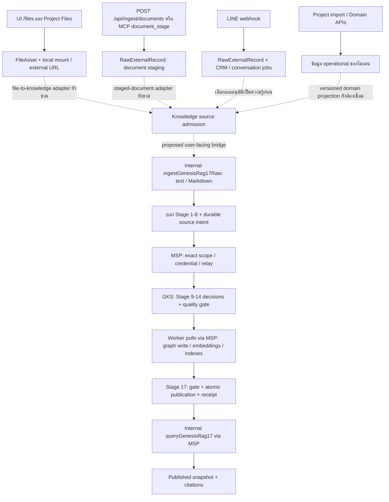
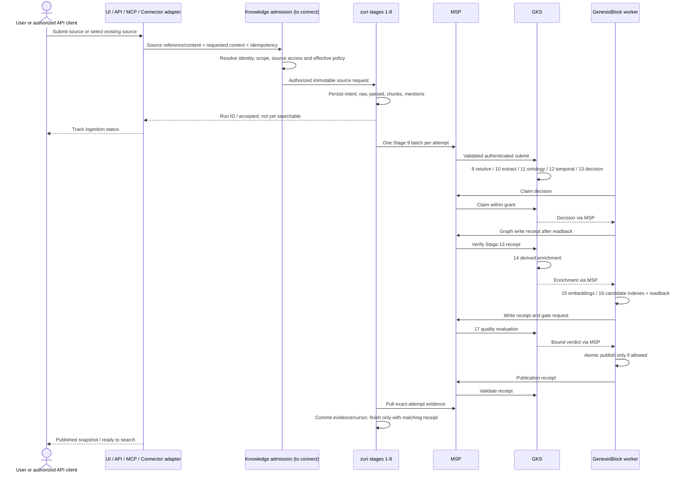

# Knowledge ingestion — surfaces, data flow และ user journey

## 1. ขอบเขตและวิธีอ่าน

เอกสารนี้ตอบว่า user เริ่มจากที่ไหน ข้อมูลผ่านอะไร เก็บที่ไหน และพร้อมค้นเมื่อใด ไม่ใช่รายงานว่า UI และ connector ทุกตัวส่งมอบแล้ว

- **ตรวจพบในโค้ด:** ตรวจ tracked route/page/module และ caller ใน zuri revision `dfdbaf11`; MSP `8e16a54a`, GKS `faa946f3`, GenesisBlock `4048bd5b` บน branch `codex/ki17-integration` วันที่ 2026-09-08 การพบ handler ไม่รับรองว่ามี production configuration หรือเปิดใช้งานอยู่
- **ครบใน isolated acceptance:** raw text/Markdown ผ่าน 17 stages, publication receipt, query/citation และ recovery; เป็น internal entrypoint ภายใต้ installation operator กับ scope `private`
- **ต้องเชื่อมเพิ่ม:** มีต้นทางหรือปลายทางแล้ว แต่ไม่มี caller เชื่อมเข้าทาง GenesisRAG17 ที่ตรวจครบ
- **เสนอ:** user journey / endpoint / policy สำหรับออกแบบต่อ ยังไม่ใช่ API ที่เรียกได้ การตั้งชื่อในส่วนเสนอไม่ได้ประกาศ requirement ID ใหม่

ระดับงาน C-3; ประเด็น architecture/security มี risk HIGH ส่วนการเปลี่ยนครั้งนี้เป็นเอกสารเท่านั้น ไม่เปลี่ยน runtime/schema หรือ deploy ระบบ

### คำที่ต้องแยก

| คำ | ความหมายใน flow นี้ |
|---|---|
| Surface | หน้าจอ ช่องทางสนทนา API หรือ connector ที่รับคำขอ |
| Endpoint | นับ URL path แยกจาก HTTP operation เช่น GET และ POST บน path เดียวคือ 1 path / 2 operations |
| Knowledge Base | ความรู้ที่ผ่านการจัดการสิทธิ์และเผยแพร่ให้ค้นได้ |
| GraphRAG | การใช้ความสัมพันธ์/graph ร่วมกับการค้นคืนและสร้างคำตอบ ไม่ใช่ปลายทางนำเข้าอีกชุดโดยอัตโนมัติ |
| GenesisRAG17 | implementation profile ของ ingestion 17 stages ข้าม zuri → MSP → GKS → GenesisBlock worker |
| Run | งานประมวลผลหนึ่งงาน; baseline หนึ่งเอกสารต่อ run |
| Shared pipeline | ใช้สัญญาและโค้ดขั้นตอนร่วมกัน ไม่รวมข้อมูลทุก tenant เป็นคลังเดียว |

**ข้อจำกัดที่สำคัญ:** baseline ต้องมี `portfolioId`, `tenantId`, `businessId`, `workspaceId`, `agentId`, `visibility`; visibility รับเฉพาะ `private` และ portfolio/tenant/business ต้องไม่ว่าง การค้นหลาย business, org-wide corpus และ fair scheduling ของ worker pool ไม่ได้เกิดขึ้นจากการมี schema นี้โดยอัตโนมัติ Source-worker options ผูก scope และ native worker ผูก store/scope ของ runtime ต้องออกแบบ dispatcher และ query orchestration เพิ่มก่อนกล่าวว่ามีบริการกลาง multi-business แบบครบวงจร

## 2. แผนที่เส้นทางปัจจุบัน

เส้นประหมายถึง **ยังต้องเชื่อมเพิ่ม** ไม่ใช่ network call ที่มีอยู่แล้ว



ข้อสรุปจาก caller inventory: ไม่มี Next HTTP route หรือ UI ใน Server ที่เรียก `ingestGenesisRag17Raw` / `queryGenesisRag17` เป็น user-facing ingestion/search โดยตรง และ source worker ถูกเริ่มใน acceptance harness ไม่ได้ถูกติดตั้งเป็น universal UI ingestion runtime การสร้าง PipelineRun หรือบันทึก Stage report ไม่ได้ทำให้เอกสารผ่าน 17 stages เอง

## 3. Endpoint inventory — ของจริงที่เกี่ยวข้องโดยตรงใน Server

นับจาก `git ls-files apps/server/src/app/api/**/route.js` และ exported HTTP methods ในกลุ่มด้านล่าง: **23 paths / 28 operations** ตัวเลขนี้ไม่รวม API ทั้งระบบ, LINE/asset/project-import ที่เป็นต้นทางข้างเคียง, Edge HTTP หรือ MCP tool names และไม่ใช่จำนวนช่องทางที่วิ่งครบ 17 stages

| กลุ่ม | Paths | Operations | บทบาท |
|---|---:|---:|---|
| Document staging | 1 | 2 | รับ extracted contract และอ่านสถานะ staging |
| Pipeline ledger / knowledge reports | 9 | 10 | สร้าง/อ่าน run, events, replay, stage/gate/finish/evidence |
| File manager + Project Files | 12 | 15 | เก็บ/อ่าน metadata, content, mount และดูแลไฟล์ |
| Server MCP transport | 1 | 1 | JSON-RPC ที่รวมหลาย tools |
| รวมกลุ่มข้างต้น | 23 | 28 | ไม่รวมซ้ำระหว่างกลุ่ม |

### 3.1 Document staging — 1 path / 2 operations

| Method | Path | Input → output / สิ่งที่ไม่ควรสับสน |
|---|---|---|
| POST | `/api/ingest/documents` | `{connectionId, contract}` → receipt / raw record; contract เป็น `smartgift.document-intake.v1`, domain `product` หรือ `customer`, target `STAGING_ONLY`; ไม่ใช่อัปโหลด binary แล้วได้ published KB |
| GET | `/api/ingest/documents` | `connectionId` หรือ `businessId`, optional rawRecordId/domain/limit → redacted staging monitor |

POST ใช้ authenticated viewer และ installation-operator gate; scope มาจาก connection ที่ระบบ resolve รูปแบบ contract มีชนิด PDF/DOCX/Excel/image และ extraction method แต่เป็น **ผลการสกัดที่ส่งเข้ามาแล้ว** ไม่ใช่หลักฐานว่า endpoint นี้รัน OCR หรือ GenesisRAG binary parser ให้ การขึ้น `SUCCEEDED` ของ staging IngestionRun หมายถึง staging สำเร็จ ไม่ใช่ Stage 17 เผยแพร่แล้ว

### 3.2 Run / reporter — 9 paths / 10 operations

| Method | Path | บทบาท |
|---|---|---|
| GET, POST | `/api/pipelines/runs` | list / create execution ledger |
| GET | `/api/pipelines/runs/{executionRunId}` | อ่านรายละเอียด run |
| POST | `/api/pipelines/runs/{executionRunId}/events` | บันทึก execution event |
| POST | `/api/pipelines/runs/{executionRunId}/replay` | ขอ replay ตามสัญญา FR-071; ไม่ใช่ generic file upload |
| GET | `/api/pipelines/knowledge/{executionRunId}` | อ่าน job และ stage identities |
| POST | `/api/pipelines/knowledge/{executionRunId}/stages` | รับ aggregate stage report; ไม่ execute stage แทนเจ้าของ |
| POST | `/api/pipelines/knowledge/{executionRunId}/gate` | รับ gate evidence ตาม reporter contract |
| POST | `/api/pipelines/knowledge/{executionRunId}/finish` | ปิด run โดยตรวจ guard; GenesisRAG ต้องมี matching receipt |
| POST | `/api/pipelines/knowledge/evidence/pull` | operator-triggered legacy evidence importer ผ่าน MSP; handler เรียก `pullKnowledgeStageEvidence` ไม่ใช่ `pullGenesisRag17Evidence` |

Reporter routes ตรวจ identity ตามแต่ละ handler ผ่าน request viewer / SoT data-plane viewer ไม่ใช่ public API ที่ให้ผู้ใช้รายงานว่า stage สำเร็จเอง ส่วน GenesisRAG worker loop ใช้ exact-attempt importer อีกเส้นทาง อย่าใช้ reporter endpoint แทนการ execute acceptance

### 3.3 Files — 12 paths / 15 operations

| Method | Path | บทบาท |
|---|---|---|
| GET, POST | `/api/files` | list / create managed FileAsset |
| DELETE | `/api/files/{id}` | ลบ metadata ตาม service policy; ไม่ใช่ revoke published knowledge อัตโนมัติ |
| GET | `/api/files/{id}/content` | อ่านเนื้อหาไฟล์ที่ service รองรับและมีสิทธิ์ |
| POST | `/api/files/{id}/relink` | ผูก relative path / mount ใหม่ |
| POST | `/api/files/{id}/reveal` | เปิด File Explorer ผ่าน local capability |
| GET, POST | `/api/files/mounts` | อ่าน / ตั้งค่า device-local mount |
| POST | `/api/files/reconcile` | reconcile ไฟล์กับ metadata |
| POST | `/api/files/cache/rebuild` | สร้าง file cache ใหม่; ไม่ใช่ rebuild RAG indexes |
| POST | `/api/files/migrate` | ย้าย metadata รูปแบบเดิม |
| GET | `/api/business/files` | business file read model |
| GET, POST | `/api/projects/{id}/files` | compatibility API ของ Project Files |
| DELETE | `/api/projects/{id}/files/{fileId}` | ลบ project file ตาม compatibility service |

UI `/files` และ `/projects/{projectId}/files` ใช้ `ManagedFilesPanel` เดียวกัน; ปุ่ม Add file ส่ง `/api/files` ทั้งสองหน้า ไม่ได้ทำ duplicate project-specific upload pipeline UI เลือกได้ Local file หรือ External URL; service ยังมี MANAGED_BLOB contract แต่อย่าอ้างว่า UI นี้มี blob upload picker

### 3.4 MCP — 1 HTTP path, หลาย tools

`POST /api/mcp` เป็น authenticated JSON-RPC transport ไม่ใช่ endpoint หนึ่งจุดต่อ tool มี 9 tools ใน transport ที่ตรวจ: 4 `project_manager.*` และ 5 `data_pipeline.*`

| Tool | บทบาท |
|---|---|
| `data_pipeline.run_create` | สร้าง run จาก businessCode |
| `data_pipeline.document_stage` | `{executionRunId, contract}` → resolve connection จาก run → document staging |
| `data_pipeline.event_record` | บันทึก event |
| `data_pipeline.monitor_read` | อ่าน monitor |
| `data_pipeline.replay_request` | ขอ replay |

`project_manager.plan_dry_run`, `plan_commit`, `work_read`, `work_status_update` เป็นงาน Project Manager การ import plan ไม่ได้ ingest เอกสารเข้าคลัง GenesisRAG

### 3.5 ต้นทางและเส้นทางข้างเคียง — ไม่นับใน 23 paths

| Surface / API / script | สิ่งที่ทำจริง | ความสัมพันธ์กับ GenesisRAG17 |
|---|---|---|
| `/projects/{projectId}/import`; POST `/api/import/dry-run`, `/api/import/commit`, `/api/import/bundle/dry-run`, `/api/import/bundle/commit`, `/api/import/xlsx`; GET `/api/import/template` | PlanEnvelope / workbook → validate, preview, commit operational plan | ยังไม่มี automatic knowledge admission |
| POST `/api/line-oa/accounts/{id}/webhook` | native LINE ingress ตาม account scope → raw/CRM/job | ไม่ใช่เอกสารเข้า 17 stages โดยอัตโนมัติ |
| POST `/api/agent/line-webhook` | normalized bound LINE ingress → raw evidence; text จึงเดิน agent turn | raw message ไม่เท่ากับ approved knowledge |
| POST `/api/agent/line-asset-handoff` | opaque FileAsset IDs → Asset intake ตาม trusted binding | เข้า asset domain ไม่ใช่ GenesisRAG |
| POST `/api/assets/import/xlsx`, `/api/assets/import/sheets` | Asset import/preview ตาม contract ของโดเมน | ต้องมี adapter เพิ่มถ้าจะเผยแพร่เป็นความรู้ |
| `/platform/sot-pipeline`, `/platform/sot-pipeline/inbox`, `/platform/sot-pipeline/graph` | SoT plan / review decisions / visualization | ไม่ใช่ KB upload และหน้า graph ไม่รับรองว่าเป็น native Genesis graph |
| Data Migration execution view | อ่าน `/api/ingest/documents` และ run monitor | เป็น read/monitor surface ไม่ใช่ generic knowledge upload |
| `build_business_knowledge_import.py` | สร้าง governed SQL import ไป `zuri_core.business_knowledge` | เป็น business-knowledge path อีกชุด ไม่ผ่าน native 17-stage profile |

### 3.6 MSP / GKS — tool calls ไม่ใช่ HTTP upload endpoints

| Runtime | Transport ที่ตรวจ | จำนวน tools ทั้ง server | เฉพาะ GenesisRAG17 |
|---|---|---:|---:|
| MSP | stdin/stdout NDJSON JSON-RPC; static tool dispatch | 31 | 9 |
| GKS | stdin/stdout NDJSON JSON-RPC; มี tools/list | 17 | 8 |

จำนวนนี้นับ tool definitions ที่ register ใน runtime ไม่ได้บวกเข้าจำนวน HTTP paths ของ Server MSP/GKS ไม่ได้มี public file-upload HTTP route ใน runtime ที่ตรวจ

| Operation | MSP tool | GKS tool / ปลายทาง |
|---|---|---|
| ส่ง batch | `msp_pipeline_submit` | `gks_pipeline_submit` |
| worker ขอ decision | `msp_pipeline_claim` | `gks_pipeline_claim` |
| หลักฐาน graph write | `msp_pipeline_graph_receipt` | `gks_pipeline_graph_receipt` |
| หลักฐาน embedding/index write | `msp_pipeline_write_receipt` | `gks_pipeline_write_receipt` |
| รายงาน stage failure | `msp_pipeline_stage_failure` | `gks_pipeline_stage_failure` |
| ขอ gate verdict | `msp_pipeline_gate` | `gks_pipeline_gate` |
| หลักฐาน publication | `msp_pipeline_publication_receipt` | `gks_pipeline_publication_receipt` |
| source ดึง evidence | `msp_pipeline_evidence` | `gks_pipeline_evidence` |
| ค้น published snapshot | `msp_pipeline_query` | worker loopback POST `/query`; ไม่มี GKS pipeline-query counterpart |

MSP grant ผูก credential → source/worker role → exact six-field scope แล้วตรวจ nested scope ก่อน relay; ไม่เชื่อ actor ที่ caller ส่งมา GKS ตรวจ relay credential และ authenticated principal อีกชั้น

`msp_pipeline_submit` รับ batch ที่มี inline content/chunks/mentions/hashes/offsets พร้อมแล้ว จึงเป็น boundary **Stage 8 → 9** ไม่ใช่ public upload ที่เริ่ม Stage 1 การให้ user ส่ง batch นี้โดยตรงจะไม่พิสูจน์ raw-to-17 source path

มีอีกสามทางที่ห้ามเรียกรวมเป็น ingestion เดียว:

1. `msp_memory_upsert` / `msp_memory_search` เก็บและค้น memory ภายใน vault; ไม่เรียก GKS อัตโนมัติ
2. `msp_knowledge_promote` อาจ relay ไป legacy `gks_knowledge_promote`; `gks_search`, `gks_entity_get`, `gks_relations_get`, `gks_artifact_link` และ review tools เป็น canonical entity/relation path อีกชุด ไม่ใช่หลักฐานว่าผ่าน GenesisRAG17
3. `msp_pipeline_query` ค้น published native snapshot ผ่าน worker ตาม configuration; ไม่ใช่ memory search หรือ legacy GKS entity lookup

`msp_workspace_register(workspace_path, project_id)` ลงทะเบียน vault metadata ไม่อ่านหรือเดินไฟล์ ส่วน `msp_context_resolve(workspace_root)` ไม่ใช่ folder crawler Current GenesisRAG17 scope **ไม่มี projectId/domainId** และการ map ไป legacy GKS ใส่ projectId ว่าง จึงต้องเพิ่ม source association และ authorization contract ก่อนรับรอง Project-level corpus isolation

Evidence ใน sibling repos: MSP `apps/msp-server/src/server.mjs`, `transport/handlers/pipeline-handlers.mjs`, `vault-handlers.mjs`, `context-handlers.mjs`; GKS `apps/gks-server/src/server.mjs`, `packages/gks-contracts/src/tool-definitions.mjs`, `pipeline.mjs`, `packages/gks-core/src/index.mjs`, `packages/gks-persistence/src/index.mjs` ไม่ใช่การตรวจ production configuration

### 3.7 GenesisBlock worker — 1 query HTTP operation

แพ็กเกจ `genesisrag17-worker` มี CLI `src/cli.mjs` สำหรับเปิด process, อ่าน explicit runtime configuration, เปิด listener และ resume polling; ingest งานผ่านการ claim จาก MSP ไม่รับ user file upload

HTTP ของ worker profile นี้มี **POST `/query` หนึ่ง operation** บน loopback พร้อม bearer token; implementation อยู่ `src/worker.mjs` วิธี HTTP/path อื่นไม่ใช่ API ที่รองรับ การมี server/native APIs อื่นใน GenesisBlock engine ไม่ควรนับรวมว่าเป็น ingestion route ของ profile นี้

หนึ่ง CLI instance รับ `GENESIS_WORKER_SCOPE` กับ `GENESIS_WORKER_DB_PATH` ที่กำหนดไว้ จึงเป็น scope-owned store/process ปัจจุบัน ไม่ใช่ process เดียวเปิด store ของทุกธุรกิจให้ค้นรวมได้เอง MSP ยังมี worker URL/token ที่ต้อง configure การขยายหลาย worker ต้องมี routing/configuration ที่เข้ากับ scope ไม่ใช่ตั้งตัวแปร worker URL เดียวแล้วถือว่าครบ multi-business deployment

### 3.8 Edge — catalog/LINE/extraction runtime อีกชุด

Edge ใน monorepo มีการอ่านไฟล์และทำ native catalog ingestion จริง แต่ไม่ได้เรียก GenesisRAG17 admission, MSP pipeline receipts หรือ worker `/query` ของ profile นี้ อย่าสับสนเพียงเพราะมีชื่อ Genesis/Graph/RAG เหมือนกัน

| Surface | จำนวน/จุดที่ตรวจ | Flow ปัจจุบัน |
|---|---|---|
| v4 catalog HTTP | 4 operations: GET `/health`, GET `/api/graph`, POST `/api/rag/search`, POST `/api/rag/price` | อ่าน catalog v4; ไม่มี upload operation ใน server นี้ |
| Catalog batch CLI | `catalog:ingest-v4` → `scripts/ingest-catalog-v4.ts` | อ่าน identity/catalog/FlowAccount workbook/category map/aliases → graph/vectors → flush/state/manifest/CURRENT; ไม่ใช่ GenesisRAG17 |
| Genesis MCP | 2 tools: `search_catalog`, `taxonomy_preview` | stdio หรือ SSE; query catalog/native path |
| Genesis MCP HTTP transport | GET `/sse`, POST `/messages`, GET `/health` และ OPTIONS handling | transport endpoints ไม่ใช่ 3 ingestion APIs |
| Pricing MCP | 5 read-only tools: `quote_price`, `find_within_budget`, `search_products`, `lead_time`, `explain_policy` | stdio pricing/catalog interface |
| Conversation compute | `conversation serve` / `once` | poll leased server jobs → local allowed execution → ส่งผลตาม contract |
| Asset extraction | `extraction serve` / `once` | poll งาน extraction ของ asset-evidence lane; ไม่ใช่ canonical KB publication |
| Legacy LINE webhook | `webhook serve` ภายใต้ LEGACY_EDGE | signed webhook → archive → local v4 RAG/direct/stack reply |

Legacy webhook server มี allowlist **15 path strings** ไม่ใช่ 15 knowledge-ingestion endpoints: `/webhook/line`, `/api/agent/line-webhook`, `/webhook`, `/`, `/graph`, `/graph-viewer`, `/gui`, `/config`, `/api/config`, `/api/ollama/models`, `/api/monitor/channels`, `/api/command/dispatch`, `/api/monitor/logs`, `/api/graph`, `/api/admin/session` รายการนี้รวม aliases, UI และ admin paths; ไม่ควรนำไปบวกเป็นจำนวน user ingestion channels Default package start ใช้ conversation worker ส่วน legacy webhook และ catalog ingest/server มี script แยก

Tracked Edge source inventory ไม่พบ filesystem watcher ที่เชื่อม folder เข้า GenesisRAG17 สิ่งที่มีเป็น explicit catalog batch หรือ polling cloud jobs; การ register mount/workspace ไม่ได้เริ่ม watch folder

Evidence: `apps/edge/src/rag/v4/serve.ts:139`, `apps/edge/src/rag/v4/ingest.ts:99`, `apps/edge/scripts/ingest-catalog-v4.ts`, `apps/edge/src/rag/genesis-rag.ts:77`, `apps/edge/src/mcp/genesis-mcp-server.ts:30`, `apps/edge/src/mcp/pricing-server.ts:67`, `apps/edge/src/history/webhook-server.ts:284`, `apps/edge/src/cli/conversation.ts:13`, `apps/edge/src/cli/index.ts:1081` การตรวจเป็น read-only ไม่ได้เริ่ม Edge หรือใช้ local customer data

## 4. Detailed user flows — ปัจจุบันและส่วนที่ต้องส่งมอบ

### U01 — ผู้ใช้เลือกไฟล์จากเครื่องในหน้า Files

**ปัจจุบัน:** login → เลือก Business → `/files` → ตั้ง Local workspace mount ที่ runtime เข้าถึงได้ → Add file → Managed local file → เลือกไฟล์และ relative folder → browser อ่านเป็น base64 → POST `/api/files` → ตรวจสิทธิ์ Business/Project/mount → เขียนผ่าน filesystem port และบันทึก FileAsset → หน้าแสดง metadata/View/Reveal ตาม capability

ไฟล์ถูกส่งจาก browser ไป mount ฝั่ง service; absolute path ไม่ได้ทำให้ cloud server เข้าถึง disk ของผู้ใช้ได้เอง การ Save mount ไม่ใช่เริ่ม folder watcher

**ต้องเชื่อมเพิ่ม:** หลังเลือก FileAsset ให้มี action “นำเข้าคลังความรู้” → ตรวจสิทธิ์อ่านต้นฉบับและสิทธิ์เผยแพร่ → freeze source bytes/hash/version → admission → Stage 1–17 → แสดง receipt-backed snapshot status ไม่อัปโหลดหรือ index ทุกไฟล์ที่บันทึกโดยปริยาย

### U02 — เพิ่ม External URL หรือเลือกไฟล์ที่มีอยู่แล้ว

**ปัจจุบัน:** Add file → External URL → Save → เก็บ FileAsset URL → Open เปิดเว็บปลายทาง การเก็บลิงก์ไม่ใช่การ download/crawl/index

**เสนอ:** เลือก FileAsset → preview สิ่งที่จะนำเข้า → adapter fetch ด้วย policy ของแหล่งข้อมูล → เก็บ artifact ที่อ่านจริงพร้อม content hash และ fetched version → Stage 1 คง lineage → Stage 2 parse ชนิดที่รองรับ ถ้า fetch ไม่ได้/ไม่มีสิทธิ์/ชนิดไม่รองรับให้จบด้วยเหตุผล ไม่แสดง “พร้อมค้นหา”

### U03 — Project Files และ Work Item attachments

**ปัจจุบัน:** เปิด Project → Files → Add file → `/api/files` พร้อม projectId → FileAsset ที่ผูก Project และ Business เดียวกัน Service มี workItemId contract และตรวจความสัมพันธ์ แต่ panel นี้ไม่ได้เสนอ work-item picker

**เสนอ:** เลือกเอกสารส่งมอบ/ข้อกำหนด/รายงานที่ต้องการ → “นำเข้าความรู้ของ Project” → เก็บ projectId/workItemId เป็น source reference พร้อม authorization → admission เดียวกับ Business Files → ค้นจาก Project โดยใช้สิทธิ์ที่ server resolve Project context ไม่ควรถูกแทนด้วยการต่อข้อความชื่อ Project ลงในเอกสารอย่างเดียว

### U04 — วางข้อความ / เขียนบทความโดยตรง

**ยังไม่มี dedicated UI ของ GenesisRAG17 ที่ตรวจพบ**

**เสนอ:** Knowledge → Add source → Text/Markdown → ชื่อเอกสาร + เนื้อหา + ขอบเขต + source identity → preview → Submit → server ตรวจสิทธิ์และ policy → internal raw entrypoint → run ID → monitor → published snapshot การ Save draft และ Publish knowledge ต้องเป็นคนละสถานะ

### U05 — ระบบภายนอกส่ง API

**ปัจจุบันที่เรียกได้:** client ที่ยืนยันตัวตนและผ่าน operator gate ส่ง `{connectionId, contract}` ไป POST `/api/ingest/documents` → validate `smartgift.document-intake.v1` → resolve connection scope → idempotent RawExternalRecord → STAGED/QUARANTINED → receipt; GET อ่านสถานะได้ จบที่ staging

**เสนอสำหรับ generic KB API:** application credential ที่ผูกสิทธิ์ → ส่ง source content หรือ reference ที่ระบบอนุญาต → server derive scope ไม่เชื่อ tenant/business ที่ caller เขียนเอง → คำนวณ hash/version/idempotency → durable admission → คืน run ID → client poll status จน publication receipt พร้อม การ retry request เดิมใช้ key เดิม; correction เปลี่ยน version; re-execution จริงเป็น attempt ใหม่

ตัวอย่าง request เชิงออกแบบด้านล่าง **ไม่ใช่ body ของ endpoint ปัจจุบัน** และยังไม่ควรใช้เป็น curl command:

```json
{
  "source": {"type": "text", "externalId": "hotel-service-policy", "version": "2026-09-08", "content": "..."},
  "target": {"businessId": "requested-business", "projectId": null},
  "idempotencyKey": "hotel-service-policy:2026-09-08"
}
```

Credential, target authorization, storage policy และ effective visibility ต้องถูกตรวจ/ตัดสินฝั่ง service; caller ไม่สามารถอนุญาต embedding/publication เกิน grant ของตนได้

### U06 — Agent / Codex ผ่าน MCP

**ปัจจุบัน:** authenticate `/api/mcp` → tools/call `data_pipeline.run_create` → local extractor สร้าง contract → `data_pipeline.document_stage` พร้อม executionRunId → server resolve connection → STAGED → `monitor_read`; ส่ง event/replay ตาม contract

**ช่องว่าง:** ไม่มี GenesisRAG raw-admission tool ใน Server MCP นี้ การเพิ่ม tool ควรเรียก admission service เดียวกับ UI/API ไม่ให้ agent เรียก Stage 9 หรือรายงาน Stage 17 สำเร็จเพื่อข้ามงาน

### U07 — PDF / Word / Excel / รูปภาพจาก extractor

**ปัจจุบัน:** document staging contract รับผล extracted fields พร้อม page/sheet/cell/bbox/anchor, artifact hash และ confidence; status อาจเป็น VISION_REQUIRED หรือ QUARANTINED ส่วน native GenesisRAG parser ที่พิสูจน์แล้วรับ text/Markdown และ exact string offsets

**ต้องเชื่อมเพิ่ม:** binary artifact → Stage 1 persist → Stage 2 parser/OCR → Stage 3 map หน้า/เซลล์/รูปกลับต้นฉบับ → Stage 7 chunks ที่รักษา mapping → Stage 8 mentions → Stage 9–17 ต้องพิสูจน์ citation resolve ถึงหน้า/เซลล์จริง ไม่ใช่แค่ส่งข้อความ OCR แล้วทิ้งภาพต้นทาง

### U08 — โฟลเดอร์ / Drive / URL connector / incremental sync

**เสนอ user flow:** Integrations → เลือก provider → authorize connector → เลือก folder/URL allowlist และ destination scope → preview รายการ → เริ่ม sync → adapter ส่งหนึ่ง source version ต่อ admission → ตรวจ run รายเอกสารได้

ต้องเก็บ connector cursor, remote source ID/version, ACL และ deletion signal; file-cache rebuild ไม่ใช่ sync นี้ การมี Edge ingestion อีกชุดไม่ถือว่า connector เข้าสู่ canonical 17 stages แล้ว ต้องมี adapter ที่รักษา raw lineage และ exact scope ก่อนเปิดใช้ ไม่สร้าง scheduler บนเครื่องผู้ใช้จากเอกสารฉบับนี้

กรณีเลือก 100 ไฟล์ต้องมีรายการงานแม่และสถานะต่อเอกสาร ไม่สรุปว่าทั้ง folder สำเร็จจาก run เดียว ต้องตรึงด้วยว่า publication รวม source versions เข้า corpus เดิมอย่างไร และเมื่อแก้/ถอนหนึ่ง source เอกสารอื่นยังค้นได้ การพิสูจน์หนึ่งเอกสารต่อ run ไม่ใช่ acceptance ของ corpus หลายเอกสารหรือ concurrent publication

### U09 — ข้อมูลจากโดเมนอื่นใน zuri

**ปัจจุบัน:** CRUD/plan import เขียน store ของโดเมน; `projectKnowledgeGraph` เป็นฟังก์ชัน projection ของ Tenant, Business, Customer, Person, Conversation และ memberships ไป JSON graph ไม่ใช่ Project-file ingestion หรือ ongoing publish job และ `queryKnowledge` อ่าน relation neighborhood จาก Prisma

**เสนอ:** เจ้าของโดเมนเลือก record/version ที่เผยแพร่ได้ → domain adapter สร้าง immutable knowledge-source representation + source ref → admission → pipeline เดียว ข้อมูล live เช่น stock, payment, price หรือสถานะงานล่าสุดต้องถาม domain query ที่มีสิทธิ์เมื่อใช้ตอบ ไม่ฝังเป็นความจริงถาวรโดยไม่มี valid-time/update policy

| Domain input | Knowledge candidate | สิ่งที่คงเป็น operational query |
|---|---|---|
| Project / Work Item | approved specification, decision, lesson learned, deliverable version | assignee/status/deadline ล่าสุด |
| CRM / Customer | approved identity/relationship/business rule | private conversation, pending consent, live account state |
| Product / Procurement / Shipping | approved manual, specification, policy/rate-card version ตามสิทธิ์ | stock/price/availability/transaction ล่าสุด |
| Asset / Evidence | approved maintenance manual or reviewed evidence source | pending intake/payment proof และ sensitive attachment ที่ไม่มีสิทธิ์เผยแพร่ |
| Organization policy | approved policy version และขอบเขตผู้รับ | เปลี่ยน membership/permission แบบ realtime |

### U10 — LINE หรือ conversation กลายเป็นความรู้

**ปัจจุบัน:** LINE ingress → raw evidence → CRM/conversation turn/job; server answer path ใช้ business-knowledge reader หรือ configured knowledge port การเก็บ raw event หรือ MSP memory ไม่ใช่การอนุมัติ canonical fact และไม่ได้เรียก `queryGenesisRag17` โดยอัตโนมัติ

**เสนอ:** ผู้มีสิทธิ์เลือกข้อความ/ไฟล์ → “เสนอเป็นความรู้” → preview excerpt + source conversation reference + sensitivity → review/approval → freeze approved source version → admission → 17 stages ห้ามนำบทสนทนาทั้งหมดเข้า KB โดยปริยาย การถอน consent/สิทธิ์ต้องมีผลกับ retrieval และ citation access ตาม policy

### U11 — ผู้ใช้ถามผ่านเว็บ / LINE / API

**เป้าหมาย:** authenticate → resolve accessible corpus scopes → question → MSP policy → published-only retrieval → citations → answer composer → response พร้อมแหล่งที่มา ถ้าไม่มี snapshot ที่ใช้ได้ ให้ตอบว่าไม่พบข้อมูลที่เผยแพร่ ไม่ fallback ไปอ่าน candidate generation

**ปัจจุบัน:** มี internal `queryGenesisRag17({scope, query, topK, snapshotId})` → MSP → worker; ต้อง installation operator และ credential ส่วนหน้าเว็บ/LINE ที่มีอยู่ใช้ knowledge ports อีกชุด ยังต้อง wire port และ user authorization ให้ถูกต้องก่อนกล่าวว่าลูกค้าถาม GenesisRAG17 ได้แล้ว

### U12 — องค์กรเดียว 4 ธุรกิจ / คนละองค์กร

**เป้าหมายองค์กรเดียว:** ผู้ใช้เลือกธุรกิจที่มีสิทธิ์; ผู้บริหารอาจขอหลายธุรกิจ → service แตกเป็น authorized scope queries → รวมผลโดยติด scope/snapshot/citation ของแต่ละผล คำตอบหลาย corpus ต้องบันทึก snapshot set ที่ใช้ ไม่อ้างว่าใช้ global generation เดียวทั้งองค์กร

**เป้าหมายคนละองค์กร:** pipeline code/shared service ใช้ร่วมกันได้ แต่ request และ credential ผูก tenant; worker/store/query ต้องไม่ปน scope หากไม่มี cross-tenant grant ที่ออกแบบไว้อย่างชัดเจนต้องปฏิเสธ การเปลี่ยน businessId ใน body ไม่ให้สิทธิ์เพิ่ม

**ขอบเขตปัจจุบัน:** fixed private scope; acceptance แยก tenant และ scope-owned native stores การแชร์คลังองค์กรและ multi-business query ยังเป็นงานต่อ ไม่ควรเปิดด้วยการลบ businessId ออกจาก key

### U13 — ฝ่ายกลางแชร์นโยบายให้องค์กร

**เสนอ:** เลือก organization knowledge area → เลือกผู้รับที่มีสิทธิ์อนุญาต → upload/เลือก source → approve → publish → พนักงานแต่ละ business ค้นได้ทั้ง business corpus และ shared corpus ตาม grant ไม่ต้องคัดลอกต้นฉบับสี่รอบ แต่ต้องออกแบบ corpus ownership, sharing grant, revocation และ query aggregation เพิ่ม เพราะ `visibility: private` ปัจจุบันไม่ได้เป็น org-shared schema

### U14 — แก้ไขเอกสาร / retry / replay

ส่งข้อความเดิมด้วย identity/hash เดิม → idempotent response; network reply loss → retry key เดิม; เปลี่ยนเนื้อหาแต่ใช้ source/version เดิม → conflict; correction → version ใหม่ → run/attempt ที่ถูกต้อง → candidate generation ใหม่ → gate/receipt → pointer ใหม่ ระหว่างรอใช้ published snapshot เดิมที่ยังมีสิทธิ์อ่านได้ ประวัติ citation ต้องอ้างเวอร์ชันที่ใช้ตอบ ไม่สลับไปฉบับใหม่เงียบ ๆ

### U15 — ข้อมูลถูก hold / worker ล้ม / publish ไม่สำเร็จ

UI เป้าหมายแสดง run ID, current stage, measured counts, actionable reason และ retry/replay ที่ผู้ใช้มีสิทธิ์ ตัว worker resume durable intent/outbox/evidence cursor; ชิ้นความรู้ confidence ต่ำอาจเป็น HELD โดยต้องแยกจาก failure ทั้ง run Gate ผ่านแต่ receipt ยังไม่ครบต้องไม่ขึ้น “พร้อมค้นหา” และไม่ให้ผู้ใช้กดรายงาน stage สำเร็จเอง

### U16 — ถอนเอกสาร / เปลี่ยนสิทธิ์ / ตรวจหลักฐานย้อนหลัง

**ช่องว่างที่ต้องออกแบบ:** Delete FileAsset metadata ไม่ใช่ KB unpublish operation ต้องมี source-to-snapshot dependency และ revocation policy → บล็อก retrieval ตามสิทธิ์ใหม่ → publish correction/tombstone ตามนโยบาย → รักษา audit เท่าที่ policy อนุญาต ผู้ตรวจสอบเปิด citation เก่าได้เฉพาะเมื่อยังมีสิทธิ์ การคง snapshot เพื่อ audit ไม่เท่ากับอนุญาตอ่านข้อมูลที่ถูกเพิกถอนตลอดไป

## 5. Target data flow ที่ทุก surface ควรมารวมกัน



Stage ownership รายละเอียดและ negative paths ใช้ [17-stage execution flow](KNOWLEDGE-INGESTION-17-STAGE-FLOW.md) เป็น authority Diagram นี้เพิ่ม user-facing admission ที่ยังต้องเชื่อม ไม่เปลี่ยนให้ GKS เรียก writer ออกไปเอง

## 6. สิ่งที่เก็บและสิ่งที่ผู้ใช้ควรเห็น

| จุด | Durable data / authority | User-facing result |
|---|---|---|
| Source admission | source identity/version/hash, effective scope/policy, intent | Accepted + run ID |
| Stage 1 | RawExternalRecord → KnowledgeRawArtifact | Received |
| Stage 2–3 | KnowledgeParsedArtifact + lineage refs | Parsed / unsupported source reason |
| Stage 4–8 | normalized/classification/dedup evidence, KnowledgeChunk, source occurrences | Progress; ไม่มี canonical knowledge claim ก่อน GKS |
| Stage 9–14 | GKS canonical entities/facts/held reasons/immutable decision/derived summary | Reviewed counts และ hold reasons ตามสิทธิ์ |
| Stage 13/15/16 physical | Worker graph/vector/index data + manifests/readback receipts | Candidate ready; ยังไม่ใช่ published |
| Stage 17 | GKS verdict + worker atomic pointer + publication receipt | Ready to search เมื่อ receipt ตรงกัน |
| Retrieval | authorized snapshot/generation + result source references | Answer/hits + citation |
| Audit | exact run/stage/step/attempt + timestamps + six measured metrics | ตรวจย้อนหลังได้โดยไม่ใช้ stage-success ที่กรอกมือ |

## 7. API ที่เสนอสำหรับเชื่อม user flow — ยังไม่มี implementation

ใช้ admission service กลางหนึ่งชุดให้ UI/API/MCP/connector เรียก ไม่จำเป็นต้องสร้าง ingestion implementation ธุรกิจละชุด ชื่อต่อไปนี้เป็นข้อเสนอเพื่อ review และอาจปรับให้ตรง API convention ก่อน implementation

| Proposed operation | หน้าที่ |
|---|---|
| POST `/api/knowledge/ingestions` | รับ text หรือ authorized existing-source reference; binary upload ใช้ storage flow ที่กำหนดก่อน; คืน accepted run ID |
| GET `/api/knowledge/ingestions/{runId}` | รวม user-safe source/stage/hold/publication status; reuse ledger service |
| POST `/api/knowledge/queries` | ตรวจ end-user scope และ query published snapshots ผ่าน knowledge port |
| GET `/api/knowledge/citations/{citationId}` | resolve exact source version พร้อมตรวจสิทธิ์ปัจจุบัน |

สี่ operation นี้เป็นแกนขั้นต่ำ ไม่ใช่คำกล่าวว่า connector administration, sharing grants, approval, revocation หรือ correction management เสร็จแล้ว ต้องตรึงสัญญาส่วนเหล่านั้นก่อนเปิด use cases ที่เกี่ยวข้อง และไม่ส่ง runtime worker credentials ให้ browser

## 8. งานเชื่อมต่อที่ต้องมีและเกณฑ์พิสูจน์

| งาน | เข้าที่ stage / layer | Acceptance จาก user surface |
|---|---|---|
| UI/API/MCP admission | ก่อน Stage 1 | ส่งจาก actual UI/HTTP/MCP → run → 17 stages → query/citation ไม่เรียก internal function แทน surface ใน test |
| FileAsset adapter | 1–3 | Local/URL/blob ที่อนุญาต → raw bytes/hash/version → citation กลับต้นฉบับ |
| Binary/OCR adapter | 2–3, 7–8 | PDF/ภาพ/ตาราง → page/cell provenance และ citation resolve |
| Optional Edge execution adapter | stage lease + 1–3 boundary | Edge ประมวลผล capability ที่อนุญาตแล้วส่ง source/evidence กลับ ไม่เปิด local catalog bypass แทน canonical 17 stages |
| Document staging bridge | ก่อน 1–3 | extracted contract + raw artifact mapping → ไม่สับสน staging success กับ publication |
| Domain / Project adapter | ก่อน 1, 3, 6 | approved version + source ACL → correction/revocation เชื่อมกัน |
| Conversation promotion | approval + 1/5 | ไม่มี auto-publish จากข้อความที่ไม่ได้อนุมัติ |
| Shared-service dispatcher | runtime + MSP scope | concurrent runs ข้าม business/tenant, fairness/resource limits, no scope leakage |
| Multi-document corpus | admission + 6 + 16–17 | เพิ่ม/แก้/ถอนเอกสารหนึ่งฉบับไม่ทำเอกสารอื่นหาย; batch progress และ concurrent publication มีสัญญาชัดเจน |
| Multi-business / shared corpus | authorization + query | allowed federation ได้, unauthorized federation ไม่ได้, per-hit snapshot/citation ถูกต้อง |
| Query port สำหรับเว็บ/LINE | หลัง 17 | actual user question → published-only retrieval → citations; domain live facts ผ่าน authorized tool |
| Source removal / permission change | policy + publication/query | FileAsset deletion/ACL change ไม่ทิ้ง stale searchable sensitive source |

ไม่จำเป็นต้องเพิ่ม Stage 18 เพื่อทำ UI, connector หรือ answer composition: source adapters เข้าก่อน/ที่ Stage 1; parser ที่ 2; provenance ที่ 3; query/answer หลัง Stage 17

## 9. Evidence map และการตรวจเอกสาร

อ่าน paths ต่อไปนี้จาก repo นี้เพื่อไล่ข้อกล่าวอ้างย้อนกลับ:

- UI: `apps/server/src/app/(pm)/files/page.jsx`, `apps/server/src/app/(pm)/projects/[projectId]/files/page.jsx`, `apps/server/src/modules/project-manager/components/ManagedFilesPanel.jsx`
- Files: `apps/server/src/app/api/files/`, `apps/server/src/modules/project-manager/application/file-asset-service.js`
- Staging: `apps/server/src/app/api/ingest/documents/route.js`, `apps/server/src/platform/integrations/core/cloud-sot-agent.js`, `document-intake-contract.js`
- MCP: `apps/server/src/app/api/mcp/route.js`, `apps/server/src/modules/project-manager/mcp/transport.js`
- Pipeline: `apps/server/src/app/api/pipelines/`, `apps/server/src/platform/integrations/core/genesisrag17-executor.js`, `genesisrag17-worker.js`, `genesisrag17-importer.js`, `genesisrag17-publication.js`
- Contracts: `apps/server/src/modules/knowledge/genesisrag17-contract.js`, `genesisrag17-source.js`
- Existing queries: `apps/server/src/modules/knowledge/query.js`, `project-graph.js`, `sink.js`, `apps/server/src/modules/agent/server-line-answer.js`
- Actual raw-chain proof: `apps/server/tests/acceptance/genesisrag17-e2e.test.js`; historical report `.brain/reports/GENESISRAG17-AUDIT-REMEDIATION.md` ไม่ใช่ proof ของ proposed UI journeys

ตรวจครั้งนี้ด้วย tracked-file enumeration, method inventory, import/caller inspection และ parent/peer docs review ไม่ได้เปิด UI หรือยิง production API และไม่ได้ใช้การค้น keyword ไม่พบเป็นหลักฐานเดี่ยวของการไม่มี artifact

## CHANGELOG

| Version | Date | Status | Summary | Commit Hash | Agent |
|---|---|---|---|---|---|
| 1.0.0b | 2026-09-08 | draft | Enumerated Server endpoints; actual source paths versus 16 proposed/partial user journeys; admission and cross-domain extension gaps | base dfdbaf11 | RWANG |
