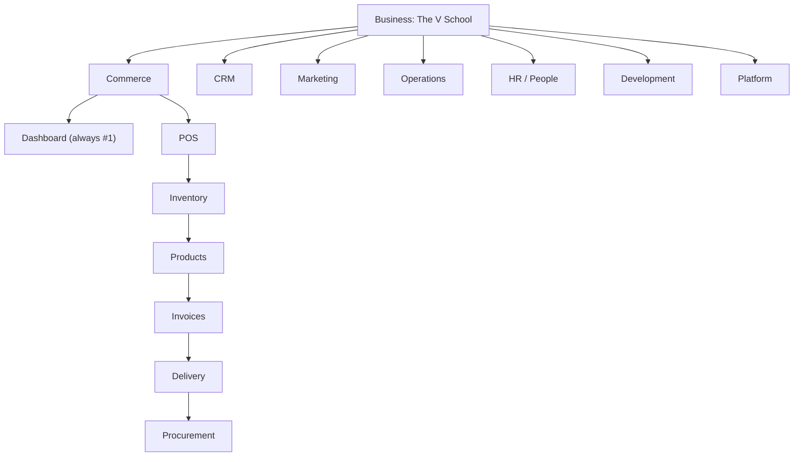

# SITEMAP — V2 Domain Navigation (V1-style, Business-bound)

| Field | Value |
|-------|-------|
| **Version** | 0.4.2 |
| **Status** | Accepted |
| **Author** | Claude |
| **Date** | 2026-08-14 |
| **Relates to** | ADR-011 (context-bar and Business scope ceiling — authoritative), ADR-008, ADR-003, ADR-006, FR-020, FR-039, PARITY-INVENTORY.md, ROUTES-SITEMAP.md |

Adopts V1's information architecture — **top-level = domain, sidebar = the domain's
sub-features, with an explicit root contract per domain** — and binds it to V2's new
**Business** layer, adding a **second bar under the current topbar** for the domains.

> **Scope presentation & entry flow moved to [ADR-011](decisions/ADR-011-CONTEXT-BAR-AND-BUSINESS-SCOPE-CEILING.md).**
> This document is the authoritative **domain → sub-domain map** (§3) and business-binding
> rules (§4). How Tier-1 scope is *labelled and anchored* (the dual ERP⇄PM lens) and what the
> user lands on (`login → RBAC → Home → Business Overview`) are defined there; §1–§2 below show
> the ERP-lens default.

> **Accepted entry amendment:** ADR-015 / FR-044 changes the pre-shell journey to
> `Landing (/) → Login stub (/login) → Business Routing (/businesses) → BusinessShell
> (/overview)`. This amendment is routing-only: no auth implementation and no design-token
> change. The route boundary and Business Routing proof are implemented. ADR-017 /
> FR-046 now propose the separate viewer/session contract; it is not runtime behavior
> until approved and implemented.

## 1. The three navigation tiers

```
Tier 1  Context    Portfolio → Tenant → Business  (Workspace → Organization → Business in UI; shell stops here)
Tier 2  Domain     Commerce · CRM · Marketing · Operations · HR / People · Development · Platform
                   (a NEW bar under the topbar; the set is BOUND to the Business)
Tier 3  Sub-domain the active domain's sidebar; each domain defines its own root contract
```

- **Context is chosen on pages, not dropdowns.** The Base Context Bar exposes exactly Workspace,
  Organization, and Business. Schema Workspace and Project are module-local resources: they do not
  appear as shell selectors, breadcrumb switchers, or sidebar parents.
- **Business binds the domain bar.** A Business exposes only the domains it has enabled
  (per-business module registry). TVS shows *Operations → Courses*; a pure-retail business hides
  it — FR-020's adaptive shell one level deeper. Single business ⇒ Home skips straight to it.
- **Domain root is explicit.** Development opens `/overview` (the BusinessShell root),
  and its sidebar starts with the non-parent `Overview` sub-domain. Reserved domains keep
  their `Dashboard` as the first sub-domain. A domain label in the sidebar is context text,
  not a navigation target.
- **URLs never carry scope (ADR-006).** Business/workspace are ambient (selection pages →
  cookie/context), not the path — so `/commerce/inventory`, never `/business/{id}/commerce/...`.
  Switching Business keeps you on the same domain+sub-domain where it exists.

## 2. Layout — two bars

```
┌──────────────────────────────────────────────────────────────┐
│ Zuri   Workspace › Organization › Business    ERP · PM   ⌘K   ◐   👤 │  Base Context Bar — exactly 3 levels
├──────────────────────────────────────────────────────────────┤     (no Space or Project selector)
│  Commerce   CRM   Marketing   Operations   HR / People   Development · Platform │  Domain bar (Tier 2, per-business)
├──────────────────────────────────────────────────────────────┤
│ 🏠  Workspace › Organization › Business › PRJ-x › Files          │  Breadcrumb — context plus opened resource
├───────────────┬──────────────────────────────────────────────┤
│   Overview    │                                                │
│   Projects    │              content                          │  Sidebar (Tier 3: Development only)
└───────────────┴──────────────────────────────────────────────┘
```



## 2b. Navigation journey & selection-by-page

Selection happens on **pages**, never in a topbar dropdown. The Base Context Bar and breadcrumb
show only `Workspace > Organization > Business`; an opened Project is a resource, not a selectable
shell scope. The active lens changes labels, never identity or isolation.

| # | Page | How you pick the next scope (no dropdown) | Breadcrumb |
|---|---|---|---|
| 0 | `/login` | auth + RBAC (who sees which businesses/domains) | — |
| 1 | **`/` Home** | cards → pick / create **Company** | 🏠 หน้าแรก |
| 2 | Home (company chosen) | cards → pick / create **Business** | 🏠 › ABC |
| 3 | **`/overview` Business Overview** | domain bar → pick a **domain** | 🏠 › ABC › ภาพรวม |
| 4 | **`/overview`… domain home** | sidebar → **sub-domain** | 🏠 › ABC › Overview |
| 5 | **`/projects` (list)** | open a Project resource | 🏠 › Workspace › Organization › Business › Projects |
| 6 | **`/projects/{id}`** | tabs → work view | 🏠 › Workspace › Organization › Business › PRJ-x |
| 7 | **`/projects/{id}/files`** | — (leaf) | 🏠 › Workspace › Organization › Business › PRJ-x › Files |

- **Accepted FR-044 route contract:** `/` is minimal Landing,
  `/login` is a demo Login stub, `/businesses` is Business Routing, and `/overview` is the
  guarded BusinessShell. Business Routing is shown even for one visible Business; no final
  shell chrome renders before selection. Historical rows above remain for traceability only.
- **The context bar is the shell boundary.** To change Workspace, Organization, or Business, return
  to Home. Project navigation stays in Development.
- **Desktop sidebar is always labelled.** It exposes the active domain's sub-domains without hover;
  icon-only presentation is reserved for the mobile breakpoint.
- **Adaptive (FR-020).** A single visible context level may be shown as static identity, but the
  Base Context Bar never gains a fourth Space or Project level.
- Single-business owners effectively land on their Business Overview; multi-business owners pass
  through Home each time they switch — the ERP "pick your company" gesture. Overview never
  substitutes a portfolio/group roll-up for the selected Business.

### Project ownership versus Space context

Inside Development, a Project is owned directly by its Business. The schema
`Workspace` entity is displayed as **Space** and is only a grouping context:

```text
Business
  └─ Development
      └─ Space (schema Workspace)
          └─ Project
```

Project detail pages show `Business > Development > Project` as the primary
context and `Space: <code>` as secondary metadata. Portfolio/tenant shared
Projects may remain ownerless and are never included in a Business Overview.

## 3. Domain → sub-domain map (V2)

Legend: **lift** = reuse V1 UI per ADR-003 · **rebuild** = V1 defect, rebuild in V2 ·
**new** = V2-only (V1 never had workspace/business/project/product/B2B).

### Commerce — การค้า/ขาย  *(V1: commerce)*
1. **Dashboard** — ยอดขายวันนี้ · ออเดอร์ค้าง · สต็อกต่ำ *(new dashboard over lifted data)*
2. หน้าร้าน / POS — cashier *(lift)*
3. สินค้า / Products — catalog *(new)*
4. คลังสินค้า / Inventory — stock · lots · movements *(lift)*
5. วัตถุดิบ / Ingredients *(lift)*
6. ใบเสร็จ·ใบแจ้งหนี้ / Invoices *(lift)*
7. จัดส่ง / Delivery — zones · drivers *(lift, later)*
8. จัดซื้อ·รับของ / Procurement — GRN *(lift)*
9. B2B / ขายส่ง — quotes → orders *(new; B2B_SALES execution mode feeds here)*

### Customer — ลูกค้า  *(V1: customer — deepest PII surface)*
1. **Dashboard** — ลูกค้าใหม่ · active · สถานะ PDPA
2. CRM 360 *(lift)*
3. Leads *(lift)*
4. Segments *(lift)*
5. Inbox — LINE · Facebook *(rebuild — per-tenant routing; runs through the P3 identity gate)*
6. Consent · PDPA — the only consent writer *(lift; erase-revoke wired to FR-022)*
7. Notifications *(lift)*

### Growth — การตลาด  *(V1: growth — existing AI surface)*
1. **Dashboard** — spend · ROAS · KPI attainment
2. Campaigns *(lift)*
3. Ads Audit *(lift)*
4. Daily Brief *(lift; fix V1 date-only key → per-business)*
5. Automations *(lift)*
6. Broadcasts *(lift; consent-checked)*
7. AI Copilot — chat over business data *(new; the ADR-007 agent stack: Gate E read now, Gate F actions later)*

### Operations — ปฏิบัติการ  *(V1: operations — culinary-school core)*
1. **Dashboard** — คิวครัว · คลาสวันนี้ · พนักงานเข้ากะ
2. ครัว / Kitchen *(lift)*
3. จอครัว / Runner — tablet display *(lift)*
4. คอร์ส / Courses — list · enrollments *(lift; core, must-have)*
5. เช็คชื่อ / Attendance — QR class check-in *(lift)*
6. ใบรับรอง / Certificates — BASIC_30H · PRO_111H · MASTER_201H *(lift)*
7. ทีมงาน / Team — employees · roles · schedule *(lift)*

### Development — project management  *(new — existing `projects` route key, FR-001…020)*
1. **Overview** — Business Overview at `/overview`
2. Projects
3. All Work
4. Execution — 7 modes (sprint · migration · b2b-sales · b2c-campaign · product-launch · operations · expansion)
5. Timeline
6. Dependencies
7. Milestones & Gates
8. Repositories

The Development label in the sidebar is static context. `/overview` is represented by
the first sidebar sub-domain rather than by a clickable domain heading.

### HR / People — workforce directory *(new — route key `people`, FR-042)*
1. **Dashboard** — Business workforce summary
2. People Directory — Person/Membership records visible in the selected Business

Project Team remains a Project-local Development view. Attendance, leave, payroll,
and performance are future HR slices.

### Platform — ระบบ/ตั้งค่า  *(V1: platform + gaps)*
1. **Dashboard** — สุขภาพระบบ · integrations status
2. Integrations — accounting · FlowAccount *(lift)*
3. ธุรกิจ·องค์กร / Business & Tenant config *(rebuild — V1 PATCH is 403 for all roles)*
4. ผู้ใช้·สิทธิ์ / Users & Roles — Membership *(rebuild — V1 auth is per-tenant Employee)*
5. Identity / LINE linking *(new — the P3 gate: account linking, staff/customer split)*
6. Audit log *(lift/new — append-only)*
7. Backup — snapshot export/import *(new — already shipped)*
8. API keys *(lift)*
9. Settings *(lift)*

## 4. Business-binding rules (which domains appear)

| Business kind | Commerce | CRM | Marketing | Operations | HR / People | Development | Platform |
|---|---|---|---|---|---|---|
| Culinary school (TVS) | ✓ | ✓ | ✓ | ✓ (Courses) | ✓ | ✓ |
| Retail / F&B (no courses) | ✓ | ✓ | ✓ | ✓ (no Courses) | ✓ | ✓ |
| Services / B2B only | ✓ (B2B) | ✓ | ✓ | – | ✓ | ✓ |
| Internal / holding | – | – | – | – | ✓ | ✓ |

- The enabled set is a per-Business module registry (Platform → Business config edits it).
- A domain with zero enabled sub-domains is hidden from the bar entirely.
- **No-business state** (no business selected) shows a Business-required Home action. It does
  not render a portfolio/group card grid. Portfolio progress remains a reporting API only.

## 5. URL scheme (scope-free, ADR-006)

```
/                         → Home: the entry — pick / create Company → Business (RBAC-gated; the picker)
/overview                 → Business Overview (cross-domain) for the selected Business; Business-required state otherwise
 /people                  → HR / People Dashboard
 /people/directory        → Business-scoped People Directory
/{domain}                 → 302 /{domain}/dashboard        (first sub is always the dashboard)
/{domain}/{subdomain}     → e.g. /projects (Project resource list), /commerce/inventory
/projects/{id}/...        → existing Project routes stay verbatim (Development work views)
```

Workspace, Organization, and Business are the only ambient context; schema Workspace is a
module-local Space/filter, never a shell context level.
Deep-linking a sub-domain resolves it inside the currently-selected business; if that business
lacks the domain, land on its Business Overview with a notice.

### 5.1 Project-local Work views

`/projects/{id}` opens a resource within Development. Its tabs are not shell navigation and do
not add a Development sidebar item:

```text
Project tabs: Project | Requirements | Team | Work | Risks | Resources | Files

Work views:   Structure Plan | Board | Schedule | Dependency Map
```

- **Structure Plan** is the WBS hierarchy for the opened Project only.
- **Dependency Map** is the graph of dependency edges whose source and target are both owned by
  that Project.
- **Development > Dependencies** remains the Business-wide register for cross-project and
  cross-workstream dependency analysis. It is intentionally not duplicated as a project tab.

## 6. Mapping onto today's app (what changes)

- Today's single left rail becomes the **Development** sidebar. Workspace is removed because it
  is a resource, not a Development capability.
- The Base Context Bar is the Tier-1 binder; the Business binds the domain bar.
- Commerce / Customer / Growth / Operations / Platform domains are **lifted per module at
  that module's cutover** (ADR-003) — the sitemap reserves their slots now; each lands when
  its parity items (PARITY-INVENTORY) are met. Until a domain is lifted, its tab is hidden
  (business-binding), so the shell degrades cleanly to just Development + Platform today.

## 7. Decisions (resolved — [ADR-008](decisions/ADR-008-BUSINESS-CENTRIC-SHELL-AND-SCOPE-LENS.md) §D6)

1. **Domain order & labels** — ✅ Business Overview root; Commerce · CRM · Marketing · Operations · HR / People · Development · Platform.
2. **Development — peer domain or folded into Platform?** — ✅ a **peer domain** (cross-cutting
   delivery view), never the app root.
3. **B2B & Products** — ✅ under Commerce for now; may split out if they grow.
4. **Per-business module registry storage** — ✅ a small **`BusinessModule` table** (toggles
   without a migration). Deferred to the Platform → Business-config build.
5. **AI Copilot & Campaigns placement** — ✅ under **Growth** (marketing lens).
