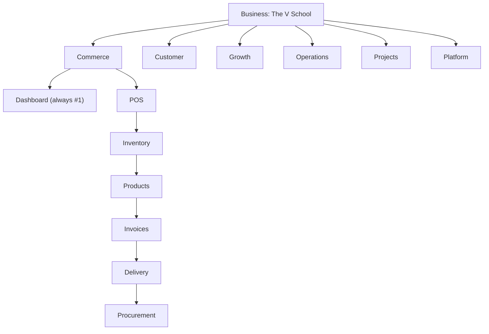

# SITEMAP — V2 Domain Navigation (V1-style, Business-bound)

| Field | Value |
|-------|-------|
| **Version** | 0.1.0 (design draft — sitemap before build) |
| **Status** | Proposed |
| **Author** | Claude |
| **Date** | 2026-08-12 |
| **Relates to** | ADR-008 (business-centric shell · ERP⇄PM lens · entry flow — authoritative), ADR-003 (V2 replaces V1 by reuse), ADR-006 (shell lift · URLs don't carry scope), FR-020 (adaptive shell), PARITY-INVENTORY.md, ROUTES-SITEMAP.md |

Adopts V1's information architecture — **top-level = domain, sidebar = the domain's
sub-features, the first sub-feature is always a Dashboard** — and binds it to V2's new
**Business** layer, adding a **second bar under the current topbar** for the domains.

> **Scope presentation & entry flow moved to [ADR-008](ADR-008-BUSINESS-CENTRIC-SHELL-AND-SCOPE-LENS.md).**
> This document is the authoritative **domain → sub-domain map** (§3) and business-binding
> rules (§4). How Tier-1 scope is *labelled and anchored* (the dual ERP⇄PM lens) and what the
> user lands on (`login → RBAC → Home → Business Overview`) are defined there; §1–§2 below show
> the ERP-lens default.

## 1. The three navigation tiers

```
Tier 1  Scope      Portfolio → Tenant → Business → Workspace   (chosen on PAGES, shown in the breadcrumb — no topbar dropdowns)
Tier 2  Domain     Commerce · Customer · Growth · Operations · Projects · Platform
                   (a NEW bar under the topbar; the set is BOUND to the Business)
Tier 3  Sub-domain the active domain's sidebar; item #1 is ALWAYS "Dashboard"
```

- **Scope is chosen on pages, not dropdowns.** The topbar carries **no** business / workspace /
  project selectors. You set scope by navigating: **Home** picks the Company → Business;
  **`/workspaces`** and **`/projects`** are the pickers for หน่วยงาน and โปรเจกต์. The
  **breadcrumb** (§2b) shows where you are, and each crumb links back to its picker page — so the
  breadcrumb *is* the switcher. (Supersedes the earlier "topbar switcher" model.)
- **Business binds the domain bar.** A Business exposes only the domains it has enabled
  (per-business module registry). TVS shows *Operations → Courses*; a pure-retail business hides
  it — FR-020's adaptive shell one level deeper. Single business ⇒ Home skips straight to it.
- **First sub-domain = Dashboard, always.** Opening a domain lands on its dashboard
  (`/{domain}` → `/{domain}/dashboard`), mirroring V1's `LayoutDashboard` first entry.
- **URLs never carry scope (ADR-006).** Business/workspace are ambient (selection pages →
  cookie/context), not the path — so `/commerce/inventory`, never `/business/{id}/commerce/...`.
  Switching Business keeps you on the same domain+sub-domain where it exists.

## 2. Layout — two bars

```
┌──────────────────────────────────────────────────────────────┐
│ Zuri                ⌗ Projects        ERP · PM   ⌘K   ◐   👤  │  Topbar — identity · viewed-domain · lens · actions
├──────────────────────────────────────────────────────────────┤     (NO business/workspace/project dropdowns)
│  Commerce   Customer   Growth   Operations   Projects · Platform │  Domain bar (Tier 2, per-business)
├──────────────────────────────────────────────────────────────┤
│ 🏠  ABC ›  Projects ›  โปรเจกต์ ›  PRJ-x ›  Structure           │  Breadcrumb — you-are-here (each crumb → its picker)
├───────────────┬──────────────────────────────────────────────┤
│ ● Dashboard   │                                                │
│   Projects    │              content                          │  Sidebar (Tier 3: sub-domains,
│   Workspaces  │                                                │  Dashboard pinned first)
│   All Work    │                                                │
└───────────────┴──────────────────────────────────────────────┘
```



## 2b. Navigation journey & selection-by-page

Selection happens on **pages**, never in a topbar dropdown. The breadcrumb is the "you-are-here"
trail of the journey; every crumb links back to the page that selects that level. Labels follow
the active lens (ERP shows *บริษัท / หน่วยงาน*; PM shows *Workspace / Space*).

| # | Page | How you pick the next scope (no dropdown) | Breadcrumb |
|---|---|---|---|
| 0 | `/login` | auth + RBAC (who sees which businesses/domains) | — |
| 1 | **`/` Home** | cards → pick / create **Company** | 🏠 หน้าแรก |
| 2 | Home (company chosen) | cards → pick / create **Business** | 🏠 › ABC |
| 3 | **`/overview` Business Overview** | domain bar → pick a **domain** | 🏠 › ABC › ภาพรวม |
| 4 | **`/projects`… domain home** | sidebar → **sub-domain** | 🏠 › ABC › Projects |
| 5 | **`/workspaces`** | cards → pick **หน่วยงาน** | 🏠 › ABC › Projects › หน่วยงาน |
| 6 | **`/projects` (list)** | cards → pick **โปรเจกต์** | 🏠 › ABC › Projects › โปรเจกต์ |
| 7 | **`/projects/{id}`** | tabs → work view | 🏠 › ABC › Projects › PRJ-x |
| 8 | **`/projects/{id}/structure`** | — (leaf) | 🏠 › ABC › Projects › PRJ-x › Structure |

- **The breadcrumb IS the switcher.** To change business, click the business crumb → Home picker;
  to change project, click the *โปรเจกต์* crumb → `/projects`. No persistent dropdowns.
- **Adaptive (FR-020).** One company ⇒ Home skips step 1; one business ⇒ skips step 2; one
  workspace ⇒ the หน่วยงาน crumb is omitted. Crumbs only appear when there is a real choice.
- Single-business owners effectively land on their Business Overview; multi-business owners pass
  through Home each time they switch — the ERP "pick your company" gesture.

## 3. Domain → sub-domain map (V2)

Legend: **lift** = reuse V1 UI per ADR-003 · **rebuild** = V1 defect, rebuild in V2 ·
**new** = V2-only (V1 never had workspace/business/project/product/B2B).

### Commerce — การค้า/ขาย  *(V1: commerce)*
1. **Dashboard** — ยอดขายวันนี้ · ออเดอร์ค้าง · สต็อกต่ำ *(new dashboard over lifted data)*
2. หน้าร้าน / POS — cashier *(lift)*
3. สินค้า / Products — catalog *(new)*
4. คลังสินค้า / Inventory — stock · lots · movements *(lift)*
5. วัตถุดิบ / Ingredients *(lift)*
6. ใบเสร็จ·ใบแจ้งหนี้ / Invoices *(lift)*
7. จัดส่ง / Delivery — zones · drivers *(lift, later)*
8. จัดซื้อ·รับของ / Procurement — GRN *(lift)*
9. B2B / ขายส่ง — quotes → orders *(new; B2B_SALES execution mode feeds here)*

### Customer — ลูกค้า  *(V1: customer — deepest PII surface)*
1. **Dashboard** — ลูกค้าใหม่ · active · สถานะ PDPA
2. CRM 360 *(lift)*
3. Leads *(lift)*
4. Segments *(lift)*
5. Inbox — LINE · Facebook *(rebuild — per-tenant routing; runs through the P3 identity gate)*
6. Consent · PDPA — the only consent writer *(lift; erase-revoke wired to FR-022)*
7. Notifications *(lift)*

### Growth — การตลาด  *(V1: growth — existing AI surface)*
1. **Dashboard** — spend · ROAS · KPI attainment
2. Campaigns *(lift)*
3. Ads Audit *(lift)*
4. Daily Brief *(lift; fix V1 date-only key → per-business)*
5. Automations *(lift)*
6. Broadcasts *(lift; consent-checked)*
7. AI Copilot — chat over business data *(new; the ADR-007 agent stack: Gate E read now, Gate F actions later)*

### Operations — ปฏิบัติการ  *(V1: operations — culinary-school core)*
1. **Dashboard** — คิวครัว · คลาสวันนี้ · พนักงานเข้ากะ
2. ครัว / Kitchen *(lift)*
3. จอครัว / Runner — tablet display *(lift)*
4. คอร์ส / Courses — list · enrollments *(lift; core, must-have)*
5. เช็คชื่อ / Attendance — QR class check-in *(lift)*
6. ใบรับรอง / Certificates — BASIC_30H · PRO_111H · MASTER_201H *(lift)*
7. ทีมงาน / Team — employees · roles · schedule *(lift)*

### Projects — โปรเจกต์/แผนงาน  *(new — the module V2 already shipped, FR-001…020)*
1. **Dashboard** — weighted roll-up · gates ค้าง · หมุดหมายถัดไป *(= today's `/overview`)*
2. Workspaces
3. Projects
4. All Work
5. Execution — 7 modes (sprint · migration · b2b-sales · b2c-campaign · product-launch · operations · expansion)
6. Timeline
7. Dependencies
8. Milestones & Gates
9. Repositories

### Platform — ระบบ/ตั้งค่า  *(V1: platform + gaps)*
1. **Dashboard** — สุขภาพระบบ · integrations status
2. Integrations — accounting · FlowAccount *(lift)*
3. ธุรกิจ·องค์กร / Business & Tenant config *(rebuild — V1 PATCH is 403 for all roles)*
4. ผู้ใช้·สิทธิ์ / Users & Roles — Membership *(rebuild — V1 auth is per-tenant Employee)*
5. Identity / LINE linking *(new — the P3 gate: account linking, staff/customer split)*
6. Audit log *(lift/new — append-only)*
7. Backup — snapshot export/import *(new — already shipped)*
8. API keys *(lift)*
9. Settings *(lift)*

## 4. Business-binding rules (which domains appear)

| Business kind | Commerce | Customer | Growth | Operations | Projects | Platform |
|---|---|---|---|---|---|---|
| Culinary school (TVS) | ✓ | ✓ | ✓ | ✓ (Courses) | ✓ | ✓ |
| Retail / F&B (no courses) | ✓ | ✓ | ✓ | ✓ (no Courses) | ✓ | ✓ |
| Services / B2B only | ✓ (B2B) | ✓ | ✓ | – | ✓ | ✓ |
| Internal / holding | – | – | – | – | ✓ | ✓ |

- The enabled set is a per-Business module registry (Platform → Business config edits it).
- A domain with zero enabled sub-domains is hidden from the bar entirely.
- **Portfolio landing** (no business selected) shows only the group **Overview** + Projects
  roll-up across businesses — today's `/overview`. Picking a business reveals the domain bar.

## 5. URL scheme (scope-free, ADR-006)

```
/                         → Home: the entry — pick / create Company → Business (RBAC-gated; the picker)
/overview                 → Business Overview (cross-domain) · group roll-up when no business is picked
/{domain}                 → 302 /{domain}/dashboard        (first sub is always the dashboard)
/{domain}/{subdomain}     → e.g. /projects (list = project picker), /workspaces (หน่วยงาน picker), /commerce/inventory
/projects/{id}/...        → the existing project routes stay verbatim (Projects domain work views)
```

Business + workspace are ambient — set by the **selection pages** (Home, `/workspaces`,
`/projects`) into cookie/context, never in the path; the **breadcrumb** reflects them (§2b).
Deep-linking a sub-domain resolves it inside the currently-selected business; if that business
lacks the domain, land on its Business Overview with a notice.

## 6. Mapping onto today's app (what changes)

- Today's single left "Modules" rail (Overview · Workspaces · Projects · …) **becomes the
  Projects domain's sidebar** — no route changes; it just moves under the Projects tab.
- A **new domain bar** is added under the existing topbar; the business switcher already
  present (`สลับธุรกิจ`) becomes the Tier-1 binder for it.
- Commerce / Customer / Growth / Operations / Platform domains are **lifted per module at
  that module's cutover** (ADR-003) — the sitemap reserves their slots now; each lands when
  its parity items (PARITY-INVENTORY) are met. Until a domain is lifted, its tab is hidden
  (business-binding), so the shell degrades cleanly to just Projects + Platform today.

## 7. Decisions (resolved — [ADR-008](ADR-008-BUSINESS-CENTRIC-SHELL-AND-SCOPE-LENS.md) §D6)

1. **Domain order & labels** — ✅ Commerce · Customer · Growth · Operations · Projects · Platform.
   Thai labels above stand.
2. **Projects — peer domain or folded into Platform?** — ✅ a **peer domain** (cross-cutting
   delivery view), never the app root.
3. **B2B & Products** — ✅ under Commerce for now; may split out if they grow.
4. **Per-business module registry storage** — ✅ a small **`BusinessModule` table** (toggles
   without a migration). Deferred to the Platform → Business-config build.
5. **AI Copilot & Campaigns placement** — ✅ under **Growth** (marketing lens).
