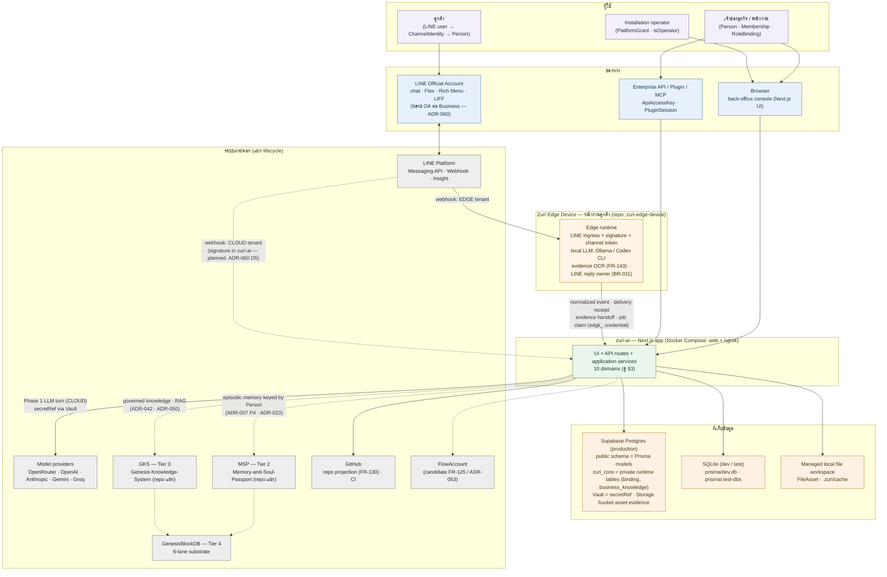
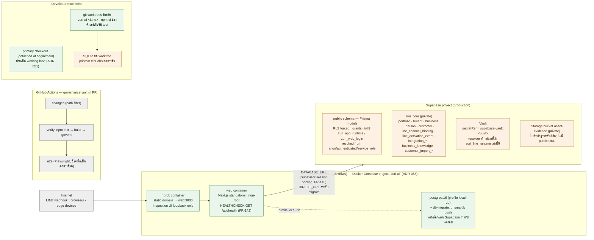
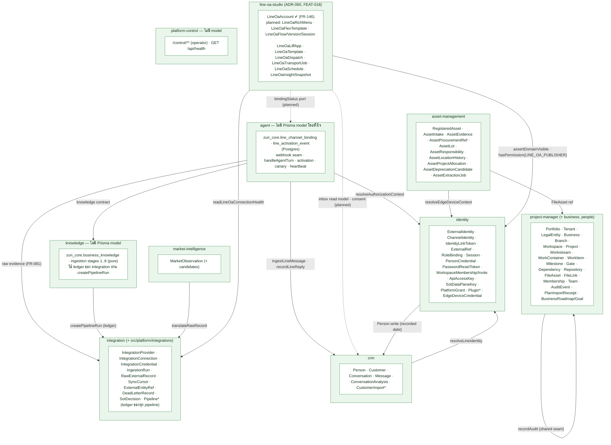
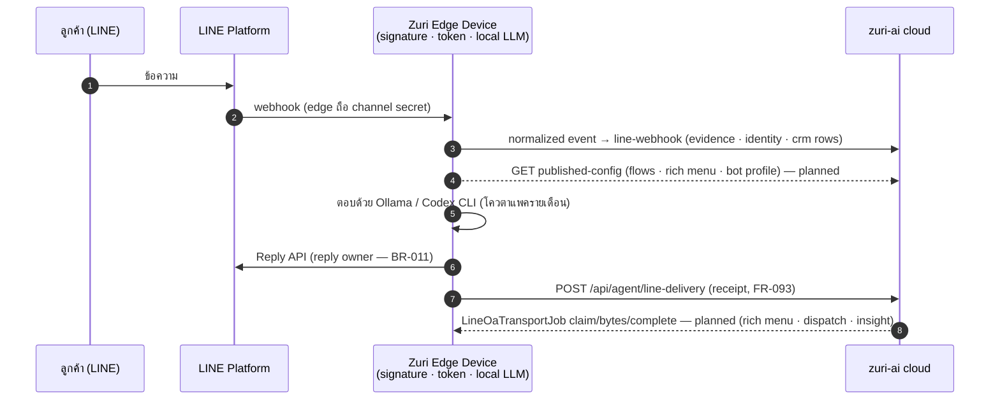
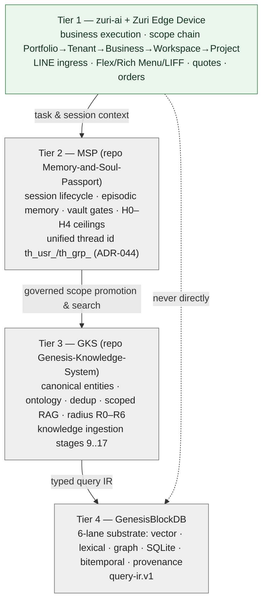
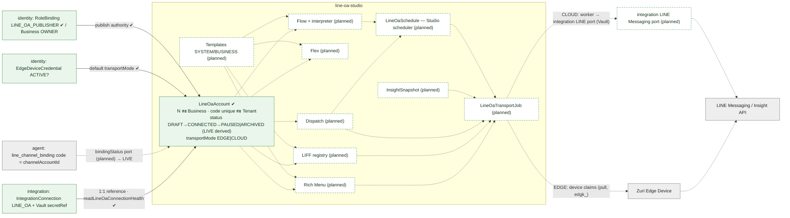

# System Diagram — zuri-ai ทั้งระบบ

| Field | Value |
|-------|-------|
| **Version** | 1.0.0 |
| **Status** | Draft — snapshot of what exists on `main` plus the declared lanes, drawn 2026-09-05 |
| **Author** | Claude Fable 5.1 |
| **Date** | 2026-09-05 |
| **Relates to** | [ARCHITECTURE-DIAGRAMS.md](ARCHITECTURE-DIAGRAMS.md) (three-layer, data-flow and flowchart views from 2026-08-15), [ARCHITECTURE.md](ARCHITECTURE.md), [DOMAIN-MAP.md](DOMAIN-MAP.md) (generated ownership), [PRODUCT.md](PRODUCT.md), ADR-007, ADR-018, ADR-025, ADR-041, ADR-043, ADR-044, ADR-058, ADR-059, ADR-060 |

หน้านี้ตอบคำถามเดียว: **ระบบทั้งหมดประกอบด้วยอะไร ใครคุยกับใคร และอะไรสร้างแล้ว/ยังไม่สร้าง** ณ วันที่วาด
ทุกกล่องอ้างอิงเอกสารที่มีอยู่จริง ไม่มี mock; สิ่งที่ยังเป็นประกาศ (declared) วาดเป็นเส้นประและติดป้าย *planned*
มุมมองที่ละเอียดกว่า (three-layer, DFD, flowchart) อยู่ใน `ARCHITECTURE-DIAGRAMS.md`
และความเป็นเจ้าของ model รายโดเมนที่ generate จาก charter อยู่ใน `DOMAIN-MAP.md`

**สัญลักษณ์**: เส้นทึบ = สร้างแล้วและมี test · เส้นประ = ประกาศแล้ว ยังไม่มีโค้ด · กล่องสีเทา = ระบบภายนอก/repo อื่น

---

## 1. System context — ระบบและสิ่งรอบข้าง



สิ่งที่แผนภาพนี้ยืนยัน

| ขอบเขต | ข้อความ | ที่มา |
|---|---|---|
| หนึ่ง reply owner ต่อ LINE event | อุปกรณ์ edge (บัญชี EDGE) หรือคลาวด์ (บัญชี CLOUD) — ไม่ใช่ทั้งคู่ | BR-011, ADR-060 D5 |
| ความลับของ LINE ไม่อยู่ในคอนโซล | edge ถือ channel secret/token ของตัวเอง; บัญชี CLOUD ใช้ Vault ผ่าน port ของ integration | ADR-041 D2/D3, ADR-031 |
| Zuri DB ≠ MSP DB | ใช้ Postgres instance ร่วมได้ แต่คนละ schema/role/migration | ADR-007 §P4 |
| memory ผูกกับ Person ไม่ใช่ lineUserId | Identity มาก่อน Memory | ADR-007, ADR-045 |
| external id ไม่ใช่ key | UUID + code + ExternalRef | BR-002 |
| AI ไม่เขียนตรง | agent อ่านอย่างเดียวจนกว่า Gate F | BR-007, ADR-007 |

---

## 2. Runtime และ deployment topology



ข้อเท็จจริงที่ควรรู้: `docker-compose.yml` ตรึงชื่อ project เป็น `zuri-ai` ดังนั้น `docker compose up` จาก worktree ไหนก็ recreate stack ตัวเดียวกันของเครื่อง (CLAUDE.md); การ deploy ส่งให้ session ที่ถือบทบาท deploy

---

## 3. Domain map — โดเมนใน `src/modules/` และสิ่งที่แต่ละโดเมนเป็นเจ้าของ

ความเป็นเจ้าของ model บังคับด้วย preflight (ADR-025 D3): หนึ่ง model มีเจ้าของเดียว เขียนได้เฉพาะเจ้าของ; โดเมนอื่นเรียกผ่าน contract



Navigation (Tier 2 domain bar, `src/config/domains.js`): Business Home · Commerce* · CRM · Market Intelligence · Marketing* · Operations* · HR / People · Development · Asset Management · LINE OA Studio* · Platform — เครื่องหมาย * = ช่อง `soon` ที่ซ่อนไว้ ยังไม่มีหน้า

---

## 4. เส้นทาง LINE — inbound turn และ outbound

### 4.1 บัญชี CLOUD (ค่า default ของ tenant ทั่วไป — ADR-060 D5)

```mermaid
sequenceDiagram
  autonumber
  participant U as ลูกค้า (LINE)
  participant L as LINE Platform
  participant T as Transport owner<br/>(วันนี้: zuri-cli/edge forward; planned: zuri-ai verify เอง)
  participant W as POST /api/agent/line-webhook (agent)
  participant I as identity
  participant C as crm
  participant S as line-oa-studio (planned)
  participant M as Model provider (Vault secretRef)
  U->>L: ข้อความ
  L->>T: webhook (signature)
  T->>W: normalized event + bindingId + destination + bearer
  W->>W: resolve binding → tenant/business (FR-052, fail closed)
  W->>I: resolveLineIdentity / ChannelIdentity (channelAccountId = binding code)
  W->>C: ingestLineMessage (Person · Customer · Conversation · Message)
  W-->>S: resolveAutomation(account, trigger) — planned (flows)
  W->>M: grounded answer (FR-047/FR-057, read-only Gate E)
  W-->>T: verified text (ไม่มี replyToken)
  T->>L: Reply API (หนึ่ง reply — FR-050)
  T->>W: POST /api/agent/line-delivery (FR-093 receipt)
  W->>C: recordLineReply (Message OUTBOUND)
```

### 4.2 บัญชี EDGE (tenant ที่ใช้ Ollama / Codex CLI บนอุปกรณ์ — ADR-031 rev 0.3.0b, ADR-060 D5)



กฎที่ทั้งสองแบบใช้ร่วมกัน (ADR-060 D5 v0.3.1): reply ที่ส่งระหว่าง turn รายงานผ่าน FR-093; งานที่เริ่มจาก Studio รายงานเป็นผลของ job — หนึ่งการส่ง หนึ่ง receipt path

---

## 5. Four-tier cognitive stack (ADR-043) — ใครถืออะไร



zuri-ai เป็น Tier 1 เท่านั้น: ไม่คุยกับ GenesisBlockDB ตรง ไม่ข้าม MSP; knowledge ingestion stage 1..8 เป็น calculator บริสุทธิ์ในโดเมน knowledge ส่วน stage 9..17 อยู่ใน GKS/GenesisBlockDB (ADR-050)

---

## 6. LINE OA Studio — ภาพขยายของโดเมนใหม่ (ADR-060)



prerequisite ที่พบ (ADR-060 D9): `Conversation` unique ที่ `(tenantId, channel, externalThreadId)` โดย thread key มาจาก `userId` — ผู้ใช้คนเดียวคุยกับสอง OA ใน tenant เดียวยุบเป็น Conversation เดียว; crm ต้องเพิ่ม `channelAccountId` เข้า identity ของ Conversation ก่อนมุมมองต่อบัญชีจะเป็นจริง

---

## 7. สถานะการสร้าง (2026-09-05)

| ส่วน | สถานะ | หลักฐาน |
|---|---|---|
| Web shell, Project Manager, intake 4 surfaces, audit, backup | สร้างแล้ว | FR-001..020, `docs/TRACE.md` |
| Identity/IAM: session, LINE linking, RBAC, plugin, edge credential | สร้างแล้ว | FEAT-010, FR-144 |
| CRM ingest + Inbox + reply receipt + consent + erasure | สร้างแล้ว | FEAT-009, FR-103, FR-022 |
| Integration substrate, Platform Integrations UI, Vault resolver | สร้างแล้ว (live Vault provisioning เป็น operator gate) | FEAT-004, FR-081 |
| Phase 1 LINE runtime (binding, canary, activation) | สร้างแล้ว; production activation ยังเป็น gate | FR-052..055 |
| Knowledge ingestion Tier 1 stage 1..8 | สร้างแล้ว; stage 9..17 อยู่ GKS/GenesisBlockDB | FEAT-013 |
| Market Intelligence, Asset Management (+ edge extraction) | สร้างแล้ว | FEAT-015..017 |
| Docker Compose + ngrok deployment, health, pooler mode | สร้างแล้ว และใช้บน production | FR-142, FR-145 |
| LINE OA Studio: `LineOaAccount` + API | สร้างแล้วใน local (migration production ยังไม่ apply) | FR-146 |
| LINE OA Studio: rich menu, flows, dispatch, jobs, scheduler, insight, pages | ประกาศแล้ว (Phase 1–4) | ADR-060 D14 |
| MSP / GKS / GenesisBlockDB integration ในเส้นทาง production | ยังไม่มี production deployment ของสาย MSP→GKS | ROADMAP PHASE-ZAI-KNOWLEDGE |
