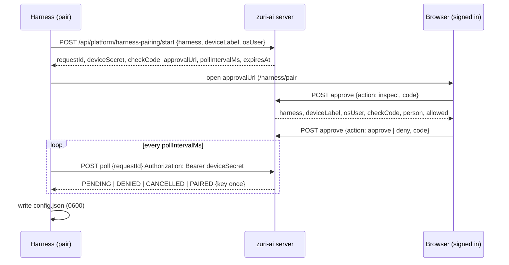
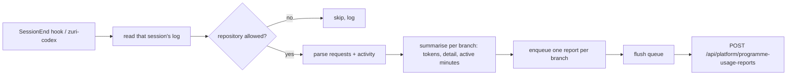

# Zuri harness plugin — specification

`plugins/zuri-harness/` reports what a Claude Code or Codex session really used — tokens and usage detail — to zuri-ai. It reports as a paired device of one person. The plugin never reports the content of the work.

This document is the contract. Its sources are:

- **Why:** [ADR-087](decisions/ADR-087-HARNESS-USAGE-PLUGIN-AND-DEVICE-PAIRING.md) and [ADR-086](decisions/ADR-086-PROGRAMME-DELIVERY-TELEMETRY.md) D4/D7.
- **What:** FR-220, FR-221, FR-222 and FR-239 in [PRD-SDD](PRD-SDD-v1.0.md).
- **Server routes:** the HTTP rows in [Appendix A](appendices/A-api-spec.md).
- **Proof:** every rule below names the test that proves it.
  - Tests under `tests/` are in `apps/server/tests/`.
  - `plugin suite` is `tests/unit/zuri-harness-plugin.test.js`.
  - `detail suite` is `tests/unit/usage-detail.test.js`.

## 1. Parts

| Part | Path | Role |
|---|---|---|
| CLI | `bin/zuri-harness.mjs` | `pair`, `whoami`, `unpair`, `report`, `flush`, `--help` |
| Codex wrapper | `bin/zuri-codex` (POSIX), `bin/zuri-codex.cmd` (Windows) | runs `codex`, then `report --codex-latest --since <start>` |
| Claude Code hooks | `hooks/hooks.json` | `SessionStart` → `whoami --hook`; `SessionEnd` → `report --claude-hook` |
| Slash commands | `commands/pair.md`, `whoami.md`, `unpair.md` | Claude Code `/zuri-harness:*` |
| Codex skill | `skills/zuri-harness/SKILL.md` | the same commands and the wrapper, for Codex |
| Usage parser | `lib/usage.mjs` | request parsing, dedupe, per-branch summaries, report body |
| Detail rules | `lib/detail.mjs` | usage detail; **the programme usage meter imports this same file** |
| Report builder | `lib/report.mjs` | repository filter, session → reports, enqueue and flush |
| Client | `lib/client.mjs` | HTTP calls; queue flush with keep/drop rules |
| Config | `lib/config.mjs` | `~/.zuri-harness/config.json` |
| Queue | `lib/queue.mjs` | `~/.zuri-harness/queue/*.json` |
| Manifests | `.claude-plugin/plugin.json`, `.codex-plugin/plugin.json`, repository root `.claude-plugin/marketplace.json` | install |

Requirements: Node 18 or later, and no dependencies.

**Install**

```
/plugin marketplace add Freshair129/zuri.ai
/plugin install zuri-harness@zuri-ai
```

## 2. Flows

### 2.1 Pairing (FR-220, ADR-087 D1–D3)



**Server rules** (tests: `tests/unit/harness-pairing.test.js`, `tests/unit/harness-credential.test.js`, `tests/e2e/fr220-harness-pairing.spec.js`):

- **Start**
  - Anonymous and bounded: at most 30 starts a minute and 200 pending requests.
  - Pending requests live in memory for 5 minutes.
  - No credential exists before redemption.
- **Approval**
  - Needs a trusted browser session, and its `Origin` must equal the public base URL.
  - The approver must be an installation operator, or hold at least one visible Business. A bare signup is refused.
  - The approving person is the person the device reports as.
- **Redemption**
  - Only the device secret redeems, and only once. A second poll answers 410 `PAIRING_ALREADY_USED_START_AGAIN`.
  - Authority is read again at redemption. An approver who lost it gets 403 `PAIRING_REDEMPTION_FAILED` and no key.
- **Credential**
  - `hrnk_` followed by 43 base64url characters. Stored as a SHA-256 hash and a display prefix.
  - Scope `PROGRAMME_USAGE_REPORT`.
  - `ACTIVE` when an operator approved it, `PENDING_ACTIVATION` otherwise, `REVOKED` after revoke.

**Client states** (plugin suite):

| Poll answer | Client does |
|---|---|
| `PENDING` | wait `pollIntervalMs`, poll again |
| `REDEEMING` | poll again |
| 429 `PAIRING_POLL_TOO_FAST` | wait `max(pollIntervalMs, 1000)` |
| `PAIRED` | save config, print person, device and status; if `PENDING_ACTIVATION`, say an operator must activate it |
| `DENIED`, `CANCELLED` | stop, exit 1 |
| 410 | stop: expired or already used, start again; exit 1 |
| network error | wait and poll again, until `expiresAt` |
| Ctrl+C | best-effort `{cancel: true}` poll, exit 1 |

### 2.2 Reporting a session (FR-221, FR-222, FR-239)



## 3. CLI

`node bin/zuri-harness.mjs <command> [flags]`

| Command | Flags | Behaviour | Exit |
|---|---|---|---|
| `pair` | `--server <url>` (required), `--harness claude-code\|codex` (default `claude-code`), `--label <name>` (default `os.hostname()`), `--ai-account <label>` | §2.1; `osUser` = `os.userInfo().username` | 0 when paired; 1 when refused, expired, denied, cancelled or `--server` missing |
| `whoami` | `--hook` | reads config and asks the server `GET …/programme-usage-reports/whoami` (5 s) | 0; 1 when the credential is refused (not in hook mode) |
| `whoami --hook` | — | prints **one line** (`paired to <person> on <device> (<status>)` or `not paired — run /zuri-harness:pair`), then flushes the queue | always 0 |
| `unpair` | — | deletes the local config; the server-side revoke is an operator's job (Agent devices tab) | 0 |
| `report` | exactly one of `--claude-hook` (hook JSON on stdin), `--claude-transcript <path>`, `--codex-latest [--since <iso>]`, `--codex-session <path>` | §2.2 | hook mode always 0; otherwise 1 on a usage error |
| `flush` | — | §5 | 0 |

A command that is not paired does nothing and reports nothing.

Every error in hook mode is written to `<home>/log.txt` and never surfaces as a hook failure.

## 4. Hooks and wrapper

| Harness | Trigger | Command | Timeout |
|---|---|---|---|
| Claude Code | `SessionStart` | `whoami --hook` | 10 s |
| Claude Code | `SessionEnd` | `report --claude-hook` | 20 s |
| Codex | wrapper after `codex` exits | `report --codex-latest --since <wrapper start ISO>` | none; failure ignored |

- **Why `SessionEnd`, not `Stop`.** `Stop` fires after every turn. Reporting per turn would send partial totals that later collide as conflicts.
- **Resumed sessions.** A resumed session (`--resume`) ends again with larger totals, and the server extends the stored report (§6).
- **`--claude-hook` stdin** is Claude Code's hook JSON. The plugin reads `session_id`, `transcript_path` and `cwd`, and ignores other fields.
- **The wrapper** keeps Codex's exit code. The report's own failure never changes it.
- **`--codex-latest`** picks the newest `.jsonl` under `$CODEX_HOME/sessions` (default `~/.codex/sessions`), optionally only files modified after `--since`.

## 5. Local files

`<home>` is `$ZURI_HARNESS_HOME`, or `~/.zuri-harness`. It is never inside a repository.

**`<home>/config.json`** is written with mode 0600 where the platform supports it (plugin suite):

```json
{
  "server": "https://…",
  "harness": "claude-code",
  "deviceLabel": "DESKTOP-VETATMQ",
  "key": "hrnk_…",
  "installationId": "…",
  "personDisplayName": "…",
  "status": "ACTIVE",
  "repositories": ["Freshair129/zuri.ai"],
  "aiAccount": "optional label"
}
```

**`<home>/queue/<sha256("source sessionId branch")>.json`** holds one report body per file, mode 0600.

- Enqueuing the same key again **replaces** the file, so a resumed session's larger totals are the ones retried.
- Flush sends files in filename order. That is hash order, not age.
- A corrupt file is skipped.

**Flush keep/drop rules** (plugin suite):

| Response | Queue file | Why |
|---|---|---|
| 201, 200 (`replayed` or `extended`) | removed | accepted |
| 400 `USAGE_REPORT_INVALID` | removed, logged | will never be accepted |
| 404 `PROGRAMME_TASK_UNKNOWN` | removed, logged | will never be accepted |
| 409 `USAGE_REPORT_CONFLICT` | removed, logged | another installation owns the key, or counts shrank |
| 401 `HARNESS_CREDENTIAL_REQUIRED` | kept | re-pair, then it can be sent |
| 403 `HARNESS_NOT_ACTIVATED` | kept | an operator may still activate the device |
| 5xx, timeout (5 s), network error | kept | transient |

`<home>/log.txt` holds diagnostics only. It never contains the key.

## 6. Report body and server rules

`POST /api/platform/programme-usage-reports` with `Authorization: Bearer hrnk_…`. The body is strict: any other key is 400.

| Field | Rule |
|---|---|
| `source` | `claude-code` or `codex` (`^[a-z0-9][a-z0-9._-]{1,39}$`) |
| `sessionId` | 8–128 chars `[A-Za-z0-9._:-]` |
| `branch` | git ref name, ≤ 200; the plugin sends `HEAD` for a detached session |
| `repository` | `Owner/Repo`, optional |
| `aiAccount` | label ≤ 80, optional; cost split only |
| `model` | the most-used model of the branch, optional |
| `inputTokens`, `cacheWriteTokens`, `cacheReadTokens`, `outputTokens` | integers ≥ 0 (§7.1) |
| `requestCount` | ≥ 1 |
| `activeMinutes` | ≥ 0 (§7.1) |
| `startedAt`, `endedAt` | ISO 8601, `endedAt ≥ startedAt` |
| `detail` | optional object, strict (§7.2); omitted when empty |

**Attribution** (ADR-087 D4). Tests: `tests/unit/programme-usage-reports.test.js`, `tests/unit/harness-devices-view.test.js`.

- **Person and installation** come from the credential, never from the body.
- **Lane** is resolved from `branch` against the programme's declared lanes, at **read** time. An undeclared branch shows as unattributed.
- **Row key** is `(source, sessionId, branch)`. One session on two branches is two reports.

**Replay, extension and conflict** (ADR-087 D5, ADR-086 D7). Same tests, plus the detail suite.

| Situation | Answer |
|---|---|
| same key, same payload digest, same installation | 200 `{replayed: true}` |
| same key, same installation, same `startedAt`, every count ≥ stored (detail headline counts included), `endedAt` ≥ stored | 200 `{extended: true}`, audited `EXTENDED` |
| anything else on an existing key | 409 `USAGE_REPORT_CONFLICT` |

- **Digest.** The payload digest covers every stored field.
- **Old reports.** A report without `detail` digests exactly as it did before FR-239.

**Credential refusals**

| Credential | Answer |
|---|---|
| unknown or revoked | 401 `HARNESS_CREDENTIAL_REQUIRED` |
| `PENDING_ACTIVATION` | 403 `HARNESS_NOT_ACTIVATED` |
| missing (and no deployment bearer) | 401 `USAGE_REPORT_CREDENTIAL_REQUIRED` |

The deployment bearer `ZURI_PROGRAMME_USAGE_TOKEN` is for unattended automation only. Its reports carry no person.

## 7. Counting rules

### 7.1 Tokens, requests, time (FR-217, FR-222)

Tests: `tests/unit/programme-usage-meter.test.js`, plugin suite (parity).

- **Claude Code**
  - An assistant line with `message.usage` and a `requestId` is a request.
  - One request is written once per content block, so observations are deduped by `requestId`, keeping the **largest** value per field.
  - `input_tokens` → input, `cache_creation_input_tokens` → cache write, `cache_read_input_tokens` → cache read, `output_tokens` → output.
- **Codex**
  - A `token_usage_record` with `response_id` is a request, deduped by `response_id`.
  - `input_tokens` **includes** `cached_input_tokens`, so input = `input_tokens − cached_input_tokens`, cache read = `cached_input_tokens`, cache write = `cache_write_input_tokens`.
- **Branch**
  - Claude Code: `gitBranch` of the line.
  - Codex: `session_meta.git.branch`.
- **Tokens used** (as shown on the board) = input + cache write + output. Cache read is shown beside it.
- **Active minutes** = the sum of gaps between consecutive request timestamps in the group, each gap capped at 15 minutes, rounded to whole minutes.
- **Repository filter**
  - Claude Code: `git -C <cwd> remote get-url origin` (3 s).
  - Codex: `session_meta.git.repository_url`.
  - Both are normalised to `Owner/Repo` from the https or ssh form. A session outside `config.repositories` is not reported.

### 7.2 Usage detail (FR-239, ADR-086 D7)

One implementation, `lib/detail.mjs`, is used by the plugin and by `apps/server/scripts/programme-usage-meter.mjs`. Tests: detail suite (rules, Codex, privacy, meter–plugin parity).

| Field | Claude Code | Codex | Counted once by |
|---|---|---|---|
| `reasoningTokens` (part of output) | `usage.output_tokens_details.thinking_tokens` | `usage.reasoning_output_tokens` | request id, max per field |
| `cacheWrite5mTokens` / `cacheWrite1hTokens` | `usage.cache_creation.ephemeral_5m_input_tokens` / `ephemeral_1h_input_tokens` | 0 | request id, max |
| `webSearchRequests` / `webFetchRequests` | `usage.server_tool_use.web_search_requests` / `web_fetch_requests` | 0 | request id, max |
| `toolCalls`, `tools[name].calls` | assistant `tool_use` blocks | `response_item` of type `function_call`, `custom_tool_call`, `local_shell_call` | block id / `call_id` |
| `toolErrors`, `tools[name].errors` | user `tool_result` blocks with `is_error: true`; the name comes from the matching `tool_use` id (`unnamed` if unseen) | 0 | `tool_use_id` |
| `toolDenials` | user lines carrying `toolDenialKind` (their error result also counts in `toolErrors`) | 0 | line `uuid` |
| `prompts` | user lines whose content is text (not `tool_result`), not `isMeta`, not `isCompactSummary`, not `isSidechain` | `event_msg` `task_started` | `uuid` / `turn_id` |
| `compactions` | `system` subtype `compact_boundary` | `compacted` items | `uuid` / timestamp and position |
| `apiErrors` | `system` subtype `api_error` | 0 | `uuid` |
| `models[name]` | `message.model` per counted request | `turn_context.model` in force | request |

- **Names.** A tool or model name that does not match `^[\w.:@/-]{1,120}$` is recorded as `unnamed`.
- **Bounds.** At most 300 tool names and 30 model names per report.
- **Canonical form.** Headline counts first, then `tools` and `models` with sorted keys. It is used for the digest and for storage (`detailJson`).

### 7.3 Privacy

- **Never read into a result, sent, stored or shown:** prompt, response or thinking text; tool arguments; tool output; file contents; browser cookies; zuri-ai passwords. Tests: detail suite (a secret string in prompts, tool inputs and outputs never appears in any summary, meter block or report body), and the plugin suite's static source scan.
- **Only** numbers, tool names, model names, branch, repository, session id, timestamps and the optional account label leave the machine.
- **Endpoint.** The server validates the detail strictly, so a body cannot carry text into storage.

## 8. Compatibility and versioning

- **Log formats are an outside dependency.** When Claude Code or Codex renames a field, the affected count silently drops to 0; it is never estimated.
  - To adapt, change `lib/detail.mjs` or `lib/usage.mjs` together with the meter, and extend the parity fixtures in the same change.
  - A field a harness never writes stays 0 (the Codex rows in §7.2).
- **Older plugins** that send no `detail` stay valid: detail is optional, and the digest of a detail-less report is unchanged.
- **Plugin version** lives in both manifests.
  - Bump the **minor** version for new optional body fields.
  - Bump the **major** version for anything the server would refuse from an older plugin, which requires a server change first.
- **Server contract changes** follow Appendix A and the FR that owns the route.

## 9. Known limits

- The meter reads only the logs of the OS user who runs it. Work on `main`, `master` or a detached `HEAD` cannot be attributed to a lane.
- Two people on one OS user and one plugin configuration are one reporter. Separate them by OS user, or re-pair (ADR-087).
- Codex reports no tool error flag, denial, cache lifetime or web tool usage, so those Codex fields are 0.
- Pending pairing requests live in one web process's memory. A server restart expires them.
