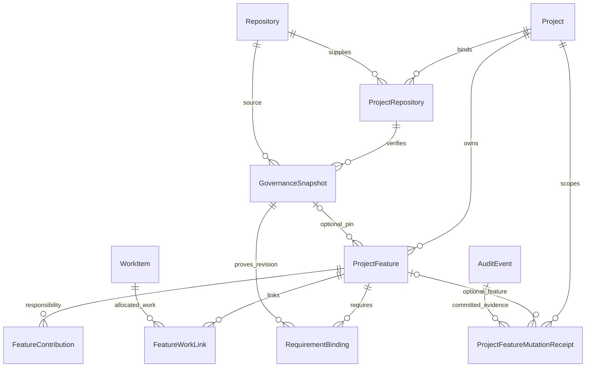

# Appendix B — Database Schema Summary

Version diff 1.53.0b → 1.54.0b: retain the already-deployed CustomerLegalHold model and add the two FR-253 Commerce pricing models. The composed schema has 171 models; pricing migration has passed a production transaction dry-run and rollback, but is not yet applied.

| Field | Value |
|-------|-------|
| **Version** | 1.54.0b |
| **Status** | Draft |
| **Last Updated** | 2026-09-17 |

Source of truth: `apps/server/prisma/schema.prisma` (SQLite; Postgres-ready ตาม DB-MIGRATION-NOTES.md).
Production ตรงกับ `apps/server/prisma/schema.postgres.prisma` (generated) และเปลี่ยนได้ทาง `apps/server/supabase/migrations/` เท่านั้น — preflight `schema-migration-drift` เทียบสองสิ่งนี้ทุก PR (ดู DB-MIGRATION-NOTES.md §Migration discipline)
Conventions: UUID PK · unique human `code` · `createdAt/updatedAt` · `version` บน aggregate
roots · `deletedAt` soft delete · enums เป็น string (Zod validate) · JSON เก็บเป็น string

ทุก model ต้องอยู่ใน `SNAPSHOT_MODELS` (เรียงพ่อก่อนลูก) หรืออยู่ใน
`SNAPSHOT_EXCLUDED_MODELS` พร้อมเหตุผลว่าทำไมกู้คืนไม่ได้ — ทั้งคู่อยู่ใน
`apps/server/src/modules/project-manager/application/backup-service.js` และ preflight
(`snapshot-coverage`) ตรวจจาก `apps/server/prisma/schema.prisma` โดยตรง model ที่ไม่อยู่ในลิสต์ไหนเลย
คือ CRITICAL เพราะ restore จะไม่ export ไม่ลบ และไม่คืนตารางนั้น

`AuditEvent.entityType` เขียนเป็น SCREAMING_SNAKE_CASE เสมอ และ preflight
(`audit-entity-type`) บังคับไว้ — ค่านี้เป็น **หมวดของสิ่งที่ถูกกระทำ** ไม่ใช่ชื่อ Prisma model
(`SNAPSHOT`, `STEP_UP`, `AGENT_ACTION`, `PLUGIN_AUTH_MAINTENANCE` ไม่มี model รองรับเลย)
จึงไม่สะกดตามชื่อ model. เหตุผลเต็มอยู่บน `recordAudit` ใน
`apps/server/src/modules/project-manager/application/audit.js` — โดยย่อคือ audit console กรองและแสดงผล
ด้วยรูปแบบนี้ ดังนั้นค่าที่สะกดต่างออกไปจะกรองไม่เจอและแสดงดิบ ๆ

ระวัง: อีกสี่ model มีคอลัมน์ชื่อ `entityType` เหมือนกัน (`RawExternalRecord`,
`ExternalEntityRef`, `ExternalRef`, `FileLink`) แต่เป็น **คนละ vocabulary** — เป็นชนิด entity
ฝั่ง provider หรือฝั่ง link (`listing`, `retail_price`) ที่ผูกกับ wire format กฎข้างบนไม่แตะ
ค่าเหล่านั้น การเปลี่ยนชื่อเพราะคอลัมน์ชื่อพ้องกันคือการทำ integration พัง

## Models

| Model | Key fields | หมายเหตุ |
|---|---|---|
| KnowledgeCorpus | corpusKey, scopeJson, policyJson, businessId, projectId?, generation, version | FR-173 / ADR-072: Tier 1 atomic snapshot read-set pointer; no canonical fact store |
| KnowledgeSource | corpusId, sourceKey, kind, fileAssetId?, desiredRevision, activeIngestionId?, revokedAt | Stable source identity; correction/revocation use CAS |
| KnowledgeIngestion | sourceId, sourceVersion, revision, contentHash, content, idempotencyKey, executionRunId?, status, claimToken?, leaseExpiresAt? | Immutable accepted Text/Markdown bytes and durable process lease; source/version is unique |
| KnowledgeCorpusGeneration | corpusId, number, manifestJson, manifestHash, createdAt | Immutable source snapshot membership; unique corpus generation |
| AgentTraceEvent | tenantId, businessId, turnId, executionId?, kind, idempotencyKey, payloadJson, occurredAt, createdAt, version | FR-171 / ADR-070 scoped append-only execution evidence; exact context and output snapshots, retention tombstones; no provider credentials. Restored after LineConversationJob. |
| Portfolio | code, name | รากของเครือ (BR-001) |
| Tenant | portfolioId, status | ขอบเขต isolation + การแชร์ข้อมูล |
| LegalEntity / LegalEntityIdentifier | tenantId (was portfolioId); (country,type,value) unique | FR-194/ADR-078 — moved under Tenant so a Business can only reference one in its own Tenant (composite FK); external identifier ไม่ใช่ PK (BR-002) |
| TaxRegistrationBranch | legalEntityId, (legalEntityId,branchCode) unique | FR-194/ADR-078 — the legal entity's own VAT branch registration (ภ.พ.20); split out of `Branch.taxBranchCode` |
| Business | tenantId, legalEntityId? | ธุรกิจปฏิบัติการ |
| Branch | tenantId, businessId, kind, taxRegistrationBranchId? | tenantId ต้องตรงกับ business (tested); FR-194 — `kind` (SITE/WAREHOUSE/KITCHEN/OFFICE), optional link to its LegalEntity's TaxRegistrationBranch (replaces `taxBranchCode`) |
| Employment | personId, tenantId, businessId, branchId?, employeeNo?, title?, employmentType, status | FR-193/ADR-078 — HR assignment record, separate from Membership's access grant; `resolveViewer` never reads it |
| Person / Membership | tenant, business?, role, status, domainKeysJson, version | local canonical identity; only ACTIVE Membership contributes authority; MEMBER domain allow-list, OWNER/DEV role grant (FR-038, FR-094); FR-193 moved `branchId`/`employeeRef` off this row into `Employment` |
| Session | personId, tokenHash, status, assurance, expiresAt, revokedAt?, lastSeenAt, version | persisted server-side session authority; cookie/signature is transport only (FR-095) |
| ChannelIdentity | personId, tenantId, channel, channelAccountId, providerSubject, status, verifiedAt?, linkedAt?, revokedAt?, version | namespaced channel binding; PENDING/ACTIVE/REVOKED lifecycle, additive compatibility contract beside ExternalIdentity (FR-094, FR-097) |
| RoleBinding | personId, tenantId, businessId? (nullable — TENANT scope has none, FR-192/ADR-079), roleKey, scopeType, sodOverrideReason? (FR-196), status, assignedBy, revokedAt | generic Business- or Tenant-scoped RBAC binding; `PRODUCT_OWNER` is the current Product role (FR-076); TENANT scope is now resolved by `resolveViewer` (ADR-079 D4) |
| Workspace | scopeType (PORTFOLIO/TENANT/BUSINESS) + denormalized ancestor ids | ต้องมี scope ชัดเจน |
| Project | businessId?, workspaceId, type, status, priority?, picPersonId?, startAt/targetAt | direct Business owner; schema Workspace is Development Space; null owner only for explicit shared work; soft delete. `priority` (FR-087) and `picPersonId` (FR-088) are both nullable at rest — every row predates them, and unset is a state the Dashboard renders honestly rather than defaulting |
| PlanImportReceipt | idempotencyKey, payloadHash, executionRunId, executionStepId?, attemptId?, correlationId, projectId | server-owned PlanEnvelope commit receipt; stable trace/idempotency boundary; never accepts client-generated execution IDs |
| PersonCredential | personId unique, passwordHash | FR-090 — production auth credential. Declared here because the table is live on Supabase with a real row; the service that uses it is still on `codex/postgres-primary-runtime`. Undeclared, `migrate diff` proposes DROP |
| PasswordResetToken | personId, token unique, expiresAt, usedAt? | FR-090 — same origin as PersonCredential; currently empty |
| MfaFactor | personId, type, secret, label?, status, verifiedAt?, revokedAt?, version | FR-094, FR-095 (ADR-045 D2, D5) — multi-factor authentication factors (TOTP, SMS); PENDING/ACTIVE/REVOKED lifecycle, enables session elevation to AAL2. `secret` is an AES-256-GCM envelope bound to Person and factor, never the base32 secret (SEC-029, SDD-096, ADR-088) |
| PluginInstallation | installationId unique, clientId, status | FR-123 / ADR-052 — durable public-client installation binding for a first-party plugin; holds no device secret and no raw token. Deleting a row cascades to its codes and sessions, which is what a snapshot restore relies on |
| PluginAuthorizationCode | codeHash unique, clientId, redirectUri, codeChallenge(+Method), pluginInstallationId, personId, expiresAt, consumedAt?, revokedAt? | FR-123 / ADR-052 — one-time PKCE S256 authorization code with a 60-second life. The raw code is never persisted; consumption is an atomic conditional update on `consumedAt IS NULL`, which is what makes single-use hold under concurrent redemption rather than merely under sequential reads |
| PluginSession | tokenHash unique, clientId, pluginInstallationId, personId, authorizationCodeId?, expiresAt, revokedAt?, lastUsedAt? | FR-123 / ADR-052 — 15-minute opaque plugin bearer session; the raw token is never persisted. `authorizationCodeId` exists solely so that replaying a consumed code can revoke the session that code already minted (RFC 9700 §4.1.1); the reference is nullable, but maintenance retains the code while a linked session is both unrevoked and unexpired, preserving replay revocation |
| PlatformGrant | personId+capability unique while status='ACTIVE' (FR-197/ADR-079 — was unconditional), status, grantedByPersonId?, grantReason?, expiresAt?, standing, revokedAt? | FR-107/FR-197 — server-held store behind FR-075 `isOperator`; resolved per request by the session port honouring `expiresAt`, revocation effective next request; `standing` flags the bootstrap grant; a renewal is a fresh row, the prior one superseded |
| WorkspaceMembership | portfolioId, personId (unique pair), role, status, invitedByPersonId?, version | FR-067 — Workspace collaboration grant keyed by `portfolioId` (the top-level Workspace IS schema Portfolio, ADR-027 §D2; never schema Workspace = Space). A distinct authority layer (BR-016): `resolveViewer` never reads it |
| AccessInvite | scopeType (PORTFOLIO/TENANT/BUSINESS), portfolioId?, tenantId?, businessId?, invitedByPersonId, targetPersonId?, invitedEmail?, invitedLineUserId?, role, domainKeysJson, reason?, status, tokenHash unique, expiresAt, acceptedByPersonId?, acceptedAt?, acceptedMembershipId?, revokedAt?, revokedByPersonId? | FR-195/ADR-079 — renamed from WorkspaceInvite (FR-067), generalised to all three authority layers: PORTFOLIO scope is unchanged FR-067 behaviour (creates a WorkspaceMembership); TENANT/BUSINESS scope creates a real Membership via `grantBusinessMembership` on acceptance, bound to the accepting session. `tokenHash` is the SHA-256 digest only (SEC-014), the raw token is returned exactly once at mint. EXPIRED is derived from `expiresAt`, never persisted |
| Workstream | projectId, executionMode, laneId?, progressStrategy, progressWeight, progressCache, viewConfigJson | หัวใจของ 7 โหมด · `laneId` (FR-090) is live on every row on Supabase |
| WorkContainer | workstreamId, parentId (hierarchy), subtype, metadataJson | SPRINT/MIGRATION_STAGE/… |
| WorkItem | workstreamId, containerId?, subtype, weight, numericValue, probability, metricDataJson, metadataJson | atomic ทุกโหมด |
| Milestone | projectId, workstreamId?, weight, targetAt, completedAt | |
| Gate | projectId, workstreamId?, required, evidenceJson, status | cap progress (BR-006) |
| Dependency | (sourceType,sourceId,targetType,targetId,dependencyType) unique | cycle-checked ที่ service |
| Repository / ProjectRepository | provider, externalRepoId?, fullName; (projectId,repoId,role) unique | local metadata, m2m |
| GovernanceSnapshot | tenantId, businessId, repositoryId, projectRepositoryId, checkoutBindingId, commitSha, manifestHash, verificationProof, validationStatus, sourceManifest | FR-252 / ADR-097 — immutable server-verified evidence; unique (businessId, repositoryId, commitSha, manifestHash), VALID only. JSON object fields are serialized strings in Prisma/SQLite. |
| ProjectFeature | tenantId, businessId, projectId, code, title, problem, outcome, primaryDomainId, canonicalFeatureKey?, governanceSnapshotId?, lifecycle, version, deletedAt?, deleteBatchId? | FR-252 — unique (projectId, code) includes tombstones. Canonical key/snapshot and deletion/batch are paired. Optional pin must belong to the same Project. |
| FeatureContribution | tenantId, businessId, featureId, domainId, responsibility, version, deletedAt?, deleteBatchId? | FR-252 — unique (featureId, domainId) preserves identity when revived; grants no Domain access. |
| FeatureWorkLink | tenantId, businessId, featureId, workItemId, allocationBps?, version, deletedAt?, deleteBatchId? | FR-252 — unique (featureId, workItemId); WorkItem must resolve to the same Project. Nullable allocation is 0–10000; cross-Feature totals are checked by the transaction service. |
| RequirementBinding | tenantId, businessId, featureId, governanceSnapshotId, sourceNamespace, requirementKey, revisionHash, acceptanceRef, version, deletedAt?, deleteBatchId? | FR-252 — unique (featureId, governanceSnapshotId, sourceNamespace, requirementKey); exact verified source revision, never a client-invented requirement subject. |
| ProjectFeatureMutationReceipt | tenantId, businessId, projectId, featureId?, targetId, targetType, httpMethod, principalId, operation, idempotencyKey, payloadHash, resourceId, resourceType, version?, etag, auditEventId, status | FR-252 — immutable COMMITTED receipt; unique (tenantId, businessId, principalId, operation, targetId, idempotencyKey). Nine exact operation/method/target/resource tuples; resourceId is polymorphic and verified by policy/service. |
| Team | code unique, businessId, deletedAt? | FR-089 — organisational grouping, Business-scoped (ADR-037 D2). Grants nothing: the identity module never reads it (BR-018) |
| TeamMembership | (teamId,personId) unique | Person ↔ Team, deliberately separate from `Membership` — that one is the authority record, and merging the two is what let an unauthenticated POST mint owner authority on 2026-08-17. No `role` column, on purpose |
| ProjectTeam | (projectId,teamId) unique | m2m: a Project is worked by several Teams and a Team works several Projects (ADR-037 D3) |
| IntegrationProvider / IntegrationConnection / IntegrationCredential | code unique; (tenantId,providerId,externalAccountId) unique; connectionId unique | provider + Business-scoped connection registry, opaque secret ref (FR-079/FR-080); FR-223 adds secretStore (DEPLOYMENT_MOUNT / SUPABASE_VAULT / ENVELOPE), secretKind, displayHint? (Channel ID last four), lastValidatedAt?, lastValidationCode?, revokedAt?, revokeReason? — never material |
| IntegrationCredentialVersion | (credentialId,versionNumber) unique; (tenantId,businessId,status); secretRef | FR-223 — append-only version history: PENDING_VALIDATION → ACTIVE → SUPERSEDED / REJECTED / REVOKED → PURGED; createdVia BROWSER_MFA / OPERATOR_CLI / BACKFILL. Exported with the snapshot (references only) |
| RateLimitBucket | key unique | FR-224 — fixed-window counter (key from internal ids, windowStart, count) for the credential-write rate limit per Person and Business and installation-wide LINE validations. Excluded from backup as ephemeral |
| ChannelAccountClaim | connectionId unique; (provider,externalAccountHash) unique — on Postgres only among rows with releasedAt IS NULL | FR-226 — one live claim per external bot across the installation, keyed by sha256(destination), never the raw id; taken before any secret is stored. Exported (no material) |
| IntegrationSecretEnvelope | id = the uuid of `envelope:<uuid>`; (tenantId,businessId,connectionId) | FR-223 — envelope-store ciphertext (AES-256-GCM, DEK wrapped by the deployment KEK, AAD bound to scope and version). Purge deletes the row. Excluded from backup as credential material |
| IngestionRun | connectionId, lane, resourceType, status, counts | one acquisition pass; inherits the connection's scope (FR-081) |
| RawExternalRecord | idempotencyKey unique; (connectionId,entityType,externalId) | verbatim source payload as replayable evidence (FR-081) |
| SyncCursor | (connectionId,resourceType) unique | incremental watermark per resource (FR-081) |
| ExternalEntityRef | (connectionId,entityType,externalId) unique | external → internal mapping; external id is never a PK (BR-002) |
| DeadLetterRecord | connectionId, failureStage, failureOwner, status | preserved failure with a named owner (FR-081) |
| MarketObservation | tenantId, businessId?, rawRecordId, connectionId, provider, externalId, lineageKey unique | Market-owned translated observation; scalar raw/connection refs preserve Integration authority, and unresolved candidates remain valid (FR-092 / ADR-038) |
| ProjectFile | projectId, workItemId?, name, mime, size, url/blobRef, version, uploadedBy | metadata/reference only; optional WorkItem must belong to Project (FR-037) |
| BusinessRoadmap | businessId, code, title, status, startAt/targetAt | Business-level direction container (FR-041) |
| BusinessRoadmapHorizon | roadmapId, key, label, position, targetAt | ordered short/medium/long horizon; service allows 2 or 3 |
| BusinessGoal | businessId, roadmapId?, horizonId?, code, title, status, progress | Business goal displayed in Strategy Overview |
| ProjectGoal | projectId, goalId | optional many-to-many link; Project remains a Development resource |
| AuditEvent | entityType, entityId, action, payloadJson, actorType | append-only (SEC-003). `entityType` is **SCREAMING_SNAKE_CASE**, enforced by preflight `audit-entity-type`. It names a *category*, not a Prisma model — `SNAPSHOT`, `STEP_UP`, `AGENT_ACTION` and `PLUGIN_AUTH_MAINTENANCE` have no model behind them — so it is never spelled like one. Four other models carry a column of the same name (`RawExternalRecord`, `ExternalEntityRef`, `ExternalRef`, `FileLink`); those are a separate vocabulary of provider-side and link-side kinds (`listing`, `retail_price`) and this rule does not reach them |
| PipelineRun | executionRunId unique, dataPipelineDefinitionId, executionContractId, tenantId, businessId?, status, hashes, counts, replay lineage, heartbeat | server-owned full-pipeline run envelope; distinct from IngestionRun and PlanImportReceipt (FR-071) |
| PipelineStep | executionStepId unique, runId, pipelineStageId, sequence, attemptId unique, status, hashes, failure evidence, heartbeat | one stage occurrence/attempt; retries create new executionStepId/attemptId (FR-071) |
| PipelineEventReceipt | runId, idempotencyKey unique, eventType, eventHash, resultJson, auditEventId | exact event idempotency and immutable receipt; no raw event payload (FR-071) |
| PipelineRecordEvent | runId, stepId?, attemptId, pipelineRecordId, source key/hash, docId?, picId?, factId?, destinationRecordId?, status, failure evidence | redacted record outcome/provenance ledger; no OCR/document/image payload (FR-071) |
| PipelineReconciliation | runId, stepId?, expected/actual/delta counts, source/artifact/staging/destination hashes, RLS/isolation result | reconciliation evidence linked to a run/stage (FR-071) |
| PipelineGateDecision | runId, gateId?, status, required, decision/evidence references, auditEventId | approval/hold evidence for execution; existing Project Manager Gate remains its owner (FR-071) |
| KnowledgeEvidenceCursor | portfolioId, tenantId, businessId, workspaceId, projectId, sharing (unique together), cursor, lastPulledAt | zuri-ai's own cursor into GKS's `gks_stage_evidence_export`, one per exact KnowledgeScope pulled — no wildcard scope; advances only after the page's ledger writes committed, so a crash replays a page the receiver's idempotency makes harmless. Integration-lane bookkeeping for the evidence pull, not a ledger table (FR-110, ADR-068 D2) |
| SotDecision | tenantId, businessId?, decisionType, subjectRef, phaseId?, payloadJson+payloadSha256, decisionVersion, status, decidedByPersonId, reason, auditEventId | the SoT pipeline's generic human-decision queue: submitted by the data plane, decided in the browser, pulled back by cursor; rows immutable once decided (FR-100, ADR-046) |
| SotDataPlaneKey | label, tenantId, keyHash (unique), keyPrefix, status, lastUsedAt, revokedAt, revokeReason | a service-account credential bound to exactly one Tenant, letting the external data plane authenticate to the FR-100 submit/export endpoints without a browser session or a Person; only the SHA-256 hash of the secret is stored, never the secret itself; revocation is immediate, no grace period (FR-102, ADR-047, SEC-019) |
| ApiAccessKey | label, tenantId, keyHash (unique), keyPrefix, status, lastUsedAt, revokedAt, revokeReason | a Tenant-bound Enterprise API credential (FR-106) generalizing SotDataPlaneKey per ADR-047 D3: authenticates the FR-019 dry-run/commit/resolve/docs surface without a browser session or a Person; only the SHA-256 hash of the secret is stored, never the secret itself; minted by operator/Tenant-owner with the raw secret shown exactly once; revocation is immediate, no grace period (SEC-006, SEC-001) |
| EdgeDeviceCredential | tenantId, businessId, deviceId, label, keyHash (unique), keyPrefix, status, lastUsedAt, revokedAt?, revokeReason? | FR-144 / ADR-059 D2 — the bearer a Zuri Edge Device presents to claim extraction work (FR-143) and to report liveness (FR-141). The FR-106 `ApiAccessKey` mechanism with one axis narrowed: a device sits at exactly one customer premise (ADR-041), so the credential is bound to one **Business**, not a Tenant, and a stolen key reaches that Business's evidence queue and nothing else. Only the SHA-256 hash is stored; the raw key exists once, in the mint response. Never exported by the backup snapshot (SEC-025) |
| AssetExtractionJob | tenantId, businessId, evidenceId, status, claimedByDeviceId?, claimedAt?, leaseExpiresAt?, attempts, lastError?, resultJson, provider?, model? | FR-143 / SDD-085 — one unit of evidence extraction the cloud queues and a device claims under a ten-minute lease. QUEUED → CLAIMED → COMPLETED \| FAILED, with an expired lease returning the job to the queue so a dead device never strands work; at most one non-terminal job per evidence. In-flight work, not business truth: the candidate a completed job produced lives on `AssetEvidence.extractionJson`, so the snapshot exports that and not this |
| LineOaAccount | code (unique per tenant), tenantId, businessId, integrationConnectionId (unique), bindingCode? (unique per tenant), displayName, basicId?, status, transportMode, isDefaultForBusiness, botProfileJson, archivedAt?, version | FR-146 / ADR-060 D2-D3 — the LINE OA Studio account aggregate: one LINE Official Account operated by one Business, many per Business. References the integration lane's `LINE_OA` connection 1:1 and the agent lane's binding code; holds no credential material. `status` is the stored machine DRAFT → CONNECTED → PAUSED \| ARCHIVED and LIVE is derived from the binding, never stored; `transportMode` EDGE \| CLOUD names who owns the account's LINE transport. Operating truth, exported whole by the snapshot; production DDL written and not yet applied |
| LineOaRichMenu | code (unique per tenant), tenantId, businessId, lineOaAccountId, name, alias? (unique per account), status, isDefault, archivedAt?, version | FR-151 / ADR-060 D3 — one rich menu of one LINE OA Studio account: identity, alias and default flag; DRAFT → READY (a version is frozen) → ARCHIVED; bodies live in the versions; cascades with the account |
| LineOaRichMenuVersion | richMenuId + versionNumber (unique), tenantId, businessId, lineOaAccountId, status, layout, chatBarText, selected, imageFileAssetId? → FileAsset (SetNull), imageWidth, imageHeight, areasJson, externalRichMenuId?, frozenAt?, publishedAt? | FR-151 — one numbered body: editable while DRAFT, immutable once FROZEN; PUBLISHED / RETIRED and `externalRichMenuId` are the transport lane's to write (BR-002: an attribute, never a key) |
| LineOaRichMenuJob | tenantId, businessId, accountId, richMenuId, richMenuVersionId, kind, stage, status, transportEpoch, attempts, availableAt, expiresAt, claimantId?, leaseExpiresAt?, externalRichMenuId?, providerRequestId?, errorCode?, correlationId, version | FR-152 / ADR-061 — server-owned rich menu publish ledger: PUBLISH (CREATE → UPLOAD → DONE) / SET_DEFAULT / SET_ALIAS (APPLY); QUEUED → CLAIMED → ACCEPTED \| FAILED \| UNKNOWN \| CANCELLED; compare-and-set claims and a bounded lease; no token column — the worker resolves the credential per attempt |
| LineOaLiffApp | code (unique per tenant), tenantId, businessId, lineOaAccountId, name, description?, viewSize, endpointUrl, scopesJson, botPrompt, status, externalLiffId? (unique per account), archivedAt?, version | FR-153 / SRS LOS-RQ-070 — the LIFF app registry of one account: DRAFT until the LINE-issued liffId is recorded, then ACTIVE; a rich menu LIFF action resolves through an ACTIVE row to liff.line.me (BR-002: liffId is an attribute, never a key); no LINE call, no secret |
| MarketingPlan | tenantId, businessId, code (unique per Business), title, status, currentRevision, version, createdBy, timestamps, deletedAt? | FR-159 — Business-scoped Strategy identity; revisions and approval evidence remain separate immutable records |
| MarketingPlanVersion | planId → MarketingPlan, revision (unique per plan), payloadJson, payloadHash, createdBy, createdAt | FR-159 — immutable canonical title/payload evidence |
| MarketingReview | planId, planVersionId, payloadHash, verdict, rationale, reviewerId, createdAt | FR-159 — independent review bound to the exact Strategy version |
| MarketingDecision | planId, planVersionId, payloadHash, reviewId?, verdict, rationale, actorId, expiresAt?, createdAt | FR-159 — append-only approval, rejection, or revocation evidence |
| MarketingHandoff | planId, planVersionId, workspaceId → Workspace, projectId → Project, payloadHash, envelopeHash, receiptJson, createdBy, createdAt | FR-158 — accepted PM receipt reference; Marketing stores no PM task or provider credential |
| MarketingInitiative | tenantId, businessId, code, planId (unique), handoffId?, status, closureReason?, version, createdBy, timestamps, deletedAt? | FR-160 — distinct Campaign identity; PM Campaign remains a WorkContainer alias |
| MarketingContentBrief | tenantId, businessId, code (unique per Business), title, status, currentRevision, version, createdBy, timestamps, deletedAt? | FR-157 — scoped creative brief root |
| MarketingContentVersion | briefId → MarketingContentBrief, revision (unique per brief), payloadJson, payloadHash, createdBy, createdAt | FR-157 — immutable creative intent and owner references |
| MarketingContentReview | briefId, contentVersionId, payloadHash, sequence (unique per brief), verdict, rationale, rightsConfirmed, brandConfirmed, reviewerId, createdAt | FR-157 — exact-version rights and brand review evidence |
| MarketingContentDecision | briefId, contentVersionId, payloadHash, sequence (unique per brief), reviewId?, verdict, rationale, actorId, expiresAt?, createdAt | FR-157 — append-only content approval, rejection, or revocation evidence |
| MarketingBroadcastIntent | tenantId, businessId, code (unique per Business), status, currentRevision, version, idempotencyKey (unique per Business), createdBy, timestamps, deletedAt? | FR-185 — durable Business-scoped LINE planning identity; no private audience payload, provider credential or dispatch state |
| MarketingBroadcastIntentVersion | intentId → MarketingBroadcastIntent, revision (unique per intent), payloadJson, payloadHash, createdBy, createdAt | FR-185 — append-only hash-bound planning references; content/account/consent evidence is revalidated on read and restore |
| InventoryLedgerFence | id, tenantId, businessId, mutationRevision, timestamps; unique Tenant/Business | FR-184 — shared lock and mutation revision for stock writers; preview locking does not advance it |
| InventoryStocktake | id, tenantId, businessId, idempotencyKey, payloadHash, normalizedLinesJson, snapshotVersion, snapshotHash, status, resultJson?, committedAt?, timestamps, version; unique Tenant/Business/key | FR-184 — durable preview and exact atomic commit result; preserved with its fence in recovery |
| InventoryCategory | code (unique per tenant), tenantId, businessId, nameTh, nameEn, slug? (unique per business), vibe?, targetRecipient?, guardrail?, status, version | FR-154 — inventory category (`category_id`); the ontology's slug values are rows of one Business, not a system enum |
| ProductFamily | code (unique per tenant), tenantId, businessId, name, description?, status, version | FR-154 — product family (`product_family`) |
| Factory | code (unique per tenant), tenantId, businessId, name, country?, contact?, status, version | FR-154 — factory (`factory_id`), the maker of a product master or of one lot |
| ProductMaster | code (unique per tenant), tenantId, businessId, categoryId → InventoryCategory, familyId? → ProductFamily (SetNull), factoryId? → Factory (SetNull), nameTh, nameEn, baseCost, specsJson, status, version; **+ ADR-083:** nature (GOOD / SERVICE), defaultStockPolicy, variantAxesJson | FR-154 — product master (`product_master`). FR-201 — the nature is declared here once and every SKU inherits it (backfilled from existing SKUs by the migration); FR-202 — `variantAxesJson` is the ordered list of axes that give its SKUs a variant identity |
| Product | code (unique per tenant), tenantId, businessId, productMasterId → ProductMaster, name?, color?, material?, unit, stockPolicy (TRACKED / UNTRACKED / SERVICE), trackingMode (NONE / LOT / SERIAL), safetyStock, status, archivedAt?, version; **+ ADR-074:** itemKind (RAW_COMPONENT / PACKAGING_MATERIAL / CUSTOM_COMPONENT / FINISHED_SET), dedicatedCustomerId?, dedicatedSalesOrderId?, maintenanceIntervalDays?, maxStorageDays?; **+ ADR-083:** variantJson, variantKey? (unique per (productMasterId, variantKey), NULL-tolerant), mergedIntoProductId?, reorderPoint?, reorderQty?, leadTimeDays?; status also PHASE_OUT | FR-154 — the SKU (`product_id`); policy and mode fixed at creation; **no on-hand column** — on-hand is the sum of StockMovement rows (FR-155). FR-176 — `itemKind` is the role in a kit, distinct from the nature; only a CUSTOM_COMPONENT carries a customer lock. FR-179 — the two day counts make a lot ageable; both null (the default) means it never ages. `flowAccountSku?` is the accounting system's code for a tradeable set, unique per `(tenantId, flowAccountSku)` — an attribute, never a key (BR-002 / BR-032). FR-202 — `variantKey` makes one physical variant one SKU (BR-039). FR-205 — `mergedIntoProductId` names the survivor of a merge, walked not joined; `status` PHASE_OUT refuses receipts. FR-207 — the three replenishment parameters |
| ProductIdentifier | id, tenantId, businessId, productId → Product (Cascade), kind (GTIN / BARCODE / SUPPLIER_CODE / MANUFACTURER_PART / LEGACY_CODE), value, issuer?, unit?, status (ACTIVE / RETIRED), timestamps, version; unique (tenantId, kind, value) | FR-203 — a barcode or a partner's code as an attribute of exactly one SKU, never a key (BR-002); the two scannable kinds share one value space in the service; `unit` names the pack the barcode is on; a retired value still blocks |
| ProductUnitConversion | id, tenantId, businessId, productId → Product (Cascade), unit, name?, factor (integer base units per unit), usage (PURCHASE / SALES / ANY), status (ACTIVE / RETIRED), timestamps, version; unique (productId, unit) | FR-204 — a pack size as a conversion on the SKU, never a second SKU (BR-037); the ledger counts base units only |
| InventoryCatalogIntake | id, code (CIT-…, unique per tenant), tenantId, businessId, sourceChannel (REST_API / EXCEL / LINE_OA / WEB), sourceCorrelationId, payloadSha256, normalizedEnvelopeJson, planJson, planHash, committable, itemCount, status (PREVIEWED / COMMITTED / CANCELLED), requestedById?, resultJson?, expiresAt, committedAt?, cancelledAt?, timestamps, version; unique (businessId, sourceChannel, sourceCorrelationId) | FR-208 — one catalogue intake preview and its result; the plan is what the planner decided after resolving every item against the catalogue, and a commit must match its hash. No catalogue data of its own: created SKUs are written by the catalogue writers and named only in `resultJson` |
| ProgrammeUsageReport | id, source (lowercase tool name), sessionId, branch ('' when none), taskCode? (TASK-ZAI-…), repository?, personId?, installationId? (FR-221, from the harness credential), aiAccountLabel?, model?, inputTokens (not cached), cacheWriteTokens, cacheReadTokens, outputTokens, requestCount, activeMinutes, startedAt, endedAt, payloadSha256, reportedAt, extendedAt?, reasoningTokens, toolCallCount, toolErrorCount, promptCount (FR-239, default 0), detailJson? (canonical usage detail: headline counts, tools {name: {calls, errors}}, models {name: requests}); unique (source, sessionId, branch) | FR-218 — one agent session's usage for one programme task, reported under the deployment bearer by an agent without local session logs (ADR-086 D5). Installation-level: no Tenant, Business or Person key. Measured cost beside the plan, never programme progress |
| HarnessCredential | id, installationId (unique, server-issued), personId → Person (Cascade), harness (CLAUDE_CODE / CODEX), deviceLabel, osUser?, keyHash (unique SHA-256), keyPrefix (hrnk_…), scope (PROGRAMME_USAGE_REPORT), status (PENDING_ACTIVATION / ACTIVE / REVOKED), activatedAt?, activatedByPersonId?, lastUsedAt?, revokedAt?, revokedByPersonId?, revokeReason?, createdAt, version | FR-220 — one paired agent harness installation; a credential that can only report programme usage, bound to the approving person (ADR-087 D3). Excluded from backup as credential material |
| ProductBundle | code (unique per tenant), tenantId, businessId, name, description?, targetRecipients?, totalPrice?, status, version | FR-154 — bundle (`bundle_id`) |
| ProductBundleItem | bundleId → ProductBundle (Cascade) + productId → Product (unique pair), qty | FR-154 — one SKU line of a bundle |
| ProductRecipe | code (unique per tenant), tenantId, businessId, productId → Product (Cascade), name, batchSize, yieldQty, unit, notes?, scrapAllowanceFactor, status, archivedAt?, version; (productId, batchSize) unique | FR-156 — recipe / bill of materials (`recipe_id`) of one output SKU at one batch size; "for 10 seats" and "for 20 seats" are two rows. FR-177 — `scrapAllowanceFactor` in [0, 0.20] (default 0, so every recipe predating ADR-074 explodes unchanged) makes the gross issue ceil(net x (1 + factor)) |
| ProductRecipeLine | recipeId → ProductRecipe (Cascade) + componentProductId → Product (unique pair), qty (per batch, float), unit?, fixed, note? | FR-156 — one component line; `fixed` does not scale with the quantity built |
| SalesTask | code (`TSK-YYYYMMDD-NNN`, unique per tenant), tenantId, businessId, customerId? → Customer (SetNull), conversationId? → Conversation (SetNull), assigneePersonId? → Person (SetNull), createdByPersonId?, title, description?, type, priority, status (OPEN / IN_PROGRESS / DONE / CANCELLED), scheduleKind (SINGLE / RANGE), dueDate, startDate?, timeStart?, timeEnd?, outcome?, completedAt?, completedByPersonId?, cancelledAt?, cancelReason?, version | FR-161 / ADR-064 — a sales follow-up owed to a customer (crm); not a project-manager WorkItem; overdue / due-today computed on read, never stored |
| KnowledgeCandidate | tenantId → Tenant (Cascade), businessId → Business (Cascade), conversationId? → Conversation (SetNull), sourceRefJson (`{conversationId, messageIds}` only — never a LINE user id or externalThreadId), status (PENDING_REVIEW / APPROVED / REJECTED / TOMBSTONED), question, answer, contentHash, consentStatusAtDraft, idempotencyKey (unique per Business), requestHash, createdByPersonId?, decidedByPersonId?, decidedAt?, decisionReason?, admittedSourceId? → KnowledgeSource.id, admittedIngestionId? → KnowledgeIngestion.id, tombstonedAt?, version | FR-236 / ADR-090 D6 — a LINE FAQ knowledge candidate (knowledge); drafted from one consent-GRANTED Conversation, decided (audited) by Business OWNER or `LINE_OA_PUBLISHER`; APPROVED admits one immutable `LINE_FAQ_CANDIDATE` TEXT source through the existing ADR-072 admission service, never a second write path; TOMBSTONED is FR-232's erasure outcome (not built by this change) |
| SalesOrder | code (`ORD-YYYYMMDD-NNN`, unique per tenant), tenantId, businessId, customerId? → Customer (SetNull), conversationId? → Conversation (SetNull), origin (CHAT / WALK_IN / ONLINE), status (DRAFT / CONFIRMED / COMPLETED / CANCELLED), currency, discountSatang, notes?, orderedAt, confirmedAt?, completedAt?, cancelledAt?, cancelReason?, stockIssuedAt?, closedByPersonId?, createdByPersonId?, version | FR-166 / ADR-065 — a sale (commerce); **no total, paid or balance column** — computed on read from lines and VERIFIED payments |
| SalesOrderLine | orderId → SalesOrder (Cascade), productId? → Product (SetNull), description, qty, unitPriceSatang, discountSatang, sortOrder | FR-166 — one line; may name an Inventory SKU; price given at sale time |
| Payment | code (`PAY-YYYYMMDD-NNN`, unique per tenant), tenantId, businessId, orderId → SalesOrder (Cascade), kind (PAYMENT / REFUND), method, amountSatang, status (PENDING / VERIFIED / REJECTED), bankReference? (unique per tenant — an attribute), slipFileAssetId? → FileAsset (SetNull), note?, paidAt, verifiedAt?, verifiedByPersonId?, rejectReason?, createdByPersonId?, version | FR-163 / ADR-065 — a payment or refund; only VERIFIED money counts; the slip's bytes are the FileAsset's |
| BusinessBillingProfile | businessId (unique), tenantId, VAT/tax policy fields, non-VAT and walk-in policy, PromptPay provider/target/verification, active, version, timestamps | FR-186 / ADR-065 — Business-owned editable billing configuration; nullable policy/recipient values remain explicitly unavailable until an OWNER supplies verified settings. Legal name/tax identifier/address authority remains the linked LegalEntity; profile and Business/Tenant parents cascade on replacement restore |
| CommerceDocumentSequence | tenantId, businessId, documentType, calendarYear, lastSequence, timestamps; unique `(businessId, documentType, calendarYear)` | FR-186 — atomic per-Business/type/year sequence allocator; restored before documents and never reset below the highest issued sequence |
| CommerceDocument | tenantId, businessId, orderId, branchId, documentType, documentNumber, calendarYear, sequenceNumber, status, idempotencyKey, requestHash, issuedAt, issuedByPersonId?, immutable `snapshotJson`, timestamps; unique Business/idempotency, Business/document number and Business/type/year/sequence | FR-186 — immutable issued invoice/receipt/tax snapshot; all parent links restrict deletion so the order, Branch, Business and Tenant cannot remove issued evidence |
| Supplier | code (unique per tenant), tenantId, businessId, name, taxId?, contactName?, phone?, email?, address?, paymentTerms?, leadTimeDays?, notes?, status (ACTIVE / ARCHIVED), archivedAt?, version | FR-164 / ADR-066 — an approved supplier (procurement); archived, never deleted |
| PurchaseOrder | code (`PO-YYYYMMDD-NNN`, unique per tenant), tenantId, businessId, supplierId → Supplier (Restrict), status (DRAFT / SENT / RECEIVED / SHORT_CLOSED / CANCELLED), currency, expectedAt?, notes?, orderedAt, sentAt?, receivedAt?, closedAt?, closeReason?, cancelledAt?, cancelReason?, createdByPersonId?, version | FR-164 / ADR-066 — a purchase order; **no total, received or outstanding column** — computed on read from lines and receipt lines; RECEIVED is set by the completing receipt |
| PurchaseOrderLine | purchaseOrderId → PurchaseOrder (Cascade), productId? → Product (SetNull), description, qty, unitCostSatang, sortOrder | FR-164 — one line; may name an Inventory SKU; the cost agreed for this purchase |
| GoodsReceipt | code (`GRN-YYYYMMDD-NNN`, unique per tenant), tenantId, businessId, purchaseOrderId → PurchaseOrder (Cascade), supplierReference?, notes?, receivedAt, postedByPersonId? | FR-165 / ADR-066 — a goods receipt; no status, no version — never edited; its stock effect is the Inventory ledger rows with reference `PO:<code>/GRN:<code>` |
| GoodsReceiptLine | receiptId → GoodsReceipt (Cascade), purchaseOrderLineId → PurchaseOrderLine (Cascade), qty, lotCode?, expiresAt?, serialNosJson? | FR-165 — one received quantity against one order line, with the lot, expiry and serials it carried into the ledger |
| ProductLot | productId + code (unique), tenantId, businessId, factoryId? → Factory (SetNull), manufacturedAt?, expiresAt?, lastMaintainedAt?, receivedQty, status (OPEN / QUARANTINE / CLOSED), version | FR-155 — lot (`lot_id`); `receivedQty` follows receipts into it |
| SerialUnit | productId + serialNo (unique), tenantId, businessId, lotId? → ProductLot (SetNull), status (IN_STOCK / RESERVED / ISSUED / RETURNED / SCRAPPED), version | FR-155 — serial unit (`serial_id`); created and moved only by the ledger |
| StockMovement | tenantId, businessId, productId → Product (Cascade), lotId? → ProductLot (SetNull), serialUnitId? → SerialUnit (SetNull), kind (RECEIPT / ISSUE / ADJUSTMENT), quantity (signed), reason?, reference?, actorId?, occurredAt; **+ ADR-074:** sourceLocationId? / targetLocationId? → WarehouseLocation (SetNull), costSatang?, customerId?, salesOrderId?, workOrderId? | FR-155 — the append-only ledger; no update or delete path; one row per serial for a SERIAL product. FR-174 / FR-175 — every added column is nullable, so every row written before ADR-074 stays valid: an ISSUE leaves its source, a RECEIPT arrives at its target, a transfer is the pair, and `costSatang` is the UNIT landed cost in satang (never a total, never a float) |
| WarehouseLocation | code (unique per tenant), tenantId, businessId, name, type (CN_FACTORY / INTL_SEA_TRANSIT / TH_PORT_CUSTOMS / TH_CENTRAL_RAW / TH_WIP_CUSTOMIZATION / TH_WIP_ASSEMBLY / TH_FINISHED_GOODS / TH_QUARANTINE_SCRAP / CUSTOMER_SITE), isVirtual, address?, status, archivedAt?, version | FR-174 — where stock is. `isVirtual` marks a place the Business does not hold (a partner factory, a container at sea). Archived, never deleted: ledger rows point at it |
| CustomizationWorkOrder | code (`CWO-YYYYMMDD-NNN`, unique per tenant), tenantId, businessId, salesOrderId?, customerId?, rawProductId → Product (Restrict), outputProductId? → Product (Restrict), technique, logoArtworkUrl?, pantoneColorsJson?, plannedQty, issuedQty, completedQty, scrapQty, scrapAllowanceFactor, setupCostSatang, runCostSatang, status (DRAFT / RELEASED / IN_PROGRESS / COMPLETED / BLOCKED_SHORTAGE / CANCELLED), sourceLocationId?, wipLocationId?, scrapLocationId?, scheduledDate?, startedAt?, completedAt?, cancelledAt?, notes?, version | FR-176 — branded work in progress. Completion receives the OUTPUT product (`itemKind` CUSTOM_COMPONENT, dedicated to one customer and one order), never the raw SKU back (BR-028). Holds intent and progress only; on-hand is still the sum of movements |
| KittingWorkOrder | code (`KWO-YYYYMMDD-NNN`, unique per tenant), tenantId, businessId, salesOrderId?, customerId?, recipeId → ProductRecipe (Restrict), finishedProductId → Product (Restrict), plannedQty, assembledQty, scrapQty, laborCostSatang, unitCostSatang?, plannedLinesJson?, status, sourceLocationId?, wipLocationId?, targetLocationId?, scrapLocationId?, outputLotCode?, startedAt?, completedAt?, cancelledAt?, notes?, version | FR-177 — assembly from one BOM. `plannedLinesJson` FREEZES the explosion at open, so a recipe edited mid-run cannot change what the run is reconciled against. Three distinct locations: staged at `wipLocationId`, received at `targetLocationId` |
| StockReservation | code (`RSV-YYYYMMDD-NNN`, unique per tenant), tenantId, businessId, productId → Product (Cascade), purpose (QUOTE / ORDER), quantity, status (ACTIVE / RELEASED / CONVERTED / EXPIRED), customerId?, salesOrderId?, quoteReference?, customerCompany?, contactHandle?, notes?, reservedAt, expiresAt?, releasedAt?, convertedAt?, version | FR-180 — what is already promised. Never writes the stock ledger and is never deleted; expiry is evaluated on read against the clock (BR-031) |
| CustomerImportBatch | contractId, missionId, versionId, tenantId, businessId, snapshotSha256, counts, status, approvedByPersonId | private batch receipt and rollback boundary for FR-078; no raw PII |
| CustomerImportProvenance | batchId, sourceSystem/table/key, sourceRow, sourceSha256, snapshotSha256, idempotencyKey, resolutionStatus, disposition, optional target ids, optional reviewCaseId/evidence flags | private source identity/idempotency ledger for FR-078; no raw PII |
| CustomerImportReviewCase | batchId, tenantId, businessId, reasonCode, groupFingerprint, status, itemCount, redacted evidence, version | deterministic duplicate-group queue identity for FR-078; no raw PII |
| CustomerImportReviewDecision | reviewCaseId, provenanceId, decisionVersion, action, targetCustomerId?, decidedByPersonId, decidedAt | append-only human decision ledger; no update/delete path |
| ConversationAnalysis | id UUID, conversationId, analyzedDate, analyzedAt, contactType, state, cta?, tags, summary, rawOutputJson? | FR-127 / ADR-054 — one derived row per analysis run; same-day reruns have separate ids. Scope and consent come from Conversation/Customer. Raw output is private; source deletion cascades, principal erasure removes analyses including those of already soft-deleted customers, and snapshots include this table after Conversation. Production DDL is an unapplied artifact. |
| MessageAttachment | id UUID, messageId → Message (Cascade), kind (IMAGE / VIDEO / AUDIO / FILE), providerContentId?, fileAssetId? (plain reference, not a relation), fetchState (PENDING / STORED / EXPIRED_AT_PROVIDER / ERASED), mimeType?, sizeBytes?, createdAt | FR-229 / ADR-091 D5 — a media message's attachment recorded without bytes; `providerContentId` is LINE's content id for a later fetch phase and is cleared on unsend or erasure. Restored after Message; production DDL is an unapplied artifact (migration `20260914150000`). |
| ConversationEvent | id UUID, conversationId → Conversation (Cascade), kind (FOLLOW / UNFOLLOW / JOIN / LEAVE / MEMBER_JOINED / MEMBER_LEFT / POSTBACK / UNSEND), externalEventId, payloadJson (id-only, bounded), occurredAt, createdAt | FR-229 / ADR-091 D5 — non-message LINE webhook events, one row per delivery; `@@unique([conversationId, externalEventId])` makes a redelivery a no-op. Restored after Conversation; production DDL is an unapplied artifact (migration `20260914150000`). |
| TenantRetentionOverride | id UUID, tenantId → Tenant (Cascade), dataClass (RAW_LINE_PAYLOAD / MESSAGE_BODY_AND_ATTACHMENTS / AGENT_TRACE_EVENT / MSP_SESSION_CONTENT), windowDays, createdAt, updatedAt, version; `@@unique([tenantId, dataClass])` | FR-230 / ADR-091 D2 — a Tenant's per-data-class retention window, shortened only, never lengthened past the installation default (`retention-override-service.js` refuses a write above it). Only `MESSAGE_BODY_AND_ATTACHMENTS` has a sweeper today (`retention-sweep-service.js`); the other three classes may still record an override row for their own sweeper to read once it exists. Production DDL is an unapplied artifact (migration `20260914150400`). |
| CustomerArchiveKey | id UUID, tenantId (plain column, no relation), customerId (unique, plain column, no relation), kekId, wrappedDek, createdAt | FR-245 / SEC-034 / ADR-093 D4, D6 — one per-Customer AES-256-GCM data key for the chat evidence archive, wrapped under `ZURI_ARCHIVE_KEK` (never `ZURI_SECRET_KEK`; same wrapped-DEK shape as `IntegrationSecretEnvelope`). Lazily created on first archive. No Prisma relation to Tenant/Customer — same reason as `IntegrationSecretEnvelope`. **Included** in the backup snapshot (`SNAPSHOT_MODELS`, not excluded): `wrappedDek` is exportable ciphertext the same way `mfaFactor`/`integrationCredentialVersion` are (the KEK that could open it is never part of any snapshot either way), but unlike a credential a randomly generated archive key has no re-entry path — exclusion would let a routine restore silently and permanently destroy access to retained dispute evidence. Destroying this row (a PDPA erasure, or the 10-year expiry, unless a recorded legal hold protects it — TASK-ZAI-113's `destroyCustomerArchiveKey`) makes every archived line of that Customer permanently unreadable everywhere. Production DDL is an unapplied artifact (migration `20260916150000`). |
| ArchiveManifest | id UUID, tenantId (plain column), runId, filePath, fileSha256, messageCount, messageIdListHash, previousManifestId → ArchiveManifest (self, Restrict)?, previousManifestHash?, manifestHash, createdAt; `@@unique([tenantId, runId])` | FR-245 / SDD-103 / SEC-034 / ADR-093 D2, D4 — one row per archive file the retention sweep has written and verified, chained per Tenant (`manifestHash` covers the previous manifest's own hash). Inserted only in the same transaction that tombstones exactly the messages the file archived — a row here always names a real, intact, already-verified file. **Included** in the backup snapshot: `chat-evidence-retrieval-service.js` finds archive files strictly by walking this table's rows per Tenant, so excluding it would make every archived message undiscoverable after a restore even when the files themselves (or their ADR-093 D8 offline copy) survive intact. The self-referential chain FK is the only real foreign key. TASK-ZAI-113's 10-year expiry deletes a manifest's file (never the row) once every Customer segment it names has expired. Production DDL is an unapplied artifact (migration `20260916150000`). |
| CustomerLegalHold | id UUID, tenantId → Tenant (Cascade), customerId → Customer (Cascade), reason, endDate, recordedByPersonId → Person, createdAt | SEC-034 / ADR-093 D6 / TASK-ZAI-113 — an OWNER-recorded legal hold on a Customer's chat evidence archive: a free-text dispute reason and an end date, appended (never updated) so a Customer may carry more than one over time. "Active" is derived (`now < endDate`), never a stored status. Unlike `CustomerArchiveKey`/`ArchiveManifest` above, this holds no key and no file reference, so it is business data with real foreign keys, included in the backup snapshot and restored with the rest of the Customer's CRM record. While an active hold exists, `destroyCustomerArchiveKey` (`chat-evidence-archive-service.js`) refuses to delete that Customer's `CustomerArchiveKey` row from either the PDPA-erasure path or the 10-year expiry path. Production DDL is an unapplied artifact. |
| ConversationSession | id UUID, code (`S-YYYYMMDD-XXXXXX`, unique per tenant), tenantId, businessId?, conversationId → Conversation (Cascade), customerId, channelAccountId, openedAt, lastMessageAt, closedAt?, idleTimeoutMinutes, inboundCount, outboundCount, mspSessionId?, createdAt, updatedAt | FR-243 / ADR-094 D1–D4, SDD-102 — one sitting of a conversation: messages within the account's idle timeout of each other. `Message.sessionId`, `ConversationEvent.sessionId` and `LineConversationJob.sessionId` (migration `20260916120000`, TASK-ZAI-107) point at it (SetNull); `LineOaAccount.sessionIdleTimeoutMinutes` (10–120, default 30) sets the timeout. Assigned inside the admission transaction by `conversation-session-service.js`; existing rows by `scripts/backfill-conversation-sessions.mjs`. Ids, counts and times only. Restored after Conversation and before Message. Production DDL is an unapplied artifact (migration `20260916090000`). |
| RegisteredAsset | tenantId, businessId, assetCode, intakeId?, lotId?, categoryCode, serialNumber?, status, version | FR-133 / ADR-055 — Business-scoped physical identity and lifecycle root; `assetCode` is unique only inside the Business and evidence content remains in `FileAsset` |
| AssetIntake | tenantId, businessId, intakeCode, schemaVersion, sourceChannel+sourceCorrelationId, origin, status, submit/approve actors, version | FR-134 — converged envelope lifecycle and correlation; source input never establishes authority |
| AssetEvidence | intakeId, registeredAssetId?, fileAssetId, role, sha256?, paymentReference?, extraction/review JSON, status, version | FR-134 — Asset-owned evidence role and review state referencing existing `FileAsset`; OCR/Vision stays candidate evidence |
| AssetProcurementRef | intakeId, registeredAssetId?, type, system, value, lineValue?, status, version | FR-134 — typed PR/PO/line/GRN/invoice/supplier references; Procurement remains the future record authority |
| AssetLot | tenantId, businessId, lotCode, manufacturedOn?, expiresOn, status, version | FR-135 — Business-scoped controlled-lot identity and expiry metadata |
| AssetResponsibility | registeredAssetId, role, personId, org-unit external ref?, effectiveFrom/effectiveTo?, acknowledgedAt?, version | FR-135 — accountable/custodian/user effective intervals; Person remains Identity-owned |
| AssetLocationHistory | registeredAssetId, branchId?, locationCode/name, isPrimary, effectiveFrom/effectiveTo?, version | FR-135 — append-only effective location intervals beneath an optional existing Branch |
| AssetProjectAllocation | registeredAssetId, projectId, workstreamId?, quantity, exclusive, status, effectiveFrom/effectiveTo?, version | FR-135 / ADR-055 — Asset-owned allocation history; Project Inventory is a future read projection |
| AssetDepreciationCandidate | intakeId?, registeredAssetId?, method, acquisition/residual string amounts, currency, usefulLifeMonths, startDate, calculationVersion, scheduleJson, status, review actor, version | FR-136 — deterministic preview/review evidence only; no capitalization book, journal or posting authority |

Version diff 1.13.0b → 1.14.0b (2026-09-02): added the nine Asset Management
foundation models and snapshot-coverage contract. The additive local migration and
SQLite/Postgres schema parity are verified artifacts; no production deployment is claimed.

Version diff 1.15.0b → 1.16.0b (2026-09-06): no model changes. `RawExternalRecord.artifactId`
(FR-109 AC-109.3, in the schema since 2026-08-29) gained the Supabase migration it never had —
`20260906090000_raw_external_record_artifact_id.sql`, idempotent, **not applied** — plus its
SQLite twin, and preflight `schema-migration-drift` now compares the generated Postgres schema
against `apps/server/supabase/migrations/*.sql` so a declared column with no migration is a CRITICAL. The 33
pre-existing gaps (`PersonCredential`, `PasswordResetToken`, `PlanImportReceipt`, eight `Workstream`
columns) sit in the shrink-only `docs/.schema-migration-baseline.json` with their reasons.

Version diff 1.16.0b → 1.17.0b (2026-09-06): no model changes. The deploy session applied the
`artifactId` migration and verified production already had every baseline column, so
`20260906120000_record_pre_lineage_tables_and_columns.sql` records the two auth tables,
`PlanImportReceipt` and the eight `Workstream` columns in the lineage (all `IF NOT EXISTS`,
no-op on production) and the baseline is empty. `PersonCredential` / `PasswordResetToken`
also gained their SQLite migration twin.

Version diff 1.17.0b → 1.18.0b (2026-09-06): added `LineOaRichMenu` and `LineOaRichMenuVersion` (FR-151,
ADR-060 D3) with additive migrations in both trees in the same change; the Supabase SQL is written and
**not applied**. The version's `externalRichMenuId` is a nullable attribute written by the transport lane
in a later slice.

Version diff 1.18.0b → 1.19.0b (2026-09-06): added `LineOaRichMenuJob` (FR-152, ADR-061) with additive
migrations in both trees in the same change; the Supabase SQL is written and **not applied**. The
version's `externalRichMenuId` is now written by this ledger on the provider's acceptance.

Version diff 1.19.0b → 1.20.0b (2026-09-06): added `LineOaLiffApp` (FR-153) with additive migrations in
both trees in the same change; the Supabase SQL is written and **not applied**.

Version diff 1.20.0b → 1.21.0b (2026-09-06): added the Inventory domain's ten tables — `InventoryCategory`,
`ProductFamily`, `Factory`, `ProductMaster`, `Product`, `ProductBundle`, `ProductBundleItem` (FR-154) and
`ProductLot`, `SerialUnit`, `StockMovement` (FR-155) — with one additive migration in each tree
(`20260906230000_inventory_domain`) in the same change; the Supabase SQL is written and **not applied**.
`Product` deliberately has no on-hand column.

Version diff 1.21.0b → 1.22.0b (2026-09-06): added `ProductRecipe` and `ProductRecipeLine` (FR-156 — the
bill of materials at a batch size) with one additive migration in each tree (`20260906233000_inventory_recipe`)
in the same change; the Supabase SQL is written and **not applied**.
Version diff 1.22.0b → 1.23.0b (2026-09-06): reconciled the ten Marketing persistence models present in the combined SQLite schema — five Strategy evidence models, one Campaign association model, and four Content evidence models. This documentation update adds no migration.

Version diff 1.23.0b → 1.24.0b (2026-09-07): added `SalesTask` (FR-161, ADR-064 — the legacy Tasks section as a
CRM sales activity record) with one additive migration in each tree (`20260906235500_crm_sales_task`) in the
same change; the Supabase SQL is written and **not applied**.

Version diff 1.24.0b → 1.25.0b (2026-09-07): added `SalesOrder`, `SalesOrderLine` and `Payment` (FR-166, FR-163,
ADR-065 — the Commerce lane's first slice; money in integer satang, no stored total or paid) with one additive
migration in each tree (`20260907000000_commerce_orders_payments`) in the same change; the Supabase SQL is
written and **not applied**.

Version diff 1.25.0b → 1.26.0b (2026-09-07): added `Supplier`, `PurchaseOrder`, `PurchaseOrderLine`, `GoodsReceipt` and
`GoodsReceiptLine` (FR-164, FR-165, ADR-066 — the Procurement lane's first slice; cost in integer satang, no stored total
or received quantity, the receipt never edited) with one additive migration in each tree (`20260907010000_procurement`)
in the same change; the Supabase SQL is written and **not applied**.

Version diff 1.26.0b → 1.27.0b (2026-09-07): added `KnowledgeEvidenceCursor` (FR-110, ADR-068 — the puller's cursor
per exact knowledge scope over GKS's `gks_stage_evidence_export`, advanced only after a page's ledger writes committed)
with one additive migration in each tree (`20260907120000_knowledge_evidence_cursor`) in the same change; the Supabase
SQL is written and **not applied**.

Version diff 1.31.0b → 1.32.0b (2026-09-11): added `BusinessBillingProfile`,
`CommerceDocumentSequence` and `CommerceDocument` (FR-186 / ADR-065) with the
additive SQLite and Supabase migration `20260911010000_commerce_billing_pos`.
The profile keeps Business tax/PromptPay policy while LegalEntity/Branch remain
the issuer identity authority; issued documents retain request hashes and
restrict parent deletion. Backup export/restore validates the billing manifest
and continues numbering. The Supabase SQL is written and **not applied**.

## Phase B Feature authority (FR-252 / ADR-097)

The additive six-table schema has SQLite and PostgreSQL migration twins named
`20260917041000_add_phase_b_feature_authority`. Local schema validation, three
SQLite/schema tests and 140 isolated PostgreSQL role/collision checks pass,
with independent provider review PASS. Neither migration has been applied to production.
The exact parent predicates and grants are in
[policy25](../architecture/project-manager-system/25-PHASE-B-PERSISTENCE-SECURITY-POLICY.md).

All six records also reference Tenant and Business. Those scalar references
alone do not establish scope: PostgreSQL RLS checks complete parent chains;
the application must resolve the hierarchy before binding transaction-local
scope. Mutable records have both USING and WITH CHECK predicates. Ordinary
runtime can only SELECT/INSERT GovernanceSnapshot and mutation receipts.

There is no synthetic Feature seed, graph-state table or author-to-subject
mapping. Snapshot JSON is serialized as text at the SQLite/Prisma boundary;
the verifier and repository validate typed objects. Work allocation totals,
the 200-nondeleted-Feature limit, CAS/idempotency and audit atomicity remain service
responsibilities, not claims made by a single-column database CHECK.

Protected backup coverage and reviewed PM erasure are W2 work in progress. The
[recovery/erasure decision](../architecture/project-manager-system/26-PHASE-B-RECOVERY-AND-ERASURE-DECISION.md)
was approved on 2026-09-17; schema authoring alone does not close the snapshot-coverage
gate or authorize a destructive importer. The six records must not be excluded
from recovery merely to silence that gate.

Version diff 1.52.0b → 1.53.0b: document the six locally authored Feature
records, ERD and policy boundaries; protected recovery and production remain pending.

### CRM legal-hold peer compatibility

`CustomerLegalHold { id, tenantId→Tenant, customerId→Customer, reason, endDate,
recordedByPersonId→Person, createdAt }` preserves the peer CRM behavior selected
by recovery decision26. Tenant and Customer deletion cascade; deleting the
recording Person is restricted. Indexes cover Tenant and `(customerId,endDate)`.
The service appends hold evidence; its inherited PostgreSQL grant/policy is a
separate peer security contract, not evidence for Phase B's six-table RLS gate.

The SQLite migration twin is now composed with the peer Supabase migration
`20260916160000_crm_customer_legal_hold`. Recovery includes the hold after its
Customer and Person parents. The complete Phase B target inventory has 175
application models, including snapshot exclusions; see the frozen
[inventory](../architecture/project-manager-system/contracts/phase-b/target-schema.inventory.json).

Version diff 1.53.0b → 1.54.0b: retain CRM hold schema/backup behavior, add its
SQLite migration twin and bind the composed 175-model recovery inventory.

## Product Owner RBAC role (FR-076 / ADR-033)

`RoleBinding { personId→Person, tenantId→Tenant, businessId?→Business, roleKey,
scopeType, sodOverrideReason?, status, assignedBy?, version, createdAt, updatedAt, revokedAt? }`
is the generic responsibility relation. `assignRoleBinding` (the write path)
still only issues `BUSINESS` scope; `roleKey=PRODUCT_OWNER` expands through the
identity role registry to Product permissions. `resolveViewer` additionally
resolves a `TENANT`-scoped row (FR-192/ADR-079 D4), expanding it to every
ACTIVE Business the named Tenant holds today — `businessId` is `NULL` for such
a row, which is why it became nullable. `status` is `ACTIVE`, `SUSPENDED` or
`REVOKED`. `tenantId` and `businessId` are both persisted for scoped queries,
while the service rejects a mismatch against `Business.tenantId`. The relation is
many-to-many and does not change `Membership.role`, platform authority or
import authority. Changes append an `AuditEvent` without secrets or customer
content.

FR-078 adds `roleKey=CUSTOMER_DATA_REVIEWER` as a separate Business-scoped
capability. It grants review read/decision permissions only; Product Owner,
platform and ownership labels do not imply customer-data review authority.

## Planned (FR-019)

`ExternalRef { entityType, entityId, system, value, labelAs }` unique(system,value)
— generalization ของ LegalEntityIdentifier/externalRepoId สำหรับ enterprise mapping

`ExternalIdentity { tenantId, personId→Person, provider, providerSubject, verifiedAt, linkedAt, revokedAt }`
unique(tenantId, provider, providerSubject) — FR-021: channel/auth identity (LINE user)
→ Person principal, tenant-scoped; personId is a real FK (V2 unified identity into Person,
ADR-003 §D10, so no polymorphic principal). Distinct from ExternalRef (data mapping).

`ChannelIdentity { personId→Person, tenantId→Tenant, channel, channelAccountId,
providerSubject, status, verifiedAt?, linkedAt?, revokedAt?, version }` is the
forward channel binding contract for FR-094/FR-097. The tuple
`(channel, channelAccountId, providerSubject)` is unique; the channel account is
the provider namespace, so a subject collision across LINE/OIDC/another channel
cannot merge principals. Existing `ExternalIdentity` rows remain the compatibility
source until a separately evidenced migration.

`Session { personId→Person, tokenHash@unique, status, assurance, expiresAt,
lastSeenAt, revokedAt?, revokeReason?, version }` is the live request authority
for FR-095. The raw token is never persisted. `ACTIVE` plus unexpired is required;
logout/revocation changes status and records the reason without storing secrets.

## CRM slice (FR-023, ADR-007 P2)

`Customer { code, tenantId, businessId?, personId→Person, displayName, lifecycleStage, +soft-delete/version }`
unique(tenantId, personId) — a CRM record per principal per tenant (shared across the
tenant's businesses).
`Conversation { tenantId, businessId?, customerId→Customer, channel, externalThreadId, status }`
  — `@@unique([tenantId, channel, externalThreadId])`
`Message { conversationId→Conversation, direction, body, externalMessageId?, contentKind, createdAt }`
  — `@@unique([conversationId, externalMessageId])`
  — `contentKind` (FR-229): TEXT | STICKER | LOCATION | MEDIA_REF, default TEXT; a media
    message's specific kind lives on its `MessageAttachment.kind` instead.

Both external ids were globally unique until 2026-08-19, which made a provider id an
effective primary key across every tenant (BR-002) and let one tenant's thread or
message id resolve another tenant's rows. They are now scoped: the conversation by
tenant and channel, the message by the conversation that owns it — a Message has no
tenant column of its own, and adding one would duplicate truth that could drift from
its Conversation.
The LINE gateway `ingestLineMessage` resolves through FR-021 then upserts customer →
conversation → message in one transaction; idempotent on externalMessageId.

## Marketing Operations (FR-162, SDD-089)

`MarketingOperationsIntake { tenantId, businessId, title, capability, objective,
requiredAt?, evidenceReference?, responsibleOwnerId?, status, version, createdBy,
createdAt, updatedAt, deletedAt? }` is the Business-scoped Marketing request record.
Marketing is its only writer; the backup snapshot restores it after Marketing
content evidence. Calendar, approvals and handoffs remain projections of PM,
Marketing review/decision and owner receipt rows, so no duplicate task,
conversation or stock model is introduced. Production DDL is an additive,
configuration-gated artifact until an owner applies it.

The FR-078 historical backfill uses a separate private `zuri_core` target boundary
(`person`, `customer`, `customer_import_batch`, `customer_import_provenance`,
`customer_import_review_case`, `customer_import_review_decision`) so
the Supabase migration can enforce forced RLS and deny Data API roles before any
Customer row is approved. The contract's initial publish allowlist is
`display_name` only; source keys and hashes remain in the private provenance
ledger.

## Identity P3 gate (FR-022, ADR-007 P3)

`IdentityLinkToken { tenantId, personId→Person, provider, token@unique, expiresAt, consumedAt?, createdAt }`
— a single-use, expiring nonce for **account linking**: bind a LINE subject to an
EXISTING Person instead of minting a fresh one. Redemption re-points (merges) a
subject that was auto-minted to a throwaway principal, carrying its Customer along so
the principal never forks. No new columns on identity — the **staff/customer split**
is structural (Membership ⇒ STAFF, Customer ⇒ CUSTOMER, both ⇒ STAFF). **PDPA erase**
revokes the ExternalIdentity (a revoked binding refuses to resolve), invalidates
outstanding tokens, and redacts the CRM record. `resolveLinePrincipal` is the single
seam that resolves + classifies in one call.

## Managed local files (FR-045 — implemented additively)

`LocalWorkspaceMount { id, tenantId, businessId, deviceKey, rootPath, status,
lastScanAt, createdAt, updatedAt }` maps one device-local absolute root. `rootPath`
is not exported as portable identity and must be remapped during restore.

`FileAsset { id, code, tenantId, businessId, projectId?, workItemId?, storageKind,
relativePath?, externalUrl?, blobRef?, name, mime, size, sha256?, status, version,
createdAt, updatedAt, deletedAt? }` is the authoritative metadata record.

`FileLink { id, fileId, entityType, entityId, relationType, createdAt, updatedAt }`
is a typed secondary relation validated at the service boundary. Initial entity
types are limited to approved FR-045 targets; arbitrary polymorphic input is denied.

These models are additive. `ProjectFile` remains for compatibility and is not
removed by ZV2-CR-001. SQLite is canonical for MVP; the generated Postgres schema
preserves metadata semantics while device root paths remain local configuration.

## Raw external ingestion (FR-081)

Five additive tables sit beneath the connection registry and hold what arrived
through a connection, before anything translates it into business truth.

`IngestionRun { tenantId, businessId?, connectionId, lane, resourceType, runType,
status, startedAt, finishedAt?, fetched/created/updated/unchanged/failedCount,
errorCode?, errorMessage? }` is one acquisition pass. It inherits tenant and
Business from the connection rather than from the caller.

`RawExternalRecord { ..., provider, lane, entityType, externalId, sourceType,
sourceUri?, schemaVersion, payloadJson, payloadHash, idempotencyKey@unique,
receivedAt, processingStatus, processingError?, processedAt? }` is the verbatim
payload. `idempotencyKey = sha256(tenantId, connectionId, entityType, externalId,
payloadHash)` over a canonically serialized payload, so a re-delivered event is
recognised instead of duplicated.

`SyncCursor { (connectionId,resourceType) unique, strategy, cursorValue?,
watermarkAt?, lastSuccessAt? }` is the incremental watermark per resource.

`ExternalEntityRef { (connectionId,entityType,externalId) unique,
internalEntityType?, internalEntityId?, externalCode?, documentNumber?,
payloadHash?, firstSeenAt, lastSeenAt, lastSyncedAt? }` maps an external
identifier to an internal one. The external id lives here and never becomes a
primary key (BR-002).

`DeadLetterRecord { ..., ingestionRunId?, rawRecordId?, failureStage,
failureOwner, errorCode, errorMessage, retryCount, status, nextRetryAt?,
resolvedAt? }` preserves a failure with the stage and the owner responsible for
it, rather than retrying it silently.

All five are covered by the backup snapshot, ordered so they restore after the
connection they hang off and delete before the Tenant/Business they reference.

## Integration runtime connections (FR-079 / ADR-031)

`IntegrationProvider { code, name, status, capabilitiesJson }` is provider
metadata. `IntegrationConnection { tenantId, businessId?, providerId, name,
authorizationType, externalAccountId?, purpose, role, status, metadataJson,
version }` is the Business-scoped connection registry; Phase 1 selection requires
`purpose=PHASE1_LINE_LLM`, `status=ACTIVE`, and `role=PRIMARY` under the
server-resolved binding scope. `IntegrationCredential { connectionId@unique,
secretRef, status, expiresAt?, accessTokenExpiresAt?, refreshTokenExpiresAt?,
rotatedAt?, version }` stores only an opaque
external secret-manager reference; raw credential material is never persisted in
Prisma or returned to the browser.

The generic Postgres artifact carries the additive connection tables and
`apps/server/prisma/postgres/0002_phase1_line_primary_connection.sql` adds the active-primary
unique index. Production Supabase uses the private-schema migration
`apps/server/supabase/migrations/20260818040000_phase1_line_runtime_connections.sql`, which
adds forced RLS and read-only `zuri_line_smartgift_ro` grants. The follow-up
`apps/server/supabase/migrations/20260818050000_phase1_line_supabase_vault_resolver.sql`
adds a private `SECURITY DEFINER` resolver for `supabase-vault:<uuid>` refs;
`zuri_line_runtime` receives function execute only and no direct Vault view read.

## ADR-061 conversation transport

`Conversation.channelAccountId` extends the unique thread key to Tenant/channel/account/thread; historical rows retain `LEGACY:LINE`. `LineOaAccount` adds default-off server ownership, execution mode, model-access policy, delayed Push opt-in and transport epoch.

`LineConversationJob` references the account and inbound Message, with unique account/event and inbound-message admission, immutable Push retry key/body, leased compute, sealed expiring Reply token, send status and provider acceptance receipt. Acceptance is not delivery/read. Incremental SQLite and public-schema Postgres migrations are included; production application is a separate deployment operation.

## Marketing planning evidence (FR-159, FR-158)

MarketingPlan belongs to Tenant and Business with a Business-unique code and a concurrency version. MarketingPlanVersion is append-only with a unique plan/revision number and canonical title/payload hash. MarketingReview binds an independent reviewer to that version; MarketingDecision appends approval/rejection/revocation evidence and expiry. MarketingHandoff references that revision, Workspace and PM Project, unique per revision/Workspace, with the accepted receipt and envelope hash.

All five models restore after their Tenant/Business/Workspace/Project parents, in plan → version → review → decision → handoff order. No provider credentials or file bytes are stored. [Contract](../domains/marketing/features/FR-159-strategy-plans.md). Additive migrations exist in both SQLite and Postgres trees; production application is not part of this source change. Version diff 1.19.0b → 1.20.0b adds these five records.

## Marketing Campaign association (FR-160)

MarketingInitiative references Tenant/Business, one unique MarketingPlan and an
optional selected MarketingHandoff. It preserves its own UUID/code, optimistic
version, OPEN/CLOSED/CANCELLED lifecycle, closure reason and actor/timestamps.
Backup restores it after MarketingHandoff; deletion runs in the reverse order.
Campaign date/offer/condition content lives inside immutable PlanVersion payloads,
not mutable duplicate columns. [Contract](../domains/marketing/features/FR-160-campaign-initiatives.md).
The additive SQLite and private PostgreSQL migrations introduce one table; no
production migration is claimed. Schema change: five Strategy tables → six Strategy/Campaign tables; Content adds four, for ten Marketing tables in the combined schema.

## Marketing Content evidence (FR-157)

MarketingContentBrief owns scoped code/status/CAS and immutable MarketingContentVersion
children. MarketingContentReview and MarketingContentDecision append exact-version
rights/review/decision history. Files and PM references live in canonical versioned
payloads and revalidate through their owners; no binary or PM task is copied.
[Contract](../domains/marketing/features/FR-157-content-creative.md).

## GenesisRAG17 isolated durability (FR-109, FR-110)

Version diff 1.27.0b → 1.28.0b: append-only document versions and exact attempt evidence, governed by [ADR-073](../decisions/ADR-073-GENESISRAG17-ISOLATED-EXECUTION-AND-PUBLICATION.md). These models participate in backup/restore after their parents. No production migration is executed by this test implementation.

| Model | Identity / retained evidence | Restore order |
|---|---|---|
| KnowledgeRawArtifact | Source/version/hash, exact content, existing RawExternalRecord reference and scope | After RawExternalRecord |
| KnowledgeParsedArtifact | Immutable parser version and parsed structure referencing raw | After KnowledgeRawArtifact |
| KnowledgeChunk | Exact substring, offsets, hash and ordinal referencing parsed version | After KnowledgeParsedArtifact |
| GenesisRag17IngestionIntent | Immutable scoped request/derivation identity with mutable local-stage progress; durable before Stage1 | After PipelineRun and source parents |
| GenesisRag17SourceMention | Exact Stage8 occurrence keyed by executionRunId/attemptId/sourceMentionId, type, offsets and derivation hash | After PipelineRun and KnowledgeChunk |
| GenesisRag17Batch | One immutable dispatch batch per Stage 9 attempt; durable retry acknowledgement | After PipelineRun |
| GenesisRag17StageEvidence | One terminal per run/stage/step/attempt, six metrics and bounded external evidence | After PipelineRun |
| GenesisRag17PublicationReceipt | Scope, decision, snapshot/generation, model and physical publication proof | After PipelineRun |
| GenesisRag17EvidenceCursor | Exact scoped run cursor advanced with the imported evidence transaction | After pipeline evidence |

Version diff 1.28.0b → 1.29.0b: add the two source-recovery models under
migration `20260908040000_genesisrag17_audit_remediation` in SQLite and the
corresponding Supabase SQL migration. Source content/derivation and occurrences
are immutable; only intent status, stage cursor and last error may change.
Migration application to production is outside this isolated repair.

## Marketing broadcast planning — FR-185

Version diff 1.32.0b → 1.33.0b: add `MarketingBroadcastIntent` and
`MarketingBroadcastIntentVersion` under SQLite and the Supabase migration
`20260911030000_marketing_broadcast_intents.sql`. The root identity is
Business-scoped with idempotency and CAS versioning; child revisions are
append-only and contain only hash-bound references. Snapshot export/import uses
the `marketing-broadcast-recovery.v1` manifest and validates parent-before-child
restore, current/contiguous revisions, content ownership and LINE account
version evidence. This local schema milestone does not activate dispatch,
provider metrics or CRM audience resolution.

Backup schema `1.0` remains compatible. New exports carry
`genesisRag17Recovery.schemaVersion: genesisrag17-recovery.v1` and require both
new tables. Missing required arrays reject preview before restore deletes any
data. Snapshots without that manifest return an explicit recovery-unavailable
warning; the importer never synthesizes missing intent or occurrence history.

## Knowledge admission storage — ADR-072

Version diff 1.29.0b → 1.30.0b: four additive models, SQLite and Supabase migration `20260908100000_knowledge_admission`. Runtime-only RLS/grants apply in Postgres. Restore order is corpus → source → ingestion → generation. The `knowledgeAdmissionRecovery` manifest requires all four arrays; absent historical manifests produce an explicit recovery-unavailable warning. Native store files/model artifacts require their own retained snapshots and are not synthesized by Tier 1 restore. No production migration is implied.

## Located ledger, WIP work orders and reservations — ADR-074

Version diff 1.30.0b → 1.31.0b (2026-09-10): four additive models
(`WarehouseLocation`, `CustomizationWorkOrder`, `KittingWorkOrder`,
`StockReservation`) and sixteen additive columns across `StockMovement`,
`Product`, `ProductLot` and `ProductRecipe`, under SQLite and the Supabase
migration `20260910120000_smartgift_scm_wip` (written, **not applied** to
production — ADR-057). Every added column is nullable or defaulted, so no
existing row needs a backfill and no existing reader changes.

Restore order in `SNAPSHOT_MODELS`: `warehouseLocation` before the ledger (a
located movement names it), then `customizationWorkOrder`, `kittingWorkOrder`
and `stockReservation` after the products and recipes they reference. Deletion
is the reverse.

`ProductLot.lastMaintainedAt` is when a batch was last restored — a power bank
recharged to storage voltage, an instrument recalibrated — and the storage clock
runs from it, or from `manufacturedAt` when it is null (FR-179).

`Product.flowAccountSku` carries the accounting system's item code for a
tradeable finished set, with a second unique index `(tenantId, flowAccountSku)`
beside the existing `(tenantId, code)`. It is not `Product.code` — that pattern
has no room for the parentheses a set code carries — and it is not an
`ExternalRef` row, because that table is unique on `(system, value)` across the
whole installation and holds no `tenantId`: two Tenants importing from the same
factory may both name their four-item set `TMS06-4(P-16)`, and only a per-Tenant
constraint lets them.

Version diff 1.33.0b → 1.34.0b: add InventoryLedgerFence and InventoryStocktake; 146 models are now declared. No production migration was applied.

Version diff 1.34.0b → 1.35.0b (2026-09-12, FR-193/FR-194, ADR-078): add `Employment`
(HR assignment record, separate from `Membership`'s access grant — `resolveViewer`
never reads it) and `TaxRegistrationBranch` (a LegalEntity's own VAT branch
registration, split out of `Branch.taxBranchCode`); `LegalEntity.portfolioId`
becomes `tenantId` with a composite FK from `Business.legalEntityId`; `Branch`
gains `kind` and `taxRegistrationBranchId`, loses `taxBranchCode`; `Membership`
loses `branchId`/`employeeRef` (backfilled into `Employment` first). 148 models
are now declared. Migration `20260912130000_org_employment_legal_entity.sql`
written and NOT applied.

Version diff 1.35.0b → 1.36.0b (2026-09-13): ADR-083 SKU governance — three columns on `ProductMaster` (nature, defaultStockPolicy, variantAxesJson), six on `Product` (variantJson, variantKey with its NULL-tolerant unique index per master, mergedIntoProductId, reorderPoint, reorderQty, leadTimeDays) and two new models, `ProductIdentifier` and `ProductUnitConversion`, both in `SNAPSHOT_MODELS` right after `product`. 150 models are now declared. Migration `20260913120000_inventory_sku_governance.sql` written in both trees and APPLIED on production on 2026-09-13 (ledger row written, effect verified).

Version diff 1.36.0b → 1.37.0b (2026-09-13): ADR-084 catalogue intake — new model `InventoryCatalogIntake` (in `SNAPSHOT_MODELS` after `productUnitConversion`). 151 models are now declared. Migration `20260913200000_inventory_catalog_intake.sql` written in both trees and APPLIED on production on 2026-09-13 (ledger row written, effect verified).

Version diff 1.37.0b → 1.38.0b (2026-09-13): ADR-086 programme delivery telemetry — new model `ProgrammeUsageReport` (first in `SNAPSHOT_MODELS`; no foreign key), owned by the platform-control charter. 152 models are now declared. Migration `20260913230000_programme_usage_report` written in both trees and NOT applied to production.

Version diff 1.38.0b → 1.39.0b (2026-09-14): migration `20260913230000_programme_usage_report` APPLIED on production 2026-09-14 (owner-instructed, ADR-057): read-only inventory, a rolled-back dry run through the transaction pooler, then apply with ledger row `20260913230000 programme_usage_report`; effect verified (15 columns, forced RLS, one `zuri_app_runtime_all` policy, grants to the two runtime roles only, unique (source, sessionId) and taskCode indexes, 0 rows).

Version diff 1.39.0b → 1.40.0b (2026-09-14): ADR-087 — new model `HarnessCredential` (identity; excluded from the backup snapshot as credential material) and `ProgrammeUsageReport` attribution columns (branch in the unique key, personId, installationId, repository, aiAccountLabel, extendedAt; taskCode optional). 153 models are now declared. Migration `20260914100000_harness_usage_attribution` written in both trees and NOT applied to production.

Version diff 1.40.0b → 1.41.0b (2026-09-14): migration `20260914100000_harness_usage_attribution` APPLIED on production 2026-09-14 (owner-instructed, ADR-057): read-only inventory (ProgrammeUsageReport 0 rows), a rolled-back dry run through the transaction pooler, then apply with ledger row `20260914100000 harness_usage_attribution`; effect verified (ProgrammeUsageReport 21 columns with branch/repository/personId/installationId/aiAccountLabel/extendedAt, taskCode nullable, unique (source, sessionId, branch); HarnessCredential 18 columns, forced RLS, one `zuri_app_runtime_all` policy, grants to the two runtime roles only, Person FK ON DELETE CASCADE).

Version diff 1.41.0b → 1.42.0b (2026-09-14): FR-239 (ADR-086 D7) — `ProgrammeUsageReport` gains reasoningTokens, toolCallCount, toolErrorCount, promptCount and detailJson (names and numbers only). Migration `20260914120000_usage_detail` written in both trees and NOT applied to production.

Version diff 1.42.0b → 1.43.0b (2026-09-14): migration `20260914120000_usage_detail` APPLIED on production 2026-09-14 (owner-instructed, ADR-057): read-only inventory (ProgrammeUsageReport 21 columns, 0 rows), a rolled-back dry run through the transaction pooler, then apply with ledger row `20260914120000 usage_detail`; effect verified (26 columns: reasoningTokens, toolCallCount, toolErrorCount, promptCount integer NOT NULL default 0, detailJson text nullable).

Version diff 1.43.0b → 1.44.0b (2026-09-14): FR-223 (ADR-089 D1, D5; branch `feat/integration-secret-store-vault`, not merged) — `IntegrationCredential` gains secretStore, secretKind, displayHint, lastValidatedAt, lastValidationCode, revokedAt, revokeReason; new models `IntegrationCredentialVersion` (integration; exported) and `IntegrationSecretEnvelope` (integration; excluded from the backup snapshot). 156 models are now declared. Migrations `20260914140000_integration_credential_lifecycle` (with store/kind and version backfill), `20260914140200_channel_secret_vault_functions` (Supabase Vault definer functions and NOLOGIN roles) and `20260914140300_integration_secret_envelope` written and NOT applied to production.

Version diff 1.44.0b → 1.45.0b (2026-09-14): FR-226 (ADR-089 D6; same branch, not merged) — new model `ChannelAccountClaim` (integration; exported). 157 models are now declared. Migration `20260914140100_channel_account_claim` (partial unique on live claims, backfill by sha256 of each LINE_OA destination, ACTIVE then oldest wins) written and NOT applied to production.

Version diff 1.45.0b → 1.46.0b (2026-09-14): FR-224 (ADR-089 D4; same branch, not merged) — new model `RateLimitBucket` (identity; excluded from the backup snapshot as ephemeral). 158 models are now declared. Migration `20260914140400_rate_limit_bucket` written and NOT applied to production.

Version diff 1.46.0b → 1.47.0b (2026-09-14): migrations `20260914140000_integration_credential_lifecycle`, `20260914140100_channel_account_claim`, `20260914140200_channel_secret_vault_functions`, `20260914140300_integration_secret_envelope`, `20260914140400_rate_limit_bucket` APPLIED on production 2026-09-14 (owner-instructed, ADR-057, ADR-089 proof 10 waived by the owner): read-only inventory, one rolled-back dry run of all five through the transaction pooler, then one transaction with five ledger rows; effect verified (IntegrationCredential 18 columns, IntegrationCredentialVersion 1 BACKFILL row, ChannelAccountClaim 2 rows, IntegrationSecretEnvelope and RateLimitBucket empty; all four new tables rls=t forced=t policies=1 and no anon/authenticated/service_role grant).

Version diff 1.48.0b → 1.49.0b (2026-09-16): added **ConversationSession** (FR-243, ADR-094) with `Message.sessionId`, `ConversationEvent.sessionId` and `LineOaAccount.sessionIdleTimeoutMinutes`; migration `20260916090000_crm_conversation_sessions` written, not applied.

Version diff 1.49.0b → 1.50.0b (2026-09-16): `LineConversationJob.sessionId` (FR-243, TASK-ZAI-107); migration `20260916120000_line_job_session` written, not applied.

Version diff 1.50.0b → 1.51.0b (2026-09-16): TASK-ZAI-111 (FR-245, ADR-093 D2-D4, D6) — new models `CustomerArchiveKey` and `ArchiveManifest` (crm; both excluded from the backup snapshot), the chat evidence archive's writer: swept `MESSAGE_BODY_AND_ATTACHMENTS` content is now archived (per-Customer AES-256-GCM segment, verified on disk) before it is tombstoned, inside one transaction with the chained manifest insert. 165 models are now declared. Migration `20260916150000_crm_chat_evidence_archive` written, not applied.

Version diff 1.51.0b → 1.52.0b (2026-09-16): no model or migration changes — `CustomerArchiveKey` and `ArchiveManifest` **moved from excluded to included** in the backup snapshot (`SNAPSHOT_MODELS`, `backup-service.js`). The exclusion's own stated reasons did not hold up: its confidentiality argument was moot (the KEK that could open the wrapped key is never part of any snapshot either way, excluded or not) and its FK-ordering argument was moot (neither model has a real Prisma `@relation`, so there is no FK for a restore to violate). What exclusion actually cost: a randomly generated archive key has no re-entry path (unlike a credential), so a routine restore would silently and permanently destroy access to retained dispute evidence — and without `ArchiveManifest` rows, `chat-evidence-retrieval-service.js` (TASK-ZAI-112) has no index onto the archive files at all, making them undiscoverable even when intact on disk. New test: `backup.test.js`'s round trip proves both rows survive a delete-then-restore.

## Commerce pricing rules (FR-253 / ADR-098)

- **PricingRuleSet**: tenant/Business-scoped immutable approved JSON policy, hash, optimistic version, approval/effective/expiry/revocation evidence and source-version ancestry.
- **PricingCalculation**: immutable rule/input/evaluator snapshots and hashes, ledger-versus-trial provenance and scoped idempotency key. Included in backup after its rule set.

Version diff 1.52.0b → 1.53.0b (2026-09-17): two additive Commerce models; SQLite and Postgres migration 20260917030000_commerce_pricing_rules authored, production NOT_APPLIED. Existing ErrorEvent, UsageEvent and UsageEventRollup remain their established platform models; this change does not alter them.

Version diff 1.52.0b → 1.53.0b (2026-09-16): TASK-ZAI-113 (SEC-034, ADR-093 D6) — new model `CustomerLegalHold` (crm; included in the backup snapshot, unlike its two siblings above), the legal hold that defers archive-key destruction, plus the shared `destroyCustomerArchiveKey`/`findActiveLegalHold` helpers both the PDPA-erasure and 10-year-expiry paths call. `schema.prisma` declares 168 models today; this entry accounts for 166 of them — `ErrorEvent` and `UsageEvent` (ADR-095, 1.80.0b-era) reached the schema without a matching entry here and remain an open gap this change does not close. Migration `20260916160000_crm_customer_legal_hold` written, not applied.
