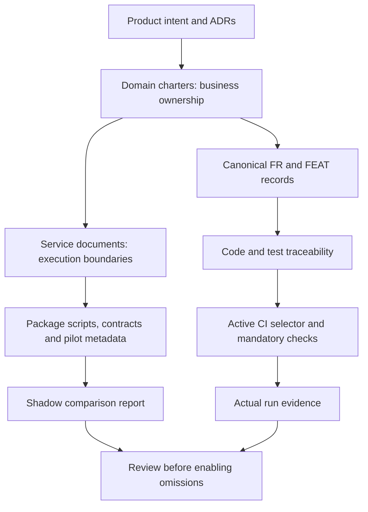

# Monorepo documentation and verification policy

The owner approved the monorepo documentation proposal on 2026-10-06. Domains
remain the business-ownership spine. Services describe process, contract,
installation, build and test boundaries. One service may host several domains;
an extracted process does not automatically own every model it uses.

## One editable authority per fact

| Fact | Source |
|---|---|
| Product intent | PRODUCT and applicable ADRs |
| Business rules and model ownership | Owning domain CHARTER and canonical requirement records |
| Feature membership | Canonical FEAT record; never inferred from directories |
| Design rationale | Domain feature note or ADR |
| Runtime boundary | `docs/services/<project>/SERVICE.md`, citing its extraction decision |
| Test rationale, engines and fixtures | The corresponding `TESTING.md` |
| Executable commands | Package scripts and runner configuration |
| Pilot selection inputs | Conversation Runtime's `verification.json` |
| Observed verification | Exact-revision receipts, distinct from generated test bindings |

Root docs remain canonical. Service READMEs link to them and provide quick-start
instructions. Existing generated feature design/verification views and compatibility
exports remain generated. Brand identity and character persona stay in the brand
kit; runtime skills/configuration do not derive permissions from that kit.

## Current scope and pilot

The existing `scripts/ci-change-scope.mjs` remains the active CI selector. Its
related-test import, annotation, scanner, deletion, fan-out and fallback guards
remain in force. Main pushes retain full Server tests/build. Governance E2E is
scheduled/manual; it is not an ordinary PR check. All three existing service jobs
continue to run on non-scheduled governance events.

The Conversation Runtime pilot is **shadow-only**. `verification:plan` reuses the
active selector and records a candidate plan for a diff confined to Runtime and
its two explicitly listed service documents. No job condition or required-gate
input consumes that candidate. The JSON report is evidence for comparing plans,
not an execution receipt or authority to skip a job.

The pilot requires an actual Runtime code/test change. Contract/schema changes
require wider consumer qualification and cannot enter the candidate.
Documentation-only changes,
deleted/renamed Runtime inputs, unknown paths, metadata/package/config changes,
unavailable references and non-PR events conservatively retain the current plan.
`docs/` and `.md` are not blanket exemptions: document-derived state has runtime
consumers. The narrow doc allowlist covers only SERVICE.md and TESTING.md beside
this pilot. It does not include requirements, charters, policy or generated state.

The candidate keeps global governance, the entire Runtime service job and all
Core tests discovered by the active service-reference contract selector plus
explicit Core-only semantic consumers in the Runtime metadata. It would
omit MI/SCM and Server build/full tests only for that bounded diff. Empty or missing
Core contract evidence invalidates the candidate. The scanner's current limitations
remain visible; this first pilot does not certify all HTTP consumer dependencies.

## Pilot metadata contract

`services/conversation-runtime/verification.json` is version 2 and contains only:

| Field | Contract |
|---|---|
| `schemaVersion` | Exact integer 2 |
| `id`, `root` | Exact `conversation-runtime`, `services/conversation-runtime` |
| `mode` | Exact `shadow`; enforcement is also hard-coded by the planner |
| `documents` | Exactly the SERVICE.md and TESTING.md paths for this service |
| `domainRefs` | Existing charter references for navigation, not ownership grants |
| `contract` | Existing `contracts/v1/operation.schema.json` path |
| `tasks` | `test` and `build` package-script names; shell bodies stay in package.json |
| `additionalCoreTests` | Nonempty, unique existing paths under `apps/server/tests/unit/` or `integration/`, ending in `.test.js` |

Unknown keys, wrong versions/roots/modes, invalid or escaped paths, missing files,
and missing package scripts fail validation. Paths are repository-relative with
forward slashes; references must resolve inside the checkout, including symlinks
and Windows junctions. Metadata is not an arbitrary command runner. Other services
keep their current conservative selector behavior until separately onboarded.

Additional test paths contain only letters, numbers, dots, slashes, underscores
and hyphens. Globs, whitespace, traversal, missing files and realpath escapes fail
validation. The shadow inventory is the sorted unique union of active discovery
and these declarations. Empty discovery still invalidates a candidate and cannot
be hidden by declarations. The v2 report records discovered/additional/selected
paths, selected-file SHA-256 hashes, `sourceRevision` (null for a direct API call
without revision evidence), and `completeness: known-bounded-set`.

Active service-only CI discovery remains unchanged. An explicit entry affects
shadow/qualification evidence only in Q1; it does not silently alter the active
selector or prove all HTTP consumers are known.

## Reproducible planning

The CLI accepts `--base <commit>` and optional `--head <commit>` with
`--event pull_request|push|schedule|workflow_dispatch|local`. Revision arguments
must resolve to commits and cannot be Git options. It diffs exact revisions using
`--no-renames`; local mode uses the merge base and also includes staged, unstaged
and untracked files. Deleted paths remain in the change set. Missing base/history
is an error, never an empty successful plan.

The report records resolved revisions, changed paths, a digest of changed file
contents/deletions, active selection, candidate selection, reasons and
`mode: shadow`, report schema version 2 and the consumer inventory. The local digest
is not a receipt proving the whole environment or
all dependency contents were tested. There is no test execution in this CLI.
CI reports use GitHub-provided base/head SHAs through environment variables, never
interpolate user titles or branch names into shell code. The report is always
printed as JSON; the caller controls the output file through ordinary redirection.

## Baseline and verification obligations

Choose a baseline matching the actual change before implementation. For this
approved documentation/verification-control-plane lane, run the existing selector
regression tests and required governance/reader checks in its isolated worktree.
There is no application behavior change requiring a blanket local application
suite solely because the worktree is new. An application, schema, fixture, shared
authority or runtime contract change still needs the appropriate wider baseline.
Never install through a shared node_modules junction or reuse a mutable test DB.

After implementing this pilot, run planner/metadata/CLI tests, existing selector
regressions, Runtime tests/build, relevant Core contract tests, generated-map
freshness and repository governance. Hosted CI retains its existing checks. Zero
tests, flaky retries, missing required jobs and cancelled jobs retain their current
failure semantics. A local scoped PASS does not mean all suites or hosted CI passed.

## Adoption gate

Before enabling omissions, compare the shadow plan with full/checking runs for:
Runtime-only, Runtime-plus-inert-doc, canonical-doc, contract, Core authority,
SCM generator source, shared config, renamed/deleted file, new service, unknown
path, missing base and empty/missing consumer cases. Check the provider and all
known consumers, including non-import edges; schema/reader changes expand scope.

SCM's Server-to-kernel generation and cross-domain transaction edges must be
registered before extending this pilot to SCM. Do not create HTTP writes or split
atomic transactions just to narrow tests. Keep independent package lockfiles and
the existing npm toolchain; no Nx migration, remote cache or new test-result cache
is included.

The aggregate gate must accept an omitted job only when a successful trusted plan
explicitly marks it unaffected. No activation switch exists in this increment.
Review the comparison evidence and update the governed policy and gate together
before introducing one. The main/release full safety net remains.

Measure elapsed feedback, summed job durations, queue/install/build/test time and
cold/warm runs separately. The reported older 60+ minute CI run remains unidentified;
this policy does not claim to diagnose it or deliver a measured speedup.

## Q1 manual qualification (approved 2026-10-07)

The owner approved explicit consumer inventory and a manual measurement workflow.
The [qualification record](../migrations/scoped-verification/QUALIFICATION.md)
defines commands, cases, evidence and rollout. It does not activate Q2 omissions.

The workflow runs only by `workflow_dispatch` on main with read-only contents and
Actions permissions. Its sole input is a positive integer `control_run_id` from
this repository. Checkout must match `github.sha` and be clean. The control must
be a successful governance main-push run at that exact commit/tree, with every
required prerequisite and all four full Server shards successful. Full test,
WorkToolPort PostgreSQL, Runtime image and drain steps must actually have passed.
Attempt-specific job pagination must be complete, and a changed attempt is rejected.

Before any API access, the receipt stores requested repository, governance workflow
and positive control run ID. Allowlisted run/job/step observations, request role,
HTTP status and pagination progress remain explicitly UNVALIDATED. A rejected or
changed attempt retains these observations, including both read identities. Network
errors use fixed failure codes; no token, header, environment dump or arbitrary
response body is retained. Observations are bounded to two runs, 102 requests,
100 pages, 200 jobs, 50 steps/job and 256 characters per text field, with truncation
flags for jobs/steps. Only after every check, including the checkout tree, succeeds
does receipt.control contain a validated result. Observations grant no authority.

The helper selects the validated Runtime consumer union independently of diff
eligibility. SQLite and PostgreSQL use existing guarded package commands and
disposable fixtures; every selected file must execute passing assertions. Missing,
zero-work, cancelled or failed evidence cannot produce a passing receipt. It
preserves each engine report, command exit, counts, durations, source/tree/file
hashes, control run/jobs and observed toolchain/cache facts. No result is cached.

The receipt explicitly retains `omissionsAllowed: false` and
`scopeAdoptionQualified: false`. A profile run on a main control-plane change is
not a Runtime-only adoption case. Timing is inconclusive when control cache or
actual Node facts are unavailable; the single profile duration is not end-to-end
CI speedup. Run once after the implementation's full main CI; retain failures and
perform RCA before rerunning. The job is bounded to 20 minutes and each test
subprocess to 10 minutes. Existing E2E triggers and merge gates remain unchanged.

On Windows, a Q1-specific [adapter](../../scripts/verification-process-win.ps1)
creates a Job Object with kill-on-close and no breakaway flags. It binds a blocked
Node bootstrap before sending the structured command/argv payload. The bootstrap
has a 10-second release deadline and exits when control input is lost. A native
containment failure stops before the guarded npm command can launch. The supervisor
reads cancellation on a worker task so the control read cannot block its timeout loop.

Normal wrapper exit, timeout, cancellation and spawn failure all enter cleanup.
The adapter terminates its job and queries active members for at most 3 seconds;
an unbound blocked bootstrap is stopped by its owned process handle. Never find
processes by executable name or terminate a recycled PID. Separate command and
cleanup durations, observed members, remaining active count and raw adapter
observations accompany stdout/stderr and the engine receipt. A secondary adapter
watchdog is 15 seconds beyond the command budget; missing completion evidence stays
UNVERIFIED even though job-handle closure requests termination.

Engine PASS requires command/report success, established containment and VERIFIED
cleanup with zero active members. A timeout/cancellation remains FAIL after successful
cleanup. Any unverified cleanup prevents the next engine from starting. These are
qualification-runner rules, not changes to the shared Server guard or test limits.

Rollback disables the manual workflow and reverts metadata/loader/report tests
together. Historical receipts retain their original revisions and outcomes.

## Navigation and version diff

- [Service documentation index](../services/README.md)
- [Generated service map](SERVICE-MAP.md)
- [Pilot implementation and verification record](../migrations/scoped-verification/PILOT.md)

0.0 → 0.1.0: adopts the approved service-documentation layer and bounded Runtime
shadow pilot. Existing CI selection and deployment/data authority remain active.

0.1.0 → 0.2.0: adopts owner-approved Q1 metadata/report v2, three explicit Core
consumers, contract fallback and manual profile qualification. No ordinary-job
omission authority is introduced.

0.2.0 → 0.3.0: adopts the approved Q1 helper repair: owned Windows lifecycle,
failed-control provenance and focused native regression coverage. Active selectors,
Core authority, engine budgets and adoption flags stay unchanged.
