# Database Schema — Full ERD Reference

> **119 models** — นับจาก `apps/server/prisma/schema.prisma` โดยตรง (`grep -c '^model '`)
> v2.x ครอบคลุม 52 model ที่ v1.0.0 (67 model, 2026-08-29) ยังไม่มี — ดู §9 (`ConversationAnalysis`, `SalesTask`) และ §14–§21 — และ §22 คือ
> สถานะของทุกหัวข้อใน ERD ของผลิตภัณฑ์เดิม (`Freshair129/zuri1.0`) ว่ายืม / เปลี่ยน label / เลื่อน / ปฏิเสธ
> **Source of truth:** `apps/server/prisma/schema.prisma` · Postgres cutover: `apps/server/prisma/schema.postgres.prisma`
> **Registry ย่อ:** [Appendix B](../../appendices/B-db-schema.md) · **Domain lanes:** [DOMAIN-MAP](../../DOMAIN-MAP.md)
> **อ่านใน Obsidian / GitHub:** Mermaid diagrams render อัตโนมัติ

**เอกสารนี้ไม่ใช่แหล่งความจริง** — `apps/server/prisma/schema.prisma` คือแหล่งความจริง เอกสารนี้คือ
มุมมองที่อ่านได้ของ schema นั้น ณ วันที่ใน frontmatter ถ้าสองที่ไม่ตรงกัน schema ถูกเสมอ

---

## 0. Master Relationship Diagram

Scope chain คือกระดูกสันหลัง: **Portfolio → Tenant → Business → Workspace → Project**
(BR-001) ทุก model ที่มี `tenantId` ผูกกับ chain นี้


```mermaid
erDiagram
    Portfolio ||--o{ Tenant : "owns"
    Portfolio ||--o{ LegalEntity : "registers"
    Portfolio ||--o{ WorkspaceMembership : "grants"

    Tenant ||--o{ Business : "isolates"
    Tenant ||--o{ Membership : "scopes"
    Tenant ||--o{ Customer : "serves"
    Tenant ||--o{ IntegrationConnection : "connects"
    Tenant ||--o{ PipelineRun : "executes"

    Business ||--o{ Branch : "operates"
    Business ||--o{ Project : "owns"
    Business ||--o{ Team : "staffs"
    Business ||--o{ BusinessRoadmap : "plans"
    Business ||--o{ BusinessGoal : "targets"
    Tenant ||--o{ MarketingPlan : "scopes"
    Business ||--o{ MarketingPlan : "owns"
    Business ||--o{ MarketingInitiative : "runs"
    Business ||--o{ MarketingContentBrief : "briefs"
    MarketingPlan ||--o{ MarketingPlanVersion : "revises"
    MarketingPlan ||--o{ MarketingReview : "reviewed by"
    MarketingPlan ||--o{ MarketingDecision : "decided by"
    MarketingPlan ||--o{ MarketingHandoff : "hands off"

    Workspace ||--o{ Project : "hosts"
    Project ||--o{ Workstream : "splits into"
    Project ||--o{ Milestone : "tracks"
    Project ||--o{ Gate : "gated by"

    Workstream ||--o{ WorkContainer : "groups"
    Workstream ||--o{ WorkItem : "contains"
    WorkContainer ||--o{ WorkItem : "holds"

    Person ||--o{ Membership : "authorized by"
    Person ||--o{ Session : "signs in"
    Person ||--o{ ChannelIdentity : "binds channel"
    Person ||--o{ Customer : "is principal of"
    Person ||--o{ TeamMembership : "belongs to"

    Customer ||--o{ Conversation : "chats in"
    Conversation ||--o{ Message : "contains"

    IntegrationConnection ||--o{ IngestionRun : "runs"
    IngestionRun ||--o{ RawExternalRecord : "captures"
    RawExternalRecord ||--o{ DeadLetterRecord : "fails into"
    RawExternalRecord ||--o{ MarketObservation : "translated into"

    PipelineRun ||--o{ PipelineStep : "staged as"
    PipelineStep ||--o{ PipelineRecordEvent : "records"

    Conversation ||--o{ ConversationAnalysis : "analysed as"
    Person ||--o{ PluginSession : "acts through plugin"
    Business ||--o{ EdgeDeviceCredential : "authorizes device"

    Business ||--o{ AssetIntake : "receives"
    AssetIntake ||--o| RegisteredAsset : "promotes to"
    RegisteredAsset ||--o{ AssetResponsibility : "accountable"
    RegisteredAsset ||--o{ AssetProjectAllocation : "booked by Project"
    AssetEvidence ||--o{ AssetExtractionJob : "extracted by device"

    Business ||--o{ LineOaAccount : "runs"
    IntegrationConnection ||--|| LineOaAccount : "LINE_OA connection"
    LineOaAccount ||--o{ LineOaRichMenu : "designs"
    LineOaAccount ||--o{ LineOaLiffApp : "registers"
    LineOaAccount ||--o{ LineConversationJob : "answers through"

    Business ||--o{ ProductMaster : "catalogues"
    ProductMaster ||--o{ Product : "SKU"
    Product ||--o{ StockMovement : "ledger"
    Product ||--o{ ProductRecipe : "BOM at batch size"

    Business ||--o{ SalesTask : "sales team owes"
    Customer ||--o{ SalesTask : "followed up by"
    Person ||--o{ SalesTask : "assigned"

    Business ||--o{ SalesOrder : "sold"
    Conversation ||--o{ SalesOrder : "CHAT origin"
    SalesOrder ||--o{ SalesOrderLine : "lines"
    Product ||--o{ SalesOrderLine : "SKU sold"
    SalesOrder ||--o{ Payment : "settled by"

    Business ||--o{ Supplier : "buys from"
    Supplier ||--o{ PurchaseOrder : "receives"
    PurchaseOrder ||--o{ PurchaseOrderLine : "lines"
    Product ||--o{ PurchaseOrderLine : "SKU bought"
    PurchaseOrder ||--o{ GoodsReceipt : "delivered by"
```

**สิ่งที่ diagram นี้ไม่ได้บอก:** `AuditEvent`, `Dependency` และ `ExternalRef` ไม่มี FK จริง
ไปหา entity ที่มันอ้าง — เก็บเป็น `(entityType, entityId)` แบบ polymorphic เพราะอ้างได้ทุกตาราง
ดูหมายเหตุในหัวข้อของแต่ละตัว

---

## 1. SCOPE CHAIN: Portfolio → Tenant → Business

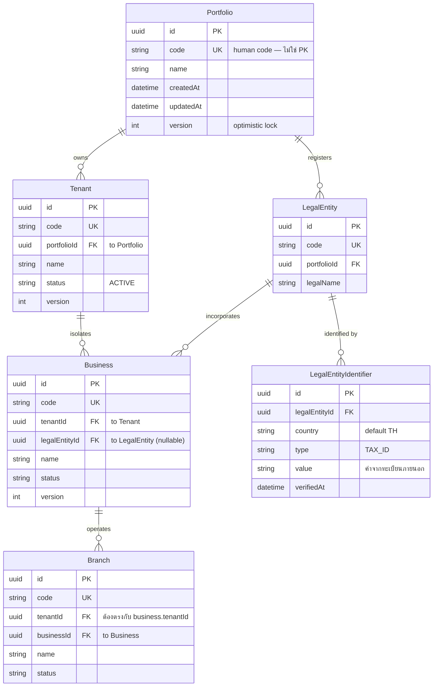
```mermaid
erDiagram
    Portfolio ||--o{ Tenant : "owns"
    Tenant ||--o{ Business : "isolates"
    Business ||--o{ Branch : "operates"
    Portfolio ||--o{ LegalEntity : "registers"
    LegalEntity ||--o{ LegalEntityIdentifier : "identified by"
    LegalEntity ||--o{ Business : "incorporates"

    Portfolio {
        uuid     id          PK
        string   code        UK  "human code — ไม่ใช่ PK"
        string   name
        datetime createdAt
        datetime updatedAt
        int      version         "optimistic lock"
    }

    Tenant {
        uuid     id          PK
        string   code        UK
        uuid     portfolioId FK  "to Portfolio"
        string   name
        string   status          "ACTIVE"
        int      version
    }

    Business {
        uuid     id            PK
        string   code          UK
        uuid     tenantId      FK  "to Tenant"
        uuid     legalEntityId FK  "to LegalEntity (nullable)"
        string   name
        string   status
        int      version
    }

    Branch {
        uuid     id         PK
        string   code       UK
        uuid     tenantId   FK  "ต้องตรงกับ business.tenantId"
        uuid     businessId FK  "to Business"
        string   name
        string   status
    }

    LegalEntity {
        uuid     id          PK
        string   code        UK
        uuid     portfolioId FK
        string   legalName
    }

    LegalEntityIdentifier {
        uuid     id            PK
        uuid     legalEntityId FK
        string   country           "default TH"
        string   type              "TAX_ID"
        string   value             "ค่าจากทะเบียนภายนอก"
        datetime verifiedAt
    }
```

| Field | หมายเหตุ |
|---|---|
| `id` | UUID เสมอ — external id ไม่เคยเป็น PK (**BR-002**) |
| `code` | human-readable key, `@unique` ทั้งระบบ ไม่ใช่ per-tenant |
| `Tenant.portfolioId` | Tenant คือขอบเขต isolation จริง; Portfolio คือเครือที่ครอบมัน |
| `Business.legalEntityId` | nullable — ธุรกิจปฏิบัติการมีก่อนนิติบุคคลได้ |
| `Branch.tenantId` | denormalized เพื่อ query แต่ต้องตรงกับ `business.tenantId` (มี test บังคับ) |
| `LegalEntityIdentifier` | `@@unique([country, type, value])` — เลขทะเบียนภายนอกเป็น *attribute* ไม่ใช่ PK |
| `version` | optimistic concurrency บน aggregate root ทุกตัว |

**Spec:** BR-001 (scope chain) · BR-002 (external ids ไม่เป็น PK) · SEC-001 (Business = หน่วยสิทธิ์)
**Gotcha:** ไม่มี principal ใดถือสิทธิ์เหนือระดับ Business ได้ — viewer contract มีแต่
Business-keyed grants (SDD-037)

---

## 2. IDENTITY: Person, Membership, Session

`Person` คือ principal เดียวของระบบ (ADR-003 §D10) — ไม่มี Employee/User แยก
`Membership` คือ **authority record** ตัวเดียวที่ `resolveViewer` อ่าน

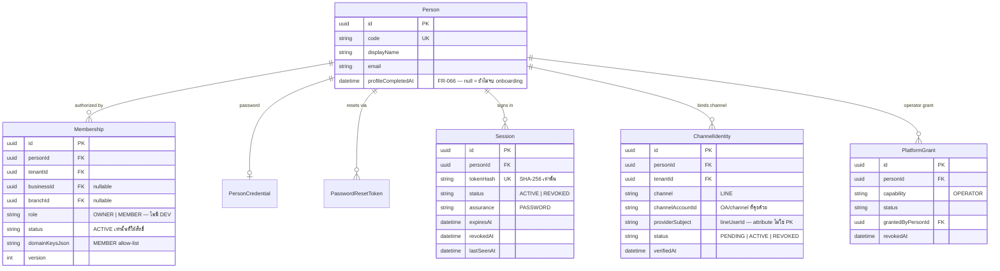
```mermaid
erDiagram
    Person ||--o{ Membership : "authorized by"
    Person ||--o| PersonCredential : "password"
    Person ||--o{ PasswordResetToken : "resets via"
    Person ||--o{ Session : "signs in"
    Person ||--o{ ChannelIdentity : "binds channel"
    Person ||--o{ PlatformGrant : "operator grant"

    Person {
        uuid     id                 PK
        string   code               UK
        string   displayName
        string   email
        datetime profileCompletedAt     "FR-066 — null = ยังไม่จบ onboarding"
    }

    Membership {
        uuid     id             PK
        uuid     personId       FK
        uuid     tenantId       FK
        uuid     businessId     FK  "nullable"
        uuid     branchId       FK  "nullable"
        string   role               "OWNER | MEMBER — ไม่มี DEV"
        string   status             "ACTIVE เท่านั้นที่ให้สิทธิ์"
        string   domainKeysJson     "MEMBER allow-list"
        int      version
    }

    Session {
        uuid     id           PK
        uuid     personId     FK
        string   tokenHash    UK  "SHA-256 เท่านั้น"
        string   status           "ACTIVE | REVOKED"
        string   assurance        "PASSWORD"
        datetime expiresAt
        datetime revokedAt
        datetime lastSeenAt
    }

    ChannelIdentity {
        uuid     id               PK
        uuid     personId         FK
        uuid     tenantId         FK
        string   channel              "LINE"
        string   channelAccountId     "OA/channel ที่คุยด้วย"
        string   providerSubject      "lineUserId — attribute ไม่ใช่ PK"
        string   status               "PENDING | ACTIVE | REVOKED"
        datetime verifiedAt
    }

    PlatformGrant {
        uuid     id                PK
        uuid     personId          FK
        string   capability            "OPERATOR"
        string   status
        uuid     grantedByPersonId FK
        datetime revokedAt
    }
```

| Field | หมายเหตุ |
|---|---|
| `Membership.status` | เฉพาะ `ACTIVE` เท่านั้นที่ให้ authority — แถวที่เพิกถอนแล้วยังอยู่เพื่อประวัติ (FR-038, FR-094) |
| `Membership.role` | `MEMBERSHIP_ROLES = ['OWNER', 'MEMBER']` เท่านั้น — **`DEV` ไม่ใช่ค่าในคอลัมน์นี้** มันเป็น role ระดับ *viewer* ที่ `resolveViewer` คืนเมื่อมี platform grant และตั้งใจให้ `ownedBusinessIds` ว่างเสมอ (FR-074) เก็บ `DEV` ลง Membership คือการเปลี่ยน visibility ให้กลายเป็น ownership |
| `Membership.domainKeysJson` | allow-list ของ MEMBER; OWNER/DEV ได้สิทธิ์จาก `role` ไม่ใช่จากลิสต์นี้ |
| `Session.tokenHash` | cookie ที่เซ็นแล้วเป็นแค่ transport — **แถวนี้คือ authority ที่เพิกถอนได้** (FR-095) |
| `Session` revocation | เพิกถอนแล้วมีผล request ถัดไป (วินัย NFR-019) |
| `ChannelIdentity` | `@@unique([tenantId, channel, channelAccountId, providerSubject])` — namespace ต่อ tenant ไม่ใช่ global |
| `PlatformGrant` | **ที่เดียว** ที่ทำให้ web session เป็น installation operator (FR-107/FR-075) — role, ownership, `isPlatform` ไม่ให้สิทธิ์นี้ |
| `PersonCredential` / `PasswordResetToken` | FR-090 — ตารางมีจริงบน Supabase แล้ว แต่ service ที่ใช้ยังอยู่บน branch `codex/postgres-primary-runtime` |

**Spec:** FR-094…FR-097, FR-107 · ADR-045 D1–D5 · SDD-052, SEC-018, BR-020
**Gotcha:** อย่ารวม grouping เข้ากับ authority ในแถวเดียว — การรวมแบบนั้นคือสิ่งที่ทำให้ POST
ที่ไม่ authenticate ออก owner authority ได้เมื่อ 2026-08-17 (ดู `TeamMembership` §5)

---

## 3. IDENTITY: Workspace collaboration & non-interactive keys


```mermaid
erDiagram
    Portfolio ||--o{ WorkspaceMembership : "grants"
    Portfolio ||--o{ WorkspaceInvite : "issues"
    Person ||--o{ WorkspaceMembership : "holds"
    Tenant ||--o{ SotDataPlaneKey : "authenticates"
    Tenant ||--o{ ApiAccessKey : "authenticates"

    WorkspaceMembership {
        uuid     id                PK
        uuid     portfolioId       FK  "Workspace = Portfolio (ADR-027 D2)"
        uuid     personId          FK
        string   role                  "OWNER | ADMIN | MEMBER"
        string   status                "ACTIVE | REMOVED"
        int      version
    }

    WorkspaceInvite {
        uuid     id                 PK
        uuid     portfolioId        FK
        uuid     invitedByPersonId  FK
        uuid     targetPersonId     FK  "nullable"
        string   invitedEmail           "nullable"
        string   role
        string   status                 "PENDING | ACCEPTED | REVOKED"
        string   tokenHash          UK  "SHA-256 เท่านั้น"
        datetime expiresAt
        datetime acceptedAt
    }

    SotDataPlaneKey {
        uuid     id         PK
        string   label
        uuid     tenantId   FK
        string   keyHash    UK  "SHA-256"
        string   keyPrefix      "ไว้แสดงในหน้าจอ"
        string   status
        datetime lastUsedAt
    }

    ApiAccessKey {
        uuid     id         PK
        string   label
        uuid     tenantId   FK
        string   keyHash    UK  "SHA-256"
        string   keyPrefix
        string   status
        datetime revokedAt
    }
```

| Field | หมายเหตุ |
|---|---|
| `WorkspaceMembership.portfolioId` | Workspace ที่ผู้ใช้เห็น **คือ** `Portfolio` — ไม่ใช่ model ชื่อ `Workspace` (นั่นคือ Space ใต้ Business) |
| authority layer | BR-016 — `resolveViewer` **ไม่เคยอ่าน** ตารางนี้ ถือ membership แล้วยังไม่เห็น Business ใด |
| `WorkspaceInvite.role` | `WORKSPACE_INVITE_ROLES` = roles ทั้งหมด **ลบ `OWNER` ออก** — คำเชิญ mint OWNER ไม่ได้ ความเป็นเจ้าของได้มาจากการสร้าง Workspace เท่านั้น |
| `WorkspaceInvite.tokenHash` | เก็บเฉพาะ digest (SEC-014); raw token คืนครั้งเดียวตอน mint |
| `EXPIRED` | ไม่ persist เป็น status — เทียบกับ `expiresAt` แบบ fail-closed ตอนรับคำเชิญ |
| `SotDataPlaneKey` / `ApiAccessKey` | bearer credential ผูก Tenant เดียว ไม่มี Person ไม่มี browser session (FR-102 / FR-106) |
| revocation | ไม่มี grace period — ต่างจาก `Session` เพราะ credential ที่ไม่มีคนใช้ ไม่มีใครสังเกตว่ารั่ว |

**Spec:** FR-067, FR-102, FR-106 · ADR-027 §D2/D5, ADR-047 · SEC-014, SEC-019, BR-016, SDD-038

---

## 4. IDENTITY: external identity mapping

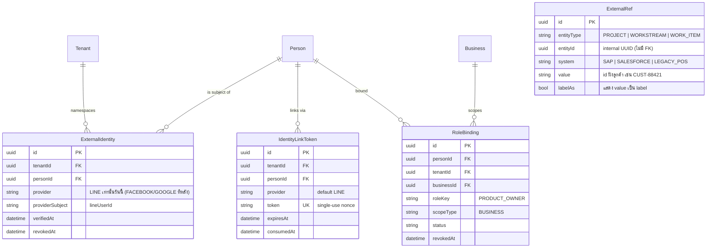
```mermaid
erDiagram
    Tenant ||--o{ ExternalIdentity : "namespaces"
    Person ||--o{ ExternalIdentity : "is subject of"
    Person ||--o{ IdentityLinkToken : "links via"
    Person ||--o{ RoleBinding : "bound"
    Business ||--o{ RoleBinding : "scopes"

    ExternalIdentity {
        uuid     id              PK
        uuid     tenantId        FK
        uuid     personId        FK
        string   provider            "LINE เท่านั้นวันนี้ (FACEBOOK/GOOGLE ทีหลัง)"
        string   providerSubject     "lineUserId"
        datetime verifiedAt
        datetime revokedAt
    }

    IdentityLinkToken {
        uuid     id         PK
        uuid     tenantId   FK
        uuid     personId   FK
        string   provider       "default LINE"
        string   token      UK  "single-use nonce"
        datetime expiresAt
        datetime consumedAt
    }

    ExternalRef {
        uuid     id         PK
        string   entityType     "PROJECT | WORKSTREAM | WORK_ITEM"
        uuid     entityId       "internal UUID (ไม่มี FK)"
        string   system         "SAP | SALESFORCE | LEGACY_POS"
        string   value          "id ฝั่งลูกค้า เช่น CUST-88421"
        bool     labelAs        "แสดง value เป็น label"
    }

    RoleBinding {
        uuid     id         PK
        uuid     personId   FK
        uuid     tenantId   FK
        uuid     businessId FK
        string   roleKey        "PRODUCT_OWNER"
        string   scopeType      "BUSINESS"
        string   status
        datetime revokedAt
    }
```

| Field | หมายเหตุ |
|---|---|
| `ExternalIdentity` | `@@unique([tenantId, provider, providerSubject])` — LINE userId เดียวกันอยู่คนละ tenant ได้ |
| `IdentityLinkToken` | ผูก channel subject เข้ากับ Person ที่**มีอยู่แล้ว** แทนการสร้าง Person ใหม่ (FR-022) |
| `ExternalRef` | polymorphic โดยตั้งใจ — `(entityType, entityId)` ไม่มี FK เพราะอ้างได้หลายตาราง (FR-019) |
| `ExternalRef.@@unique` | `[system, value]` — id ฝั่งลูกค้าไม่ชนกันในระบบเดียวกัน |
| `RoleBinding` | RBAC ระดับ Business แบบ generic; `PRODUCT_OWNER` คือ role ปัจจุบันของ Product (FR-076) |

**Spec:** FR-019, FR-021, FR-022, FR-076 · BR-002

---

## 5. PROJECT MANAGER: Workspace, Project, Team

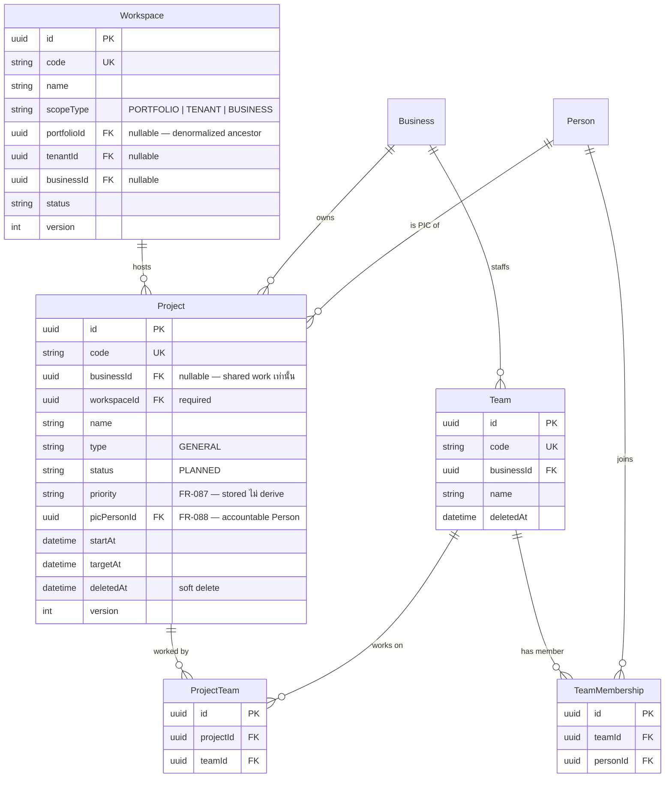
```mermaid
erDiagram
    Workspace ||--o{ Project : "hosts"
    Business  ||--o{ Project : "owns"
    Business  ||--o{ Team : "staffs"
    Person    ||--o{ Project : "is PIC of"
    Team      ||--o{ TeamMembership : "has member"
    Person    ||--o{ TeamMembership : "joins"
    Project   ||--o{ ProjectTeam : "worked by"
    Team      ||--o{ ProjectTeam : "works on"

    Workspace {
        uuid     id          PK
        string   code        UK
        string   name
        string   scopeType       "PORTFOLIO | TENANT | BUSINESS"
        uuid     portfolioId FK  "nullable — denormalized ancestor"
        uuid     tenantId    FK  "nullable"
        uuid     businessId  FK  "nullable"
        string   status
        int      version
    }

    Project {
        uuid     id          PK
        string   code        UK
        uuid     businessId  FK  "nullable — shared work เท่านั้น"
        uuid     workspaceId FK  "required"
        string   name
        string   type            "GENERAL"
        string   status          "PLANNED"
        string   priority        "FR-087 — stored ไม่ derive"
        uuid     picPersonId FK  "FR-088 — accountable Person"
        datetime startAt
        datetime targetAt
        datetime deletedAt      "soft delete"
        int      version
    }

    Team {
        uuid     id         PK
        string   code       UK
        uuid     businessId FK
        string   name
        datetime deletedAt
    }

    TeamMembership {
        uuid     id       PK
        uuid     teamId   FK
        uuid     personId FK
    }

    ProjectTeam {
        uuid     id        PK
        uuid     projectId FK
        uuid     teamId    FK
    }
```

| Field | หมายเหตุ |
|---|---|
| `Workspace.scopeType` | ต้องมี scope ชัดเจน + denormalized ancestor id ตาม scope นั้น |
| `Workspace` ≠ Workspace ที่ผู้ใช้เห็น | model นี้คือ **Development Space** ใต้ Business; Workspace ในหน้าจอคือ `Portfolio` (§3) |
| `Project.businessId` | nullable — null คือ "shared work ที่ไม่มีเจ้าของ" อย่างชัดแจ้ง ไม่ใช่ค่าที่ลืมใส่ |
| `Project.priority` | เก็บจริง ไม่คำนวณ — เรียงตาม `targetAt` คือ deadline list ซึ่งเป็นคำตอบผิดใต้หัวข้อ "Priority" (ADR-036 D3) |
| `Project.picPersonId` | คนเดียวที่รับผิดชอบ; `onDelete` ปล่อย default — คนลาออกต้องไม่พา Project หายไปด้วย |
| `TeamMembership` | **ไม่มีคอลัมน์ `role` โดยตั้งใจ** — role บน Team คือ authority บน Team (ADR-037 D3) |
| `Team` grants nothing | BR-018 — `resolveViewer` ไม่อ่าน Team/TeamMembership เลย |
| `ProjectTeam` | m2m จริง — Project หนึ่งมีหลาย Team และ Team หนึ่งทำหลาย Project |

**Spec:** FR-043, FR-087, FR-088, FR-089 · ADR-014, ADR-036, ADR-037 · SDD-021, BR-001, BR-018

---

## 6. PROJECT MANAGER: Strategy (Roadmap → Goal → Project)

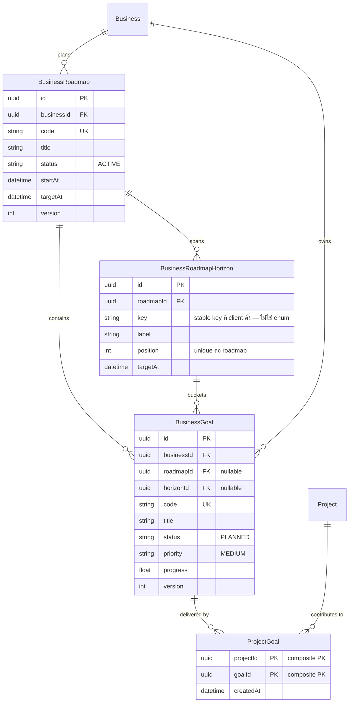
```mermaid
erDiagram
    Business ||--o{ BusinessRoadmap : "plans"
    BusinessRoadmap ||--o{ BusinessRoadmapHorizon : "spans"
    BusinessRoadmap ||--o{ BusinessGoal : "contains"
    BusinessRoadmapHorizon ||--o{ BusinessGoal : "buckets"
    Business ||--o{ BusinessGoal : "owns"
    BusinessGoal ||--o{ ProjectGoal : "delivered by"
    Project ||--o{ ProjectGoal : "contributes to"

    BusinessRoadmap {
        uuid     id         PK
        uuid     businessId FK
        string   code       UK
        string   title
        string   status         "ACTIVE"
        datetime startAt
        datetime targetAt
        int      version
    }

    BusinessRoadmapHorizon {
        uuid     id        PK
        uuid     roadmapId FK
        string   key           "stable key ที่ client ตั้ง — ไม่ใช่ enum"
        string   label
        int      position      "unique ต่อ roadmap"
        datetime targetAt
    }

    BusinessGoal {
        uuid     id         PK
        uuid     businessId FK
        uuid     roadmapId  FK  "nullable"
        uuid     horizonId  FK  "nullable"
        string   code       UK
        string   title
        string   status         "PLANNED"
        string   priority       "MEDIUM"
        float    progress
        int      version
    }

    ProjectGoal {
        uuid     projectId PK  "composite PK"
        uuid     goalId    PK  "composite PK"
        datetime createdAt
    }
```

| Field | หมายเหตุ |
|---|---|
| `BusinessRoadmapHorizon.key` | ไม่ใช่ enum — เป็น stable key ที่ client ตั้ง service บังคับแค่ไม่ซ้ำ และใช้ key นี้ reconcile แทน delete-then-recreate (แถวเดิมจึงไม่หายพร้อม goal ที่ผูกอยู่) |
| `BusinessRoadmapHorizon` | `@@unique([roadmapId, key])` + `@@unique([roadmapId, position])` — service อนุญาต 2 หรือ 3 horizon |
| `BusinessGoal.roadmapId` / `horizonId` | nullable — goal มีได้ก่อนถูกจัดลง roadmap |
| `ProjectGoal` | `@@id([projectId, goalId])` — join table แท้ ไม่มี id ของตัวเอง |
| `BusinessGoal.progress` | float; ค่าที่แสดงบนหน้าจอคำนวณใหม่เสมอ ไม่เชื่อค่านี้แบบ blind |

**Spec:** FR-041 · แสดงผลที่ Strategy Overview

---

## 7. PROJECT MANAGER: Execution (7 modes)

`Workstream` คือหัวใจของ execution mode ทั้ง 7 โหมด — `WorkContainer`/`WorkItem`
เป็นโครงเดียวกันทุกโหมด ต่างกันที่ `subtype` และ `progressStrategy`

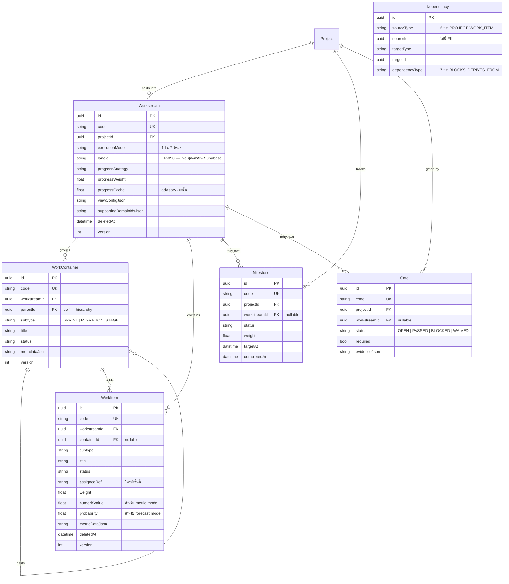
```mermaid
erDiagram
    Project ||--o{ Workstream : "splits into"
    Workstream ||--o{ WorkContainer : "groups"
    Workstream ||--o{ WorkItem : "contains"
    WorkContainer ||--o{ WorkContainer : "nests"
    WorkContainer ||--o{ WorkItem : "holds"
    Project ||--o{ Milestone : "tracks"
    Project ||--o{ Gate : "gated by"
    Workstream ||--o{ Milestone : "may own"
    Workstream ||--o{ Gate : "may own"

    Workstream {
        uuid     id                      PK
        string   code                    UK
        uuid     projectId               FK
        string   executionMode               "1 ใน 7 โหมด"
        string   laneId                      "FR-090 — live ทุกแถวบน Supabase"
        string   progressStrategy
        float    progressWeight
        float    progressCache               "advisory เท่านั้น"
        string   viewConfigJson
        string   supportingDomainIdsJson
        datetime deletedAt
        int      version
    }

    WorkContainer {
        uuid     id           PK
        string   code         UK
        uuid     workstreamId FK
        uuid     parentId     FK  "self — hierarchy"
        string   subtype          "SPRINT | MIGRATION_STAGE | ..."
        string   title
        string   status
        string   metadataJson
        int      version
    }

    WorkItem {
        uuid     id             PK
        string   code           UK
        uuid     workstreamId   FK
        uuid     containerId    FK  "nullable"
        string   subtype
        string   title
        string   status
        string   assigneeRef        "ใครทำชิ้นนี้"
        float    weight
        float    numericValue       "สำหรับ metric mode"
        float    probability        "สำหรับ forecast mode"
        string   metricDataJson
        datetime deletedAt
        int      version
    }

    Milestone {
        uuid     id           PK
        string   code         UK
        uuid     projectId    FK
        uuid     workstreamId FK  "nullable"
        string   status
        float    weight
        datetime targetAt
        datetime completedAt
    }

    Gate {
        uuid     id           PK
        string   code         UK
        uuid     projectId    FK
        uuid     workstreamId FK  "nullable"
        string   status           "OPEN | PASSED | BLOCKED | WAIVED"
        bool     required
        string   evidenceJson
    }

    Dependency {
        uuid     id             PK
        string   sourceType         "6 ค่า: PROJECT..WORK_ITEM"
        uuid     sourceId           "ไม่มี FK"
        string   targetType
        uuid     targetId
        string   dependencyType     "7 ค่า: BLOCKS..DERIVES_FROM"
    }
```

| Field | หมายเหตุ |
|---|---|
| `progressCache` | **advisory เท่านั้น** — progress คำนวณใหม่จาก pure calculator ใน `progress/` ทุกครั้ง อย่ารายงานตัวเลขที่หน้าจอจะไม่เห็นด้วย |
| `Gate.required` | gate ที่ยังไม่ผ่าน **cap** progress ไว้ (BR-006) ไม่ใช่แค่ป้ายเตือน |
| `WorkItem.assigneeRef` | คนทำชิ้นงานหนึ่ง — คนละเรื่องกับ `Project.picPersonId` (คนรับผิดชอบทั้ง Project) และ Team (ใคร*อาจ*ทำได้) |
| `Dependency` | `@@unique([sourceType, sourceId, targetType, targetId, dependencyType])`; cycle ถูกตรวจที่ service ไม่ใช่ที่ DB |
| `WorkContainer.parentId` | self-relation `ContainerHierarchy` — ลึกได้หลายชั้น |
| `deletedAt` | soft delete บน Workstream/WorkItem/Project — query ต้องกรองเอง |

**Spec:** BR-006 (gate caps progress) · SDD-002 · progress calculators อยู่ที่ `apps/server/src/modules/project-manager/progress/`

---

## 8. PROJECT MANAGER: Files, repositories, import & audit

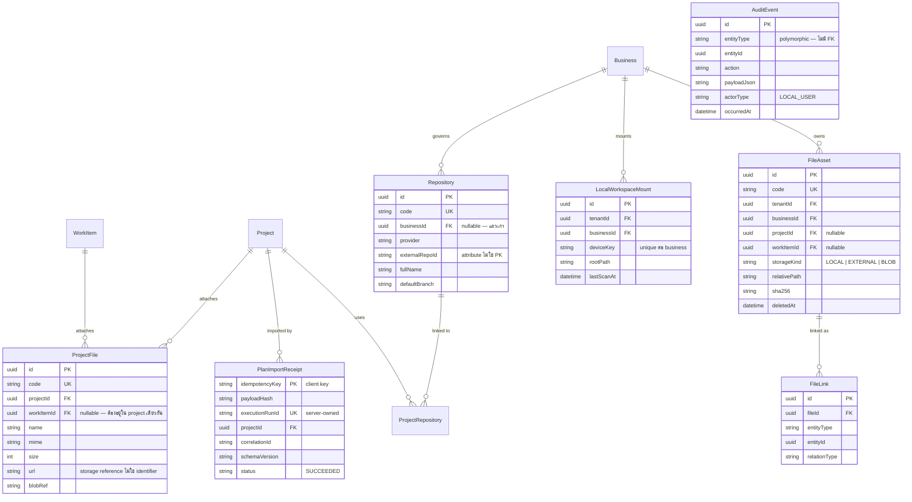
```mermaid
erDiagram
    Project ||--o{ ProjectFile : "attaches"
    WorkItem ||--o{ ProjectFile : "attaches"
    Business ||--o{ FileAsset : "owns"
    FileAsset ||--o{ FileLink : "linked as"
    Business ||--o{ LocalWorkspaceMount : "mounts"
    Business ||--o{ Repository : "governs"
    Repository ||--o{ ProjectRepository : "linked to"
    Project ||--o{ ProjectRepository : "uses"
    Project ||--o{ PlanImportReceipt : "imported by"

    ProjectFile {
        uuid     id         PK
        string   code       UK
        uuid     projectId  FK
        uuid     workItemId FK  "nullable — ต้องอยู่ใน project เดียวกัน"
        string   name
        string   mime
        int      size
        string   url            "storage reference ไม่ใช่ identifier"
        string   blobRef
    }

    FileAsset {
        uuid     id           PK
        string   code         UK
        uuid     tenantId     FK
        uuid     businessId   FK
        uuid     projectId    FK  "nullable"
        uuid     workItemId   FK  "nullable"
        string   storageKind      "LOCAL | EXTERNAL | BLOB"
        string   relativePath
        string   sha256
        datetime deletedAt
    }

    FileLink {
        uuid     id           PK
        uuid     fileId       FK
        string   entityType
        uuid     entityId
        string   relationType
    }

    LocalWorkspaceMount {
        uuid     id         PK
        uuid     tenantId   FK
        uuid     businessId FK
        string   deviceKey      "unique ต่อ business"
        string   rootPath
        datetime lastScanAt
    }

    Repository {
        uuid     id             PK
        string   code           UK
        uuid     businessId     FK  "nullable — แถวเก่า"
        string   provider
        string   externalRepoId     "attribute ไม่ใช่ PK"
        string   fullName
        string   defaultBranch
    }

    PlanImportReceipt {
        string   idempotencyKey PK  "client key"
        string   payloadHash
        string   executionRunId UK  "server-owned"
        uuid     projectId      FK
        string   correlationId
        string   schemaVersion
        string   status             "SUCCEEDED"
    }

    AuditEvent {
        uuid     id          PK
        string   entityType      "polymorphic — ไม่มี FK"
        uuid     entityId
        string   action
        string   payloadJson
        string   actorType       "LOCAL_USER"
        datetime occurredAt
    }
```

| Field | หมายเหตุ |
|---|---|
| `ProjectFile` | metadata/reference เท่านั้น — ไบต์จริงอยู่นอก MVP offline (FR-037) |
| `FileAsset.sha256` | identity ที่พกพาได้ของไฟล์ local ที่ระบบดูแล (FR-045) |
| `Repository.businessId` | nullable เพราะเป็นคอลัมน์ที่เพิ่มทีหลัง — repo ที่ไม่มี Business **ถูกปฏิเสธทุก principal** (FR-073) มี backfill script อยู่ที่ `scripts/backfill-repository-business.mjs` |
| ทำไมต้อง Business ไม่ใช่ Tenant | viewer contract มีแต่ Business-keyed grants — Repository ระดับ Tenant จะกลายเป็นของที่ไม่มีใครปกครองได้ (SDD-037) |
| `PlanImportReceipt` | ผูก client idempotency key เข้ากับ payload ที่ normalize แล้วและ execution run — **ไม่ใช่ Plan model ที่สอง** และไม่รับ execution id ที่ client สร้าง (FR-069, FR-070) |
| `AuditEvent` | ทุก write ผ่าน service ใน `application/` และต้องบันทึกลงที่นี่ — route handler บางเสมอ |

**Spec:** FR-037, FR-045, FR-069, FR-070, FR-073 · ADR-016, SDD-023

---

## 9. CRM: Customer & Conversation

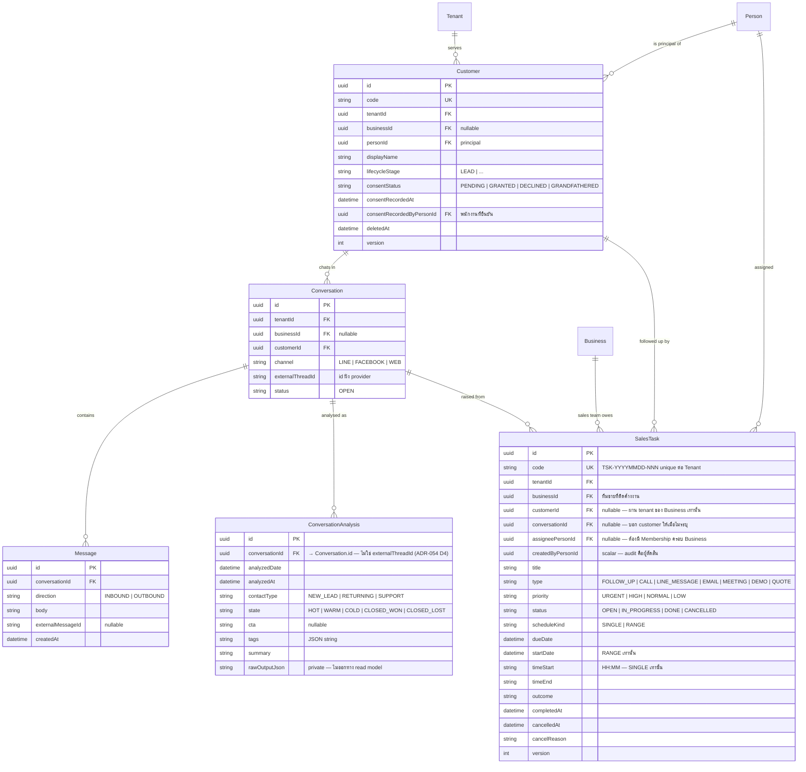
```mermaid
erDiagram
    Tenant ||--o{ Customer : "serves"
    Person ||--o{ Customer : "is principal of"
    Customer ||--o{ Conversation : "chats in"
    Conversation ||--o{ Message : "contains"
    Conversation ||--o{ ConversationAnalysis : "analysed as"
    Business ||--o{ SalesTask : "sales team owes"
    Customer ||--o{ SalesTask : "followed up by"
    Conversation ||--o{ SalesTask : "raised from"
    Person ||--o{ SalesTask : "assigned"

    SalesTask {
        uuid     id                  PK
        string   code                UK  "TSK-YYYYMMDD-NNN unique ต่อ Tenant"
        uuid     tenantId            FK
        uuid     businessId          FK  "ทีมขายที่ติดค้างงาน"
        uuid     customerId          FK  "nullable — ผ่าน tenant ของ Business เท่านั้น"
        uuid     conversationId      FK  "nullable — บอก customer ให้เมื่อไม่ระบุ"
        uuid     assigneePersonId    FK  "nullable — ต้องมี Membership ครอบ Business"
        uuid     createdByPersonId       "scalar — audit คือผู้ตัดสิน"
        string   title
        string   type                    "FOLLOW_UP | CALL | LINE_MESSAGE | EMAIL | MEETING | DEMO | QUOTE"
        string   priority                "URGENT | HIGH | NORMAL | LOW"
        string   status                  "OPEN | IN_PROGRESS | DONE | CANCELLED"
        string   scheduleKind            "SINGLE | RANGE"
        datetime dueDate
        datetime startDate              "RANGE เท่านั้น"
        string   timeStart               "HH:MM — SINGLE เท่านั้น"
        string   timeEnd
        string   outcome
        datetime completedAt
        datetime cancelledAt
        string   cancelReason
        int      version
    }

    ConversationAnalysis {
        uuid     id             PK
        uuid     conversationId FK  "→ Conversation.id — ไม่ใช่ externalThreadId (ADR-054 D4)"
        datetime analyzedDate
        datetime analyzedAt
        string   contactType        "NEW_LEAD | RETURNING | SUPPORT"
        string   state              "HOT | WARM | COLD | CLOSED_WON | CLOSED_LOST"
        string   cta                "nullable"
        string   tags               "JSON string"
        string   summary
        string   rawOutputJson      "private — ไม่ออกทาง read model"
    }

    Customer {
        uuid     id                        PK
        string   code                      UK
        uuid     tenantId                  FK
        uuid     businessId                FK  "nullable"
        uuid     personId                  FK  "principal"
        string   displayName
        string   lifecycleStage                "LEAD | ..."
        string   consentStatus                 "PENDING | GRANTED | DECLINED | GRANDFATHERED"
        datetime consentRecordedAt
        uuid     consentRecordedByPersonId FK  "พนักงานที่ยืนยัน"
        datetime deletedAt
        int      version
    }

    Conversation {
        uuid     id               PK
        uuid     tenantId         FK
        uuid     businessId       FK  "nullable"
        uuid     customerId       FK
        string   channel              "LINE | FACEBOOK | WEB"
        string   externalThreadId     "id ฝั่ง provider"
        string   status               "OPEN"
    }

    Message {
        uuid     id                PK
        uuid     conversationId    FK
        string   direction             "INBOUND | OUTBOUND"
        string   body
        string   externalMessageId     "nullable"
        datetime createdAt
    }
```

| Field | หมายเหตุ |
|---|---|
| `Customer.@@unique` | `[tenantId, personId]` — ธุรกิจใน tenant เดียวกัน **ใช้ customer ร่วมกัน** (การตัดสินใจ CRM-sharing, FR-023) |
| `Customer.consentStatus` | PDPA (SEC-005, FR-103) อยู่บนแถว Customer ตรง ๆ ไม่แยกตารางต่อ Business เพราะแถวนี้เป็นหน่วย sharing อยู่แล้ว |
| `GRANDFATHERED` | ค่า backfill ครั้งเดียวสำหรับแถวที่มีก่อนคอลัมน์นี้ — service ไม่เคยเขียนค่านี้ |
| `Conversation.@@unique` | `[tenantId, channel, externalThreadId]` — **ไม่ใช่ global unique**: global จะทำให้ thread id ของ tenant หนึ่งไปชี้ conversation ของอีก tenant (BR-002, SEC-001) |
| `Message.@@unique` | `[conversationId, externalMessageId]` — ไม่ denormalize `tenantId` ลงมา เพราะสำเนาความจริงชุดที่สองย่อม drift ได้; conversation ถูก scope ไว้แล้ว |
| ใครสร้างแถว | `line-ingest-service` เท่านั้น — agent domain **consume** conversation ไม่ได้สร้างเอง |
| `Conversation.channelAccountId` (FR-148) | identity ของ conversation รวม **บัญชีที่รับ** — unique `[tenantId, channel, channelAccountId, externalThreadId]`; แถวก่อน ADR-061 เป็น `LEGACY:LINE` โดยไม่เดา attribution |
| `ConversationAnalysis` (FR-127) | รูปที่ยืมจาก legacy DSB (ADR-054 D2) — ผูก `Conversation.id` ไม่ใช่ thread id ภายนอก (D4), **derived และคำนวณใหม่ได้** (D6): ลบทิ้งปลอดภัยเสมอ, PDPA erasure ของ Customer พาแถวนี้ไปด้วย; ไม่มี `sourceAdId` จนกว่าจะมี Ad model |
| `SalesTask` (FR-161, ADR-064) | "7. CORE: Tasks" ของ legacy ดัดแปลงเป็น task ของ **sale** — ไม่ใช่ `WorkItem` ของ project-manager: ไม่มี milestone / progress / ลูก; URGENT เป็น priority; Notion id ไม่เป็นคอลัมน์ (→ `ExternalRef`); overdue / วันนี้ **คำนวณตอนอ่าน** ตามปฏิทิน Business (Asia/Bangkok) ไม่เก็บ; อ่านต้องมี `customer` domain (404), เขียนต้อง OWNER หรือ `SALES_REP` (403) |

**Spec:** FR-023, FR-103, FR-127, FR-148, FR-161 · SEC-005, BR-002, SEC-001 · ADR-054, ADR-061, ADR-064

---

## 10. CRM: Customer import & human review

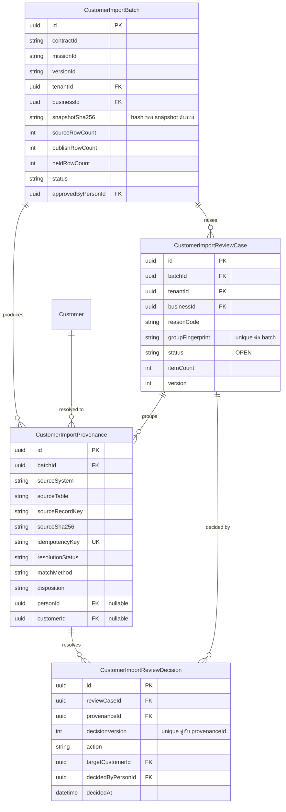
```mermaid
erDiagram
    CustomerImportBatch ||--o{ CustomerImportProvenance : "produces"
    CustomerImportBatch ||--o{ CustomerImportReviewCase : "raises"
    CustomerImportReviewCase ||--o{ CustomerImportProvenance : "groups"
    CustomerImportReviewCase ||--o{ CustomerImportReviewDecision : "decided by"
    CustomerImportProvenance ||--o{ CustomerImportReviewDecision : "resolves"
    Customer ||--o{ CustomerImportProvenance : "resolved to"

    CustomerImportBatch {
        uuid     id                 PK
        string   contractId
        string   missionId
        string   versionId
        uuid     tenantId           FK
        uuid     businessId         FK
        string   snapshotSha256         "hash ของ snapshot ต้นทาง"
        int      sourceRowCount
        int      publishRowCount
        int      heldRowCount
        string   status
        uuid     approvedByPersonId FK
    }

    CustomerImportProvenance {
        uuid     id               PK
        uuid     batchId          FK
        string   sourceSystem
        string   sourceTable
        string   sourceRecordKey
        string   sourceSha256
        string   idempotencyKey   UK
        string   resolutionStatus
        string   matchMethod
        string   disposition
        uuid     personId         FK  "nullable"
        uuid     customerId       FK  "nullable"
    }

    CustomerImportReviewCase {
        uuid     id                  PK
        uuid     batchId             FK
        uuid     tenantId            FK
        uuid     businessId          FK
        string   reasonCode
        string   groupFingerprint        "unique ต่อ batch"
        string   status                  "OPEN"
        int      itemCount
        int      version
    }

    CustomerImportReviewDecision {
        uuid     id                PK
        uuid     reviewCaseId      FK
        uuid     provenanceId      FK
        int      decisionVersion       "unique คู่กับ provenanceId"
        string   action
        uuid     targetCustomerId  FK
        uuid     decidedByPersonId FK
        datetime decidedAt
    }
```

| Field | หมายเหตุ |
|---|---|
| `CustomerImportBatch.@@unique` | `[contractId, missionId, versionId, snapshotSha256]` — import ซ้ำจาก snapshot เดิมไม่สร้าง batch ใหม่ |
| `CustomerImportProvenance.@@unique` | `[sourceSystem, sourceTable, sourceRecordKey, snapshotSha256]` + `idempotencyKey` unique — replay ปลอดภัย |
| `disposition` / `resolutionStatus` | แถวหนึ่งบอกได้ว่า "มาจากไหน แมตช์ด้วยวิธีใด ลงเอยยังไง" ครบในตัวเอง |
| `decisionVersion` | `@@unique([provenanceId, decisionVersion])` — เปลี่ยนใจได้ แต่ทุกครั้งเป็นแถวใหม่ ไม่ทับของเดิม |
| หลักการ | ทุก intake surface ลงมาที่ envelope เดียว → validate → semantic check → dry run → preview → transaction เดียว → audit (BR-009, SDD-009) |

**Spec:** BR-009, SDD-009 · surface: `/platform/customer-import-reviews`

---

## 11. INTEGRATION: providers, connections, ingestion

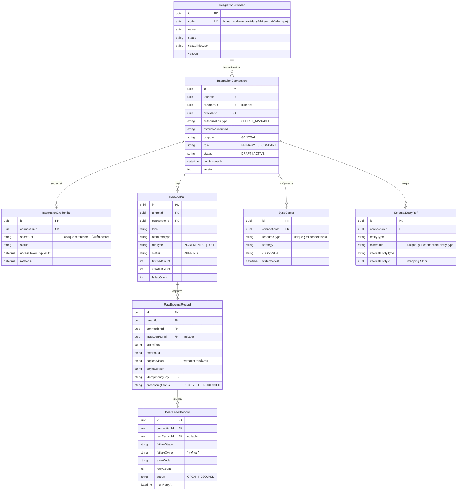
```mermaid
erDiagram
    IntegrationProvider ||--o{ IntegrationConnection : "instantiated as"
    IntegrationConnection ||--o| IntegrationCredential : "secret ref"
    IntegrationConnection ||--o{ IngestionRun : "runs"
    IntegrationConnection ||--o{ SyncCursor : "watermarks"
    IntegrationConnection ||--o{ ExternalEntityRef : "maps"
    IngestionRun ||--o{ RawExternalRecord : "captures"
    RawExternalRecord ||--o{ DeadLetterRecord : "fails into"

    IntegrationProvider {
        uuid     id               PK
        string   code             UK  "human code ต่อ provider (ยังไม่ seed ค่าใดใน repo)"
        string   name
        string   status
        string   capabilitiesJson
        int      version
    }

    IntegrationConnection {
        uuid     id                PK
        uuid     tenantId          FK
        uuid     businessId        FK  "nullable"
        uuid     providerId        FK
        string   authorizationType     "SECRET_MANAGER"
        string   externalAccountId
        string   purpose               "GENERAL"
        string   role                  "PRIMARY | SECONDARY"
        string   status                "DRAFT | ACTIVE"
        datetime lastSuccessAt
        int      version
    }

    IntegrationCredential {
        uuid     id                    PK
        uuid     connectionId          UK
        string   secretRef                 "opaque reference — ไม่เก็บ secret"
        string   status
        datetime accessTokenExpiresAt
        datetime rotatedAt
    }

    IngestionRun {
        uuid     id             PK
        uuid     tenantId       FK
        uuid     connectionId   FK
        string   lane
        string   resourceType
        string   runType            "INCREMENTAL | FULL"
        string   status             "RUNNING | ..."
        int      fetchedCount
        int      createdCount
        int      failedCount
    }

    RawExternalRecord {
        uuid     id               PK
        uuid     tenantId         FK
        uuid     connectionId     FK
        uuid     ingestionRunId   FK  "nullable"
        string   entityType
        string   externalId
        string   payloadJson          "verbatim จากต้นทาง"
        string   payloadHash
        string   idempotencyKey   UK
        string   processingStatus     "RECEIVED | PROCESSED"
    }

    SyncCursor {
        uuid     id           PK
        uuid     connectionId FK
        string   resourceType     "unique คู่กับ connectionId"
        string   strategy
        string   cursorValue
        datetime watermarkAt
    }

    ExternalEntityRef {
        uuid     id                 PK
        uuid     connectionId       FK
        string   entityType
        string   externalId             "unique คู่กับ connection+entityType"
        string   internalEntityType
        uuid     internalEntityId       "mapping ภายใน"
    }

    DeadLetterRecord {
        uuid     id           PK
        uuid     connectionId FK
        uuid     rawRecordId  FK  "nullable"
        string   failureStage
        string   failureOwner     "ใครต้องแก้"
        string   errorCode
        int      retryCount
        string   status           "OPEN | RESOLVED"
        datetime nextRetryAt
    }
```

| Field | หมายเหตุ |
|---|---|
| `IntegrationCredential.secretRef` | เก็บ **reference** ไปยัง secret manager เท่านั้น ไม่เคยเก็บ secret ในตาราง (SEC-015) |
| `IntegrationConnection.@@unique` | `[tenantId, providerId, externalAccountId]` — บัญชีเดียวกันเชื่อมซ้ำใน tenant เดียวไม่ได้ |
| active-primary invariant | partial unique index ฝั่ง production เป็น Postgres DDL เพิ่มเติม ไม่ได้อยู่ใน Prisma schema |
| `RawExternalRecord.payloadJson` | payload ดิบแบบ verbatim = หลักฐานที่ replay ได้ (FR-081) ไม่แก้ ไม่ normalize |
| `DeadLetterRecord.failureOwner` | ความล้มเหลวที่มี**เจ้าของชื่อจริง** — ไม่ใช่ log ที่ไม่มีใครรับผิดชอบ |
| `ExternalEntityRef` | external → internal mapping; external id ไม่เคยเป็น PK (BR-002) |

**Spec:** FR-079, FR-080, FR-081 · ADR-031 §D2/D3 · SDD-043, SEC-015

---

## 12. SoT PIPELINE: execution ledger & human decisions

`PipelineRun` คือบัญชีเดินสะพัดของ data pipeline ทั้งเส้น — server เป็นเจ้าของ execution id
ทุกตัว ไม่รับ id ที่ client ส่งมา


```mermaid
erDiagram
    Tenant ||--o{ PipelineRun : "executes"
    PipelineRun ||--o{ PipelineStep : "staged as"
    PipelineRun ||--o{ PipelineEventReceipt : "acknowledges"
    PipelineRun ||--o{ PipelineRecordEvent : "records"
    PipelineRun ||--o{ PipelineReconciliation : "reconciles"
    PipelineRun ||--o{ PipelineGateDecision : "gated by"
    PipelineStep ||--o{ PipelineRecordEvent : "emits"
    Tenant ||--o{ SotDecision : "queues"

    PipelineRun {
        uuid     id                       PK
        string   executionRunId           UK  "server-owned"
        string   dataPipelineDefinitionId
        uuid     tenantId                 FK
        uuid     businessId               FK  "nullable"
        string   status                       "QUEUED RUNNING SUCCEEDED FAILED PARTIAL ROLLED_BACK CANCELLED"
        string   currentStageId
        string   sourceSha256
        string   artifactSha256
        string   idempotencyKey           UK
        string   requestHash
        int      expectedCount
        int      actualCount
        int      rejectedCount
        string   replayOfExecutionRunId
        datetime lastHeartbeatAt
    }

    PipelineStep {
        uuid     id              PK
        string   executionStepId UK
        uuid     runId           FK
        string   pipelineStageId
        int      sequence
        string   attemptId       UK
        string   status              "NOT_STARTED RUNNING SUCCEEDED FAILED SKIPPED REPLAYING"
        string   inputHash
        string   outputHash
        string   failureCode
        bool     retryable
    }

    PipelineRecordEvent {
        uuid     id               PK
        uuid     runId            FK
        uuid     stepId           FK  "nullable"
        string   pipelineRecordId
        string   sourceRecordKey
        string   docId
        string   picId
        string   factId
        string   status
        string   idempotencyKey   UK
    }

    PipelineReconciliation {
        uuid     id              PK
        uuid     runId           FK
        uuid     stepId          FK  "nullable"
        int      expectedCount
        int      actualCount
        string   stagingHash
        string   destinationHash
        string   rlsProbeResult      "ผล probe การแยก tenant"
        string   result
    }

    PipelineGateDecision {
        uuid     id                PK
        uuid     runId             FK
        string   gateId
        string   status
        bool     required
        uuid     decidedByPersonId FK
        string   evidenceJson
    }

    SotDecision {
        uuid     id                PK
        uuid     tenantId          FK
        string   decisionType
        string   subjectRef
        string   payloadSha256
        int      decisionVersion
        string   status                "PENDING | DECIDED"
        uuid     decidedByPersonId FK
        datetime decidedAt
    }
```

| Field | หมายเหตุ |
|---|---|
| `executionRunId` / `executionStepId` / `attemptId` | server-owned ทั้งหมด และ `@unique` — client ส่ง execution id มาไม่ได้ (SEC-003, SEC-008) |
| count 7 ตัว | `expected/actual/inserted/updated/unchanged/failed/rejected` — reconciliation เทียบตัวเลขเหล่านี้ ไม่ใช่เชื่อ status |
| `rlsProbeResult` / `isolationResult` | หลักฐานว่า tenant isolation ยัง holding ในรอบนั้นจริง ไม่ใช่สมมติ |
| `PipelineRecordEvent.idempotencyKey` | unique — replay ระดับ record เดียวไม่สร้าง event ซ้ำ |
| `SotDecision` | คิวการตัดสินใจของมนุษย์: data plane ส่งข้อเท็จจริงที่ค้าง → คนตัดสินในเบราว์เซอร์ → data plane ดึงแถวที่ตัดสินแล้วด้วย cursor (FR-096, ADR-043 interim) |
| `SotDecision.@@unique` | `[tenantId, decisionType, subjectRef, decisionVersion]` |

**Spec:** FR-071, FR-096 · ADR-030 D2–D6, ADR-043 · SDD-042, SEC-002, SEC-003, SEC-008

---

## 13. MARKET INTELLIGENCE: translated market evidence

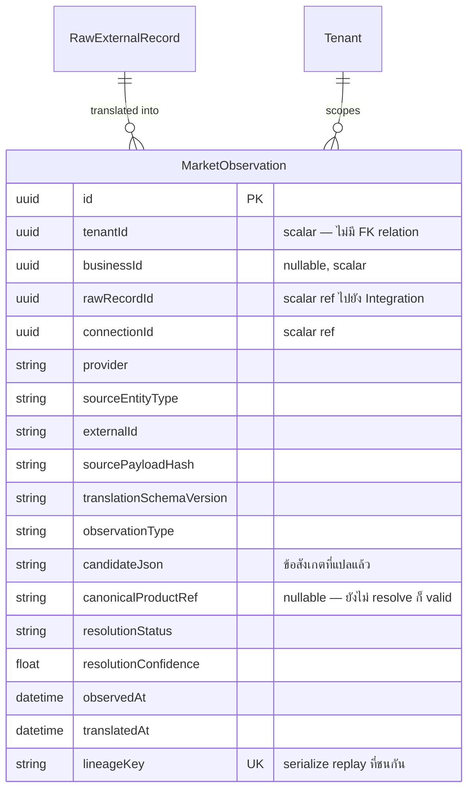
```mermaid
erDiagram
    RawExternalRecord ||--o{ MarketObservation : "translated into"
    Tenant ||--o{ MarketObservation : "scopes"

    MarketObservation {
        uuid     id                       PK
        uuid     tenantId                     "scalar — ไม่มี FK relation"
        uuid     businessId                   "nullable, scalar"
        uuid     rawRecordId                  "scalar ref ไปยัง Integration"
        uuid     connectionId                 "scalar ref"
        string   provider
        string   sourceEntityType
        string   externalId
        string   sourcePayloadHash
        string   translationSchemaVersion
        string   observationType
        string   candidateJson                "ข้อสังเกตที่แปลแล้ว"
        string   canonicalProductRef          "nullable — ยังไม่ resolve ก็ valid"
        string   resolutionStatus
        float    resolutionConfidence
        datetime observedAt
        datetime translatedAt
        string   lineageKey               UK  "serialize replay ที่ชนกัน"
    }
```

| Field | หมายเหตุ |
|---|---|
| ทำไม ref เป็น scalar | `rawRecordId` / `connectionId` เป็นคอลัมน์ธรรมดา ไม่ประกาศเป็น Prisma relation — เพื่อรักษาขอบเขตว่า Integration ยังเป็นเจ้าของ raw record (BR-019) |
| `lineageKey` | `@unique` — replay สองรอบพร้อมกันถูก serialize โดยไม่ต้องให้ Market เป็นเจ้าของ source record |
| `canonicalProductRef` null | ข้อสังเกตที่ยัง resolve ไม่ได้ **ยังเป็นข้อมูลที่ถูกต้อง** ไม่ใช่ error |
| model เดียวในโดเมนนี้ | ชื่ออื่นใน charter (PriceObservation, Watchlist, …) เป็น *candidate concept* จนกว่าจะมี FR ของตัวเอง |

**Spec:** FR-092 · ADR-038 · SDD-049, BR-019, SEC-017

---

## 14. IDENTITY: plugin authorization & edge devices

สี่ model ที่ identity ถือเพิ่มหลัง v1.0.0 ของเอกสารนี้ — ทั้งหมดคือ **credential ที่เก็บเฉพาะ digest**
(`codeHash`, `tokenHash`, `keyHash`) ไม่มี raw secret ลง DB (SEC-014 pattern เดียวกับ `Session`)

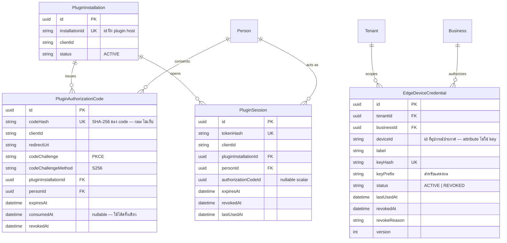
```mermaid
erDiagram
    PluginInstallation ||--o{ PluginAuthorizationCode : "issues"
    PluginInstallation ||--o{ PluginSession : "opens"
    Person ||--o{ PluginAuthorizationCode : "consents"
    Person ||--o{ PluginSession : "acts as"
    Tenant ||--o{ EdgeDeviceCredential : "scopes"
    Business ||--o{ EdgeDeviceCredential : "authorizes"

    PluginInstallation {
        uuid     id             PK
        string   installationId UK  "id ฝั่ง plugin host"
        string   clientId
        string   status             "ACTIVE"
    }

    PluginAuthorizationCode {
        uuid     id                   PK
        string   codeHash             UK  "SHA-256 ของ code — raw ไม่เก็บ"
        string   clientId
        string   redirectUri
        string   codeChallenge            "PKCE"
        string   codeChallengeMethod      "S256"
        uuid     pluginInstallationId FK
        uuid     personId             FK
        datetime expiresAt
        datetime consumedAt               "nullable — ใช้ได้ครั้งเดียว"
        datetime revokedAt
    }

    PluginSession {
        uuid     id                   PK
        string   tokenHash            UK
        string   clientId
        uuid     pluginInstallationId FK
        uuid     personId             FK
        uuid     authorizationCodeId      "nullable scalar"
        datetime expiresAt
        datetime revokedAt
        datetime lastUsedAt
    }

    EdgeDeviceCredential {
        uuid     id           PK
        uuid     tenantId     FK
        uuid     businessId   FK
        string   deviceId         "id ที่อุปกรณ์ประกาศ — attribute ไม่ใช่ key"
        string   label
        string   keyHash      UK
        string   keyPrefix        "สำหรับแสดงผล"
        string   status           "ACTIVE | REVOKED"
        datetime lastUsedAt
        datetime revokedAt
        string   revokeReason
        int      version
    }
```

| Field | หมายเหตุ |
|---|---|
| `PluginAuthorizationCode.consumedAt` | code ใช้ได้ครั้งเดียว — `POST /api/plugin/auth/token` เป็น operation เดียวที่ mint (ADR-052 D4) |
| `EdgeDeviceCredential.keyHash` | อุปกรณ์ Zuri Edge ยื่น bearer มาแลกงาน (FR-143 extraction job, FR-150 conversation job) — cloud เก็บ hash เท่านั้น |
| scope ของ edge device | ผูก **Business เดียว** — งานที่ claim ได้คือของ Business นั้นเท่านั้น (ADR-059 D2) และ credential นี้ **ไม่เคยเลือกเจ้าของ transport LINE** (ADR-061) |

**Spec:** FR-123 (plugin auth, ADR-052) · FR-144 (edge device credential, ADR-059) · SEC-014, SEC-025

---

## 15. ASSET MANAGEMENT: intake, register & evidence

Asset Management (`DOM-ASSET-MANAGEMENT`, ADR-055) ตอบว่า "หน่วยกายภาพนี้คืออะไร ใครพิสูจน์การรับเข้า"
— คนละคำถามกับ Inventory (§18) ที่ตอบว่า "เรามีของขายกี่ชิ้น"

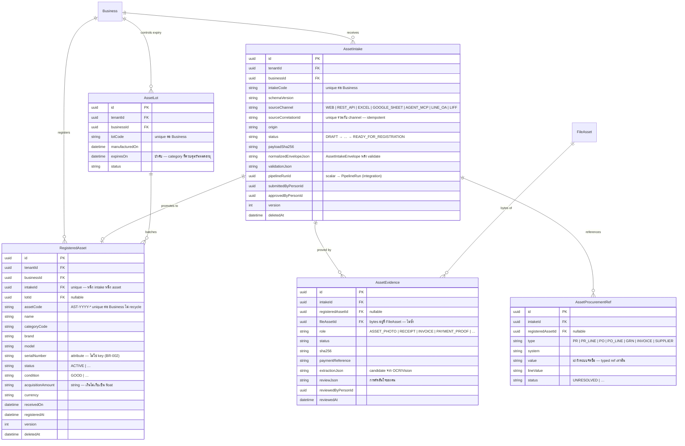
```mermaid
erDiagram
    Business ||--o{ AssetIntake : "receives"
    Business ||--o{ RegisteredAsset : "registers"
    Business ||--o{ AssetLot : "controls expiry"
    AssetIntake ||--o| RegisteredAsset : "promotes to"
    AssetIntake ||--o{ AssetEvidence : "proved by"
    AssetIntake ||--o{ AssetProcurementRef : "references"
    AssetLot ||--o{ RegisteredAsset : "batches"
    FileAsset ||--o{ AssetEvidence : "bytes of"

    AssetIntake {
        uuid     id                     PK
        uuid     tenantId               FK
        uuid     businessId             FK
        string   intakeCode                 "unique ต่อ Business"
        string   schemaVersion
        string   sourceChannel              "WEB | REST_API | EXCEL | GOOGLE_SHEET | AGENT_MCP | LINE_OA | LIFF"
        string   sourceCorrelationId        "unique ร่วมกับ channel — idempotent"
        string   origin
        string   status                     "DRAFT → … → READY_FOR_REGISTRATION"
        string   payloadSha256
        string   normalizedEnvelopeJson     "AssetIntakeEnvelope หลัง validate"
        string   validationJson
        uuid     pipelineRunId              "scalar → PipelineRun (integration)"
        uuid     submittedByPersonId
        uuid     approvedByPersonId
        int      version
        datetime deletedAt
    }

    RegisteredAsset {
        uuid     id                PK
        uuid     tenantId          FK
        uuid     businessId        FK
        uuid     intakeId          FK  "unique — หนึ่ง intake หนึ่ง asset"
        uuid     lotId             FK  "nullable"
        string   assetCode             "AST-YYYY-* unique ต่อ Business ไม่ recycle"
        string   name
        string   categoryCode
        string   brand
        string   model
        string   serialNumber          "attribute — ไม่ใช่ key (BR-002)"
        string   status                "ACTIVE | …"
        string   condition             "GOOD | …"
        string   acquisitionAmount     "string — เงินไม่เก็บเป็น float"
        string   currency
        datetime receivedOn
        datetime registeredAt
        int      version
        datetime deletedAt
    }

    AssetEvidence {
        uuid     id                 PK
        uuid     intakeId           FK
        uuid     registeredAssetId  FK  "nullable"
        uuid     fileAssetId        FK  "bytes อยู่ที่ FileAsset — ไม่ซ้ำ"
        string   role                   "ASSET_PHOTO | RECEIPT | INVOICE | PAYMENT_PROOF | …"
        string   status
        string   sha256
        string   paymentReference
        string   extractionJson         "candidate จาก OCR/Vision"
        string   reviewJson             "การตัดสินใจของคน"
        uuid     reviewedByPersonId
        datetime reviewedAt
    }

    AssetProcurementRef {
        uuid     id                PK
        uuid     intakeId          FK
        uuid     registeredAssetId FK  "nullable"
        string   type                  "PR | PR_LINE | PO | PO_LINE | GRN | INVOICE | SUPPLIER"
        string   system
        string   value                 "id ฝั่งระบบจัดซื้อ — typed ref เท่านั้น"
        string   lineValue
        string   status                "UNRESOLVED | …"
    }

    AssetLot {
        uuid     id             PK
        uuid     tenantId       FK
        uuid     businessId     FK
        string   lotCode            "unique ต่อ Business"
        datetime manufacturedOn
        datetime expiresOn         "บังคับ — category ที่ควบคุมวันหมดอายุ"
        string   status
    }
```

| Field | หมายเหตุ |
|---|---|
| `AssetIntake.@@unique([businessId, sourceChannel, sourceCorrelationId])` | ทุก surface ลงท่อเดียว (BR-009): ส่งซ้ำจาก channel เดิมได้ intake เดิม |
| `RegisteredAsset.intakeId` unique | asset เกิดจาก intake ที่ผ่าน review เท่านั้น — OCR/Vision อนุมัติตัวเองไม่ได้ |
| `AssetEvidence` ↔ `FileAsset` | reference เท่านั้น — ไม่ duplicate bytes/storage metadata (charter: "Explicitly not owned") |
| `AssetProcurementRef.value` | PR/PO/GRN เป็น **typed reference** ไปยังระบบจัดซื้อที่ยังไม่มี — ไม่ใช่ FK |
| `acquisitionAmount` เป็น string | เงินเก็บเป็น decimal string ไม่ใช่ float — คนละแนวกับ `Product.baseCost` ของ Inventory ที่เป็น float โดยตั้งใจ (ต้นทุน catalogue ไม่ใช่ valuation) |
| `AssetLot` ≠ `ProductLot` | สอง lot คนละโดเมน: AssetLot คือ batch ของ **สินทรัพย์** ที่มีวันหมดอายุ; ProductLot (§18) คือ batch ของ **สินค้าคงคลัง** ที่ ledger นับ |

**Spec:** FR-133, FR-137, FR-138, FR-139, FR-140 · ADR-055, ADR-056 · SDD-078..080, SEC-023, SEC-024

---

## 16. ASSET MANAGEMENT: lifecycle, depreciation & edge extraction


```mermaid
erDiagram
    RegisteredAsset ||--o{ AssetResponsibility : "accountable / custodian / user"
    RegisteredAsset ||--o{ AssetLocationHistory : "where it has been"
    RegisteredAsset ||--o{ AssetProjectAllocation : "booked by"
    RegisteredAsset ||--o{ AssetDepreciationCandidate : "previewed as"
    AssetIntake ||--o{ AssetDepreciationCandidate : "previewed before registration"
    Person ||--o{ AssetResponsibility : "holds"
    Branch ||--o{ AssetLocationHistory : "beneath"
    Project ||--o{ AssetProjectAllocation : "uses"
    Workstream ||--o{ AssetProjectAllocation : "uses"
    AssetEvidence ||--o{ AssetExtractionJob : "extracted by device"

    AssetResponsibility {
        uuid     id                PK
        uuid     registeredAssetId FK
        string   role                  "ACCOUNTABLE | CUSTODIAN | USER"
        uuid     personId          FK
        string   orgUnitSystem         "typed ref — ไม่มี org master"
        string   orgUnitRef
        datetime effectiveFrom
        datetime effectiveTo          "null = ปัจจุบัน"
        datetime acknowledgedAt
    }

    AssetLocationHistory {
        uuid     id                PK
        uuid     registeredAssetId FK
        uuid     branchId          FK  "nullable"
        string   locationCode
        string   locationName
        bool     isPrimary
        datetime effectiveFrom
        datetime effectiveTo
    }

    AssetProjectAllocation {
        uuid     id                PK
        uuid     registeredAssetId FK
        uuid     projectId         FK
        uuid     workstreamId      FK  "nullable"
        float    quantity
        bool     exclusive             "exclusive ซ้อนช่วงกันไม่ได้"
        string   status
        datetime effectiveFrom
        datetime effectiveTo
    }

    AssetDepreciationCandidate {
        uuid     id                 PK
        uuid     intakeId           FK  "nullable"
        uuid     registeredAssetId  FK  "nullable"
        string   method                 "STRAIGHT_LINE"
        string   acquisitionAmount
        string   residualValue
        string   currency
        int      usefulLifeMonths
        datetime startDate
        string   calculationVersion
        string   scheduleJson           "ตาราง preview — deterministic"
        string   status                 "PREVIEW | …"
        uuid     reviewedByPersonId
    }

    AssetExtractionJob {
        uuid     id                PK
        uuid     tenantId          FK
        uuid     businessId        FK
        uuid     evidenceId        FK
        string   status                "QUEUED → CLAIMED → COMPLETED | FAILED | CANCELLED"
        string   claimedByDeviceId     "deviceId ของ EdgeDeviceCredential"
        datetime claimedAt
        datetime leaseExpiresAt        "lease 10 นาที"
        int      attempts
        string   lastError
        string   resultJson
        string   provider
        string   model
        int      version
    }
```

| Field | หมายเหตุ |
|---|---|
| ประวัติแบบช่วงเวลา | responsibility / location / allocation **ปิดช่วงเดิมแล้วต่อช่วงใหม่** — ไม่เขียนทับ (charter invariant); `effectiveTo` null คือช่วงปัจจุบัน |
| `AssetProjectAllocation` | Asset เป็นผู้เขียน; Project Manager อ่านเป็น read projection (Project Inventory, FR-077) — ownership ไม่ย้าย |
| `AssetDepreciationCandidate` | **preview เท่านั้น** ไม่ใช่ accounting book — ไม่มี journal, ไม่มี posting (charter: Finance คือ authority) |
| `AssetExtractionJob.claimedByDeviceId` | scalar ไม่ใช่ FK ไป `EdgeDeviceCredential` — job ผูกกับ *อุปกรณ์* ที่ credential แทน ไม่ใช่ credential แถวใดแถวหนึ่ง (revoke แล้ว mint ใหม่ได้โดย job ไม่ขาด) |

**Spec:** FR-135, FR-136, FR-143, FR-144 · ADR-055, ADR-059 · SDD-085, SEC-025

---

## 17. LINE OA STUDIO: accounts, rich menus, LIFF & transport jobs

LINE OA Studio (`DOM-LINE-OA-STUDIO`, ADR-060) — บัญชี LINE Official Account **หลายบัญชีต่อ Business**,
โดย transport ที่รับ/ส่งข้อความเป็นของ server ตาม ADR-061

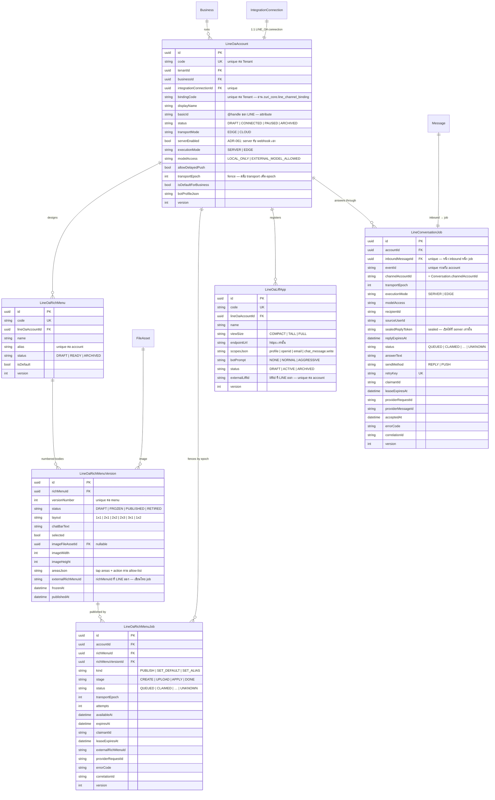
```mermaid
erDiagram
    Business ||--o{ LineOaAccount : "runs"
    IntegrationConnection ||--|| LineOaAccount : "1:1 LINE_OA connection"
    LineOaAccount ||--o{ LineOaRichMenu : "designs"
    LineOaRichMenu ||--o{ LineOaRichMenuVersion : "numbered bodies"
    FileAsset ||--o{ LineOaRichMenuVersion : "image"
    LineOaRichMenuVersion ||--o{ LineOaRichMenuJob : "published by"
    LineOaAccount ||--o{ LineOaRichMenuJob : "fences by epoch"
    LineOaAccount ||--o{ LineOaLiffApp : "registers"
    LineOaAccount ||--o{ LineConversationJob : "answers through"
    Message ||--|| LineConversationJob : "inbound → job"

    LineOaAccount {
        uuid     id                      PK
        string   code                    UK  "unique ต่อ Tenant"
        uuid     tenantId                FK
        uuid     businessId              FK
        uuid     integrationConnectionId FK  "unique"
        string   bindingCode                 "unique ต่อ Tenant — อ่าน zuri_core.line_channel_binding"
        string   displayName
        string   basicId                     "@handle ของ LINE — attribute"
        string   status                      "DRAFT | CONNECTED | PAUSED | ARCHIVED"
        string   transportMode               "EDGE | CLOUD"
        bool     serverEnabled               "ADR-061: server รับ webhook เอง"
        string   executionMode               "SERVER | EDGE"
        string   modelAccess                 "LOCAL_ONLY | EXTERNAL_MODEL_ALLOWED"
        bool     allowDelayedPush
        int      transportEpoch              "fence — สลับ transport เพิ่ม epoch"
        bool     isDefaultForBusiness
        string   botProfileJson
        int      version
    }

    LineOaRichMenu {
        uuid     id              PK
        string   code            UK
        uuid     lineOaAccountId FK
        string   name
        string   alias               "unique ต่อ account"
        string   status              "DRAFT | READY | ARCHIVED"
        bool     isDefault
        int      version
    }

    LineOaRichMenuVersion {
        uuid     id                 PK
        uuid     richMenuId         FK
        int      versionNumber          "unique ต่อ menu"
        string   status                 "DRAFT | FROZEN | PUBLISHED | RETIRED"
        string   layout                 "1x1 | 2x1 | 2x2 | 2x3 | 3x1 | 1x2"
        string   chatBarText
        bool     selected
        uuid     imageFileAssetId   FK  "nullable"
        int      imageWidth
        int      imageHeight
        string   areasJson              "tap areas + action ตาม allow-list"
        string   externalRichMenuId     "richMenuId ที่ LINE ออก — เขียนโดย job"
        datetime frozenAt
        datetime publishedAt
    }

    LineOaRichMenuJob {
        uuid     id                 PK
        uuid     accountId          FK
        uuid     richMenuId         FK
        uuid     richMenuVersionId  FK
        string   kind                   "PUBLISH | SET_DEFAULT | SET_ALIAS"
        string   stage                  "CREATE | UPLOAD | APPLY | DONE"
        string   status                 "QUEUED | CLAIMED | … | UNKNOWN"
        int      transportEpoch
        int      attempts
        datetime availableAt
        datetime expiresAt
        string   claimantId
        datetime leaseExpiresAt
        string   externalRichMenuId
        string   providerRequestId
        string   errorCode
        string   correlationId
        int      version
    }

    LineOaLiffApp {
        uuid     id              PK
        string   code            UK
        uuid     lineOaAccountId FK
        string   name
        string   viewSize            "COMPACT | TALL | FULL"
        string   endpointUrl         "https เท่านั้น"
        string   scopesJson          "profile | openid | email | chat_message.write"
        string   botPrompt           "NONE | NORMAL | AGGRESSIVE"
        string   status              "DRAFT | ACTIVE | ARCHIVED"
        string   externalLiffId      "liffId ที่ LINE ออก — unique ต่อ account"
        int      version
    }

    LineConversationJob {
        uuid     id               PK
        uuid     accountId        FK
        uuid     inboundMessageId FK  "unique — หนึ่ง inbound หนึ่ง job"
        string   eventId              "unique ร่วมกับ account"
        string   channelAccountId     "= Conversation.channelAccountId"
        int      transportEpoch
        string   executionMode        "SERVER | EDGE"
        string   modelAccess
        string   recipientId
        string   sourceUserId
        string   sealedReplyToken     "sealed — เปิดได้ที่ server เท่านั้น"
        datetime replyExpiresAt
        string   status               "QUEUED | CLAIMED | … | UNKNOWN"
        string   answerText
        string   sendMethod           "REPLY | PUSH"
        string   retryKey         UK
        string   claimantId
        datetime leaseExpiresAt
        string   providerRequestId
        string   providerMessageId
        datetime acceptedAt
        string   errorCode
        string   correlationId
        int      version
    }
```

| Field | หมายเหตุ |
|---|---|
| `LineOaAccount.integrationConnectionId` unique | บัญชีหนึ่ง = connection LINE_OA หนึ่ง; secret อยู่ที่ integration lane (`IntegrationCredential` / Vault) ไม่เคยอยู่ที่นี่ |
| `transportEpoch` บน job | job ที่ถูก claim ด้วย epoch เก่าถูก **fence** เมื่อบัญชีสลับ transport — ไม่มี job สองเจ้าของ (ADR-061 D6) |
| `externalRichMenuId` / `externalLiffId` | id ที่ LINE ออก — attribute ที่ transport/publisher บันทึก ไม่เคยเป็น key (BR-002) |
| `LineConversationJob.inboundMessageId` unique | ข้อความเข้าหนึ่งข้อความสร้าง job ได้ครั้งเดียว; `retryKey` unique กันส่งซ้ำ; ตอบ UNKNOWN ต้องมีคน acknowledge |
| `Conversation.channelAccountId` (FR-148) | identity ของ conversation รวม account ที่รับ — แถวเก่าเป็น `LEGACY:LINE` โดยไม่เดา |
| ไม่มี model ของ Flex / Flow / Template / Dispatch | charter ประกาศเป็น *target*; แต่ละตัวมาพร้อม FR ของตัวเอง (ADR-060 D14) |

**Spec:** FR-146, FR-147, FR-148, FR-149, FR-150, FR-151, FR-152, FR-153 · ADR-060, ADR-061

---

## 18. INVENTORY (Warehouse): catalogue, stock ledger & recipes

Inventory (`DOM-INVENTORY`, ป้าย **Warehouse** — คลังสินค้า) ตอบ "เรามีสินค้าอะไร นับสต๊อกไหม เหลือกี่ชิ้น
และของหนึ่งชุดทำจากอะไร" — ครบ id ทั้งเก้าที่ owner ขอ: `category_id` · `product_family` ·
`factory_id` · `product_master` · `product_id` · `bundle_id` · `lot_id` · `serial_id` · `recipe_id`

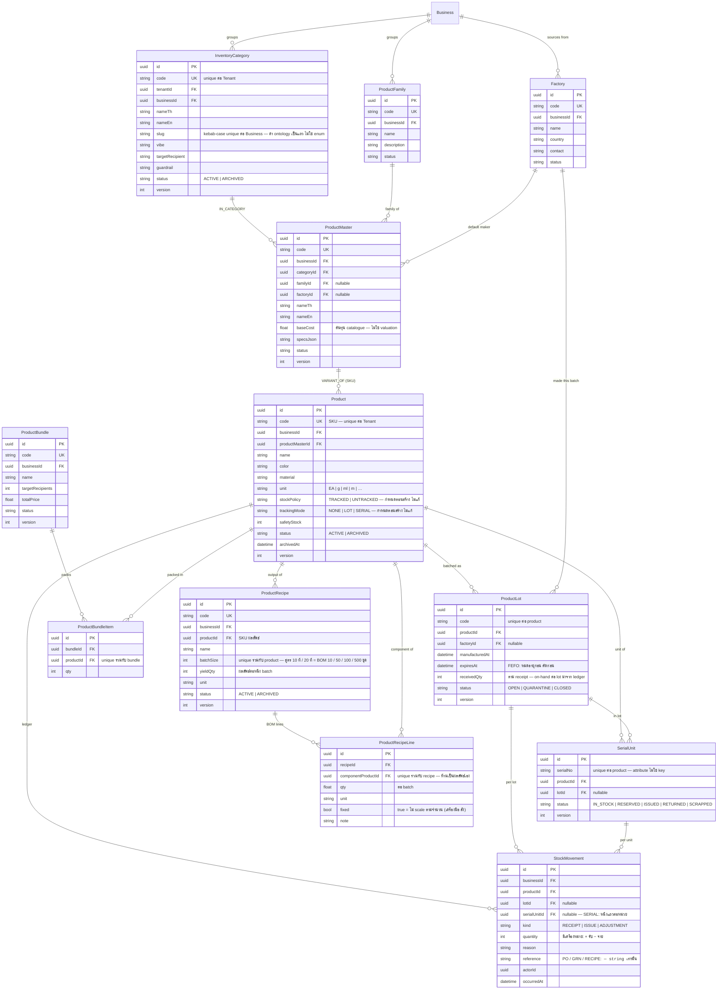
```mermaid
erDiagram
    Business ||--o{ InventoryCategory : "groups"
    Business ||--o{ ProductFamily : "groups"
    Business ||--o{ Factory : "sources from"
    InventoryCategory ||--o{ ProductMaster : "IN_CATEGORY"
    ProductFamily ||--o{ ProductMaster : "family of"
    Factory ||--o{ ProductMaster : "default maker"
    ProductMaster ||--o{ Product : "VARIANT_OF (SKU)"
    Product ||--o{ ProductLot : "batched as"
    Factory ||--o{ ProductLot : "made this batch"
    Product ||--o{ SerialUnit : "unit of"
    ProductLot ||--o{ SerialUnit : "in lot"
    Product ||--o{ StockMovement : "ledger"
    ProductLot ||--o{ StockMovement : "per lot"
    SerialUnit ||--o{ StockMovement : "per unit"
    ProductBundle ||--o{ ProductBundleItem : "packs"
    Product ||--o{ ProductBundleItem : "packed in"
    Product ||--o{ ProductRecipe : "output of"
    ProductRecipe ||--o{ ProductRecipeLine : "BOM lines"
    Product ||--o{ ProductRecipeLine : "component of"

    InventoryCategory {
        uuid     id              PK
        string   code            UK  "unique ต่อ Tenant"
        uuid     tenantId        FK
        uuid     businessId      FK
        string   nameTh
        string   nameEn
        string   slug                "kebab-case unique ต่อ Business — ค่า ontology เป็นแถว ไม่ใช่ enum"
        string   vibe
        string   targetRecipient
        string   guardrail
        string   status              "ACTIVE | ARCHIVED"
        int      version
    }

    ProductFamily {
        uuid     id          PK
        string   code        UK
        uuid     businessId  FK
        string   name
        string   description
        string   status
    }

    Factory {
        uuid     id          PK
        string   code        UK
        uuid     businessId  FK
        string   name
        string   country
        string   contact
        string   status
    }

    ProductMaster {
        uuid     id          PK
        string   code        UK
        uuid     businessId  FK
        uuid     categoryId  FK
        uuid     familyId    FK  "nullable"
        uuid     factoryId   FK  "nullable"
        string   nameTh
        string   nameEn
        float    baseCost        "ต้นทุน catalogue — ไม่ใช่ valuation"
        string   specsJson
        string   status
        int      version
    }

    Product {
        uuid     id              PK
        string   code            UK  "SKU — unique ต่อ Tenant"
        uuid     businessId      FK
        uuid     productMasterId FK
        string   name
        string   color
        string   material
        string   unit                "EA | g | ml | m | …"
        string   stockPolicy         "TRACKED | UNTRACKED — กำหนดตอนสร้าง ไม่แก้"
        string   trackingMode        "NONE | LOT | SERIAL — กำหนดตอนสร้าง ไม่แก้"
        int      safetyStock
        string   status              "ACTIVE | ARCHIVED"
        datetime archivedAt
        int      version
    }

    ProductBundle {
        uuid     id               PK
        string   code             UK
        uuid     businessId       FK
        string   name
        int      targetRecipients
        float    totalPrice
        string   status
        int      version
    }

    ProductBundleItem {
        uuid     id        PK
        uuid     bundleId  FK
        uuid     productId FK  "unique ร่วมกับ bundle"
        int      qty
    }

    ProductLot {
        uuid     id             PK
        string   code               "unique ต่อ product"
        uuid     productId      FK
        uuid     factoryId      FK  "nullable"
        datetime manufacturedAt
        datetime expiresAt         "FEFO: หมดอายุก่อน ตัดก่อน"
        int      receivedQty       "ตาม receipt — on-hand ต่อ lot มาจาก ledger"
        string   status            "OPEN | QUARANTINE | CLOSED"
        int      version
    }

    SerialUnit {
        uuid     id         PK
        string   serialNo       "unique ต่อ product — attribute ไม่ใช่ key"
        uuid     productId  FK
        uuid     lotId      FK  "nullable"
        string   status         "IN_STOCK | RESERVED | ISSUED | RETURNED | SCRAPPED"
        int      version
    }

    StockMovement {
        uuid     id           PK
        uuid     businessId   FK
        uuid     productId    FK
        uuid     lotId        FK  "nullable"
        uuid     serialUnitId FK  "nullable — SERIAL: หนึ่งแถวต่อหน่วย"
        string   kind             "RECEIPT | ISSUE | ADJUSTMENT"
        int      quantity         "มีเครื่องหมาย: + รับ − จ่าย"
        string   reason
        string   reference        "PO / GRN / RECIPE:<code> — string เท่านั้น"
        uuid     actorId
        datetime occurredAt
    }

    ProductRecipe {
        uuid     id         PK
        string   code       UK
        uuid     businessId FK
        uuid     productId  FK  "SKU ผลลัพธ์"
        string   name
        int      batchSize      "unique ร่วมกับ product — สูตร 10 ที่ / 20 ที่ = BOM 10 / 50 / 100 / 500 ชุด"
        int      yieldQty       "ผลลัพธ์ต่อหนึ่ง batch"
        string   unit
        string   status         "ACTIVE | ARCHIVED"
        int      version
    }

    ProductRecipeLine {
        uuid     id                 PK
        uuid     recipeId           FK
        uuid     componentProductId FK  "unique ร่วมกับ recipe — ห้ามเป็นผลลัพธ์เอง"
        float    qty                    "ต่อ batch"
        string   unit
        bool     fixed                  "true = ไม่ scale ตามจำนวน (เครื่องมือ ลัง)"
        string   note
    }
```

| Field | หมายเหตุ |
|---|---|
| **ไม่มีคอลัมน์ on-hand** บน `Product` / `ProductLot` | on-hand = `SUM(StockMovement.quantity)` คำนวณทุกครั้งที่อ่าน — กฎเดียวกับ progress (§24.4): ตัวเลขที่เก็บไว้คือตัวเลขที่หน้าจอจะเถียงกันได้ |
| `stockPolicy` / `trackingMode` แก้ไม่ได้ | ความหมายของทุกแถว ledger ขึ้นกับสองค่านี้ — เปลี่ยนนโยบายคือ archive แล้วสร้าง SKU ใหม่ |
| UNTRACKED | ไม่มี ledger: `recordMovement` ปฏิเสธด้วย code, summary รายงาน `onHand = null` ไม่ใช่ 0 (ศูนย์อ่านว่า "นับแล้วว่าง") |
| FEFO (FR-155) | ISSUE ของ LOT-tracked ที่ไม่ระบุ lot ตัดจาก OPEN lot ที่ `expiresAt` เร็วสุดก่อน (ไม่ทราบวันหมดอายุ = ท้ายสุด) หนึ่งแถวต่อ lot; ระบุ lot แล้วเกินที่ lot มีถูกปฏิเสธ |
| SERIAL | หนึ่งแถว ledger ต่อหนึ่งหน่วย — ประวัติของหน่วยคือแถวของมันเอง; หน่วยเกิดจาก RECEIPT ออกด้วย ISSUE ไม่มี route สร้างตรง |
| `ProductBundle` vs `ProductRecipe` | bundle = ชุดสินค้าที่ **batch size 1** (availability จาก ledger); recipe = BOM ที่ batch size ใด ๆ พร้อม explode / shortage / build แบบ atomic |
| `reference` เป็น string | PO / GRN / ใบส่งของ เป็น typed string ไม่ใช่ FK — Procurement ยังไม่มี authority (charter: not owned) |
| ontology ของ owner | `CatalogOffer` / `GiftTier` / `RecipientSegment` / `CorporateClient` และ edge `CONTAINS` / `INCLUDES_OFFER` / `ORDERED` เป็นของ **Commerce** (ยังไม่ charter) — ดู `docs/domains/inventory/ONTOLOGY.md` |

**Spec:** FR-154, FR-155, FR-156 · FEAT-020 · BR-002, SEC-001 · `docs/domains/inventory/CHARTER.md`

---

## 19. MARKETING: Strategy, Campaign & Content Evidence

Marketing owns Business-scoped planning evidence, immutable revisions, review and
decision history, the distinct Campaign association, and accepted PM handoff
references. Project Manager remains the owner of Project, Workstream,
WorkContainer, WorkItem, schedule and execution receipts. Files remains the owner
of binary assets; provider identities and measurements remain in their owning
Integration records.

~~~~mermaid
erDiagram
    Tenant ||--o{ MarketingPlan : "scopes"
    Business ||--o{ MarketingPlan : "plans"
    Business ||--o{ MarketingInitiative : "runs"
    Business ||--o{ MarketingContentBrief : "briefs"
    MarketingPlan ||--o{ MarketingPlanVersion : "revises"
    MarketingPlan ||--o{ MarketingReview : "reviewed by"
    MarketingPlan ||--o{ MarketingDecision : "decided by"
    MarketingPlan ||--o{ MarketingHandoff : "hands off"
    MarketingPlan ||--o| MarketingInitiative : "campaign identity"
    MarketingPlanVersion ||--o{ MarketingReview : "exact version"
    MarketingPlanVersion ||--o{ MarketingDecision : "exact version"
    MarketingPlanVersion ||--o{ MarketingHandoff : "exact handoff"
    MarketingReview ||--o{ MarketingDecision : "supports"
    MarketingHandoff }o--|| Workspace : "targets"
    MarketingHandoff }o--|| Project : "receipt for"
    MarketingHandoff ||--o{ MarketingInitiative : "selected by"
    MarketingContentBrief ||--o{ MarketingContentVersion : "revises"
    MarketingContentBrief ||--o{ MarketingContentReview : "reviewed by"
    MarketingContentBrief ||--o{ MarketingContentDecision : "decided by"
    MarketingContentVersion ||--o{ MarketingContentReview : "exact version"
    MarketingContentVersion ||--o{ MarketingContentDecision : "exact version"
    MarketingContentReview ||--o{ MarketingContentDecision : "supports"

    MarketingPlan {
        uuid id PK
        uuid tenantId FK
        uuid businessId FK
        string code UK
        string title
        string status
        int currentRevision
        int version
        string createdBy
        datetime createdAt
        datetime updatedAt
        datetime deletedAt
    }

    MarketingPlanVersion {
        uuid id PK
        uuid planId FK
        int revision
        string payloadJson
        string payloadHash
        string createdBy
        datetime createdAt
    }

    MarketingReview {
        uuid id PK
        uuid planId FK
        uuid planVersionId FK
        string payloadHash
        string verdict
        string rationale
        uuid reviewerId
        datetime createdAt
    }

    MarketingDecision {
        uuid id PK
        uuid planId FK
        uuid planVersionId FK
        uuid reviewId FK
        string payloadHash
        string verdict
        string rationale
        uuid actorId
        datetime expiresAt
        datetime createdAt
    }

    MarketingHandoff {
        uuid id PK
        uuid planId FK
        uuid planVersionId FK
        uuid workspaceId FK
        uuid projectId FK
        string payloadHash
        string envelopeHash
        string receiptJson
        string createdBy
        datetime createdAt
    }

    MarketingInitiative {
        uuid id PK
        uuid tenantId FK
        uuid businessId FK
        string code
        uuid planId UK
        uuid handoffId FK
        string status
        string closureReason
        int version
        string createdBy
        datetime createdAt
        datetime updatedAt
        datetime deletedAt
    }

    MarketingContentBrief {
        uuid id PK
        uuid tenantId FK
        uuid businessId FK
        string code UK
        string title
        string status
        int currentRevision
        int version
        string createdBy
        datetime createdAt
        datetime updatedAt
        datetime deletedAt
    }

    MarketingContentVersion {
        uuid id PK
        uuid briefId FK
        int revision
        string payloadJson
        string payloadHash
        string createdBy
        datetime createdAt
    }

    MarketingContentReview {
        uuid id PK
        uuid briefId FK
        uuid contentVersionId FK
        string payloadHash
        int sequence
        string verdict
        string rationale
        bool rightsConfirmed
        bool brandConfirmed
        uuid reviewerId
        datetime createdAt
    }

    MarketingContentDecision {
        uuid id PK
        uuid briefId FK
        uuid contentVersionId FK
        int sequence
        uuid reviewId FK
        string payloadHash
        string verdict
        string rationale
        uuid actorId
        datetime expiresAt
        datetime createdAt
    }
~~~~

| Model group | Persistence contract |
|---|---|
| Strategy | MarketingPlan is the scoped identity; MarketingPlanVersion is append-only and hashes the canonical title/payload. MarketingReview, MarketingDecision and MarketingHandoff bind exact plan versions. |
| Campaign | MarketingInitiative has its own UUID/code and one unique MarketingPlan; an optional MarketingHandoff selects the accepted PM receipt. PM Campaign remains a WorkContainer alias. |
| Content | MarketingContentBrief owns immutable MarketingContentVersion rows. Review and decision rows bind exact hashes and record rights/brand evidence; file and PM references stay owner-resolved payload references. |

All ten Marketing models are Business/Tenant scoped through their owning root or
version relation. Approval or handoff evidence never creates PM tasks, provider
actions, binary assets, stock records, or order records. Revisions remain
immutable, and reads must revalidate referenced owner records before projecting a
receipt or approval.

**Spec:** FR-157, FR-158, FR-159, FR-160 · SDD-086, SDD-087, SDD-088 ·
docs/domains/marketing/CHARTER.md

---
## 20. COMMERCE: sales orders, payments & verified revenue

Commerce (`DOM-COMMERCE`, ADR-065) ตอบ "ขายอะไรไป ให้ใคร จากบทสนทนาไหน และเงินเข้ามาจริงเท่าไร" —
model สามตัวที่ยืมรูปจาก "5. CORE: Orders & Payments" ของ legacy ERD (§22) โดยแก้สี่อย่างตอนข้ามพรมแดน:
line แทน JSON, **ไม่เก็บ total / paid**, เงินเป็น **satang จำนวนเต็ม**, bank reference เป็น attribute ไม่ใช่ key

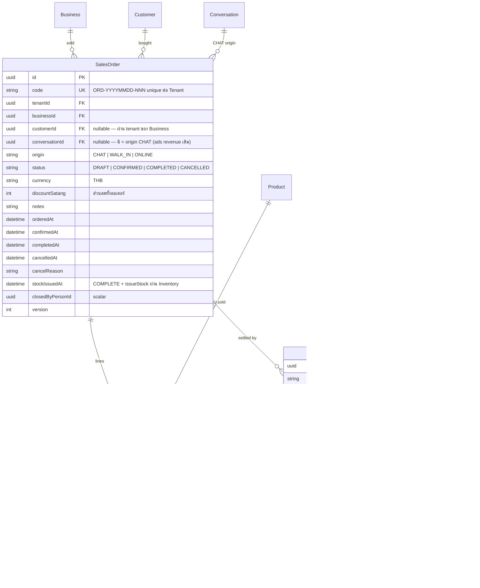
```mermaid
erDiagram
    Business ||--o{ SalesOrder : "sold"
    Customer ||--o{ SalesOrder : "bought"
    Conversation ||--o{ SalesOrder : "CHAT origin"
    SalesOrder ||--o{ SalesOrderLine : "lines"
    Product ||--o{ SalesOrderLine : "SKU sold"
    SalesOrder ||--o{ Payment : "settled by"
    FileAsset ||--o{ Payment : "slip"

    SalesOrder {
        uuid     id                PK
        string   code              UK  "ORD-YYYYMMDD-NNN unique ต่อ Tenant"
        uuid     tenantId          FK
        uuid     businessId        FK
        uuid     customerId        FK  "nullable — ผ่าน tenant ของ Business"
        uuid     conversationId    FK  "nullable — มี = origin CHAT (ads revenue เดิม)"
        string   origin                "CHAT | WALK_IN | ONLINE"
        string   status                "DRAFT | CONFIRMED | COMPLETED | CANCELLED"
        string   currency              "THB"
        int      discountSatang        "ส่วนลดทั้งออเดอร์"
        string   notes
        datetime orderedAt
        datetime confirmedAt
        datetime completedAt
        datetime cancelledAt
        string   cancelReason
        datetime stockIssuedAt         "COMPLETE + issueStock ผ่าน Inventory"
        uuid     closedByPersonId      "scalar"
        int      version
    }

    SalesOrderLine {
        uuid     id              PK
        uuid     orderId         FK
        uuid     productId       FK  "nullable — SKU ของ Business เดียวกัน"
        string   description
        int      qty
        int      unitPriceSatang     "ราคาตอนขาย — ไม่ใช่ baseCost ของ Inventory"
        int      discountSatang
        int      sortOrder
    }

    Payment {
        uuid     id                 PK
        string   code               UK  "PAY-YYYYMMDD-NNN unique ต่อ Tenant"
        uuid     tenantId           FK
        uuid     businessId         FK
        uuid     orderId            FK
        string   kind                   "PAYMENT | REFUND"
        string   method                 "TRANSFER | CASH | QR | CARD | OTHER"
        int      amountSatang
        string   status                 "PENDING | VERIFIED | REJECTED"
        string   bankReference          "unique ต่อ Tenant — attribute (BR-002)"
        uuid     slipFileAssetId    FK  "nullable — FileAsset ของ Business เดียวกัน"
        string   note
        datetime paidAt                 "วันที่นับรายได้ (ปฏิทิน Bangkok)"
        datetime verifiedAt
        uuid     verifiedByPersonId     "scalar"
        string   rejectReason
        int      version
    }
```

| Field | หมายเหตุ |
|---|---|
| **ไม่มีคอลัมน์ total / paid / balance / paymentState** | คำนวณทุกครั้งที่อ่านจาก line (qty × unitPrice − discount) และการชำระที่ **VERIFIED** เท่านั้น — กฎเดียวกับ progress (§24.4) และ on-hand (§18); `paymentState` UNPAID / PARTIAL / PAID / OVERPAID / REFUNDED เป็นค่าที่ derive ใน `domain/commerce.js` |
| เงินเป็น satang จำนวนเต็ม | API รับ-ส่งเป็นบาททศนิยมสองตำแหน่ง; 0.1 + 0.2 ไม่เป็นบั๊กอีก — คนละแนวกับ `Product.baseCost` (float, ต้นทุน catalogue) และ `RegisteredAsset.acquisitionAmount` (string) |
| `origin` + `conversationId` | ออเดอร์จากบทสนทนาเป็น CHAT เสมอ (การแบ่ง store / ads revenue ของ legacy แบบชัดเจน); `attributed` บน DTO คือ "มี conversation" |
| `Payment.bankReference` unique ต่อ Tenant | กฎ "กันสลิปซ้ำ" ของ legacy คงไว้ (`PAYMENT_REFERENCE_TAKEN`) แต่ **ไม่ใช่ key** และ nullable (BR-002, ADR-054 D4) |
| `slipFileAssetId` | bytes ของสลิปอยู่ที่ `FileAsset` เหมือนทุกไฟล์; OCR เป็น candidate ในอนาคตที่ verify ตัวเองไม่ได้ (กฎ evidence ของ Asset §15) |
| สองหมวก | `SALES_REP` บันทึกออเดอร์และการชำระ (PENDING); `PAYMENT_VERIFIER` (หรือ OWNER) เท่านั้นที่ VERIFY / REJECT — เพราะรายได้นับจาก VERIFIED |
| REFUND | เป็น `Payment` kind REFUND; verify ไม่ได้เกินที่ VERIFIED ไปแล้ว; ชำระบนออเดอร์ที่ CANCELLED ไม่ได้ แต่ refund ได้ |
| ตัดสต๊อก | COMPLETE + `issueStock` เรียก `appendMovement` ของ Inventory ใน transaction เดียวกัน (reference `ORDER:<code>`) — ขาดแล้วปฏิเสธทั้งหมด, SERIAL ปฏิเสธ, ไม่มีสิทธิ์คลังปฏิเสธ (role ของ Commerce ไม่ขยาย Inventory) |
| ไม่มี CREDIT | store credit ของ legacy ไม่ใช่การชำระ — เป็น liability ที่จะมี FR ของตัวเอง |

**Spec:** FR-162, FR-163 · FEAT-023 · ADR-065, ADR-054 D3/D4/D5 · BR-001, BR-002, SEC-001 · `docs/domains/commerce/CHARTER.md`

---

## 21. PROCUREMENT: suppliers, purchase orders & goods receipts

Procurement (`DOM-PROCUREMENT`, ADR-066) ตอบ "ซื้อจากใคร สั่งอะไรไป ค้างรับเท่าไร และของมาถึงจริงเมื่อไร" —
ฝั่ง **ซื้อ** ที่คู่กับ Commerce (ฝั่งขาย §20) โดยทั้งสองเลนพบกันที่ ledger ของ Inventory (§18) เท่านั้น:
ใบรับของ **เพิ่ม** สต๊อก (reference `PO:<code>/GRN:<code>`), ออเดอร์ที่เสร็จสิ้น **ลด** (reference `ORDER:<code>`)
model ห้าตัวยืมรูปจาก "Phase 5 shared/procurement" ของ legacy ERD (§22) โดยแก้ตอนข้ามพรมแดน:
line แทน blob, **ไม่เก็บ total / received / outstanding**, ต้นทุนเป็น **satang จำนวนเต็ม**, "รับบางส่วน" เป็นค่าที่ derive ไม่ใช่ status

```mermaid
erDiagram
    Business ||--o{ Supplier : "buys from"
    Supplier ||--o{ PurchaseOrder : "receives"
    Business ||--o{ PurchaseOrder : "orders"
    PurchaseOrder ||--o{ PurchaseOrderLine : "lines"
    Product ||--o{ PurchaseOrderLine : "SKU bought"
    PurchaseOrder ||--o{ GoodsReceipt : "delivered by"
    GoodsReceipt ||--o{ GoodsReceiptLine : "lines"
    PurchaseOrderLine ||--o{ GoodsReceiptLine : "received against"

    Supplier {
        uuid     id           PK
        string   code         UK  "unique ต่อ Tenant — attribute (BR-002)"
        uuid     tenantId     FK
        uuid     businessId   FK
        string   name
        string   taxId
        string   contactName
        string   phone
        string   email
        string   address
        string   paymentTerms
        int      leadTimeDays
        string   notes
        string   status           "ACTIVE | ARCHIVED"
        datetime archivedAt
        int      version
    }

    PurchaseOrder {
        uuid     id                PK
        string   code              UK  "PO-YYYYMMDD-NNN unique ต่อ Tenant"
        uuid     tenantId          FK
        uuid     businessId        FK
        uuid     supplierId        FK  "Supplier ของ Business เดียวกัน (Restrict)"
        string   status                "DRAFT | SENT | RECEIVED | SHORT_CLOSED | CANCELLED"
        string   currency              "THB"
        datetime expectedAt
        string   notes
        datetime orderedAt
        datetime sentAt
        datetime receivedAt            "ตั้งโดยใบรับของที่ทำให้ครบทุก line"
        datetime closedAt
        string   closeReason
        datetime cancelledAt
        string   cancelReason
        uuid     createdByPersonId     "scalar"
        int      version
    }

    PurchaseOrderLine {
        uuid     id              PK
        uuid     purchaseOrderId FK
        uuid     productId       FK  "nullable — SKU ของ Business เดียวกัน"
        string   description
        int      qty
        int      unitCostSatang      "ราคาที่ตกลงครั้งนี้ — ไม่ใช่ baseCost ของ Inventory"
        int      sortOrder
    }

    GoodsReceipt {
        uuid     id                PK
        string   code              UK  "GRN-YYYYMMDD-NNN unique ต่อ Tenant"
        uuid     tenantId          FK
        uuid     businessId        FK
        uuid     purchaseOrderId   FK
        string   supplierReference     "เลขที่ใบส่งของของผู้ขาย — attribute"
        string   notes
        datetime receivedAt
        uuid     postedByPersonId      "scalar"
    }

    GoodsReceiptLine {
        uuid     id                  PK
        uuid     receiptId           FK
        uuid     purchaseOrderLineId FK
        int      qty
        string   lotCode                 "Lot ที่ตั้งชื่อหรือสร้างใน ledger"
        datetime expiresAt               "ตั้งบน lot ที่ยังไม่มีวันหมดอายุ"
        string   serialNosJson           "JSON array ของ serial ที่รับ"
    }
```

| Field | หมายเหตุ |
|---|---|
| **ไม่มีคอลัมน์ total / receivedQty / outstanding / receiptState** | คำนวณทุกครั้งที่อ่านจาก line (qty × unitCost) และ receipt line ของแต่ละ line — กฎเดียวกับ progress (§24.4), on-hand (§18) และ paid ของออเดอร์ (§19); `receiptState` NONE / PARTIAL / COMPLETE derive ใน `domain/procurement.js` |
| "รับบางส่วน" ไม่ใช่ status | `status` มีแค่ DRAFT → SENT → RECEIVED (ตั้งโดยใบรับของที่ทำให้ครบ), SENT → SHORT_CLOSED (short-close ที่ยังค้าง), DRAFT / SENT → CANCELLED (เฉพาะเมื่อยังไม่รับอะไรเลย) — status ที่ต้องวิ่งตามตัวเลขที่คำนวณคือ source of truth สองแห่ง |
| `GoodsReceipt` ไม่มี status / version / PATCH | บันทึกคือการ post; แก้ไม่ได้ ลบไม่ได้ — ของผิดแก้ด้วย ADJUSTMENT ใน ledger (ADR-066 D6); `PurchaseOrder.version` ขยับทุกครั้งที่มีใบรับของ ผู้เรียกที่ถือ version เก่าจึงชน |
| ใบรับของ → ledger | line ที่ SKU นับสต๊อกเรียก `appendMovement` ของ Inventory ใน transaction เดียวกัน (RECEIPT, reason `GOODS_RECEIPT`, reference `PO:<code>/GRN:<code>`): `lotCode` ตั้งชื่อหรือสร้าง lot (LOT-tracked ต้องมี — `INVENTORY_LOT_REQUIRED` ของ Inventory โผล่ขึ้นมา), `expiresAt` ตั้งบน lot ที่ยังไม่มี, `serialNos` สร้างหน่วย (หนึ่งต่อหน่วย); line ที่ไม่นับสต๊อกหรือ free-text ไม่แตะ ledger และปฏิเสธข้อมูล lot / serial (`PROCUREMENT_RECEIPT_LINE_NOT_COUNTED`) |
| สองบันได | `PROCUREMENT_BUYER` (`procurement.po.write`, `procurement.receipt.post`) หรือ OWNER post ใบรับของ; ส่วนที่เขียน ledger ต้องมีสิทธิ์เขียนของ Inventory ด้วย (`403 PROCUREMENT_RECEIPT_REQUIRES_INVENTORY_AUTHORITY`) — role ของ Procurement ไม่ขยาย Inventory (ADR-066 D4 = ADR-065 D4) |
| รับเกินไม่ได้ | ทุก receipt line ต้องชี้ line ของ order เดียวกัน (`422 PROCUREMENT_RECEIPT_LINE_NOT_FOUND`) และรับได้ไม่เกินที่ค้าง — ปฏิเสธทั้งใบพร้อมรายการต่อ line (`409 PROCUREMENT_RECEIPT_EXCEEDS_ORDERED`) |
| ต้นทุนเป็น satang จำนวนเต็ม | API รับ-ส่งเป็นบาททศนิยมสองตำแหน่ง (กฎ ADR-065 D2); `unitCostSatang` คือราคาที่ตกลงกับผู้ขายครั้งนี้ ไม่ใช่การประเมินมูลค่าและไม่ใช่ `Product.baseCost` |
| `Supplier` | `code` unique ต่อ Tenant เป็น attribute; ARCHIVE เก็บแถวและออเดอร์ไว้ ออกใบสั่งซื้อใหม่ไม่ได้ (`409 SUPPLIER_ARCHIVED`); `SupplierCandidate` ของ Market Intelligence เป็นหลักฐาน ไม่ใช่ผู้ขายที่อนุมัติ |
| ไม่มี `POReturn` / `CreditNote` / `Advance` / `PurchaseRequest` | เลื่อนไว้ในเลนนี้ — แต่ละตัวมี FR ของตัวเอง (ADR-066 D7) |

**Spec:** FR-164, FR-165 · FEAT-024 · ADR-066, ADR-054 D3/D4/D5 · BR-001, BR-002, SEC-001 · `docs/domains/procurement/CHARTER.md`

---

## 22. Legacy ERD (zuri1.0) → zuri-ai: what was borrowed, relabelled, deferred, refused

`Freshair129/zuri1.0` — `docs/architecture/database-erd/full-schema.md` v2.0.0 (17 models) — คือ ERD
ของผลิตภัณฑ์เดิม ADR-024 D7 บอกว่าอ่านเป็น **prior art** ได้ แต่ไม่มีอะไรสืบทอดหรือย้ายมาจากมัน และ
ADR-054 วางกติกาการยืม: ยึด scope ของ aggregate ที่มีอยู่ (D3), external id ไม่เป็น key (D4), บันทึกสิ่งที่
ปฏิเสธเท่ากับสิ่งที่รับ (D5) ตารางนี้คือสถานะปัจจุบันของทุกหัวข้อในไฟล์นั้น

| Legacy section (zuri1.0) | Legacy models | zuri-ai (2026-09-06) | สถานะ |
|---|---|---|---|
| 1. CORE: Multi-Tenant | `Tenant` (flat, `tenantSlug`, `plan`) | scope chain `Portfolio → Tenant → Business` (§1) | ✅ native — ไม่ยืม |
| 2. CORE: Auth & Employee | `Employee` (roles[], passwordHash) | `Person` / `Membership` / `Session` / `RoleBinding` (§2) | ❌ refused (ADR-054 D5) |
| 3. CORE: Customer CRM | `Customer`, `CustomerProfile`; phone-merge identity | `Customer` (§9) + `CustomerProfile` (FR-126, target); identity merge → identity domain (FR-094) | ✅ `CustomerProfile` adopted / ❌ phone-merge refused (D4.3) |
| 4. CORE: Inbox & Conversations | `Conversation`, `Message` (FB/LINE, `t_xxx` ids) | `Conversation` / `Message` (§9) — external thread id เป็น attribute ใน tenant-partitioned unique (BR-002) | ✅ native equivalent |
| 5. CORE: Orders & Payments | `Order` (`items` JSON, `paidAmount` เก็บ, float), `Transaction` (`refNumber` UK, slip OCR, CREDIT) | **`SalesOrder` / `SalesOrderLine` / `Payment` ใน commerce (§20, FR-162/163, ADR-065)** — line แทน JSON, total/paid คำนวณตอนอ่าน, เงินเป็น satang, bank reference เป็น attribute unique ต่อ Tenant, สลิปเป็น `FileAsset`, ไม่มี CREDIT; "ROAS จาก VERIFIED เท่านั้น" คงไว้เป็นกฎรายได้ | ✅ relabelled + corrected (FR-162, FR-163) |
| 6. CORE: Marketing & Ads | Ad, AdDailyMetric (adId เป็น FK) | MarketingPlan, MarketingPlanVersion, MarketingReview, MarketingDecision, MarketingHandoff, MarketingInitiative, MarketingContentBrief, MarketingContentVersion, MarketingContentReview, MarketingContentDecision (§19); provider ids and measurements remain in Integration owner records | ✅ native planning evidence; provider execution and metrics remain deferred |
| 7. CORE: Tasks | `Task` (FOLLOW_UP / CALL / MEETING / DEMO; SINGLE / RANGE / PROJECT; URGENT เป็น status; `notionId`) | **`SalesTask` ใน crm (§9, FR-161, ADR-064)** — task ของ *sale* ผูก `Customer` / `Conversation` ผ่าน tenant, assignee `Person` ที่มี Membership; URGENT → priority, PROJECT + milestones → ยังคงเป็นของ project-manager (ADR-054 D5 แคบลง ไม่กลับคำ), `notionId` → `ExternalRef` เมื่อมี sync | ✅ relabelled (FR-161) |
| 8. CORE: DSB (Daily Sales Brief) | `ConversationAnalysis`, `DailyBrief` | `ConversationAnalysis` (§9, FR-127, **มีแล้ว**); `DailyBrief` (FR-128, target); ไม่มี `sourceAdId` จนกว่าจะมี Ad model | ✅ adopted (ADR-054 D2) — partial |
| 9. CORE: Products & Catalog | `Product` (course \| food \| equipment \| package, `sku`, `barcode`) | `ProductMaster` + `Product` (SKU) ใน Inventory (§18); `barcode` = attribute ในอนาคต; course/package → Commerce offer | ✅ relabelled (FR-154) |
| 10. INDUSTRY/CULINARY: Enrollment & Schedule | `Enrollment`, `CourseSchedule` | Operations / Commerce — target (ที่นั่ง = สิ่งที่ขาย ไม่ใช่สต๊อก) | 🔜 deferred (D5); ไม่มี model |
| 11. INDUSTRY/CULINARY: Kitchen Ops | `Ingredient`, `IngredientLot` (FEFO); planned `Recipe`, `RecipeIngredient`, `RecipeEquipment`, `CourseMenu`, `StockDeductionLog` | **Inventory (§18)**: `Product` (TRACKED, unit g/ml) · `ProductLot` + FEFO · `ProductRecipe` ต่อ `batchSize` (สูตร 10 ที่ / 20 ที่) · `ProductRecipeLine` (`fixed` = equipment) · `StockMovement` (build) | ✅ relabelled (FR-155, FR-156) — ดู ONTOLOGY.md |
| 12. SHARED: Audit | `AuditLog` (actor, action, target) | `AuditEvent` (§8) — append-only บนทุก service write | ✅ native — ไม่ยืม |
| 13. Phase 5 shared/inventory | `Warehouse`, `WarehouseStock`, `StockMovement`, `StockCount`, `StockCountItem`, `ProductBarcode` | `StockMovement` มีแล้ว; warehouse location / stock count → FR ถัดไปของ Inventory | 🔜 partial |
| 13. Phase 5 shared/procurement | `Supplier`, `PurchaseOrderV2`, `POItem`, `GRN…`, `POReturn`, `CreditNote`, `Advance` | **`Supplier` / `PurchaseOrder` / `PurchaseOrderLine` / `GoodsReceipt` / `GoodsReceiptLine` ใน procurement (§21, FR-164/165, ADR-066)** — line แทน blob, total/received/outstanding คำนวณตอนอ่าน, ต้นทุนเป็น satang, "รับบางส่วน" เป็น receiptState ไม่ใช่ status, GRN เป็น record ที่ผลต่อสต๊อกคือ `StockMovement` (reference `PO:<code>/GRN:<code>`); `POReturn` / `CreditNote` / `Advance` เลื่อนไว้ในเลนเดียวกัน; `AssetProcurementRef` (§15) ยังเป็น typed string | ✅ relabelled + corrected (FR-164, FR-165) — returns / credit / advance ยังเลื่อน |
| 13. Phase 6 industry/culinary packages & certificates | `Package…`, `Certificate`, `ClassAttendance` | Commerce / Operations — target | 🔜 deferred |

**กติกาที่ใช้กับทุกแถว "target"** — ยังไม่มีอะไรใน `apps/server/prisma/schema.prisma` จนกว่าจะมี FR ของตัวเอง ผ่าน
ADR-054 D3/D4 (scope จาก aggregate ที่มี, external id เป็น attribute) และ charter ของเลนที่ถือ; แถวใน
ตารางนี้จึงเป็น **ที่อยู่ในอนาคต** ไม่ใช่การอ้างว่ามีแล้ว

---

## 23. Domain ownership map

preflight บังคับว่า model หนึ่งถูก claim ได้โดย charter เดียว — ตารางนี้อ่านจาก
`docs/domains/<d>/CHARTER.md` frontmatter (`owns_models`)

| Domain | Models | จำนวน |
|---|---|---|
| **project-manager** | Portfolio, Tenant, LegalEntity, LegalEntityIdentifier, Business, Branch, Workspace, Project, BusinessRoadmap, BusinessRoadmapHorizon, BusinessGoal, ProjectGoal, Workstream, WorkContainer, WorkItem, Milestone, Gate, Dependency, Repository, ProjectRepository, ProjectFile, Team, TeamMembership, ProjectTeam, LocalWorkspaceMount, FileAsset, FileLink, Membership, AuditEvent, PlanImportReceipt | 30 |
| **identity** | ExternalIdentity, IdentityLinkToken, ExternalRef, RoleBinding, PersonCredential, PasswordResetToken, Session, ChannelIdentity, SotDataPlaneKey, WorkspaceMembership, WorkspaceInvite, ApiAccessKey, PlatformGrant, PluginInstallation, PluginAuthorizationCode, PluginSession, EdgeDeviceCredential | 17 |
| **crm** | Person, Customer, CustomerImportBatch, CustomerImportProvenance, CustomerImportReviewCase, CustomerImportReviewDecision, Conversation, Message, ConversationAnalysis, SalesTask | 10 |
| **integration** | IntegrationProvider, IntegrationConnection, IntegrationCredential, IngestionRun, RawExternalRecord, SyncCursor, ExternalEntityRef, DeadLetterRecord, SotDecision, PipelineRun, PipelineStep, PipelineEventReceipt, PipelineRecordEvent, PipelineReconciliation, PipelineGateDecision | 15 |
| **market-intelligence** | MarketObservation | 1 |
| **asset-management** | RegisteredAsset, AssetIntake, AssetEvidence, AssetProcurementRef, AssetLot, AssetResponsibility, AssetLocationHistory, AssetProjectAllocation, AssetDepreciationCandidate, AssetExtractionJob | 10 |
| **line-oa-studio** | LineOaAccount, LineOaRichMenu, LineOaRichMenuVersion, LineOaRichMenuJob, LineOaLiffApp, LineConversationJob | 6 |
| **inventory** | InventoryCategory, ProductFamily, Factory, ProductMaster, Product, ProductBundle, ProductBundleItem, ProductRecipe, ProductRecipeLine, ProductLot, SerialUnit, StockMovement | 12 |
| **marketing** | MarketingPlan, MarketingPlanVersion, MarketingReview, MarketingDecision, MarketingHandoff, MarketingInitiative, MarketingContentBrief, MarketingContentVersion, MarketingContentReview, MarketingContentDecision | 10 |
| **commerce** | SalesOrder, SalesOrderLine, Payment | 3 |
| **procurement** | Supplier, PurchaseOrder, PurchaseOrderLine, GoodsReceipt, GoodsReceiptLine | 5 |
| **agent** | — (ไม่มีโดยตั้งใจ: state อยู่ใน production Postgres `zuri_core.*` + MSP vault) | 0 |
| **knowledge** | — (ไม่มีโดยตั้งใจ: store คือ `zuri_core.business_knowledge` หลัง knowledge port) | 0 |
| **platform-control** | — (ไม่มีโดยตั้งใจ: projection ที่ถอดออกได้ ไม่ถือ persistence model) | 0 |
| | **รวม** | **119** |

> **ครบพอดี:** 119 model ใน `apps/server/prisma/schema.prisma` ถูก claim ครบทุกตัว ไม่มี model กำพร้า
> และไม่มีชื่อใน charter ที่ไม่มีอยู่จริงใน schema (ตรวจซ้ำได้ด้วยสคริปต์ท้ายเอกสาร §29)
> Pipeline ทั้ง 6 ตัวอยู่ในเลน **integration** — `docs/domains/knowledge/CHARTER.md`
> อ้างถึงมันในเนื้อความเพราะ knowledge *เรียกใช้* `createPipelineRun` ของเลนนั้น ไม่ได้เป็นเจ้าของ

---

## 24. Key Data Flows

### 24.1 LINE turn → Conversation → Agent

```mermaid
flowchart LR
    A[LINE webhook] --> B[binding resolver<br/>server-owned scope]
    B -->|reject client tenantId| B
    B --> C[line-ingest-service]
    C --> D[Conversation upsert<br/>tenantId+channel+externalThreadId]
    D --> E[Message insert<br/>conversationId+externalMessageId]
    E --> F[agent turn<br/>AuthContext ต่อ turn]
    F --> G[GKS knowledge port<br/>grounded answer]
```

ขอบเขต production มาจาก **binding ที่ server เป็นเจ้าของเท่านั้น** — `tenantId`/`businessId`
ที่ client ส่งมาถูกปฏิเสธก่อนงาน turn ใด ๆ จะเริ่ม (FR-052, SEC-010)

### 24.2 Intake convergence — ทุก surface ลงท่อเดียว

```mermaid
flowchart TD
    A1[Excel upload] --> E[PlanEnvelope]
    A2[LINE intake] --> E
    A3[Web form] --> E
    A4[Enterprise API] --> E
    E --> V[Zod validate ที่ boundary]
    V --> S[semantic check]
    S --> D[read-only dry run]
    D --> P[preview ให้คนยืนยัน]
    P --> T[single transaction]
    T --> AU[AuditEvent]
    T --> R[PlanImportReceipt<br/>idempotencyKey + payloadHash]
```

surface ใหม่เพิ่ม **converter** ไม่เคยเพิ่ม write path ที่สอง (BR-009, SDD-009)
และ **plan คือข้อมูล ไม่ใช่คำสั่ง** — ไม่มีอะไรใน envelope ถูก execute (BR-007, SEC-002)

### 24.3 External ingestion → market observation

```mermaid
flowchart LR
    A[IntegrationConnection] --> B[IngestionRun]
    B --> C[RawExternalRecord<br/>payload verbatim + hash]
    C -->|แปลสำเร็จ| D[MarketObservation<br/>lineageKey unique]
    C -->|ล้มเหลว| E[DeadLetterRecord<br/>failureOwner ระบุชื่อ]
    C --> F["ExternalEntityRef<br/>external → internal UUID"]
    B --> G[SyncCursor<br/>watermark ครั้งถัดไป]
    E -->|retry| B
```

### 24.4 Progress roll-up — ทำไม `progressCache` เชื่อไม่ได้

```mermaid
flowchart TD
    A[WorkItem.status + weight] --> B[pure calculator<br/>ไม่มี I/O ไม่มี clock]
    C[WorkContainer] --> B
    B --> D[Workstream progress]
    D --> E{Gate required<br/>ยังไม่ผ่าน?}
    E -->|ใช่| F[cap progress ไว้<br/>BR-006]
    E -->|ไม่| G[Project progress]
    F --> G
    G --> H[หน้าจอ]
    D -.->|เขียนทับได้ ล้าสมัยได้| I[(progressCache)]
    I -.->|advisory เท่านั้น| H
```

---

## 25. Index Strategy

| Table | Index | Purpose |
|---|---|---|
| `Tenant` | `(portfolioId)` | ไล่ scope chain ลง |
| `Business` | `(tenantId)` | tenant filter — query แรกของแทบทุกหน้า |
| `Membership` | `(personId, status)` · `(tenantId, status)` | resolveViewer ต่อ request |
| `Session` | `(personId, status)` · `(expiresAt, status)` | ตรวจ session + งานกวาด session หมดอายุ |
| `ChannelIdentity` | `(tenantId, channel, channelAccountId, providerSubject)` UNIQUE | ผูก LINE subject แบบ tenant-partitioned |
| `PlatformGrant` | `(personId, capability)` UNIQUE · `(capability, status)` | ตรวจ operator ต่อ request |
| `WorkspaceMembership` | `(portfolioId, personId)` UNIQUE | หนึ่งคนหนึ่ง membership ต่อ Workspace |
| `Project` | `(businessId)` · `(status)` · `(priority)` · `(picPersonId)` | Dashboard: Top 5 Priority, My Projects |
| `Workstream` | `(projectId)` · `(executionMode)` · `(laneId)` | progress roll-up ต่อ project |
| `WorkItem` | `(workstreamId)` · `(containerId)` · `(status)` | โหลด board ต่อ workstream |
| `Dependency` | `(sourceType, sourceId)` · `(targetType, targetId)` | ตรวจ cycle สองทิศ |
| `Customer` | `(tenantId, personId)` UNIQUE · `(consentStatus)` | CRM sharing + รายงาน PDPA |
| `Conversation` | `(tenantId, channel, externalThreadId)` UNIQUE · `(customerId)` | upsert จาก webhook แบบ idempotent |
| `Message` | `(conversationId, externalMessageId)` UNIQUE | กันข้อความซ้ำจาก provider retry |
| `RawExternalRecord` | `idempotencyKey` UNIQUE · `(connectionId, entityType, externalId)` | replay-safe ingestion |
| `SyncCursor` | `(connectionId, resourceType)` UNIQUE | watermark หนึ่งเดียวต่อ resource |
| `ExternalEntityRef` | `(connectionId, entityType, externalId)` UNIQUE | external → internal mapping |
| `PipelineRun` | `executionRunId` UNIQUE · `idempotencyKey` UNIQUE · `(tenantId, status)` | ledger lookup + กัน run ซ้ำ |
| `PipelineRecordEvent` | `idempotencyKey` UNIQUE · `(docId)` · `(picId)` · `(factId)` | ไล่รอย record เดียวข้าม stage |
| `MarketObservation` | `lineageKey` UNIQUE · `(tenantId, businessId, observedAt)` | serialize replay + query ตามช่วงเวลา |
| `AuditEvent` | `(entityType, entityId)` · `(occurredAt)` | "ใครทำอะไรกับแถวนี้" + timeline |
| `AssetIntake` | `(businessId, sourceChannel, sourceCorrelationId)` UNIQUE · `(businessId, payloadSha256)` | intake ซ้ำจาก channel เดิม = แถวเดิม |
| `RegisteredAsset` | `(businessId, assetCode)` UNIQUE · `(businessId, serialNumber)` | ค้นด้วย Asset ID / serial โดยไม่ให้เป็น key |
| `AssetResponsibility` / `AssetLocationHistory` / `AssetProjectAllocation` | `(registeredAssetId, …, effectiveTo)` | "ช่วงปัจจุบัน" = `effectiveTo IS NULL` |
| `AssetExtractionJob` | `(businessId, status, createdAt)` · `(evidenceId, status)` | อุปกรณ์ claim งานที่ QUEUED เก่าสุดของ Business ตัวเอง |
| `EdgeDeviceCredential` | `keyHash` UNIQUE · `(businessId, deviceId)` | ตรวจ bearer ของอุปกรณ์ต่อ request |
| `PluginAuthorizationCode` / `PluginSession` | `codeHash` / `tokenHash` UNIQUE · `(personId, expiresAt)` | แลก code / ตรวจ token + กวาดของหมดอายุ |
| `LineOaAccount` | `(tenantId, code)` UNIQUE · `(tenantId, bindingCode)` UNIQUE · `integrationConnectionId` UNIQUE · `(businessId, status)` | บัญชีหนึ่ง connection หนึ่ง; อ่าน binding ด้วย code |
| `LineOaRichMenuVersion` | `(richMenuId, versionNumber)` UNIQUE · `(lineOaAccountId, status)` | รุ่นที่ FROZEN ล่าสุดของ menu |
| `LineOaRichMenuJob` / `LineConversationJob` | `(status, availableAt)` · `(accountId, status)` · `retryKey` UNIQUE | worker claim งานที่ถึงเวลาแล้ว; กันส่งซ้ำ |
| `LineOaLiffApp` | `(tenantId, code)` UNIQUE · `(lineOaAccountId, externalLiffId)` UNIQUE | liffId หนึ่งต่อบัญชี — attribute ไม่ใช่ key |
| `ConversationAnalysis` | `(conversationId, analyzedDate)` · `(analyzedDate)` · `(state)` | brief รายวัน + กรองตาม state |
| MarketingPlan / MarketingContentBrief | (businessId, code) UNIQUE · (tenantId, businessId, status) | scoped root lookup and lifecycle filtering |
| MarketingPlanVersion / MarketingContentVersion | (planId, revision) UNIQUE · (briefId, revision) UNIQUE | immutable revision lookup |
| MarketingReview / MarketingDecision | (planId, createdAt) · (briefId, sequence) UNIQUE · (briefId, createdAt) | exact-version review and decision history |
| MarketingHandoff | (planVersionId, workspaceId) UNIQUE · (planId) | one accepted PM handoff per plan version and workspace |
| MarketingInitiative | planId UNIQUE · (businessId, code) UNIQUE · (tenantId, businessId, status) | distinct Campaign identity and lifecycle lookup |
| `Product` / `ProductMaster` / `InventoryCategory` / `Factory` / `ProductFamily` / `ProductBundle` / `ProductRecipe` | `(tenantId, code)` UNIQUE · `(businessId, status)` | รหัสคนอ่านออก unique ต่อ Tenant; หน้า dashboard ต่อ Business |
| `InventoryCategory` | `(businessId, slug)` UNIQUE | slug ของ ontology ต่อ Business |
| `ProductLot` | `(productId, code)` UNIQUE · `(businessId, status)` | เลข lot unique ต่อ SKU; FEFO อ่าน OPEN lot แล้วเรียง `expiresAt` ใน memory |
| `SerialUnit` | `(productId, serialNo)` UNIQUE · `(businessId, status)` | serial unique ต่อ SKU; รายการ IN_STOCK |
| `StockMovement` | `(productId, occurredAt)` · `(businessId, occurredAt)` · `(lotId)` · `(serialUnitId)` | on-hand = SUM ต่อ product / ต่อ lot; ประวัติหน่วย |
| `ProductRecipe` | `(productId, batchSize)` UNIQUE | หนึ่งสูตรต่อ (SKU ผลลัพธ์, batch size) |
| `SalesTask` | `(tenantId, code)` UNIQUE · `(businessId, status, dueDate)` · `(assigneePersonId, status)` · `(customerId)` · `(conversationId)` | รายการงานเปิดของ Business เรียงตามกำหนด; "ของฉัน"; งานต่อลูกค้า / ต่อบทสนทนา |
| `SalesOrder` | `(tenantId, code)` UNIQUE · `(businessId, status, orderedAt)` · `(customerId)` · `(conversationId)` | ออเดอร์เปิดของ Business ล่าสุดก่อน; ออเดอร์ต่อลูกค้า / ต่อบทสนทนา (รายได้จากแชท) |
| `SalesOrderLine` | `(orderId)` · `(productId)` | line ของออเดอร์; "SKU นี้ขายไปกี่ครั้ง" |
| `Payment` | `(tenantId, code)` UNIQUE · `(tenantId, bankReference)` UNIQUE · `(orderId, status)` · `(businessId, status, paidAt)` | กันสลิปซ้ำ; การชำระ VERIFIED ของออเดอร์; รายได้ตามวันที่ชำระ |
| `Supplier` | `(tenantId, code)` UNIQUE · `(businessId, status)` | รหัสผู้ขาย unique ต่อ Tenant; ผู้ขาย ACTIVE ของ Business |
| `PurchaseOrder` | `(tenantId, code)` UNIQUE · `(businessId, status, orderedAt)` · `(supplierId)` | ใบสั่งซื้อเปิดของ Business ล่าสุดก่อน; ใบสั่งซื้อต่อผู้ขาย |
| `PurchaseOrderLine` | `(purchaseOrderId)` · `(productId)` | line ของใบสั่งซื้อ; "SKU นี้ซื้อครั้งล่าสุดเท่าไร" |
| `GoodsReceipt` | `(tenantId, code)` UNIQUE · `(purchaseOrderId)` · `(businessId, receivedAt)` | ใบรับของต่อใบสั่งซื้อ; ของที่รับตามวัน |
| `GoodsReceiptLine` | `(receiptId)` · `(purchaseOrderLineId)` | received / outstanding = SUM ต่อ line ของใบสั่งซื้อ |

---

## 26. Naming Conventions

| Convention | Example | Rule |
|---|---|---|
| Model name | `WorkItem` | PascalCase เอกพจน์ (Prisma) |
| PK | `id` | UUID เสมอ — `@id @default(uuid())` |
| Human key | `code` | `@unique` ทั้งระบบ อ่านออก แต่ไม่ใช่ PK |
| External id | `externalId`, `providerSubject`, `value` | เป็น *attribute* เท่านั้น ไม่เคยเป็น PK (**BR-002**) |
| FK column | `tenantId`, `businessId`, `projectId` | camelCase `<parent>Id` |
| Timestamps | `createdAt` / `updatedAt` | `@default(now())` / `@updatedAt` แทบทุกตาราง |
| Soft delete | `deletedAt` | nullable DateTime — query ต้องกรองเอง |
| Concurrency | `version` | `Int @default(1)` บน aggregate root |
| Enum | `status`, `role`, `subtype` | **เก็บเป็น string** — source of truth คือ `apps/server/src/lib/validation/enums.js` |
| JSON | `metadataJson`, `evidenceJson`, `payloadJson` | suffix `Json`, เก็บเป็น **string** (SQLite compat) |
| Hash / secret | `tokenHash`, `keyHash`, `payloadHash`, `sha256` | เก็บเฉพาะ digest — raw secret ไม่เคยลง DB |
| Boolean | `required`, `retryable`, `labelAs` | ไม่มี prefix `is_` ในโปรเจกต์นี้ |

**ทำไม enum เป็น string:** SQLite dev/test ไม่มี native enum และ `apps/server/src/lib/validation/enums.js`
เป็นแหล่งความจริงที่ Excel dropdown, OpenAPI และ Zod validation อ่านร่วมกัน —
อย่าคัดลอกรายการ enum ด้วยมือที่ไหนอีก

### 26.1 คอลัมน์ string ตัวไหน มาจาก enum ตัวไหน

`apps/server/src/lib/validation/enums.js` — โดเมนธุรกิจหลัก:

| Column | Constant | Values |
|---|---|---|
| `Membership.role` | `MEMBERSHIP_ROLES` | OWNER · MEMBER |
| `WorkspaceMembership.role` | `WORKSPACE_MEMBERSHIP_ROLES` | OWNER · ADMIN · MEMBER |
| `WorkspaceMembership.status` | `WORKSPACE_MEMBERSHIP_STATUSES` | ACTIVE · REMOVED |
| `WorkspaceInvite.role` | `WORKSPACE_INVITE_ROLES` | ADMIN · MEMBER (OWNER ถูกกรองออก) |
| `WorkspaceInvite.status` | `WORKSPACE_INVITE_STATUSES` | PENDING · ACCEPTED · REVOKED |
| `Workspace.scopeType` | `WORKSPACE_SCOPE_TYPES` | PORTFOLIO · TENANT · BUSINESS |
| `Project.status` | `PROJECT_STATUSES` | PLANNED · ACTIVE · ON_HOLD · DONE · ARCHIVED |
| `Project.priority` | `PROJECT_PRIORITIES` | CRITICAL · HIGH · MEDIUM · LOW |
| `Workstream.status` | `WORKSTREAM_STATUSES` | เหมือน PROJECT_STATUSES |
| `Workstream.executionMode` | `EXECUTION_MODES` | SOFTWARE_SPRINT · DATA_MIGRATION · B2B_SALES · B2C_CAMPAIGN · PRODUCT_LAUNCH · OPERATIONS · BUSINESS_EXPANSION |
| `Workstream.progressStrategy` | `PROGRESS_STRATEGIES` | TASK_WEIGHT · RECORD_VALIDATION · WEIGHTED_PIPELINE · KPI_ATTAINMENT · MILESTONE_READINESS · SLA_SCORE · EXPANSION_READINESS |
| `WorkContainer.subtype` | `CONTAINER_SUBTYPES` | 15 ค่า (SPRINT, EPIC, MIGRATION_STAGE, …) |
| `WorkContainer.status` | `CONTAINER_STATUSES` | PLANNED · ACTIVE |
| `WorkItem.subtype` | `ITEM_SUBTYPES` | 17 ค่า (TASK, BUG, DATASET, DEAL, …) |
| `WorkItem.status` | `WORK_STATUSES` | PLANNED · READY · IN_PROGRESS · REVIEW · BLOCKED · DONE · CANCELLED |
| `Milestone.status` | `MILESTONE_STATUSES` | PLANNED · IN_PROGRESS · DONE · MISSED |
| `Gate.status` | `GATE_STATUSES` | OPEN · PASSED · BLOCKED · WAIVED |
| `Dependency.dependencyType` | `DEPENDENCY_TYPES` | BLOCKS · REQUIRES · RELATES_TO · START_AFTER · FINISH_BEFORE · SUPERSEDES · DERIVES_FROM |
| `Dependency.sourceType` / `targetType` | `DEPENDENCY_ENDPOINT_TYPES` | PROJECT · WORKSTREAM · MILESTONE · GATE · WORK_CONTAINER · WORK_ITEM |
| `BusinessRoadmap.status` | `ROADMAP_STATUSES` | ACTIVE · ARCHIVED |
| `BusinessGoal.status` | `GOAL_STATUSES` | PLANNED · ACTIVE · DONE · ARCHIVED |
| `BusinessGoal.priority` | `GOAL_PRIORITIES` | MEDIUM · HIGH |
| `Conversation.channel` | `CHANNELS` | LINE · FACEBOOK · WEB |
| `Message.direction` | `MESSAGE_DIRECTIONS` | INBOUND · OUTBOUND |
| `Customer.lifecycleStage` | `CUSTOMER_LIFECYCLE` | LEAD · ACTIVE · DORMANT · LOST |
| `Customer.consentStatus` | `CUSTOMER_CONSENT_STATUSES` | PENDING · GRANTED · DECLINED · GRANDFATHERED |
| `ExternalIdentity.provider` | `IDENTITY_PROVIDERS` | LINE (ค่าเดียว) |
| `AssetIntake.sourceChannel` | `ASSET_INTAKE_CHANNELS` | WEB · REST_API · EXCEL · GOOGLE_SHEET · AGENT_MCP · LINE_OA · LIFF |
| `AssetEvidence.role` | `ASSET_EVIDENCE_ROLES` | ASSET_PHOTO · RECEIPT · INVOICE · PAYMENT_PROOF · DELIVERY · INSPECTION · WARRANTY · OTHER |
| `AssetProcurementRef.type` | `ASSET_PROCUREMENT_REF_TYPES` | PR · PR_LINE · PO · PO_LINE · GRN · INVOICE · SUPPLIER |
| `AssetResponsibility.role` | `ASSET_RESPONSIBILITY_ROLES` | ACCOUNTABLE · CUSTODIAN · USER |
| `AssetDepreciationCandidate.method` | `ASSET_DEPRECIATION_METHODS` | STRAIGHT_LINE (ค่าเดียว) |
| `LineOaAccount.status` | `LINE_OA_ACCOUNT_STATUSES` | DRAFT · CONNECTED · PAUSED · ARCHIVED (+ LIVE เป็น *effective* status ที่คำนวณจาก binding) |
| `LineOaAccount.transportMode` | `LINE_OA_TRANSPORT_MODES` | EDGE · CLOUD |
| `LineOaRichMenuVersion.layout` | `LINE_OA_RICH_MENU_LAYOUTS` | 1x1 · 2x1 · 2x2 · 2x3 · 3x1 · 1x2 |
| `LineOaRichMenu.status` / `LineOaRichMenuVersion.status` | `LINE_OA_RICH_MENU_STATUSES` / `LINE_OA_RICH_MENU_VERSION_STATUSES` | DRAFT · READY · ARCHIVED / DRAFT · FROZEN · PUBLISHED · RETIRED |
| `LineOaRichMenuJob.kind` / `.stage` | `LINE_OA_RICH_MENU_JOB_KINDS` / `LINE_OA_RICH_MENU_JOB_STAGES` | PUBLISH · SET_DEFAULT · SET_ALIAS / CREATE · UPLOAD · APPLY · DONE |
| `LineOaLiffApp.viewSize` / `.botPrompt` | `LINE_OA_LIFF_VIEW_SIZES` / `LINE_OA_LIFF_BOT_PROMPTS` | COMPACT · TALL · FULL / NONE · NORMAL · AGGRESSIVE |
| `Product.stockPolicy` | `INVENTORY_STOCK_POLICIES` | TRACKED · UNTRACKED |
| `Product.trackingMode` | `INVENTORY_TRACKING_MODES` | NONE · LOT · SERIAL |
| `ProductLot.status` | `INVENTORY_LOT_STATUSES` | OPEN · QUARANTINE · CLOSED |
| `SerialUnit.status` | `INVENTORY_SERIAL_STATUSES` | IN_STOCK · RESERVED · ISSUED · RETURNED · SCRAPPED |
| `StockMovement.kind` | `INVENTORY_MOVEMENT_KINDS` | RECEIPT · ISSUE · ADJUSTMENT |
| (`PATCH` action) `Product` / `ProductRecipe` | `INVENTORY_PRODUCT_ACTIONS` / `INVENTORY_RECIPE_ACTIONS` | UPDATE · ARCHIVE |
| `SalesTask.type` | `SALES_TASK_TYPES` | FOLLOW_UP · CALL · LINE_MESSAGE · EMAIL · MEETING · DEMO · QUOTE |
| `SalesTask.priority` | `SALES_TASK_PRIORITIES` | URGENT · HIGH · NORMAL · LOW |
| `SalesTask.status` | `SALES_TASK_STATUSES` | OPEN · IN_PROGRESS · DONE · CANCELLED |
| `SalesTask.scheduleKind` | `SALES_TASK_SCHEDULE_KINDS` | SINGLE · RANGE |
| (`PATCH` action) `SalesTask` | `SALES_TASK_ACTIONS` | UPDATE · ASSIGN · START · COMPLETE · CANCEL · REOPEN |
| `SalesOrder.origin` | `SALES_ORDER_ORIGINS` | CHAT · WALK_IN · ONLINE |
| `SalesOrder.status` | `SALES_ORDER_STATUSES` | DRAFT · CONFIRMED · COMPLETED · CANCELLED |
| (`PATCH` action) `SalesOrder` | `SALES_ORDER_ACTIONS` | UPDATE · CONFIRM · COMPLETE · CANCEL |
| `Payment.kind` / `.method` / `.status` | `PAYMENT_KINDS` / `PAYMENT_METHODS` / `PAYMENT_STATUSES` | PAYMENT · REFUND / TRANSFER · CASH · QR · CARD · OTHER / PENDING · VERIFIED · REJECTED |
| (`PATCH` action) `Payment` | `PAYMENT_ACTIONS` | VERIFY · REJECT |
| (derived, ไม่ใช่คอลัมน์) `paymentState` ของออเดอร์ | `PAYMENT_STATES` ใน `domain/commerce.js` | UNPAID · PARTIAL · PAID · OVERPAID · REFUNDED |
| `Supplier.status` | `SUPPLIER_STATUSES` | ACTIVE · ARCHIVED |
| (`PATCH` action) `Supplier` | `SUPPLIER_ACTIONS` | UPDATE · ARCHIVE |
| `PurchaseOrder.status` | `PURCHASE_ORDER_STATUSES` | DRAFT · SENT · RECEIVED · SHORT_CLOSED · CANCELLED |
| (`PATCH` action) `PurchaseOrder` | `PURCHASE_ORDER_ACTIONS` | UPDATE · SEND · CLOSE · CANCEL |
| (derived, ไม่ใช่คอลัมน์) `receiptState` ของใบสั่งซื้อ | `RECEIPT_STATES` ใน `domain/procurement.js` | NONE · PARTIAL · COMPLETE |

**status ของ job (`LineOaRichMenuJob`, `LineConversationJob`, `AssetExtractionJob`) และ status สองคำ
(`ACTIVE · ARCHIVED` ของ catalogue Inventory, `DRAFT · ACTIVE · ARCHIVED` ของ LIFF) ไม่อยู่ใน `enums.js`
โดยตั้งใจ** — คำอย่าง QUEUED / CLAIMED / FAILED เป็นคำกลางของ job ledger หลายเลน และ registry จะอ่านทุก
ที่ที่สะกดคำเหล่านั้นเป็น hand copy (preflight `enum-copy`) รายการเหล่านั้นอยู่กับ aggregate ของมันเอง

`apps/server/src/platform/integrations/core/pipeline-tracking-contract.js` — **แหล่ง enum ที่สอง**
สำหรับ pipeline ledger:

| Column | Constant | Values |
|---|---|---|
| `PipelineRun.status` | `RUN_STATUSES` | QUEUED · RUNNING · SUCCEEDED · FAILED · PARTIAL · ROLLED_BACK · CANCELLED |
| `PipelineStep.status` | `STEP_STATUSES` | NOT_STARTED · RUNNING · SUCCEEDED · FAILED · SKIPPED · REPLAYING |
| `PipelineRecordEvent.status` | `RECORD_STATUSES` | เหมือน STEP_STATUSES |
| `PipelineGateDecision.status` | `GATE_STATUSES` | PENDING · APPROVED · REJECTED · WAIVED |

> **ชื่อชนกัน — อ่านให้ดี:** `GATE_STATUSES` ถูกประกาศใน **สองไฟล์** ด้วย **คนละค่า** —
> `enums.js` คือ `OPEN/PASSED/BLOCKED/WAIVED` (Gate ของ Project) ส่วน
> `pipeline-tracking-contract.js` คือ `PENDING/APPROVED/REJECTED/WAIVED`
> (`PipelineGateDecision`) import ผิดไฟล์แล้ว Zod จะยังผ่าน แต่ค่าที่ยอมรับจะผิดทั้งชุด
> ตรวจ import path ก่อนใช้ constant ชื่อนี้เสมอ

**ไม่มี enum กลาง** สำหรับคอลัมน์ฝั่ง integration/ingestion (`IngestionRun.status`,
`RawExternalRecord.processingStatus`, `DeadLetterRecord.status`,
`IntegrationConnection.role/status`, `SotDecision.status`) — ค่าถูกกำหนดที่ service
ที่เขียนแถวนั้น ค่าใน diagram ข้างบนจึงเป็นค่า default จาก schema ไม่ใช่รายการที่ครบ

---

## 27. Snapshot coverage (backup/restore contract)

ทุก model ต้องอยู่ใน `SNAPSHOT_MODELS` (เรียงพ่อก่อนลูก) **หรือ** อยู่ใน
`SNAPSHOT_EXCLUDED_MODELS` พร้อมเหตุผลว่าทำไมกู้คืนไม่ได้ ทั้งคู่อยู่ใน
`apps/server/src/modules/project-manager/application/backup-service.js`

preflight check `snapshot-coverage` อ่าน `apps/server/prisma/schema.prisma` โดยตรง —
**model ที่ไม่อยู่ในลิสต์ไหนเลยคือ CRITICAL** เพราะ restore จะไม่ export ไม่ลบ
และไม่คืนตารางนั้น ผลคือ backup ที่ดูเขียวแต่กู้ข้อมูลกลับไม่ครบ

---

## 28. Dev / Production parity

| | Dev / Test | Production |
|---|---|---|
| Engine | SQLite (`apps/server/prisma/dev.db`, `apps/server/prisma/.test-dbs/`) | Postgres / Supabase |
| Schema file | `apps/server/prisma/schema.prisma` | `apps/server/prisma/schema.postgres.prisma` (generated) |
| Enum | string column | string column (เหมือนกันโดยตั้งใจ) |
| JSON | string column | string column |
| Migration ledger | `apps/server/prisma/migrations/` | `supabase_migrations.schema_migrations` |
| RLS / partial index | ไม่มี | เพิ่มด้วย DDL แยกใน `apps/server/prisma/postgres/` |

**Gotcha:** invariant บางข้อ (active-primary connection, RLS) มีอยู่เฉพาะฝั่ง Postgres
ในรูป DDL เพิ่มเติม — อ่าน schema Prisma อย่างเดียวจะไม่เห็น ดู
[DB-MIGRATION-NOTES](../../DB-MIGRATION-NOTES.md)

---

## 29. Keeping this document honest

เอกสารนี้เขียนด้วยมือจาก `apps/server/prisma/schema.prisma` **ไม่ใช่ไฟล์ generated** — `docs:graph`
ไม่ได้สร้างมัน แปลว่าไม่มี guard ตัวไหนจับได้ถ้ามัน drift ตรวจสามอย่างนี้เองหลังแก้ schema:

```bash
grep -c "^model " apps/server/prisma/schema.prisma
```

ตัวเลขที่ได้ต้องตรงกับ `model_count` ใน frontmatter และผลรวมในตาราง §23

```bash
node -e "const fs=require('fs');const doms=fs.readdirSync('docs/domains');const owned=new Map();for(const d of doms){const fm=(fs.readFileSync('docs/domains/'+d+'/CHARTER.md','utf8').split('---')[1]||'');let on=false;const l=[];for(const line of fm.split(/\r?\n/)){if(/^owns_models:/.test(line)){on=!/\[\]/.test(line);continue}if(on){const m=line.match(/^  - (\w+)\s*$/);if(m)l.push(m[1]);else on=false}}owned.set(d,l)}const models=[...fs.readFileSync('apps/server/prisma/schema.prisma','utf8').matchAll(/^model (\w+) \{/gm)].map(m=>m[1]);const claimed=new Set([...owned.values()].flat());for(const[d,l]of owned)console.log(d,l.length);console.log('unclaimed:',models.filter(m=>!claimed.has(m)).join(', ')||'(none)');console.log('phantom:',[...claimed].filter(m=>!models.includes(m)).join(', ')||'(none)')"
```

`unclaimed` และ `phantom` ต้องว่างทั้งคู่ และตัวเลขต่อโดเมนต้องตรงกับ §23

```bash
npm run govern
```

รันเป็นชุด ไม่ใช่รันสามคำสั่งเรียงตามที่จำได้ — preflight สอง check อ่าน graph ที่ commit ไว้
ลำดับจึงเป็น graph → check → preflight เสมอ
