# Database Schema — Full ERD Reference

> **67 models** — นับจาก `prisma/schema.prisma` โดยตรง (`grep -c '^model '`)
> **Source of truth:** `prisma/schema.prisma` · Postgres cutover: `prisma/schema.postgres.prisma`
> **Registry ย่อ:** [Appendix B](../../appendices/B-db-schema.md) · **Domain lanes:** [DOMAIN-MAP](../../DOMAIN-MAP.md)
> **อ่านใน Obsidian / GitHub:** Mermaid diagrams render อัตโนมัติ

**เอกสารนี้ไม่ใช่แหล่งความจริง** — `prisma/schema.prisma` คือแหล่งความจริง เอกสารนี้คือ
มุมมองที่อ่านได้ของ schema นั้น ณ วันที่ใน frontmatter ถ้าสองที่ไม่ตรงกัน schema ถูกเสมอ

---

## 0. Master Relationship Diagram

Scope chain คือกระดูกสันหลัง: **Portfolio → Tenant → Business → Workspace → Project**
(BR-001) ทุก model ที่มี `tenantId` ผูกกับ chain นี้

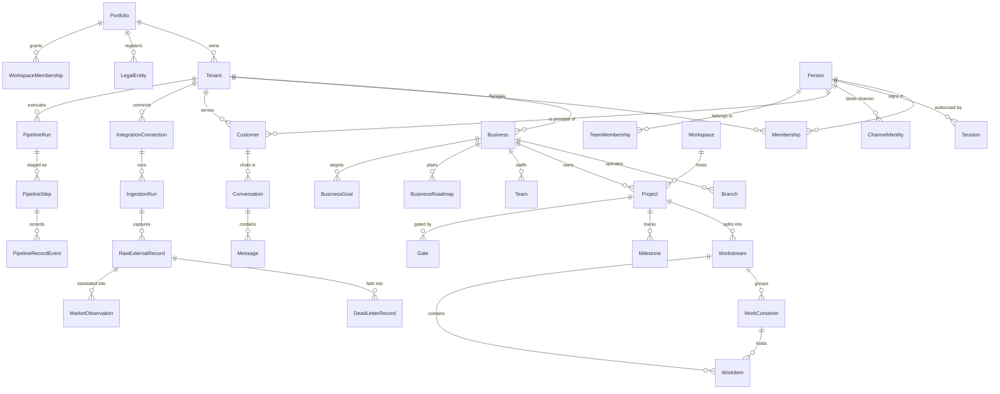

**สิ่งที่ diagram นี้ไม่ได้บอก:** `AuditEvent`, `Dependency` และ `ExternalRef` ไม่มี FK จริง
ไปหา entity ที่มันอ้าง — เก็บเป็น `(entityType, entityId)` แบบ polymorphic เพราะอ้างได้ทุกตาราง
ดูหมายเหตุในหัวข้อของแต่ละตัว

---

## 1. SCOPE CHAIN: Portfolio → Tenant → Business

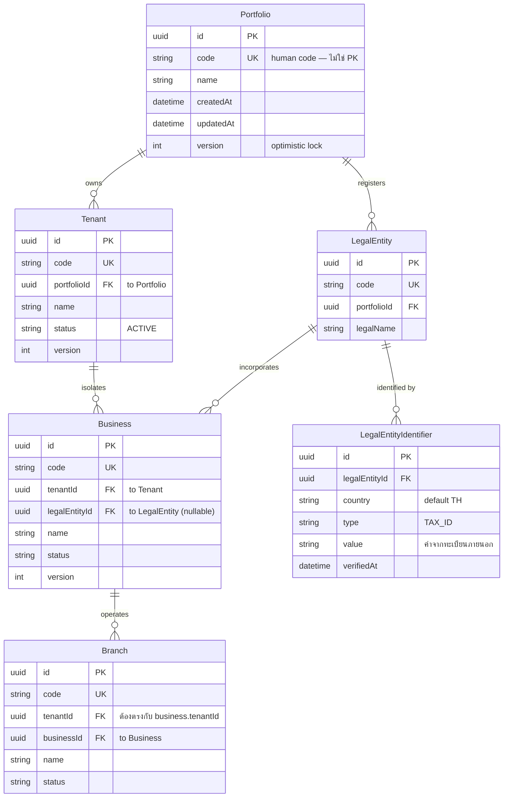

| Field | หมายเหตุ |
|---|---|
| `id` | UUID เสมอ — external id ไม่เคยเป็น PK (**BR-002**) |
| `code` | human-readable key, `@unique` ทั้งระบบ ไม่ใช่ per-tenant |
| `Tenant.portfolioId` | Tenant คือขอบเขต isolation จริง; Portfolio คือเครือที่ครอบมัน |
| `Business.legalEntityId` | nullable — ธุรกิจปฏิบัติการมีก่อนนิติบุคคลได้ |
| `Branch.tenantId` | denormalized เพื่อ query แต่ต้องตรงกับ `business.tenantId` (มี test บังคับ) |
| `LegalEntityIdentifier` | `@@unique([country, type, value])` — เลขทะเบียนภายนอกเป็น *attribute* ไม่ใช่ PK |
| `version` | optimistic concurrency บน aggregate root ทุกตัว |

**Spec:** BR-001 (scope chain) · BR-002 (external ids ไม่เป็น PK) · SEC-001 (Business = หน่วยสิทธิ์)
**Gotcha:** ไม่มี principal ใดถือสิทธิ์เหนือระดับ Business ได้ — viewer contract มีแต่
Business-keyed grants (SDD-037)

---

## 2. IDENTITY: Person, Membership, Session

`Person` คือ principal เดียวของระบบ (ADR-003 §D10) — ไม่มี Employee/User แยก
`Membership` คือ **authority record** ตัวเดียวที่ `resolveViewer` อ่าน

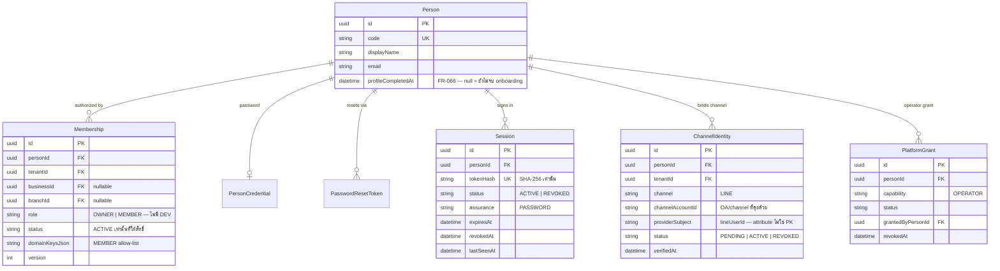

| Field | หมายเหตุ |
|---|---|
| `Membership.status` | เฉพาะ `ACTIVE` เท่านั้นที่ให้ authority — แถวที่เพิกถอนแล้วยังอยู่เพื่อประวัติ (FR-038, FR-094) |
| `Membership.role` | `MEMBERSHIP_ROLES = ['OWNER', 'MEMBER']` เท่านั้น — **`DEV` ไม่ใช่ค่าในคอลัมน์นี้** มันเป็น role ระดับ *viewer* ที่ `resolveViewer` คืนเมื่อมี platform grant และตั้งใจให้ `ownedBusinessIds` ว่างเสมอ (FR-074) เก็บ `DEV` ลง Membership คือการเปลี่ยน visibility ให้กลายเป็น ownership |
| `Membership.domainKeysJson` | allow-list ของ MEMBER; OWNER/DEV ได้สิทธิ์จาก `role` ไม่ใช่จากลิสต์นี้ |
| `Session.tokenHash` | cookie ที่เซ็นแล้วเป็นแค่ transport — **แถวนี้คือ authority ที่เพิกถอนได้** (FR-095) |
| `Session` revocation | เพิกถอนแล้วมีผล request ถัดไป (วินัย NFR-019) |
| `ChannelIdentity` | `@@unique([tenantId, channel, channelAccountId, providerSubject])` — namespace ต่อ tenant ไม่ใช่ global |
| `PlatformGrant` | **ที่เดียว** ที่ทำให้ web session เป็น installation operator (FR-107/FR-075) — role, ownership, `isPlatform` ไม่ให้สิทธิ์นี้ |
| `PersonCredential` / `PasswordResetToken` | FR-090 — ตารางมีจริงบน Supabase แล้ว แต่ service ที่ใช้ยังอยู่บน branch `codex/postgres-primary-runtime` |

**Spec:** FR-094…FR-097, FR-107 · ADR-045 D1–D5 · SDD-052, SEC-018, BR-020
**Gotcha:** อย่ารวม grouping เข้ากับ authority ในแถวเดียว — การรวมแบบนั้นคือสิ่งที่ทำให้ POST
ที่ไม่ authenticate ออก owner authority ได้เมื่อ 2026-08-17 (ดู `TeamMembership` §5)

---

## 3. IDENTITY: Workspace collaboration & non-interactive keys

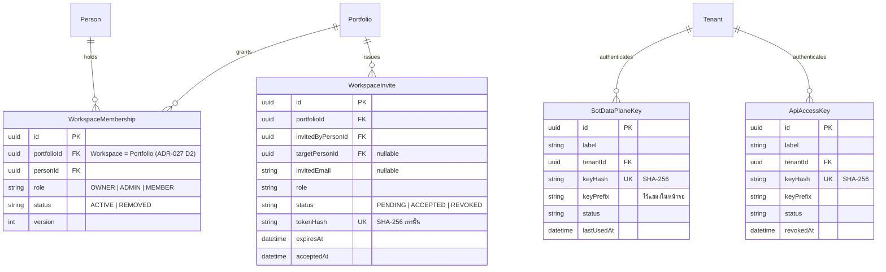

| Field | หมายเหตุ |
|---|---|
| `WorkspaceMembership.portfolioId` | Workspace ที่ผู้ใช้เห็น **คือ** `Portfolio` — ไม่ใช่ model ชื่อ `Workspace` (นั่นคือ Space ใต้ Business) |
| authority layer | BR-016 — `resolveViewer` **ไม่เคยอ่าน** ตารางนี้ ถือ membership แล้วยังไม่เห็น Business ใด |
| `WorkspaceInvite.role` | `WORKSPACE_INVITE_ROLES` = roles ทั้งหมด **ลบ `OWNER` ออก** — คำเชิญ mint OWNER ไม่ได้ ความเป็นเจ้าของได้มาจากการสร้าง Workspace เท่านั้น |
| `WorkspaceInvite.tokenHash` | เก็บเฉพาะ digest (SEC-014); raw token คืนครั้งเดียวตอน mint |
| `EXPIRED` | ไม่ persist เป็น status — เทียบกับ `expiresAt` แบบ fail-closed ตอนรับคำเชิญ |
| `SotDataPlaneKey` / `ApiAccessKey` | bearer credential ผูก Tenant เดียว ไม่มี Person ไม่มี browser session (FR-102 / FR-106) |
| revocation | ไม่มี grace period — ต่างจาก `Session` เพราะ credential ที่ไม่มีคนใช้ ไม่มีใครสังเกตว่ารั่ว |

**Spec:** FR-067, FR-102, FR-106 · ADR-027 §D2/D5, ADR-047 · SEC-014, SEC-019, BR-016, SDD-038

---

## 4. IDENTITY: external identity mapping

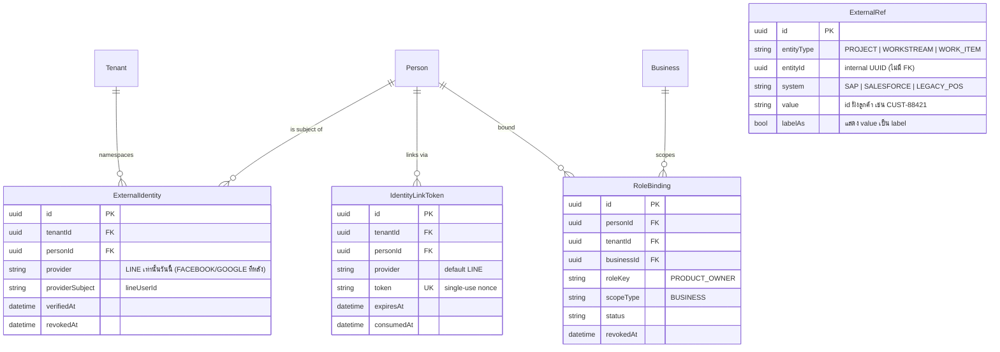

| Field | หมายเหตุ |
|---|---|
| `ExternalIdentity` | `@@unique([tenantId, provider, providerSubject])` — LINE userId เดียวกันอยู่คนละ tenant ได้ |
| `IdentityLinkToken` | ผูก channel subject เข้ากับ Person ที่**มีอยู่แล้ว** แทนการสร้าง Person ใหม่ (FR-022) |
| `ExternalRef` | polymorphic โดยตั้งใจ — `(entityType, entityId)` ไม่มี FK เพราะอ้างได้หลายตาราง (FR-019) |
| `ExternalRef.@@unique` | `[system, value]` — id ฝั่งลูกค้าไม่ชนกันในระบบเดียวกัน |
| `RoleBinding` | RBAC ระดับ Business แบบ generic; `PRODUCT_OWNER` คือ role ปัจจุบันของ Product (FR-076) |

**Spec:** FR-019, FR-021, FR-022, FR-076 · BR-002

---

## 5. PROJECT MANAGER: Workspace, Project, Team

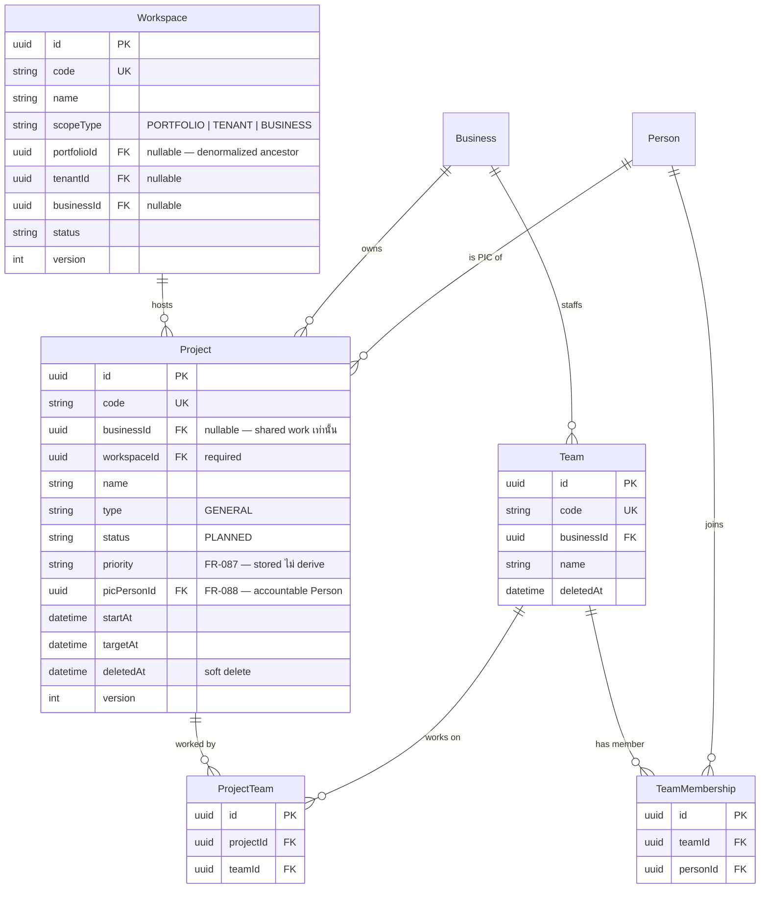

| Field | หมายเหตุ |
|---|---|
| `Workspace.scopeType` | ต้องมี scope ชัดเจน + denormalized ancestor id ตาม scope นั้น |
| `Workspace` ≠ Workspace ที่ผู้ใช้เห็น | model นี้คือ **Development Space** ใต้ Business; Workspace ในหน้าจอคือ `Portfolio` (§3) |
| `Project.businessId` | nullable — null คือ "shared work ที่ไม่มีเจ้าของ" อย่างชัดแจ้ง ไม่ใช่ค่าที่ลืมใส่ |
| `Project.priority` | เก็บจริง ไม่คำนวณ — เรียงตาม `targetAt` คือ deadline list ซึ่งเป็นคำตอบผิดใต้หัวข้อ "Priority" (ADR-036 D3) |
| `Project.picPersonId` | คนเดียวที่รับผิดชอบ; `onDelete` ปล่อย default — คนลาออกต้องไม่พา Project หายไปด้วย |
| `TeamMembership` | **ไม่มีคอลัมน์ `role` โดยตั้งใจ** — role บน Team คือ authority บน Team (ADR-037 D3) |
| `Team` grants nothing | BR-018 — `resolveViewer` ไม่อ่าน Team/TeamMembership เลย |
| `ProjectTeam` | m2m จริง — Project หนึ่งมีหลาย Team และ Team หนึ่งทำหลาย Project |

**Spec:** FR-043, FR-087, FR-088, FR-089 · ADR-014, ADR-036, ADR-037 · SDD-021, BR-001, BR-018

---

## 6. PROJECT MANAGER: Strategy (Roadmap → Goal → Project)

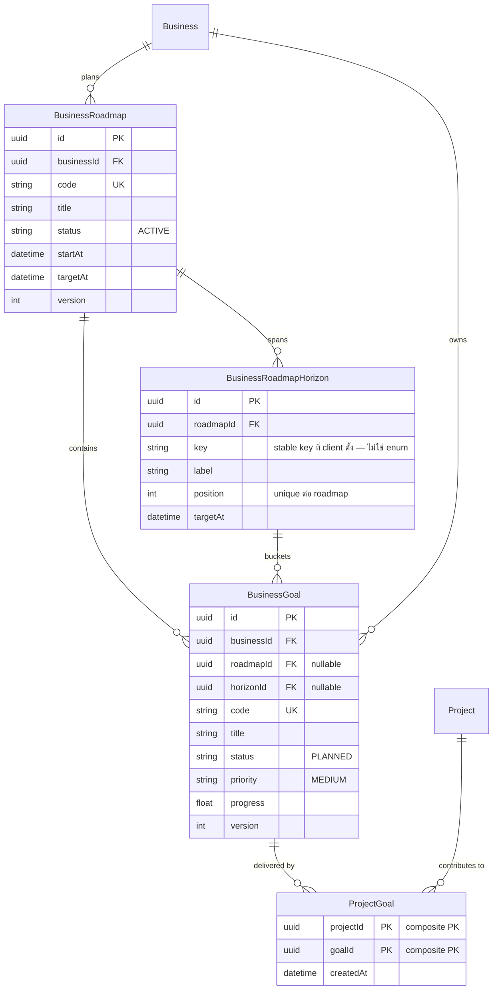

| Field | หมายเหตุ |
|---|---|
| `BusinessRoadmapHorizon.key` | ไม่ใช่ enum — เป็น stable key ที่ client ตั้ง service บังคับแค่ไม่ซ้ำ และใช้ key นี้ reconcile แทน delete-then-recreate (แถวเดิมจึงไม่หายพร้อม goal ที่ผูกอยู่) |
| `BusinessRoadmapHorizon` | `@@unique([roadmapId, key])` + `@@unique([roadmapId, position])` — service อนุญาต 2 หรือ 3 horizon |
| `BusinessGoal.roadmapId` / `horizonId` | nullable — goal มีได้ก่อนถูกจัดลง roadmap |
| `ProjectGoal` | `@@id([projectId, goalId])` — join table แท้ ไม่มี id ของตัวเอง |
| `BusinessGoal.progress` | float; ค่าที่แสดงบนหน้าจอคำนวณใหม่เสมอ ไม่เชื่อค่านี้แบบ blind |

**Spec:** FR-041 · แสดงผลที่ Strategy Overview

---

## 7. PROJECT MANAGER: Execution (7 modes)

`Workstream` คือหัวใจของ execution mode ทั้ง 7 โหมด — `WorkContainer`/`WorkItem`
เป็นโครงเดียวกันทุกโหมด ต่างกันที่ `subtype` และ `progressStrategy`


| Field | หมายเหตุ |
|---|---|
| `progressCache` | **advisory เท่านั้น** — progress คำนวณใหม่จาก pure calculator ใน `progress/` ทุกครั้ง อย่ารายงานตัวเลขที่หน้าจอจะไม่เห็นด้วย |
| `Gate.required` | gate ที่ยังไม่ผ่าน **cap** progress ไว้ (BR-006) ไม่ใช่แค่ป้ายเตือน |
| `WorkItem.assigneeRef` | คนทำชิ้นงานหนึ่ง — คนละเรื่องกับ `Project.picPersonId` (คนรับผิดชอบทั้ง Project) และ Team (ใคร*อาจ*ทำได้) |
| `Dependency` | `@@unique([sourceType, sourceId, targetType, targetId, dependencyType])`; cycle ถูกตรวจที่ service ไม่ใช่ที่ DB |
| `WorkContainer.parentId` | self-relation `ContainerHierarchy` — ลึกได้หลายชั้น |
| `deletedAt` | soft delete บน Workstream/WorkItem/Project — query ต้องกรองเอง |

**Spec:** BR-006 (gate caps progress) · SDD-002 · progress calculators อยู่ที่ `src/modules/project-manager/progress/`

---

## 8. PROJECT MANAGER: Files, repositories, import & audit


| Field | หมายเหตุ |
|---|---|
| `ProjectFile` | metadata/reference เท่านั้น — ไบต์จริงอยู่นอก MVP offline (FR-037) |
| `FileAsset.sha256` | identity ที่พกพาได้ของไฟล์ local ที่ระบบดูแล (FR-045) |
| `Repository.businessId` | nullable เพราะเป็นคอลัมน์ที่เพิ่มทีหลัง — repo ที่ไม่มี Business **ถูกปฏิเสธทุก principal** (FR-073) มี backfill script อยู่ที่ `scripts/backfill-repository-business.mjs` |
| ทำไมต้อง Business ไม่ใช่ Tenant | viewer contract มีแต่ Business-keyed grants — Repository ระดับ Tenant จะกลายเป็นของที่ไม่มีใครปกครองได้ (SDD-037) |
| `PlanImportReceipt` | ผูก client idempotency key เข้ากับ payload ที่ normalize แล้วและ execution run — **ไม่ใช่ Plan model ที่สอง** และไม่รับ execution id ที่ client สร้าง (FR-069, FR-070) |
| `AuditEvent` | ทุก write ผ่าน service ใน `application/` และต้องบันทึกลงที่นี่ — route handler บางเสมอ |

**Spec:** FR-037, FR-045, FR-069, FR-070, FR-073 · ADR-016, SDD-023

---

## 9. CRM: Customer & Conversation

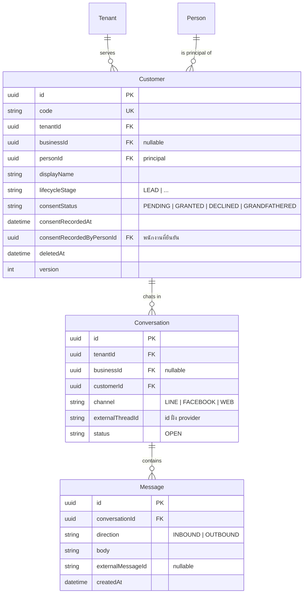

| Field | หมายเหตุ |
|---|---|
| `Customer.@@unique` | `[tenantId, personId]` — ธุรกิจใน tenant เดียวกัน **ใช้ customer ร่วมกัน** (การตัดสินใจ CRM-sharing, FR-023) |
| `Customer.consentStatus` | PDPA (SEC-005, FR-103) อยู่บนแถว Customer ตรง ๆ ไม่แยกตารางต่อ Business เพราะแถวนี้เป็นหน่วย sharing อยู่แล้ว |
| `GRANDFATHERED` | ค่า backfill ครั้งเดียวสำหรับแถวที่มีก่อนคอลัมน์นี้ — service ไม่เคยเขียนค่านี้ |
| `Conversation.@@unique` | `[tenantId, channel, externalThreadId]` — **ไม่ใช่ global unique**: global จะทำให้ thread id ของ tenant หนึ่งไปชี้ conversation ของอีก tenant (BR-002, SEC-001) |
| `Message.@@unique` | `[conversationId, externalMessageId]` — ไม่ denormalize `tenantId` ลงมา เพราะสำเนาความจริงชุดที่สองย่อม drift ได้; conversation ถูก scope ไว้แล้ว |
| ใครสร้างแถว | `line-ingest-service` เท่านั้น — agent domain **consume** conversation ไม่ได้สร้างเอง |

**Spec:** FR-023, FR-103 · SEC-005, BR-002, SEC-001

---

## 10. CRM: Customer import & human review

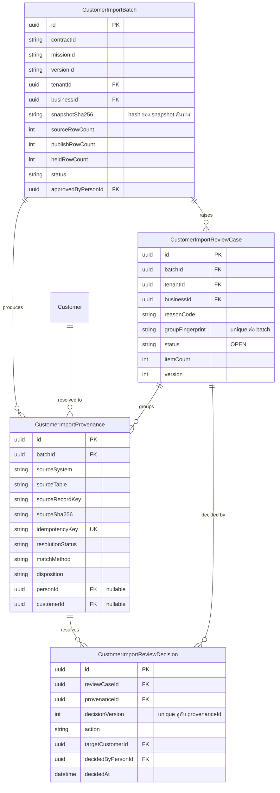

| Field | หมายเหตุ |
|---|---|
| `CustomerImportBatch.@@unique` | `[contractId, missionId, versionId, snapshotSha256]` — import ซ้ำจาก snapshot เดิมไม่สร้าง batch ใหม่ |
| `CustomerImportProvenance.@@unique` | `[sourceSystem, sourceTable, sourceRecordKey, snapshotSha256]` + `idempotencyKey` unique — replay ปลอดภัย |
| `disposition` / `resolutionStatus` | แถวหนึ่งบอกได้ว่า "มาจากไหน แมตช์ด้วยวิธีใด ลงเอยยังไง" ครบในตัวเอง |
| `decisionVersion` | `@@unique([provenanceId, decisionVersion])` — เปลี่ยนใจได้ แต่ทุกครั้งเป็นแถวใหม่ ไม่ทับของเดิม |
| หลักการ | ทุก intake surface ลงมาที่ envelope เดียว → validate → semantic check → dry run → preview → transaction เดียว → audit (BR-009, SDD-009) |

**Spec:** BR-009, SDD-009 · surface: `/platform/customer-import-reviews`

---

## 11. INTEGRATION: providers, connections, ingestion


| Field | หมายเหตุ |
|---|---|
| `IntegrationCredential.secretRef` | เก็บ **reference** ไปยัง secret manager เท่านั้น ไม่เคยเก็บ secret ในตาราง (SEC-015) |
| `IntegrationConnection.@@unique` | `[tenantId, providerId, externalAccountId]` — บัญชีเดียวกันเชื่อมซ้ำใน tenant เดียวไม่ได้ |
| active-primary invariant | partial unique index ฝั่ง production เป็น Postgres DDL เพิ่มเติม ไม่ได้อยู่ใน Prisma schema |
| `RawExternalRecord.payloadJson` | payload ดิบแบบ verbatim = หลักฐานที่ replay ได้ (FR-081) ไม่แก้ ไม่ normalize |
| `DeadLetterRecord.failureOwner` | ความล้มเหลวที่มี**เจ้าของชื่อจริง** — ไม่ใช่ log ที่ไม่มีใครรับผิดชอบ |
| `ExternalEntityRef` | external → internal mapping; external id ไม่เคยเป็น PK (BR-002) |

**Spec:** FR-079, FR-080, FR-081 · ADR-031 §D2/D3 · SDD-043, SEC-015

---

## 12. SoT PIPELINE: execution ledger & human decisions

`PipelineRun` คือบัญชีเดินสะพัดของ data pipeline ทั้งเส้น — server เป็นเจ้าของ execution id
ทุกตัว ไม่รับ id ที่ client ส่งมา

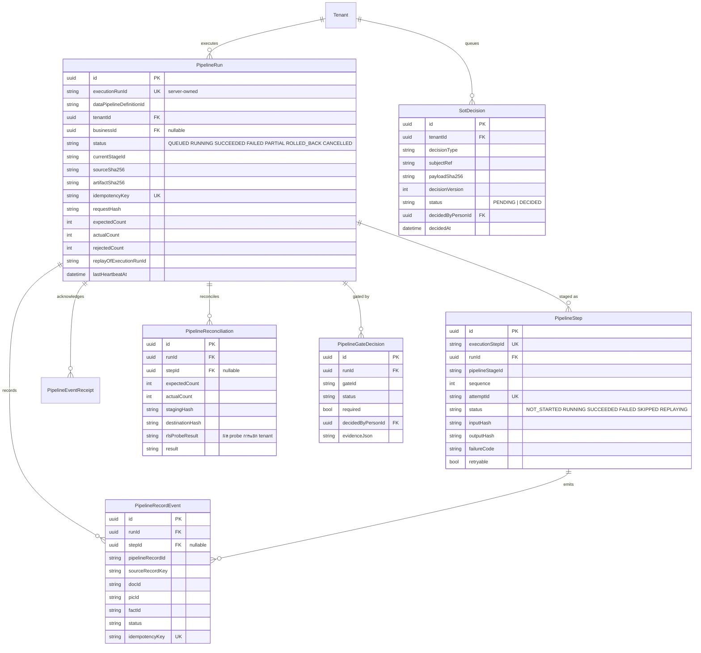

| Field | หมายเหตุ |
|---|---|
| `executionRunId` / `executionStepId` / `attemptId` | server-owned ทั้งหมด และ `@unique` — client ส่ง execution id มาไม่ได้ (SEC-003, SEC-008) |
| count 7 ตัว | `expected/actual/inserted/updated/unchanged/failed/rejected` — reconciliation เทียบตัวเลขเหล่านี้ ไม่ใช่เชื่อ status |
| `rlsProbeResult` / `isolationResult` | หลักฐานว่า tenant isolation ยัง holding ในรอบนั้นจริง ไม่ใช่สมมติ |
| `PipelineRecordEvent.idempotencyKey` | unique — replay ระดับ record เดียวไม่สร้าง event ซ้ำ |
| `SotDecision` | คิวการตัดสินใจของมนุษย์: data plane ส่งข้อเท็จจริงที่ค้าง → คนตัดสินในเบราว์เซอร์ → data plane ดึงแถวที่ตัดสินแล้วด้วย cursor (FR-096, ADR-043 interim) |
| `SotDecision.@@unique` | `[tenantId, decisionType, subjectRef, decisionVersion]` |

**Spec:** FR-071, FR-096 · ADR-030 D2–D6, ADR-043 · SDD-042, SEC-002, SEC-003, SEC-008

---

## 13. MARKET INTELLIGENCE: translated market evidence

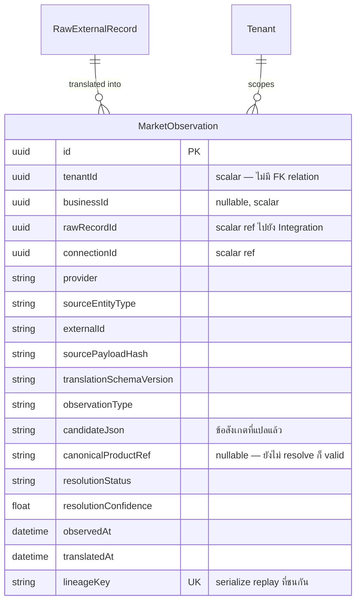

| Field | หมายเหตุ |
|---|---|
| ทำไม ref เป็น scalar | `rawRecordId` / `connectionId` เป็นคอลัมน์ธรรมดา ไม่ประกาศเป็น Prisma relation — เพื่อรักษาขอบเขตว่า Integration ยังเป็นเจ้าของ raw record (BR-019) |
| `lineageKey` | `@unique` — replay สองรอบพร้อมกันถูก serialize โดยไม่ต้องให้ Market เป็นเจ้าของ source record |
| `canonicalProductRef` null | ข้อสังเกตที่ยัง resolve ไม่ได้ **ยังเป็นข้อมูลที่ถูกต้อง** ไม่ใช่ error |
| model เดียวในโดเมนนี้ | ชื่ออื่นใน charter (PriceObservation, Watchlist, …) เป็น *candidate concept* จนกว่าจะมี FR ของตัวเอง |

**Spec:** FR-092 · ADR-038 · SDD-049, BR-019, SEC-017

---

## 14. Domain ownership map

preflight บังคับว่า model หนึ่งถูก claim ได้โดย charter เดียว — ตารางนี้อ่านจาก
`docs/domains/<d>/CHARTER.md` frontmatter (`owns_models`)

| Domain | Models | จำนวน |
|---|---|---|
| **project-manager** | Portfolio, Tenant, LegalEntity, LegalEntityIdentifier, Business, Branch, Workspace, Project, BusinessRoadmap, BusinessRoadmapHorizon, BusinessGoal, ProjectGoal, Workstream, WorkContainer, WorkItem, Milestone, Gate, Dependency, Repository, ProjectRepository, ProjectFile, Team, TeamMembership, ProjectTeam, LocalWorkspaceMount, FileAsset, FileLink, Membership, AuditEvent, PlanImportReceipt | 30 |
| **identity** | ExternalIdentity, IdentityLinkToken, ExternalRef, RoleBinding, PersonCredential, PasswordResetToken, Session, ChannelIdentity, SotDataPlaneKey, WorkspaceMembership, WorkspaceInvite, ApiAccessKey, PlatformGrant | 13 |
| **crm** | Person, Customer, CustomerImportBatch, CustomerImportProvenance, CustomerImportReviewCase, CustomerImportReviewDecision, Conversation, Message | 8 |
| **integration** | IntegrationProvider, IntegrationConnection, IntegrationCredential, IngestionRun, RawExternalRecord, SyncCursor, ExternalEntityRef, DeadLetterRecord, SotDecision, PipelineRun, PipelineStep, PipelineEventReceipt, PipelineRecordEvent, PipelineReconciliation, PipelineGateDecision | 15 |
| **market-intelligence** | MarketObservation | 1 |
| **agent** | — (ไม่มีโดยตั้งใจ: state อยู่ใน production Postgres `zuri_core.*` + MSP vault) | 0 |
| **knowledge** | — (ไม่มีโดยตั้งใจ: store คือ `zuri_core.business_knowledge` หลัง knowledge port) | 0 |
| **platform-control** | — (ไม่มีโดยตั้งใจ: projection ที่ถอดออกได้ ไม่ถือ persistence model) | 0 |
| | **รวม** | **67** |

> **ครบพอดี:** 67 model ใน `prisma/schema.prisma` ถูก claim ครบทุกตัว ไม่มี model กำพร้า
> และไม่มีชื่อใน charter ที่ไม่มีอยู่จริงใน schema (ตรวจซ้ำได้ด้วยสคริปต์ท้ายเอกสาร §20)
> Pipeline ทั้ง 6 ตัวอยู่ในเลน **integration** — `docs/domains/knowledge/CHARTER.md`
> อ้างถึงมันในเนื้อความเพราะ knowledge *เรียกใช้* `createPipelineRun` ของเลนนั้น ไม่ได้เป็นเจ้าของ

---

## 15. Key Data Flows

### 15.1 LINE turn → Conversation → Agent

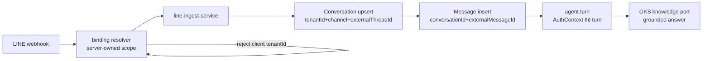

ขอบเขต production มาจาก **binding ที่ server เป็นเจ้าของเท่านั้น** — `tenantId`/`businessId`
ที่ client ส่งมาถูกปฏิเสธก่อนงาน turn ใด ๆ จะเริ่ม (FR-052, SEC-010)

### 15.2 Intake convergence — ทุก surface ลงท่อเดียว

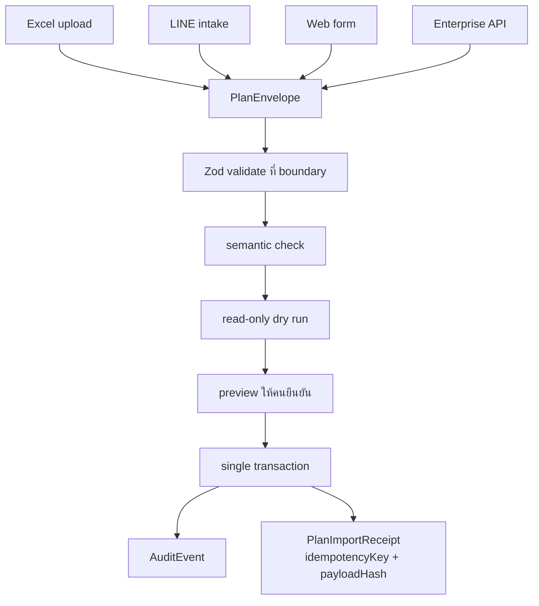

surface ใหม่เพิ่ม **converter** ไม่เคยเพิ่ม write path ที่สอง (BR-009, SDD-009)
และ **plan คือข้อมูล ไม่ใช่คำสั่ง** — ไม่มีอะไรใน envelope ถูก execute (BR-007, SEC-002)

### 15.3 External ingestion → market observation

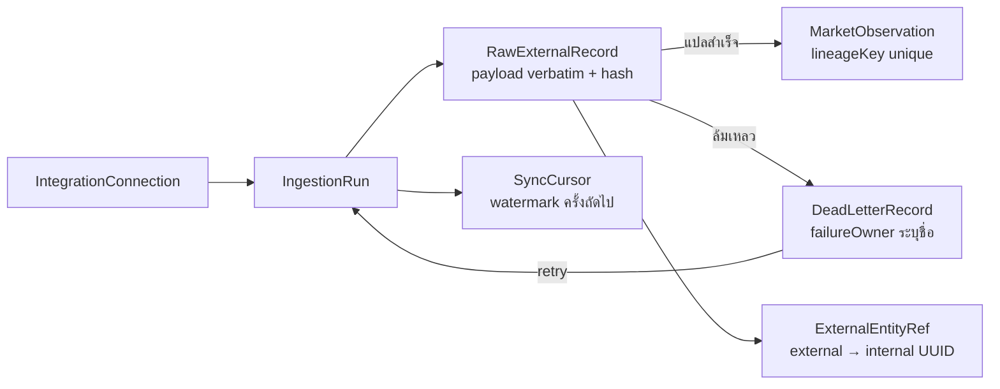

### 15.4 Progress roll-up — ทำไม `progressCache` เชื่อไม่ได้

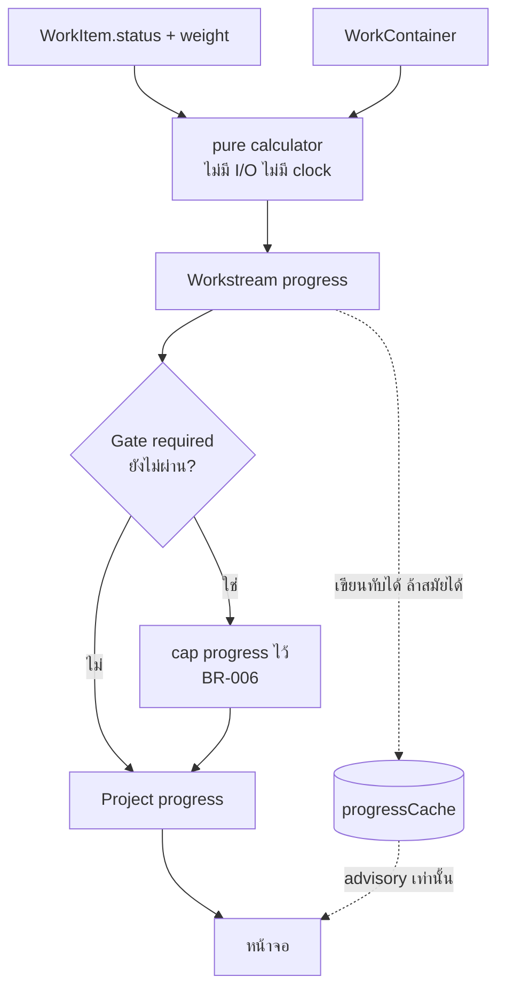

---

## 16. Index Strategy

| Table | Index | Purpose |
|---|---|---|
| `Tenant` | `(portfolioId)` | ไล่ scope chain ลง |
| `Business` | `(tenantId)` | tenant filter — query แรกของแทบทุกหน้า |
| `Membership` | `(personId, status)` · `(tenantId, status)` | resolveViewer ต่อ request |
| `Session` | `(personId, status)` · `(expiresAt, status)` | ตรวจ session + งานกวาด session หมดอายุ |
| `ChannelIdentity` | `(tenantId, channel, channelAccountId, providerSubject)` UNIQUE | ผูก LINE subject แบบ tenant-partitioned |
| `PlatformGrant` | `(personId, capability)` UNIQUE · `(capability, status)` | ตรวจ operator ต่อ request |
| `WorkspaceMembership` | `(portfolioId, personId)` UNIQUE | หนึ่งคนหนึ่ง membership ต่อ Workspace |
| `Project` | `(businessId)` · `(status)` · `(priority)` · `(picPersonId)` | Dashboard: Top 5 Priority, My Projects |
| `Workstream` | `(projectId)` · `(executionMode)` · `(laneId)` | progress roll-up ต่อ project |
| `WorkItem` | `(workstreamId)` · `(containerId)` · `(status)` | โหลด board ต่อ workstream |
| `Dependency` | `(sourceType, sourceId)` · `(targetType, targetId)` | ตรวจ cycle สองทิศ |
| `Customer` | `(tenantId, personId)` UNIQUE · `(consentStatus)` | CRM sharing + รายงาน PDPA |
| `Conversation` | `(tenantId, channel, externalThreadId)` UNIQUE · `(customerId)` | upsert จาก webhook แบบ idempotent |
| `Message` | `(conversationId, externalMessageId)` UNIQUE | กันข้อความซ้ำจาก provider retry |
| `RawExternalRecord` | `idempotencyKey` UNIQUE · `(connectionId, entityType, externalId)` | replay-safe ingestion |
| `SyncCursor` | `(connectionId, resourceType)` UNIQUE | watermark หนึ่งเดียวต่อ resource |
| `ExternalEntityRef` | `(connectionId, entityType, externalId)` UNIQUE | external → internal mapping |
| `PipelineRun` | `executionRunId` UNIQUE · `idempotencyKey` UNIQUE · `(tenantId, status)` | ledger lookup + กัน run ซ้ำ |
| `PipelineRecordEvent` | `idempotencyKey` UNIQUE · `(docId)` · `(picId)` · `(factId)` | ไล่รอย record เดียวข้าม stage |
| `MarketObservation` | `lineageKey` UNIQUE · `(tenantId, businessId, observedAt)` | serialize replay + query ตามช่วงเวลา |
| `AuditEvent` | `(entityType, entityId)` · `(occurredAt)` | "ใครทำอะไรกับแถวนี้" + timeline |

---

## 17. Naming Conventions

| Convention | Example | Rule |
|---|---|---|
| Model name | `WorkItem` | PascalCase เอกพจน์ (Prisma) |
| PK | `id` | UUID เสมอ — `@id @default(uuid())` |
| Human key | `code` | `@unique` ทั้งระบบ อ่านออก แต่ไม่ใช่ PK |
| External id | `externalId`, `providerSubject`, `value` | เป็น *attribute* เท่านั้น ไม่เคยเป็น PK (**BR-002**) |
| FK column | `tenantId`, `businessId`, `projectId` | camelCase `<parent>Id` |
| Timestamps | `createdAt` / `updatedAt` | `@default(now())` / `@updatedAt` แทบทุกตาราง |
| Soft delete | `deletedAt` | nullable DateTime — query ต้องกรองเอง |
| Concurrency | `version` | `Int @default(1)` บน aggregate root |
| Enum | `status`, `role`, `subtype` | **เก็บเป็น string** — source of truth คือ `src/lib/validation/enums.js` |
| JSON | `metadataJson`, `evidenceJson`, `payloadJson` | suffix `Json`, เก็บเป็น **string** (SQLite compat) |
| Hash / secret | `tokenHash`, `keyHash`, `payloadHash`, `sha256` | เก็บเฉพาะ digest — raw secret ไม่เคยลง DB |
| Boolean | `required`, `retryable`, `labelAs` | ไม่มี prefix `is_` ในโปรเจกต์นี้ |

**ทำไม enum เป็น string:** SQLite dev/test ไม่มี native enum และ `src/lib/validation/enums.js`
เป็นแหล่งความจริงที่ Excel dropdown, OpenAPI และ Zod validation อ่านร่วมกัน —
อย่าคัดลอกรายการ enum ด้วยมือที่ไหนอีก

### 17.1 คอลัมน์ string ตัวไหน มาจาก enum ตัวไหน

`src/lib/validation/enums.js` — โดเมนธุรกิจหลัก:

| Column | Constant | Values |
|---|---|---|
| `Membership.role` | `MEMBERSHIP_ROLES` | OWNER · MEMBER |
| `WorkspaceMembership.role` | `WORKSPACE_MEMBERSHIP_ROLES` | OWNER · ADMIN · MEMBER |
| `WorkspaceMembership.status` | `WORKSPACE_MEMBERSHIP_STATUSES` | ACTIVE · REMOVED |
| `WorkspaceInvite.role` | `WORKSPACE_INVITE_ROLES` | ADMIN · MEMBER (OWNER ถูกกรองออก) |
| `WorkspaceInvite.status` | `WORKSPACE_INVITE_STATUSES` | PENDING · ACCEPTED · REVOKED |
| `Workspace.scopeType` | `WORKSPACE_SCOPE_TYPES` | PORTFOLIO · TENANT · BUSINESS |
| `Project.status` | `PROJECT_STATUSES` | PLANNED · ACTIVE · ON_HOLD · DONE · ARCHIVED |
| `Project.priority` | `PROJECT_PRIORITIES` | CRITICAL · HIGH · MEDIUM · LOW |
| `Workstream.status` | `WORKSTREAM_STATUSES` | เหมือน PROJECT_STATUSES |
| `Workstream.executionMode` | `EXECUTION_MODES` | SOFTWARE_SPRINT · DATA_MIGRATION · B2B_SALES · B2C_CAMPAIGN · PRODUCT_LAUNCH · OPERATIONS · BUSINESS_EXPANSION |
| `Workstream.progressStrategy` | `PROGRESS_STRATEGIES` | TASK_WEIGHT · RECORD_VALIDATION · WEIGHTED_PIPELINE · KPI_ATTAINMENT · MILESTONE_READINESS · SLA_SCORE · EXPANSION_READINESS |
| `WorkContainer.subtype` | `CONTAINER_SUBTYPES` | 15 ค่า (SPRINT, EPIC, MIGRATION_STAGE, …) |
| `WorkContainer.status` | `CONTAINER_STATUSES` | PLANNED · ACTIVE |
| `WorkItem.subtype` | `ITEM_SUBTYPES` | 17 ค่า (TASK, BUG, DATASET, DEAL, …) |
| `WorkItem.status` | `WORK_STATUSES` | PLANNED · READY · IN_PROGRESS · REVIEW · BLOCKED · DONE · CANCELLED |
| `Milestone.status` | `MILESTONE_STATUSES` | PLANNED · IN_PROGRESS · DONE · MISSED |
| `Gate.status` | `GATE_STATUSES` | OPEN · PASSED · BLOCKED · WAIVED |
| `Dependency.dependencyType` | `DEPENDENCY_TYPES` | BLOCKS · REQUIRES · RELATES_TO · START_AFTER · FINISH_BEFORE · SUPERSEDES · DERIVES_FROM |
| `Dependency.sourceType` / `targetType` | `DEPENDENCY_ENDPOINT_TYPES` | PROJECT · WORKSTREAM · MILESTONE · GATE · WORK_CONTAINER · WORK_ITEM |
| `BusinessRoadmap.status` | `ROADMAP_STATUSES` | ACTIVE · ARCHIVED |
| `BusinessGoal.status` | `GOAL_STATUSES` | PLANNED · ACTIVE · DONE · ARCHIVED |
| `BusinessGoal.priority` | `GOAL_PRIORITIES` | MEDIUM · HIGH |
| `Conversation.channel` | `CHANNELS` | LINE · FACEBOOK · WEB |
| `Message.direction` | `MESSAGE_DIRECTIONS` | INBOUND · OUTBOUND |
| `Customer.lifecycleStage` | `CUSTOMER_LIFECYCLE` | LEAD · ACTIVE · DORMANT · LOST |
| `Customer.consentStatus` | `CUSTOMER_CONSENT_STATUSES` | PENDING · GRANTED · DECLINED · GRANDFATHERED |
| `ExternalIdentity.provider` | `IDENTITY_PROVIDERS` | LINE (ค่าเดียว) |

`src/platform/integrations/core/pipeline-tracking-contract.js` — **แหล่ง enum ที่สอง**
สำหรับ pipeline ledger:

| Column | Constant | Values |
|---|---|---|
| `PipelineRun.status` | `RUN_STATUSES` | QUEUED · RUNNING · SUCCEEDED · FAILED · PARTIAL · ROLLED_BACK · CANCELLED |
| `PipelineStep.status` | `STEP_STATUSES` | NOT_STARTED · RUNNING · SUCCEEDED · FAILED · SKIPPED · REPLAYING |
| `PipelineRecordEvent.status` | `RECORD_STATUSES` | เหมือน STEP_STATUSES |
| `PipelineGateDecision.status` | `GATE_STATUSES` | PENDING · APPROVED · REJECTED · WAIVED |

> **ชื่อชนกัน — อ่านให้ดี:** `GATE_STATUSES` ถูกประกาศใน **สองไฟล์** ด้วย **คนละค่า** —
> `enums.js` คือ `OPEN/PASSED/BLOCKED/WAIVED` (Gate ของ Project) ส่วน
> `pipeline-tracking-contract.js` คือ `PENDING/APPROVED/REJECTED/WAIVED`
> (`PipelineGateDecision`) import ผิดไฟล์แล้ว Zod จะยังผ่าน แต่ค่าที่ยอมรับจะผิดทั้งชุด
> ตรวจ import path ก่อนใช้ constant ชื่อนี้เสมอ

**ไม่มี enum กลาง** สำหรับคอลัมน์ฝั่ง integration/ingestion (`IngestionRun.status`,
`RawExternalRecord.processingStatus`, `DeadLetterRecord.status`,
`IntegrationConnection.role/status`, `SotDecision.status`) — ค่าถูกกำหนดที่ service
ที่เขียนแถวนั้น ค่าใน diagram ข้างบนจึงเป็นค่า default จาก schema ไม่ใช่รายการที่ครบ

---

## 18. Snapshot coverage (backup/restore contract)

ทุก model ต้องอยู่ใน `SNAPSHOT_MODELS` (เรียงพ่อก่อนลูก) **หรือ** อยู่ใน
`SNAPSHOT_EXCLUDED_MODELS` พร้อมเหตุผลว่าทำไมกู้คืนไม่ได้ ทั้งคู่อยู่ใน
`src/modules/project-manager/application/backup-service.js`

preflight check `snapshot-coverage` อ่าน `prisma/schema.prisma` โดยตรง —
**model ที่ไม่อยู่ในลิสต์ไหนเลยคือ CRITICAL** เพราะ restore จะไม่ export ไม่ลบ
และไม่คืนตารางนั้น ผลคือ backup ที่ดูเขียวแต่กู้ข้อมูลกลับไม่ครบ

---

## 19. Dev / Production parity

| | Dev / Test | Production |
|---|---|---|
| Engine | SQLite (`prisma/dev.db`, `prisma/.test-dbs/`) | Postgres / Supabase |
| Schema file | `prisma/schema.prisma` | `prisma/schema.postgres.prisma` (generated) |
| Enum | string column | string column (เหมือนกันโดยตั้งใจ) |
| JSON | string column | string column |
| Migration ledger | `prisma/migrations/` | `supabase_migrations.schema_migrations` |
| RLS / partial index | ไม่มี | เพิ่มด้วย DDL แยกใน `prisma/postgres/` |

**Gotcha:** invariant บางข้อ (active-primary connection, RLS) มีอยู่เฉพาะฝั่ง Postgres
ในรูป DDL เพิ่มเติม — อ่าน schema Prisma อย่างเดียวจะไม่เห็น ดู
[DB-MIGRATION-NOTES](../../DB-MIGRATION-NOTES.md)

---

## 20. Keeping this document honest

เอกสารนี้เขียนด้วยมือจาก `prisma/schema.prisma` **ไม่ใช่ไฟล์ generated** — `docs:graph`
ไม่ได้สร้างมัน แปลว่าไม่มี guard ตัวไหนจับได้ถ้ามัน drift ตรวจสามอย่างนี้เองหลังแก้ schema:

```bash
grep -c "^model " prisma/schema.prisma
```

ตัวเลขที่ได้ต้องตรงกับ `model_count` ใน frontmatter และผลรวมในตาราง §14

```bash
node -e "const fs=require('fs');const doms=fs.readdirSync('docs/domains');const owned=new Map();for(const d of doms){const fm=(fs.readFileSync('docs/domains/'+d+'/CHARTER.md','utf8').split('---')[1]||'');let on=false;const l=[];for(const line of fm.split(/\r?\n/)){if(/^owns_models:/.test(line)){on=!/\[\]/.test(line);continue}if(on){const m=line.match(/^  - (\w+)\s*$/);if(m)l.push(m[1]);else on=false}}owned.set(d,l)}const models=[...fs.readFileSync('prisma/schema.prisma','utf8').matchAll(/^model (\w+) \{/gm)].map(m=>m[1]);const claimed=new Set([...owned.values()].flat());for(const[d,l]of owned)console.log(d,l.length);console.log('unclaimed:',models.filter(m=>!claimed.has(m)).join(', ')||'(none)');console.log('phantom:',[...claimed].filter(m=>!models.includes(m)).join(', ')||'(none)')"
```

`unclaimed` และ `phantom` ต้องว่างทั้งคู่ และตัวเลขต่อโดเมนต้องตรงกับ §14

```bash
npm run govern
```

รันเป็นชุด ไม่ใช่รันสามคำสั่งเรียงตามที่จำได้ — preflight สอง check อ่าน graph ที่ commit ไว้
ลำดับจึงเป็น graph → check → preflight เสมอ
