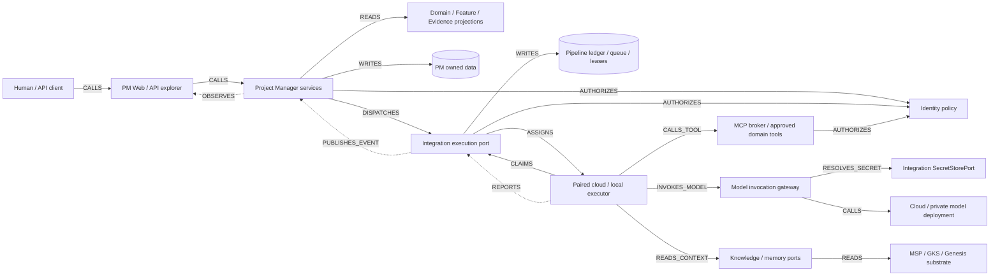
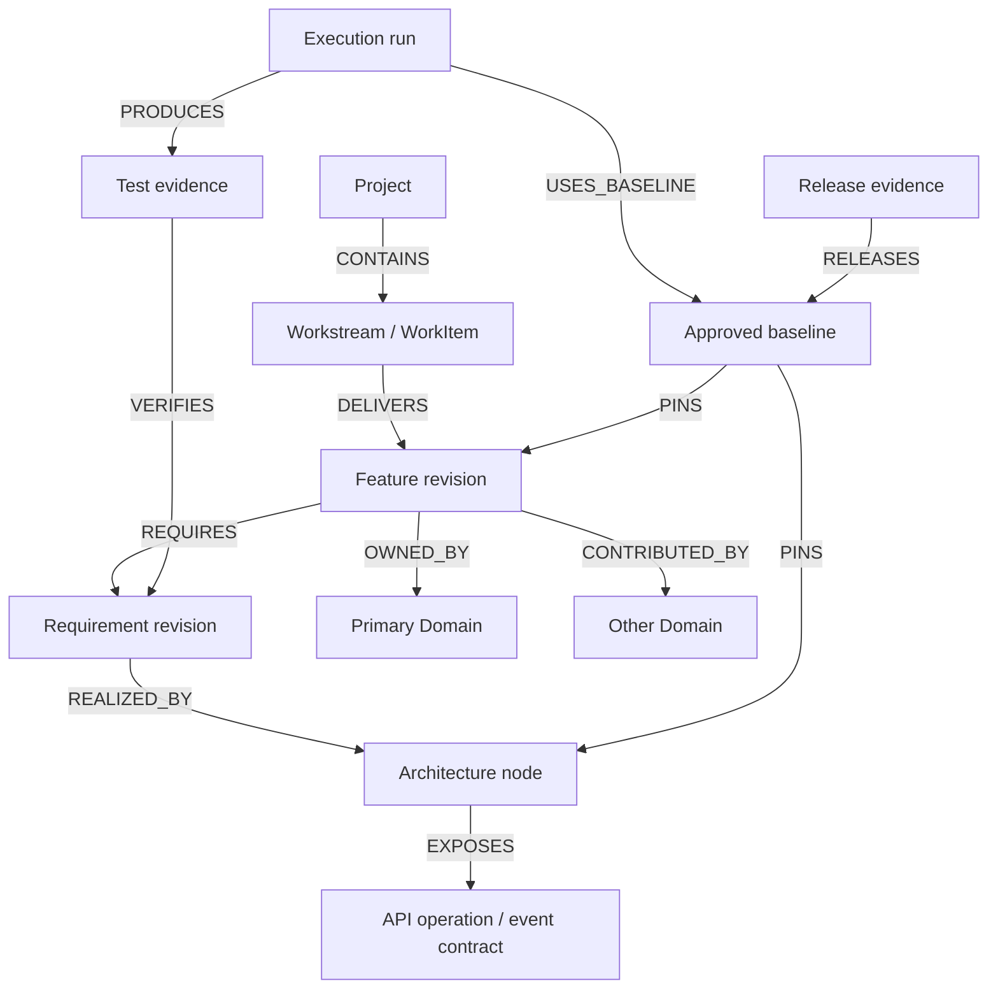
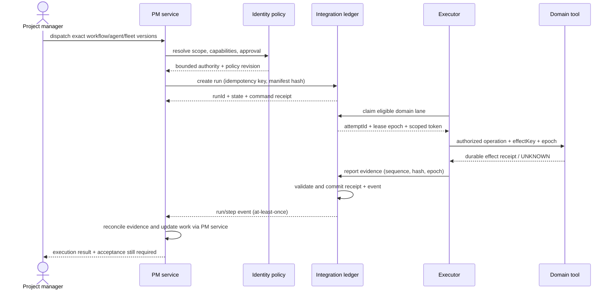
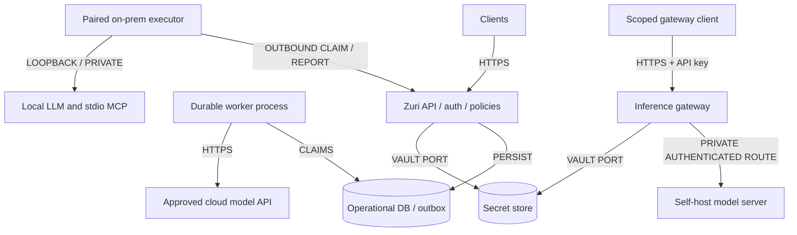

# Decisions & Diagrams

**Version:** 0.1.0b · **Status:** Candidate

## 1. Decision register

ทุก PMD เป็นข้อเสนอในชุดนี้ ไม่แก้สถานะ ADR เดิม

| ID | Proposed decision | Alternative / reason / consequence |
|---|---|---|
| PMD-01 | Domain/Feature เป็น independent projections บน IDs/relationships เดียว | แยกสองฐานข้อมูลจะทำให้ ownership, totals และ readiness drift |
| PMD-02 | PM owns project definitions/design/inventory/UI; Integration owns durable execution ledger and transport | สร้าง AgentRun store ใหม่ซ้ำ PipelineRun ทำให้ outcome สองชุด; ใช้ namespace/profile เพิ่มผ่าน port |
| PMD-03 | Agent runtime domain ยังคง LINE/business-turn orchestrator; product-delivery agents เป็น PM definitions ที่ทำงานผ่าน Integration executor | ไม่ขยาย authority ของ agent domain ตามชื่อ “Agent command center” |
| PMD-04 | ใช้ ADR-026: orchestrator → domain desks, role workers ภายใน attempt; one writer per lane | ไม่ทำ recursive manager hierarchy หรือ adaptive scheduling ใน baseline นี้ |
| PMD-05 | Approved versions immutable; Run pins bundle hashes and exact versions | “latest” เปลี่ยนกลาง run ตรวจย้อนหลังไม่ได้; edit สร้าง revision ใหม่ |
| PMD-06 | Graph model + schemas เป็น semantic source; Mermaid/canvas/code scaffolds เป็น derived consumers | รูป PNG หรือ node positions ไม่เพียงพอสำหรับ code generation |
| PMD-07 | Model inference และ MCP เป็น connector kinds คนละชนิด; capability probe ไม่เท่ากับ authorization | MCP tool discovery ไม่ใช่สิทธิ์ execute และไม่ใช่ model API |
| PMD-08 | Self-host ใช้ authenticated inference gateway; executor pull สำหรับ private hosts | ไม่บังคับเปิด raw local LLM/MCP port สู่อินเทอร์เน็ต |
| PMD-09 | AuthContext/capability intersection บังคับทุก attempt/tool call; secrets ใช้ Integration vault | Agent inventory, Team, fleet member, prompt หรือ graph edge ไม่เป็น grant |
| PMD-10 | Local checks, hosted CI, deployment และ activation แยก evidence levels | สำเร็จหนึ่ง gate ไม่ promote gate อื่นโดย inference |
| PMD-11 | API contract candidate ใช้ OpenAPI 3.0.3 ให้ตรง generator V3 เดิม; execution workflow schema ใช้ JSON Schema 2020-12 | ไม่บังคับ upgrade runtime libraries เพื่อทำ explorer; เปลี่ยน dialect เป็น separate compatibility decision |
| PMD-12 | Read models rebuildable; graph/trace/generated docs ไม่แก้ด้วยมือ | CI สร้าง/ตรวจ ตาม ADR-081; authority อยู่ใน approved source |
| PMD-13 | ยังคง Cloud LINE provider allowlist เดิม; local/self-host binding เพิ่มเฉพาะ Project execution profile หลังอนุมัติ | ขยาย local provider ไป public LINE ต้องมี explicit follow-up decision ต่อ ADR-031 |
| PMD-14 | Existing execution ledger เป็น authority ของ state; PM WorkItem state เปลี่ยนผ่าน PM service หลัง acceptance | model ตอบ “done” หรือ worker exit 0 ไม่ได้ปิดงานธุรกิจทันที |

## 2. Ownership map

| Owner | Owns / writes | Calls peers for | Does not own |
|---|---|---|---|
| project-manager | Project/Work*, FeatureBinding, DesignSnapshot, Agent/Fleet/Workflow definitions, ProjectRunBinding, acceptance/read models | dispatch/read via Integration; authority via Identity; retrieval via Knowledge | provider secret bytes, model serving, MSP/GKS stores |
| integration | Provider/Connection/Credential, ModelDeployment, MCP binding, executor adapter, Pipeline ledger, queue/lease/attempt, usage/outbox | token validation/issuance policy via Identity; PM callbacks through contracts | Project/WorkItem direct mutations |
| identity | actor resolution, membership/capability checks, service/device/gateway-key identity, approvals authority checks, share grants | metadata status through owning lane | giving Business access to operator automatically |
| agent | existing business-turn/context/model capability adapter and AgentTraceEvent | model invocation via configured provider port; domain tools | project-delivery fleet inventory/queue |
| knowledge | authorized artifact/corpus retrieval/admission ports | GKS/MSP according to accepted tier boundaries | raw PM model writes |
| platform-control | installation health and operator projection | read aggregate health/usage with explicit redaction | Business PM navigation and project acceptance |

PM inventory definitions are a **new proposed responsibility** in its lane. Runtime profile/attempt fields are **proposed additions** to Integration's existing general pipeline authority; neither changes charter manifests until implementation adds the actual models/routes.

## 3. G01 — Context and component flow

Arrow label = typed relationship. Dashed arrows are observations/events; solid arrows are requests, dispatch or persistence. This is target design, not a deployment inventory.

No edge permits the executor to write arbitrary PM/Identity/GKS tables. An approved domain tool calls its owning application service with scoped authority.

## 4. G02 — Domain and Feature relationships

Ownership is not structural containment: one Feature can span domains; one WorkItem may contribute to multiple features, with one execution owner and one canonical progress contribution.

## 5. G03 — Durable execution and approval

Approval wait occurs **before** the affected side effect. A human review after code generation can be a workflow step; it cannot retroactively authorize an earlier write.

## 6. G04 — Deployment choices

Candidate server worker can share the deployment image but runs independently of request lifetime. SQLite is acceptable for isolated local development with single writer; production concurrency requires the deployed transactional database and row-level isolation verified before activation. This package does not promote every runtime choice in the older target architecture draft.

## 7. G05 — Diagram/spec to code pipeline

```mermaid
flowchart LR
  REQ["Reviewed requirements"] -->|SPECIFIES| DEC["Approved decisions"]
  DEC -->|CONSTRAINS| GRAPH["Typed architecture model"]
  GRAPH -->|BINDS| SPEC["API / workflow / event contracts"]
  SPEC -->|GENERATES| STUB["DTO / client / interface scaffolds"]
  SPEC -->|DEFINES| TEST["Contract and acceptance tests"]
  STUB -->|IMPLEMENTED_BY| CODE["Domain application code"]
  CODE -->|VERIFIED_BY| TEST
  TEST -->|ATTESTS| EVI["SHA + environment evidence"]
  EVI -->|PERMITS| REL["Reviewed release gate"]
```

Generation can produce structural scaffolds only. Business decisions, authorization and migrations remain reviewed code. Unknown node/edge/schema types fail generation instead of producing arbitrary executable text.

## 8. Typed graph contract

Source: [architecture.model.json](contracts/architecture.model.json). Every node has stable `id`, `kind`, `ownerDomain`, `status`, `specRef`. Every edge has stable `id`, `source`, `target`, `type`, `contractRef`, `direction`, `ownerDomain`. Runtime edges additionally require auth, timeout, failure policy and data classification before executable approval.

| Edge type | Direction / permitted ends | Meaning / validation |
|---|---|---|
| CALLS | UI/service/executor → service/API | Synchronous contract; timeout + failure policy |
| READS / WRITES | service → owned store | WRITES must match store owner; cross-lane access through port |
| DISPATCHES / CLAIMS / ASSIGNS | control → execution; executor → control; control → executor | Run identity, lease and capability binding |
| PUBLISHES_EVENT | producer → consumer | Versioned event + idempotent receipt |
| REPORTS | executor → execution ledger | Scoped attempt evidence with sequence, digest and current lease epoch |
| INVOKES_MODEL | executor/gateway → model/gateway | Model capability + policy + budget |
| CALLS_TOOL | executor/broker → tool | Schema pin + tool authorization; effect idempotency |
| AUTHORIZES | caller → policy service | Decision evaluated server-side for each operation |
| RESOLVES_SECRET | authorized service → vault | Secret-use only; never browser edge |
| READS_CONTEXT | executor → knowledge/memory port | Scoped locator + provenance; no store writes |
| OBSERVES | projection → observer | Authorized bounded stream, never command authority |

Semantic graph is separate from the work Dependency DAG (FR-007/FR-083) and the Data Pipeline Map (ADR-085). The UI may compose references, but a visual join does not merge their edge enums or runtime state machines.

## 9. Risks and mitigations

| Risk | Design response | Approval impact |
|---|---|---|
| Charter prose and actual code have different freshness | Baseline evidence points at exact files/SHA; verify runtime separately | Reconcile touched charters during P0/P1 |
| Two run authorities | Integration ledger + PM association/read model only | Integration contract review required |
| Cross-repo writes or duplicate lane claim | repository/domain lane key + fencing + isolated worktree | Executor proof required |
| Model/connector silently changes | immutable version + capability/schema digests + drift disable | Reapprove changed definition |
| Hosted model receives restricted context | residency/classification/consent + no silent cloud fallback | Tenant policy gate |
| Graph looks executable without contracts | draft status; validate before publish/dispatch | No scaffold from invalid graph |

## CHANGELOG

| Version | Date | Status | Summary | Commit Hash | Agent |
|---|---|---|---|---|---|
| 0.1.0b | 2026-09-15 | candidate | 14 decisions, ownership boundaries and five directed architecture diagrams | base 087f3025 | RWANG |
