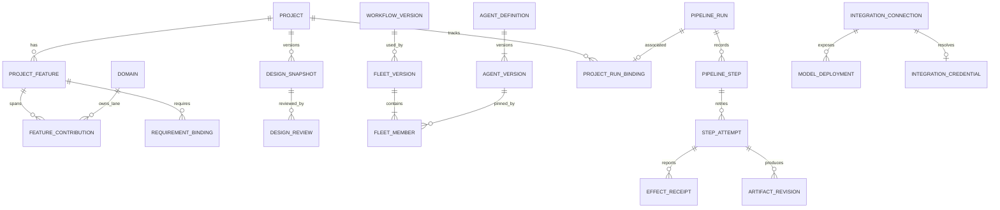

# Domain Data & Events

**Version:** 0.3.0b · **Status:** Candidate
ทุกชื่อ “new” เป็น logical model proposal ไม่ใช่ Prisma schema ที่มีอยู่แล้ว

**Workforce supplement:** [15 Workforce planning & performance](15-WORKFORCE-CAPACITY-SCHEDULE-AND-PERFORMANCE.md) §4–6 defines typed estimate/remaining minutes, effective calendars and team shares, allocations, logs, delivery evidence and versioned metric policies. Reuse WorkItem/Team/Employment identities and owner writers; reconcile generic AllocationInput/resourceId from the earlier API proposal with personId before code so no duplicate allocation authority is created. Team Membership and Employment never grant access. No existing data or schema is changed by this supplement.

**Detailed schema supplement:** [18 Tables & ERD](18-DATABASE-TABLES-AND-ERD.md) enumerates existing models, proposes typed fields/keys/temporal rules, separates human allocation and metric result variants, and records transaction/adapter requirements. Its [data model](contracts/data-model.candidate.json) is candidate design, not Prisma or executable DDL. Exact API parity and migration approval remain required.

## 1. Identity and invariants

1. Internal entity = UUID; human code และ external ID เป็น attributes/references แยกกัน
2. Business-scoped aggregate เก็บ tenantId/businessId และ projectId เมื่อเกี่ยวกับ Project; parent/child ต้องอยู่ scope เดียวกัน
3. Group/Organization/Workspace เป็น display mapping ตาม ADR-076; ไม่เปลี่ยน foreign key เพื่อเปลี่ยนชื่อ
4. Domain ID, technical owner domain, feature ID, workstream ID และ execution mode ID ห้ามใช้แทนกัน
5. Canonical product FEAT/FR IDs อ้างผ่าน repository + approved snapshot; Project-local feature มี UUID/code ของตนเอง
6. Versioned mutable aggregates ใช้ createdAt/updatedAt/version/deletedAt เมื่อ applicable; approved revisions append-only และแก้ด้วย revision ใหม่
7. Scope มาจาก trusted viewer/credential + resource lookup; client tenantId/businessId ไม่เป็น authority
8. Plan identity ≠ run identity ≠ attempt identity ≠ effect identity; retry เปลี่ยน attempt แต่ไม่เปลี่ยน effectKey ของผลข้างเคียงเดิม
9. Label/layout/UI filter ไม่เป็น authorization และไม่เปลี่ยน semantic content hash
10. New scoped tables ต้องมี composite constraints/foreign-key scope guards และ RLS สำหรับ production adapter; application check อย่างเดียวไม่พอ

## 2. Aggregate inventory and data dictionary

| Aggregate / owner | Status | Core fields and relationships | Constraints |
|---|---|---|---|
| Project / Workstream / WorkContainer / WorkItem; PM | reuse | Existing scope, executionMode, strategy, weights, dependencies, gates | Write through PM services; no parallel plan writer |
| GovernanceSnapshot; PM | new | id, repositoryId, commitSha, sourceManifestHash, capturedAt, validationStatus | Immutable; same repo+commit+hash deduplicated |
| ProjectFeature; PM | new | id, code, title, problem, outcome, primaryDomainId, canonicalFeatureRef?, lifecycle, version | Unique project+code; canonical ref pinned to snapshot |
| FeatureContribution; PM | new | featureId, domainId, responsibility, workItemId?, allocationWeight? | One primary owner; links not duplicate progress contributions |
| RequirementBinding; PM | new | projectId, featureId, sourceNamespace, requirementKey, revisionHash, acceptanceRef | Existing FR subject not editable through binding |
| DesignSnapshot; PM | new | projectId, revision, requirementsHash, graphHash, contractsHash, policyHash, state | APPROVED immutable; exact review receipt required |
| DesignReview; PM | new | snapshotId, reviewerId, decision, reason, evidenceRefs, decidedAt | Reviewer permissions/current scope and SoD checked at decision time |
| ArchitectureElementBinding; PM | new | snapshotId, elementId, sourceRef, codeAnchorRefs, operationIds | Unique snapshot+element; code refs pinned to SHA |
| AgentDefinition / AgentVersion; PM | new | stable id/code; revision, charterRef, executionKind, roles, skills/tools, modelPolicy, executorConstraints, evalRef | No raw prompt authority or embedded secret; approved versions immutable |
| FleetDefinition / FleetVersion; PM | new | stable id/code; member role + agentVersionId, workflowVersionId, limits, policies | Member role unique; no unresolved latest reference |
| WorkflowDefinition / WorkflowVersion; PM | new | stable id/code; typed DAG, input/output schemas, step bindings, retry/approval rules | Schema + semantic validator before publish |
| ProjectRunBinding; PM | new | projectId, workstreamId?, executionRunId, workflowVersionId, baselineHash | Unique project+executionRunId; run state read from Integration |
| ArtifactRevision; PM | new metadata over FileAsset | artifactId, revision, storageRef, sha256, mediaType, classification, producerRunId, sourceRefs | Bytes private and immutable; expiry/tombstone preserves audit identity |
| Risk / Issue / Decision / ChangeRequest; PM | new or reconcile existing FR-070 supporting records | code, owner, severity, probability/impact, dueAt, linked objects, resolutionRef | Reuse matching existing supporting model after field-level diff; avoid duplicate registries |
| ResourceAllocation / BudgetBaseline; PM | proposed extension | assignee/resourceRef, time window, effort units, currency, plannedCost, actualUsageRefs | Units explicit; concurrency check before commit; overrides reasoned |
| CommentThread / NotificationSubscription; PM/Integration respectively | new | artifact revision or work ref; recipient binding, event filters, delivery policy | Membership checked at read/send time, not just at subscription creation |
| Provider / Connection / Credential; Integration | reuse | IntegrationProvider, IntegrationConnection, IntegrationCredential/Version | Write-only vault; distinct provider metadata and per-Business connection |
| ModelDeployment / ModelOffering / RoutingPolicy; Integration | new | connectionId, executionLocation, endpoint profile, model identifier/revision, capabilities, probe, pricing basis | Connection scope enforced; routing approved version pinned |
| McpBinding / ToolSnapshot; Integration | new | transport/protocol, server identity, tool schemas/digests, executor binding, consent | Tool metadata changes invalidate approval; sensitive args never inventory data |
| ExecutorRegistration; Integration with Identity credential | new execution profile | host identity, allowed scopes/repos, OS/runtime/capabilities, heartbeat, capacity, drain state | Existing harness report credential cannot claim runs |
| PipelineRun / PipelineStep / PipelineEventReceipt / PipelineGateDecision; Integration | reuse + profile extension | existing executionRunId/executionContractId + PM workflow profile/version, events and receipts | Namespace isolates PM workflow validation from existing data pipelines |
| StepAttempt / QueueLease / EffectReceipt; Integration | new ledger extensions | attemptId, stepId, leaseEpoch, leaseUntil, effectKey, payloadHash, outcome, receiptRef | CAS claim; unique active lane; stale epoch cannot commit/promote |
| UsageReservation / UsageEntry; Integration | new | scope, run/attempt, budgetId, currency, max exposure, usage categories, measurement source | Reserve atomically; charge once per invocation; unknown not zero |
| GatewayClientKey; Identity | new audience/profile or separate type after review | keyId, hash, prefix, scope, model allowlist, expiresAt, revokedAt, quotas | One-time reveal; inference-only audience; never upstream secret |
| ShareGrant; Identity | new/reuse generic grant if exact fit | artifactRevisionId, recipient/audience, permission, expiresAt, revokedAt, access audit | Snapshot-specific; no project-wide implicit grant |

Registry “new or reconcile” rows specify a mapping gate, not permission to add a second table. P0 must inspect FR-070 support records and record reuse/new columns per model.

## 3. G06 — Logical relationship diagram



Diagram is logical: cardinality and authorization still need physical composite constraints. Shared provider catalog is installation metadata; connection/deployment/use remain scoped.

## 4. Transaction and concurrency contract

| Operation | Atomic boundary | Failure / recovery |
|---|---|---|
| Edit draft | authorize + expectedVersion check + save + AuditEvent | 412 VERSION_CONFLICT; return currentVersion and reload link |
| Approve version | verify complete hash manifest + current review grant + SoD + append approval + seal version | 409 INPUT_CHANGED / 403 REVIEW_FORBIDDEN |
| Dispatch | resolve versions + scope/policy + idempotency record + budget reservation + run/steps/outbox | Any failure rolls back enqueue; duplicate identical request returns original receipt |
| Claim | eligible step + repository/domain lane uniqueness + lease increment + attempt creation | No eligible work returns 204; lock conflict waits/backoff |
| Receive event | validate executor/epoch/scope + dedup by source/eventId + sequence + receipt + outbox | Same ID/different hash is CONFLICT; late epoch quarantined |
| Complete step | authoritative effect/evidence refs + output schema + state transition + events | Invalid output fails attempt; no auto acceptance |
| Accept work | PM service checks required gates/current evidence and records status+AuditEvent | A successful run without accepted evidence leaves work in review |
| Rotate secret | stage new version → validate → atomic active-pointer switch | Failed validation keeps previous active version; immediate revoke blocks future resolution |
| Reserve budget | compare remaining including reservations + insert reservation | 429 BUDGET_EXCEEDED; no provider call |
| Publish artifact bytes | write private object → digest verify → register metadata+event | Orphan blob sweep; metadata never points to unverified bytes |

Outbox delivery is at least once. Consumers commit inbox receipt + mutation + outgoing event atomically. “Exactly once” is guaranteed only for a local deduplicated state transition, never assumed for third-party side effects.

## 5. Event envelope

All new internal workflow events use this versioned envelope:

```json
{
  "schemaVersion": "1.0",
  "eventId": "00000000-0000-4000-8000-000000000101",
  "eventType": "pm.execution.step.completed.v1",
  "source": "integration.execution",
  "occurredAt": "2026-09-15T16:00:00Z",
  "recordedAt": "2026-09-15T16:00:01Z",
  "scopeRef": {"tenantId": "00000000-0000-4000-8000-000000000501", "businessId": "00000000-0000-4000-8000-000000000502"},
  "executionRunId": "00000000-0000-4000-8000-000000000503",
  "executionStepId": "00000000-0000-4000-8000-000000000504",
  "attemptId": "00000000-0000-4000-8000-000000000505",
  "sequence": 18,
  "leaseEpoch": 3,
  "correlationId": "00000000-0000-4000-8000-000000000506",
  "causationId": "00000000-0000-4000-8000-000000000507",
  "actorRef": {"kind": "EXECUTOR", "id": "00000000-0000-4000-8000-000000000508"},
  "payloadRef": "artifact:receipt-fixture",
  "payloadSha256": "aaaaaaaaaaaaaaaaaaaaaaaaaaaaaaaaaaaaaaaaaaaaaaaaaaaaaaaaaaaaaaaa",
  "classification": "INTERNAL"
}
```

All UUIDs and the payload locator above are synthetic examples, not real records. Payload refs resolve within the same scope. No auth token, raw key, credential URL, prompt payload or hidden reasoning in the event envelope.

| Event family | Producer | Consumer / effect |
|---|---|---|
| pm.design.approved.v1 | PM | invalidate stale readiness projection / enable future dispatch |
| pm.execution.requested.v1 | PM via Integration command | durable run admission |
| pm.execution.step.claimed.v1 | Integration | command-center projection and executor occupancy |
| pm.execution.approval.required.v1 | Integration | authorized inbox notification |
| pm.execution.step.completed.v1 | Integration | next-step readiness + PM evidence link |
| pm.execution.effect.unknown.v1 | Integration | halt affected branch; reconciliation queue |
| pm.execution.run.finished.v1 | Integration | PM review queue; no automatic release |
| pm.artifact.accepted.v1 | PM | readiness and dependent gate reevaluation |
| integration.provider.probe.changed.v1 | Integration | degrade binding/readiness; no automatic policy widening |
| identity.grant.revoked.v1 | Identity | stop new claims and revalidate active action boundary |
| pm.release.recorded.v1 | PM | deployment evidence view; activation remains separate |

Run sequence is assigned by ledger transaction. Source timestamps are informational; ordering uses stored sequence. Streams reconnect with opaque cursor; expired cursor returns 410 and a scoped snapshot cursor. Duplicate/out-of-order input is recorded once or rejected with reason; gaps are visible.

## 6. Derived progress, readiness and costs

- Workstream progress = its existing strategy over accepted evidence; Project = existing normalized weighted roll-up
- Domain/Feature counts deduplicate WorkItem IDs. For allocation views, explicit weights sum to 1 for the same work; unallocated contribution is labelled, not silently double-counted
- Example: one accepted WorkItem linked to two features counts as one project work item; a 60/40 allocation reports 0.6/0.4 work-equivalent only when user selected that metric
- Readiness is a vector: requirements coverage, implementation evidence, tests, release, activation; no single “green” from a commit count
- Actual cost = measured usage × approved recorded rate basis; absent price/usage is UNKNOWN. Local compute cost can use configured capacity allocation, explicitly labelled estimate
- Zero means measured zero; no sample means UNKNOWN. Product inventory counts may be zero when an authorized complete query found no rows

## 7. Retention and lifecycle proposal

| Data | Proposed default | Delete/erase behavior |
|---|---|---|
| Definitions/approved design/release receipts | Retain while project is retained | Archive; preserve references until retention policy permits purge |
| Raw executor stdout/stderr | 14 days | Redact secrets before storage; scheduled deletion; no full transcript by default |
| Redacted structured events and usage | 90 days | Tenant may shorten; aggregates retain no user payload |
| Artifacts/test evidence | 90 days minimum per accepted baseline, configurable by owner | Purge bytes with tombstone; retention exceptions explicit |
| Credential material | Until revoked/expired rotation policy | Vault purge; keep non-secret lifecycle receipt |
| Share grants | 7 days default, maximum 30 unless explicit policy | Immediate revoke on grant/artifact revocation |
| Idempotency records | 30 days or maximum retry horizon, whichever longer | Never expire before a retry can arrive |

Numbers are proposed settings requiring approval, not legal advice. Legal hold/data retention owner decisions override normal purge only through audited policy.

## 8. Migration plan constraints

Additive, scoped tables/columns first → backfill explicitly mapped references → validate constraints/RLS → switch reads behind flag → activate writers after acceptance. Existing runs retain their original namespace and behavior.

No rewrite of existing FR/FEAT keys, no forced migration of old pipelines to fleet semantics, no destructive down migration. Backup restore places executor/inference credentials in revalidation state; expired/revoked keys must not revive from restored snapshots. Full rollout gates in Delivery & Verification.

## CHANGELOG

| Version | Date | Status | Summary | Commit Hash | Agent |
|---|---|---|---|---|---|
| 0.1.0b | 2026-09-15 | candidate | Aggregate ownership, immutable revisions, ledger reuse, transactions, events and retention | base 087f3025 | RWANG |
| 0.2.0b | 2026-09-16 | candidate | Add workforce data ownership, evidence history and allocation reconciliation gate | source 0f5a47fc; uncommitted | RWANG |
| 0.3.0b | 2026-09-16 | candidate | Link field-level table dictionary and focused ERDs while retaining owner and migration gates | design base 087f3025; uncommitted | RWANG |
