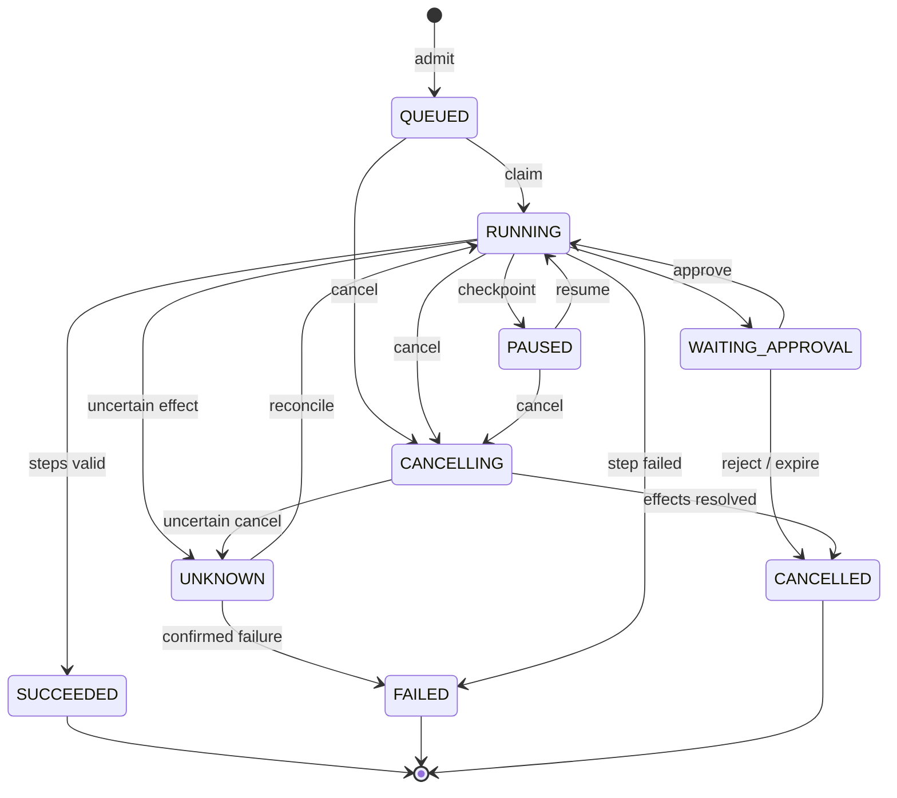

# Agents, Fleets & Command Center

**Version:** 0.1.0b · **Status:** Candidate

## 1. Concepts

| Concept | Meaning |
|---|---|
| AgentDefinition | Stable identity of a domain-bound worker configuration |
| AgentVersion | Immutable charter/skill/tool/model/runtime/policy configuration |
| Executor | Authenticated process/host capable of carrying out approved steps |
| Role / hat | planner, architect, implementer, reviewer, tester used inside a domain desk |
| Agentic workflow | One desk plans/uses allowed tools within a bounded step or workflow |
| Fleet | Versioned composition of multiple domain desks and handoff contracts |
| Workflow | Declarative DAG of steps; contains data/bindings, no shell command text |
| Run / attempt | One invocation / one leased execution of a step |
| Command Center | Read projection and authenticated commands over the ledger |

One AgentVersion can run on several eligible executors. One executor can host more than one **read-only** task within capacity; concurrent writes remain restricted by lane. Read-only role workers do not become autonomous cross-domain agents.

## 2. Agent inventory specification

| Group | Required fields | Validation |
|---|---|---|
| Identity | UUID/code/name/description, ownerDomainId, executionKind | PROJECT_DELIVERY or BUSINESS_AUTOMATION; owner domain exists |
| Charter | repositoryRef, charterPath, approvedSnapshotHash | Read charter at pinned SHA; changed charter requires review |
| Role | allowed hats, input/output schema refs, task classes | No role can exceed desk capabilities |
| Instructions | versioned instructionRef, language, bounded context policy | Instructions are content; tools/permissions defined outside prompt |
| Skills | package ID/version/hash, provenance, allowed assets | Approved package; no implicit install/update on execution |
| Tools | tool ID/schema digest, read/write/effect class, resources, timeout | Identity capability + tool policy intersection |
| Model | routingPolicyVersion, required capabilities, context/output limits | Probe + eval + residency compatible |
| Runtime | executor profile, OS/runtime, allowed repo/path, network policy, max runtime | Profile exists; paths canonicalized; no drive-wide access |
| Review | reviewer policy, SoD, required eval suite/results | Approval bound to complete config hash |
| Lifecycle | DRAFT → IN_REVIEW → APPROVED → DEPRECATED → ARCHIVED | Rejected review returns DRAFT as new revision |
| Readiness | READY / NOT_READY / UNKNOWN with reasons/observedAt | Derived from version, executor, grant, credentials, probe, budget |

APPROVED is a configuration decision; READY is current ability to run. Healthy executor alone cannot make an unapproved version ready.

## 3. Agentic workflow loop

Approved objective + bounded input → plan within assigned domain → choose allowed tool/model → validate request → authorize → execute → collect receipt → evaluate step acceptance → finish or request human input.

Limits are enforced outside the model: maximum iterations 20, tool calls 50, elapsed time 30 minutes, output size 20 MiB and per-run token/cost budget. These are candidate defaults adjustable downward by policy; increases require an approved version. A model's “continue” cannot renew its own limits.

Business automation invokes domain service tools (for example read Inventory via registered tool). Product delivery uses isolated worktree/test tools. Public LINE adapter eligibility remains subject to existing LINE provider/account policy.

## 4. Fleet inventory specification

- Stable fleet identity and immutable revision
- Member bindings = `roleKey → agentVersionId`; each member keeps its domain lane and approved capabilities
- WorkflowVersion supplies step DAG, input/output schemas and cross-domain handoff artifact types
- Orchestrator schedules only; cannot write every domain to simplify coordination
- At most two orchestration layers per ADR-026; role workers live within an attempt
- Allowed patterns: sequential, fan-out/fan-in, conditional branch with explicit predicates, independent review, bounded retry
- No recursive fleet spawning in initial scope. Repeated work is a new run or bounded retry, not a cyclic workflow graph
- Parallelism capped by fleet maxConcurrency, executor capacity, provider limits and **lane lock**, taking the minimum
- For source edits, lane key = installation + canonical repository identity + domain. Different projects/worktrees do not bypass that repository's domain lane lock
- Shared governance files are a separate integration resource lock; one integrator writes PRD/FEATURES/ledger and generated state
- Handoff = typed artifact URI + digest + source baseline + acceptance criteria + owner; informal chat text cannot satisfy it
- Failure policy per step: fail run / skip optional branch / pause for reconciliation. Required-step failure prevents overall success

## 5. Workflow compiler and dry-run

Input contract: [workflow schema](contracts/workflow.schema.json). Example: [workflow example](contracts/workflow.example.json).

Validation stages:

1. Structural schema, size/count limits and supported schemaVersion
2. Resolve all IDs/versions/contracts against approved scoped registries
3. Check unique step keys, dependency existence, no self-edge/cycle, reachable start/end and required outputs
   - `resultFrom` selects one terminal step output matching the workflow output schema; use a typed JOIN output when several branches contribute
4. Check cross-domain contribution and handoff contract; lane assignments exactly one owner per writing step
5. Check tool/schema/model capabilities, executor profile, data classification and approval requirements
6. Estimate worst-case bounded exposure across retries/fan-out and reserve budget at dispatch
7. Compute canonical manifest hash excluding display positions; return normalized graph, planned operations, approvals and blockers
8. Commit uses the exact dry-run hash and source versions, rechecking auth/config before enqueue

The example contains fixture bindings. It is schema-valid design data and **not dispatchable** until actual approved IDs and tool bindings are resolved. No imported prompt, MCP tool description or diagram label can create new capabilities.

## 6. Run lifecycle

Public run states are a proposed workflow profile mapped into Integration's ledger. Existing data-pipeline state sets must pass compatibility review before these are introduced; legacy consumers must not guess unknown status values.

For parallel steps, RUNNING remains visible while any eligible/active required step can proceed. WAITING_APPROVAL applies only when remaining required progress is blocked by approval and no active attempt remains. A pause request becomes PAUSED after active attempts reach a safe checkpoint. CANCELLING and UNKNOWN stop new claims immediately and require all affected in-flight effects to reconcile before terminal outcome. SUCCEEDED requires every required output/gate; one branch's success cannot finish the run.

| State / command | Semantics |
|---|---|
| pause | Stop new claims; active safe step may checkpoint/finish. Does not imply process termination |
| cancel | Record cancellation, revoke further actions, signal active executor; remain CANCELLING until effect status known |
| resume | Reauthorize current user/policy/budget and required credentials; pins original approved versions |
| retry | New attempt for eligible failed step; same effect identity for retried effect; never replay irreversible unknown action |
| replay | New run with new identity, `replayOf` ref and explicit input/version selection; read-only playback is separate |
| SUCCEEDED | Workflow completed according to output/gates; does not mean work accepted, PR merged or deployment active |
| UNKNOWN | Stop automatic retry; inspect durable external receipt/target state through authorized reconciliation |
| archived | UI/retention property after terminal state, not another run outcome |

Step states: PENDING, READY, LEASED, RUNNING, WAITING_APPROVAL, SUCCEEDED, FAILED, SKIPPED, CANCELLED, UNKNOWN. An optional failed step may become SKIPPED by an explicit recorded policy decision; skipped required steps block success.

## 7. Executor, claim and lease protocol

1. Enrollment requires current owner/operator authorization appropriate to scope and a one-time challenge. Identity issues an execution-audience credential; it is separate from harness usage pairing
2. Executor advertises observed OS/runtime/tool versions and capacity, never self-grants capability
3. Long-poll claim authenticates executor, matches authorized scope/lane/profile and atomically reserves a step
4. Server returns runId, stepId, attemptId, immutable manifest hash, lane key, leaseEpoch, leaseUntil and short-lived attempt token
5. Candidate lease = 90 seconds; heartbeat = every 30 seconds; expiry based on server time with at most 5-second tolerated clock skew
6. Every heartbeat/report/tool action includes attemptId + epoch; server renews by compare-and-swap
7. Expired claim records LEASE_BREACH. Requeue only after isolated workspace is quarantined and effects are known; old process cannot promote an artifact/commit with stale epoch
8. A disconnected executor may finish pure local computation but cannot acquire new effects; reconnect reports its old attempt for reconciliation
9. Path sandbox covers permitted worktree only. Per-attempt network, command/tool registry, resource ceiling and timeout are enforced by executor adapter
10. Inventory must show READY, BUSY, DRAINING, OFFLINE, QUARANTINED with observation time; heartbeat is not proof of pairing or authorization

No host accepts arbitrary shell commands from browser JSON. Code delivery references approved execution profiles (such as repository test/build runner) and checked arguments; adding a profile is a separate reviewed registry change.

## 8. Idempotency and side effects

| Situation | Required outcome |
|---|---|
| Duplicate dispatch, same key/hash | Return original run/command receipt |
| Same idempotency key, different input | 409 IDEMPOTENCY_CONFLICT |
| Duplicate result, identical eventId/hash | Acknowledge stored receipt; no duplicate state transition |
| Same eventId, different hash | Reject/quarantine; integrity incident |
| Worker completes after lease lost | Record late result; cannot accept or promote without reconciliation |
| Timeout after third-party write | UNKNOWN; query effect by reference; never blind retry |
| Model text generation timeout before any tools | Bounded retry per provider policy; distinct invocation usage record |
| Retried domain mutation | Stable effectKey + normalized payload hash; domain writer returns previous effect receipt |
| Budget reservation expires while worker offline | New effects blocked; reconcile measured/unknown usage before releasing exposure |

A local file write may continue in an isolated worktree after lease loss; the fencing guarantee protects accepted promotion and shared service mutation. It does not pretend to remotely freeze an offline machine.

## 9. Approval policy

ApprovalRequest contains actionClass, scope, exact run/step, manifest/artifact/commit hashes, payload summary, expected effects, expiry and eligible reviewer capability.

| Action | Default policy |
|---|---|
| Read-only local analysis within approved task | Existing dispatch authority sufficient |
| Edit allowed isolated source paths | Approved task + version-pinned executor policy |
| Modify shared contract/baseline | Independent design review before dependent implementation |
| New/rotated credentials or executor enrollment | Integration/Identity management with step-up |
| External message, spend above reservation, merge, deploy | Explicit scoped human approval of concrete target/action |
| Destructive operation / wider scope | Separate proposal; never inherited from routine run approval |

Grant revocation or material hash changes invalidate pending approval. Creator and final verifier must differ for protected decisions; override requires a separately authorized and audited policy path, not an OWNER-name shortcut.

## 10. Command Center telemetry

One row per run, expandable to step/attempt/effect:
- owner/scope, workflow/fleet/agent versions, queue wait, lease, current status and reason
- structured events with run sequence; source logs are linked restricted artifacts
- input/output/total token evidence, cache/reasoning categories when provider reports them, latency/cost and unknown portions
- pending approvals, stale inputs, blocked dependencies, provider health, budget remaining and executor occupancy
- artifact diff/review/test links and exact SHA/environment

No hidden chain-of-thought capture requirement. Store observable commands, tool arguments subject to redaction, outputs, receipts and concise decision summaries.

## 11. Failure acceptance examples

- Two fleet runs request the same repository/domain writer: one claim succeeds; the other remains queued
- Provider unavailable: choose only an already approved compatible fallback; otherwise block with actionable reason
- Reviewer declines: record decision, block effect, preserve generated draft and close/replan affected step
- Secret revoked between claim and tool call: deny before request; no cached secret enables the effect
- Stream reconnect: replay missing authorized events in order, deduplicate, then continue live
- Restored backup: existing execution credentials require revalidation; stale attempts cannot resume effects automatically

## CHANGELOG

| Version | Date | Status | Summary | Commit Hash | Agent |
|---|---|---|---|---|---|
| 0.1.0b | 2026-09-15 | candidate | Agent/fleet definitions, lifecycle, leases, approvals, retry and recovery semantics | base 087f3025 | RWANG |
