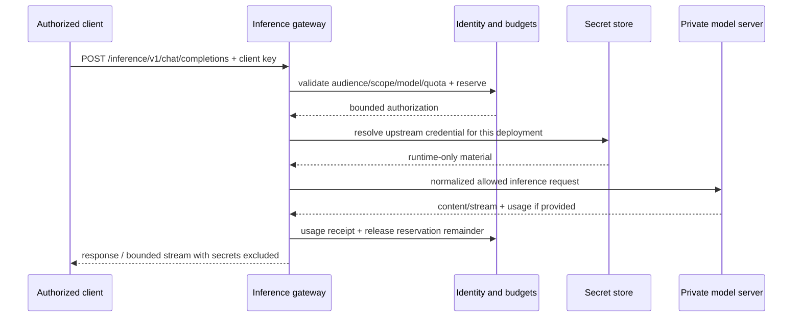

# Providers, MCP & Self-host Inference

**Version:** 0.1.0b · **Status:** Candidate

## 1. Registry model

```text
IntegrationProvider (provider identity / adapter catalog)
  → IntegrationConnection (Tenant/Business relationship)
     → Credential lifecycle (write-only SecretStorePort)
     → ModelDeployment (endpoint + location + model offerings)
     → McpBinding (tool/resource transport; separate from model deployment)
Project / AgentVersion
  → approved binding + routingPolicyVersion
Client / executor
  → scoped consumer credential → authorized gateway/broker
```

Cloud/local/self-host describes **execution location**, not permission or API protocol. A self-hosted model may expose OpenAI-compatible HTTP; an MCP server exposes tools/resources/prompts through its negotiated protocol. A provider can supply both, recorded as separate bindings.

## 2. Provider/deployment contract

| Field | Values / semantics |
|---|---|
| providerId / connectionId | Stable internal UUIDs; connection scoped to Tenant/Business |
| executionLocation | CLOUD, PRIVATE_SERVER, PAIRED_EXECUTOR |
| protocolProfile | OPENAI_CHAT_COMPATIBLE, ANTHROPIC_MESSAGES, PROVIDER_NATIVE; MCP stored separately |
| baseUrlRef | Validated configuration reference; no userinfo/query secrets; internal endpoints restricted from normal viewers |
| credentialRef | Internal vault handle, never secret; public API returns credentialStatus only |
| modelIdentifier / revision | Exact provider model name/revision; display alias cannot silently repoint an approved binding |
| capabilities | chat, streaming, tools, structuredOutput, embeddings, vision; each supported/unsupported/unknown + probe evidence |
| limits | context/output ceilings, request size, timeouts, concurrency, TPM/RPM and budget policy |
| data policy | allowed classifications, regions, retention/training restrictions declared by owner with source/proof |
| observed health | READY/DEGRADED/UNAVAILABLE/UNKNOWN, observedAt, expiry and failureCode |
| pricing | currency, unit rates, effectiveAt, source, estimated/measured indicator |
| lifecycle | DRAFT → VALIDATING → READY; DEGRADED/DISABLED/ARCHIVED; approved configuration separate from probe state |

Discovering a model name does not prove tool calling, vision, context size or policy compliance. Probe each required capability with a bounded synthetic fixture.

## 3. Native port contracts

| Port | Input | Output / error |
|---|---|---|
| ModelInvocationPort.invoke | approved deployment/version, scoped context ref, required capabilities, max output, budget reservation, invocationId | bounded content/tool requests, provider requestId, usage, finish reason; no implicit tool execution |
| ModelProbePort.probe | connection/deployment ref, selected synthetic tests, timeout | per-capability findings + observedAt + expiry; redacted failure |
| SecretStorePort.resolveForUse | trusted service context, connection/kind/version, purpose | secret delivered only to authorized adapter memory; never serializable response |
| McpBrokerPort.listApprovedTools | binding/version + authorized capabilities | authorized pinned metadata only |
| McpBrokerPort.callTool | tool/schema digest + validated args + attempt authority + effectKey | structured result + receipt + classification; refusal on drift |
| ExecutorInferencePort.invoke | paired-executor model binding + bounded request | same normalized model result with origin LOCAL and truthful usage coverage |

Adapters must normalize transport errors without hiding upstream request IDs/status class. Provider-specific metadata may be stored redacted for troubleshooting; no raw Authorization headers.

## 4. Self-host as a cloud-style API



Client-facing routes: `GET /inference/v1/models`, `POST /inference/v1/chat/completions`, `POST /inference/v1/embeddings`. Model aliases are scoped, `models` lists only allowed offerings, unsupported features return explicit errors.

This is a documented **subset profile**, not a promise of complete compatibility with every upstream API. Initially permit bounded text chat and embeddings; streaming is a separately probed capability. Tool request metadata is output, never a gateway instruction to execute tools.

A private HTTP model server needs authenticated private connectivity from the gateway. For a model available only on a local machine, use paired executor pull jobs; expose gateway API semantics only with the bounded latency/streaming capabilities that adapter actually proves. “Local” does not mean that a cloud process can reach the user's localhost.

## 5. Keys, isolation and network controls

- Upstream provider key: browser write-only provisioning with step-up; Integration vault owns encryption/rotation/revocation
- Consumer gateway key: high-entropy secret revealed once, stored as keyed hash with lookup prefix; audience=inference, expiration, model/scope allowlist and quotas
- Executor key: distinct audience; attempt tokens further bound to run/step/epoch/tools. Never reuse programme usage/harness keys
- No key in localStorage, query strings, exported OpenAPI examples, graph labels, metrics, logs or error responses
- TLS for remote traffic; raw model server reachable only by gateway/private executor network; management/debug routes blocked at the network boundary
- URL allowlist + resolved-IP checks at connect and redirect; deny metadata endpoints, unauthorized loopback/private networks and DNS rebinding. Private endpoints require explicit enrolled profile, not a global “allow private IP” switch
- Zero redirects for credential-bearing upstream calls unless destination is explicitly approved; never forward Authorization to a different origin
- Credential rotation stages/validates new version then switches active pointer; revoke invalidates resolver caches and future effects
- Connection tenancy cannot be widened by body fields or model alias. Cross-scope UUIDs return the same not-found shape
- Emergency stop disables dispatch/model use for the chosen scope; audit records actor, reason and affected version

Local Ollama's API does not require authentication by default; the gateway/private-network boundary supplies consumer auth. vLLM's own API-key option has endpoint coverage limitations, so a protected reverse proxy/network boundary is still required. These are protocol observations, not a production configuration already installed. [Ollama authentication](https://docs.ollama.com/api/authentication), [vLLM server documentation](https://docs.vllm.ai/en/latest/serving/online_serving/openai_compatible_server/).

## 6. MCP contract

Baseline pin: protocol `2025-11-25`; negotiate compatibility on initialization and record the actual negotiated version. Recheck supported version before implementation; do not treat a draft extension as mandatory runtime behavior.

| Transport | Where it runs | Security / lifecycle |
|---|---|---|
| stdio | Paired executor subprocess | Approved executable/package digest and argument schema; per-process environment contains only required secret references/material; stderr separate from JSON-RPC stdout |
| Streamable HTTP | Approved remote/private server | Auth profile, origin/URI validation, negotiated protocol/session lifecycle and explicit timeouts |
| Older/custom transport | Explicit compatibility adapter only | Disabled by default; independently documented/tested |

MCP defines stdio and Streamable HTTP; its HTTP authorization framework differs from stdio credential delivery. [MCP transports](https://modelcontextprotocol.io/specification/2025-11-25/basic/transports), [MCP authorization](https://modelcontextprotocol.io/specification/2025-11-25/basic/authorization).

Onboarding: register server metadata → verify publisher/endpoint → initialize/negotiate → discover schemas → classify effect/risk → approve tool subset → pin digest → probe → enable for selected agents.

Controls:
1. Tool name/description/resource text is untrusted content. It cannot alter system permissions or install another tool
2. Compare tool schema/digest before call; changed signature produces TOOL_SCHEMA_CHANGED and pauses dependent binding
3. Validate input/output schema and size; redact secret fields; map output classification/provenance
4. Model-requested tool calls are proposals. Broker resolves current authority and effect/approval rules
5. Remote OAuth tokens use correct audience/resource and per-connection scope; never pass unrelated user/provider tokens through
6. MCP sampling is disabled in initial profile; enabling it requires model/budget/consent policy and bounded recursion
7. Tasks/elicitation/roots or other negotiated optional capabilities stay disabled unless the adapter and product flow explicitly support them
8. A server asking for secrets through a tool result or chat cannot bypass the write-only credential form
9. stdio commands are preapproved profiles, never command strings from browser or imported workflow

## 7. Routing, fallback and budget

Selection order: authorized scope → data policy/residency → required capabilities → model allowlist/version → health → capacity → configured priority.

- Fallback list is approved and pinned. Local-to-cloud fallback is disabled unless tenant policy explicitly permits sending that data
- No provider retries a tool side effect automatically. Inference-only retry uses new invocationId and recorded cost exposure
- 401/403 disable credential use and require repair; 429 applies bounded backoff; timeout/circuit-open follows explicit retry policy
- Candidate defaults: connect timeout 5s, nonstream total 120s, stream idle 30s, max total 10m; at most two total inference attempts including first
- Admission atomically reserves worst-case allowed usage across output/retries; parallel calls cannot each spend the same remainder
- Unknown rate/model usage means no truthful measured cost; either block cost-capped dispatch or use an approved conservative exposure ceiling, visibly labelled estimate
- Track usage source PROVIDER_REPORTED / LOCAL_MEASURED / ESTIMATED / UNKNOWN. Cache and reasoning tokens cannot be added twice if provider total already includes them
- Circuit breaker by connection/model/error class; recovery probe bounded and synthetic. Healthy model does not imply healthy MCP tools

## 8. Provider lifecycle acceptance

- Valid key + prohibited model → denied without inference
- Revoked/expired consumer key → 401 and no upstream request
- Two simultaneous calls exceed remaining budget → at most the reserved allowed exposure reaches provider
- Unreachable local executor → BLOCKED/UNAVAILABLE; no silent cloud fallback
- Missing usage in response → UNKNOWN with provider request ref; not zero
- Model schema/capability changes → affected approved binding requires review
- Raw serving port inaccessible to consumer network; authorized gateway succeeds
- Errors/logs/export contain no submitted credential sentinel
- Existing public LINE allowlist remains governed by ADR-031/FR-048; this Project profile cannot enable Ollama for public LINE by a registry edit

## CHANGELOG

| Version | Date | Status | Summary | Commit Hash | Agent |
|---|---|---|---|---|---|
| 0.1.0b | 2026-09-15 | candidate | Provider/deployment separation, scoped inference keys, local connectivity, MCP and usage policies | base 087f3025 | RWANG |
