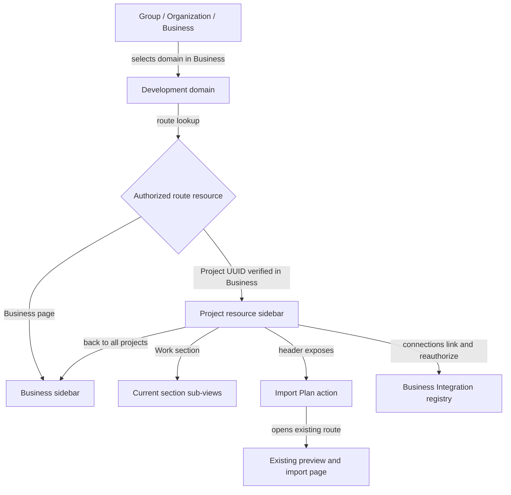

# Navigation refinement — จัดเมนูเดิมก่อนเพิ่มระบบเต็ม

**Version:** 1.0.0b · **Status:** Candidate, earlier layout withdrawn · **Complexity:** C-3 · **Architecture risk:** HIGH
**Current change:** documentation and review prototype only. No application UI, route handler, API, permission or database changed.

## 0. Owner clarification — read before the earlier proposal

The owner clarified that the Domain bar selects business domains, the sidebar selects subdomains/modules, and local tabs select views/sections. Business Home aggregates shortcuts. [Document 13](13-DOMAIN-TAXONOMY-AND-NAVIGATION-BOUNDARIES.md) records the corrected recommendation, source/vendor evidence and disposition of NAV-D1–D8.

**NAV-D1 and NAV-D2 below are WITHDRAWN recommendations.** Their contextual project sidebar and removal of ProjectTabs must not be implemented. Sections 1–11 preserve the earlier proposal and route inventory for comparison; the earlier NAV-P0/P1 plan, navigation JSON and prototype require reconciliation before implementation approval. The simultaneous presence of sidebar and tabs is not itself a defect. Global Business scope and provider-owner boundaries remain applicable.

## 1. เป้าหมายและขอบเขต

ผู้ใช้ระบุว่า navbar เดิมซ้ำซ้อนและยังมีเมนูไม่ครบ จึงให้ refinement ตรงนี้ก่อน เอกสารนี้กำหนดผังและทางเข้าหน้าเดิมทั้งหมด แล้วระบุตำแหน่งของความสามารถใน full PM design โดยไม่ทำให้หน้าที่ยังไม่สร้างดูเหมือนใช้งานได้แล้ว

[ASSUMPTIONS]

1. ใช้ Development เป็นชื่อ module ใน domain bar ต่อไป และใช้ Project Manager เป็นชื่อระบบในเอกสาร
2. ปรับ sidebar และ project navigation ภายใน PM; ERP groups และโมดูลข้างเคียงมีผังเดิม
3. NAV-P1 ปรับทางเข้าและชื่อเมนูของหน้าเดิมก่อน การเพิ่ม Domain/Feature/API/Agent/Fleet เป็น phase ตาม full design
4. Global context bar จบที่ Group → Organization → Business; ชื่อโปรเจกต์เป็น resource identity จาก URL และ authorized lookup ไม่ใช่ ambient scope หรือ grant

**Success:** ผู้ใช้บอกได้ว่าหน้านี้อ่านข้อมูล Business หรือ Project, ไปหน้าเดิมครบโดยไม่พิมพ์ URL, มีเมนูหลักที่กำลังเปิดหนึ่งรายการ, และตามหา capability ที่ต้องการได้จากผังที่ชัดเจน

## 2. Evidence และ root cause

Baseline: `087f30258a6831865afd751e28804e36505aff30`, verified against the primary checkout on 2026-09-16 Asia/Bangkok. User screenshots show Project / Inventory / Team / Work / Files / Import / More above content, alongside Development's Dashboard / All Work / Execution / Timeline / Dependencies / Milestones & Gates / Files / Repositories.

| Evidence | Finding |
|---|---|
| `apps/server/src/config/domains.js` | 8 Development sidebar destinations; first entry `/projects` is Dashboard, containing project metrics and the project list |
| `apps/server/src/components/layouts/Sidebar.jsx` | Sidebar stays derived from the Business domain while project tabs are also mounted; a prefix match marks Dashboard current on project descendants |
| `apps/server/src/modules/project-manager/components/ProjectTabs.jsx` | 6 existing destinations and 3 planned sections under More; project resources, work views and the import workflow share one rail |
| `apps/server/src/modules/project-manager/components/WorkViewTabs.jsx` | A second local row has 7 work views; scope ambiguity was handled with different names such as Schedule vs Timeline |
| Project `layout.jsx` | Repositories highlights Inventory; an execution mode highlights Project; page ownership is inferred separately from tab definitions |
| `project-work-route.test.js` | Tests explicitly preserve simultaneous bars and disjoint labels; they prove the earlier policy, not that people understand the scope |
| Enumerated `projects/[projectId]/**/page.jsx` | 14 project page templates are present, including the execution-mode template |
| `modules.js` | Its old nav copy is documented as unused at runtime; it is not the source to edit for this issue |

**Root cause:** the earlier navigation contract intentionally shows Business and Project navigation at the same time. Small group headings and alternate labels carry the burden of scope distinction. The full-system proposal also listed new sections without resolving how they coexist with those rails. This explains the reported confusion; it is not evidence that the underlying APIs read the wrong scope.

Full RCA and prevention: [navigation scope RCA](../../../.brain/rca/2026-09-16-pm-navigation-scope-duplication.md).

## 3. Candidate decisions and parent impact

| Decision | Proposed behavior | Parent/peer impact |
|---|---|---|
| NAV-D1 | One visible contextual sidebar in the PM area. Business pages show Development navigation; authorized project routes show project resource navigation | Explicit candidate amendment to ADR-011 D2/D4 and SITEMAP §1/§3. The narrow exception concerns presentation inside PM; the Business shell-scope ceiling remains |
| NAV-D2 | Remove the horizontal ProjectTabs rail after the sidebar replacement is implemented. Keep one Work sub-view row only while Work is open | Amend FR-040/SDD-019 presentation and ADR-012 consequences; retain WBS/dependency ownership and scope constraints |
| NAV-D3 | Group → Organization → Business remains the global context bar. Project header shows name/code and a back link to all projects | Project is not added to ScopeContext selection, topbar selectors or ERP domain grants |
| NAV-D4 | Work entry opens Work Items at `/all-work`; all 7 existing work URLs remain reachable | Explicit change from Work → Structure Plan, covered by new acceptance; no silent legacy URL redirect |
| NAV-D5 | Import Plan is a persistent header action that opens its existing full preview/import page | Refines FR-012/FR-018 discoverability, preserving the existing single import writer and one-click access |
| NAV-D6 | Keep source-present and proposed destinations distinct. The review can inspect proposed layouts; the product renders no href for an unavailable feature | Replace More with a named capability map, with visible planned reasons. No empty route shells to simulate completion |
| NAV-D7 | One candidate destination model supplies project sidebar, work views, search and active route ownership | Use the existing DOMAINS registry for Business/domain navigation; do not introduce a competing grant registry |
| NAV-D8 | Provider/Model/MCP/key management stays in Business-scoped Integration. Project Connections used manages references/bindings | Reuse the current Platform → Integrations authority; project Team and agent/fleet inventories do not grant provider-admin permission |

NAV-D* are local proposal decisions, not registered ADR IDs. Existing ADR-011 remains accepted authority until a reviewed amendment is registered. ADR-012 itself is marked Proposed in this snapshot although FR-040 source uses its boundary; that status is not promoted here.

Implementation must reconcile [SITEMAP](../../SITEMAP-DOMAIN-NAV.md), [interface inventory](../../INTERFACE-INVENTORY.md), [route sitemap](../../ROUTES-SITEMAP.md), FR-039/040/012/018/077 and their tests together. The old test asserting that both scopes must use different words should be replaced with behavior checks for separated contexts, not simply deleted.

## 4. Proposed navigation

### 4.1 Business pages — Development

```text
Global context: Group → Organization → Business
ERP domain bar: existing entries; Development selected

Development sidebar
  Dashboard                         /projects; includes project list
  ALL PROJECTS IN THIS BUSINESS
    All Work
    Execution
    Timeline
    Dependencies
    Milestones & Gates
  BUSINESS RESOURCES
    Files
    Repositories

Page actions: New Project; existing Workspace-list entry
```

The Dashboard retains its current implemented name. Adding another Projects menu pointing at the same `/projects` page would create two active aliases. Workspace browsing stays a resource entry on the Dashboard/search, not a new ERP capability.

### 4.2 Open project — full target

```text
Global context and ERP domain bar stay Business-bound

Project resource sidebar
  ← All projects
  [Project name / code — resource identity]
  Overview

  PLANNING
    Domains
    Features
    Work
    Execution views                 expands the 7 canonical modes

  DESIGN & SPECS
    Requirements
    Architecture
    API Explorer
    Docs & Decisions

  AGENTS & RUNS
    Command Center
    Agent Inventory
    Fleet Inventory
    Workflows

  PROJECT RESOURCES
    Team
    Files & Artifacts
    Repositories
    Project Index
    Connections used

  CONTROL & EVIDENCE
    Resources & Budget
    Risks & Issues
    Tests & Releases
    Activity
    Project Settings

Project header: title · scope description · Import Plan · relevant page actions
Work-only sub-view row:
  Work Items | Board | Structure Plan | Timeline |
  Milestones & Gates | Dependencies | Execution Roadmap | Calendar (planned)
```

- Domains and Features are separate first-class destinations, not a nested Domain → Feature menu.
- Work Items is the existing table/list view. Table is not another menu for the same data and URL.
- Workstreams and strategy progress remain on Overview. Execution views opens mode choices and keeps the selected workstream/filter. It does not create a new execution mode or select the first mode silently.
- Requirements owns requirement/acceptance bindings. Docs & Decisions owns versioned specifications/decisions/reviews and links those bindings. Files & Artifacts owns stored deliverables/attachments; it is not another specification editor.
- Agent Inventory = definitions/versions; Fleet Inventory = membership/topology; Workflows = reusable step/handoff definitions; Command Center = running work, queue, approvals and recovery. These are four distinct destinations over the full design's existing proposed owners.
- Resources & Budget = allocation/capacity/cost. Team = project participants. Project Index = read-only index of linked project records, preserving the FR-077 API and existing URL; no stock catalogue and no second CRUD writer.
- Phase NAV-P1 keeps the label Files and existing behavior; Files & Artifacts is the full-target label once artifact support is delivered.
- Groups collapse independently; the group containing the active page opens automatically. Persist only display preferences, scoped by user, without treating them as resource authority.

### 4.3 Provider and MCP placement

`Project → Connections used → Manage in Integrations` is an explicit scope transition. The destination displays the selected Business and rechecks Integration permissions. The current `/platform/integrations` route is present; the full registry subviews below are proposed enhancements, not already-built pages:

```text
Platform → Integrations
  Providers & Connections
  Model Deployments
  MCP Servers & Tools
  Inference API Keys
  Executors
  Routing & Budgets
```

A user allowed to bind an approved connection but not manage credentials sees binding controls only. Returning to the project uses an authorized same-origin project link. No credentials appear in query strings, menus, search results or review artifacts.

## 5. Existing-to-target mapping — no missing entry

All URLs below are preserved; `{p}` means the authorized project UUID. Route source presence is not runtime or production validation.

| Existing entry / page | Refined destination | Placement / behavior |
|---|---|---|
| Development Dashboard `/projects` | Dashboard | Business sidebar only; exact match |
| All Work `/work` | All Work | Business sidebar |
| Execution `/execution` and `/execution/{mode}` | Execution | Business sidebar, canonical mode chooser |
| Timeline `/timeline` | Timeline | Business sidebar |
| Dependencies `/dependencies` | Dependencies | Business sidebar; includes allowed cross-project dependencies |
| Milestones & Gates `/milestones` | Milestones & Gates | Business sidebar |
| Files `/files` | Files | Business resources |
| Repositories `/repositories` | Repositories | Business resources |
| Project `/projects/{p}` | Overview | Project sidebar |
| Inventory `/projects/{p}/inventory` | Project Index | Project resources, read-only |
| Team `/projects/{p}/team` | Team | Project resources |
| Work `/projects/{p}/structure` | Work → Structure Plan | URL preserved; Work entry default changes explicitly to Work Items |
| `/projects/{p}/all-work` | Work → Work Items | Existing table/list; no duplicate Table menu |
| `/projects/{p}/board` | Work → Board | Work sub-view |
| `/projects/{p}/timeline` | Work → Timeline | Rename Schedule now that Business links are not in the same sidebar |
| `/projects/{p}/milestones` | Work → Milestones & Gates | Restore full capability name |
| `/projects/{p}/dependencies` | Work → Dependencies | Both endpoints remain project-contained |
| `/projects/{p}/roadmap` | Work → Execution Roadmap | Keep existing plan semantics |
| `/projects/{p}/execution/{mode}` | Execution views → selected mode | Explicit mode parent, no longer highlighted as Overview |
| Files `/projects/{p}/files` | Files in NAV-P1; Files & Artifacts later | Project resources; existing API/persistence kept |
| `/projects/{p}/repositories` | Repositories | Direct project resource entry, no Inventory highlight |
| Import `/projects/{p}/import` | Import Plan | Header action plus page breadcrumb; direct URL preserved |
| More → Requirements | Requirements | Design & specs; planned until built |
| More → Risks | Risks & Issues | Control & evidence; planned until built |
| More → Resources | Resources & Budget | Control & evidence; planned until built |

Overview Edit/Archive buttons, New Project, Workspace-list entry and existing page-specific workflows retain reachable entry points. They are actions/resources, not additional top-level navigation destinations. Back to all projects opens the authorized Development Dashboard and restores only valid list filters, not another Business's cached selection.

## 6. G07 — Navigation and scope flow



Project navigation is a presentation projection after authorization. This diagram introduces no new context entity, API writer, membership or cross-Business grant.

## 7. Machine-readable navigation contract

[Navigation candidate model](contracts/navigation.candidate.json) is the review source for destinations, scope, availability, source-page references, work sub-views, mode routes and actions. It is not imported by the application.

| Concern | Contract |
|---|---|
| Identity | Stable local navigation IDs; URL remains resource locator, label is presentation |
| Route ownership | Match normalized route segments; exact overview/dashboard; most-specific known child; never arbitrary `pathname.includes` |
| Active state | One `aria-current=page` destination per page-navigation landmark. Work is the current section, its sub-view is the current page. Domain bar may independently mark Development current as a domain |
| Import | Header action carries selected-page indication on import route; no unrelated sidebar page marked current |
| Scope transition | Resolve project from trusted route lookup inside authorized Business before showing project name or navigation metadata |
| Search | Derive Business destinations from DOMAINS and Project destinations from the approved project registry; filter permissions first; de-duplicate by scope/resource/destination identity |
| Unavailable | Product route has no href until implemented/authorized. A capability-map disclosure can show planned reasons without implying access |
| Invalid URL | Unknown section/mode or unauthorized resource gives existing not-found/forbidden contract, not a silent Overview/first-mode fallback |
| Query/history | Preserve whitelisted filters relevant to destination and resource; remove stale cross-project IDs; refresh/deep-link/back/forward select the same menu |
| Preference | Collapse state is user preference; active parent opens. No cached project identity overrides URL |
| Provider | One registry editor in Integration; project UI owns bindings and reference links only |

## 8. Responsive and accessible behavior

- Desktop: one 240–264 px contextual sidebar, independently scrollable. Active leaf stays visible; labels wrap where needed instead of clipping into tooltips.
- Narrow viewport: labeled Menu button opens the same contextual tree in a drawer; show project name and current destination outside it. No unlabeled icon-only navigation.
- Drawer: focus enters, stays within the modal, Escape closes, focus returns to the opener; selecting a destination closes it. Touch targets at least 44 px.
- Work views use wrapping rows or a labeled view selector on narrow screens, avoiding a long hidden horizontal rail.
- Thai/English text, 200% zoom, keyboard navigation, visible focus and non-color status labels must work. Icons use Zuri/lucide semantics and Amber Citrus tokens.
- Do not invent unread badges, completion percentages or notification counts. Display only authorized measured values; the design preview contains no real progress data.
- Dirty-form handling belongs to the destination form. Switching project/Business must invoke it before leaving.

## 9. Delivery order and verification

| Slice | Authorized after | Work | Exit evidence |
|---|---|---|---|
| NAV-P0 | Owner reviews this concrete proposal | Register the necessary navigation amendment/new requirement, reconcile parent/peer docs and canonical ID ledger | Approved nav contract, unchanged key subjects, govern |
| NAV-P1 | NAV-P0 and approved implementation spec | Contextual sidebar; remove project rail; move Import to header; map all existing URLs; route-active/search/mobile behavior | Existing-route coverage, relevant navigation/scope unit and browser checks, build, govern |
| NAV-P2 | NAV-P1 plus individual full-design feature approvals | Add each new destination when its feature is implemented; continue P1–P7 | Feature acceptance and real entry-point test; no placeholder route presented as complete |

The order becomes **menu refinement first**, then the full feature phases. NAV-P1 does not implement the full-system APIs, agents, MCP or providers. The candidate OpenAPI/workflow/architecture execution contracts remain unchanged.

### Required acceptance scenarios — PLANNED / NOT_RUN

| ID | Scenario | Expected result |
|---|---|---|
| NAV-T01 | Business Dashboard versus any project route | Only the correct contextual sidebar; no duplicate ProjectTabs rail |
| NAV-T02 | Enumerated 14 project page templates and 8 Business sidebar destinations | All have an entry path; current section/page mapping is deterministic |
| NAV-T03 | Direct URL, refresh, back/forward, trailing slash | Same project and selection; no substring false match |
| NAV-T04 | Project A → Business view → Project B | Authorized scope text/filters change; no stale A records or counts |
| NAV-T05 | Foreign Business/project, revoked grant, unresolved lookup | No project metadata leak; guard remains authority |
| NAV-T06 | Work entry and all 7 current sub-views | Work Items default; same project preserved; no missing siblings |
| NAV-T07 | 7 execution modes and invalid mode | Correct mode highlighted; invalid mode does not silently pick Sprint |
| NAV-T08 | Import reached from every project page and by URL | Visible action; existing preview/conflict/commit flow; no new writer |
| NAV-T09 | Project Index, Files and Repositories | Distinct names/owners; existing read model and data remain intact |
| NAV-T10 | Requirements/Risks/Resources and future features | Discoverable in capability map; no executable planned links |
| NAV-T11 | Search and sidebar | Same authorized destination identity; no duplicate paths for the same resource |
| NAV-T12 | Mobile drawer, keyboard, 200% zoom | Focus return, visible labels, no page horizontal overflow |
| NAV-T13 | Connections used → Integration → return | Business reauthorization; no credential-admin escalation or secret in URL |
| NAV-T14 | Other ERP domains, shell context and 7 mode enum | Existing behavior/keys preserved; no Project ambient scope |

Current document/prototype validation results belong in [Evidence & Review](08-EVIDENCE-AND-REVIEW.md). These scenarios describe future product implementation, not tests already run by this document task.

## 10. Version diff and review decision

| Earlier proposal | Navigation refinement |
|---|---|
| New PM sections listed alongside an unresolved existing two-rail layout | One contextual sidebar with explicit Business/Project boundary |
| Project / Inventory / Team / Work / Files / Import / More | Overview + named section groups; Project Index; Import Plan action |
| Work sub-views use different names to coexist with Business menu | One Work view row within the project context; full clear labels |
| Repositories reached indirectly from Inventory | Direct Project resources entry |
| More reveals three disabled future controls | Named capability map; full target has defined locations and release gates |
| P0 registration → P1 feature work | NAV-P0/NAV-P1 precede full PM feature delivery |
| Five machine-readable contracts | Add a navigation candidate model; previous API/run contracts retain their versions |

The earlier request to approve NAV-D1–D8 and NAV-P1 is withdrawn. Review the taxonomy in document 13, then reconcile the complete route/tab mapping and acceptance before requesting implementation approval.

## 11. UX/UI supplement

[UX strategy](10-UX-STRATEGY-AND-JOURNEYS.md), [UI rules](11-UI-SYSTEM-AND-INTERACTIONS.md) and [wireframes](12-WIREFRAMES-AND-SCREEN-SPECS.md) use this menu mapping. Coverage is 41 PM destination IDs plus the separately owned Business registry entry. No new app route or extra global Project scope is authorized by the visual artifact.

## CHANGELOG

| Version | Date | Status | Summary | Commit Hash | Agent |
|---|---|---|---|---|---|
| 0.1.0b | 2026-09-16 | candidate | Existing navigation evidence, contextual-sidebar proposal, complete mapping, full target, scope contract and phased verification | base 087f3025; uncommitted | RWANG |
| 0.1.1b | 2026-09-16 | candidate | Link UX/UI wireframes without changing navigation decisions | base 087f3025 | RWANG |
| 1.0.0b | 2026-09-16 | candidate | Withdraw NAV-D1/D2 and earlier approval request; preserve old mapping as historical input; corrected hierarchy in document 13 | source 000b26f1 | RWANG |
