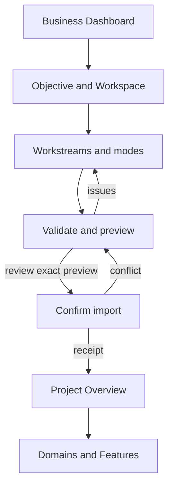
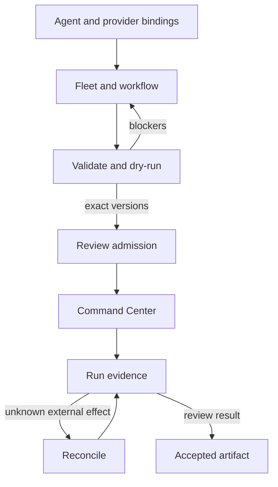

# UX Strategy & User Journeys

**Version:** 0.1.0b · **Status:** Candidate · **Complexity:** C-3 · **Risk:** HIGH (inherited cross-domain design)
**Deliverable:** UX/UI documentation and wireframes. No application implementation or research completion is claimed.

## 1. Design brief

### Business Goal

ช่วยเจ้าของธุรกิจและทีมส่งมอบงานจากเป้าหมายไปถึงผลลัพธ์ โดยเห็นเจ้าของงาน ความเชื่อมโยงของ Domain/Feature สิ่งที่รอการตัดสินใจ และหลักฐานส่งมอบในที่เดียว พร้อมควบคุมการใช้ Agent/Fleet และ Provider ตามสิทธิ์และงบประมาณ

### UX Goal

ผู้ใช้ควร **รู้ขอบเขต → หางานหรือความสามารถ → เข้าใจสถานะ → ทำขั้นตอนถัดไป → ตรวจหลักฐาน** ได้ต่อเนื่อง โดยไม่ต้องแปลชื่อเมนูที่ซ้ำกันหรือเดาว่าการกดปุ่มจะเกิดอะไรขึ้น

### Key Focus

1. Context clarity: Business กับ Project ชัดเจน และไม่ทำให้ Project กลายเป็น shell authority
2. Discoverability: Domains, Features, Architecture, API และ Agent/Fleet มีตำแหน่งแน่นอน
3. Lower form effort: ถามข้อมูลเท่าที่ต้องใช้ในขั้นตอนนั้น; แสดงรายละเอียดเพิ่มตามชนิดงาน
4. Safe decisions: ก่อน import/run/approve แสดง scope, exact revision, effects และ blockers
5. Evidence over decoration: progress, readiness, run outcome และ deployment มีหลักฐานคนละประเภท
6. Recovery: ผู้ใช้กลับมาทำต่อ ตรวจ conflict หรือ reconcile ผลลัพธ์ที่ไม่แน่ชัดได้

## 2. Reference interpretation and evidence

| Reference | สิ่งที่เห็น | สิ่งที่นำมาใช้กับ PM | ขอบเขต |
|---|---|---|---|
| User Photo 1, `1-Photo-1.jpg` | โครง Business Goal → UX Goal → Key Focus และภาพ journey หลายหน้าจอ | เขียนเป้าหมายก่อน layout; วางหน้าที่ต่อกันเป็น journey | เนื้อหา shopping/skincare เป็นตัวอย่างของภาพ ไม่ใช่ requirement ของ PM |
| User Photo 2, `2-Photo-2.jpg` | เปรียบเทียบฟอร์มหลายคอลัมน์กับลำดับแนวตั้งและช่องข้อมูลที่รวมกัน | เริ่มด้วยฟอร์มคอลัมน์เดียว, label อยู่เหนือช่อง, กลุ่มข้อมูลต่อเนื่อง, ลดการถามซ้ำ | จำนวน fixation/ช่องในภาพไม่ใช่ผลวิจัยของระบบนี้; การรวม field ต้องไม่ทำลายความหมายข้อมูล |
| Repository navigation/source | Business sidebar, ProjectTabs และ Work views ปรากฏร่วมกัน | Contextual sidebar ตาม [navigation refinement](09-NAVIGATION-REFINEMENT.md) | เป็น proposed amendment; ยังไม่เปลี่ยน runtime |
| [UI-DESIGN-SYSTEM](../../UI-DESIGN-SYSTEM.md) and current globals.css | Zuri Heritage, semantic tokens, six reusable page patterns | ใช้สี/typography/component conventions เดิม | ข้อความ legacy-lift ในเอกสารเป็นประวัติที่ ADR-024 ยกเลิกแล้ว ไม่ใช่งาน migration ใหม่ |
| PM wizard and candidate API contracts | Objective-first intake และ exact version/authority semantics | ฟอร์มกับ CTA ต้องนำไปยัง writer/approval เดิม | ไม่สร้าง CRUD หรือ permission model คู่ขนาน |

The attached images are design references, not instructions to publish, follow accounts, recreate a shop or adopt another brand.

## 3. Users, jobs and authority

| User | Job to be done | สิ่งที่ต้องเห็นก่อนตัดสินใจ | Primary journey |
|---|---|---|---|
| Business owner / sponsor | รู้ว่าโครงการใดต้องช่วยตัดสินใจ | objective, owner, strategy progress, blockers, accepted evidence | Business Dashboard → Project → Risk/Gate |
| PM / domain owner | จัดงานและจัดลำดับส่งมอบ | Domain owner, Feature contribution, dependencies, capacity | Domains/Features → Work → baseline/review |
| Contributor | หางานของตนและส่งมอบสิ่งที่ตรวจได้ | scope, acceptance, relevant spec, repository, due date | Work → Requirement/Spec → Artifact |
| Reviewer / QA | ตรวจรุ่นที่เสนอให้อนุมัติ | exact diff/hash, evidence, unresolved checks, separation of duties | Review → evidence → decision receipt |
| Agent/Fleet operator | ตั้งค่าและควบคุมการรันงาน | pinned definitions, tool permissions, executor readiness, budget, queue | Inventory → Workflow → Dry-run → Command Center |
| Integration administrator | เชื่อม cloud/local/MCP/self-host | endpoint identity, model availability, transport, auth profile, probe time | Registry → connection → probe → project binding |
| Observer | ติดตามสถานะโดยไม่มีคำสั่งเขียน | authorized summaries and provenance | Project → Feature → Evidence |

Personas are UX descriptions, not new roles or grants. API/Identity resolves authority. Installation operators do not inherit Business data access, and Team/Agent/Fleet membership does not confer execution permission.

## 4. Experience principles

| Principle | UI rule | Failure prevented |
|---|---|---|
| One visible resource context | Project name/code and Business shown; one contextual PM sidebar | Mistaking all-project work for current-project work |
| One object, multiple views | Work Items, Board, Timeline etc. keep IDs, filters and data authority | Duplicating tasks when changing view |
| Domain and Feature are separate axes | Separate entry pages; a Feature can reference several Domains | Forcing cross-domain work into a false single tree |
| Specific verbs | “Preview import”, “Validate version”, “Request cancellation” | Treating navigation, save, publish and runtime control as equivalent |
| Progressive disclosure | Essential fields first; additional configuration opens by purpose | A long wall of unrelated fields |
| Truthful status | Requested, accepted, completed, deployed, activated and unknown are distinct | Green success indicators without outcome evidence |
| Recoverable interactions | Preserve non-secret draft, show conflict diff, recheck authority on submit | Silent overwrite or duplicate side effects |
| Accessible alternatives | Graph list/inspector, keyboard action, readable labels | Mouse-only diagram editing or tooltip-only instructions |

## 5. Journeys and screen sequence

Screen IDs below resolve in [Wireframes and screen specs](12-WIREFRAMES-AND-SCREEN-SPECS.md) and [UX/UI model](contracts/ux-ui.candidate.json).

| Journey | Entry → sequence | Decision / error branch | Completion evidence |
|---|---|---|---|
| J01 Create a project | WF-01 → WF-31 objective → workstreams → WF-30 preview → WF-03 | Invalid scope/input → field errors; conflict → revised preview | PlanImportReceipt and authorized project |
| J02 Plan by ownership | WF-03 → WF-04 Domains → WF-05 owner detail → WF-08 Work | Empty domain → 0 authorized work, not “complete” | Work linked to owner and requirements |
| J03 Plan by capability | WF-03 → WF-06 Features → WF-07 Feature → WF-10 Requirements | One Feature spans several Domains; dedup work in roll-up | Acceptance and contribution links |
| J04 Design to delivery | WF-10 → WF-13 Docs → WF-11 Architecture → WF-12 API → WF-15 review → WF-08 | Invalid edge/contract → inspector; changed baseline → new approval | Approved exact baseline and work refs |
| J05 Configure one agent | WF-16 → WF-17 Agent editor → WF-24 bindings → validate/evaluate → version review | Missing tool/model/executor permission → blocker, no publish | Immutable approved version |
| J06 Configure a fleet | WF-18 Fleet → WF-19 Workflow → member/version/handoff checks → WF-15 dry-run review | Cycle/unresolved version/budget → field/node issue | Version-pinned fleet and workflow |
| J07 Execute and recover | WF-14 Command Center → WF-15 Run detail → evidence/approval/reconcile | Lost lease, rejected command, stale stream or UNKNOWN external effect | Command receipt and separately accepted result |
| J08 Configure providers | WF-32 → WF-33 connection / WF-34 MCP → probe → WF-24 project binding | Network/auth/model/tool-schema issue → actionable error | Dated probe and authorized binding |
| J09 Self-host inference key | WF-32 → WF-35 key form → one-time reveal → test via approved gateway | Wrong model/audience/expired grant → fail closed | Key metadata; secret never readable again |
| J10 Release and report | WF-27 Tests & Releases → WF-15 review → WF-28 Activity | Incomplete tests/migration/activation → explicit remaining gate | Exact-SHA release evidence |

### G08 — Objective to accepted plan

### G09 — Configuration to controlled run

These flows are design paths. Arrows do not imply any command is already implemented or approved.

## 6. Form strategy

- Start with one main column, approximately 560–640 px on desktop and full available width on mobile.
- Show Business/project scope as resolved context. Ask only for the resource selection the user must make, such as an authorized Workspace when creating a Project.
- Label the actual outcome: Objective, Model connection, Allowed tools, Expires at. A placeholder gives an example, not the label.
- Mark optional fields explicitly. Required fields, errors and units have text labels, not color alone.
- Use progressive steps where a decision changes later fields: cloud versus paired local executor; HTTP versus stdio; agent versus multi-agent workflow.
- Combine related visual groups without conflating stored values: date range can share a fieldset but startAt and targetAt stay distinct.
- Do not ask for names, telephone numbers, addresses or dates of birth in PM configuration unless a real owning-domain requirement needs them. Existing people are selected by stable authorized identity.
- Never merge display name/code, provider/model, credential/client key or Domain/Feature into a single ambiguous input.
- Display a review summary before imports, new immutable versions, run admission and sensitive grants.
- Long forms support non-secret drafts. Credentials and one-time keys are excluded from local storage, analytics, URLs and export.

Detailed fields/validation are in [UI system and interactions](11-UI-SYSTEM-AND-INTERACTIONS.md).

## 7. Measurable usability plan — proposed, not measured

| Question | Task and proposed criterion | Measurement |
|---|---|---|
| Is the scope clear? | At least 4 of 5 participants correctly identify Business versus Project on first attempt | Observed answer and wrong-scope navigation; baseline UNKNOWN |
| Can users find major capabilities? | At least 4 of 5 find Domains, Features, API and Command Center unaided | First-click accuracy and time-to-destination |
| Are forms understandable? | Participants complete a Project draft and diagnose one seeded field error without moderator hints | Completion, abandonment, corrections; median time compared to current UI |
| Is review meaningful? | Every participant can name target scope, revision and effect before submitting an approval | Observed decision explanation |
| Is recovery discoverable? | Users distinguish stale stream from failed run, and find reconciliation for UNKNOWN | Scenario choice; incorrect retry recorded |
| Is the UI operable? | All critical paths keyboard operable; mobile/zoom scenarios satisfy agreed UI criteria | Manual assistive-technology review plus browser evidence |

Five participants is a formative study proposal, not statistical proof of a population effect. Recruit representative PM, reviewer, operator and observer users; include Thai reading and keyboard/mobile usage. Do not claim the image's fixation reduction as a PM outcome.

Telemetry proposal: screen destination ID, permitted scope kind, action kind, duration bucket and coarse validation code only. Do not collect prompt text, file contents, form values, credentials or cross-scope IDs. Data retention/consent belongs to the approved privacy policy.

## 8. UX handoff and acceptance

- Every navigation destination maps to a screen family; every critical journey includes loading, empty, error and recovery branches.
- Every form has field semantics, requiredness, validation timing, sensitive-data treatment and a clear submit outcome.
- Every action distinguishes navigation, local draft, API request, receipt and final result.
- Wireframes show actual content hierarchy, not a generic rectangle reused for unrelated screens.
- Review tools may inspect proposed capabilities; the product follows the planned/authorized visibility policy from navigation refinement.
- UX/UI approval can refine layout without authorizing every underlying feature. NAV-P1 remains the first implementation priority.

## CHANGELOG

| Version | Date | Status | Summary | Commit Hash | Agent |
|---|---|---|---|---|---|
| 0.1.0b | 2026-09-16 | candidate | Reference-based UX brief, personas, ten journeys, form strategy, usability plan and handoff criteria | base 087f3025 | RWANG |
