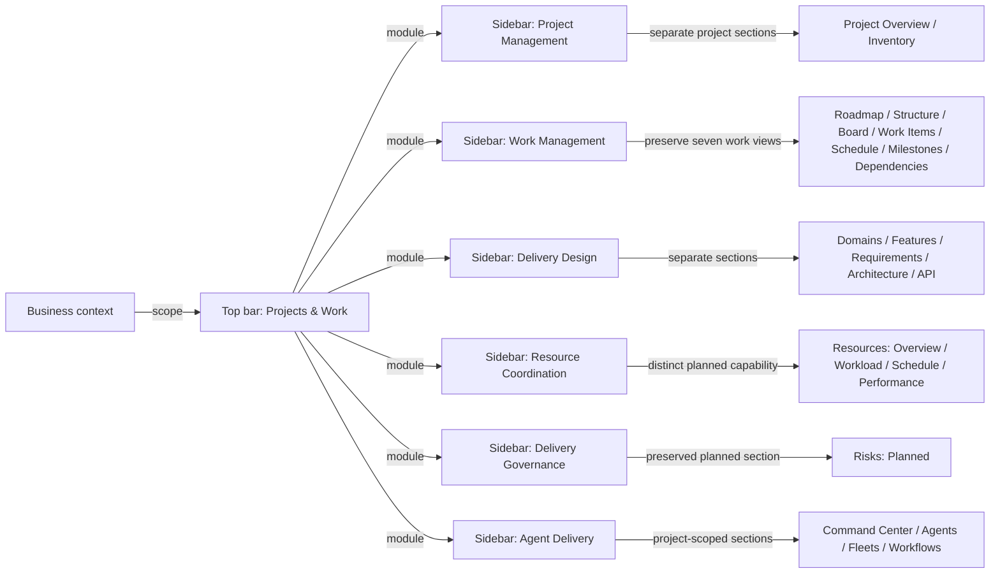
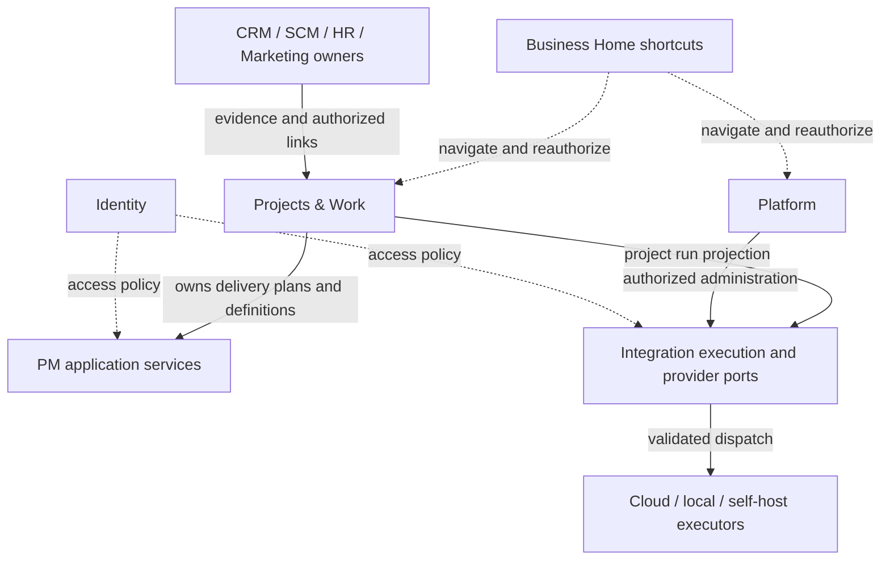

# Project Manager ควรอยู่ Domain ไหน และเมนูควรแบ่งอย่างไร

**Candidate · C-3 · architecture risk HIGH.** This is an architectural recommendation and correction to the earlier navigation proposal. It does not approve application code, new grants, data migrations or deployment.

**Semantic audit correction:** [14 — ความหมายของแท็บเดิม](14-EXISTING-PROJECT-TAB-SEMANTICS.md) ตรวจครบ 9 sections และ 14 existing routes แล้ว Inventory หลุดจากตารางรุ่นก่อนจริง จึงคืน entry ชัดเจน; Risks/Resources ต้องคงเป็น planned capabilities แยก และ Resources ไม่เท่ากับ Team/Files/Repositories ตารางหมวดด้านล่างแก้ตามหลักฐานนี้แล้ว

**New owner requirement:** [15 Workforce planning & performance](15-WORKFORCE-CAPACITY-SCHEDULE-AND-PERFORMANCE.md) now defines human Resources scope: Overview / Workload / Schedule / Performance, each with Person/Team views. This extends the existing planned slot; it does not change the historical tab audit or Team's access authority.

## 1. ข้อสรุปที่เสนอ

**ให้ Project & Work Management เป็น Domain ระดับบนต่อไป โดยเปลี่ยนชื่อที่แสดงจาก Development เป็น Projects & Work และแบ่งหมวดย่อยภายในตามหน้าที่ธุรกิจ** ไม่เพิ่ม parent ที่มีลูกเดียว และไม่ย้ายทั้งระบบไปเป็น feature ใต้ Software Engineering

เหตุผล: Project Manager เดิมรองรับการวางแผนและส่งมอบงานหลายประเภท รวมถึงงานขาย แคมเปญ การย้ายข้อมูล งานปฏิบัติการ และการขยายธุรกิจ ชื่อ Development จึงสื่อขอบเขตแคบเกินไป แม้ตำแหน่งระดับบนจะเหมาะสมอยู่แล้ว การใช้คำว่า PPM ในเอกสารหมายถึงกลุ่มความสามารถ Project/Portfolio Management; ไม่ได้ประกาศว่าระบบมี investment portfolio, programme management, timesheet หรือ project accounting ครบแล้ว

**ควรแยกความรับผิดชอบภายใน แต่ยังไม่มีเหตุผลจากหลักฐานชุดนี้ให้แยกแอป ฐานข้อมูล หรือ microservices** โดยเฉพาะ Provider/MCP และ durable execution ต้องใช้เจ้าของเดิมร่วมกับ Domain อื่น ไม่ให้ PM กลายเป็นเจ้าของ platform ทั้งหมด

โครงสร้างตามคำชี้แจงของเจ้าของ:

1. Top bar = Business Domain หรือกลุ่ม Domain ตาม ERP
2. Sidebar = Subdomain / functional module ของ Domain ที่เลือก
3. Content tabs = Views หรือส่วนงานภายใน module นั้น
4. Business Home = หน้ารวมข้าม Domain และ shortcuts ไปยังเจ้าของจริง

ข้อเสนอเดิมที่แทน sidebar ทั้งชุดด้วยรายการ feature ของ Project และลบ ProjectTabs ถูกถอนจากคำแนะนำปัจจุบัน ดู disposition ใน §10

[ASSUMPTIONS]

1. Subdomain ใน sidebar หมายถึง functional module ที่ผู้ใช้เข้าใจ; การสร้าง bounded context หรือ grant ใหม่ต้องมีเหตุผลด้าน ownership แยกต่างหาก
2. Projects & Work และหมวดย่อยหกกลุ่มเป็นชื่อที่เสนอเพื่อทบทวน ยังไม่ใช่ชื่อที่เจ้าของอนุมัติให้เปลี่ยนในระบบ
3. รอบนี้เป็นการประเมิน placement และแก้เอกสาร; การ remap JSON/wireframes ทั้งชุดและ implementation ใช้ขั้นตอนใน §11

## 2. หลักฐานจาก repository และสิ่งที่ยังเป็นข้อเสนอ

ตรวจ source ปัจจุบันที่ `000b26f1000fe178b06282db83f2ed6cb1b60f47` วันที่ 2026-09-16 Asia/Bangkok แยกจากฐาน design worktree `087f30258a6831865afd751e28804e36505aff30` แล้วเปรียบเทียบระหว่างสอง revision: ไม่มี diff ใน domains.js, ProjectTabs, WorkViewTabs, Sidebar, PM charter และ ADR-069/071

| Evidence | สิ่งที่ยืนยันได้ |
|---|---|
| [domains.js](../../../apps/server/src/config/domains.js) | `projects` เป็น top-level registry key, label Development; sidebar มี 8 destinations รวม Dashboard, All Work, Timeline และ Files |
| [ProjectTabs](../../../apps/server/src/modules/project-manager/components/ProjectTabs.jsx) | Project, Inventory, Team, Work, Files, Import เป็น project-scoped sections; More มี planned sections การมี tabs ไม่ใช่ข้อผิดพลาดในตัวเอง |
| [WorkViewTabs](../../../apps/server/src/modules/project-manager/components/WorkViewTabs.jsx) | Work มีแถว view เฉพาะอีกชั้น จึงต้องแยกความหมายของ section, view และ action ให้ชัด |
| [Sidebar](../../../apps/server/src/components/layouts/Sidebar.jsx) | แสดง navigation ของ Business domain ขณะเปิด Project; prefix matching อาจทำให้ ancestor active ซึ่งยังไม่ใช่หลักฐานว่า route หรือ authorization ผิด |
| [ADR-071](../../decisions/ADR-071-CRM-IS-A-PARENT-DOMAIN-OVER-CUSTOMER-AND-MARKET-INTELLIGENCE.md) | ประเมิน Development ว่าเป็นกลุ่ม PPM และมี slot ของตัวเองอยู่แล้ว; การเปลี่ยน label ต้องเป็น candidate amendment ต่อ D4 |
| [ADR-069](../../decisions/ADR-069-SCM-IS-A-PARENT-DOMAIN-OVER-WAREHOUSE-INVENTORY-PROCUREMENT-AND-ORDER-MANAGEMENT.md), [.claude/AGENTS.md](../../../.claude/AGENTS.md) | ERP groups เป็น presentation เหนือ leaf keys; ไม่สร้าง model, route, module หรือ grant จากการเพิ่มกลุ่ม |
| [PM charter](../../domains/project-manager/CHARTER.md) | PM lane ปัจจุบันถือ scope foundation, project/work planning, progress, files และ audit รวมกัน; นี่เป็นขอบเขต technical ownership ที่กว้างกว่า label ใน UI |
| [Integration charter](../../domains/integration/CHARTER.md) | Provider/Connection/Credential และ PipelineRun/Step เป็นเจ้าของโดย Integration; อยู่ใน Platform surface |
| [Agent charter](../../domains/agent/CHARTER.md) | เป็น LINE/AI runtime และ execution evidence; ไม่ใช่หลักฐานว่ามี general fleet supervisor แล้ว |
| Business Home entry ใน domains.js | เป็น non-owning cross-domain landing; source ปัจจุบันมี sidebar Dashboard เท่านั้น shortcuts ตามคำขอเป็นส่วนที่ต้องออกแบบเพิ่ม |

การอ่าน source นี้ไม่ใช่การทดสอบ production UI และไม่ใช่ผล user research สาเหตุที่ผู้ใช้สับสนยังต้องตรวจด้วย task-based usability review; สิ่งที่ยืนยันได้คือข้อเสนอเดิมของเราจัดระดับ navigation ไม่ตรงกับคำชี้แจงล่าสุด

## 3. คำศัพท์ห้าระดับที่ต้องไม่ปะปน

| ระดับ | คำถามที่ตอบ | ตัวอย่าง | สิ่งที่ไม่ควรสรุปจากระดับนี้ |
|---|---|---|---|
| Business scope | กำลังทำงานให้ธุรกิจใด และมีสิทธิ์อะไร | Group / Organization / Business ใน shell | เลือก Project แล้วได้สิทธิ์เพิ่ม |
| Product domain / ERP group | กำลังทำหน้าที่ธุรกิจด้านใด | SCM, CRM, Projects & Work | หนึ่ง topbar slot ต้องเท่ากับหนึ่ง service/database |
| Subdomain / functional module | ภายใน Domain นี้กำลังจัดการเรื่องใด | Project Management, Work Management | ทุก sidebar row ต้องมี bounded context ใหม่ |
| Feature / resource | กำลังใช้ความสามารถหรือจัดการสิ่งใด | Dependency planning, Agent version, Project A | feature ใช้หลาย Domain แล้วต้องย้ายเจ้าของทั้งหมดมา PM |
| View / action | ดูข้อมูลอย่างไร / ต้องการทำอะไร | Board, Timeline / Import plan | view หรือปุ่ม Import เป็น subdomain ใหม่ |

Technical domain/bounded context หมายถึงขอบเขตเจ้าของกฎและข้อมูล เช่น `project-manager`, `integration`, `identity` ต้อง map กับ product domain อย่าง explicit แต่ไม่จำเป็นต้องตรงกันแบบหนึ่งต่อหนึ่ง

`DOM-DEVELOPMENT` เป็น stable product-domain ID, `projects` เป็น route/grant key และ `project-manager` เป็น technical lane: เสนอเปลี่ยนเฉพาะชื่อที่แสดง ไม่เปลี่ยน key หรือความหมายของ ID เหล่านี้

Domain Driven view ใน PM แสดงขอบเขตเจ้าของงานของระบบที่กำลังออกแบบ ส่วน Feature Driven view แสดง capability และข้อกำหนด ทั้งสองเป็นคนละ view และใช้ข้อมูลที่เชื่อมกัน ตัวอย่าง Feature “รับคำสั่งซื้อผ่าน LINE” อาจแตะ CRM, Integration และ Order Management โดยไม่กลายเป็นสาม feature ที่นับผลงานซ้ำ

## 4. เทียบ ERP และเครื่องมือ PM จากเอกสารผู้ผลิต

ตรวจเอกสารวันที่ 2026-09-16; ผลิตภัณฑ์อาจมี UI ต่างกันตาม edition/rollout ตารางนี้อธิบายโมเดล ไม่อ้างว่าทุกผลิตภัณฑ์ใช้ layout เหมือน Zuri และไม่ใช้ workspace/team ของผู้ผลิตแทน Tenant/Business ของ Zuri

| ระบบ | โมเดลที่เอกสารอธิบาย | บทเรียนที่นำมาใช้กับ Zuri |
|---|---|---|
| Odoo | Project เป็น application สำหรับโครงการและ tasks มี milestones, dependencies และ profitability ([Project 19.0](https://www.odoo.com/documentation/19.0/applications/services/project.html)) | PM เป็นหน้าที่ธุรกิจที่แยกสังเกตได้; ไม่ควรจำกัดชื่อให้หมายถึง software development |
| Dynamics 365 | Project Operations เชื่อมงานขาย ทรัพยากร การบริหารโครงการ และการเงิน ([Microsoft overview](https://learn.microsoft.com/en-us/dynamics365/project-operations/)) | Project เป็นตัวประสานงานข้ามหน้าที่; การเชื่อมโยงไม่แปลว่าทุก transaction ต้องมี PM เป็นเจ้าของ |
| Jira Cloud | Sidebar เข้าถึง spaces/boards; ภายใน space มี horizontal tabs; มี For you, Recent และ Starred ([Jira navigation](https://support.atlassian.com/jira-software-cloud/docs/what-is-the-new-navigation-in-jira/)) | Sidebar กับ tabs อยู่ร่วมกันได้เมื่อหน้าที่ต่างกัน; Home/shortcuts เป็นอีก concern |
| Linear | Issues มีทีมเจ้าของ, Projects รวมงานตามผลลัพธ์, Initiatives รวมหลาย Projects; Views เป็น lens ของงาน ([Conceptual model](https://linear.app/docs/conceptual-model)) | แยก strategic grouping, delivery entity และ view; อย่าเรียกทีม/โปรเจกต์ว่า ERP domain โดยอัตโนมัติ |
| Notion | Database เดียวเปิดได้หลาย views และเชื่อม view จากอีก database ได้ ([Views](https://www.notion.com/help/views-filters-and-sorts)); sidebar มี Teamspaces/Favorites ([Sidebar](https://www.notion.com/help/navigate-with-the-sidebar)) | Domain/Feature/Board/Timeline ใช้ต้นทางร่วมกัน; favorites ช่วยเข้าถึงโดยไม่สร้างสำเนางาน |
| Trello | Workspace รวม boards; board มี cards และ views; Workspace views รวมหลาย boards ([Workspace](https://support.atlassian.com/trello/docs/the-workspace-overview/), [Navigation](https://support.atlassian.com/trello/docs/navigation-in-trello/)) | แยก scope ของหลายโครงการกับหนึ่งโครงการ และแยก board resource จาก Board view |
| monday.com | Workspace รวม boards/dashboards/docs, folders ใช้จัดหมวด; views แสดงข้อมูล board หลายแบบ ([Hierarchy](https://support.monday.com/hc/en-us/articles/7278527605906-Understanding-monday-com-s-structural-hierarchy), [Introduction](https://support.monday.com/hc/en-us/articles/115005310945-Introduction-to-monday-com)) | Navigation grouping ไม่เท่ากับ data owner; dashboard รวมข้อมูลโดยไม่สร้าง board ชุดใหม่ |

**ข้อสรุปเป็นการประเมินสถาปัตยกรรมของ Zuri:** ใช้ ERP เพื่อกำหนดขอบเขตหน้าที่ และใช้รูปแบบของ PM tools เพื่อออกแบบการเข้าถึง/มุมมอง ไม่มีมาตรฐาน ERP ข้อใดในหลักฐานนี้บังคับตำแหน่ง Top bar หรือ Sidebar ตายตัว

## 5. ผังที่เสนอ: Domain → Subdomain → Tabs

### 5.1 Projects & Work

ต่อไปนี้เป็น logical modules ใน PM lane เดิม และเป็น target information architecture เท่านั้น ไม่ใช่หกโมดูลที่สร้างเสร็จแล้ว ไม่สร้างหก grant keys และไม่สร้าง canonical execution modes ใหม่

| Sidebar subdomain / module | หน้าที่ | Tabs / views ภายใน | ความพร้อมจากหลักฐาน |
|---|---|---|---|
| Project Management | วัตถุประสงค์ lifecycle และภาพรวม operational data | Projects, Project/Overview, **Inventory** | Project และ Inventory มี source; Inventory เป็น read-only projection ตาม FR-077 แยกจาก lifecycle page |
| Work Management | Workstream, WorkItem, dependency และ execution planning | **Execution Roadmap, Structure Plan, Board, Work Items, Schedule, Milestones, Dependency Map** | เก็บเจ็ด Work views เดิม; default Structure Plan; Calendar เป็นส่วนเพิ่ม candidate; execution mode ยังอยู่ใต้ Project จนมี amendment |
| Delivery Design | ขอบเขตและข้อกำหนดก่อนทำงาน | Domains, Features, Requirements, Architecture, API, Decisions | ส่วนขยาย candidate; existing API docs ใช้เป็น authority ต่อได้ |
| Resource Coordination | กลุ่มทางเข้าทรัพยากร โดยแยก semantics ของแต่ละ capability | **Resources (Proposed): Overview / Workload / Schedule / Performance**, Team, Files, Repositories, Connections used | PMR-033 กำหนด workforce จาก requirement ใหม่; Team คง Business Membership context และ link ไป workload ที่ตรวจสิทธิ์แยก |
| Delivery Governance | ความเสี่ยง หลักฐาน การทบทวน และเงื่อนไขส่งมอบ | **Risks (Planned)**, Reviews, Test & Release Evidence, Activity; link ไป Milestones & Gates | Risks เดิมเป็น planned slot; review/release workflow เป็น candidate; `/milestones` คงเป็น Work view และใช้ owner route เดิม |
| Agent Delivery | การวางแผนและติดตาม agent ที่ทำงานให้โครงการ | Command Center, Agents, Fleets, Workflows | candidate PM execution profile; runtime ใช้ Integration-owned ports |

Tab ที่เปลี่ยนชนิดข้อมูล เช่น Files → Repositories เป็น **section tab**; List → Board ของ WorkItem เดียวกันเป็น **view tab** ทั้งสองอยู่ภายใน module แต่ไม่สร้าง nested tab bars หลายแถวโดยไม่มีเหตุผล ให้เลือก section ก่อนและใช้ display toggle เฉพาะเมื่อจำเป็น

Project เปิดใน content/resource context; sidebar ยังบอก module ที่เลือก แสดง filter ชัดเจน `All authorized projects in this Business` หรือ `Project A` ใน main header การเลือก Project ไม่เพิ่ม global context selector และไม่ได้ขยายสิทธิ์ ถ้า module/view ใหม่ใช้ filter เดิมไม่ได้ ให้แจ้งและให้เลือกใหม่ ไม่ทิ้ง filter เงียบ ๆ



### 5.2 Wireframe ของ shell ที่แก้ความเข้าใจแล้ว

```text
Business context: Group > Organization > Business
Domain bar: Business Home | SCM | CRM | Marketing | Projects & Work | ... | Platform
+-------------------------+-----------------------------------------------------+
| Projects & Work         | Work Management                                     |
|                         | Business: SmartGift  | Projects: Project A           |
| Project Management      | Breadcrumb: Projects & Work > Work Management       |
| Work Management [active]|                                                     |
| Delivery Design         | List | Board [active] | Timeline | Calendar | ...   |
| Resource Coordination   |                                                     |
| Delivery Governance     | Filters: owner / domain / feature / status          |
| Agent Delivery          | Board of the SAME authorized WorkItems              |
|                         |                                                     |
|                         | [Create work]                       [Import plan]   |
+-------------------------+-----------------------------------------------------+
```

ชื่อ SmartGift และ Project A เป็นตัวอย่าง layout ไม่ใช่ข้อมูลสถานะจริง บนมือถือให้ยุบ Domain navigation และ sidebar เป็น control/drawer ที่ระบุระดับชัด; local tabs คง active view และใช้ overflow ที่เข้าถึงด้วย keyboard ได้ ไม่วาง 6 modules กับทุก tab ใน rail เดียว

### 5.3 Business Home

Sidebar แสดง Overview, My Work, Pending Decisions, Favorites/Recent และชุด shortcuts ตามบทบาท โดยรายการเหล่านี้เป็น **home widgets หรือ references** ไม่ใช่การประกาศว่า Home เป็นเจ้าของ WorkItem, Review, SalesTask หรือ Provider

Shortcuts อาจชี้ไปยังทั้ง subdomain และ feature ตามคำขอ เช่น Work Management, Feature map ของ Project A, CRM Inbox, Inventory Stocktake หรือ Provider Registry สำหรับผู้มีสิทธิ์

- Shortcut เปิด canonical destination ของเจ้าของจริง แล้ว Domain bar/sidebar/tab สะท้อนปลายทางนั้น
- Home widget ที่ดูสรุปใน Home ต่อได้ต้องระบุ owner และ scope; กดทำงานต่อจะไปยัง owner surface
- เก็บ destination identity และ resource/view references ที่ตรวจสอบได้ ไม่คัดลอก feature หรือสร้าง route alias ที่เป็น writer อีกชุด
- Favorites ส่วนบุคคลกับ shortcuts ที่ Business จัดให้ต้องแยกเจ้าของการตั้งค่า; ทั้งคู่ไม่เป็น grant
- Query และ click ต้องตรวจสิทธิ์ปัจจุบัน; หากสิทธิ์ถูกถอน ให้แสดง unavailable โดยไม่คืนข้อมูล/จำนวนจาก Domain ที่อ่านไม่ได้
- Routes ของ module/feature ใหม่ยังไม่กำหนดในรอบนี้; shortcut ต้องไม่ชี้ placeholder ที่ดูเหมือนใช้งานจริง

## 6. ขอบเขตของ requirements เดิม

| Requirement จากเจ้าของ | ตำแหน่ง UX ที่เสนอ | เจ้าของ/ข้อจำกัด |
|---|---|---|
| Domain Driven view | Projects & Work → Delivery Design → Domains | lens ของ technical ownership; ไม่เพิ่ม topbar domains ทุกครั้งที่เพิ่ม node |
| Feature Driven view | Projects & Work → Delivery Design → Features | capability หลาย Domain ใช้ identity และ trace ร่วม; แยกจาก Domains |
| Directed architecture node/edge view | Delivery Design → Architecture | diagram เป็น design artifact ที่ pin revision/type/direction ไม่สร้าง service จากการลาก node โดยอัตโนมัติ |
| Visual Swagger/API | Delivery Design → API | scoped catalog จาก contract authority; environment และ execution permission แยกจากดูเอกสาร |
| Agent command center | Agent Delivery → Command Center | filtered projection ของ project runs; global cross-domain console เป็น Platform capability proposal |
| Agent inventory | Agent Delivery → Agents | project delivery definitions/versions; ไม่แก้ canonical LINE runtime persona หรือเพิ่ม permission จากการลงทะเบียน |
| Fleet inventory | Agent Delivery → Fleets | composition ของ approved references; ไม่สร้าง supervisor ใหม่ใน business agent lane |
| Agentic / multi-agent workflow | Agent Delivery → Workflows | PM owns delivery definition profile; durable run state/queue/leases ผ่าน Integration port |
| Cloud/local/self-host providers และ MCP | Platform → Integrations; project ดู Connections used | Integration owns provider/connection/secret lifecycle; Identity controls authority/client access; runtime API and MCP are distinct adapter capabilities |
| Docs → Diagram → Spec → Code | Delivery Design ร่วมกับ Delivery Governance | source revision → review → contract/tests → code evidence; การจัดเมนูไม่ข้าม approval หรือ release gates |

MCP เป็น protocol/interface สำหรับเชื่อม tools/resources ไม่ใช่เงื่อนไขว่าทุก local LLM ต้องถูกเรียกผ่าน MCP เสมอไป ให้ registry แยก model API endpoint, MCP server, transport และ credential binding ตาม capability ที่ตรวจได้ อ้างขอบเขตเดิมใน [Providers & MCP](05-PROVIDERS-AND-MCP.md) และ [Agents & Fleets](04-AGENTS-AND-FLEETS.md)



ลูกศรทึบระบุ ownership/call/data contract ตาม label; เส้นประระบุ navigation หรือ access policy ตาม label ไม่ตีความทุก edge เป็น run step

## 7. เมื่อไรควรแยก Domain จริง

จำนวนเมนูหรือความยาว sidebar เป็นสัญญาณให้จัดข้อมูลใหม่ ไม่ใช่หลักฐานเพียงพอให้เพิ่ม Domain หรือ service ใช้เกณฑ์ต่อไปนี้ร่วมกัน:

1. มีภาษาธุรกิจ กฎ และ data owner ของตนเองที่บอกขอบเขตได้ชัด
2. สิ่งที่จัดการมี lifecycle อยู่ได้โดยไม่มี Project และหลาย Domain ต้องใช้ร่วมกัน
3. มีบทบาท/สิทธิ์และนโยบายข้อมูลที่แตกต่าง โดยไม่ใช้ navigation เป็นการให้สิทธิ์
4. มี public contract ที่ทำให้เจ้าของอื่นใช้ได้โดยไม่เขียนตารางข้ามกัน
5. การเปลี่ยนแปลงส่วนนี้เป็นอิสระจริง ไม่ใช่แค่ทีมอยากได้ sidebar ใหม่

| ส่วน | คำแนะนำตอนนี้ | เงื่อนไขสำหรับการแยกในอนาคต |
|---|---|---|
| Project lifecycle / Work / Governance | แยก logical modules ภายใน Projects & Work | ไม่แยก topbar/DB ตามจำนวน tabs |
| Architecture / API / Product catalog | เริ่มเป็น Delivery Design capability ตาม design package | ถ้า canonical product/service/contract catalog อยู่ข้ามหลาย projects และมี owner/lifecycle อิสระ ให้ประเมิน Product & Engineering domain ผ่าน ADR |
| Agent/Fleet delivery definitions | คง project profile และ versioned references | ถ้าใช้เป็น reusable business automation ทั่วทั้งระบบ ต้องออกแบบ registry scope/owner ให้ชัดก่อนเพิ่ม shared editing |
| Provider/MCP/execution infrastructure | แยก ownership ไป existing Integration/Identity ตามที่กำหนดแล้ว; UI อยู่ Platform | ไม่จำเป็นต้องเพิ่ม AI topbar เพียงเพราะมีหลาย provider |
| Scope foundation / audit / shared files | บันทึกว่ามี technical ownership รวมอยู่ใน PM charter | audit แยกต่างหากก่อนย้าย owner; รอบ navigation นี้ไม่ย้าย schema/writer |

Project Management เป็น subdomain ภายใต้ Projects & Work ได้โดยธรรมชาติ ส่วนชื่อ “Project Manager” ที่ใช้เรียกทั้ง package ในเอกสารเดิมครอบคลุมหลาย logical modules ไม่ควรนำชื่อ package ไปเป็นอีกแถวครอบทุก feature ซ้ำ

## 8. การอยู่ร่วมกับ ERP Domain อื่น

- Campaign อยู่กับ Marketing, sales activity อยู่กับ CRM, stock movement อยู่กับเจ้าของ Inventory/Warehouse และบัญชีอยู่กับ Finance เมื่อมี contract ของส่วนนั้น PM เชื่อมเป้าหมาย dependency และ evidence เท่าที่ได้รับอนุญาต
- โครงการ “เปิดสาขาใหม่” อาจมี workstreams จากหลาย Domain; Project ไม่ย้ายเจ้าของข้อมูลเหล่านั้นมาอยู่ PM
- `SalesTask` ไม่ถูกแปลงเป็น `WorkItem` เพียงเพื่อให้รวม My Work ได้ หน้า Home ใช้ normalized read projection พร้อมชนิดรายการและลิงก์ owner
- Progress ยังคง strategy/weight/evidence ของ Workstream ทั้งเจ็ด execution modes; ไม่ใช้สัดส่วน task เสร็จเป็น universal progress
- `Portfolio` ใน scope chain เดิมไม่ถูกนำไปใช้แทน investment portfolio หรือ programme entity โดยเปลี่ยนป้ายชื่อ

## 9. Route, UX และ contract acceptance ก่อนแก้จริง

Round นี้ไม่มีการตั้ง canonical IDs หรือ routes ใหม่ ตารางเป้าหมายหลังอนุมัติต้องมีอย่างน้อย destination identity, product domain key, logical module, section/view, allowed resource context, source route, owner lane, readiness และ required authority ใช้ registry/IDs เดิมเท่าที่มี และจองรหัสใหม่ผ่าน governance เมื่อ scope ยืนยันแล้ว

| Local review case | สิ่งที่ต้องพิสูจน์ |
|---|---|
| TAX-A1 | Top Domain คงที่เมื่อสลับ tabs ใน module; sidebar active หนึ่ง module และ tab active หนึ่ง view |
| TAX-A2 | เปิด WorkItem เดิมผ่าน Board/List/Timeline แล้วได้ identity เดิม และ authorization/filter เดิม |
| TAX-A3 | Domain/Feature views แยกกันและ cross-link ได้ โดยไม่สร้าง duplicate requirement/progress |
| TAX-A4 | All projects กับ Project A มี scope label ต่างกัน; Back/Forward/deep link คืน resource และ view ถูกต้อง |
| TAX-A5 | Home shortcut ไป subdomain หรือ feature แล้วเลือก owner domain/module/tab ถูก; ถอนสิทธิ์แล้วเข้าถึงข้อมูลไม่ได้ |
| TAX-A6 | แผนเปลี่ยนเมนู map 8 Business destinations และ 14 existing project route templates ครบ; URL เดิมยัง resolve ได้ |
| TAX-A7 | Import เป็น action ที่มี preview/conflict/receipt ตาม lane เดิม; planned capability ไม่สร้าง fake success |
| TAX-A8 | Project Agents/Connections ไม่เปิด global provider administration หรือขยาย grants |
| TAX-A9 | Keyboard/mobile เข้า Domain → module → tab → content ได้; tab overflow ไม่ซ่อนหน้าที่จำเป็น |
| TAX-A10 | User review ให้คนหา Domain/Feature, ดูงานโครงการ, กลับภาพรวม Business และเปิด favorite โดยระบุ scope ถูก |

TAX-A* เป็น local candidate acceptance labels ไม่ใช่ tests ที่รันแล้ว Product browser tests, native mobile/screen reader และ usability study ของ IA ใหม่นี้เป็น NOT_RUN

## 10. Version diff และผลต่อเอกสารก่อนหน้า

เอกสารนี้เป็นคำแนะนำล่าสุดเฉพาะ taxonomy/navigation ภายใน package; ไม่ supersede accepted ADR หรือเปลี่ยน API semantics เอกสาร/JSON/prototypes รุ่นก่อนหน้าที่ยังใช้ flat project sidebar ต้อง reconcile ก่อนใช้สร้าง code

| ก่อนคำชี้แจง | หลังคำชี้แจง / disposition |
|---|---|
| NAV-D1: sidebar เปลี่ยนเป็นรายการ feature ของ Project | WITHDRAWN: sidebar เป็น subdomain/module; Project เป็น resource context ใน content |
| NAV-D2: ลบ ProjectTabs | WITHDRAWN: คงหลักการ local tabs แต่จัด section/view/action ให้ถูกระดับ |
| Development label คงเดิม | PROPOSED: Projects & Work โดยคง `projects`, `DOM-DEVELOPMENT` และ owner keys; ต้อง reconcile ADR-071 D4 |
| Domain/Feature/Architecture/API/Agent/Fleet เป็น sidebar peers ทั้งหมด | REGROUP: ย้ายเข้าส่วน Design / Agent Delivery และ tabs ตาม §5 |
| Business Home Dashboard เท่านั้น | PROPOSED: เพิ่ม widgets และ shortcuts แบบ non-owning ตาม §5.3 |
| NAV-D3 Business scope ceiling และ NAV-D8 provider ownership | RETAIN: global context ไม่เพิ่ม Project; Platform/Integration เป็นเจ้าของ registry |
| NAV-D4 เปลี่ยน default Work ไป all-work | ON HOLD: ยืนยัน default เมื่อ map routes/tabs รุ่นใหม่ครบ ไม่ผูกกับข้อเสนอ sidebar เดิม |
| NAV-D5 Import และ NAV-D6 readiness | RETAIN PRINCIPLE: เป็น action ชัดเจนและไม่หลอกว่า planned features ใช้งานแล้ว |
| NAV-D7 navigation model | REVISE BEFORE CODE: ระบุ domain/module/section/view/context และ shortcuts; ไม่เป็น registry ให้สิทธิ์ชุดใหม่ |
| NAV-P0/P1 และ 14 navigation acceptance เดิม | NEED RECONCILIATION: ไม่อนุมัติ implementation จากแผน/acceptance รุ่นเดิม |
| UX forms, content layouts, OpenAPI/run contracts | RETAIN SUBJECT TO REVIEW: ใช้ต่อได้ในขอบเขตเดิม; screen-to-navigation mapping ต้องเปลี่ยน |
| `navigation.candidate.json`, `ux-ui.candidate.json`, HTML reviews v0.3 | HISTORICAL NAV SNAPSHOT: ยังไม่ใช่ spec-to-code input ของ IA รุ่นนี้ |

## 11. ลำดับทำงานต่อหลังทบทวนข้อเสนอ

1. ตรวจ [ความหมายและ retention mapping ของ 9 แท็บเดิม](14-EXISTING-PROJECT-TAB-SEMANTICS.md) ให้ครบก่อนยืนยันชื่อ Domain, logical modules หกกลุ่ม, Business Home shortcut semantics และ shared-owner boundary; ห้ามใช้กลุ่มใหม่แทน capability เดิมโดยไม่มีความหมายและ contract รองรับ
2. จัด parent/peer amendments พร้อมกัน: ADR-071 D4, SITEMAP, ERP-MODULE-MAP, interface/route inventory และ requirement/feature registry เฉพาะที่จำเป็น; ไม่เปลี่ยน charter เพราะแค่จัดกลุ่มเมนู
3. ปรับ navigation contract และ 37 screen mappings/wireframes ให้เป็น Domain → module → tabs; แยกของเดิม/ส่วนที่ยัง planned; ทำ route crosswalk ทุกหน้า
4. ตรวจ diagram/model/contract และขออนุมัติ navigation implementation spec ที่เป็นรูปธรรมตาม R5 แล้วจึงเปลี่ยน app code; การเห็นภาพ wireframe ไม่เท่ากับอนุมัติทุก feature
5. Implement menu slice, ทดสอบ acceptance และ source contracts ตาม scope; เปลี่ยน API/owner/runtime ใน slice ของมันเองเมื่อมีข้อกำหนดอนุมัติ

**Exit ของรอบวิเคราะห์นี้:** มีข้อสรุป placement ที่อ้าง source, comparator matrix จาก primary sources, ผัง hierarchy, requirement ownership map และ disposition ต่อ candidate เก่า ครบโดยไม่ย้ายข้อมูลหรือแก้ application code

## CHANGELOG

| Version | Date | Status | Summary | Commit Hash | Agent |
|---|---|---|---|---|---|
| 0.1.0b | 2026-09-16 | candidate | Owner clarification, ERP/PM comparison, Projects & Work placement, module/tab hierarchy and prior navigation disposition | source 000b26f1; uncommitted | RWANG |
| 0.2.0b | 2026-09-16 | candidate | Restore Inventory and seven Work views explicitly; retain planned Risks/Resources; distinguish Team membership from resource planning | source 96630462; uncommitted | RWANG |
| 0.3.0b | 2026-09-16 | candidate | Define Resources workforce views from new owner requirement without changing existing tab audit | source 0f5a47fc; uncommitted | RWANG |
