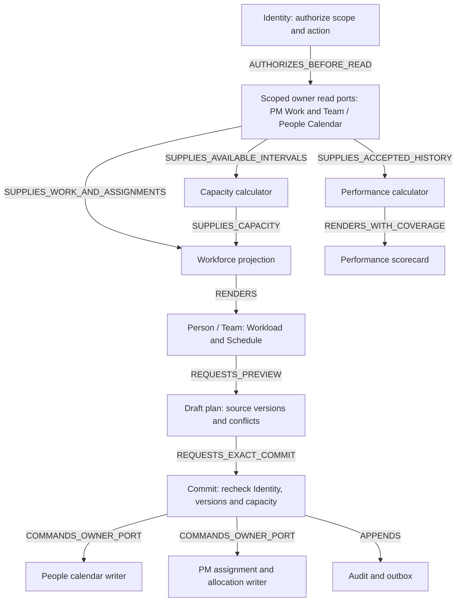

# Resources — กำลังคน ตารางงาน และ Performance

**Requirement supplied by owner; detailed design CANDIDATE / NOT_IMPLEMENTED.** Complexity C-3; prospective implementation risk HIGH because calendars, assignment history, employee data and authorization cross module boundaries. This review changes documentation and contract artifacts only.

## 1. Requirement และผลลัพธ์ที่ต้องได้

**PMR-033 — Workforce planning and performance:** ระบบต้องนำงานที่มอบหมายมาสรุปภาระงาน กำลังคนที่มีและที่ต้องใช้ ตารางงานของพนักงานรายคนและรายทีม รวมหลาย Project ภายใต้ scope ที่มีสิทธิ์ พร้อมเมตริกวัดผลงานที่มีสูตร ช่วงเวลา ตัวหาร เป้าหมาย หลักฐาน และสถานะคุณภาพข้อมูลที่ตรวจสอบได้

Capability **PMF-11: Workforce planning & performance**; primary owner `project-manager`, contributors `people` module, Identity and CRM Person read contract. Extends the resource/capacity intent of PMR-017 with a new precise subject; does not repurpose FR-036, FR-042, FR-089 or FR-193. PMR/PMF/PMT are proposal-local IDs pending canonical registration.

| ผู้ใช้ | คำถามที่ระบบต้องตอบ | ผลลัพธ์ |
|---|---|---|
| พนักงาน | วันนี้/สัปดาห์นี้มีงานอะไร งานไหนชนกัน และส่งมอบได้ตามเป้าหมายหรือไม่ | My workload, agenda, calendar, personal scorecard และหลักฐานของตน |
| หัวหน้าทีมที่ได้รับสิทธิ์ | ใครงานล้น ใครยังรับงานได้ ทีมขาดกำลังคนช่วงไหน | Person rows, Team roll-up, capacity gap และ preview การย้ายงาน |
| Project Manager | งานของ Project ใช้คนเท่าไร ชนกับ Project อื่นหรือไม่ | Project filter บน workforce projection เดียวกัน พร้อม scope/coverage |
| ผู้รับผิดชอบ HR/People | ปฏิทินทำงานและความพร้อมของพนักงานถูกต้องหรือไม่ | Employment-linked calendar/availability และทางเข้า workload ที่ตรวจสิทธิ์ซ้ำ |
| ผู้รับผิดชอบ Business | ปริมาณงาน การส่งตรงเวลา คุณภาพ และผลลัพธ์ดีขึ้นหรือไม่ | Team/Business trends จากข้อมูลรวมแบบไม่ซ้ำ พร้อมเป้าหมายและข้อจำกัด |

[ASSUMPTIONS]

1. Requirement นี้ครอบคลุม **คนทำงาน**; Agent/Fleet capacity ยังใช้ contract ของ agent execution ต่างหาก และไม่รวม token/task ของ agent เป็นกำลังคน
2. เริ่มที่หนึ่ง Business รวมหลาย Project; ข้าม Business ได้เฉพาะ scope ที่ได้รับสิทธิ์และแสดง coverage ชัดเจน
3. Performance ใน slice นี้คือ **ผลงานการส่งมอบที่ตรวจได้**; การประเมินเงินเดือน/ค่าตอบแทนเป็นกระบวนการ HR แยก
4. ระบบรองรับเป้าหมายรายคน/ทีม แต่ไม่กำหนด KPI เป้าหมายจริงหรือเวลาทำงานมาตรฐานแทนเจ้าของ Business; ค่าตัวอย่างด้านล่างเป็นข้อมูลสมมติ
5. ค่าเริ่มต้นเป็นการวางแผนและ preview โดยผู้ใช้; ไม่มีการย้ายงานหรือประกาศตารางใหม่อัตโนมัติ

## 2. หลักฐานของเดิมและช่องว่างที่ต้องเติม

Source inspected: `0f5a47fcf2b8b4e846edbc67f2a051c6673e4b83`, 16 September 2026. These are source findings, not a production test.

| หลักฐาน | สิ่งที่มีจริง | ช่องว่างสำหรับ PMR-033 |
|---|---|---|
| [Project Team service](../../../apps/server/src/modules/project-manager/application/project-team-service.js), [FR-036](../../domains/project-manager/features/FR-036-project-team.md) | Membership ในบริบท Project; นับ WorkItem ด้วย assigneeRef | `activeWorkItems` กรองเพียง `deletedAt: null` และ Project/assignee **ไม่มี status filter** จึงรวมงานเสร็จที่ยังไม่ลบได้; ต้องนิยาม open/WIP/completed ใหม่ใน projection |
| [Prisma model](../../../apps/server/prisma/schema.prisma) — WorkItem | assigneeRef แบบ string, status, startAt, targetAt, weight, metadata/metric JSON | ไม่มี typed effort/time-log/calendar/history contract ใน WorkItem นี้; weight เป็น progress weight ไม่ใช่ชั่วโมง; updatedAt ไม่ใช่เวลาส่งงานหรือเวลาทำงาน |
| [Team service](../../../apps/server/src/modules/project-manager/application/team-service.js), [ADR-037](../../decisions/ADR-037-TEAM-IS-AN-ORGANISATIONAL-GROUPING-NOT-AN-AUTHORITY.md) | Team, TeamMembership, ProjectTeam; กลุ่มทีมไม่ให้สิทธิ์ | TeamMembership ปัจจุบันไม่มีช่วง effective end/history; การเข้าทีมยังต้องมี Membership ตาม writer เดิม |
| [Employment](../../domains/project-manager/features/FR-193-employment-record.md) | พนักงานและช่วงการจ้าง แยกจากสิทธิ์เข้าถึง | ต้องเพิ่มปฏิทิน/เวลาว่างแบบมีช่วงผลบังคับ; ON_LEAVE ของ Employment ไม่ใช่ตารางวันลารายวัน |
| [Schedule](../../domains/project-manager/features/FR-064-schedule-timeline.md) | มุมมองกำหนดเวลางานเดิม | เพิ่ม person/team lanes และ conflict calculation โดยอ้างงานเดิม |
| [FR-042](../../domains/project-manager/features/FR-042-hr-people-peer-domain.md), [PM charter](../../domains/project-manager/CHARTER.md) | HR/People เป็น peer domain ใน UI แต่ module `people` อยู่ใต้ canonical PM charter | คำอธิบายเก่าเรื่อง Team assignment/capacity ไม่ใช่หลักฐานว่ามี capacity engine; source FR-036 และ Employment ที่ใหม่กว่าเป็นฐานอ้างอิง |

การตรวจรอบก่อนระบุ Team count เป็นจำนวนงานรับผิดชอบ; รอบนี้เจาะ query เพิ่มและแก้ให้ชัดว่า **ชื่อ field ว่า active ยังไม่รับประกันว่าเป็นงานเปิดอยู่**. คง compatibility ของ API เดิม; ห้ามเปลี่ยนความหมาย field เดิมเงียบ ๆ

## 3. Domain, Feature และตำแหน่ง UX

| ชั้น | ตำแหน่ง/เจ้าของที่เสนอ | ขอบเขต |
|---|---|---|
| Top bar | Projects & Work — stable route/domain key เดิม `projects` | ตามข้อเสนอ navigation เอกสาร 13 |
| Sidebar | Resource Coordination → **Resources** | ทางเข้า workforce planning; ไม่ย้าย Inventory ออกหรือกลืน Risks |
| Local tabs ของ Resources | **Overview · Workload · Schedule · Performance** | เปลี่ยนมุมมองข้อมูลชุดเดียวกัน |
| View controls | Person / Team; Day / Week / Month; Business / Project; Domain / Feature filters | filter ไม่สร้าง Domain หรือ feature ใหม่ |
| Team เดิม | คง Membership view และขอบเขตสิทธิ์เดิมระหว่าง migration | link ไป “ดูภาระงาน” ได้เมื่อ capability พร้อม; การจัดตารางไม่ grant/revoke Membership |
| HR / People | Employment, working calendars และ availability inputs | ใช้ service ของ owner; deep link ไป workforce projection เดียวกัน |
| Business Home | My work / Team capacity / Delivery performance shortcuts | ทุก shortcut resolve สิทธิ์ใหม่; ไม่ทำสำเนา writer |
| Inventory | เพิ่ม summary/link ไป Resources หลัง implementation พร้อม | คง read-only composition; ไม่มีการแก้ calendar/allocation ผ่าน Inventory |

**Canonical ownership:** ปัจจุบัน `people` เป็น module ของ `project-manager`; การเป็น peer Domain ใน UI ไม่ได้สร้าง canonical HR domain ใหม่. Identity owns authorization; CRM owns Person identity; Integration owns future external calendar/time-system adapters. Performance scorecard นี้เป็น PM delivery projection; HR appraisal ขยายภายหลังด้วย spec ของ owner.

### Typed flow — G14



Edges are directions of data/commands with explicit types. Only owner services persist changes. The approved architecture source now composes PM-G01 with the PM-G14 candidate extension in [architecture.model.json](contracts/architecture.model.json): 28 nodes and 35 directed edges. G14 remains `CANDIDATE`, `codegenReady: false`, and `PENDING_ROOT_REGISTRATION`; this is contract composition, not runtime readiness.

## 4. Data contracts และ invariants

| Record / owner | Required fields and meaning | Rules |
|---|---|---|
| Work estimate / PM | workItemId, estimateMinutes, remainingMinutes, baselineVersion, method, author, recordedAt | Integer minutes; null = unknown; zero remaining is explicit evidence, not a default for missing estimate. Story points remain within the same team's scale and cannot be converted to hours silently |
| Working calendar / people | personId, employmentId, IANA timezone, effectiveFrom/To, weekly intervals, exception intervals, version | No implicit 40-hour week. Calendar belongs to the working assignment; ending Employment bounds future availability without changing Membership |
| Availability exception / people | person/calendar, startAt/endAt, kind AVAILABLE or UNAVAILABLE, sourceRef/version | PM receives availability only; calendar subtracts interval union so overlapping leave/holiday is counted once. Meetings use either an exception or an allocation, never both |
| Allocation / PM | personId, workItemId, creditedTeamId nullable, start/end, remainingMinutes, placement DAILY_BUDGET or FIXED_SLOT, status DRAFT/CONFIRMED/CANCELLED, version | One primary human assignee per WorkItem in this slice. Separate slices may split one person's effort across dates; sum of live future slices cannot exceed that work item's remaining estimate. Team queue demand remains unassigned until a person is selected |
| Assignment/participation history / PM | workItemId/personId/teamId, validFrom/To, source event, revision | Resolve assigneeRef to known Person before allocation; unresolved/agent refs become separate queues. Snapshot current roster at adoption; do not fabricate historical dates or auto-enroll employees through Membership mutations |
| Work log / PM | personId, workItemId, workedAt, durationMinutes, review status, sourceRef, revision | Own draft → submitted → reviewed; reviewed correction is a new revision. Actual work is separate from planned effort. Missing log ≠ zero actual time; submitted time needs coverage declaration before full variance is shown |
| Delivery evidence / PM owner adapters | workItemId, version, eventId, eventType, occurredAt, recordedAt, actor, evidenceRef | Record status transitions, review acceptance/rejection, reopened/block intervals and due-date baselines through the existing WorkItem writer. Deduplicate eventId; never treat a comment or arbitrary imported payload as acceptance |
| Metric policy / PM | metricKey, formulaVersion, unit, direction, target, period, cohort/status mapping, minimumSample, approver | Whitelisted formulas with bounded parameters; no executable formulas. Approved revision is immutable; edits create a revision. One execution mode can use a different outcome policy |
| Metric result / PM projection | scope, subject, period, value/status, numerator/denominator, sampleCount, coverage, formulaVersion, sourceVersions, asOf, evidenceRefs | Same inputs/version produce same result; missing denominator gives null, not 0%. Stale/incomplete/unavailable are visible. Reads authorize before aggregate |

Every new mutable record has internal UUID + human code where useful, createdAt/updatedAt/deletedAt as applicable, integer version and AuditEvent. Ports isolate persistence adapters. Existing assigneeRef/Team APIs are preserved until an explicit versioned amendment is approved.

## 5. จำนวนงาน → ชั่วโมง → กำลังคน

Use half-open intervals `[startAt, endAt)` and integer **minutes** internally; display hours to one or two decimal places. Dates resolve in the calendar's IANA timezone, then UTC; explicit slots carry offset. Reject nonexistent local times; disambiguate DST overlaps explicitly. Month/week totals sum daily buckets.

For person `p` and bucket `d`:

```text
availableMinutes C(p,d) = duration(workingIntervals minus union(unavailableIntervals))
plannedMinutes   L(p,d) = sum(confirmed future effort slices in the bucket)
knownLoadRatio          = L / C × 100, when C > 0
overbookedMinutes       = max(0, L - C)
freeMinutes            = max(0, C - L), only when demand and capacity coverage are complete
teamLoadRatio           = sum(distinct-person L) / sum(distinct-person C) × 100
capacityFTE             = availableMinutes / configured full-time reference minutes
requiredFTE             = demandMinutes / same reference minutes, only with complete estimated demand
```

FTE means equivalent full-time capacity in this period, not headcount. Headcount counts distinct eligible people; skills/role mismatch, daily overload and unassigned demand remain visible even when aggregate FTE looks sufficient. A capacity gap is not an automatic hiring recommendation.

**Scheduling rules**

1. Show assigned count by `PLANNED / IN_PROGRESS / BLOCKED / ACCEPTED / CANCELLED` after a versioned mapping from each execution mode's real statuses. Open = planned/in-progress/blocked. Unknown statuses appear in a separate bucket; do not guess completed from text.
2. Count one WorkItem once at Project/Team/Business total even if it has multiple allocations or Domain/Feature tags. Count distinct person once across teams. Team-specific capacity must use explicit effective team shares whose sum is ≤100%; when shares are absent show shared pool, not a full duplicated denominator for every team.
3. DAILY_BUDGET distributes remaining effort in proportion to available minutes across eligible dates; round down then distribute remaining integer minutes by largest fractional remainder, ties by date. Label it a **daily planning budget**, not a booked meeting. FIXED_SLOT reserves its actual interval duration; remainingMinutes must equal the reserved duration, split at local day boundaries. Its exact start/end stays fixed and must pass availability/overlap validation.
4. A work item with no estimate/dates stays in “ยังประเมิน / ยังไม่จัดตาราง”. Display its count, known demand and coverage; cannot claim the person is free or staffing is sufficient.
5. Unassigned team demand has its own queue; counts toward required team demand when estimated, but does not consume any specific person's capacity until allocated. Never allocate the full effort to every team member.
6. Check workload across all authorized Projects in the selected Business before publishing. Project filter restricts highlighted demand, not the underlying capacity check. Incomplete source permissions return explicit PARTIAL scope; never reveal hidden project IDs/counts or claim globally free time. Cross-Business blocking requires a separately authorized coarse availability contract; otherwise label coverage Business-only.
7. `C=0,L=0`: zero availability, ratio null/N/A. `C=0,L>0`: conflict, ratio null/ZERO_CAPACITY. Unknown C: UNKNOWN, never assume a workday. No eligible date: all effort remains unscheduled and commit refuses.
8. Dependencies, due dates and fixed-slot overlap are validated separately. Show conflicts even where weekly total fits. A permitted capacity override needs an explicit scoped capability and reason; immutable schedule evidence keeps the overload visible. Scope/version/invalid-interval failures cannot be overridden.
9. Preview pins assignment, calendar, team-share and allocation versions. Commit checks them and the same capacity set transactionally; simultaneous plans for one person cannot both consume the same capacity. Stale version → 412, competing overload/dependency → 409 with redacted diagnostics. No optimistic success before the receipt.

### ตัวอย่างที่ต้องแสดงใน UI — synthetic

| คน/ทีม | งานเปิด | เวลาทำงาน | เวลาที่ใช้ไม่ได้ | พร้อมทำงาน | งานที่วางแผน | Load | ภาวะ |
|---|---:|---:|---:|---:|---:|---:|---|
| พนักงาน A | 4 | 40h | 12h | 28h | 35h | 125% | เกิน 7h |
| พนักงาน B | 8 | 40h | 10h | 30h | 18h | 60% | ยังรับได้ 12h |
| ทีมรวมแบบไม่ซ้ำ | 12 | 80h | 22h | 58h | 53h | 91.38% | ต้องแสดง A เกิน 7h แม้ทีมรวมต่ำกว่า 100% |

เมื่อ estimate ของงานใดหายไป ให้เปลี่ยนเป็น known load + PARTIAL พร้อมจำนวนงานที่ยังไม่ประเมิน; ค่า free capacity/required FTE ไม่พร้อมสรุป. จำนวนงานน้อยกว่าไม่ได้หมายถึงมีเวลาว่างกว่า.

## 6. Performance metrics และการตีความ

ทุกการ์ดเปิด drawer ดูสูตร แหล่งข้อมูล ช่วงเวลา ตัวหาร จำนวนตัวอย่าง ความครบถ้วน และรายการงานที่มีสิทธิ์ดูได้. UI มี Person / Team และเทียบช่วงเวลาก่อนหน้าโดยคง cohort/filter/formula เดียวกัน. Capacity/Utilization เป็นข้อมูลการวางแผน; KPI ผลงานแยกเป็น delivery, quality, flow และ outcomes.

| Metric key | สูตร/ประชากรที่วัด | รายคน / ทีม และข้อจำกัด |
|---|---|---|
| WF-M01 Open work / WIP | Distinct open WorkItems at asOf; WIP = in-progress + blocked | รายคนตาม assignment ณ asOf; team total deduplicated; breakdown by status/type/size |
| WF-M02 Planned load | Confirmed known planned minutes / available minutes | ไม่ใช้เป็นคะแนนประสิทธิภาพ; ถ้า demand ขาดแสดง PARTIAL และห้ามสรุป free capacity |
| WF-M03 Capacity gap | Overbooked minutes, unscheduled/unassigned demand และ required/capacity FTE | แสดงรายวันและรายคนคู่กับยอดทีม; FTE ต้องมี reference calendar และ complete demand |
| WF-M04 Accepted throughput | Distinct items with final accepted evidence in period | แยกประเภท/ขนาด/โหมด; reopened ณ asOf ตัดจาก final accepted; raw count และ contribution view คนละค่า |
| WF-M05 On-time commitments | Accepted by frozen dueAt / items committed as due in period | ตัวหารรวมงานถึงกำหนดที่ยังไม่เสร็จ. Baseline freezes owner/team, dueAt and scope before period; late due-date edits ไม่ทำให้ผลย้อนหลังดีขึ้น. Approved adjusted baseline มีอีก lens พร้อม changes/cancellations ไม่เขียนทับ original |
| WF-M06 First-pass acceptance | Items accepted on first formal review / items with first completed review in cohort | First rejection อยู่ในตัวหาร; ไม่มี review evidence เป็น UNKNOWN ไม่ใช่ผ่าน; source review authority separate from assignee |
| WF-M07 Reopen rate | Distinct accepted items reopened within observation window / accepted items with a fully observed window | Policy declares window; example 7 calendar days. Incomplete window shows PROVISIONAL and is excluded from mature rate, with count disclosed |
| WF-M08 Cycle time p50/p85 | Elapsed minutes first IN_PROGRESS → final ACCEPTED for eligible accepted cohort | Nearest-rank quantiles, include blocked waiting in elapsed; show blocked time separately. Unknown historical transitions excluded with coverage, not rebuilt from updatedAt |
| WF-M09 Effort variance | (Reviewed actual minutes − frozen estimate minutes) / frozen estimate minutes ×100 | Same completed-item cohort. Need complete logs and estimate>0; also show absolute minute difference. Actual logs are self-reported/reviewed evidence, not attendance proof |
| WF-M10 Outcome attainment | Progress/output metric through the Workstream's approved progress strategy and target version | Seven modes reuse existing semantics: software evidence, migration reconciliation, sales results, campaign outcome, launch gates, operations service measures, expansion milestones. No universal task completion percentage |
| WF-M11 Blocked time | Union of blocked intervals within working calendar / eligible elapsed working minutes | Surface dependency/process blockers; no automatic blame attribution to current assignee |
| WF-M12 Data coverage | Eligible records with required data / eligible records; break down estimate, schedule, logs, acceptance, historical assignment | Missing source permission does not expose hidden denominator. Unknown denominator → null; below policy minimum sample → INSUFFICIENT_SAMPLE |

**Attribution and history**

- Current workload uses current/effective assignment. Historical performance uses the baseline owner/team and recorded participation; reassignment does not transfer old outcomes to the new assignee automatically.
- One team outcome is counted once. Shared work may show evidence-linked contributions, with explicit allocation of credit; no duplication into every person's throughput. If contribution history is unavailable, show shared/unattributed instead of inventing a split.
- Team percentages are recalculated from pooled numerator/denominator; do not average individual percentages. Cycle-time percentiles use the combined eligible sample, not averages of personal percentiles.
- A period still in progress is PROVISIONAL. Separate future commitments that are not due yet from overdue work; do not score future due dates as missed. Final on-time scoring requires the period/cohort to close. The UI performance example uses 7–13 September, while workload planning uses 14–20 September.
- Soft-delete/reassignment/end of Employment does not erase accepted historical evidence within retention policy. Corrections create a revision and preserve prior published snapshots; distinguish late-arriving event time from recordedAt.
- Default is a multi-metric scorecard. Do not rank unlike roles/teams by raw task counts or story points, or treat missing data as a zero score. Comparison requires the same work cohort, units and policy. A Business may set metric-specific targets with direction HIGHER/LOWER/BAND and an approved period.

**Design basis:** Asana's workload documentation distinguishes task count and effort for capacity planning; its help page search extract was available but direct rendering returned a CSS error during this review. [Asana workload](https://help.asana.com/s/article/portfolio-workload-and-universal-workload?language=en_US). SPACE discusses productivity across several dimensions rather than one activity metric; applying that principle to this PM scorecard is a design choice, and the paper itself concerns software development. [Microsoft Research — SPACE](https://www.microsoft.com/en-us/research/publication/the-space-of-developer-productivity-theres-more-to-it-than-you-think/).

## 7. UX/UI และ wireframes ที่เพิ่ม

All six `WF-R*` are candidate screen families extending WF-25. Existing 37-screen JSON/gallery is a historical navigation draft and does not yet contain these six. No active UI button may promise this capability until implementation is delivered.

### WF-R01 — Workforce overview / Workload

```text
Top Domain: Projects & Work                         Search / Business context
Sidebar: Resource Coordination > Resources
Tabs: [Overview] [Workload] [Schedule] [Performance]
Scope: Business / Project    Group: Person / Team    Period: This week
Filters: Domain | Feature | Work type | Team       Data: complete · asOf
------------------------------------------------------------------------
Open 12 | Known effort 53h | Available 58h | Overload: 1 person / 7h
Person / Team       Mon    Tue    Wed    Thu    Fri    Plan/Capacity
Employee A          daily cells with hours + text     35 / 28h  OVER +7
Employee B          daily cells with hours + text     18 / 30h  FREE 12
Unestimated / Unassigned / Unscheduled queues [open each source list]
Select cell → evidence + affected Projects → Preview reassignment
```

### WF-R02 — Person schedule

```text
Employee / Team selector | Day · Week · Month · Agenda | Local timezone
Workload 125% · 7h over | Working intervals | Availability exceptions
Time lanes: fixed slots; daily-budget band is visually separate
09:00 [Work A · Project 1]    11:00 [Work B · Project 2] conflict marker
Unscheduled work drawer: estimate / dates / remaining minutes required
Drag OR keyboard form → preview changes → conflict / save receipt
```

### WF-R03 — Team schedule

```text
Team + effective date | Group by person / project | Week / Month
Rows are people; columns are days; shared-pool labels show cross-team use
Team queue has its own row; no fictitious person allocation
Select work → choose eligible person → capacity before/after → Publish
Read-only calendar stays usable when publish authority is unavailable
```

### WF-R04 — Performance scorecard

```text
Subject: Person / Team | Period | Execution mode | Policy version
[Delivery] [Quality] [Flow] [Outcomes]     Compare: previous same cohort
Accepted: 18 | On-time: 15/20 = 75% | First-pass: 12/15 = 80%
Cycle p50/p85 | Estimate vs actual | Outcome target | Coverage indicator
Each card: value + unit + n + status + target + trend + View evidence
Missing acceptance → UNKNOWN; no false green 0% or complete badge
```

### WF-R05 — Planning editor / preview

Single-column labeled form: person and WorkItem, current estimate/remaining minutes, dates/timezone, DAILY_BUDGET or FIXED_SLOT, team attribution, reason. Advanced fields collapsed. Employment/calendar shown as read context; edit calendar through the authorized calendar form. No resource template picker. Inline errors plus summary; preserve input after stale version; show old/new hours and affected people before publish. Conflict overrides appear only when allowed and must include reason.

### WF-R06 — Metric evidence and correction

Drawer/page: definition/formula version, exact period, frozen/current baseline, numerator and denominator lists, excluded records with reasons, coverage and evidence links. Employee can add context or request correction through an audited review; the request cannot overwrite accepted work or metric history. Unauthorized evidence links are absent server-side; aggregates are recomputed for the authorized audience or suppressed where denominator would reveal hidden scope.

**Shared interaction acceptance:** sticky scope/period; URL preserves filters; accessible table alternative for heatmap/calendar; arrow-key navigation and keyboard edit alternative to drag; text + icon alongside color; screen-reader cell includes person/date/hours/conflict; mobile defaults to agenda and person selector; 200% zoom contains tables locally. Loading, empty, unknown, partial, stale, forbidden, conflict, and save-failed are distinct states. Individual performance access is checked separately from viewing a roster.

## 8. API, authorization และ integration contracts

Machine-readable addition: [workforce.openapi.candidate.yaml](contracts/workforce.openapi.candidate.yaml). This supplements the main OpenAPI candidate without changing its existing operations; served documentation target is `.invalid`, never a live API claim.

| Operation | Meaning |
|---|---|
| getWorkforceWorkload | Person/team workload, counts, daily capacity and data coverage for an explicit Business/period |
| getWorkforceSchedule | Fixed slots, daily-budget allocations, unassigned and unscheduled queues |
| getWorkforcePerformance | Evidence-linked scorecards with frozen policy, cohort and period |
| getWorkforceMetricEvidence | Authorized underlying numerator/denominator samples and exclusions, paginated |
| previewWorkforcePlan | Validate typed calendar/availability/allocation edits; pin source versions; return conflicts and changes |
| commitWorkforcePlan | Commit exact preview hash/version and reason; recheck authority/conflicts; idempotent receipt |
| submitWorkforceTimeLog | Record own draft/submitted work time; review/correction uses a new revision and explicit capability |
| proposeWorkforceMetricPolicy | Save a draft whitelisted policy/target revision for review; cannot self-approve or execute a custom expression |

Read queries require from/to, timezone, subject type and explicit project/person/team filters. Maximum interactive window proposed 93 days; evidence pages ≤100 rows, stable scope-bound cursor. Response includes asOf, coverage, status, sourceVersion and policy version. Cached projections partition by authorized scope and policy version; revoke access invalidates further reads and streams.

**Capabilities to register after design approval:** workforce.read.self, workforce.read.team, workforce.read.business, workforce.plan, workforce.calendar.manage, workforce.plan.override, workforce.performance.read.self/team/business, workforce.log.review, workforce.policy.review. These are candidate actions in the existing Identity resolver, not new roles on Team. A Team member/leader label or Employment title gives no authority by itself. Project permission alone does not expose every employee's performance across the Business.

Performance and planning read permissions are separate. Employees may see their own authorized evidence; designated reviewers may see the relevant team/Business; imports and exports preserve the same policy. Human and agent callers have the same scope checks. Neither a schedule edit nor a staffing suggestion changes Membership, Team membership, Employment or compensation as a side effect.

Owner adapters produce versioned status/review/assignment/calendar events → idempotent projection invalidation → rebuild. Backfill only provable history; otherwise start measurement coverage at adoption. External calendars/time systems are a later adapter slice through Integration and do not become a second WorkItem writer.

## 9. PMT-033 acceptance family และ ordered delivery

| Case | Given / When | Required result |
|---|---|---|
| A | 4 tasks/35h vs 8 tasks/18h; available 28h/30h | A=125%, B=60%, team=91.38%; show A's 7h overload despite team average |
| B | Estimate/calendar/assignment missing | Count stays visible; UNKNOWN/PARTIAL and exclusions visible; no invented free hours/FTE/zero performance |
| C | Completed but nondeleted WorkItem in old activeWorkItems count | New open-count excludes accepted/cancelled through versioned status mapping; old field compatibility preserved |
| D | Person belongs to two teams / work links two features | Business totals deduplicate person/work/allocations; team shares required for additive capacity |
| E | Holiday and leave overlap / calendar timezone boundary | Interval union subtracts once; half-open dates and DST rules hold; no negative capacity |
| F | Two concurrent previews book the same person's capacity | At most allowed capacity commits, unless explicitly authorized reasoned override; stale version/conflict is visible |
| G | Project-only viewer asks Business performance or hidden project evidence | Denied/suppressed without identifiers/count leakage; coverage cannot claim globally free |
| H | Due date moved after commitment; open overdue work | Original on-time denominator unchanged; unfinished due item is not dropped; adjusted baseline shown separately |
| I | Reassigned task/employee ends Employment/team membership changes | Historical attribution remains pinned; active capacity changes prospectively; no access grant/revoke |
| J | Actual log absent / estimate zero / no formal reviews | Corresponding metric null with reason; current updatedAt not substituted for event/actual time |
| K | Reopen during observation / late or duplicate event | Mature/provisional cohorts correct; one event counted once; historical snapshot revision auditable |
| L | Team has two differently sized metric denominators | Team percentage pools counts; percentiles recalculate from samples; no average-of-percentages |
| M | Keyboard/mobile user adjusts schedule | Equivalent preview/conflict handling without drag; table/agenda works at 200% zoom |
| N | Policy/sample too small or work types not comparable | INSUFFICIENT_SAMPLE or separate cohorts; no spurious rank or score |
| O | Server commit succeeds then client retries | Same idempotency key/payload yields same receipt; changed payload refused |
| P | Work allocation references agent/unresolved assignee or foreign Business | Separate queue or refusal; no phantom employee capacity or cross-scope mutation |

One shared requirement with ordered subordinate phases; canonical FR number allocated only after registry reconciliation:

| Phase | Owner + contributors | Deliverable / dependency |
|---|---|---|
| PMR-033-P1 | PM + people, Identity | Approved ownership/permissions/status semantics, typed effort/calendar/history contracts and migration/backfill limits |
| PMR-033-P2 | PM planning + people ports | Capacity calculator, schedule preview/commit, overlap/dedup/concurrency proof; depends P1 |
| PMR-033-P3 | PM UI/projections | WF-R01–03 and WF-R05, Team/Inventory/People links with exact authority; depends P2 and approved navigation |
| PMR-033-P4 | PM metrics + Identity | WF-R04/06, accepted-evidence pipeline, versioned targets and performance cohorts; depends P1 history and P3 scope |
| PMR-033-P5 | PM integrator + reviewer | Run A–P, fixture/contract/component/e2e tests, representative-data pilot, user validation and release evidence; depends P4 |

This workforce sequence is independent of Provider/Fleet activation. It supersedes the earlier delivery-table implication that all human resource work must wait for agent phase P5. P6 still owns unrelated cost/release/collaboration additions.

## 10. Verification, limits และ version diff

Success for this document: requirement captured; source gaps evidenced; ownership and four Resource views specified; formulas/unknown states/attribution defined; typed API addition and six wireframes present; A–P mapped to one requirement and phased delivery. Product acceptance tests remain **PLANNED / NOT_RUN** until approved implementation.

Document/contract checks are reported in the package [Evidence & Review](08-EVIDENCE-AND-REVIEW.md). Static example calculations and browser rendering do not prove live employee data, production performance, capacity correctness in the application, or a deployed API.

| Before v0.6 package | After v0.6 package |
|---|---|
| Resources detail not established from old tabs | New owner requirement explicitly defines human workforce planning/performance, preserving the source audit |
| Assigned count without capacity data | Counts + effort + calendar + cross-Project demand + visible coverage |
| Generic WF-25 Resources & Budget | WF-R01–06 and four Resources views; budget stays a separate concern |
| No detailed delivery performance policy | Twelve metric definitions, cohort/attribution/baseline/evidence rules and sixteen acceptance cases |
| Resources scheduled after Fleet phase | Independent PMR-033-P1–P5 sequence |

## CHANGELOG

| Version | Date | Status | Summary | Commit Hash | Agent |
|---|---|---|---|---|---|
| 0.1.0b | 2026-09-16 | candidate | Add owner-required person/team workforce planning, schedule and performance with source audit, formulas, contracts and six wireframes | source 0f5a47fc; uncommitted | RWANG |
| 0.2.0b | 2026-09-18 | candidate | Compose PM-G14 registry extension into PM-G01 architecture source; preserve proposal-local IDs and runtime gates | working-tree | RWANG |
