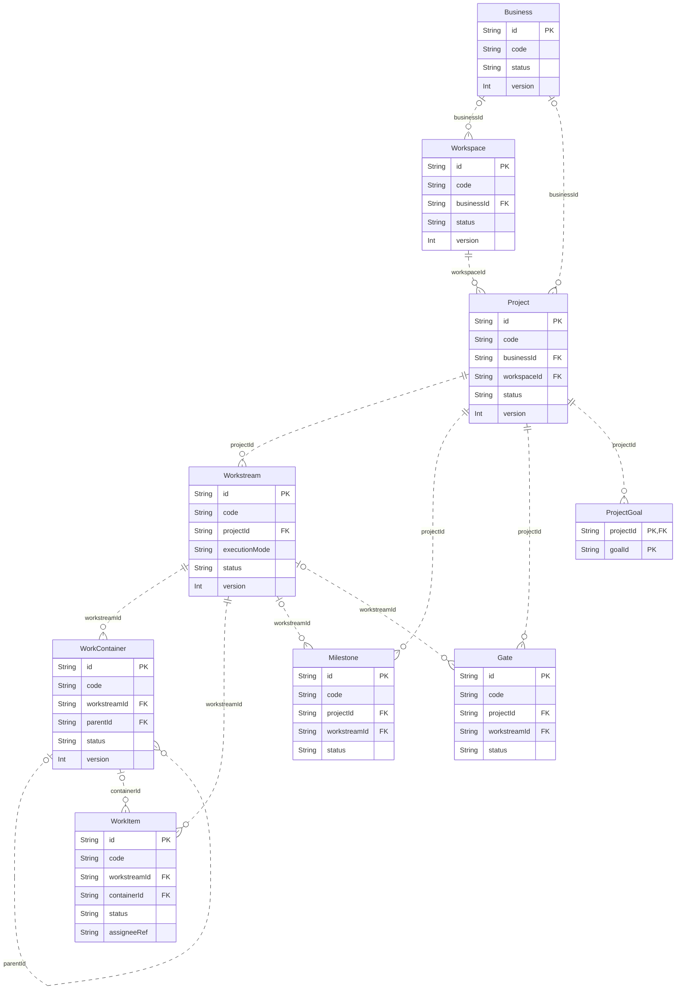
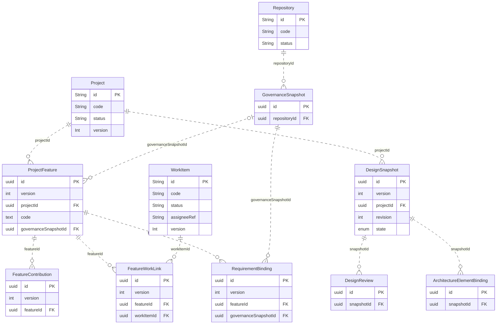
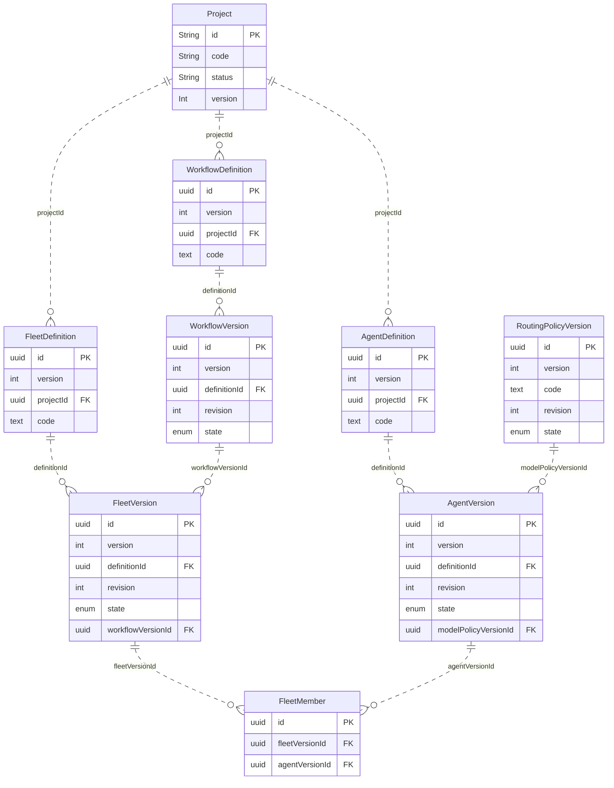
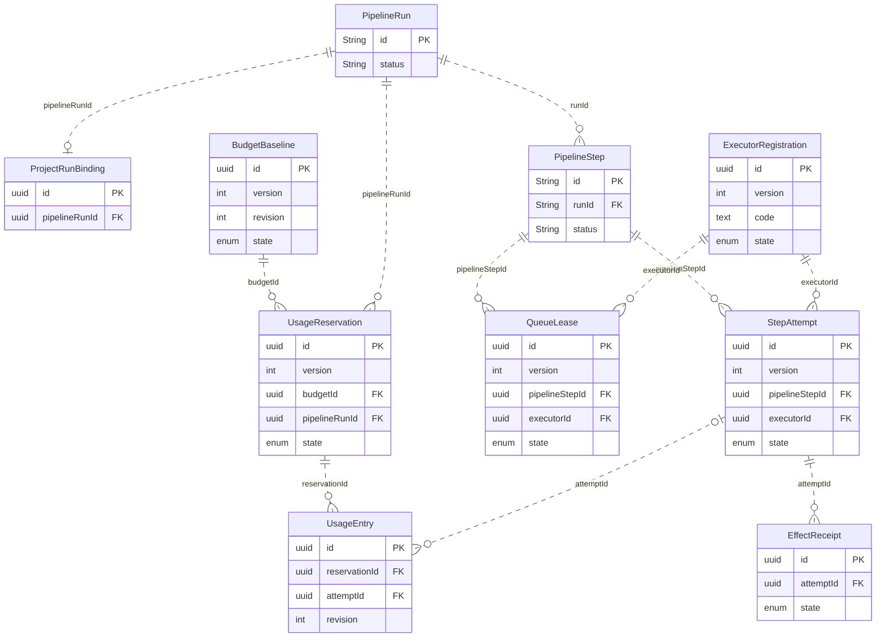
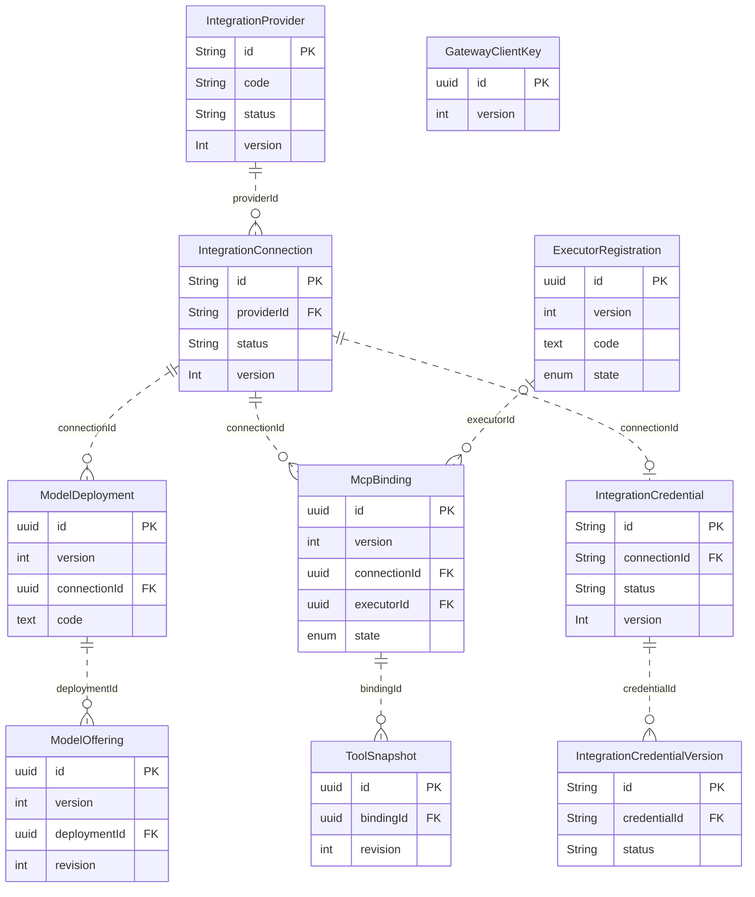
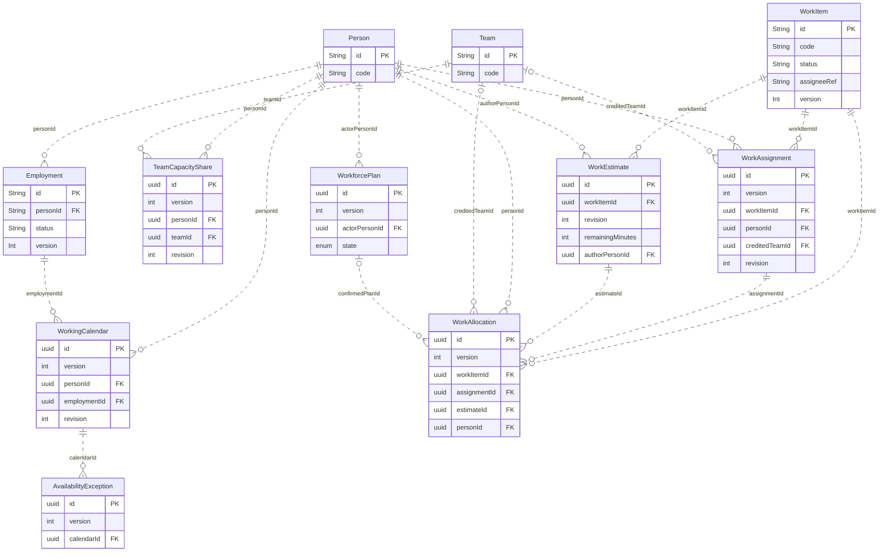
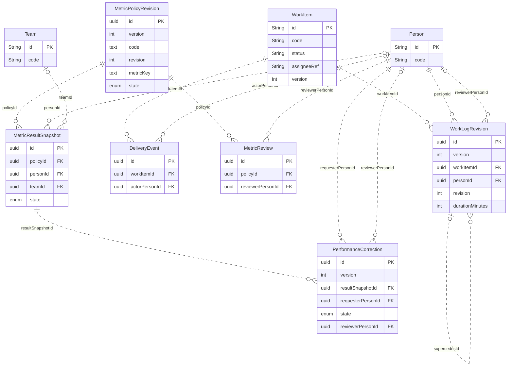
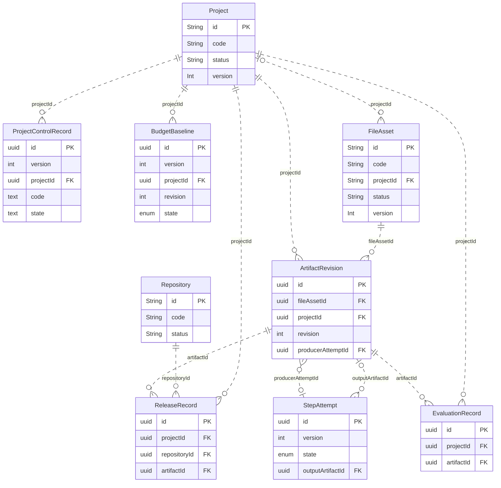
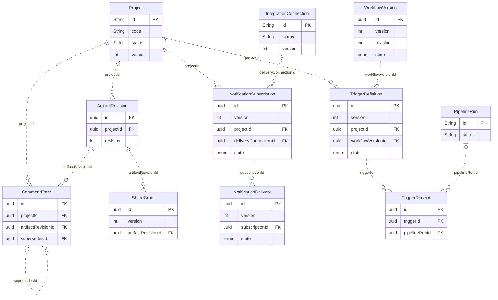

# Database tables & ERD

**Candidate · C-3 · design impact HIGH; documentation-only change.** เอกสารนี้เพิ่มตารางข้อมูลระดับ field และ ERD ให้ชุดเดิม ไม่สร้างตารางจริงหรือ migration.

## 1. Scope, evidence and naming

- Existing fields below are extracted from the isolated design baseline [SQLite schema](../../../apps/server/prisma/schema.prisma); the [Postgres schema](../../../apps/server/prisma/schema.postgres.prisma) is an independently enumerated adapter. Source identity cross-check uses current primary commit 4ca28c1df4a68894e9a5d9ceb4afb20fe996a686.
- REUSE_SOURCE means the named model and shown scalar fields exist in the design baseline; it does not mean the proposed feature runs. PROPOSED means a candidate logical record, not deployed DDL.
- Physical table names, Prisma mappings and per-adapter migration scripts require a reviewed binding. A logical profile may extend an existing owner table after exact compatibility review; it is not permission to duplicate a registry.
- Person is CRM identity; Membership is Identity access; Team and Employment grant nothing. People calendar is a module of the current PM charter. Inventory remains a composition of existing operational facts.
- Full machine-readable catalog: [data-model.candidate.json](contracts/data-model.candidate.json). SRS: [17 SRS](17-SRS.md). Runtime boundaries: [19 Blueprint](19-SYSTEM-BLUEPRINT.md).

## 2. Shared column and relationship rules

| Type/profile | Proposed contract |
|---|---|
| uuid / text / sha256 | Internal UUID; bounded text; 64 lower-case hex digest. Source commit SHA format follows the repository algorithm. |
| int / bigint / decimal | Integer minutes and basis points; nonnegative money in currency minor units stored as BIGINT and serialized safely as string. No floating-point currency. |
| instant | UTC instant; PostgreSQL timestamptz, SQLite normalized UTC via repository adapter. Local IANA timezone stored separately; use half-open intervals. |
| json | Versioned schema validated before persistence; PostgreSQL JSONB / SQLite validated JSON text. A JSON label alone does not close an API shape gap. |
| MUTABLE | id, tenantId, businessId, createdAt, updatedAt, version>=1, nullable deletedAt plus entity fields. Default version=1; timestamps server-generated; no default person, calendar, effort or permission. |
| REVISION | id/scope/timestamps/version plus entity fields; draft is CAS-mutable, approved/submitted revision immutable. A correction appends, retirement affects future use. |
| APPEND | id/scope/createdAt plus entity fields; business facts append only. Exceptional privacy redaction uses audited tombstone, preserving evidence identity. |
| Composite scope | New scoped child links require same tenant/business and project where relevant. New tables expose UNIQUE(tenantId,businessId,id); scoped child FK uses that triple for new peers. |
| Existing parents | Existing models do not uniformly carry tenantId/businessId. Use actual parent scope chain through owner service; a physical composite FK needs an explicit parent-key amendment or an adapter trigger. Do not pretend the FK already exists. |
| External owner refs | Same-store FKs are constraints, not a cross-owner write permit. For remote Identity/Knowledge services, pin a versioned owner reference/receipt instead of a fabricated relational FK. |
| Delete behavior | Restrict deletion of referenced approved/run/evidence rows; tombstone current catalog items. No new cascade that erases historical outcomes. Existing cascades remain compatibility work. |
| Temporal uniqueness | Range overlap and sum limits cannot be expressed by a simple UNIQUE. Serialize the affected person/work/period and check overlap inside the owner transaction. PostgreSQL exclusion/locking and SQLite single-writer transaction behavior require adapter tests. |

No physical table is proposed for navigation Domain groups, Feature-driven views, Inventory, Workload or Schedule summaries. Domain keys reference the governance registry. Read models rebuild from authorized records; MetricResultSnapshot is optional persisted evidence, not a competing source of facts.

## 3. Table inventory

| Record | Owner | State | Profile | Purpose/source |
|---|---|---|---|---|
| Portfolio | project-manager | REUSE_SOURCE | SOURCE | Existing Prisma model; current-source field block matches baseline |
| Tenant | project-manager | REUSE_SOURCE | SOURCE | Existing Prisma model; current-source field block matches baseline |
| Business | project-manager | REUSE_SOURCE | SOURCE | Existing Prisma model; current-source field block matches baseline |
| Workspace | project-manager | REUSE_SOURCE | SOURCE | Existing Prisma model; current-source field block matches baseline |
| Project | project-manager | REUSE_SOURCE | SOURCE | Existing Prisma model; current-source field block matches baseline |
| Workstream | project-manager | REUSE_SOURCE | SOURCE | Existing Prisma model; current-source field block matches baseline |
| WorkContainer | project-manager | REUSE_SOURCE | SOURCE | Existing Prisma model; current-source field block matches baseline |
| WorkItem | project-manager | REUSE_SOURCE | SOURCE | Existing Prisma model; current-source field block matches baseline |
| Milestone | project-manager | REUSE_SOURCE | SOURCE | Existing Prisma model; current-source field block matches baseline |
| Gate | project-manager | REUSE_SOURCE | SOURCE | Existing Prisma model; current-source field block matches baseline |
| Dependency | project-manager | REUSE_SOURCE | SOURCE | Existing Prisma model; current-source field block matches baseline |
| Repository | project-manager | REUSE_SOURCE | SOURCE | Existing Prisma model; current-source field block matches baseline |
| ProjectRepository | project-manager | REUSE_SOURCE | SOURCE | Existing Prisma model; current-source field block matches baseline |
| ProjectGoal | project-manager | REUSE_SOURCE | SOURCE | Existing Prisma model; current-source field block matches baseline |
| Person | crm | REUSE_SOURCE | SOURCE | Existing Prisma model; current-source field block matches baseline |
| Membership | identity | REUSE_SOURCE | SOURCE | Existing Prisma model; current-source field block matches baseline |
| Employment | project-manager | REUSE_SOURCE | SOURCE | Existing Prisma model; current-source field block matches baseline |
| Team | project-manager | REUSE_SOURCE | SOURCE | Existing Prisma model; current-source field block matches baseline |
| TeamMembership | project-manager | REUSE_SOURCE | SOURCE | Existing Prisma model; current-source field block matches baseline |
| ProjectTeam | project-manager | REUSE_SOURCE | SOURCE | Existing Prisma model; current-source field block matches baseline |
| FileAsset | project-manager | REUSE_SOURCE | SOURCE | Existing Prisma model; current-source field block matches baseline |
| ProjectFile | project-manager | REUSE_SOURCE | SOURCE | Existing Prisma model; current-source field block matches baseline |
| AuditEvent | project-manager | REUSE_SOURCE | SOURCE | Existing Prisma model; current-source field block matches baseline |
| IntegrationProvider | integration | REUSE_SOURCE | SOURCE | Existing Prisma model; current-source field block matches baseline |
| IntegrationConnection | integration | REUSE_SOURCE | SOURCE | Existing Prisma model; current-source field block matches baseline |
| IntegrationCredential | integration | REUSE_SOURCE | SOURCE | Existing Prisma model; current-source field block matches baseline |
| IntegrationCredentialVersion | integration | REUSE_SOURCE | SOURCE | Existing Prisma model; current-source field block matches baseline |
| PipelineRun | integration | REUSE_SOURCE | SOURCE | Existing Prisma model; current-source field block matches baseline |
| PipelineStep | integration | REUSE_SOURCE | SOURCE | Existing Prisma model; current-source field block matches baseline |
| PipelineEventReceipt | integration | REUSE_SOURCE | SOURCE | Existing Prisma model; current-source field block matches baseline |
| PipelineGateDecision | integration | REUSE_SOURCE | SOURCE | Existing Prisma model; current-source field block matches baseline |
| GovernanceSnapshot | project-manager | PROPOSED | APPEND | Repository governance evidence pinned to a commit |
| ProjectFeature | project-manager | PROPOSED | MUTABLE | Project-local feature identity independent from Domain |
| FeatureContribution | project-manager | PROPOSED | MUTABLE | One domain contribution to a feature |
| FeatureWorkLink | project-manager | PROPOSED | MUTABLE | Deduplicated feature-to-work association |
| RequirementBinding | project-manager | PROPOSED | MUTABLE | Pinned requirement reference and acceptance link |
| DesignSnapshot | project-manager | PROPOSED | REVISION | Reviewable exact requirement graph contract and policy baseline |
| DesignReview | project-manager | PROPOSED | APPEND | Review receipt for a specific snapshot |
| ArchitectureElementBinding | project-manager | PROPOSED | APPEND | Element provenance and source anchors |
| AgentDefinition | project-manager | PROPOSED | MUTABLE | Agent stable inventory identity |
| AgentVersion | project-manager | PROPOSED | REVISION | Immutable approved agent revision |
| WorkflowDefinition | project-manager | PROPOSED | MUTABLE | Workflow stable inventory identity |
| WorkflowVersion | project-manager | PROPOSED | REVISION | Immutable approved workflow revision |
| FleetDefinition | project-manager | PROPOSED | MUTABLE | Fleet stable inventory identity |
| FleetVersion | project-manager | PROPOSED | REVISION | Immutable approved fleet revision |
| FleetMember | project-manager | PROPOSED | APPEND | A role pinned to an approved agent version |
| ProjectRunBinding | project-manager | PROPOSED | APPEND | Project association to the Integration-owned run |
| StepAttempt | integration | PROPOSED | MUTABLE | Durable attempts without reusing legacy PipelineStep.attemptId semantics |
| QueueLease | integration | PROPOSED | MUTABLE | Exclusive active execution lane and fencing token |
| EffectReceipt | integration | PROPOSED | APPEND | Deduplicated external side-effect intent/outcome evidence |
| ArtifactRevision | project-manager | PROPOSED | APPEND | Immutable metadata over owner-managed file bytes |
| ModelDeployment | integration | PROPOSED | MUTABLE | A scoped model serving endpoint |
| ModelOffering | integration | PROPOSED | REVISION | Pinned capability and pricing basis |
| RoutingPolicyVersion | integration | PROPOSED | REVISION | Approved model selection and fallback order |
| McpBinding | integration | PROPOSED | MUTABLE | Scoped MCP connection transport and consent |
| ToolSnapshot | integration | PROPOSED | APPEND | MCP discovery snapshot frozen by digest |
| ExecutorRegistration | integration | PROPOSED | MUTABLE | Execution-profile host enrollment, separate from report-only harness keys |
| GatewayClientKey | identity | PROPOSED | MUTABLE | Inference audience key profile subject to exact reuse review |
| UsageReservation | integration | PROPOSED | MUTABLE | Atomic upper exposure reservation before provider invocation |
| UsageEntry | integration | PROPOSED | APPEND | Invocation usage fact with measurement provenance |
| WorkEstimate | project-manager | PROPOSED | APPEND | Versioned effort estimate in integer minutes |
| WorkingCalendar | project-manager | PROPOSED | REVISION | People-module effective working calendar |
| AvailabilityException | project-manager | PROPOSED | MUTABLE | Available or unavailable interval with private reason excluded |
| TeamCapacityShare | project-manager | PROPOSED | REVISION | Effective share of one person available capacity credited to a team |
| WorkAssignment | project-manager | PROPOSED | REVISION | Effective assignment history and human identity resolution |
| WorkAllocation | project-manager | PROPOSED | MUTABLE | Single proposed human allocation writer for PMR-033 |
| WorkforcePlan | project-manager | PROPOSED | MUTABLE | Durable preview and exact-commit receipt |
| WorkLogRevision | project-manager | PROPOSED | REVISION | Actual effort with reviewable corrections |
| DeliveryEvent | project-manager | PROPOSED | APPEND | Accepted owner transition evidence, never inferred from updatedAt |
| MetricPolicyRevision | project-manager | PROPOSED | REVISION | Bounded metric formula and cohort policy |
| MetricReview | project-manager | PROPOSED | APPEND | Business-scoped metric policy review receipt |
| MetricResultSnapshot | project-manager | PROPOSED | APPEND | Rebuildable result with pinned cohort source and permission context |
| PerformanceCorrection | project-manager | PROPOSED | MUTABLE | Evidence correction request and owner disposition |
| ProjectControlRecord | project-manager | PROPOSED | MUTABLE | Proposed typed risk issue decision change register, pending exact owner binding |
| BudgetBaseline | project-manager | PROPOSED | REVISION | Planned resource/cost budget, distinct from payroll and spend facts |
| ReleaseRecord | project-manager | PROPOSED | APPEND | Environment-specific source build migration deploy activation evidence |
| EvaluationRecord | project-manager | PROPOSED | APPEND | Versioned test evidence for agent fleet workflow or model |
| CommentEntry | project-manager | PROPOSED | APPEND | Comments pinned to a work item or artifact revision |
| NotificationSubscription | integration | PROPOSED | MUTABLE | Scoped recipient binding and event filter |
| NotificationDelivery | integration | PROPOSED | MUTABLE | Deduplicated delivery receipt and retries |
| ShareGrant | identity | PROPOSED | MUTABLE | Artifact-revision-specific expiring share profile subject to owner reuse |
| TriggerDefinition | integration | PROPOSED | MUTABLE | Manual scheduled or event admission policy |
| TriggerReceipt | integration | PROPOSED | APPEND | One admission decision per normalized occurrence |
| OwnerOutbox | integration | PROPOSED | MUTABLE | Logical owner-local outbox profile, never one cross-service write table |
| OwnerInbox | integration | PROPOSED | APPEND | Logical owner-local consumer receipt profile |

## 4. Field dictionary

For existing models, the exact scalar definition is shown without adding invented nullability, version fields or tenant columns. Relation arrays are excluded; ERDs and the original schema give their navigation. For proposed records, all expanded common fields are shown. Every proposed field is required unless Nullable=Yes; defaults only where explicitly specified.

### Portfolio

**REUSE_SOURCE · project-manager · SOURCE** — Source model

| Column | Type | Nullable | Key/reference | Rule or source definition |
|---|---|---|---|---|
| id | String | No | PK | id        String   @id @default(uuid()) |
| code | String | No |  | code      String   @unique |
| name | String | No |  | name      String |
| createdAt | DateTime | No |  | createdAt DateTime @default(now()) |
| updatedAt | DateTime | No |  | updatedAt DateTime @updatedAt |
| version | Int | No |  | version   Int      @default(1) |

Existing model constraints: See source field-level keys/relations. Postgres model present: true. Current-source block match: true.

### Tenant

**REUSE_SOURCE · project-manager · SOURCE** — Source model

| Column | Type | Nullable | Key/reference | Rule or source definition |
|---|---|---|---|---|
| id | String | No | PK | id          String   @id @default(uuid()) |
| code | String | No |  | code        String   @unique |
| portfolioId | String | No | FK → Portfolio | portfolioId String |
| name | String | No |  | name        String |
| status | String | No |  | status      String   @default("ACTIVE") |
| createdAt | DateTime | No |  | createdAt   DateTime @default(now()) |
| updatedAt | DateTime | No |  | updatedAt   DateTime @updatedAt |
| version | Int | No |  | version     Int      @default(1) |

Existing model constraints: @@index([portfolioId]). Postgres model present: true. Current-source block match: true.

### Business

**REUSE_SOURCE · project-manager · SOURCE** — Source model

| Column | Type | Nullable | Key/reference | Rule or source definition |
|---|---|---|---|---|
| id | String | No | PK | id               String   @id @default(uuid()) |
| code | String | No |  | code             String   @unique |
| tenantId | String | No | FK → Tenant | tenantId         String |
| legalEntityId | String | Yes | FK → LegalEntity (outside catalog) | legalEntityId    String? |
| name | String | No |  | name             String |
| status | String | No |  | status           String   @default("ACTIVE") |
| capabilitiesJson | String | No |  | capabilitiesJson String   @default("{}") |
| knowledgeCandidatesEnabled | Boolean | No |  | knowledgeCandidatesEnabled Boolean @default(false) |
| createdAt | DateTime | No |  | createdAt        DateTime @default(now()) |
| updatedAt | DateTime | No |  | updatedAt        DateTime @updatedAt |
| version | Int | No |  | version          Int      @default(1) |

Existing model constraints: @@index([tenantId]). Postgres model present: true. Current-source block match: true.

### Workspace

**REUSE_SOURCE · project-manager · SOURCE** — Source model

| Column | Type | Nullable | Key/reference | Rule or source definition |
|---|---|---|---|---|
| id | String | No | PK | id          String   @id @default(uuid()) |
| code | String | No |  | code        String   @unique |
| name | String | No |  | name        String |
| scopeType | String | No |  | scopeType   String |
| portfolioId | String | Yes | FK → Portfolio | portfolioId String? |
| tenantId | String | Yes | FK → Tenant | tenantId    String? |
| businessId | String | Yes | FK → Business | businessId  String? |
| status | String | No |  | status      String   @default("ACTIVE") |
| createdAt | DateTime | No |  | createdAt   DateTime @default(now()) |
| updatedAt | DateTime | No |  | updatedAt   DateTime @updatedAt |
| version | Int | No |  | version     Int      @default(1) |

Existing model constraints: @@index([portfolioId]); @@index([tenantId]); @@index([businessId]). Postgres model present: true. Current-source block match: true.

### Project

**REUSE_SOURCE · project-manager · SOURCE** — Source model

| Column | Type | Nullable | Key/reference | Rule or source definition |
|---|---|---|---|---|
| id | String | No | PK | id          String    @id @default(uuid()) |
| code | String | No |  | code        String    @unique |
| businessId | String | Yes | FK → Business | businessId  String? |
| workspaceId | String | No | FK → Workspace | workspaceId String |
| name | String | No |  | name        String |
| description | String | Yes |  | description String? |
| type | String | No |  | type        String    @default("GENERAL") |
| status | String | No |  | status      String    @default("PLANNED") |
| priority | String | Yes |  | priority    String? |
| picPersonId | String | Yes | FK → Person | picPersonId String? |
| startAt | DateTime | Yes |  | startAt     DateTime? |
| targetAt | DateTime | Yes |  | targetAt    DateTime? |
| deletedAt | DateTime | Yes |  | deletedAt   DateTime? |
| createdAt | DateTime | No |  | createdAt   DateTime  @default(now()) |
| updatedAt | DateTime | No |  | updatedAt   DateTime  @updatedAt |
| version | Int | No |  | version     Int       @default(1) |

Existing model constraints: @@index([businessId]); @@index([workspaceId]); @@index([status]); @@index([priority]); @@index([picPersonId]). Postgres model present: true. Current-source block match: true.

### Workstream

**REUSE_SOURCE · project-manager · SOURCE** — Source model

| Column | Type | Nullable | Key/reference | Rule or source definition |
|---|---|---|---|---|
| id | String | No | PK | id                      String    @id @default(uuid()) |
| code | String | No |  | code                    String    @unique |
| projectId | String | No | FK → Project | projectId               String |
| name | String | No |  | name                    String |
| executionMode | String | No |  | executionMode           String |
| executionModeId | String | Yes |  | executionModeId         String? |
| laneId | String | Yes |  | laneId                  String? |
| executionContractId | String | Yes |  | executionContractId     String? |
| contractVersion | String | Yes |  | contractVersion         String? |
| primaryDomainId | String | Yes |  | primaryDomainId         String? |
| supportingDomainIdsJson | String | No |  | supportingDomainIdsJson String    @default("[]") |
| technicalOwnerDomainId | String | Yes |  | technicalOwnerDomainId  String? |
| identityRefsJson | String | No |  | identityRefsJson        String    @default("{}") |
| progressStrategy | String | No |  | progressStrategy        String |
| progressWeight | Float | No |  | progressWeight          Float     @default(1) |
| status | String | No |  | status                  String    @default("PLANNED") |
| progressCache | Float | No |  | progressCache           Float     @default(0) |
| viewConfigJson | String | No |  | viewConfigJson          String    @default("{}") |
| deletedAt | DateTime | Yes |  | deletedAt               DateTime? |
| createdAt | DateTime | No |  | createdAt               DateTime  @default(now()) |
| updatedAt | DateTime | No |  | updatedAt               DateTime  @updatedAt |
| version | Int | No |  | version                 Int       @default(1) |

Existing model constraints: @@index([projectId]); @@index([executionMode]); @@index([executionModeId]); @@index([laneId]). Postgres model present: true. Current-source block match: true.

### WorkContainer

**REUSE_SOURCE · project-manager · SOURCE** — Source model

| Column | Type | Nullable | Key/reference | Rule or source definition |
|---|---|---|---|---|
| id | String | No | PK | id           String    @id @default(uuid()) |
| code | String | No |  | code         String    @unique |
| workstreamId | String | No | FK → Workstream | workstreamId String |
| parentId | String | Yes | FK → WorkContainer | parentId     String? |
| subtype | String | No |  | subtype      String |
| title | String | No |  | title        String |
| status | String | No |  | status       String    @default("PLANNED") |
| startAt | DateTime | Yes |  | startAt      DateTime? |
| targetAt | DateTime | Yes |  | targetAt     DateTime? |
| metadataJson | String | No |  | metadataJson String    @default("{}") |
| createdAt | DateTime | No |  | createdAt    DateTime  @default(now()) |
| updatedAt | DateTime | No |  | updatedAt    DateTime  @updatedAt |
| version | Int | No |  | version      Int       @default(1) |

Existing model constraints: @@index([workstreamId]); @@index([parentId]); @@index([subtype]). Postgres model present: true. Current-source block match: true.

### WorkItem

**REUSE_SOURCE · project-manager · SOURCE** — Source model

| Column | Type | Nullable | Key/reference | Rule or source definition |
|---|---|---|---|---|
| id | String | No | PK | id             String    @id @default(uuid()) |
| code | String | No |  | code           String    @unique |
| workstreamId | String | No | FK → Workstream | workstreamId   String |
| containerId | String | Yes | FK → WorkContainer | containerId    String? |
| subtype | String | No |  | subtype        String |
| title | String | No |  | title          String |
| status | String | No |  | status         String    @default("PLANNED") |
| assigneeRef | String | Yes |  | assigneeRef    String? |
| weight | Float | No |  | weight         Float     @default(1) |
| numericValue | Float | Yes |  | numericValue   Float? |
| probability | Float | Yes |  | probability    Float? |
| metricDataJson | String | No |  | metricDataJson String    @default("{}") |
| metadataJson | String | No |  | metadataJson   String    @default("{}") |
| startAt | DateTime | Yes |  | startAt        DateTime? |
| targetAt | DateTime | Yes |  | targetAt       DateTime? |
| deletedAt | DateTime | Yes |  | deletedAt      DateTime? |
| createdAt | DateTime | No |  | createdAt      DateTime  @default(now()) |
| updatedAt | DateTime | No |  | updatedAt      DateTime  @updatedAt |
| version | Int | No |  | version        Int       @default(1) |

Existing model constraints: @@index([workstreamId]); @@index([containerId]); @@index([subtype]); @@index([status]). Postgres model present: true. Current-source block match: true.

### Milestone

**REUSE_SOURCE · project-manager · SOURCE** — Source model

| Column | Type | Nullable | Key/reference | Rule or source definition |
|---|---|---|---|---|
| id | String | No | PK | id           String    @id @default(uuid()) |
| code | String | No |  | code         String    @unique |
| projectId | String | No | FK → Project | projectId    String |
| workstreamId | String | Yes | FK → Workstream | workstreamId String? |
| title | String | No |  | title        String |
| status | String | No |  | status       String    @default("PLANNED") |
| weight | Float | No |  | weight       Float     @default(1) |
| targetAt | DateTime | Yes |  | targetAt     DateTime? |
| completedAt | DateTime | Yes |  | completedAt  DateTime? |
| createdAt | DateTime | No |  | createdAt    DateTime  @default(now()) |
| updatedAt | DateTime | No |  | updatedAt    DateTime  @updatedAt |

Existing model constraints: @@index([projectId]); @@index([workstreamId]). Postgres model present: true. Current-source block match: true.

### Gate

**REUSE_SOURCE · project-manager · SOURCE** — Source model

| Column | Type | Nullable | Key/reference | Rule or source definition |
|---|---|---|---|---|
| id | String | No | PK | id           String    @id @default(uuid()) |
| code | String | No |  | code         String    @unique |
| projectId | String | No | FK → Project | projectId    String |
| workstreamId | String | Yes | FK → Workstream | workstreamId String? |
| title | String | No |  | title        String |
| status | String | No |  | status       String    @default("OPEN") |
| required | Boolean | No |  | required     Boolean   @default(true) |
| evidenceJson | String | No |  | evidenceJson String    @default("{}") |
| targetAt | DateTime | Yes |  | targetAt     DateTime? |
| createdAt | DateTime | No |  | createdAt    DateTime  @default(now()) |
| updatedAt | DateTime | No |  | updatedAt    DateTime  @updatedAt |

Existing model constraints: @@index([projectId]); @@index([workstreamId]). Postgres model present: true. Current-source block match: true.

### Dependency

**REUSE_SOURCE · project-manager · SOURCE** — Source model

| Column | Type | Nullable | Key/reference | Rule or source definition |
|---|---|---|---|---|
| id | String | No | PK | id             String   @id @default(uuid()) |
| sourceType | String | No |  | sourceType     String |
| sourceId | String | No |  | sourceId       String |
| targetType | String | No |  | targetType     String |
| targetId | String | No |  | targetId       String |
| dependencyType | String | No |  | dependencyType String |
| createdAt | DateTime | No |  | createdAt      DateTime @default(now()) |

Existing model constraints: @@unique([sourceType, sourceId, targetType, targetId, dependencyType]); @@index([sourceType, sourceId]); @@index([targetType, targetId]). Postgres model present: true. Current-source block match: true.

### Repository

**REUSE_SOURCE · project-manager · SOURCE** — Source model

| Column | Type | Nullable | Key/reference | Rule or source definition |
|---|---|---|---|---|
| id | String | No | PK | id             String   @id @default(uuid()) |
| code | String | No |  | code           String   @unique |
| businessId | String | Yes | FK → Business | businessId     String? |
| provider | String | No |  | provider       String |
| externalRepoId | String | Yes |  | externalRepoId String? |
| ownerName | String | Yes |  | ownerName      String? |
| repoName | String | Yes |  | repoName       String? |
| fullName | String | Yes |  | fullName       String? |
| url | String | Yes |  | url            String? |
| defaultBranch | String | Yes |  | defaultBranch  String? |
| status | String | No |  | status         String   @default("ACTIVE") |
| createdAt | DateTime | No |  | createdAt      DateTime @default(now()) |
| updatedAt | DateTime | No |  | updatedAt      DateTime @updatedAt |

Existing model constraints: @@index([provider, fullName]); @@index([businessId]). Postgres model present: true. Current-source block match: true.

### ProjectRepository

**REUSE_SOURCE · project-manager · SOURCE** — Source model

| Column | Type | Nullable | Key/reference | Rule or source definition |
|---|---|---|---|---|
| id | String | No | PK | id        String   @id @default(uuid()) |
| projectId | String | No | FK → Project | projectId String |
| repoId | String | No | FK → Repository | repoId    String |
| role | String | No |  | role      String |
| pathScope | String | Yes |  | pathScope String? |
| branch | String | Yes |  | branch    String? |
| createdAt | DateTime | No |  | createdAt DateTime @default(now()) |

Existing model constraints: @@unique([projectId, repoId, role]); @@index([repoId]). Postgres model present: true. Current-source block match: true.

### ProjectGoal

**REUSE_SOURCE · project-manager · SOURCE** — Source model

| Column | Type | Nullable | Key/reference | Rule or source definition |
|---|---|---|---|---|
| projectId | String | No | PK; FK → Project | projectId String |
| goalId | String | No | PK; FK → BusinessGoal (outside catalog) | goalId    String |
| createdAt | DateTime | No |  | createdAt DateTime @default(now()) |

Existing model constraints: @@id([projectId, goalId]); @@index([goalId]). Postgres model present: true. Current-source block match: true.

### Person

**REUSE_SOURCE · crm · SOURCE** — Source model

| Column | Type | Nullable | Key/reference | Rule or source definition |
|---|---|---|---|---|
| id | String | No | PK | id                   String    @id @default(uuid()) |
| code | String | No |  | code                 String    @unique |
| displayName | String | No |  | displayName          String |
| email | String | Yes |  | email                String? |
| firstName | String | Yes |  | firstName            String? |
| lastName | String | Yes |  | lastName             String? |
| phone | String | Yes |  | phone                String? |
| profileCompletedAt | DateTime | Yes |  | profileCompletedAt   DateTime? |
| accessDisabledAt | DateTime | Yes |  | accessDisabledAt     DateTime? |
| accessDisabledReason | String | Yes |  | accessDisabledReason String? |
| createdAt | DateTime | No |  | createdAt            DateTime  @default(now()) |
| updatedAt | DateTime | No |  | updatedAt            DateTime  @updatedAt |

Existing model constraints: See source field-level keys/relations. Postgres model present: true. Current-source block match: true.

### Membership

**REUSE_SOURCE · identity · SOURCE** — Source model

| Column | Type | Nullable | Key/reference | Rule or source definition |
|---|---|---|---|---|
| id | String | No | PK | id             String  @id @default(uuid()) |
| personId | String | No | FK → Person | personId       String |
| tenantId | String | No | FK → Tenant | tenantId       String |
| scopeType | String | No |  | scopeType      String  @default("BUSINESS") |
| businessId | String | Yes | FK → Business | businessId     String? |
| role | String | No |  | role           String  @default("MEMBER") |
| status | String | No |  | status         String  @default("ACTIVE") |
| domainKeysJson | String | No |  | domainKeysJson String  @default("[]") |
| grantedByPersonId | String | Yes | FK → Person | grantedByPersonId String? |
| grantReason | String | Yes |  | grantReason       String? |
| grantSource | String | No |  | grantSource       String    @default("ADMIN") |
| expiresAt | DateTime | Yes |  | expiresAt         DateTime? |
| suspendedAt | DateTime | Yes |  | suspendedAt       DateTime? |
| revokedAt | DateTime | Yes |  | revokedAt         DateTime? |
| revokedByPersonId | String | Yes | FK → Person | revokedByPersonId String? |
| revokeReason | String | Yes |  | revokeReason      String? |
| createdAt | DateTime | No |  | createdAt DateTime @default(now()) |
| updatedAt | DateTime | No |  | updatedAt DateTime @updatedAt |
| version | Int | No |  | version   Int      @default(1) |

Existing model constraints: @@index([personId]); @@index([personId, status]); @@index([tenantId]); @@index([tenantId, status]); @@index([businessId, status]); @@index([expiresAt, status]). Postgres model present: true. Current-source block match: true.

### Employment

**REUSE_SOURCE · project-manager · SOURCE** — Source model

| Column | Type | Nullable | Key/reference | Rule or source definition |
|---|---|---|---|---|
| id | String | No | PK | id         String  @id @default(uuid()) |
| personId | String | No | FK → Person | personId   String |
| tenantId | String | No | FK → Tenant | tenantId   String |
| businessId | String | No | FK → Business | businessId String |
| branchId | String | Yes | FK → Branch (outside catalog) | branchId   String? |
| employeeNo | String | Yes |  | employeeNo String? |
| title | String | Yes |  | title      String? |
| employmentType | String | No |  | employmentType String @default("EMPLOYEE") |
| status | String | No |  | status     String    @default("ACTIVE") |
| startAt | DateTime | Yes |  | startAt    DateTime? |
| endAt | DateTime | Yes |  | endAt      DateTime? |
| createdAt | DateTime | No |  | createdAt  DateTime  @default(now()) |
| updatedAt | DateTime | No |  | updatedAt  DateTime  @updatedAt |
| version | Int | No |  | version    Int       @default(1) |

Existing model constraints: @@index([personId]); @@index([tenantId]); @@index([businessId, status]); @@index([branchId]). Postgres model present: true. Current-source block match: true.

### Team

**REUSE_SOURCE · project-manager · SOURCE** — Source model

| Column | Type | Nullable | Key/reference | Rule or source definition |
|---|---|---|---|---|
| id | String | No | PK | id          String    @id @default(uuid()) |
| code | String | No |  | code        String    @unique |
| businessId | String | No | FK → Business | businessId  String |
| name | String | No |  | name        String |
| description | String | Yes |  | description String? |
| deletedAt | DateTime | Yes |  | deletedAt   DateTime? |
| createdAt | DateTime | No |  | createdAt   DateTime  @default(now()) |
| updatedAt | DateTime | No |  | updatedAt   DateTime  @updatedAt |

Existing model constraints: @@index([businessId]). Postgres model present: true. Current-source block match: true.

### TeamMembership

**REUSE_SOURCE · project-manager · SOURCE** — Source model

| Column | Type | Nullable | Key/reference | Rule or source definition |
|---|---|---|---|---|
| id | String | No | PK | id        String   @id @default(uuid()) |
| teamId | String | No | FK → Team | teamId    String |
| personId | String | No | FK → Person | personId  String |
| createdAt | DateTime | No |  | createdAt DateTime @default(now()) |

Existing model constraints: @@unique([teamId, personId]); @@index([teamId]); @@index([personId]). Postgres model present: true. Current-source block match: true.

### ProjectTeam

**REUSE_SOURCE · project-manager · SOURCE** — Source model

| Column | Type | Nullable | Key/reference | Rule or source definition |
|---|---|---|---|---|
| id | String | No | PK | id        String   @id @default(uuid()) |
| projectId | String | No | FK → Project | projectId String |
| teamId | String | No | FK → Team | teamId    String |
| createdAt | DateTime | No |  | createdAt DateTime @default(now()) |

Existing model constraints: @@unique([projectId, teamId]); @@index([projectId]); @@index([teamId]). Postgres model present: true. Current-source block match: true.

### FileAsset

**REUSE_SOURCE · project-manager · SOURCE** — Source model

| Column | Type | Nullable | Key/reference | Rule or source definition |
|---|---|---|---|---|
| id | String | No | PK | id           String    @id @default(uuid()) |
| code | String | No |  | code         String    @unique |
| tenantId | String | No | FK → Tenant | tenantId     String |
| businessId | String | No | FK → Business | businessId   String |
| projectId | String | Yes | FK → Project | projectId    String? |
| workItemId | String | Yes | FK → WorkItem | workItemId   String? |
| storageKind | String | No |  | storageKind  String |
| relativePath | String | Yes |  | relativePath String? |
| externalUrl | String | Yes |  | externalUrl  String? |
| blobRef | String | Yes |  | blobRef      String? |
| name | String | No |  | name         String |
| mime | String | No |  | mime         String |
| size | Int | No |  | size         Int |
| sha256 | String | Yes |  | sha256       String? |
| status | String | No |  | status       String    @default("ACTIVE") |
| version | Int | No |  | version      Int       @default(1) |
| uploadedBy | String | Yes |  | uploadedBy   String? |
| createdAt | DateTime | No |  | createdAt    DateTime  @default(now()) |
| updatedAt | DateTime | No |  | updatedAt    DateTime  @updatedAt |
| deletedAt | DateTime | Yes |  | deletedAt    DateTime? |

Existing model constraints: @@index([tenantId]); @@index([businessId]); @@index([projectId]); @@index([workItemId]). Postgres model present: true. Current-source block match: true.

### ProjectFile

**REUSE_SOURCE · project-manager · SOURCE** — Source model

| Column | Type | Nullable | Key/reference | Rule or source definition |
|---|---|---|---|---|
| id | String | No | PK | id         String   @id @default(uuid()) |
| code | String | No |  | code       String   @unique |
| projectId | String | No | FK → Project | projectId  String |
| workItemId | String | Yes | FK → WorkItem | workItemId String? |
| name | String | No |  | name       String |
| mime | String | No |  | mime       String |
| size | Int | No |  | size       Int |
| url | String | Yes |  | url        String? |
| blobRef | String | Yes |  | blobRef    String? |
| version | Int | No |  | version    Int      @default(1) |
| uploadedBy | String | Yes |  | uploadedBy String? |
| createdAt | DateTime | No |  | createdAt  DateTime @default(now()) |
| updatedAt | DateTime | No |  | updatedAt  DateTime @updatedAt |

Existing model constraints: @@index([projectId]); @@index([workItemId]). Postgres model present: true. Current-source block match: true.

### AuditEvent

**REUSE_SOURCE · project-manager · SOURCE** — Source model

| Column | Type | Nullable | Key/reference | Rule or source definition |
|---|---|---|---|---|
| id | String | No | PK | id          String   @id @default(uuid()) |
| entityType | String | No |  | entityType  String |
| entityId | String | No |  | entityId    String |
| action | String | No |  | action      String |
| payloadJson | String | No |  | payloadJson String   @default("{}") |
| actorType | String | No |  | actorType   String   @default("LOCAL_USER") |
| actorId | String | Yes |  | actorId     String? |
| occurredAt | DateTime | No |  | occurredAt  DateTime @default(now()) |
| tenantId | String | Yes |  | tenantId   String? |
| businessId | String | Yes |  | businessId String? |
| reason | String | Yes |  | reason     String? |
| beforeJson | String | Yes |  | beforeJson String? |
| afterJson | String | Yes |  | afterJson  String? |
| requestId | String | Yes |  | requestId  String? |
| sessionId | String | Yes |  | sessionId  String? |

Existing model constraints: @@index([entityType, entityId]); @@index([occurredAt]); @@index([tenantId, occurredAt]); @@index([businessId, occurredAt]); @@index([actorId, occurredAt]). Postgres model present: true. Current-source block match: true.

### IntegrationProvider

**REUSE_SOURCE · integration · SOURCE** — Source model

| Column | Type | Nullable | Key/reference | Rule or source definition |
|---|---|---|---|---|
| id | String | No | PK | id               String   @id @default(uuid()) |
| code | String | No |  | code             String   @unique |
| name | String | No |  | name             String |
| status | String | No |  | status           String   @default("ACTIVE") |
| capabilitiesJson | String | No |  | capabilitiesJson String   @default("{}") |
| createdAt | DateTime | No |  | createdAt        DateTime @default(now()) |
| updatedAt | DateTime | No |  | updatedAt        DateTime @updatedAt |
| version | Int | No |  | version          Int      @default(1) |

Existing model constraints: See source field-level keys/relations. Postgres model present: true. Current-source block match: true.

### IntegrationConnection

**REUSE_SOURCE · integration · SOURCE** — Source model

| Column | Type | Nullable | Key/reference | Rule or source definition |
|---|---|---|---|---|
| id | String | No | PK | id                String    @id @default(uuid()) |
| tenantId | String | No | FK → Tenant | tenantId          String |
| businessId | String | Yes | FK → Business | businessId        String? |
| providerId | String | No | FK → IntegrationProvider | providerId        String |
| name | String | No |  | name              String |
| authorizationType | String | No |  | authorizationType String    @default("SECRET_MANAGER") |
| externalAccountId | String | Yes |  | externalAccountId String? |
| purpose | String | No |  | purpose           String    @default("GENERAL") |
| role | String | No |  | role              String    @default("SECONDARY") |
| status | String | No |  | status            String    @default("DRAFT") |
| metadataJson | String | No |  | metadataJson      String    @default("{}") |
| lastSyncAt | DateTime | Yes |  | lastSyncAt        DateTime? |
| lastSuccessAt | DateTime | Yes |  | lastSuccessAt     DateTime? |
| createdAt | DateTime | No |  | createdAt         DateTime  @default(now()) |
| updatedAt | DateTime | No |  | updatedAt         DateTime  @updatedAt |
| version | Int | No |  | version           Int       @default(1) |

Existing model constraints: @@unique([tenantId, providerId, externalAccountId]); @@index([tenantId, businessId, purpose, status, role]). Postgres model present: true. Current-source block match: true.

### IntegrationCredential

**REUSE_SOURCE · integration · SOURCE** — Source model

| Column | Type | Nullable | Key/reference | Rule or source definition |
|---|---|---|---|---|
| id | String | No | PK | id                    String    @id @default(uuid()) |
| connectionId | String | No | FK → IntegrationConnection | connectionId          String    @unique |
| secretRef | String | No |  | secretRef             String |
| secretStore | String | No |  | secretStore           String    @default("DEPLOYMENT_MOUNT") |
| secretKind | String | No |  | secretKind            String    @default("LINE_CHANNEL") |
| status | String | No |  | status                String    @default("ACTIVE") |
| displayHint | String | Yes |  | displayHint           String? |
| expiresAt | DateTime | Yes |  | expiresAt             DateTime? |
| accessTokenExpiresAt | DateTime | Yes |  | accessTokenExpiresAt  DateTime? |
| refreshTokenExpiresAt | DateTime | Yes |  | refreshTokenExpiresAt DateTime? |
| lastValidatedAt | DateTime | Yes |  | lastValidatedAt       DateTime? |
| lastValidationCode | String | Yes |  | lastValidationCode    String? |
| rotatedAt | DateTime | Yes |  | rotatedAt             DateTime? |
| revokedAt | DateTime | Yes |  | revokedAt             DateTime? |
| revokeReason | String | Yes |  | revokeReason          String? |
| createdAt | DateTime | No |  | createdAt             DateTime  @default(now()) |
| updatedAt | DateTime | No |  | updatedAt             DateTime  @updatedAt |
| version | Int | No |  | version               Int       @default(1) |

Existing model constraints: See source field-level keys/relations. Postgres model present: true. Current-source block match: true.

### IntegrationCredentialVersion

**REUSE_SOURCE · integration · SOURCE** — Source model

| Column | Type | Nullable | Key/reference | Rule or source definition |
|---|---|---|---|---|
| id | String | No | PK | id            String    @id @default(uuid()) |
| credentialId | String | No | FK → IntegrationCredential | credentialId  String |
| tenantId | String | No |  | tenantId      String |
| businessId | String | Yes |  | businessId    String? |
| versionNumber | Int | No |  | versionNumber Int |
| secretRef | String | No |  | secretRef     String |
| secretStore | String | No |  | secretStore   String |
| status | String | No |  | status        String |
| displayHint | String | Yes |  | displayHint   String? |
| createdById | String | Yes |  | createdById   String? |
| createdVia | String | No |  | createdVia    String |
| createdAt | DateTime | No |  | createdAt     DateTime  @default(now()) |
| activatedAt | DateTime | Yes |  | activatedAt   DateTime? |
| supersededAt | DateTime | Yes |  | supersededAt  DateTime? |
| revokedAt | DateTime | Yes |  | revokedAt     DateTime? |
| purgedAt | DateTime | Yes |  | purgedAt      DateTime? |
| reason | String | Yes |  | reason        String? |

Existing model constraints: @@unique([credentialId, versionNumber]); @@index([tenantId, businessId, status]); @@index([secretRef]). Postgres model present: true. Current-source block match: true.

### PipelineRun

**REUSE_SOURCE · integration · SOURCE** — Source model

| Column | Type | Nullable | Key/reference | Rule or source definition |
|---|---|---|---|---|
| id | String | No | PK | id                       String    @id @default(uuid()) |
| executionRunId | String | No |  | executionRunId           String    @unique |
| dataPipelineDefinitionId | String | No |  | dataPipelineDefinitionId String |
| executionContractId | String | No |  | executionContractId      String |
| tenantId | String | No | FK → Tenant | tenantId                 String |
| businessId | String | Yes | FK → Business | businessId               String? |
| status | String | No |  | status                   String    @default("QUEUED") |
| currentStageId | String | Yes |  | currentStageId           String? |
| sourceRef | String | Yes |  | sourceRef                String? |
| sourceSha256 | String | Yes |  | sourceSha256             String? |
| artifactRef | String | Yes |  | artifactRef              String? |
| artifactSha256 | String | Yes |  | artifactSha256           String? |
| bootstrapBatchId | String | Yes |  | bootstrapBatchId         String? |
| correlationId | String | No |  | correlationId            String |
| idempotencyKey | String | No |  | idempotencyKey           String    @unique |
| requestHash | String | No |  | requestHash              String |
| expectedCount | Int | No |  | expectedCount            Int       @default(0) |
| actualCount | Int | No |  | actualCount              Int       @default(0) |
| insertedCount | Int | No |  | insertedCount            Int       @default(0) |
| updatedCount | Int | No |  | updatedCount             Int       @default(0) |
| unchangedCount | Int | No |  | unchangedCount           Int       @default(0) |
| failedCount | Int | No |  | failedCount              Int       @default(0) |
| rejectedCount | Int | No |  | rejectedCount            Int       @default(0) |
| duplicateCount | Int | No |  | duplicateCount           Int       @default(0) |
| tagIdsJson | String | No |  | tagIdsJson               String    @default("[]") |
| identityRefsJson | String | No |  | identityRefsJson         String    @default("{}") |
| primaryFailureCode | String | Yes |  | primaryFailureCode       String? |
| primaryErrorRef | String | Yes |  | primaryErrorRef          String? |
| primaryRetryable | Boolean | Yes |  | primaryRetryable         Boolean? |
| auditEventId | String | Yes |  | auditEventId             String? |
| replayScope | String | Yes |  | replayScope              String? |
| replayOfExecutionRunId | String | Yes |  | replayOfExecutionRunId   String? |
| replayOfExecutionStepId | String | Yes |  | replayOfExecutionStepId  String? |
| replayOfPipelineRecordId | String | Yes |  | replayOfPipelineRecordId String? |
| startedAt | DateTime | Yes |  | startedAt                DateTime? |
| finishedAt | DateTime | Yes |  | finishedAt               DateTime? |
| lastHeartbeatAt | DateTime | Yes |  | lastHeartbeatAt          DateTime? |
| createdAt | DateTime | No |  | createdAt                DateTime  @default(now()) |
| updatedAt | DateTime | No |  | updatedAt                DateTime  @updatedAt |

Existing model constraints: @@index([tenantId, status]); @@index([businessId, status, createdAt]); @@index([correlationId]); @@index([replayOfExecutionRunId]). Postgres model present: true. Current-source block match: true.

### PipelineStep

**REUSE_SOURCE · integration · SOURCE** — Source model

| Column | Type | Nullable | Key/reference | Rule or source definition |
|---|---|---|---|---|
| id | String | No | PK | id                      String    @id @default(uuid()) |
| executionStepId | String | No |  | executionStepId         String    @unique |
| runId | String | No | FK → PipelineRun | runId                   String |
| pipelineStageId | String | No |  | pipelineStageId         String |
| sequence | Int | No |  | sequence                Int |
| attemptId | String | No |  | attemptId               String    @unique |
| status | String | No |  | status                  String    @default("NOT_STARTED") |
| inputHash | String | Yes |  | inputHash               String? |
| outputHash | String | Yes |  | outputHash              String? |
| expectedCount | Int | No |  | expectedCount           Int       @default(0) |
| actualCount | Int | No |  | actualCount             Int       @default(0) |
| insertedCount | Int | No |  | insertedCount           Int       @default(0) |
| updatedCount | Int | No |  | updatedCount            Int       @default(0) |
| unchangedCount | Int | No |  | unchangedCount          Int       @default(0) |
| failedCount | Int | No |  | failedCount             Int       @default(0) |
| skippedCount | Int | No |  | skippedCount            Int       @default(0) |
| failureCode | String | Yes |  | failureCode             String? |
| errorRef | String | Yes |  | errorRef                String? |
| retryable | Boolean | Yes |  | retryable               Boolean? |
| tagIdsJson | String | No |  | tagIdsJson              String    @default("[]") |
| identityRefsJson | String | No |  | identityRefsJson        String    @default("{}") |
| auditEventId | String | Yes |  | auditEventId            String? |
| replayOfExecutionStepId | String | Yes |  | replayOfExecutionStepId String? |
| startedAt | DateTime | Yes |  | startedAt               DateTime? |
| finishedAt | DateTime | Yes |  | finishedAt              DateTime? |
| lastHeartbeatAt | DateTime | Yes |  | lastHeartbeatAt         DateTime? |
| createdAt | DateTime | No |  | createdAt               DateTime  @default(now()) |
| updatedAt | DateTime | No |  | updatedAt               DateTime  @updatedAt |

Existing model constraints: @@index([runId, pipelineStageId, sequence]); @@index([runId, status]). Postgres model present: true. Current-source block match: true.

### PipelineEventReceipt

**REUSE_SOURCE · integration · SOURCE** — Source model

| Column | Type | Nullable | Key/reference | Rule or source definition |
|---|---|---|---|---|
| id | String | No | PK | id             String   @id @default(uuid()) |
| runId | String | No | FK → PipelineRun | runId          String |
| idempotencyKey | String | No |  | idempotencyKey String   @unique |
| eventType | String | No |  | eventType      String |
| eventHash | String | No |  | eventHash      String |
| resultJson | String | No |  | resultJson     String   @default("{}") |
| auditEventId | String | Yes |  | auditEventId   String? |
| createdAt | DateTime | No |  | createdAt      DateTime @default(now()) |

Existing model constraints: @@index([runId, eventType]). Postgres model present: true. Current-source block match: true.

### PipelineGateDecision

**REUSE_SOURCE · integration · SOURCE** — Source model

| Column | Type | Nullable | Key/reference | Rule or source definition |
|---|---|---|---|---|
| id | String | No | PK | id                String   @id @default(uuid()) |
| runId | String | No | FK → PipelineRun | runId             String |
| gateId | String | Yes |  | gateId            String? |
| status | String | No |  | status            String |
| required | Boolean | No |  | required          Boolean  @default(true) |
| decidedByPersonId | String | Yes |  | decidedByPersonId String? |
| reason | String | Yes |  | reason            String? |
| evidenceJson | String | No |  | evidenceJson      String   @default("{}") |
| auditEventId | String | Yes |  | auditEventId      String? |
| createdAt | DateTime | No |  | createdAt         DateTime @default(now()) |
| updatedAt | DateTime | No |  | updatedAt         DateTime @updatedAt |

Existing model constraints: @@index([runId, status]); @@index([gateId]). Postgres model present: true. Current-source block match: true.

### GovernanceSnapshot

**PROPOSED · project-manager · APPEND** — Repository governance evidence pinned to a commit

| Column | Type | Nullable | Key/reference | Rule or source definition |
|---|---|---|---|---|
| id | uuid | No | PK | Internal identity; never an external ID |
| tenantId | uuid | No | FK → Tenant | Trusted isolation scope |
| businessId | uuid | No | FK → Business | Trusted Business scope; must belong to tenant |
| createdAt | instant | No |  | Server UTC creation time |
| repositoryId | uuid | No | FK → Repository | No implicit default; owner validates before commit |
| commitSha | sha | No |  | No implicit default; owner validates before commit |
| manifestHash | sha256 | No |  | No implicit default; owner validates before commit |
| capturedAt | instant | No |  | No implicit default; owner validates before commit |
| validationStatus | enum | No |  | VALID or INVALID |
| sourceManifest | json | No |  | Versioned allowlisted paths and hashes |

**Unique:** businessId,repositoryId,commitSha,manifestHash. **Indexes:** businessId,repositoryId,capturedAt. **Invariants:** Immutable; labels never change source identity.

### ProjectFeature

**PROPOSED · project-manager · MUTABLE** — Project-local feature identity independent from Domain

| Column | Type | Nullable | Key/reference | Rule or source definition |
|---|---|---|---|---|
| id | uuid | No | PK | Internal identity; never an external ID |
| tenantId | uuid | No | FK → Tenant | Trusted isolation scope |
| businessId | uuid | No | FK → Business | Trusted Business scope; must belong to tenant |
| createdAt | instant | No |  | Server UTC creation time |
| updatedAt | instant | No |  | Server UTC modification time |
| version | int | No |  | CAS integer >=1; default 1 |
| deletedAt | instant | Yes |  | Soft delete; history preserved |
| projectId | uuid | No | FK → Project | No implicit default; owner validates before commit |
| code | text | No |  | No implicit default; owner validates before commit |
| title | text | No |  | No implicit default; owner validates before commit |
| problem | text | No |  | No implicit default; owner validates before commit |
| outcome | text | No |  | No implicit default; owner validates before commit |
| primaryDomainId | text | No |  | Canonical domain registry key, not a table FK |
| governanceSnapshotId | uuid | Yes | FK → GovernanceSnapshot | No implicit default; owner validates before commit |
| canonicalFeatureKey | text | Yes |  | Only with pinned governance snapshot |
| lifecycle | enum | No |  | DRAFT ACTIVE RETIRED |

**Unique:** projectId,code. **Indexes:** businessId,projectId,lifecycle. **Invariants:** Exactly one primary domain; canonical key and snapshot both present or both absent.

### FeatureContribution

**PROPOSED · project-manager · MUTABLE** — One domain contribution to a feature

| Column | Type | Nullable | Key/reference | Rule or source definition |
|---|---|---|---|---|
| id | uuid | No | PK | Internal identity; never an external ID |
| tenantId | uuid | No | FK → Tenant | Trusted isolation scope |
| businessId | uuid | No | FK → Business | Trusted Business scope; must belong to tenant |
| createdAt | instant | No |  | Server UTC creation time |
| updatedAt | instant | No |  | Server UTC modification time |
| version | int | No |  | CAS integer >=1; default 1 |
| deletedAt | instant | Yes |  | Soft delete; history preserved |
| featureId | uuid | No | FK → ProjectFeature | No implicit default; owner validates before commit |
| domainId | text | No |  | Canonical registry key |
| responsibility | text | No |  | No implicit default; owner validates before commit |

**Unique:** featureId,domainId. **Indexes:** businessId,domainId. **Invariants:** No new Domain rows created from navigation groups.

### FeatureWorkLink

**PROPOSED · project-manager · MUTABLE** — Deduplicated feature-to-work association

| Column | Type | Nullable | Key/reference | Rule or source definition |
|---|---|---|---|---|
| id | uuid | No | PK | Internal identity; never an external ID |
| tenantId | uuid | No | FK → Tenant | Trusted isolation scope |
| businessId | uuid | No | FK → Business | Trusted Business scope; must belong to tenant |
| createdAt | instant | No |  | Server UTC creation time |
| updatedAt | instant | No |  | Server UTC modification time |
| version | int | No |  | CAS integer >=1; default 1 |
| deletedAt | instant | Yes |  | Soft delete; history preserved |
| featureId | uuid | No | FK → ProjectFeature | No implicit default; owner validates before commit |
| workItemId | uuid | No | FK → WorkItem | No implicit default; owner validates before commit |
| allocationBps | int | Yes |  | Optional credit basis points |

**Unique:** featureId,workItemId. **Indexes:** businessId,workItemId. **Invariants:** Same project; allocationBps 0..10000; credit sums 10000 only for explicitly complete split.

### RequirementBinding

**PROPOSED · project-manager · MUTABLE** — Pinned requirement reference and acceptance link

| Column | Type | Nullable | Key/reference | Rule or source definition |
|---|---|---|---|---|
| id | uuid | No | PK | Internal identity; never an external ID |
| tenantId | uuid | No | FK → Tenant | Trusted isolation scope |
| businessId | uuid | No | FK → Business | Trusted Business scope; must belong to tenant |
| createdAt | instant | No |  | Server UTC creation time |
| updatedAt | instant | No |  | Server UTC modification time |
| version | int | No |  | CAS integer >=1; default 1 |
| deletedAt | instant | Yes |  | Soft delete; history preserved |
| featureId | uuid | No | FK → ProjectFeature | No implicit default; owner validates before commit |
| governanceSnapshotId | uuid | No | FK → GovernanceSnapshot | No implicit default; owner validates before commit |
| namespace | text | No |  | No implicit default; owner validates before commit |
| requirementKey | text | No |  | No implicit default; owner validates before commit |
| revisionHash | sha256 | No |  | No implicit default; owner validates before commit |
| acceptanceRef | text | No |  | No implicit default; owner validates before commit |

**Unique:** featureId,governanceSnapshotId,namespace,requirementKey. **Indexes:** businessId,requirementKey. **Invariants:** Cannot edit canonical FR subject through UI.

### DesignSnapshot

**PROPOSED · project-manager · REVISION** — Reviewable exact requirement graph contract and policy baseline

| Column | Type | Nullable | Key/reference | Rule or source definition |
|---|---|---|---|---|
| id | uuid | No | PK | Internal identity; never an external ID |
| tenantId | uuid | No | FK → Tenant | Trusted isolation scope |
| businessId | uuid | No | FK → Business | Trusted Business scope; must belong to tenant |
| createdAt | instant | No |  | Server UTC creation time |
| updatedAt | instant | No |  | Server UTC modification time |
| version | int | No |  | CAS integer >=1; default 1 |
| projectId | uuid | No | FK → Project | No implicit default; owner validates before commit |
| revision | int | No |  | No implicit default; owner validates before commit |
| requirementsHash | sha256 | No |  | No implicit default; owner validates before commit |
| graphHash | sha256 | No |  | No implicit default; owner validates before commit |
| contractsHash | sha256 | No |  | No implicit default; owner validates before commit |
| policyHash | sha256 | No |  | No implicit default; owner validates before commit |
| manifest | json | No |  | Pinned references and hashes |
| state | enum | No |  | DRAFT IN_REVIEW APPROVED REJECTED SUPERSEDED |

**Unique:** projectId,revision. **Indexes:** businessId,projectId,state. **Invariants:** Approved content immutable; every manifest ref resolves in scope.

### DesignReview

**PROPOSED · project-manager · APPEND** — Review receipt for a specific snapshot

| Column | Type | Nullable | Key/reference | Rule or source definition |
|---|---|---|---|---|
| id | uuid | No | PK | Internal identity; never an external ID |
| tenantId | uuid | No | FK → Tenant | Trusted isolation scope |
| businessId | uuid | No | FK → Business | Trusted Business scope; must belong to tenant |
| createdAt | instant | No |  | Server UTC creation time |
| snapshotId | uuid | No | FK → DesignSnapshot | No implicit default; owner validates before commit |
| reviewerPersonId | uuid | No | FK → Person | No implicit default; owner validates before commit |
| decision | enum | No |  | APPROVE REJECT |
| manifestHash | sha256 | No |  | No implicit default; owner validates before commit |
| reason | text | No |  | No implicit default; owner validates before commit |
| authorityReceiptRef | text | No |  | No implicit default; owner validates before commit |
| decidedAt | instant | No |  | No implicit default; owner validates before commit |

**Unique:** snapshotId,reviewerPersonId,manifestHash. **Indexes:** businessId,snapshotId,decidedAt. **Invariants:** Current Identity grant and segregation of duties; no approval by inventory role.

### ArchitectureElementBinding

**PROPOSED · project-manager · APPEND** — Element provenance and source anchors

| Column | Type | Nullable | Key/reference | Rule or source definition |
|---|---|---|---|---|
| id | uuid | No | PK | Internal identity; never an external ID |
| tenantId | uuid | No | FK → Tenant | Trusted isolation scope |
| businessId | uuid | No | FK → Business | Trusted Business scope; must belong to tenant |
| createdAt | instant | No |  | Server UTC creation time |
| snapshotId | uuid | No | FK → DesignSnapshot | No implicit default; owner validates before commit |
| elementId | text | No |  | No implicit default; owner validates before commit |
| elementKind | enum | No |  | NODE EDGE |
| ownerDomainId | text | No |  | No implicit default; owner validates before commit |
| sourceRefs | json | No |  | Pinned repository SHA and paths |
| operationIds | json | No |  | Stable operation IDs |
| elementHash | sha256 | No |  | No implicit default; owner validates before commit |

**Unique:** snapshotId,elementId. **Indexes:** businessId,snapshotId. **Invariants:** Refs must occur in sealed graph or API manifest.

### AgentDefinition

**PROPOSED · project-manager · MUTABLE** — Agent stable inventory identity

| Column | Type | Nullable | Key/reference | Rule or source definition |
|---|---|---|---|---|
| id | uuid | No | PK | Internal identity; never an external ID |
| tenantId | uuid | No | FK → Tenant | Trusted isolation scope |
| businessId | uuid | No | FK → Business | Trusted Business scope; must belong to tenant |
| createdAt | instant | No |  | Server UTC creation time |
| updatedAt | instant | No |  | Server UTC modification time |
| version | int | No |  | CAS integer >=1; default 1 |
| deletedAt | instant | Yes |  | Soft delete; history preserved |
| projectId | uuid | No | FK → Project | No implicit default; owner validates before commit |
| code | text | No |  | No implicit default; owner validates before commit |
| name | text | No |  | No implicit default; owner validates before commit |
| lifecycle | enum | No |  | DRAFT ACTIVE RETIRED |

**Unique:** projectId,code. **Indexes:** businessId,projectId,lifecycle. **Invariants:** Definition grants no execution authority.

### AgentVersion

**PROPOSED · project-manager · REVISION** — Immutable approved agent revision

| Column | Type | Nullable | Key/reference | Rule or source definition |
|---|---|---|---|---|
| id | uuid | No | PK | Internal identity; never an external ID |
| tenantId | uuid | No | FK → Tenant | Trusted isolation scope |
| businessId | uuid | No | FK → Business | Trusted Business scope; must belong to tenant |
| createdAt | instant | No |  | Server UTC creation time |
| updatedAt | instant | No |  | Server UTC modification time |
| version | int | No |  | CAS integer >=1; default 1 |
| definitionId | uuid | No | FK → AgentDefinition | No implicit default; owner validates before commit |
| revision | int | No |  | No implicit default; owner validates before commit |
| state | enum | No |  | DRAFT IN_REVIEW APPROVED RETIRED |
| contentHash | sha256 | No |  | No implicit default; owner validates before commit |
| approvalReceiptRef | text | Yes |  | No implicit default; owner validates before commit |
| charterRef | text | No |  | No implicit default; owner validates before commit |
| executionKind | enum | No |  | PROJECT_DELIVERY or BUSINESS_AUTOMATION |
| tools | json | No |  | Pinned tool IDs and digests |
| modelPolicyVersionId | uuid | No | FK → RoutingPolicyVersion | No implicit default; owner validates before commit |
| executorConstraints | json | No |  | Whitelisted capabilities |
| evalArtifactId | uuid | Yes | FK → ArtifactRevision | No implicit default; owner validates before commit |

**Unique:** definitionId,revision. **Indexes:** businessId,definitionId,state. **Invariants:** Published references exact versions; no latest alias; draft edits use CAS.

### WorkflowDefinition

**PROPOSED · project-manager · MUTABLE** — Workflow stable inventory identity

| Column | Type | Nullable | Key/reference | Rule or source definition |
|---|---|---|---|---|
| id | uuid | No | PK | Internal identity; never an external ID |
| tenantId | uuid | No | FK → Tenant | Trusted isolation scope |
| businessId | uuid | No | FK → Business | Trusted Business scope; must belong to tenant |
| createdAt | instant | No |  | Server UTC creation time |
| updatedAt | instant | No |  | Server UTC modification time |
| version | int | No |  | CAS integer >=1; default 1 |
| deletedAt | instant | Yes |  | Soft delete; history preserved |
| projectId | uuid | No | FK → Project | No implicit default; owner validates before commit |
| code | text | No |  | No implicit default; owner validates before commit |
| name | text | No |  | No implicit default; owner validates before commit |
| lifecycle | enum | No |  | DRAFT ACTIVE RETIRED |

**Unique:** projectId,code. **Indexes:** businessId,projectId,lifecycle. **Invariants:** Definition grants no execution authority.

### WorkflowVersion

**PROPOSED · project-manager · REVISION** — Immutable approved workflow revision

| Column | Type | Nullable | Key/reference | Rule or source definition |
|---|---|---|---|---|
| id | uuid | No | PK | Internal identity; never an external ID |
| tenantId | uuid | No | FK → Tenant | Trusted isolation scope |
| businessId | uuid | No | FK → Business | Trusted Business scope; must belong to tenant |
| createdAt | instant | No |  | Server UTC creation time |
| updatedAt | instant | No |  | Server UTC modification time |
| version | int | No |  | CAS integer >=1; default 1 |
| definitionId | uuid | No | FK → WorkflowDefinition | No implicit default; owner validates before commit |
| revision | int | No |  | No implicit default; owner validates before commit |
| state | enum | No |  | DRAFT IN_REVIEW APPROVED RETIRED |
| contentHash | sha256 | No |  | No implicit default; owner validates before commit |
| approvalReceiptRef | text | Yes |  | No implicit default; owner validates before commit |
| workflow | json | No |  | Exactly workflow.schema.json plus semantic checks |
| workflowHash | sha256 | No |  | No implicit default; owner validates before commit |
| inputSchema | json | No |  | No implicit default; owner validates before commit |
| outputSchema | json | No |  | No implicit default; owner validates before commit |

**Unique:** definitionId,revision. **Indexes:** businessId,definitionId,state. **Invariants:** Published references exact versions; no latest alias; draft edits use CAS.

### FleetDefinition

**PROPOSED · project-manager · MUTABLE** — Fleet stable inventory identity

| Column | Type | Nullable | Key/reference | Rule or source definition |
|---|---|---|---|---|
| id | uuid | No | PK | Internal identity; never an external ID |
| tenantId | uuid | No | FK → Tenant | Trusted isolation scope |
| businessId | uuid | No | FK → Business | Trusted Business scope; must belong to tenant |
| createdAt | instant | No |  | Server UTC creation time |
| updatedAt | instant | No |  | Server UTC modification time |
| version | int | No |  | CAS integer >=1; default 1 |
| deletedAt | instant | Yes |  | Soft delete; history preserved |
| projectId | uuid | No | FK → Project | No implicit default; owner validates before commit |
| code | text | No |  | No implicit default; owner validates before commit |
| name | text | No |  | No implicit default; owner validates before commit |
| lifecycle | enum | No |  | DRAFT ACTIVE RETIRED |

**Unique:** projectId,code. **Indexes:** businessId,projectId,lifecycle. **Invariants:** Definition grants no execution authority.

### FleetVersion

**PROPOSED · project-manager · REVISION** — Immutable approved fleet revision

| Column | Type | Nullable | Key/reference | Rule or source definition |
|---|---|---|---|---|
| id | uuid | No | PK | Internal identity; never an external ID |
| tenantId | uuid | No | FK → Tenant | Trusted isolation scope |
| businessId | uuid | No | FK → Business | Trusted Business scope; must belong to tenant |
| createdAt | instant | No |  | Server UTC creation time |
| updatedAt | instant | No |  | Server UTC modification time |
| version | int | No |  | CAS integer >=1; default 1 |
| definitionId | uuid | No | FK → FleetDefinition | No implicit default; owner validates before commit |
| revision | int | No |  | No implicit default; owner validates before commit |
| state | enum | No |  | DRAFT IN_REVIEW APPROVED RETIRED |
| contentHash | sha256 | No |  | No implicit default; owner validates before commit |
| approvalReceiptRef | text | Yes |  | No implicit default; owner validates before commit |
| workflowVersionId | uuid | No | FK → WorkflowVersion | No implicit default; owner validates before commit |
| concurrencyLimit | int | No |  | Positive bounded value |
| budgetRef | uuid | Yes | FK → BudgetBaseline | No implicit default; owner validates before commit |
| reviewPolicy | json | No |  | Versioned schema |
| evalArtifactId | uuid | Yes | FK → ArtifactRevision | No implicit default; owner validates before commit |

**Unique:** definitionId,revision. **Indexes:** businessId,definitionId,state. **Invariants:** Published references exact versions; no latest alias; draft edits use CAS.

### FleetMember

**PROPOSED · project-manager · APPEND** — A role pinned to an approved agent version

| Column | Type | Nullable | Key/reference | Rule or source definition |
|---|---|---|---|---|
| id | uuid | No | PK | Internal identity; never an external ID |
| tenantId | uuid | No | FK → Tenant | Trusted isolation scope |
| businessId | uuid | No | FK → Business | Trusted Business scope; must belong to tenant |
| createdAt | instant | No |  | Server UTC creation time |
| fleetVersionId | uuid | No | FK → FleetVersion | No implicit default; owner validates before commit |
| roleKey | text | No |  | No implicit default; owner validates before commit |
| agentVersionId | uuid | No | FK → AgentVersion | No implicit default; owner validates before commit |
| ownerDomainId | text | No |  | No implicit default; owner validates before commit |
| capabilities | json | No |  | Requested ceiling, not grant |

**Unique:** fleetVersionId,roleKey. **Indexes:** businessId,agentVersionId. **Invariants:** Same authorized scope; owner lane constraints.

### ProjectRunBinding

**PROPOSED · project-manager · APPEND** — Project association to the Integration-owned run

| Column | Type | Nullable | Key/reference | Rule or source definition |
|---|---|---|---|---|
| id | uuid | No | PK | Internal identity; never an external ID |
| tenantId | uuid | No | FK → Tenant | Trusted isolation scope |
| businessId | uuid | No | FK → Business | Trusted Business scope; must belong to tenant |
| createdAt | instant | No |  | Server UTC creation time |
| projectId | uuid | No | FK → Project | No implicit default; owner validates before commit |
| workstreamId | uuid | Yes | FK → Workstream | No implicit default; owner validates before commit |
| pipelineRunId | uuid | No | FK → PipelineRun | No implicit default; owner validates before commit |
| workflowVersionId | uuid | No | FK → WorkflowVersion | No implicit default; owner validates before commit |
| fleetVersionId | uuid | Yes | FK → FleetVersion | No implicit default; owner validates before commit |
| snapshotId | uuid | No | FK → DesignSnapshot | No implicit default; owner validates before commit |
| baselineHash | sha256 | No |  | No implicit default; owner validates before commit |

**Unique:** pipelineRunId. **Indexes:** businessId,projectId,createdAt. **Invariants:** One project per admitted PM run; Integration state read through owner port.

### StepAttempt

**PROPOSED · integration · MUTABLE** — Durable attempts without reusing legacy PipelineStep.attemptId semantics

| Column | Type | Nullable | Key/reference | Rule or source definition |
|---|---|---|---|---|
| id | uuid | No | PK | Internal identity; never an external ID |
| tenantId | uuid | No | FK → Tenant | Trusted isolation scope |
| businessId | uuid | No | FK → Business | Trusted Business scope; must belong to tenant |
| createdAt | instant | No |  | Server UTC creation time |
| updatedAt | instant | No |  | Server UTC modification time |
| version | int | No |  | CAS integer >=1; default 1 |
| deletedAt | instant | Yes |  | Soft delete; history preserved |
| pipelineStepId | uuid | No | FK → PipelineStep | No implicit default; owner validates before commit |
| attemptNo | int | No |  | No implicit default; owner validates before commit |
| executorId | uuid | No | FK → ExecutorRegistration | No implicit default; owner validates before commit |
| leaseEpoch | int | No |  | No implicit default; owner validates before commit |
| state | enum | No |  | LEASED RUNNING SUCCEEDED FAILED CANCELLED UNKNOWN |
| startedAt | instant | Yes |  | No implicit default; owner validates before commit |
| finishedAt | instant | Yes |  | No implicit default; owner validates before commit |
| outputArtifactId | uuid | Yes | FK → ArtifactRevision | No implicit default; owner validates before commit |

**Unique:** pipelineStepId,attemptNo. **Indexes:** businessId,pipelineStepId,state. **Invariants:** Legacy attemptId remains compatibility field until reviewed mapping; stale epoch cannot promote.

### QueueLease

**PROPOSED · integration · MUTABLE** — Exclusive active execution lane and fencing token

| Column | Type | Nullable | Key/reference | Rule or source definition |
|---|---|---|---|---|
| id | uuid | No | PK | Internal identity; never an external ID |
| tenantId | uuid | No | FK → Tenant | Trusted isolation scope |
| businessId | uuid | No | FK → Business | Trusted Business scope; must belong to tenant |
| createdAt | instant | No |  | Server UTC creation time |
| updatedAt | instant | No |  | Server UTC modification time |
| version | int | No |  | CAS integer >=1; default 1 |
| deletedAt | instant | Yes |  | Soft delete; history preserved |
| pipelineStepId | uuid | No | FK → PipelineStep | No implicit default; owner validates before commit |
| executorId | uuid | No | FK → ExecutorRegistration | No implicit default; owner validates before commit |
| laneKey | text | No |  | No implicit default; owner validates before commit |
| epoch | int | No |  | No implicit default; owner validates before commit |
| leaseUntil | instant | No |  | No implicit default; owner validates before commit |
| state | enum | No |  | ACTIVE RELEASED EXPIRED |

**Unique:** businessId,laneKey,state=ACTIVE. **Indexes:** businessId,state,leaseUntil. **Invariants:** Only one ACTIVE lease per lane; epoch monotonically increases; CAS heartbeat.

### EffectReceipt

**PROPOSED · integration · APPEND** — Deduplicated external side-effect intent/outcome evidence

| Column | Type | Nullable | Key/reference | Rule or source definition |
|---|---|---|---|---|
| id | uuid | No | PK | Internal identity; never an external ID |
| tenantId | uuid | No | FK → Tenant | Trusted isolation scope |
| businessId | uuid | No | FK → Business | Trusted Business scope; must belong to tenant |
| createdAt | instant | No |  | Server UTC creation time |
| attemptId | uuid | No | FK → StepAttempt | No implicit default; owner validates before commit |
| effectKey | text | No |  | No implicit default; owner validates before commit |
| payloadHash | sha256 | No |  | No implicit default; owner validates before commit |
| state | enum | No |  | INTENT CONFIRMED UNKNOWN RECONCILED |
| receiptRevision | int | No |  | No implicit default; owner validates before commit |
| externalReceiptRef | text | Yes |  | No implicit default; owner validates before commit |
| occurredAt | instant | No |  | No implicit default; owner validates before commit |

**Unique:** businessId,effectKey,receiptRevision. **Indexes:** businessId,effectKey,occurredAt. **Invariants:** Same effect key has one immutable payload hash; revisions append; UNKNOWN prohibits automatic retry.

### ArtifactRevision

**PROPOSED · project-manager · APPEND** — Immutable metadata over owner-managed file bytes

| Column | Type | Nullable | Key/reference | Rule or source definition |
|---|---|---|---|---|
| id | uuid | No | PK | Internal identity; never an external ID |
| tenantId | uuid | No | FK → Tenant | Trusted isolation scope |
| businessId | uuid | No | FK → Business | Trusted Business scope; must belong to tenant |
| createdAt | instant | No |  | Server UTC creation time |
| fileAssetId | uuid | No | FK → FileAsset | No implicit default; owner validates before commit |
| projectId | uuid | No | FK → Project | No implicit default; owner validates before commit |
| revision | int | No |  | No implicit default; owner validates before commit |
| sha256 | sha256 | No |  | No implicit default; owner validates before commit |
| mediaType | text | No |  | No implicit default; owner validates before commit |
| classification | enum | No |  | INTERNAL CONFIDENTIAL RESTRICTED |
| producerAttemptId | uuid | Yes | FK → StepAttempt | No implicit default; owner validates before commit |
| sourceRefs | json | No |  | No implicit default; owner validates before commit |

**Unique:** fileAssetId,revision. **Indexes:** businessId,projectId,createdAt. **Invariants:** Bytes private; digest verified before metadata; purge tombstones maintain ID.

### ModelDeployment

**PROPOSED · integration · MUTABLE** — A scoped model serving endpoint

| Column | Type | Nullable | Key/reference | Rule or source definition |
|---|---|---|---|---|
| id | uuid | No | PK | Internal identity; never an external ID |
| tenantId | uuid | No | FK → Tenant | Trusted isolation scope |
| businessId | uuid | No | FK → Business | Trusted Business scope; must belong to tenant |
| createdAt | instant | No |  | Server UTC creation time |
| updatedAt | instant | No |  | Server UTC modification time |
| version | int | No |  | CAS integer >=1; default 1 |
| deletedAt | instant | Yes |  | Soft delete; history preserved |
| connectionId | uuid | No | FK → IntegrationConnection | No implicit default; owner validates before commit |
| code | text | No |  | No implicit default; owner validates before commit |
| executionLocation | enum | No |  | CLOUD SELF_HOST EDGE |
| endpointProfile | text | No |  | No implicit default; owner validates before commit |
| modelIdentifier | text | No |  | No implicit default; owner validates before commit |
| modelRevision | text | Yes |  | No implicit default; owner validates before commit |
| capabilities | json | No |  | Declared and observed kept separate |
| lastProbeAt | instant | Yes |  | No implicit default; owner validates before commit |
| probeEvidenceRef | text | Yes |  | No implicit default; owner validates before commit |

**Unique:** businessId,code. **Indexes:** businessId,connectionId. **Invariants:** No credentials in endpoint URL; probe is not authorization.

### ModelOffering

**PROPOSED · integration · REVISION** — Pinned capability and pricing basis

| Column | Type | Nullable | Key/reference | Rule or source definition |
|---|---|---|---|---|
| id | uuid | No | PK | Internal identity; never an external ID |
| tenantId | uuid | No | FK → Tenant | Trusted isolation scope |
| businessId | uuid | No | FK → Business | Trusted Business scope; must belong to tenant |
| createdAt | instant | No |  | Server UTC creation time |
| updatedAt | instant | No |  | Server UTC modification time |
| version | int | No |  | CAS integer >=1; default 1 |
| deploymentId | uuid | No | FK → ModelDeployment | No implicit default; owner validates before commit |
| revision | int | No |  | No implicit default; owner validates before commit |
| capabilitySchema | json | No |  | No implicit default; owner validates before commit |
| pricingBasis | json | No |  | Currency units categories and source |
| observedAt | instant | No |  | No implicit default; owner validates before commit |
| contentHash | sha256 | No |  | No implicit default; owner validates before commit |

**Unique:** deploymentId,revision. **Indexes:** businessId,deploymentId,observedAt. **Invariants:** Absent price is UNKNOWN; never a zero default.

### RoutingPolicyVersion

**PROPOSED · integration · REVISION** — Approved model selection and fallback order

| Column | Type | Nullable | Key/reference | Rule or source definition |
|---|---|---|---|---|
| id | uuid | No | PK | Internal identity; never an external ID |
| tenantId | uuid | No | FK → Tenant | Trusted isolation scope |
| businessId | uuid | No | FK → Business | Trusted Business scope; must belong to tenant |
| createdAt | instant | No |  | Server UTC creation time |
| updatedAt | instant | No |  | Server UTC modification time |
| version | int | No |  | CAS integer >=1; default 1 |
| code | text | No |  | No implicit default; owner validates before commit |
| revision | int | No |  | No implicit default; owner validates before commit |
| state | enum | No |  | DRAFT APPROVED RETIRED |
| modelOfferingIds | json | No |  | Ordered exact IDs |
| allowedPurposes | json | No |  | No implicit default; owner validates before commit |
| limits | json | No |  | No implicit default; owner validates before commit |
| approvalReceiptRef | text | Yes |  | No implicit default; owner validates before commit |
| contentHash | sha256 | No |  | No implicit default; owner validates before commit |

**Unique:** businessId,code,revision. **Indexes:** businessId,code,state. **Invariants:** No wider-scope fallback; every offering authorized at invocation.

### McpBinding

**PROPOSED · integration · MUTABLE** — Scoped MCP connection transport and consent

| Column | Type | Nullable | Key/reference | Rule or source definition |
|---|---|---|---|---|
| id | uuid | No | PK | Internal identity; never an external ID |
| tenantId | uuid | No | FK → Tenant | Trusted isolation scope |
| businessId | uuid | No | FK → Business | Trusted Business scope; must belong to tenant |
| createdAt | instant | No |  | Server UTC creation time |
| updatedAt | instant | No |  | Server UTC modification time |
| version | int | No |  | CAS integer >=1; default 1 |
| deletedAt | instant | Yes |  | Soft delete; history preserved |
| connectionId | uuid | No | FK → IntegrationConnection | No implicit default; owner validates before commit |
| executorId | uuid | Yes | FK → ExecutorRegistration | No implicit default; owner validates before commit |
| transport | enum | No |  | STDIO STREAMABLE_HTTP |
| protocolVersion | text | No |  | No implicit default; owner validates before commit |
| serverIdentity | text | No |  | No implicit default; owner validates before commit |
| consentReceiptRef | text | No |  | No implicit default; owner validates before commit |
| state | enum | No |  | DRAFT APPROVED PAUSED REVOKED |

**Unique:** businessId,connectionId,serverIdentity. **Indexes:** businessId,state. **Invariants:** STDIO requires paired executor; schema change invalidates approval.

### ToolSnapshot

**PROPOSED · integration · APPEND** — MCP discovery snapshot frozen by digest

| Column | Type | Nullable | Key/reference | Rule or source definition |
|---|---|---|---|---|
| id | uuid | No | PK | Internal identity; never an external ID |
| tenantId | uuid | No | FK → Tenant | Trusted isolation scope |
| businessId | uuid | No | FK → Business | Trusted Business scope; must belong to tenant |
| createdAt | instant | No |  | Server UTC creation time |
| bindingId | uuid | No | FK → McpBinding | No implicit default; owner validates before commit |
| revision | int | No |  | No implicit default; owner validates before commit |
| toolSchemas | json | No |  | Named input/output shapes only |
| schemaDigest | sha256 | No |  | No implicit default; owner validates before commit |
| observedAt | instant | No |  | No implicit default; owner validates before commit |

**Unique:** bindingId,revision. **Indexes:** businessId,bindingId,observedAt. **Invariants:** No raw tool arguments or secrets in inventory.

### ExecutorRegistration

**PROPOSED · integration · MUTABLE** — Execution-profile host enrollment, separate from report-only harness keys

| Column | Type | Nullable | Key/reference | Rule or source definition |
|---|---|---|---|---|
| id | uuid | No | PK | Internal identity; never an external ID |
| tenantId | uuid | No | FK → Tenant | Trusted isolation scope |
| businessId | uuid | No | FK → Business | Trusted Business scope; must belong to tenant |
| createdAt | instant | No |  | Server UTC creation time |
| updatedAt | instant | No |  | Server UTC modification time |
| version | int | No |  | CAS integer >=1; default 1 |
| deletedAt | instant | Yes |  | Soft delete; history preserved |
| code | text | No |  | No implicit default; owner validates before commit |
| identityCredentialRef | text | No |  | Opaque Identity execution credential |
| capabilities | json | No |  | No implicit default; owner validates before commit |
| allowedScopes | json | No |  | No implicit default; owner validates before commit |
| state | enum | No |  | READY BUSY DRAINING OFFLINE QUARANTINED |
| lastHeartbeatAt | instant | Yes |  | No implicit default; owner validates before commit |
| maxConcurrency | int | No |  | No implicit default; owner validates before commit |

**Unique:** businessId,code. **Indexes:** businessId,state,lastHeartbeatAt. **Invariants:** Heartbeat cannot authenticate a host; allowed scopes intersect request grant.

### GatewayClientKey

**PROPOSED · identity · MUTABLE** — Inference audience key profile subject to exact reuse review

| Column | Type | Nullable | Key/reference | Rule or source definition |
|---|---|---|---|---|
| id | uuid | No | PK | Internal identity; never an external ID |
| tenantId | uuid | No | FK → Tenant | Trusted isolation scope |
| businessId | uuid | No | FK → Business | Trusted Business scope; must belong to tenant |
| createdAt | instant | No |  | Server UTC creation time |
| updatedAt | instant | No |  | Server UTC modification time |
| version | int | No |  | CAS integer >=1; default 1 |
| deletedAt | instant | Yes |  | Soft delete; history preserved |
| keyHash | text | No |  | No implicit default; owner validates before commit |
| prefix | text | No |  | No implicit default; owner validates before commit |
| credentialProfile | text | No |  | INFERENCE only |
| permittedModels | json | No |  | No implicit default; owner validates before commit |
| expiresAt | instant | No |  | No implicit default; owner validates before commit |
| revokedAt | instant | Yes |  | No implicit default; owner validates before commit |
| quotaPolicyRef | text | No |  | No implicit default; owner validates before commit |

**Unique:** keyHash. **Indexes:** businessId,revokedAt,expiresAt. **Invariants:** One-time reveal; no plaintext stored; existing generic key may be extended after audience audit.

### UsageReservation

**PROPOSED · integration · MUTABLE** — Atomic upper exposure reservation before provider invocation

| Column | Type | Nullable | Key/reference | Rule or source definition |
|---|---|---|---|---|
| id | uuid | No | PK | Internal identity; never an external ID |
| tenantId | uuid | No | FK → Tenant | Trusted isolation scope |
| businessId | uuid | No | FK → Business | Trusted Business scope; must belong to tenant |
| createdAt | instant | No |  | Server UTC creation time |
| updatedAt | instant | No |  | Server UTC modification time |
| version | int | No |  | CAS integer >=1; default 1 |
| deletedAt | instant | Yes |  | Soft delete; history preserved |
| budgetId | uuid | No | FK → BudgetBaseline | No implicit default; owner validates before commit |
| pipelineRunId | uuid | No | FK → PipelineRun | No implicit default; owner validates before commit |
| invocationKey | text | No |  | No implicit default; owner validates before commit |
| currency | text | No |  | No implicit default; owner validates before commit |
| reservedMinor | bigint | No |  | No implicit default; owner validates before commit |
| state | enum | No |  | RESERVED SETTLED RELEASED |
| expiresAt | instant | No |  | No implicit default; owner validates before commit |

**Unique:** businessId,invocationKey. **Indexes:** businessId,budgetId,state. **Invariants:** Reserved amount nonnegative; uncertainty holds exposure until reconciliation.

### UsageEntry

**PROPOSED · integration · APPEND** — Invocation usage fact with measurement provenance

| Column | Type | Nullable | Key/reference | Rule or source definition |
|---|---|---|---|---|
| id | uuid | No | PK | Internal identity; never an external ID |
| tenantId | uuid | No | FK → Tenant | Trusted isolation scope |
| businessId | uuid | No | FK → Business | Trusted Business scope; must belong to tenant |
| createdAt | instant | No |  | Server UTC creation time |
| reservationId | uuid | No | FK → UsageReservation | No implicit default; owner validates before commit |
| attemptId | uuid | Yes | FK → StepAttempt | No implicit default; owner validates before commit |
| invocationKey | text | No |  | No implicit default; owner validates before commit |
| revision | int | No |  | No implicit default; owner validates before commit |
| usage | json | No |  | Input output cache reasoning categories independently nullable |
| costMinor | bigint | Yes |  | No implicit default; owner validates before commit |
| rateBasisHash | sha256 | Yes |  | No implicit default; owner validates before commit |
| measurement | enum | No |  | MEASURED ESTIMATED UNKNOWN |

**Unique:** businessId,invocationKey,revision. **Indexes:** businessId,reservationId. **Invariants:** One current effective revision per invocation; settlement reconciles prior revision, never double-charges.

### WorkEstimate

**PROPOSED · project-manager · APPEND** — Versioned effort estimate in integer minutes

| Column | Type | Nullable | Key/reference | Rule or source definition |
|---|---|---|---|---|
| id | uuid | No | PK | Internal identity; never an external ID |
| tenantId | uuid | No | FK → Tenant | Trusted isolation scope |
| businessId | uuid | No | FK → Business | Trusted Business scope; must belong to tenant |
| createdAt | instant | No |  | Server UTC creation time |
| workItemId | uuid | No | FK → WorkItem | No implicit default; owner validates before commit |
| revision | int | No |  | No implicit default; owner validates before commit |
| estimateMinutes | int | Yes |  | No implicit default; owner validates before commit |
| remainingMinutes | int | Yes |  | No implicit default; owner validates before commit |
| method | text | No |  | No implicit default; owner validates before commit |
| authorPersonId | uuid | No | FK → Person | No implicit default; owner validates before commit |
| recordedAt | instant | No |  | No implicit default; owner validates before commit |

**Unique:** workItemId,revision. **Indexes:** businessId,workItemId,recordedAt. **Invariants:** Null is unknown; nonnegative known values; zero needs explicit writer evidence.

### WorkingCalendar

**PROPOSED · project-manager · REVISION** — People-module effective working calendar

| Column | Type | Nullable | Key/reference | Rule or source definition |
|---|---|---|---|---|
| id | uuid | No | PK | Internal identity; never an external ID |
| tenantId | uuid | No | FK → Tenant | Trusted isolation scope |
| businessId | uuid | No | FK → Business | Trusted Business scope; must belong to tenant |
| createdAt | instant | No |  | Server UTC creation time |
| updatedAt | instant | No |  | Server UTC modification time |
| version | int | No |  | CAS integer >=1; default 1 |
| personId | uuid | No | FK → Person | No implicit default; owner validates before commit |
| employmentId | uuid | No | FK → Employment | No implicit default; owner validates before commit |
| revision | int | No |  | No implicit default; owner validates before commit |
| timezone | text | No |  | IANA |
| effectiveFrom | instant | No |  | No implicit default; owner validates before commit |
| effectiveTo | instant | Yes |  | No implicit default; owner validates before commit |
| weeklyIntervals | json | No |  | Weekday and local start/end |
| contentHash | sha256 | No |  | No implicit default; owner validates before commit |

**Unique:** employmentId,revision. **Indexes:** businessId,personId,effectiveFrom. **Invariants:** Nonoverlapping effective revisions per employment; intervals split midnight; no implicit full-time week.

### AvailabilityException

**PROPOSED · project-manager · MUTABLE** — Available or unavailable interval with private reason excluded

| Column | Type | Nullable | Key/reference | Rule or source definition |
|---|---|---|---|---|
| id | uuid | No | PK | Internal identity; never an external ID |
| tenantId | uuid | No | FK → Tenant | Trusted isolation scope |
| businessId | uuid | No | FK → Business | Trusted Business scope; must belong to tenant |
| createdAt | instant | No |  | Server UTC creation time |
| updatedAt | instant | No |  | Server UTC modification time |
| version | int | No |  | CAS integer >=1; default 1 |
| deletedAt | instant | Yes |  | Soft delete; history preserved |
| calendarId | uuid | No | FK → WorkingCalendar | No implicit default; owner validates before commit |
| startsAt | instant | No |  | No implicit default; owner validates before commit |
| endsAt | instant | No |  | No implicit default; owner validates before commit |
| kind | enum | No |  | AVAILABLE UNAVAILABLE |
| sourceSystem | text | No |  | No implicit default; owner validates before commit |
| sourceEventId | text | No |  | No implicit default; owner validates before commit |
| sourceVersion | text | No |  | No implicit default; owner validates before commit |

**Unique:** calendarId,sourceSystem,sourceEventId. **Indexes:** businessId,calendarId,startsAt,endsAt. **Invariants:** Half-open intervals; end after start; source receipt dedup; subtract unavailable union once.

### TeamCapacityShare

**PROPOSED · project-manager · REVISION** — Effective share of one person available capacity credited to a team

| Column | Type | Nullable | Key/reference | Rule or source definition |
|---|---|---|---|---|
| id | uuid | No | PK | Internal identity; never an external ID |
| tenantId | uuid | No | FK → Tenant | Trusted isolation scope |
| businessId | uuid | No | FK → Business | Trusted Business scope; must belong to tenant |
| createdAt | instant | No |  | Server UTC creation time |
| updatedAt | instant | No |  | Server UTC modification time |
| version | int | No |  | CAS integer >=1; default 1 |
| personId | uuid | No | FK → Person | No implicit default; owner validates before commit |
| teamId | uuid | No | FK → Team | No implicit default; owner validates before commit |
| validFrom | instant | No |  | No implicit default; owner validates before commit |
| validTo | instant | Yes |  | No implicit default; owner validates before commit |
| shareBps | int | No |  | No implicit default; owner validates before commit |
| revision | int | No |  | No implicit default; owner validates before commit |
| sourceEventId | text | No |  | No implicit default; owner validates before commit |

**Unique:** personId,teamId,validFrom,revision. **Indexes:** businessId,personId,validFrom. **Invariants:** Shares sum <=10000 at every instant; no shares means shared pool; grants remain Identity-owned.

### WorkAssignment

**PROPOSED · project-manager · REVISION** — Effective assignment history and human identity resolution

| Column | Type | Nullable | Key/reference | Rule or source definition |
|---|---|---|---|---|
| id | uuid | No | PK | Internal identity; never an external ID |
| tenantId | uuid | No | FK → Tenant | Trusted isolation scope |
| businessId | uuid | No | FK → Business | Trusted Business scope; must belong to tenant |
| createdAt | instant | No |  | Server UTC creation time |
| updatedAt | instant | No |  | Server UTC modification time |
| version | int | No |  | CAS integer >=1; default 1 |
| workItemId | uuid | No | FK → WorkItem | No implicit default; owner validates before commit |
| personId | uuid | No | FK → Person | No implicit default; owner validates before commit |
| creditedTeamId | uuid | Yes | FK → Team | No implicit default; owner validates before commit |
| validFrom | instant | No |  | No implicit default; owner validates before commit |
| validTo | instant | Yes |  | No implicit default; owner validates before commit |
| revision | int | No |  | No implicit default; owner validates before commit |
| sourceEventId | text | No |  | No implicit default; owner validates before commit |
| adoptionStatus | enum | No |  | RECORDED ADOPTION_SNAPSHOT |

**Unique:** workItemId,revision. **Indexes:** businessId,personId,validFrom. **Invariants:** One primary human per work item at an instant; unresolved assigneeRef stays outside human allocation.

### WorkAllocation

**PROPOSED · project-manager · MUTABLE** — Single proposed human allocation writer for PMR-033

| Column | Type | Nullable | Key/reference | Rule or source definition |
|---|---|---|---|---|
| id | uuid | No | PK | Internal identity; never an external ID |
| tenantId | uuid | No | FK → Tenant | Trusted isolation scope |
| businessId | uuid | No | FK → Business | Trusted Business scope; must belong to tenant |
| createdAt | instant | No |  | Server UTC creation time |
| updatedAt | instant | No |  | Server UTC modification time |
| version | int | No |  | CAS integer >=1; default 1 |
| deletedAt | instant | Yes |  | Soft delete; history preserved |
| workItemId | uuid | No | FK → WorkItem | No implicit default; owner validates before commit |
| assignmentId | uuid | No | FK → WorkAssignment | No implicit default; owner validates before commit |
| estimateId | uuid | No | FK → WorkEstimate | No implicit default; owner validates before commit |
| personId | uuid | No | FK → Person | No implicit default; owner validates before commit |
| creditedTeamId | uuid | Yes | FK → Team | No implicit default; owner validates before commit |
| startsAt | instant | No |  | No implicit default; owner validates before commit |
| endsAt | instant | No |  | No implicit default; owner validates before commit |
| remainingMinutes | int | No |  | No implicit default; owner validates before commit |
| placement | enum | No |  | DAILY_BUDGET FIXED_SLOT |
| state | enum | No |  | DRAFT CONFIRMED CANCELLED |
| overrideReceiptRef | text | Yes |  | No implicit default; owner validates before commit |
| confirmedPlanId | uuid | Yes | FK → WorkforcePlan | No implicit default; owner validates before commit |

**Unique:** id. **Indexes:** businessId,personId,startsAt,endsAt; businessId,workItemId,state. **Invariants:** Confirmed slices <= remaining estimate; FIXED_SLOT minutes equal interval duration; cross-project capacity serialized.

### WorkforcePlan

**PROPOSED · project-manager · MUTABLE** — Durable preview and exact-commit receipt

| Column | Type | Nullable | Key/reference | Rule or source definition |
|---|---|---|---|---|
| id | uuid | No | PK | Internal identity; never an external ID |
| tenantId | uuid | No | FK → Tenant | Trusted isolation scope |
| businessId | uuid | No | FK → Business | Trusted Business scope; must belong to tenant |
| createdAt | instant | No |  | Server UTC creation time |
| updatedAt | instant | No |  | Server UTC modification time |
| version | int | No |  | CAS integer >=1; default 1 |
| deletedAt | instant | Yes |  | Soft delete; history preserved |
| actorPersonId | uuid | No | FK → Person | No implicit default; owner validates before commit |
| inputHash | sha256 | No |  | No implicit default; owner validates before commit |
| sourceVersions | json | No |  | Calendar assignment estimate shares allocations |
| changeSet | json | No |  | Typed owner commands, not arbitrary patch |
| conflicts | json | No |  | Authorized/redacted diagnostics |
| expiresAt | instant | No |  | No implicit default; owner validates before commit |
| state | enum | No |  | PREVIEWED COMMITTED EXPIRED |
| receiptRef | text | Yes |  | No implicit default; owner validates before commit |
| idempotencyKey | text | No |  | No implicit default; owner validates before commit |

**Unique:** businessId,actorPersonId,idempotencyKey. **Indexes:** businessId,state,expiresAt. **Invariants:** Recheck authority source versions complete capacity set and hash on commit; no partial multi-owner success.

### WorkLogRevision

**PROPOSED · project-manager · REVISION** — Actual effort with reviewable corrections

| Column | Type | Nullable | Key/reference | Rule or source definition |
|---|---|---|---|---|
| id | uuid | No | PK | Internal identity; never an external ID |
| tenantId | uuid | No | FK → Tenant | Trusted isolation scope |
| businessId | uuid | No | FK → Business | Trusted Business scope; must belong to tenant |
| createdAt | instant | No |  | Server UTC creation time |
| updatedAt | instant | No |  | Server UTC modification time |
| version | int | No |  | CAS integer >=1; default 1 |
| workItemId | uuid | No | FK → WorkItem | No implicit default; owner validates before commit |
| personId | uuid | No | FK → Person | No implicit default; owner validates before commit |
| logKey | uuid | No |  | No implicit default; owner validates before commit |
| revision | int | No |  | No implicit default; owner validates before commit |
| workedAt | instant | No |  | No implicit default; owner validates before commit |
| durationMinutes | int | No |  | No implicit default; owner validates before commit |
| state | enum | No |  | DRAFT SUBMITTED REVIEWED REJECTED |
| supersedesId | uuid | Yes | FK → WorkLogRevision | No implicit default; owner validates before commit |
| reviewerPersonId | uuid | Yes | FK → Person | No implicit default; owner validates before commit |
| sourceEventId | text | No |  | No implicit default; owner validates before commit |

**Unique:** businessId,logKey,revision. **Indexes:** businessId,personId,workedAt. **Invariants:** Duration positive; reviewed correction appends; workedAt is not attendance proof.

### DeliveryEvent

**PROPOSED · project-manager · APPEND** — Accepted owner transition evidence, never inferred from updatedAt

| Column | Type | Nullable | Key/reference | Rule or source definition |
|---|---|---|---|---|
| id | uuid | No | PK | Internal identity; never an external ID |
| tenantId | uuid | No | FK → Tenant | Trusted isolation scope |
| businessId | uuid | No | FK → Business | Trusted Business scope; must belong to tenant |
| createdAt | instant | No |  | Server UTC creation time |
| workItemId | uuid | No | FK → WorkItem | No implicit default; owner validates before commit |
| eventId | text | No |  | No implicit default; owner validates before commit |
| eventType | enum | No |  | STATUS_CHANGED ACCEPTED REJECTED REOPENED BLOCK_STARTED BLOCK_ENDED BASELINE_FROZEN |
| occurredAt | instant | No |  | No implicit default; owner validates before commit |
| recordedAt | instant | No |  | No implicit default; owner validates before commit |
| sourceVersion | int | No |  | No implicit default; owner validates before commit |
| actorPersonId | uuid | Yes | FK → Person | No implicit default; owner validates before commit |
| payload | json | No |  | Status mapping baseline dueAt and evidence refs |
| payloadHash | sha256 | No |  | No implicit default; owner validates before commit |

**Unique:** businessId,eventId. **Indexes:** businessId,workItemId,occurredAt. **Invariants:** Identical event/hash dedup; altered same ID rejected; immutable event-time and ingest-time.

### MetricPolicyRevision

**PROPOSED · project-manager · REVISION** — Bounded metric formula and cohort policy

| Column | Type | Nullable | Key/reference | Rule or source definition |
|---|---|---|---|---|
| id | uuid | No | PK | Internal identity; never an external ID |
| tenantId | uuid | No | FK → Tenant | Trusted isolation scope |
| businessId | uuid | No | FK → Business | Trusted Business scope; must belong to tenant |
| createdAt | instant | No |  | Server UTC creation time |
| updatedAt | instant | No |  | Server UTC modification time |
| version | int | No |  | CAS integer >=1; default 1 |
| code | text | No |  | No implicit default; owner validates before commit |
| revision | int | No |  | No implicit default; owner validates before commit |
| metricKey | text | No |  | No implicit default; owner validates before commit |
| formulaVersion | text | No |  | No implicit default; owner validates before commit |
| unit | text | No |  | No implicit default; owner validates before commit |
| direction | enum | No |  | HIGHER LOWER BAND |
| target | json | No |  | Typed scalar or band |
| minimumSample | int | No |  | No implicit default; owner validates before commit |
| cohortPolicy | json | No |  | Frozen status mapping and filters |
| state | enum | No |  | DRAFT IN_REVIEW APPROVED REJECTED RETIRED |
| contentHash | sha256 | No |  | No implicit default; owner validates before commit |

**Unique:** businessId,code,revision. **Indexes:** businessId,metricKey,state. **Invariants:** Whitelisted formulas only; policy changes never rewrite prior published results.

### MetricReview

**PROPOSED · project-manager · APPEND** — Business-scoped metric policy review receipt

| Column | Type | Nullable | Key/reference | Rule or source definition |
|---|---|---|---|---|
| id | uuid | No | PK | Internal identity; never an external ID |
| tenantId | uuid | No | FK → Tenant | Trusted isolation scope |
| businessId | uuid | No | FK → Business | Trusted Business scope; must belong to tenant |
| createdAt | instant | No |  | Server UTC creation time |
| policyId | uuid | No | FK → MetricPolicyRevision | No implicit default; owner validates before commit |
| reviewerPersonId | uuid | No | FK → Person | No implicit default; owner validates before commit |
| decision | enum | No |  | APPROVE REJECT |
| policyHash | sha256 | No |  | No implicit default; owner validates before commit |
| authorityReceiptRef | text | No |  | No implicit default; owner validates before commit |
| reason | text | No |  | No implicit default; owner validates before commit |
| decidedAt | instant | No |  | No implicit default; owner validates before commit |

**Unique:** policyId,reviewerPersonId,policyHash. **Indexes:** businessId,policyId. **Invariants:** Business/person/team authority reviewed separately from Project ReviewInput.

### MetricResultSnapshot

**PROPOSED · project-manager · APPEND** — Rebuildable result with pinned cohort source and permission context

| Column | Type | Nullable | Key/reference | Rule or source definition |
|---|---|---|---|---|
| id | uuid | No | PK | Internal identity; never an external ID |
| tenantId | uuid | No | FK → Tenant | Trusted isolation scope |
| businessId | uuid | No | FK → Business | Trusted Business scope; must belong to tenant |
| createdAt | instant | No |  | Server UTC creation time |
| policyId | uuid | No | FK → MetricPolicyRevision | No implicit default; owner validates before commit |
| subjectKind | enum | No |  | PERSON TEAM BUSINESS |
| subjectKey | text | No |  | Normalized kind plus resolved subject UUID, checked against subject FK |
| personId | uuid | Yes | FK → Person | No implicit default; owner validates before commit |
| teamId | uuid | Yes | FK → Team | No implicit default; owner validates before commit |
| periodStart | instant | No |  | No implicit default; owner validates before commit |
| periodEnd | instant | No |  | No implicit default; owner validates before commit |
| asOf | instant | No |  | No implicit default; owner validates before commit |
| state | enum | No |  | COMPLETE PARTIAL UNKNOWN PROVISIONAL INSUFFICIENT_SAMPLE |
| result | json | No |  | Proposed discriminated metric payload described below |
| sourceVersions | json | No |  | No implicit default; owner validates before commit |
| coverage | json | No |  | No implicit default; owner validates before commit |
| sampleCount | int | Yes |  | No implicit default; owner validates before commit |
| evidenceManifestHash | sha256 | No |  | No implicit default; owner validates before commit |
| visibilityScopeHash | sha256 | No |  | No implicit default; owner validates before commit |

**Unique:** businessId,policyId,subjectKey,periodStart,periodEnd,asOf,visibilityScopeHash. **Indexes:** businessId,subjectKind,periodStart. **Invariants:** PERSON requires personId only, TEAM requires teamId only, BUSINESS requires neither; subjectKey resolves to the matching UUID; scoped query cache reauthorizes; result is not accepted OpenAPI MetricResult yet.

### PerformanceCorrection

**PROPOSED · project-manager · MUTABLE** — Evidence correction request and owner disposition

| Column | Type | Nullable | Key/reference | Rule or source definition |
|---|---|---|---|---|
| id | uuid | No | PK | Internal identity; never an external ID |
| tenantId | uuid | No | FK → Tenant | Trusted isolation scope |
| businessId | uuid | No | FK → Business | Trusted Business scope; must belong to tenant |
| createdAt | instant | No |  | Server UTC creation time |
| updatedAt | instant | No |  | Server UTC modification time |
| version | int | No |  | CAS integer >=1; default 1 |
| deletedAt | instant | Yes |  | Soft delete; history preserved |
| resultSnapshotId | uuid | No | FK → MetricResultSnapshot | No implicit default; owner validates before commit |
| requesterPersonId | uuid | No | FK → Person | No implicit default; owner validates before commit |
| reason | text | No |  | No implicit default; owner validates before commit |
| evidenceRefs | json | No |  | No implicit default; owner validates before commit |
| state | enum | No |  | SUBMITTED IN_REVIEW ACCEPTED REJECTED |
| reviewerPersonId | uuid | Yes | FK → Person | No implicit default; owner validates before commit |
| dispositionRef | text | Yes |  | No implicit default; owner validates before commit |

**Unique:** id. **Indexes:** businessId,state,createdAt. **Invariants:** Correction changes source by owner; creates a new result revision; original remains preserved.

### ProjectControlRecord

**PROPOSED · project-manager · MUTABLE** — Proposed typed risk issue decision change register, pending exact owner binding

| Column | Type | Nullable | Key/reference | Rule or source definition |
|---|---|---|---|---|
| id | uuid | No | PK | Internal identity; never an external ID |
| tenantId | uuid | No | FK → Tenant | Trusted isolation scope |
| businessId | uuid | No | FK → Business | Trusted Business scope; must belong to tenant |
| createdAt | instant | No |  | Server UTC creation time |
| updatedAt | instant | No |  | Server UTC modification time |
| version | int | No |  | CAS integer >=1; default 1 |
| deletedAt | instant | Yes |  | Soft delete; history preserved |
| projectId | uuid | No | FK → Project | No implicit default; owner validates before commit |
| code | text | No |  | No implicit default; owner validates before commit |
| kind | enum | No |  | RISK ISSUE DECISION CHANGE |
| title | text | No |  | No implicit default; owner validates before commit |
| ownerPersonId | uuid | No | FK → Person | No implicit default; owner validates before commit |
| state | text | No |  | Per-kind state machine below |
| dueAt | instant | Yes |  | No implicit default; owner validates before commit |
| details | json | No |  | Discriminated by kind and approved API schema |
| evidenceRefs | json | No |  | No implicit default; owner validates before commit |

**Unique:** projectId,kind,code. **Indexes:** businessId,projectId,kind,state. **Invariants:** No generic arbitrary JSON fields; JSON schema required for each kind; FR-070 risk IDs currently reject without owner.

### BudgetBaseline

**PROPOSED · project-manager · REVISION** — Planned resource/cost budget, distinct from payroll and spend facts

| Column | Type | Nullable | Key/reference | Rule or source definition |
|---|---|---|---|---|
| id | uuid | No | PK | Internal identity; never an external ID |
| tenantId | uuid | No | FK → Tenant | Trusted isolation scope |
| businessId | uuid | No | FK → Business | Trusted Business scope; must belong to tenant |
| createdAt | instant | No |  | Server UTC creation time |
| updatedAt | instant | No |  | Server UTC modification time |
| version | int | No |  | CAS integer >=1; default 1 |
| projectId | uuid | No | FK → Project | No implicit default; owner validates before commit |
| revision | int | No |  | No implicit default; owner validates before commit |
| currency | text | No |  | No implicit default; owner validates before commit |
| plannedMinor | bigint | No |  | No implicit default; owner validates before commit |
| reservationCeilingMinor | bigint | No |  | No implicit default; owner validates before commit |
| state | enum | No |  | DRAFT APPROVED SUPERSEDED |
| contentHash | sha256 | No |  | No implicit default; owner validates before commit |
| approvalReceiptRef | text | Yes |  | No implicit default; owner validates before commit |

**Unique:** projectId,revision. **Indexes:** businessId,projectId,state. **Invariants:** Nonnegative amounts; single currency per baseline; FX conversion requires pinned explicit rates.

### ReleaseRecord

**PROPOSED · project-manager · APPEND** — Environment-specific source build migration deploy activation evidence

| Column | Type | Nullable | Key/reference | Rule or source definition |
|---|---|---|---|---|
| id | uuid | No | PK | Internal identity; never an external ID |
| tenantId | uuid | No | FK → Tenant | Trusted isolation scope |
| businessId | uuid | No | FK → Business | Trusted Business scope; must belong to tenant |
| createdAt | instant | No |  | Server UTC creation time |
| projectId | uuid | No | FK → Project | No implicit default; owner validates before commit |
| repositoryId | uuid | No | FK → Repository | No implicit default; owner validates before commit |
| commitSha | sha | No |  | No implicit default; owner validates before commit |
| environmentKey | text | No |  | No implicit default; owner validates before commit |
| evidenceStage | enum | No |  | BUILD TEST MIGRATION DEPLOY ACTIVATION ROLLBACK |
| artifactId | uuid | No | FK → ArtifactRevision | No implicit default; owner validates before commit |
| outcome | enum | No |  | PASSED FAILED UNKNOWN |
| occurredAt | instant | No |  | No implicit default; owner validates before commit |
| externalEventId | text | No |  | No implicit default; owner validates before commit |

**Unique:** businessId,repositoryId,externalEventId. **Indexes:** businessId,projectId,commitSha,environmentKey. **Invariants:** One receipt per stage; no inference from TEST to DEPLOY or ACTIVATION.

### EvaluationRecord

**PROPOSED · project-manager · APPEND** — Versioned test evidence for agent fleet workflow or model

| Column | Type | Nullable | Key/reference | Rule or source definition |
|---|---|---|---|---|
| id | uuid | No | PK | Internal identity; never an external ID |
| tenantId | uuid | No | FK → Tenant | Trusted isolation scope |
| businessId | uuid | No | FK → Business | Trusted Business scope; must belong to tenant |
| createdAt | instant | No |  | Server UTC creation time |
| projectId | uuid | No | FK → Project | No implicit default; owner validates before commit |
| subjectKind | enum | No |  | AGENT FLEET WORKFLOW MODEL |
| subjectVersionRef | text | No |  | No implicit default; owner validates before commit |
| datasetHash | sha256 | No |  | No implicit default; owner validates before commit |
| evaluatorVersion | text | No |  | No implicit default; owner validates before commit |
| outcome | enum | No |  | PASSED FAILED UNKNOWN |
| artifactId | uuid | No | FK → ArtifactRevision | No implicit default; owner validates before commit |
| environmentKey | text | No |  | No implicit default; owner validates before commit |
| executedAt | instant | No |  | No implicit default; owner validates before commit |

**Unique:** id. **Indexes:** businessId,projectId,subjectKind,executedAt. **Invariants:** Exact owner ref resolves; validation binds required thresholds not just exit code.

### CommentEntry

**PROPOSED · project-manager · APPEND** — Comments pinned to a work item or artifact revision

| Column | Type | Nullable | Key/reference | Rule or source definition |
|---|---|---|---|---|
| id | uuid | No | PK | Internal identity; never an external ID |
| tenantId | uuid | No | FK → Tenant | Trusted isolation scope |
| businessId | uuid | No | FK → Business | Trusted Business scope; must belong to tenant |
| createdAt | instant | No |  | Server UTC creation time |
| projectId | uuid | No | FK → Project | No implicit default; owner validates before commit |
| workItemId | uuid | Yes | FK → WorkItem | No implicit default; owner validates before commit |
| artifactRevisionId | uuid | Yes | FK → ArtifactRevision | No implicit default; owner validates before commit |
| authorPersonId | uuid | No | FK → Person | No implicit default; owner validates before commit |
| body | text | No |  | No implicit default; owner validates before commit |
| supersedesId | uuid | Yes | FK → CommentEntry | No implicit default; owner validates before commit |
| redactionState | enum | No |  | VISIBLE REDACTED |

**Unique:** id. **Indexes:** businessId,projectId,createdAt. **Invariants:** Exactly one subject; edit appends; metadata remains after permitted redaction.

### NotificationSubscription

**PROPOSED · integration · MUTABLE** — Scoped recipient binding and event filter

| Column | Type | Nullable | Key/reference | Rule or source definition |
|---|---|---|---|---|
| id | uuid | No | PK | Internal identity; never an external ID |
| tenantId | uuid | No | FK → Tenant | Trusted isolation scope |
| businessId | uuid | No | FK → Business | Trusted Business scope; must belong to tenant |
| createdAt | instant | No |  | Server UTC creation time |
| updatedAt | instant | No |  | Server UTC modification time |
| version | int | No |  | CAS integer >=1; default 1 |
| deletedAt | instant | Yes |  | Soft delete; history preserved |
| projectId | uuid | No | FK → Project | No implicit default; owner validates before commit |
| recipientPersonId | uuid | No | FK → Person | No implicit default; owner validates before commit |
| deliveryConnectionId | uuid | Yes | FK → IntegrationConnection | No implicit default; owner validates before commit |
| eventFilter | json | No |  | No implicit default; owner validates before commit |
| state | enum | No |  | ACTIVE PAUSED REVOKED |
| recipientBindingRef | text | No |  | No implicit default; owner validates before commit |

**Unique:** id. **Indexes:** businessId,projectId,state. **Invariants:** Re-resolve grant and destination on every delivery.

### NotificationDelivery

**PROPOSED · integration · MUTABLE** — Deduplicated delivery receipt and retries

| Column | Type | Nullable | Key/reference | Rule or source definition |
|---|---|---|---|---|
| id | uuid | No | PK | Internal identity; never an external ID |
| tenantId | uuid | No | FK → Tenant | Trusted isolation scope |
| businessId | uuid | No | FK → Business | Trusted Business scope; must belong to tenant |
| createdAt | instant | No |  | Server UTC creation time |
| updatedAt | instant | No |  | Server UTC modification time |
| version | int | No |  | CAS integer >=1; default 1 |
| deletedAt | instant | Yes |  | Soft delete; history preserved |
| subscriptionId | uuid | No | FK → NotificationSubscription | No implicit default; owner validates before commit |
| sourceEventId | text | No |  | No implicit default; owner validates before commit |
| attemptNo | int | No |  | No implicit default; owner validates before commit |
| state | enum | No |  | PENDING SENT FAILED SUPPRESSED UNKNOWN |
| externalReceiptRef | text | Yes |  | No implicit default; owner validates before commit |
| nextAttemptAt | instant | Yes |  | No implicit default; owner validates before commit |

**Unique:** subscriptionId,sourceEventId,attemptNo. **Indexes:** businessId,state,nextAttemptAt. **Invariants:** Send intent dedup across attempts; ambiguous provider outcome reconciles first.

### ShareGrant

**PROPOSED · identity · MUTABLE** — Artifact-revision-specific expiring share profile subject to owner reuse

| Column | Type | Nullable | Key/reference | Rule or source definition |
|---|---|---|---|---|
| id | uuid | No | PK | Internal identity; never an external ID |
| tenantId | uuid | No | FK → Tenant | Trusted isolation scope |
| businessId | uuid | No | FK → Business | Trusted Business scope; must belong to tenant |
| createdAt | instant | No |  | Server UTC creation time |
| updatedAt | instant | No |  | Server UTC modification time |
| version | int | No |  | CAS integer >=1; default 1 |
| deletedAt | instant | Yes |  | Soft delete; history preserved |
| artifactRevisionId | uuid | No | FK → ArtifactRevision | No implicit default; owner validates before commit |
| audienceRef | text | No |  | No implicit default; owner validates before commit |
| permission | enum | No |  | READ |
| expiresAt | instant | No |  | No implicit default; owner validates before commit |
| revokedAt | instant | Yes |  | No implicit default; owner validates before commit |
| tokenHash | text | Yes |  | No implicit default; owner validates before commit |

**Unique:** tokenHash. **Indexes:** businessId,artifactRevisionId,expiresAt. **Invariants:** Underlying access revalidated; deny-by-default; never raw secret token.

### TriggerDefinition

**PROPOSED · integration · MUTABLE** — Manual scheduled or event admission policy

| Column | Type | Nullable | Key/reference | Rule or source definition |
|---|---|---|---|---|
| id | uuid | No | PK | Internal identity; never an external ID |
| tenantId | uuid | No | FK → Tenant | Trusted isolation scope |
| businessId | uuid | No | FK → Business | Trusted Business scope; must belong to tenant |
| createdAt | instant | No |  | Server UTC creation time |
| updatedAt | instant | No |  | Server UTC modification time |
| version | int | No |  | CAS integer >=1; default 1 |
| deletedAt | instant | Yes |  | Soft delete; history preserved |
| projectId | uuid | No | FK → Project | No implicit default; owner validates before commit |
| workflowVersionId | uuid | No | FK → WorkflowVersion | No implicit default; owner validates before commit |
| kind | enum | No |  | MANUAL SCHEDULE EVENT |
| configuration | json | No |  | Timezone schedule or versioned event filter |
| misfire | enum | No |  | SKIP BOUNDED_CATCH_UP |
| state | enum | No |  | ACTIVE PAUSED |
| nextOccurrenceAt | instant | Yes |  | No implicit default; owner validates before commit |

**Unique:** id. **Indexes:** businessId,state,nextOccurrenceAt. **Invariants:** Pause stops enqueue only; causation loop suppression and bounded catch-up.

### TriggerReceipt

**PROPOSED · integration · APPEND** — One admission decision per normalized occurrence

| Column | Type | Nullable | Key/reference | Rule or source definition |
|---|---|---|---|---|
| id | uuid | No | PK | Internal identity; never an external ID |
| tenantId | uuid | No | FK → Tenant | Trusted isolation scope |
| businessId | uuid | No | FK → Business | Trusted Business scope; must belong to tenant |
| createdAt | instant | No |  | Server UTC creation time |
| triggerId | uuid | No | FK → TriggerDefinition | No implicit default; owner validates before commit |
| occurrenceKey | text | No |  | No implicit default; owner validates before commit |
| inputHash | sha256 | No |  | No implicit default; owner validates before commit |
| pipelineRunId | uuid | Yes | FK → PipelineRun | No implicit default; owner validates before commit |
| outcome | enum | No |  | ADMITTED SKIPPED REFUSED |
| causationId | text | Yes |  | No implicit default; owner validates before commit |

**Unique:** triggerId,occurrenceKey. **Indexes:** businessId,triggerId,createdAt. **Invariants:** Same occurrence cannot enqueue twice.

### OwnerOutbox

**PROPOSED · integration · MUTABLE** — Logical owner-local outbox profile, never one cross-service write table

| Column | Type | Nullable | Key/reference | Rule or source definition |
|---|---|---|---|---|
| id | uuid | No | PK | Internal identity; never an external ID |
| tenantId | uuid | No | FK → Tenant | Trusted isolation scope |
| businessId | uuid | No | FK → Business | Trusted Business scope; must belong to tenant |
| createdAt | instant | No |  | Server UTC creation time |
| updatedAt | instant | No |  | Server UTC modification time |
| version | int | No |  | CAS integer >=1; default 1 |
| deletedAt | instant | Yes |  | Soft delete; history preserved |
| ownerDomainId | text | No |  | No implicit default; owner validates before commit |
| eventId | text | No |  | No implicit default; owner validates before commit |
| aggregateId | uuid | No |  | No implicit default; owner validates before commit |
| eventType | text | No |  | No implicit default; owner validates before commit |
| payloadRef | text | No |  | No implicit default; owner validates before commit |
| payloadHash | sha256 | No |  | No implicit default; owner validates before commit |
| sequence | int | No |  | No implicit default; owner validates before commit |
| state | enum | No |  | PENDING DELIVERED |
| nextAttemptAt | instant | Yes |  | No implicit default; owner validates before commit |

**Unique:** ownerDomainId,eventId. **Indexes:** businessId,state,nextAttemptAt. **Invariants:** Each owner persists within own transaction; physical reuse/mapping required per adapter.

### OwnerInbox

**PROPOSED · integration · APPEND** — Logical owner-local consumer receipt profile

| Column | Type | Nullable | Key/reference | Rule or source definition |
|---|---|---|---|---|
| id | uuid | No | PK | Internal identity; never an external ID |
| tenantId | uuid | No | FK → Tenant | Trusted isolation scope |
| businessId | uuid | No | FK → Business | Trusted Business scope; must belong to tenant |
| createdAt | instant | No |  | Server UTC creation time |
| consumerDomainId | text | No |  | No implicit default; owner validates before commit |
| sourceDomainId | text | No |  | No implicit default; owner validates before commit |
| eventId | text | No |  | No implicit default; owner validates before commit |
| payloadHash | sha256 | No |  | No implicit default; owner validates before commit |
| acceptedAt | instant | No |  | No implicit default; owner validates before commit |

**Unique:** consumerDomainId,sourceDomainId,eventId. **Indexes:** businessId,consumerDomainId,acceptedAt. **Invariants:** Receipt and consumer mutation in same local transaction; changed hash quarantined.

## 5. ERD reading guide

Nine focused views avoid one unreadable all-table canvas. Scope columns are omitted from most diagram boxes but always present in proposed scoped records. PK/FK and cardinality notation follows [Mermaid ERD syntax](https://mermaid.js.org/syntax/entityRelationshipDiagram.html). Dashed lines are non-identifying relationships, not network edges. Blueprint arrows describe directed commands/events instead.

## E01 — Core work and scope

Keys shown are a selected subset. Full fields and constraints are in §4; table status determines whether an edge is existing or proposed. Non-identifying references use dashed lines. Single-column unique FKs show at most one child; temporal overlap/credit rules remain in the dictionary.

## E02 — Features and design baseline

Keys shown are a selected subset. Full fields and constraints are in §4; table status determines whether an edge is existing or proposed. Non-identifying references use dashed lines. Single-column unique FKs show at most one child; temporal overlap/credit rules remain in the dictionary.

## E03 — Agent fleet and workflow definitions

Keys shown are a selected subset. Full fields and constraints are in §4; table status determines whether an edge is existing or proposed. Non-identifying references use dashed lines. Single-column unique FKs show at most one child; temporal overlap/credit rules remain in the dictionary.

## E04 — Durable execution and usage

Keys shown are a selected subset. Full fields and constraints are in §4; table status determines whether an edge is existing or proposed. Non-identifying references use dashed lines. Single-column unique FKs show at most one child; temporal overlap/credit rules remain in the dictionary.

## E05 — Providers MCP and keys

Keys shown are a selected subset. Full fields and constraints are in §4; table status determines whether an edge is existing or proposed. Non-identifying references use dashed lines. Single-column unique FKs show at most one child; temporal overlap/credit rules remain in the dictionary.

## E06 — People capacity and allocation

Keys shown are a selected subset. Full fields and constraints are in §4; table status determines whether an edge is existing or proposed. Non-identifying references use dashed lines. Single-column unique FKs show at most one child; temporal overlap/credit rules remain in the dictionary.

## E07 — Performance and historical evidence

Keys shown are a selected subset. Full fields and constraints are in §4; table status determines whether an edge is existing or proposed. Non-identifying references use dashed lines. Single-column unique FKs show at most one child; temporal overlap/credit rules remain in the dictionary.

## E08 — Project control and delivery evidence

Keys shown are a selected subset. Full fields and constraints are in §4; table status determines whether an edge is existing or proposed. Non-identifying references use dashed lines. Single-column unique FKs show at most one child; temporal overlap/credit rules remain in the dictionary.

## E09 — Collaboration notifications and triggers

Keys shown are a selected subset. Full fields and constraints are in §4; table status determines whether an edge is existing or proposed. Non-identifying references use dashed lines. Single-column unique FKs show at most one child; temporal overlap/credit rules remain in the dictionary.

## 6. Proposed shape refinements and lifecycle contracts

### Human allocation versus generic resources

WorkAllocation is the one proposed human planning aggregate: personId resolves through Person + Employment/assignment, effort is integer remainingMinutes. Existing WorkItem.assigneeRef remains a compatibility input, not a new identity authority. Generic resourceId/effortHours in the main OpenAPI is not silently changed: reconcile it through an explicit versioned adapter (hours to minutes only when exact, otherwise reject). Equipment/stock reservations stay with their owning Asset/Inventory services. This specifies a design direction for SPEC-G01; the two OpenAPI files still require parity before closure.

### Metric result discriminators proposed for SPEC-G04

| Shape | Required payload fields | Metrics |
|---|---|---|
| COUNTS | open, wip, byStatus, asOf; integers or explicit unknown | WF-M01 |
| RATIO | value nullable, numerator, denominator, unit, reason when denominator unavailable | WF-M02/05/06/07/11/12; M12 also per-source coverage |
| CAPACITY_GAP | capacityMinutes, demandMinutes, overbookedMinutes, unscheduledMinutes, unassignedMinutes, capacityFte, requiredFte, gapFte, referenceMinutes, coverage | WF-M03; FTE fields nullable until coverage/reference complete |
| THROUGHPUT | distinctAcceptedCount, cohort/type/mode breakdown, contribution view kept separate | WF-M04 |
| QUANTILES | p50Minutes, p85Minutes, method=NEAREST_RANK, sampleCount, eligible cohort | WF-M08 |
| VARIANCE | actualMinutes, baselineEstimateMinutes, differenceMinutes, percent nullable, logCoverage | WF-M09 |
| OUTCOME | executionMode, strategy, targetVersion, value, unit, evidence refs | WF-M10 |

All result variants additionally carry period/asOf, sourceVersions, formulaVersion, visibility scope, status, sample/coverage and authorized evidence refs. This is proposed persistence/result design; current workforce OpenAPI MetricResult has not been replaced. No implicit repeated-key or array-position convention.

| Aggregate | Allowed lifecycle | Guard |
|---|---|---|
| WorkforcePlan | PREVIEWED → COMMITTED or EXPIRED | Same input hash and versions, current authority, no unresolved hard conflicts; one receipt |
| WorkLogRevision | DRAFT → SUBMITTED → REVIEWED or REJECTED | Reviewer action authorized; reviewed corrections create next revision |
| MetricPolicyRevision | DRAFT → IN_REVIEW → APPROVED or REJECTED → RETIRED | Approval binds exact hash; separation of duties; no edited approved formula |
| PerformanceCorrection | SUBMITTED → IN_REVIEW → ACCEPTED or REJECTED | Acceptance calls source owner and republishes result; cannot directly edit KPI |
| Risk | OPEN → MITIGATING → CLOSED or ACCEPTED | Residual severity/owner/reason and evidence; accepted risk is not resolved issue |
| Issue | OPEN → IN_PROGRESS → RESOLVED → CLOSED; REOPENED → IN_PROGRESS | Resolution evidence before closing |
| Decision | PROPOSED → APPROVED or REJECTED → SUPERSEDED | Exact scope/rationale; approved content sealed |
| Change | DRAFT → IN_REVIEW → APPROVED or REJECTED → APPLIED | Impact on dates/cost/contracts and new baseline; approval alone does not apply |

ProjectControlRecord.details must be discriminated by kind and mapped to RiskInput/IssueInput/ChangeRequestInput and a reviewed decision contract; record-kind state constraints belong in validators/DB checks. Using one typed storage envelope does not merge those UX registers.

## 7. Transaction, access and adapter acceptance

| Operation | Lock/read set and atomic writes | Required proof |
|---|---|---|
| Publish human plan | Stable ordered person/day and work-item lock set; all active Business allocations, effective calendar/shares/assignment/estimate versions; plan+allocations+audit+owner outbox | Simultaneous overlapping plans cannot both commit; hidden demand handled by authorized coarse availability or PARTIAL/refusal |
| Multi-owner calendar+allocation plan | If owners share one DB, explicit shared unit-of-work with each service validating; if remote, prepare/commit protocol or split user-visible commands | No claim of cross-service transaction; remote protocol remains SPEC-G02/G07 gate |
| Review metric/time entry | Current Identity action and reviewer conflict check, expected hash/version, append receipt and approved revision | Stale review fails; peer membership never substitutes for grant |
| Dispatch/claim/result | Integration admission reserves usage and outbox; exclusive lane lease, incremented epoch; receipt and state transition commit together | Existing PipelineRun dataPipelineDefinitionId and PipelineStep.attemptId need explicit PM-profile mapping before reuse |
| Redacted projections | Scope before aggregation; cache key includes viewer entitlement/version and authorized cohort; recheck on read | No cross-Business counts, IDs or protected individual metrics exposed |
| PostgreSQL adapter | Migration-reviewed FKs/checks/indexes, runtime-role grants, transaction-local scope/RLS policy per table | Read-only schema validation and cross-tenant integration tests; no assumed generic RLS function |
| SQLite adapter | Foreign keys enabled per connection; scoped repositories; CAS/BEGIN IMMEDIATE where relevant; deterministic date/JSON encoding | Same negative contract suite; SQLite has no native RLS |

## 8. Migration and rollout blueprint

1. Enumerate current owner tables/fields and adapter differences at the exact implementation SHA; finish reuse mapping, stable canonical IDs and approved field defaults.
2. Add only reviewed tables/nullable-compatible columns and indexes. Prove source/schema parity in both persistence adapters; no destructive rename/drop in first rollout.
3. Capture adoption snapshot for assignee/team/calendar mapping with provenance. Unresolved, agent and stale refs remain visible queues. Never invent historic assignments, due dates, work logs or acceptance times.
4. Run read projection in shadow with authorized fixture/owner counts; compare old field activeWorkItems without changing its semantics. New status-aware fields use explicit new names/contracts.
5. Backfill only verifiable source facts, checkpoint by ID and hash, support restart/dedup; publish coverage/adoption dates.
6. Enable one approved writer and UI slice after concurrency/auth tests. Old allocation transport adapts to that writer only after versioned agreement.
7. Roll back feature flags/writer admission and keep additive evidence. No automatic data/table deletion. Restores and privacy erasure have separate audited procedures.

This table design partially addresses SPEC-G07 (fields, invariants, indexing, transaction and rollout design). Executable migrations, exact RLS statements, identity actions and tested adapter bindings remain open. The package is a review artifact, not code-generation-ready by field count.

## CHANGELOG

| Version | Date | Status | Summary | Commit Hash | Agent |
|---|---|---|---|---|---|
| 0.1.0b | 2026-09-16 | candidate | Add enumerated existing-model fields, candidate table dictionary, nine ERD views and persistence acceptance | design base 087f3025; uncommitted | RWANG |
