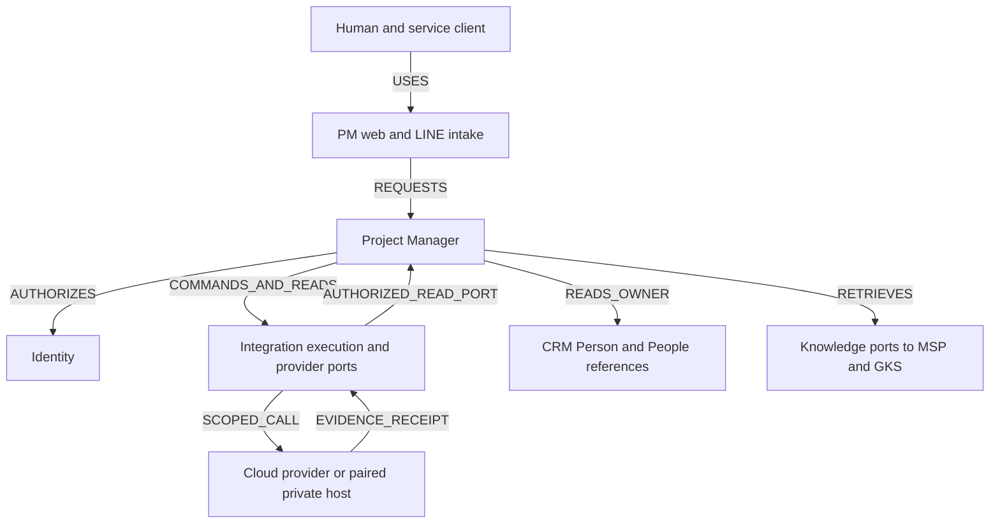
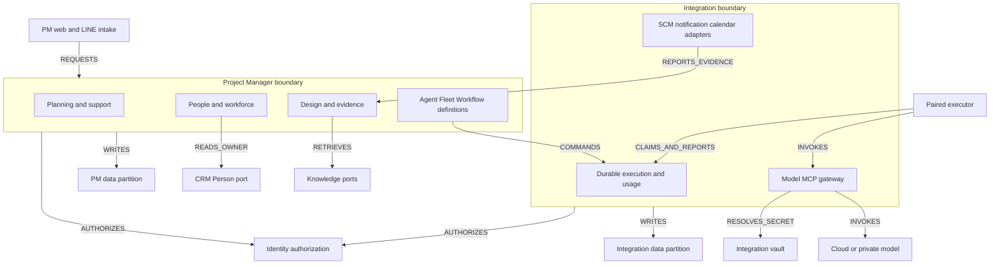
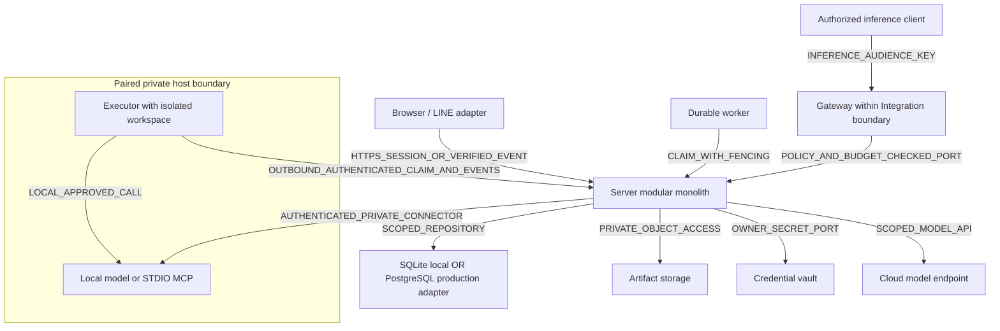
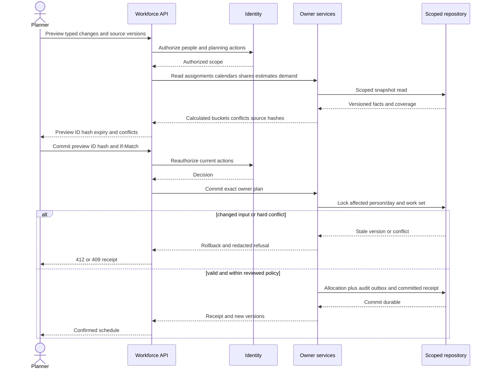
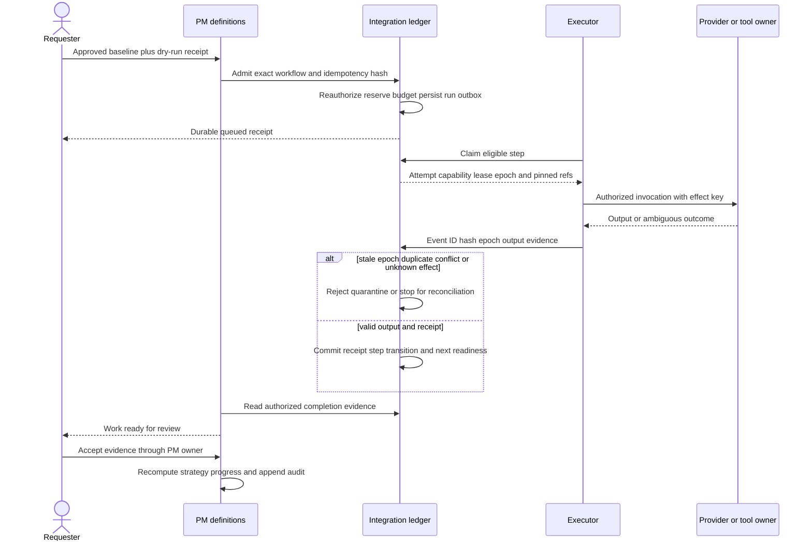

# System Blueprint — จาก requirement ไปถึงการส่งมอบ

**Candidate · C-3 · architectural impact HIGH.** Blueprint นี้ระบุระบบเป้าหมายและขอบเขต implementation ที่ตรวจได้ ไม่ใช่ topology ของ production ที่ตรวจพบ.

## 1. Architecture decision summary

| Decision | Blueprint | Reason / consequence |
|---|---|---|
| Product scope | Extend zuri-ai PM; preserve seven-mode universal core | Existing tasks and progress remain interoperable |
| Domain boundaries | PM definitions/planning; Integration runtime/providers; Identity authority; CRM Person; Knowledge retrieval | Single writer per owner; UI navigation does not change code/data ownership |
| Deployment shape | Modular monolith with durable worker/executor adapters | Component boxes below are logical modules, not a mandate for microservices |
| Source of truth | Versioned SRS + table/graph contracts + OpenAPI + acceptance evidence | Rendered diagrams and Swagger consume source contracts |
| Human capacity | Workforce lane independent from Agent/Fleet runtime | Useful planning can ship before autonomous execution |
| Persistence | SQLite and PostgreSQL repository adapters; owner partitions may share a database | No new schema/API/migration applied by this document |
| Shared identity | Existing IDs and owner scope chain; proposal references are not new canonical registrations | Immutable global IDs retained; no Domain/Feature conflation |
| Execution | Durable ledger, leased claims, fenced results, deduplicated receipts | UI disconnect is not run failure; third-party effects may remain UNKNOWN |

## 2. Component responsibilities and handoff

| Component | Owns | Input/output | Code location after approval |
|---|---|---|---|
| PM planning/support | Project/work, domain/feature projections, risks/change/budget and revision-linked comments | Owner commands and authorized read models | apps/server/src/modules/project-manager/application/ |
| PM design/evidence | Requirement/snapshot/graph bindings, API catalog, release/evaluation links | Exact manifest hashes and evidence with SHA/environment | PM module; existing api-docs generator remains source for deployed API docs |
| PM definitions | Agent/fleet/workflow configuration versions | Validated DAG, pinned tool/model/agent versions | PM module; invokes Integration admission port |
| People/workforce | Employment calendars, estimates, assignments, capacity, schedule, scorecard | Workforce OpenAPI and typed owner input ports | Current PM people module + pure calculators/repositories |
| Integration execution | Run/step/attempt, lease, triggers, usage and receipts | Execution profile mapped into existing pipeline ledger | Integration owner module/platform ports |
| Integration providers | Connections, vault, model/MCP binding, inference routing | Scoped credential resolution and versioned capability/probe | Existing platform integration writer and new reviewed adapters |
| Identity | Viewer scope, service credentials, inference/share profiles and review authorization | Authority receipt/current capability intersection | Identity owner; no duplicate PM role resolver |
| CRM / Knowledge | Person identity / authorized retrieval | Read/reference ports with provenance | Existing owner services; no PM writes to their stores |
| Executor | Private workspace and local tools within assigned capability | Outbound claim, heartbeat and event/result receipts | Paired host adapter; exact package/sandbox design is a delivery gate |
| SCM / notification adapters | Verify remote evidence, resolve recipient and deliver | Signed source event / delivery receipt | Integration adapters; no direct WorkItem acceptance |

Each command has a caller, owner, scope, precondition, idempotency/version contract and response receipt. Caller ports may orchestrate but cannot bypass the owning service. Proposed directory choices must be reconciled with current source at P0.

## BP01 — System context

## BP02 — Logical components and typed edges

This is a grouped projection for readability; boundary arrows combine same-type per-module edges, and CLAIMS_AND_REPORTS combines CLAIMS plus REPORTS_EVENT. Machine source: [blueprint.candidate.json](contracts/blueprint.candidate.json), 18 nodes and 27 exact directed edges listed below. AUTHORIZES means the source requests a decision from Identity; it does not give the target a grant. WRITES edges must remain within the owning domain. READS_OWNER crosses only a published owner port. Database boxes are logical partitions of the selected adapter, not three compulsory databases. Original G01 remains unchanged.

| Edge | From → To | Type | Contract |
|---|---|---|---|
| BPE-01 | web → pm-planning | REQUESTS | openapi.candidate.yaml |
| BPE-02 | web → pm-design | REQUESTS | openapi.candidate.yaml |
| BPE-03 | web → workforce | REQUESTS | workforce.openapi.candidate.yaml |
| BPE-04 | web → pm-definitions | REQUESTS | openapi.candidate.yaml |
| BPE-05 | pm-planning → identity | AUTHORIZES | ../17-SRS.md |
| BPE-06 | pm-design → identity | AUTHORIZES | ../17-SRS.md |
| BPE-07 | workforce → identity | AUTHORIZES | ../17-SRS.md |
| BPE-08 | pm-definitions → identity | AUTHORIZES | ../17-SRS.md |
| BPE-09 | execution → identity | AUTHORIZES | ../17-SRS.md |
| BPE-10 | provider → identity | AUTHORIZES | ../17-SRS.md |
| BPE-11 | workforce → crm | READS_OWNER | ../15-WORKFORCE-CAPACITY-SCHEDULE-AND-PERFORMANCE.md |
| BPE-12 | pm-planning → pm-store | WRITES | data-model.candidate.json |
| BPE-13 | pm-design → pm-store | WRITES | data-model.candidate.json |
| BPE-14 | pm-definitions → pm-store | WRITES | data-model.candidate.json |
| BPE-15 | workforce → pm-store | WRITES | data-model.candidate.json |
| BPE-16 | identity → identity-store | WRITES | ../17-SRS.md |
| BPE-17 | execution → integration-store | WRITES | data-model.candidate.json |
| BPE-18 | provider → integration-store | WRITES | data-model.candidate.json |
| BPE-19 | provider → vault | RESOLVES_SECRET | ../05-PROVIDERS-AND-MCP.md |
| BPE-20 | pm-definitions → execution | COMMANDS | workflow.schema.json |
| BPE-21 | executor → execution | CLAIMS | openapi.candidate.yaml |
| BPE-22 | executor → execution | REPORTS_EVENT | openapi.candidate.yaml |
| BPE-23 | executor → provider | INVOKES | openapi.candidate.yaml |
| BPE-24 | provider → model-host | INVOKES | ../05-PROVIDERS-AND-MCP.md |
| BPE-25 | pm-design → knowledge | RETRIEVES | ../03-DATA-AND-EVENTS.md |
| BPE-26 | integration-adapters → scm | VERIFIES | ../07-DELIVERY-AND-VERIFICATION.md |
| BPE-27 | integration-adapters → pm-design | REPORTS_EVIDENCE | ../07-DELIVERY-AND-VERIFICATION.md |

## BP03 — Deployment and trust boundaries

Network edges describe approved target connectivity, not open ports. Private-connector readiness must be verified for the selected host; absence of a reachable approved connector leaves self-host unavailable. Never expose raw model/MCP serving ports to satisfy the drawing. Authenticated outbound executor pull remains the default for task execution. Worker and web may be different processes using the same owner interfaces; neither grants Business access to an installation operator.

## BP04 — Human planning preview and exact commit

This sequence assumes the approved owner unit-of-work can provide one transaction. Remote calendar owners require a reviewed reservation/compensation protocol or separate commands; the UI cannot present partial distributed writes as one committed plan. Denied/partial source scopes remain visible without disclosing hidden facts.

## BP05 — Agent run and evidence acceptance

## 3. Domain-to-feature blueprint matrix

| Capability | Primary owner and collaborators | Main data | Delivery dependency |
|---|---|---|---|
| PMF-01 Planning and Domain/Feature views | PM; Identity | Project/Work*, ProjectFeature, FeatureWorkLink, support records | P1 after navigation baseline |
| PMF-02 Architecture/baseline | PM | DesignSnapshot, DesignReview, ArchitectureElementBinding | P2 |
| PMF-03 Visual API | PM; Integration/Identity contracts | OpenAPI snapshots and operation bindings | P2; read-only first |
| PMF-04 Agent inventory | PM; Integration | AgentDefinition/Version, approved model/tool refs | P4 |
| PMF-05 Fleet inventory | PM; Integration | Fleet/Workflow versions and member bindings | P5 after durable single-run proof |
| PMF-06 Command center | Integration; PM UI | Run/Step/Attempt/Lease/EffectReceipt/Trigger | P4–P5; ledger compatibility gate |
| PMF-07 Provider/MCP/gateway | Integration; Identity | Connection, Deployment, Offering, ToolSnapshot, inference-key profile | P3; no automatic public LINE change |
| PMF-08 Authority/evidence | Identity; PM | Existing grants, exact review/share profile and AuditEvent | Every slice |
| PMF-09 Collaboration/retrieval | PM; Knowledge/Integration/Identity | ArtifactRevision, comments, subscription/delivery, share | P6 |
| PMF-10 Release/eval/operations | PM; Integration/SCM | Release/Evaluation/Usage records | P6–P7 |
| PMF-11 Human workforce | PM people/work; CRM/Identity inputs | Calendars/allocations/history/metric policies/results | PMR-033-P1→P5 independent of Agent/Fleet |

## 4. Transaction and failure blueprint

| Boundary | Failure to anticipate | Required behavior |
|---|---|---|
| UI → API | Timeout, stale ETag, session revocation | Query durable receipt, preserve draft, never show success without confirmation |
| PM → Identity/CRM | Missing scope, deleted/unknown person, changed grant | Refuse or show partial coverage; no guessed identity or automatic Membership |
| Calendar/allocation writers | Concurrent plan, changed estimate/share, fixed-slot overlap | Atomic CAS/ordered locks and no partial commit; review coarse conflict scope |
| PM → Integration | Duplicate admission or pipeline profile mismatch | Same key/hash returns receipt; unsupported profile rejected; do not repurpose existing required fields |
| Executor → ledger | Crash, expired lease, late result | Epoch fence; stale evidence quarantined; no state promotion |
| Provider/tool effect | Success before network loss | Mark UNKNOWN, retain effect key/receipt and reconcile before retry |
| Outbox/inbox | Duplicate/out-of-order message | Owner-local atomic dedup plus event; visible gap and bounded replay |
| SCM/CI | Forged signature or SHA mismatch | Refuse evidence; no release promotion |
| Artifact/share | Expired/revoked access or missing bytes | Reauthorize and deny; metadata tombstone preserves audit identity |

## 5. Document → Diagram → Spec → Code blueprint

| Stage | Input and output | Gate |
|---|---|---|
| D0 Intent | User request → SRS PMR and capability/owner mapping | Existing behavior/IDs enumerated; contradictions recorded |
| D1 Design | SRS → table dictionary, typed graph, UX flows and decisions | Parent/peer ownership and source reuse reviewed |
| D2 Contract | Approved design → OpenAPI/JSON/schema/event bindings and fixtures | Close relevant SPEC-G gaps; all refs resolve and negative cases defined |
| D3 Baseline | Exact source hashes + canonical requirement registration + phase approval | Approval identifies concrete phase/files and compatibility/migration risks |
| D4 Generated output | Contract → types/client/schema stubs/diagram views/trace map | Generated artifacts reproducible; never infer security or transaction code from a diagram |
| D5 Implementation | Owner services/repos/UI + handwritten business invariants and runnable tests | Doc-first approval required; immutable ID and trace annotations |
| D6 Verification | Governance, schema validation, unit/contract/integration/UI/build | Zero-test pass forbidden; accepted evidence tied to exact SHA/environment |
| D7 Release | Exact tested revision + migration/rollback plan → approved deployment | Separate deployment and activation receipts; local checks are not production evidence |

Safe to derive: catalog tables, ERD labels, graph views, DTO/client scaffolds and operation/requirement links. Requires reviewed implementation: authorization, scope queries, transactional capacity, effect idempotency, encryption, RLS, migration/backfill and recovery. This avoids treating a visually valid diagram as executable authority.

## 6. Operations and observability

- Correlation/request/event/run/attempt IDs propagate without raw credentials, prompt payloads or protected employee details in general logs.
- Observe queue depth/age, active leases/epochs, unknown effects, outbox lag, provider errors, reservation exposure, artifact integrity, workforce source coverage and projection lag.
- Health checks distinguish process health, executor pairing, credential validity, capability probe and approved runtime readiness.
- Runbooks cover revoked key, unavailable executor, poisoned receipt, overload race, stale calendar, missing metric source, failed backup restore and artifact purge.
- Restore drills validate database + artifact digest + secret-reference recovery together; control API recovery targets are proposed in SRS.
- Performance panels display source/cohort/formula/asOf and coverage. No hidden employee ranking or inference that busy means effective.

## 7. Implementation work packages and current readiness

| Work package | Concrete entry condition | Deliverable | Status |
|---|---|---|---|
| Navigation | Reconcile doc13/14 with old JSON and screen map | Approved Domain/module/tab routes and tests | CANDIDATE, parity pending |
| Data/identity foundation | Table reuse, person identity, common errors/actions, ledger PM profile | Reviewed per-adapter schema and owner ports | Design specified; contracts/migrations pending |
| Workforce P1–P2 | Typed inputs/history/calendar/assignment and one allocation writer | Scope-aware workload/schedule preview/commit | PMR-033 contract gaps open |
| Workforce P3–P5 | Metric result variants, policy/correction lifecycle, historical evidence | Reviewable scorecard and accessible UI | Design specified; API parity/tests pending |
| Providers/execution | Approved model/MCP/key/lease/side-effect contracts | Durable single run before fleet | Candidate; no runtime activation |
| Delivery/pilot | Evidence adapters, eval, release controls and operational tests | Scoped pilot on exact revision | NOT_RUN |

Use [16 readiness audit](16-SPEC-READINESS-AND-API-REFERENCE.md) as the gap ledger. Table/SRS/blueprint additions improve documented coverage but do not close gaps by file count. See [17 SRS](17-SRS.md), [18 Tables & ERD](18-DATABASE-TABLES-AND-ERD.md), [trace model](contracts/srs-traceability.candidate.json) and [07 delivery plan](07-DELIVERY-AND-VERIFICATION.md) for implementation review.

## CHANGELOG

| Version | Date | Status | Summary | Commit Hash | Agent |
|---|---|---|---|---|---|
| 0.1.0b | 2026-09-16 | candidate | Add component/data/deployment blueprint, typed edges, two runtime sequences and per-phase handoff | design base 087f3025; uncommitted | RWANG |
