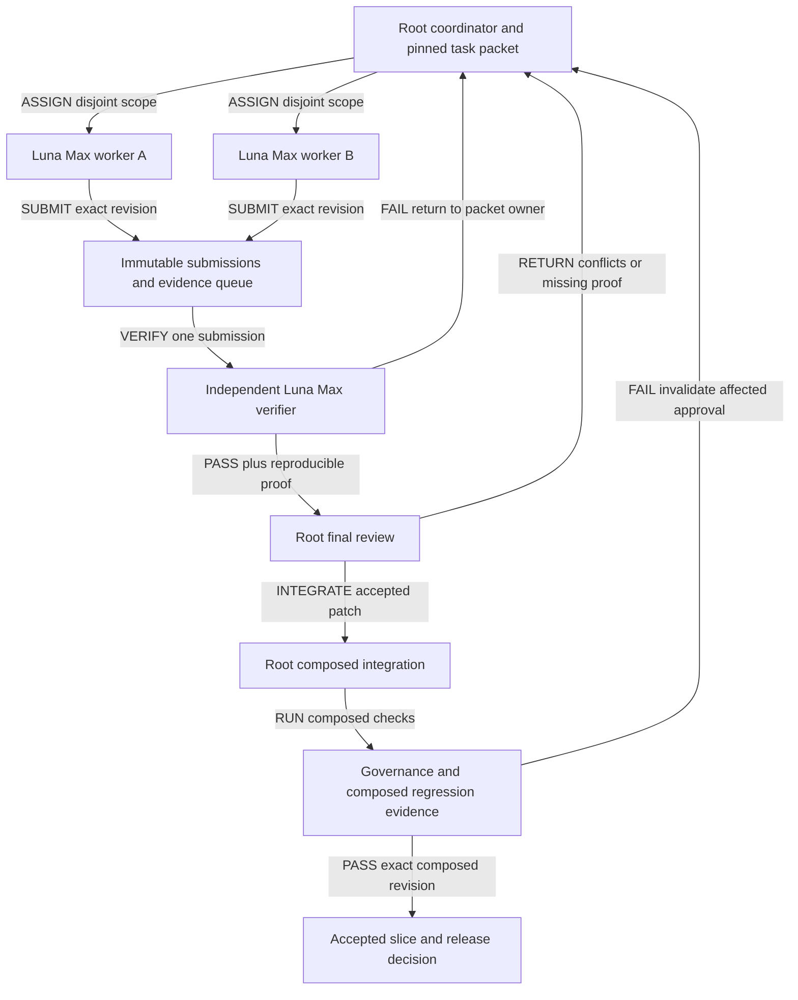
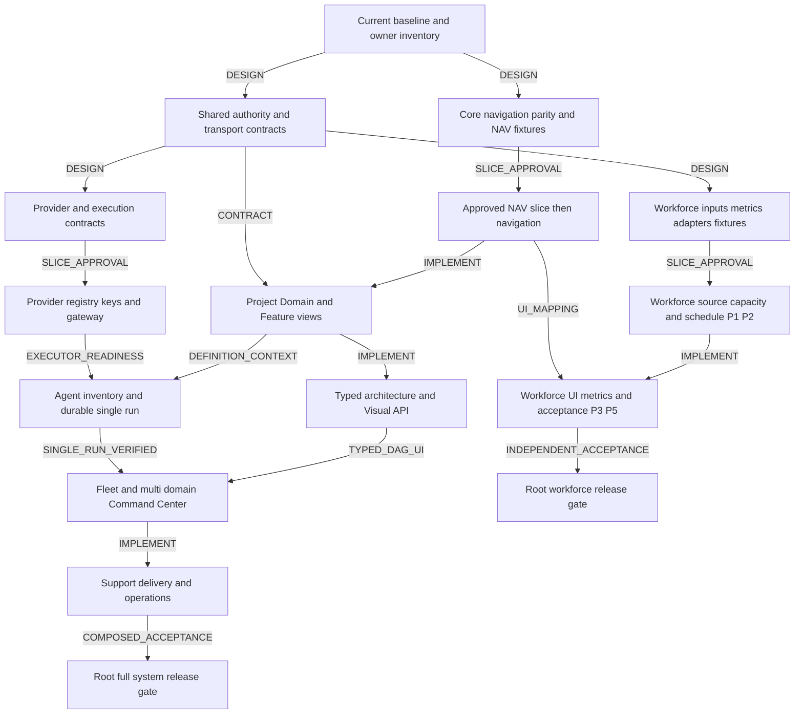

# Multi-agent delivery — Luna Max → Verify gate → Final gate

**แผนหลัก:** ให้ `gpt-5.6-luna` / reasoning `max` ทำงานในขอบเขตย่อยที่ตรวจได้ ใช้ Luna Max คนละ agent เป็นผู้ตรวจอิสระ และให้ RWANG ซึ่งเป็น assistant หลักในงานนี้ เป็นผู้ตัดสินขั้นสุดท้ายและประกอบงานทั้งหมด

งานรอบนี้คือ **วางแผนและตรวจเอกสาร (C-2)**; ยังไม่เริ่ม implementation ของ PM. งาน implementation ข้าม domain/สิทธิ์/schema เป็น C-3 และประเมินความเสี่ยงราย packet อีกครั้ง การเลือก workflow/model ไม่ใช่การอนุมัติ spec, migration หรือ production release แทนเจ้าของ

## 1. Baseline และขอบเขต

- ต่อยอด candidate package v0.7.0b เป็น v0.8.0b โดยเพิ่มแผนนี้; ความหมายของ OpenAPI เดิมและ 33 PMR ไม่เปลี่ยน
- [16 Spec readiness](16-SPEC-READINESS-AND-API-REFERENCE.md) ยังมี SPEC-G01–G09. Plan/review PASS ไม่ทำให้ gap เหล่านี้ปิดเอง
- [07 Delivery](07-DELIVERY-AND-VERIFICATION.md) ยังคง P0–P7; [15 Workforce](15-WORKFORCE-CAPACITY-SCHEDULE-AND-PERFORMANCE.md) ยังคง PMR-033-P1→P5 เป็นสายงานอิสระจาก Provider/Agent/Fleet
- [13 Navigation](13-DOMAIN-TAXONOMY-AND-NAVIGATION-BOUNDARIES.md) และ [14 Existing tabs](14-EXISTING-PROJECT-TAB-SEMANTICS.md) เป็นข้อกำหนดล่าสุด: Top bar = Domain, sidebar = subdomain/module, local tabs = views และ Business Home = shortcuts
- `projects` และ canonical IDs เดิมรักษา identity; Inventory เป็น operational read model, Team เดิมแสดง Business Membership, Resources/Risks เดิมยัง Planned. Team/Employment ไม่ให้สิทธิ์เพิ่มโดยอัตโนมัติ
- Design worktree base `087f30258a6831865afd751e28804e36505aff30` เป็น reference snapshot เก่า ไม่ใช้เป็น implementation baseline โดยอัตโนมัติ. ก่อนเริ่มแต่ละ slice ต้องตรวจ main/registry/peer contracts ปัจจุบันใน isolated worktree และ pin revision ใหม่
- ใช้ [delivery plan index](contracts/delivery-plan.candidate.json) เป็น planning data เท่านั้น: `dispatchable=false`, `implementationAuthorized=false`. ไม่ใช่ runtime WorkflowDefinition และไม่นำ JSON นี้ไปรัน shell/agent อัตโนมัติ

## 2. ทีมและจำนวนงานพร้อมกัน

| Role | Model / effort | หน้าที่ | ขอบเขตการเขียน |
|---|---|---|---|
| Coordinator + final gate + integrator | Assistant หลักของ task นี้ | แตกงาน, pin baseline, ตัดสิน parent/peer conflicts, ประกอบ, ทดสอบต้นไม้รวม | Shared contracts/registry/composed worktree ตาม scope ที่อนุมัติ |
| Worker A | `gpt-5.6-luna` / `max` | ทำ packet แรกจาก ready queue, ตรวจตนเอง, ส่งหลักฐาน | เฉพาะ allowlist ใน isolated lane ของ packet |
| Worker B | `gpt-5.6-luna` / `max` | ทำอีก packet ที่ไม่ชนไฟล์/owner/contract dependency | เฉพาะ allowlist ใน isolated lane ของ packet |
| Verify gate | `gpt-5.6-luna` / `max`, คนละ agent กับผู้ทำ | ตรวจ diff/spec, รัน verification ของ revision ที่ส่งมา, รายงาน PASS/FAIL/BLOCKED | Evidence/report ใน verification workspace; ไม่แก้ implementation และไม่ merge |

ใช้สูงสุด **4 slots = root 1 + workers 2 + verifier 1**. Coordinator/final gate/integrator เป็นบทบาทของ root ตัวเดียว ไม่ใช่เพิ่มอีกสาม agent. จำนวนสูงสุดนี้ตรงกับเครื่องมือใน task ปัจจุบัน; ตรวจ capacity ใหม่เมื่อย้าย environment

Verifier ดูทีละ submission. เมื่อคิวตรวจมี 2 submissions ให้ชะลอ dispatch งานใหม่และให้ worker แก้ข้อที่ถูกส่งกลับก่อน เพื่อไม่สะสมงานที่ยังไม่ตรวจ. อย่าให้ worker ตรวจอนุมัติผลงานตนเองหรือใช้ session ของผู้เขียนมาสวมบท verifier

Luna Max ใช้ตรวจ gate นี้ได้เมื่อมี artifact, baseline และ acceptance ที่ชัดเจน ผลตัดสินต้องอ้างการตรวจจริง ไม่ใช้ความมั่นใจของโมเดลเป็นหลักฐาน. เพราะ workers/verifier ใช้โมเดลเดียวกัน การตรวจ final ต้องเน้นความผิดร่วมที่อาจมองข้าม โดยเฉพาะ owner boundaries, authorization, concurrency, migration และ dependency coupling. ถ้าโมเดลหรือ effort ที่ระบุใช้ไม่ได้ ให้รายงานและรอการตัดสิน ไม่เปลี่ยนโมเดลเงียบ ๆ

## 3. MA01 — Directed gate flow

เส้นคือชนิด handoff มีทิศทางชัดเจน. `PASS` จาก verifier หมายถึงผ่าน acceptance ของ packet นั้น; `ACCEPTED` เกิดหลัง root ตรวจและต้นไม้รวมผ่าน. สถานะ merged/deployed/activated เป็นคนละหลักฐาน

## 4. Gate contract

| Gate | ใครรับผิดชอบ | ผ่านเมื่อ | หากไม่ผ่าน |
|---|---|---|---|
| G0 — Ready to assign | Root | Dependency artifacts มี digest, scope/owner/allowlist ชัด, relevant spec gaps ปิดระดับที่ slice ต้องใช้, approved docs สำหรับ code, baseline และ verification environment พร้อม | เก็บ BLOCKED/NEEDS_DECISION พร้อมเหตุผล; ไม่เริ่ม code จาก placeholder |
| G1 — Worker self-check | Worker | Deliverables ครบ, diff อยู่ใน scope, required local checks มีจำนวนที่รันจริง, negative cases และ limitations แนบ | Worker แก้ใน lane เดิม; self-check ไม่ใช่ independent approval |
| G2 — Independent verification | Luna Max verifier | อ่าน requirement/parent/peer เอง, ยืนยัน exact artifact hash, ตรวจผลและ rerun checks ตามความเสี่ยง, ไม่พบ required acceptance failure | FAIL/REWORK หรือ BLOCKED; ส่ง finding แบบทำซ้ำได้กลับผู้ทำ |
| G3 — Final review | Root | พิจารณา worker+verifier evidence, ตรวจขอบเขตข้าม domain และ contract/UX/DB parity, ไม่มี required proof หาย | ส่งกลับพร้อม scope ที่ต้องแก้ หรือแตกงานใหม่ |
| G4 — Composed integration | Root | Apply/cherry-pick revision ที่ผ่าน gate, regenerate outputs ครั้งเดียว, รัน composed governance/tests/build ตาม slice; diff และ source hashesตรงกับผลตรวจ | ไม่ promote; เมื่อ integration แก้ semantics ต้อง reverify ส่วนที่เปลี่ยน |
| G5 — Release / activation | Root + เจ้าของตาม authority | Target/SHA/env/migration/rollback/CI และ approval ครบตาม release scope | ไม่ merge/deploy/activate โดยถือ G2 PASS เป็น permission |

### เกณฑ์ปฏิเสธที่ต้องบังคับ

- Baseline/contract hash เปลี่ยน, diff นอก allowlist, fake/stale evidence, test รัน 0 ข้อ, required test skipped/flaky, artifact ไม่มี bytes หรือ verification environment ไม่ตรง → ห้าม PASS
- Cross-tenant/Business leakage, duplicate side effect, lost update, unsafe migration, wrong authority หรือ uncertainty ที่กระทบ acceptance → FAIL/BLOCKED จนแก้หรือมีข้อมูลครบ
- Test tooling เริ่มไม่สำเร็จ = NOT_RUN ไม่ใช่ PASS. ไม่เพิ่ม timeout หรือลด assertion เพื่อให้ผลดูผ่าน
- คะแนน/เมตริกที่ยังไม่มีแหล่งข้อมูลต้องมี UNKNOWN/PARTIAL/N/A ตาม spec; ห้ามอนุมานว่าไม่มีงานหรือ performance เป็นศูนย์
- แก้เชิงความหมายหลัง verify แล้ว ต้องสร้าง submission revision ใหม่และตรวจ affected checks ใหม่. Root ไม่ใช้ผล PASS เก่ารับ patch ที่แก้เองโดยไม่มีหลักฐานใหม่

## 5. Task packet และผลส่งกลับ

### Input packet ที่ root ต้องให้ก่อน dispatch

| Field | Required meaning |
|---|---|
| `packetId`, `attempt`, `workPackageId` | ID ภายในแผน; ไม่ใช่ canonical FR/FEAT |
| `ownerDomain`, `requirements`, `phase` | ผู้เขียนข้อมูลหลัก, PMR/canonical mapping ที่อนุมัติ, phase ย่อย |
| `baseCommit`, `sourceDigests`, `approvedSpecRefs` | Exact revision และ hash ของเอกสาร/contract ที่อ่าน รวม staged design ถ้ามี; HEAD อย่างเดียวไม่ครอบคลุม uncommitted docs |
| `dependsOn`, `inputArtifacts` | ต้องเป็น accepted dependency revision; ไม่อ่านไฟล์ครึ่งทางจาก worker อีกตัว |
| `allowedFiles`, `forbiddenEffects`, `risk` | Allowlist รายไฟล์หรือแคบกว่าระดับ module; ห้ามใช้ wildcard ทั้ง repository เป็น writer scope |
| `acceptance`, `verificationPlan` | ผลที่ต้องเห็น, negative/race cases, commands/environment ที่ได้รับอนุญาต, mandatory vs optional |
| `deliverables`, `stopConditions` | Patch/commit/docs/tests/report; หยุดเมื่อจำเป็นต้องเปลี่ยน owner/shared contract หรือพบ stale baseline |
| `worker`, `verifier`, `finalGate` | Worker/verifier คนละ instance, ทั้งคู่ Luna Max, root เป็น final gate |

### Worker submission

ส่ง `packetId`, baseline, exact commit หรือ patch digest, changed-file list, requirement→change→test mapping, commands/exit codes/actual counts, environment/runtime versions, artifacts+digests, known limitations, failure/recovery notes และ outstanding decisions. ข้อความ “done” อย่างเดียวรับไม่ได้. ไม่ส่ง secrets หรือข้อมูลพนักงานจริงใน report รวม

### Verify receipt

ส่ง `reviewedRevision`, `verifiedDigests`, `verifierIdentity`, `model`, `effort`, verdict `PASS|FAIL|BLOCKED|NEEDS_DECISION`, checklist ราย acceptance, rerun commands/counts, negative cases, findings พร้อมตำแหน่ง/วิธีทำซ้ำ, limitations และเวลาตรวจ. Verifier ไม่แก้ code ของ submission แล้วออก receipt ให้ code เก่าต่อ

### Final receipt

Root บันทึก verdict, worker/verifier revisions ที่ใช้, integrated revision, conflict resolutions, composed check results, risk/rollback และสิ่งที่ยัง NOT_RUN. ไฟล์/evidence เหล่านี้อยู่ใน task artifact ที่มี scope เหมาะสม; ไม่บังคับเพิ่ม runtime registry หรือ API ใหม่ให้ระบบ PM เพื่อรันงานพัฒนานี้

## 6. Ownership, worktree และการประกอบ

1. Root enumerate current source/registry แล้วเลือก base ที่ตรวจได้. Primary checkout เป็น reference; ไม่ checkout/reset/stash/commit ใน shared primary
2. Implementation workers ใช้คนละ worktree/branch ชื่อ `codex/...` หลัง G0. ตรวจ command cwd และ runtime/DB target ก่อนทุก mutation; shared `node_modules` หรือ Docker Compose ไม่ถือว่า isolated
3. Worker เตรียมคำเสนอแก้ shared contract เป็น patch/diff ใน lane ตน. Root เป็นผู้ประกอบและยึดเป็น baselineก่อน dependent workers เริ่ม. ห้ามสอง agent เขียน API contract/schema/ID ledger เดียวกันพร้อมกัน
4. ไฟล์ร่วมที่ root ถือ: PRD/FEATURES/ROADMAP/ID ledger, root route/config manifests, shared OpenAPI/schema/event/owner ports, Prisma schemas/migrations, shared dependency manifests/lockfiles, composed generated outputs. **การเป็น integrator ไม่แทน authority ของ domain owner**
5. Worker domain เดียวใช้ขอบเขต source/test ที่ root เลือกจากไฟล์จริง. Verifier ใช้ checkout/snapshot ของ submission คงที่; log และ test data อยู่ในพื้นที่ของ verifier
6. Root แก้ source conflicts ก่อน แล้ว run `npm run govern` รอบเดียวจาก composed tree. ห้าม concatenate generated graphs/TRACE/DOMAIN-MAP และไม่รัน govern ซ้อนกันใน worktree เดียว
7. Scope ที่เปลี่ยน routes/models/requirements ต้องผ่าน governance. Implementation ใช้ tests/build/lint/e2e ตาม definition of done; full `npm run verify` บน integrated sourceเมื่อปิด slice ที่จะส่งมอบ. Cross-app changes ต้องใช้ dependencies และ checks ของ Server/Edge ที่เกี่ยวข้อง
8. Merge/release ใช้ hosted checksของ exact revisionและ approvalตามคำสั่งที่มีอยู่; deployment กับ runtime activation แยกจากกัน. งานแผนนี้ไม่ขอเปิด production service

## 7. Work packages และ dependency plan

<!-- BEGIN WORK_PACKAGES -->
### 7.1 ปิด design gaps ก่อน code

IDs `MA-*` เป็นหมายเลขงานในแผน ไม่ใช่ FR/FEAT ใหม่. รายการระดับ work package ต้องถูกแตกเป็น dispatch packet ที่มี owner เดียวและ file allowlist ก่อนเริ่มทำจริง

| ID | งาน / owner | Dependency | Gap scope | ผลส่งมอบและหลักฐานหลัก |
|---|---|---|---|---|
| MA-D00 | ตรวจ current source และ pin baseline · root | — | SPEC-G09 | Registry/source/owner reuse inventory, source+spec digests, collision list; ไม่ reset shared primary; ตรวจ: Enumerated routes/models/tests, staged candidate bytes included, current registries read before any new ID |
| MA-D01 | Shared authority, allocation owner และ transport · project-manager | MA-D00 | SPEC-G01, SPEC-G05 | One allocation writer; Person/resource mapping; hours/minutes compatibility; common error, requestId, ETag, auth/session/CSRF and refusal matrix; ตรวจ: PM vs Identity vs CRM authority; foreign-scope refusal; idempotency/error and required headers; owner sign-off per affected interface |
| MA-D02 | Core Navigation / UX parity และ NAV fixtures · project-manager | MA-D00 | SPEC-G06, SPEC-G08 | Domain→module→tabs mapping, nine sections/14 routes/seven views and core NAV fixtures; Workforce contract bindings are deferred to D02W; ตรวจ: Old/new route crosswalk, stable keys, Business Home shortcuts, Inventory read-only and Membership Team semantics; named Resources/Risks remain planned; no orphan core navigation ref |
| MA-D02W | Workforce screen / operation / G14 bindings · project-manager | MA-D02, MA-D01, MA-D04 | SPEC-G06, SPEC-G08 | Six workforce screens linked to stable input/metric/operation contracts and G14 model; remaining mapping scope after core NAV; ตรวจ: WF-R01–06 schema/operation/field parity; no stale metric variant or hours/minutes binding; one linked graph authority and trace refs |
| MA-D03 | Workforce inputs และประวัติ · project-manager | MA-D01 | SPEC-G02 | Typed estimates, calendars, availability, team shares, effective assignments/history and seven-mode status maps; ตรวจ: Missing inputs remain PARTIAL; effective-date/reassignment and duplicate event examples; agent/unresolved assignee cannot become Person |
| MA-D04 | Metric variants, policy และ corrections · project-manager | MA-D03 | SPEC-G03, SPEC-G04 | Twelve metric result shapes, Business/person/team review and correction lifecycle, reviewer authority; ตรวจ: Each metric has typed value/sample/coverage/cohort; denominator zero, small samples, quantiles, changed due date, reopened work and history corrections |
| MA-D05 | Physical adapter และ migration design · project-manager | MA-D03, MA-D04 | SPEC-G07 | Per-owner table reuse, exact SQLite/Postgres mapping, transaction/RLS/grant/backfill/rollback design; ตรวจ: Retain source composite keys; person/day conflict locking; no blanket creation of 54 records; migration design vs execution proof separated |
| MA-D06 | Provider / agent / ledger compatibility contracts · integration | MA-D01 | SPEC-G05, SPEC-G07, SPEC-G08 | Cloud/private/paired locations, model vs MCP protocols, key/secret owner, ledger profile and typed handoff contracts plus conformance fixtures; ตรวจ: Existing PipelineRun required definition and unique attempt identity preserved; vault/revoke/private network, lease/epoch/UNKNOWN, no arbitrary execution |
| MA-D07 | Workforce conformance fixtures และ test design · project-manager | MA-D03, MA-D04, MA-D05, MA-D02W | SPEC-G08 | Request/response/error/lifecycle example matrix and PMT-033 A–P test design; ตรวจ: Positive and invalid payloads; overlaps/dedup/zero capacity; stale preview and concurrent commit; permission revocation; fixtures are not service tests |
| MA-D08 | Register และอนุมัติ baseline ราย slice · root | MA-D00 | SPEC-G09 | Per-slice REUSE/EXTEND/NEW canonical mapping, exact approved docs/contracts, ledger and phase receipt; ตรวจ: Selected slice relevant design outputs and entry-proof accepted; preserve IDs; shared FR with ordered phases; govern after composed registration |

**MA-D08 เป็น control ที่ทำซ้ำราย slice** ไม่ใช่ barrier ที่รอ D01–D07 เสร็จทั้งโปรแกรม. ตัวอย่าง NAV ใช้ D02 + canonical registration + NAV entry fixtures; ไม่รอ metric/provider gaps. Workforce screen bindings ใช้ D02W หลัง input/metric contracts พร้อม; SPEC-G06 ทั้งชุดยังไม่ปิดเพียงเพราะ core NAV ผ่าน. Workforce ใช้ D01/D03/D04/D05/D07 ใน scope ที่ phase ต้องใช้. D06 ปิด provider/ledger contracts ได้ก่อน UI canvas เสร็จ แต่ต้องมี approved P2 contract references

**G07/G08 แบ่งสองระดับ:** ก่อน code ต้องมี reviewed adapter/migration design, fixture/schema/negative-case plan และ acceptance ที่ทดสอบได้; executable service/migration/concurrency evidence ต้องผ่านหลัง implementation ก่อน G4/G5. จึงไม่กำหนดเงื่อนไขวนว่า code ยังห้ามเขียนแต่ต้องมี service test ผ่านแล้วก่อนเริ่ม

### 7.2 Implementation waves หลัง approved slice baseline

ทุกแถวต้องผ่าน MA-D08/G0 ของ slice ตน แม้ไม่เขียน dependency ซ้ำทุกแถว. วันที่/ชั่วโมงยังไม่กำหนด; เรียงตาม dependency และคิวตรวจจริง

| ID | งาน / owner | Phase / dependency | Acceptance ของ verify gate |
|---|---|---|---|
| MA-I01 | Navigation เดิมและ named planned states · project-manager | NAV-P1; MA-D02, MA-D08 | 9 sections/14 routes/7 Work views, deep links/history/active states, keyboard/mobile, scope/refusal and planned Risks/Resources |
| MA-I02 | Project / Domain / Feature views และ strategy progress · project-manager | P1; MA-I01, MA-D01 | Scope before aggregate; cross-feature dedup; immutable identities; objective/import transaction; weighted evidence progress |
| MA-I03 | Typed architecture, Visual API, trace/import and drift · project-manager | P2; MA-I02, MA-D01 | Typed edge direction/owner/port/cycle tests, read-only API parity, forbidden imported code, stale evidence and spec/code drift checks |
| MA-I04 | Workforce source ports และ persistence · project-manager | PMR-033-P1; MA-D03, MA-D05, MA-D07, MA-D08 | Calendar/estimate/assignment/history authority; legacy count compatibility; approved adapter constraints, source coverage and historical attribution |
| MA-I05 | Capacity calculator และ schedule preview/commit · project-manager | PMR-033-P2; MA-I04 | PMT-033 A–F/O/P; interval union, timezone, dedup, ordered locking/CAS, same-key same receipt, same-key changed payload denied |
| MA-I06 | Resources UI / person-team workload / schedule · project-manager | PMR-033-P3; MA-I05, MA-I01, MA-D02W | WF-R01–03/R05, count vs load distinction, per-person overload visible under team average, empty/partial/error and 200% zoom; no new Membership grants |
| MA-I07 | Performance / evidence / policy review / correction · project-manager | PMR-033-P4; MA-I06, MA-D04, MA-D07 | WF-R04/R06; twelve formulas; PMT-033 G–L/N; immutable cohort, pooled ratios/recomputed quantiles, no invented ranking |
| MA-I08 | Workforce acceptance และ scoped pilot readiness · root | PMR-033-P5; MA-I07 | All PMT-033 A–P executed; contract/unit/UI/e2e counts; representative-data pilot requires authorized data/environment; root final composed gate |
| MA-I09 | Provider / connection / deployment / MCP registry · integration | P3; MA-D06, MA-D08 | Model capability probe, protocol/tool-schema digest, consent, cloud/private/paired-local differentiation, credentials never in UI/logs |
| MA-I10 | Scoped inference keys และ authorization/audit ports · identity | P3; MA-D01, MA-D06, MA-D08 | Audience/scope/model allowlist, expiry/revoke/rotation, CSRF and redacted audit; no key misuse across Business |
| MA-I11 | Inference gateway / private or paired executor binding · integration | P3; MA-I09, MA-I10 | Raw serving port private, gateway refusal/quota, executor readiness, no browser-localhost assumption and failure recovery |
| MA-I12 | Agent inventory และ immutable version approval · project-manager | P4; MA-I02, MA-I09 | Approved version immutable; tool/model/executor pins, stale hash refused, fixtures and eval prerequisites captured |
| MA-I13 | Durable single run / lease / receipt / recovery · integration | P4; MA-I12, MA-I11 | Claim race/epoch fence, crash after effect, late result, duplicate receipts, UNKNOWN reconciliation, cancel/pause and isolation |
| MA-I14 | Fleet inventory / typed DAG / handoffs · project-manager | P5; MA-I03, MA-I12, MA-I13 | One durable single-run proof first; cycle/ref/type/owner checks, immutable member pins, terminal result selection, no recursive fleet spawn |
| MA-I15 | Multi-domain execution / Command Center / triggers · integration | P5; MA-I14, MA-I13 | Lane serialization, typed artifact handoff, cancellation/fencing, budget exposure, trigger timezone/misfire/dedup/loop suppression |
| MA-I16 | PM support: risks/issues/scope/cost and collaboration · project-manager | P6; MA-I03, MA-I15, MA-D03, MA-D05 | Risks/Issues/ChangeRequest lifecycle, capacity calls existing single writer, revised scope evidence, comment revision and optimistic conflict |
| MA-I17 | Knowledge retrieval, share/retention และ notifications · root | P6; MA-I03, MA-I15 | Knowledge provenance/authorized results; Identity revoke/retention and no cached leak; Integration recipient reauthorization and receipts |
| MA-I18 | SCM/CI, release evidence, eval and operations · root | P6–P7; MA-I16, MA-I17 | Exact SHA/env signatures, golden/adversarial eval, actual usage provenance, SLO/load, backup/restore, RLS/grants and migration/rollback evidence |

**Independent Workforce release:** MA-I08 → MA-RWF ส่ง scoped workforce release ให้ root ตรวจได้โดยไม่ต้องรอ MA-I09–I18. ยังคง required CI/schema/security/rollback/approval ของ workforce เอง. MA-I18 คือ full-system pilot ตาม P6–P7 ไม่ใช่ gate บังคับของ workforce

### 7.3 Candidate file ownership

| ID | พื้นที่งานที่ใช้แตก packet |
|---|---|
| MA-D00 | Source read-only; root controls baseline receipt |
| MA-D01 | 03/06/15 and two OpenAPI files as proposed patches; root composes shared schemas |
| MA-D02 | 09–14 and core navigation/ux model slices; root owns domain config |
| MA-D02W | 15 and Workforce-only navigation/ux/architecture/trace patches; root composes shared JSON |
| MA-D03 | 15/17/18 plus workforce contract proposals; CRM/Identity owner-port patches separate |
| MA-D04 | 15/17/18, workforce schemas/examples; root reconciles main review contract |
| MA-D05 | 18/19 and data-model proposals; root owns Prisma/schema/migration composition |
| MA-D06 | 04/05/06/19 and main/workflow schema proposals; Identity and Edge patches isolated by owner |
| MA-D07 | workforce.examples.json, workforce OpenAPI and 15/07 acceptance map |
| MA-D08 | PRD/FEATURES/ROADMAP/ID ledger/charters only by root using sanctioned writers |
| MA-I01 | PM navigation components; root alone edits shared domain registry/layout contracts |
| MA-I02 | PM application/read-model services and matching owner routes/tests |
| MA-I03 | PM design/API-doc/visualization/import services and consumers; one shared schema baseline |
| MA-I04 | PM people/work repositories/ports; schema changes assembled by root; CRM and Identity ownership respected |
| MA-I05 | PM workforce application/calculation/transaction code and isolated fixtures/tests |
| MA-I06 | PM workforce UI/projections/components and route-scoped UI tests |
| MA-I07 | PM metric/evidence/policy UI and services; Identity review port stays owner-owned |
| MA-I08 | Verification branch/artifacts; no production effect before separate release approval |
| MA-I09 | Integration provider/MCP owner services and projections; PM consumes ports |
| MA-I10 | Identity key/grant services and their tests; Integration secret references via its own writer |
| MA-I11 | Integration inference gateway; any Edge/runtime change is a separate owner packet with cross-app contract tests |
| MA-I12 | PM AgentDefinition/Version and review/UI services |
| MA-I13 | Integration run ledger/executor adapters; PM Command Center read projection is a separate allowed-file packet |
| MA-I14 | PM fleet/workflow definitions and compiler-facing UI/contracts |
| MA-I15 | Integration scheduler/events/trigger/usage owners; PM UI consumes projections through separate packet |
| MA-I16 | PM support services/routes/UI; inventory is not stock write; individual features dispatched separately |
| MA-I17 | Split into Knowledge, Identity and Integration owner packets; no foreign-store write or automatic real message sending |
| MA-I18 | Split PM evaluation/release, Integration adapters/ops and Identity checks; final merge/deploy/activation by root under actual release scope |
| MA-RWF | Root release artifacts; no automatic deployment |

พื้นที่ข้างต้นเป็น boundary ไม่ใช่คำอ้างว่าไฟล์ใหม่มีอยู่แล้วหรือให้สิทธิ์แก้ทั้ง folder. Root enumerate ไฟล์จริงและประกาศ exact allowlist, spec revision และ reviewer ก่อน dispatch. MA-I17/I18 และส่วนข้าม owner ใน package อื่น **ห้ามส่งเป็น writer packet เดียว**; แยกหนึ่ง owner ต่อ packet และรับ typed handoff เท่านั้น

<!-- END WORK_PACKAGES -->

## 8. MA02 — Delivery lanes

<!-- BEGIN DELIVERY_DIAGRAM -->

ภาพรวมย่อระดับ capability; ตารางและ JSON ระบุ dependency ของแต่ละ work package. Core Navigation ไม่รอ Workforce contracts; D02W ผูกหน้าจอ Workforce หลัง D01/D04 พร้อม. Workforce ไม่มี dependency ไปยัง Provider, Agent หรือ Fleet และ foundation P1/P2 ไม่รอ NAV implementation; NAV ต้องพร้อมตอน Resources UI. Agent definitions ใช้ Project context และ Provider registry โดยไม่รอ Visual API UI ทั้งชุด; Fleet ต้องมี typed graph และ durable single-run proof. ทุก SLICE_APPROVAL ผูกเอกสารและผลตรวจเฉพาะ scope

<!-- END DELIVERY_DIAGRAM -->

## 9. รอบแรกที่แนะนำ

<!-- BEGIN FIRST_WAVE -->
1. **Root:** ทำ MA-D00 เลือก current source baseline และแยกข้อเสนอจาก implementation ปัจจุบัน
2. **Worker A / Luna Max:** MA-D01 authority/allocation/transport proposal
3. **Worker B / Luna Max:** MA-D02 core navigation/UX parity proposal พร้อม NAV fixtures; D02W ผูก Workforce contracts ภายหลัง
4. **Verifier / Luna Max:** ตรวจ submission ที่ส่งก่อนทีละรายการ; พบปัญหาส่งกลับ worker เดิม ไม่แก้แทน
5. **Root final gate:** ตรวจ owner decisions/contract compatibility แล้วประกอบเอกสาร; MA-D08 ทำเฉพาะ NAV ได้ก่อนเมื่อพร้อม
6. **หลัง foundation ผ่าน:** worker A รับ MA-D03 แล้ว D04; worker B รับ MA-D06 หรือ D05 เมื่อ dependency พร้อม. Worker ไม่แก้ไฟล์ shared เดียวกัน; root ประกอบ patch และออก baseline ใหม่ก่อน dependent code
7. **ก่อน code:** เจ้าของ review/approve concrete slice spec ตาม R5; เมื่อ approval มีอยู่แล้วให้ reuse ในขอบเขตนั้น. งานรอบปัจจุบันทำเฉพาะการวางแผน/ตรวจเอกสาร ไม่ dispatch MA-I*

<!-- END FIRST_WAVE -->

## 10. Retry, escalation และขอบเขตอัตโนมัติ

- Worker→Verifier→Worker มี repair rounds อัตโนมัติไม่เกิน 2 รอบต่อ acceptance revision. ยังไม่ผ่านให้ root หา RCA/ปรับ task หรือขอ decision ที่จำเป็น; ไม่เพิ่มรอบวนโดยไม่เปลี่ยนวิธี
- Spec ambiguity/unknown identity/contradictory authority ไม่ส่งไป “ลอง code ดู”; root ปิด decision หรือส่งกลับเป็น document task
- Required dependency เปลี่ยนหลัง dispatch → mark STALE, หยุด promotion, pin ใหม่ และ reverify affected work. ไม่รับเพียงข้อความว่า equivalent
- External effect ไม่ทราบว่าสำเร็จหรือไม่ → UNKNOWN, ตรวจ receipt/state ก่อน retry. ผล code-agent ใน local lane ไม่ให้สิทธิ์ส่งข้อความ ใช้เงินจริง หรือ deploy โดยอัตโนมัติ
- Budget/time guard เป็นค่าที่ root ต้องใส่เมื่อมีจริง. แผนนี้ไม่สร้าง token budget/ราคา/วันเสร็จขึ้นเอง. ถ้าต้องลด scope ให้แยก packet ที่ยังคง acceptance ชัดเจน
- กระบวนการนี้ใช้ agents ใน task ปัจจุบัน. ยังไม่มี persistent scheduler, background monitor หรือ PM runtime fleet ถูกเปิดใช้จากเอกสารนี้

## 11. วัดประสิทธิภาพ workflow

| Metric | วิธีนับ |
|---|---|
| First-pass verification rate | Packets ที่ G2 PASS ใน submission แรก / packets ที่ตรวจแล้ว; ไม่รวมยังรอ |
| Rework and escaped findings | Repair rounds และ defect ที่ root/combined testsพบหลัง G2; แยกตาม severity/สาเหตุ |
| Lead time / queue time | เวลา task READY→ACCEPTED และเวลารอ verifier แยกจากเวลาทำงาน |
| Integration conflict rate | Submissions ที่ต้องแก้ source/contract conflict / submissions ที่ประกอบ |
| Evidence coverage | Acceptance ที่มี executed proof / acceptance ที่ต้องพิสูจน์ใน slice; PLANNED/NOT_RUN ไม่เป็นคะแนนผ่าน |
| Model usage | Tokens/latency/cost เฉพาะที่เครื่องมือรายงานพร้อมแหล่งที่มา; ไม่เดาค่าใช้จ่ายจากจำนวนงาน |

เริ่ม calibrate หลัง 2–3 packets แรกที่ตรวจจริง แล้วปรับขนาดงาน/จำนวน worker ตาม bottleneck. ไม่สรุปว่า max effort ทำให้คุณภาพผ่านเองหรือใช้คะแนนเดียวตัดสิน productivity ของบุคคล

## 12. Exit criteria ของแผนนี้

- แบ่งงานครบตาม scope เดิมและ SPEC-G01–G09 พร้อม dependency/owner/acceptance
- Worker/verifier ระบุ Luna Max, แยก instance, จำกัด concurrent slots และมี fail/rework paths
- มี root final gate, shared-file ownership, exact-revision evidence และ composed verification
- ไม่มี new canonical IDs, new execution mode, application implementation, migration หรือ release claimจากการเขียนแผน
- Independent Luna review ของแผนและ final integration review ถูกบันทึกแยกจาก product verification
- เอกสาร/JSON/diagrams/หน้า review สอดคล้องกัน และ governance/document checks ผ่านตามขอบเขตจริง

## 13. Version diff และสถานะ

| Before | After |
|---|---|
| v0.7.0b มี phase/SRS/API/table/blueprint แต่ยังไม่มีแผนแบ่งงานตาม model ที่เจ้าของเลือก | v0.8.0b เพิ่ม Luna Max workers, independent verify gate, root final gate, task packets และ dependency plan |
| SPEC-G01–G09 เปิดอยู่ | ยังเปิดอยู่จนงานปิด gap แต่ละชิ้นผ่านตามหลักฐานที่ต้องใช้ |
| Product implementation/migration/tests ยังไม่เริ่มใน task ออกแบบ | ยังคง PLANNED / NOT_RUN; การ review แผนเป็น document evidence |

## CHANGELOG

| Version | Date | Status | Summary | Commit Hash | Agent |
|---|---|---|---|---|---|
| 0.1.0b | 2026-09-16 | candidate | Add user-selected Luna Max worker and verifier workflow with root integration gates and ordered delivery packets | design base 087f3025; uncommitted | RWANG |
