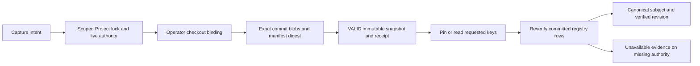

# W5: prove keys against the bound commit

## Authority and scope

Root adjudication under the owner's approved Phase B plan24 and ADR-097.
This makes the selected server-local verifier executable: six records and
14 operations remain unchanged. It adds no model, persisted proof field,
public registration endpoint or grant. W5 remains NOT_RUN until implementation
and independent verification pass. Earlier W1/W2 proofs remain local evidence
for commit 052821a7, not proof of this verifier.

The peer review found undefined manifest bytes, key extraction and checkout
registration. The resolutions below use the approved operator-bound checkout,
read-only canonical subject and explicit unavailable-evidence behavior.

## 1. Exact manifest bytes

The producer supports SourceManifest schemaVersion "1.0.0". Keep the selected
strict shape, 1 MiB request-manifest limit and at most 1,000 entries. Reject
duplicate paths, absolute/drive paths, backslashes, NUL, parent traversal and
noncanonical POSIX spellings, including empty segments and "." segments.

Each entry names a regular file blob at exactly the requested commit, and its
sha256 hashes those raw Git object bytes. Symlinks and submodules are refused.
Do not use working-tree bytes, clean/smudge filters or network fetch.

Sort entries by exact path using ordinal comparison (not locale collation).
Serialize UTF-8 JSON without whitespace or a trailing newline, with keys in
this order: top-level schemaVersion, entries; entry path, sha256. Hash the
serialized bytes with SHA-256, lower-case hex. Input entry order has no
authority. The caller's manifestHash must equal the recomputed value.

Only normalized verifier output is persisted. Supported inputs remain within
the existing SourceManifest schema; an unsupported producer version receives
the existing typed verification refusal.

## 2. Installation operator checkout configuration

The process-only environment variable ZURI_PM_CHECKOUT_REGISTRY_PATH points to
an absolute, operator-maintained UTF-8 JSON file:

```json
{
  "schemaVersion": "1.0.0",
  "bindings": [
    {
      "checkoutBindingId": "operator-assigned-opaque-id",
      "repositoryId": "internal-repository-uuid",
      "absoluteCheckoutRoot": "absolute-operator-controlled-git-worktree"
    }
  ]
}
```

All objects are strict. The registry has at most 200 entries, unique binding
IDs, and exactly one eligible binding for the requested Repository. Missing,
malformed or ambiguous configuration refuses. Neither capture intent nor a
Business owner request can register, replace or select a filesystem root.
Configuration is an installation operation using existing deployment control;
there is no product registration UI in Phase B.

Resolve the real checkout root, verify it is the Git top-level directory,
and inspect the exact 40/64-character lower-case commit hash with fixed Git
arguments and shell disabled. Reject non-commit objects and path aliases.
Do not execute repository hooks, scripts or external diff/filter drivers.
Bound subprocess duration/output: at most 5 seconds per command, 20 seconds
per verification, 8 MiB per blob and 32 MiB total inspected blob bytes.
Exceeding a bound returns unavailable/refusal, never partial VALID evidence.

Do not persist or return the absolute root. Snapshot proof retains only the
selected opaque checkoutBindingId. Changing configuration does not rewrite
any historical snapshot; the exact historic binding must still resolve when
its key evidence is re-verified.

## 3. Project and Repository binding

Within the existing W2 scoped transaction, lock and reprove Project -> Workspace
-> Business -> Tenant before child reads, mutation or receipt replay. Require
one active same-Business Repository and exactly one active ProjectRepository
link matching this Project and Repository. Multiple role rows are ambiguous
and refuse; no implicit PRIMARY-role restriction or arbitrary first-row choice
is introduced. The persisted proof and snapshot must match all these IDs.

Capture proves every manifest blob and persists only VALID typed proof using
the existing fields. A failed capture writes no snapshot, receipt or audit.
Use verifierId "zuri.git-registry" and verifierVersion "1.0.0". Receipt,
scope, CSRF and idempotency contracts remain plan24's.

## 4. Canonical Feature and requirement evidence

The first producer implements the existing ZAI namespace. Unknown namespaces
are unverified and unavailable; they never inherit ZAI authority.
Read docs/PRD-SDD-v1.0.md and docs/FEATURES.md from the same bound commit,
require both paths in the verified manifest and verify their exact blob hashes.
Generated graphs and the ID ledger are witnesses, not source authority.

Reuse the repository's escaped-pipe table grammar. A requirement resolves one
FR-xxx row and its full statement. revisionHash is the existing statementDigest
algorithm: canonicalStatement strips presentation markdown/link chrome,
collapses whitespace and trims, then SHA-256 hashes UTF-8 bytes. Wording and
punctuation remain significant. The leading subject anchor is not this hash.
For display, canonicalSubject is canonicalStatement of that complete source
cell, preserving wording, punctuation and case. The ledger's lowercased,
60-character subject anchor is not display text and cannot substitute for it.

An explicit FEAT-xxx key resolves its single FEATURES registry row and may bind
only FR keys listed in that row. An FR absent from all explicit bundles is an
implicit feature-of-one and may bind only the same FR key. Reject duplicate
IDs, ambiguous bundle membership or malformed relevant rows. A key present in
today's working tree but absent from the bound commit is unverified.

Do not extend the persisted verificationProof with invented extraction fields.
At pin time, reverify the requested key, namespace, revision and membership
through this shared read-only evidence port. At read time, derive
canonicalSubject from that same source. Missing checkout, stale binding,
malformed proof or unavailable objects yield canonicalSubject null and
UNAVAILABLE evidence; metadata alone never proves the requested key.
Historical stored key/hash/IDs remain unchanged and visible under existing
scope rules. Cache only within one operation, keyed by the complete binding,
commit, manifest hash and requested key tuple.



## 5. Acceptance and exit gate

- Raw Git fixtures: dirty checkout does not alter proof; wrong commit, blob,
  manifest digest, path, duplicate, symlink or object type refuses.
- Registry fixtures: explicit bundle and implicit feature-of-one succeed;
  formatting-only statement changes retain the digest, wording changes alter it.
  Missing keys, duplicate rows, namespace or membership mismatches refuse.
- Operator binding: missing/ambiguous registry or active ProjectRepository,
  foreign Repository and changed historic binding refuse without root disclosure.
- Transaction: scope and CSRF precede capture; rejected intent creates no
  snapshot/receipt/audit; replay occurs only after fresh locked authorization.
- Read: unavailable checkout returns null subject/unavailable evidence with
  preserved IDs; re-verification cannot fabricate canonical source text.
- Independent Luna Max review, runtime schemas/OpenAPI agreement and root
  composed tests/build/browser/governance must pass before delivery claims.

## CHANGELOG

| Version | Date | Status | Summary | Commit Hash | Agent |
|---|---|---|---|---|---|
| 0.1.1b | 2026-09-17 | beta | Clarify that canonicalSubject displays the full canonical source cell rather than the ledger's normalized subject anchor | 052821a7 | RWANG |
| 0.1.0b | 2026-09-17 | beta | Make approved bound-commit provenance executable within the selected six-record contract; implementation NOT_RUN | 052821a7 | RWANG |
