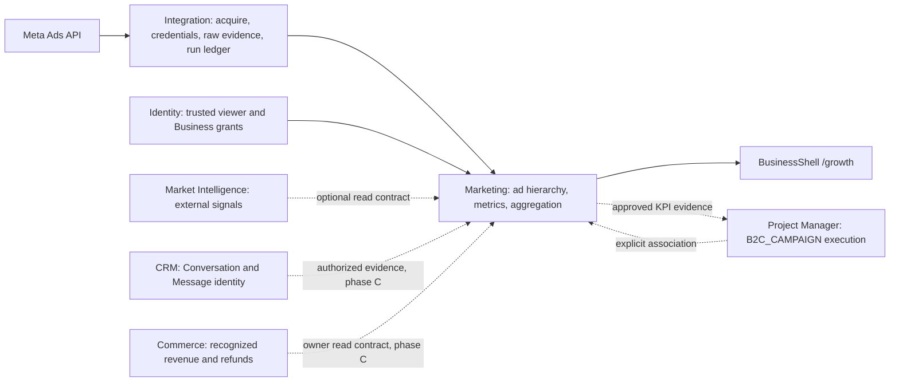
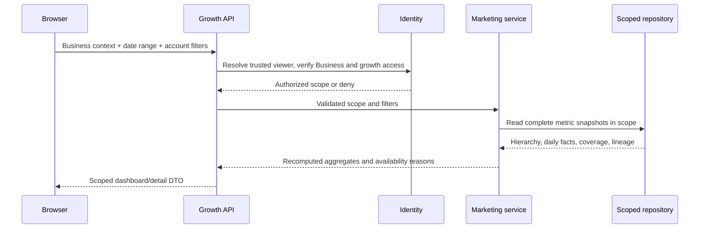

# CR-017 — Marketing / Ads Analytics สำหรับ zuri-ai

| Field | Value |
|---|---|
| **Version** | 0.1.0b |
| **Status** | Candidate — รอ Boss อนุมัติเอกสารก่อน implementation |
| Complexity | C-3 — Doc → Diagram → Code |
| Risk | HIGH สำหรับ implementation: schema, authorization และ cross-domain attribution; รอบนี้แก้เอกสารเท่านั้น |
| Product identity | `DOM-MARKETING`; route/RBAC key `growth`; UI label Marketing |
| Baseline | zuri-ai commit `e8aec6c45aac19337ee153dd5e5d72c9b31e1ee4` |

## 1. เป้าหมายและขอบเขตการอนุมัติ

ให้ผู้รับผิดชอบ Marketing เปิด Business ของตัวเองแล้วเห็นว่าโฆษณาใดใช้งบเท่าไร
ได้ผลอย่างไร และตัวเลขมาจากข้อมูลช่วงไหน พร้อมเจาะจาก Campaign ลงถึง Ad ได้
ใช้แนวคิดจากต้นทางเป็น prior art แล้วเขียนเป็น capability ของ zuri-ai ตาม
[ADR-024](../decisions/ADR-024-ZURI-AI-IS-A-STANDALONE-PRODUCT.md) D7 และแนวทาง
[ADR-054](../decisions/ADR-054-LEGACY-ERD-IS-PRIOR-ART-FOR-CRM-INTELLIGENCE.md) D3–D5

[ASSUMPTIONS]

1. คำขอหมายถึง Marketing / Ads Analytics ตามไฟล์ที่ให้มา ไม่ใช่ CRM ใหม่หรือ marketing automation ทั้งชุด
2. คง `DOM-MARKETING`, key `growth` และ BusinessShell ของเรา; เริ่มจาก Meta เป็น provider แรกตามต้นทาง
3. ออกแบบครอบคลุมต้นทาง แต่ส่งมอบเป็นระยะ: daily analytics → provider acquisition/advanced breakdown → attribution เมื่อ dependency พร้อม
4. รอบนี้ส่งข้อเสนอให้ตรวจ; ไม่ประกาศ global requirement ใหม่ ไม่แก้ source/schema และไม่เปิด live sync

การอนุมัติเอกสารนี้รับรองทิศทางและลำดับงาน ก่อน code ต้องนำรายละเอียดของระยะที่จะทำ
เข้าสู่ ADR/FR/SDD/SEC/FEAT ของเราและผ่าน documentation gate ตาม §10
การเปิดใช้ provider จริงหรือการเปลี่ยนฐานข้อมูล production ต้องมี readiness evidence ของระยะนั้น

## 2. ต้นทางและหลักฐานที่ตรวจแล้ว

อ่านผ่าน authenticated GitHub API เมื่อ 2026-09-06 และตรวจว่าไฟล์บน commit ที่ตรึงมี blob ตรงกัน:

- Repository: `Freshair129/zuri1.0`
- Commit: `76eb6afef9719074eb3a3481b6ee390f087f5456`
- File: [marketing.md ณ commit ที่ตรวจ](https://github.com/Freshair129/zuri1.0/blob/76eb6afef9719074eb3a3481b6ee390f087f5456/docs/architecture/data-flows/marketing.md)
- Blob: `8fc72d40e6cc1a73664da7f5b3f2f1c8fa769249`

ต้นทางบรรยาย Dashboard, Campaign detail, first-touch revenue attribution,
hourly acquisition, daily/hourly insights, demographics, placements และ cache invalidation
การสำรวจนี้ยืนยัน **เนื้อหาเอกสาร** ไม่ได้ยืนยันว่าโค้ดต้นทางทำงานตามเอกสาร
ข้อจำกัด Meta เช่น 60 วัน/Error 99 เป็นคำกล่าวของ snapshot ต้นทาง ต้องตรวจ official API
และสิทธิ์ account รุ่นที่จะใช้ก่อนพัฒนา adapter ไม่ตั้งเป็นกฎถาวรของ product
หมายเลข ADR ในต้นทางไม่มีอำนาจเหนือ ADR หมายเลขเดียวกันของเรา

สำรวจด้วย `git ls-files`, รายการ directory และ `model` ทั้งหมดใน schema ก่อนสรุปสถานะ:

| สิ่งที่เรามีแล้ว | หลักฐาน / ผลต่อการออกแบบ |
|---|---|
| Marketing slot ยัง `soon: true` | `src/config/domains.js` มี `/growth` และ `/growth/campaigns`; ไม่มี directory route `/growth` หรือ module `marketing` ใน baseline ที่ enumerate |
| Stable domain และ execution binding | FR-070 / SDD-040: `DOM-MARKETING` ใช้ `growth`; `B2C_CAMPAIGN` มี Marketing primary + CRM supporting |
| Campaign execution contract | [FR-069](../domains/project-manager/features/FR-069-plan-blueprint-and-intake.md): WorkContainer/WorkItem และ `KPI_ATTAINMENT` |
| CRM conversations และ analysis | [CRM charter](../domains/crm/CHARTER.md); `Conversation` มี `tenantId`, nullable `businessId`; ไม่มี `firstTouchAdId` |
| Raw ingestion / secret references / run ledger | [Integration charter](../domains/integration/CHARTER.md), FR-080/081; ขยายของเดิมผ่าน owner contracts |
| Schema ยังไม่มี Ad, AdSet, AdCampaign หรือ Order | enumerate `prisma/schema.prisma`; จึงยังใช้ revenue join ของต้นทางไม่ได้ |
| Per-Business domain permissions | `src/modules/identity/viewer-domains.js`; การเห็นเมนูไม่แทน server-side authorization |
| Current runtime | [ADR-058](../decisions/ADR-058-DOCKER-COMPOSE-AND-NGROK-REPLACE-VERCEL.md): Docker Compose; production Postgres; SQLite สำหรับ local/test ผ่าน repository abstraction |

`PRODUCT.md` และบางส่วนของ sitemap ยังมีข้อความโครงการ lift/cutover ที่ ADR-024 ยกเลิกแล้ว
ใช้ ADR-024 เป็น authority; เก็บการแก้เอกสารเก่าเป็น out-of-scope finding ไม่ขยายงานนี้ไป rewrite ทั้งชุด

## 3. สิ่งที่รับมาและสิ่งที่ปรับ

| แนวคิดต้นทาง | รูปแบบของ zuri-ai | ระยะ |
|---|---|---|
| Marketing dashboard + campaign detail | `/growth` และ `/growth/campaigns/[adCampaignId]` ใน BusinessShell เดิม | A |
| Campaign → AdSet → Ad | Marketing-owned `AdCampaign → AdSet → Ad`; internal UUID + human code; provider ids เป็น ExternalEntityRef | A |
| Ad daily metrics; bottom-up roll-up | Daily facts มี source lineage, account timezone/currency และ measurement window; aggregate จาก grain เดียว | A |
| Tenant จาก `x-tenant-id` | Resolve viewer/session แล้วตรวจ Business + `growth` ฝั่ง server; derive tenant จาก Business ที่ผ่าน authorization | A |
| PostgreSQL ผ่าน campaignRepo | Repository interface ตามระบบเรา; local/test SQLite และ production Postgres ตาม runtime ปัจจุบัน | A |
| Redis TTL/cache | เริ่มอ่าน database โดยตรง; cache เพิ่มเมื่อมี performance evidence และ key ครบ scope/filter/window/version | A |
| QStash worker + token ใน config | Integration acquisition contract + existing run ledger + vault reference; runtime/scheduler ใน deployment ของเรา | B |
| Demographic/placement/hourly metrics | Separate breakdown datasets; capability-aware adapter; แจ้ง unsupported/partial อย่างตรงไปตรงมา | B |
| First-touch บน Conversation + Order sum | Marketing-owned attribution evidence ผูก CRM UUID ผ่าน owner contract; revenue ผ่าน Commerce contract เมื่อพร้อม | C |
| MKT/MGR/DEV roles ของต้นทาง | ใช้ viewer/Business membership ของเรา; ไม่มี role import หรือ bypass ด้วยชื่อ DEV | ทุกระยะ |

ไม่รวมการสร้าง/แก้ budget/เปิดปิดโฆษณาบน Meta, auto-optimization, Broadcast,
audience upload, cross-channel customer merge, live realtime push หรือ migration ข้อมูลจาก legacy

## 4. Ownership และ context map



- **Marketing** เป็นเจ้าของ ad hierarchy, metric facts, analytics projection และ attribution evidence
- **Integration** เป็น single writer ของ raw acquisition, mapping, credential metadata, cursor/dead letter และ run ledger; Marketing ไม่สร้างอีกชุด
- **CRM** คงเป็น single writer ของ Conversation/Message และ consent; Marketing ไม่เพิ่ม write path เข้า CRM
- **Commerce** เป็น authority ของ order, recognized revenue และ refunds; Marketing ไม่สร้าง Order table ทดแทน
- **Project Manager** คงเป็นเจ้าของ Workstream, WorkContainer, WorkItem และ progress; Marketing ไม่สร้าง task engine ใหม่
- **Market Intelligence** คงเป็นเจ้าของ market/competitor signals ตาม [context map](../domains/market-intelligence/CONTEXT-MAP.md)
- **Agent** เรียก application contract ภายใต้ viewer เดียวกับคน; KPI ที่ AI เสนอผ่าน preview/approval ตาม BR-007

ชื่อ Campaign สองบริบทต้องไม่ชนกัน: `AdCampaign.id` คือโฆษณาบน provider;
`campaignId` ใน FR-070 ยังคง alias ของ `WorkContainer.id` เสมอ
UI ต้องใช้ `adCampaignId` สำหรับ provider campaign และมีลิงก์ไป execution plan อย่างชัดเจน
การเชื่อมไม่บังคับให้ทุก ad campaign ต้องมี Project; ถ้าเชื่อม ต้องอยู่ Business เดียวกัน
ไม่เพิ่ม execution mode ที่แปด

## 5. Data contract ที่เสนอ

ชื่อด้านล่างเป็น candidate concepts ยังไม่ใช่ model declaration หรือชื่อ API ที่อนุมัติแล้ว

| Concept | Identity / grain | ข้อมูลและเงื่อนไขสำคัญ |
|---|---|---|
| AdCampaign | internal UUID + code, scoped Business | connection/account reference, name, provider status/objective; optional PM association |
| AdSet | internal UUID + parent AdCampaign UUID | parent ต้องอยู่ connection/account/Business เดียวกัน |
| Ad | internal UUID + parent AdSet UUID | provider id mapping ผ่าน Integration; ห้ามใช้ Meta ad id เป็น FK |
| AdDailyMetric | Ad UUID + account-local date + metric-definition version | spend, impressions, clicks, reported leads/conversions เมื่อมี; currency, timezone, completeness, source observation/version |
| Advanced metrics | Ad UUID + time grain + breakdown dimensions + definition version | แยก hourly, demographic และ placement จาก daily facts ไม่ union แล้ว sum |
| AdAttribution | trusted scope + Conversation UUID + policy version | first qualifying inbound Message UUID, Ad UUID, source evidence, event time; ไม่เก็บข้อความ/PII ซ้ำ |

Mutable aggregates มี `createdAt`, `updatedAt`, `version` และ `deletedAt` เมื่อ applicable
แต่ละ child สืบทอด scope ผ่าน parent ที่ resolve แล้ว; หลีกเลี่ยงสำเนา scope ที่ขัดกัน
operation ที่เปลี่ยน business state มี immutable AuditEvent พร้อม actor, target, scope และ source reference
audit ไม่ใส่ tokens, raw message หรือ customer profile

Metric rules:

1. Filter/window ใช้ account timezone; API ระบุช่วงเวลา `[from, to)` พร้อม display date range ที่ตรงกัน
2. Money ใช้ decimal/minor-unit contract ที่กำหนด scale ชัดเจน; ห้ามใช้ floating-point รวมเงิน
3. รวม spend/impressions/clicks จาก **ad daily facts เท่านั้น**; ไม่บวก campaign/adset aggregates ซ้ำ
4. CTR = total clicks / total impressions; CPC = total spend / total clicks; CPM = total spend × 1000 / total impressions
5. CPL = spend / leads เฉพาะเมื่อมี source และนิยาม leads เดียวกัน; provider-reported leads ไม่ใช่จำนวน CRM Customer
6. Ratio คำนวณใหม่จาก totals ไม่ average ratios; denominator = 0 แสดง unavailable
7. ห้าม sum unique reach หรือ demographic totals เป็น overall totals; read provider aggregate ที่ grain ตรงกันหรือแสดง unavailable
8. Currency ต่างกันต้องแยกผล; ไม่รวมเป็นเงินเดียวโดยไม่มี approved FX conversion policy
9. `missing`, `partial`, `unsupported`, `stale` แยกจาก observed zero; แสดง last successful data time, covered window และ failed run ล่าสุด
10. Provider-reported conversion value/ROAS ต้องติดป้าย provider attribution; ห้ามแสดงเป็น CRM/Commerce-confirmed revenue

## 6. Data flows ของเรา

### 6.1 Dashboard / detail read



Candidate read endpoints: `GET /api/growth/dashboard`, `GET /api/growth/campaigns`,
`GET /api/growth/campaigns/[adCampaignId]` ใช้ route registry/annotations ของเราเมื่อ implement
ไม่มี call ไป Meta ใน UI read route; refresh หน้าจอคืออ่านข้อมูลที่บันทึกแล้ว
ถ้าเพิ่ม cache ภายหลัง key ต้องรวม tenant, Business, effective visibility, account, currency,
timezone, date range, filters, attribution version และ published data version
ไม่มี wildcard `DEL` ที่ถูกถือว่า Redis จะลบตาม pattern ให้อัตโนมัติ

### 6.2 Acquisition / translation / replay

```mermaid
sequenceDiagram
    participant O as Authorized operator or scoped scheduler
    participant I as Integration
    participant P as Meta adapter
    participant M as Marketing translator
    participant R as Marketing repository
    O->>I: Start scoped acquisition run
    I->>I: Validate connection authority, resolve vault reference, acquire fenced lease
    I->>P: Request permitted account and time window
    P-->>I: Pages, source metadata, rate-limit/capability state
    I->>I: Persist raw evidence and run progress
    I->>M: Eligible raw references within trusted scope
    M->>M: Validate parent mappings, grain, currency, timezone
    M->>R: Transactional versioned upsert for a complete partition
    R-->>M: Created / corrected / unchanged counts
    M-->>I: Receipt; complete or partial; rejected references
    I-->>O: Run status, coverage and failure reason
```

Phase A พิสูจน์ ingestion seam ด้วย controlled fixture/import ที่ผ่าน Integration contract เดิม
ก่อน live provider ใน Phase B; ห้ามสร้าง Marketing raw-import path อีกเส้น
external acquisition เป็นการอ่าน provider ไม่ใช่ network sync ของ local relational database
รูปแบบ execute/schedule ของ Phase B ต้องระบุใน ADR ของระยะนั้นให้ตรง Docker Compose
ไม่ติดตั้ง QStash, Redis หรือ worker service จากแผนนี้โดยปริยาย

Replay ต้อง idempotent ที่ natural grain ข้างต้น; insight correction แทนค่าของ snapshot เดิม
พร้อม source version ไม่ append แล้วบวกซ้ำ; pagination ต้องครบก่อน publish partition
partial/failure คง last good snapshot และแสดง coverage gap; cursor ไม่ข้ามหน้าที่ล้มเหลว
concurrent runs ใช้ atomic scoped lease พร้อม owner/fencing token; TTL อย่างเดียวไม่พิสูจน์ mutual exclusion
stale lease holder ต้อง publish ไม่ได้; retry ตาม error class/backoff และ provider rate limits
Refresh metrics ต้อง request acquisition จริง; cache clear ไม่ถือว่าดึงข้อมูลล่าสุดจาก provider

### 6.3 Attribution / revenue (Phase C)

First-touch หมายถึง **first qualifying inbound message event** ที่มี ad evidence และผูกกับ
Ad UUID ใน account/Business เดียวกัน ไม่ใช่ ad ที่ worker พบก่อน หรือ ad ที่ยัง active ในวันนี้
candidate ต้อง resolve ผ่าน CRM-owned read contract และเก็บ attribution แบบ insert-once
replay event เดิมไม่สร้างซ้ำ; late event ที่ขัดกับ attribution เดิมไป review ไม่ overwrite เงียบ
late evidence เติมได้เฉพาะเมื่อพิสูจน์ว่าเป็น qualifying first event และยังไม่มี committed attribution
ถ้า CRM conversation เป็น tenant-shared (`businessId = null`) และไม่มี evidence ที่ผูก Business
โดย owner contract ให้ unresolved; ห้ามเดา Business จาก Customer/phone/name

Revenue phase ต้องมี Commerce-owned contract ระบุ conversion/order UUID, Business,
Conversation association, recognized amount/time, currency, cancellation/refund และ revision
คำนวณจาก unique conversion UUID และ attribution policy เดียว; refunds/corrections คำนวณใหม่
ไม่ join daily metrics กับหลาย Order จน spend หรือ revenue ถูกคูณตามจำนวนแถว
ROAS = recognized attributed revenue / spend ภายใต้ currency/window/policy เดียวกัน
ถ้าขาด contract หรือ evidence แสดง unavailable พร้อมเหตุผล; ไม่เติมรายได้เป็น 0
advertiser-reported ROAS ถ้ามีแสดงคนละชื่อกับผลที่ยืนยันด้วย Commerce
customer erasure/consent withdrawal ต้องส่งผ่าน CRM/Identity owner workflow ไปยัง attribution
และคำนวณ derived aggregates ใหม่; Marketing read ไม่เปิด Conversation payload แก่ผู้มีเพียง `growth`

## 7. Information architecture / wireframe

```text
BusinessShell: [Business ที่ได้รับสิทธิ์] > Marketing
Sidebar: Dashboard | Campaigns

Dashboard /growth
  [Date range] [Ad account] [Currency / Account timezone]
  Data through: ...    Coverage: ...    Last acquisition: success/partial/failed
  [Spend] [Impressions] [Clicks] [CTR] [CPC] [CPL: available/unavailable]
  Daily trend: spend + selected outcome
  Campaign table: Name | Status | Spend | Clicks | Leads | Coverage
  Revenue / ROAS: unavailable — ยังไม่มีข้อมูลยืนยันจาก Commerce (ก่อน Phase C)

Campaigns /growth/campaigns
  [Search] [Status]  Campaign list > Campaign detail
  Detail: summary + AdSets > Ads + daily trend
  Phase B tabs: Hourly | Demographics | Placements (แสดง capability/coverage)
  [Linked execution plan] ถ้ามี association ที่อนุญาต
```

ใช้ Zuri Heritage tokens, IBM Plex Sans Thai/Manrope และ lucide-react ตาม AGENTS.md
คง Business selector เดิม; ไม่สร้าง tenant picker หรือ template picker ใหม่
empty state บอกว่ายังไม่มี metric snapshots และชี้ไป Integration setup ตามสิทธิ์
provider error ไม่ทำให้ข้อมูลเก่าดูเหมือนสด; missing breakdown ไม่กลายเป็นกราฟศูนย์
ซ่อน/disable สิ่งที่ยังไม่ส่งมอบโดยระบุ availability ไม่อ้างว่า navigation เท่ากับ functional feature

## 8. Authorization / dependency impact

| Boundary | Required behavior / change |
|---|---|
| Identity | Read ต้องผ่าน Business visibility + `growth` grant ฝั่ง server ทุก route/service; owner ของ Business อื่นไม่มีสิทธิ์ข้ามมา |
| Integration | จัดการ connection/acquisition ต้องมี Integration authority ตาม owner contract แยกจากสิทธิ์อ่าน Marketing; ไม่เผย credential ผ่าน DTO/log |
| Marketing | เขียนเฉพาะ owned models; parent/account/raw reference ข้าม Business/tenant ถูกปฏิเสธก่อน write |
| CRM | Phase A/B ไม่แก้ Conversation; Phase C เพิ่ม owner-resolved evidence contract และ erasure participation ก่อน attribution writer |
| Commerce | เป็น dependency ของ confirmed revenue; ไม่เริ่ม Phase C โดยใช้ Order สมมติ |
| Project Manager | ใช้ explicit same-Business association; metric import เป็นหลักฐานที่ preview/confirm แล้ว ไม่ auto-complete WorkItem |
| Deployment | Local tests และ production adapter มี verification แยกกัน; ไม่อ้างว่าผ่าน SQLite เท่ากับพร้อม production Postgres |

## 9. Acceptance criteria และหลักฐานก่อนส่งมอบ

เลขข้อเป็น acceptance clauses ของข้อเสนอ ไม่ใช่ global requirement IDs

1. ผู้มีสิทธิ์อ่าน Marketing ของ Business A ดู dashboard/list/detail ได้; Business B ใน tenant เดียวกันและต่าง tenant ถูกปฏิเสธ รวมถึงกรณี forged header, guessed UUID และ owner-elsewhere
2. Daily fixtures ที่มี 2 ads, หลายวัน, duplicate delivery และ revised insight ให้ totals ตรง expected values; re-run ไม่เพิ่ม count/spend
3. Roll-up, CTR/CPC/CPM/CPL ผ่านกรณี denominator 0, missing data, mixed currencies, date boundary/timezone และ non-additive reach
4. Campaign/AdSet/Ad parent mapping ข้าม account/scope ไม่เขียนข้อมูล; invalid item ไม่ทำให้ incomplete partition กลายเป็น complete
5. Provider timeout/rate limit/pagination failure และ overlapping runs ไม่ทำให้เกิด duplicate publication, cursor skip หรือ false freshness
6. Browser ทดสอบ Business switch, filters, campaign drill-down, empty/partial/unavailable states; real persisted fixtures survive reload
7. Phase C: first-touch insert-once, replay, late conflict, inactive historic ad, tenant-shared ambiguity, multiple orders, refund, wrong currency และ erasure ให้ผลตรง policy; ขาด Commerce contract ต้อง unavailable
8. Meaningful writes มี AuditEvent ที่ตรวจ actor/scope/source ได้; tokens/PII ไม่ปรากฏใน response/log/audit
9. Phase report แยก local tests/build/govern/e2e, production Postgres migration/adapter และ live provider evidence; ไม่มี phase ถูกปิดด้วย mock-only claim

ใช้ `tests/factories/viewer.js` สร้าง viewer fixtures เสมอ
แต่ละระยะ implement ต้องผ่าน `npm run verify` (test → build → govern → e2e),
ทดสอบที่เจาะเงื่อนไขข้างต้น และผ่าน architecture review ของ owner contracts
หาก verification ใดไม่ได้รัน ให้ระบุ pending ไม่ถือว่า green

## 10. Delivery และ documentation diff หลังอนุมัติ

| ระยะ | Deliverable | Exit / dependency |
|---|---|---|
| Documentation gate | แปลง accepted clauses เป็น global FR/SDD/SEC + FEAT bundle; ADR ระบุ Marketing ownership และการเริ่ม charter; feature note/context map/roadmap | ตรวจ ledger ล่าสุด, ไม่ชน ID เดิม, `docs:ids -- --write` ผ่าน + `npm run govern`; review เอกสารก่อน code |
| A — Daily analytics foundation | Scoped ad hierarchy, daily snapshot repository/translator, read APIs, dashboard/campaign detail และ controlled ingestion evidence | AC 1–4, 6, 8–9; full local verification; อ่านข้อมูล persistent ได้จริง; revenue unavailable อย่างชัดเจน |
| B — Meta acquisition and breakdowns | Provider adapter, credential/runtime/schedule contract, pagination/retry/replay, hourly/demographic/placement data | AC 5 และ provider-specific fixtures; official API/version/permissions verified; live account smoke evidence ก่อนเปิดใช้งาน |
| C — First-touch and confirmed revenue | CRM evidence contract + Marketing attribution + Commerce revenue/refund read contract | Dependency ทั้งสองพร้อม, attribution/privacy policy approved, AC 7; revenue/ROAS reconciliation ผ่าน |

ระยะ A ไม่ต้องรอ Commerce; ระยะ C ยัง blocked by dependency ตาม baseline
ไม่กำหนดสัญญาส่ง hourly sync จนกว่าจะทราบ rate limit, account capability และ runtime ที่จะใช้จริง

ไฟล์ที่คาดว่าจะเปลี่ยนเมื่อผ่าน gate (ยังไม่เปลี่ยนในข้อเสนอนี้):

- `docs/PRD-SDD-v1.0.md`, `docs/FEATURES.md` และ `docs/.id-ledger.json` ผ่าน tooling ตาม ID contract
- ADR ใหม่ใน `docs/decisions/` สำหรับ native Marketing; ไม่เปลี่ยนความหมาย ADR-054 ซึ่งอนุมัติเฉพาะ CRM
- `docs/domains/marketing/CHARTER.md` + context map/feature notes เมื่อ approved lane เริ่มตาม ADR-025;
  frontmatter claim เฉพาะ models ที่มีจริงใน implementation slice
- `docs/SITEMAP-DOMAIN-NAV.md`, `docs/ROUTES-SITEMAP.md` และ appendices A/B ตาม routes/models ที่ประกาศ
- Phase plan ใน `docs/roadmap/`; generated graph/maps/trace/preflight ผ่าน `npm run govern` เท่านั้น
- Code/schema/tests อยู่ใน implementation worktree ถัดไป; production migration มี readiness/rollback review แยก

## 11. Review record / version diff

| Before | Candidate 0.1.0b |
|---|---|
| Marketing เป็น reserved slot; ไม่มี native Ads Analytics proposal ใน intake inventory ที่ตรวจ | เพิ่มข้อเสนอนี้หนึ่งไฟล์ พร้อม pinned provenance, scope, owner map, flows, wireframe, metrics และ acceptance criteria |
| Marketing bundle deferred ใน ADR-054 | เสนอ A/B/C พร้อม dependency; ไม่แก้สถานะของ ADR-054 หรืออ้างว่า bundle implemented |
| ไม่มีการอนุมัติ implementation ในงานนี้ | รอ Boss ตรวจเอกสารก่อนเริ่ม code ตาม R5 |

**Review request:** Please review and approve this documentation. I will generate the code once approved.

### Documentation verification — 2026-09-06

- Baseline และ candidate ผ่าน `npm run govern`: graph/check/strict preflight, 0 critical, 0 warning
- Candidate ปรากฏเป็น document node ใน graph; ไม่มี FR/model/route declaration ใหม่
- ตรวจ diff ว่ามีเฉพาะข้อเสนอนี้และ generated documentation artifacts; ไม่มี source/schema/test change
- ไม่ได้รัน application tests/build/e2e หรือ provider smoke test ใน docs-only lane นี้;
  acceptance criteria ของ implementation ยัง pending ทั้งหมด

## CHANGELOG

| Version | Date | Status | Summary | Commit Hash | Agent |
|---|---|---|---|---|---|
| 0.1.0b | 2026-09-06 | candidate | Initial native Marketing / Ads Analytics proposal from pinned legacy data-flow prior art; includes ownership, UI, data contracts, phased scope and verification gates | See git history; baseline e8aec6c | RWANG |
