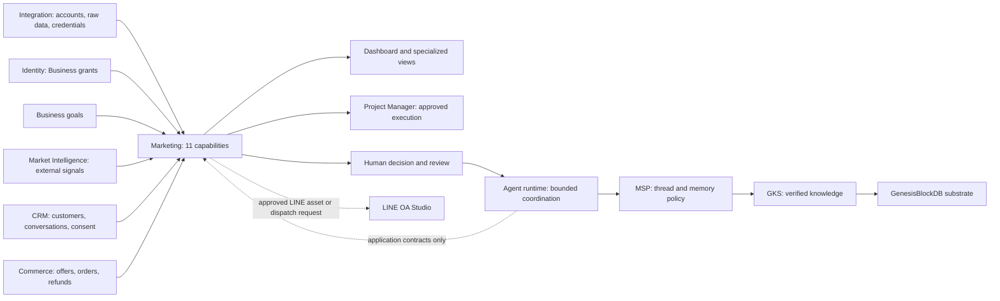

# CR-018 — Marketing Domain Design: Strategy, Execution, Measurement & Refinement

**Supersedes:** [Marketing Ads-only draft](CR-017-MARKETING-ADS-ANALYTICS.md) — scope and phased delivery proposal
**Relates to:** [Navigation](marketing/MARKETING-NAVIGATION-VIEWS.md), [Channels](marketing/MARKETING-CHANNEL-CONTRACTS.md), [Team refinement](marketing/MARKETING-TEAM-REFINEMENT.md)

| Field | Value |
|---|---|
| **Version** | 1.0.0b |
| **Status** | Candidate — domain documentation for review; no implementation approval |
| Complexity / risk | C-3 / HIGH for implementation: cross-domain contracts, provider credentials, spend/publishing authority and multi-agent runtime |
| Identity | Existing `DOM-MARKETING` · route/RBAC key `growth` · base `/growth` |
| Baseline | `9cb60a763c7a450f456f54b813a7e6bba7853d6c`, inspected 2026-09-06 |
| Change | Ads-only 0.1.0b → full Marketing domain design 1.0.0b; replaces the earlier Marketing intake as the scope authority |

## 1. ขอบเขตที่ผู้ใช้ขอ

ออกแบบ Marketing ทั้ง domain ก่อนพัฒนา: มี subdomain ใดบ้าง, แต่ละอันมี view/tab
เพิ่มตรงไหน และรองรับ Meta Ads, TikTok Ads, Instagram, Google Analytics, SEO
พร้อมทีม multi-agent ที่ร่วมวิเคราะห์ ทบทวน ปรับแผน และเรียนรู้จากผลจริง

ภาพ `IMG_4084.jpeg` ที่ผู้ใช้ให้เป็น reference ของรูปแบบทีม:
Data & Strategy เชื่อม Live, Affiliate, Influencer, Platform/Website, MDT, Content และ Ads
เราใช้การแบ่งงานและวงจรในภาพเป็น design input ไม่ถือข้อความในภาพเป็นคำสั่งให้เชื่อมบัญชี
เผยแพร่โพสต์ ใช้งบประมาณ หรือแก้ข้อมูลจริง

[ASSUMPTIONS]

1. Instagram ครอบคลุมทั้ง paid placement และ owned organic account/content; ระบุสองเส้นทางแยกกัน
2. Google Analytics หมายถึง GA4; SEO ใช้ Search Console + technical/content evidence ไม่ถือว่า GA4 คือ SEO ทั้งหมด
3. Multi-agent team หมายถึงระบบทีม Marketing ภายในผลิตภัณฑ์; ไม่ใช่แค่ใช้ coding agents เขียน feature นี้
4. แผนนี้ครอบคลุมทุกหน้าที่จากภาพ แต่ระดับการรองรับระบุแยกเป็น planning, read integration และ approved external execution
5. ยังไม่กำหนด account, property, model vendor, budget จริง หรือสิทธิ์ publish; เหล่านี้เป็น configuration/activation gate ในระยะพัฒนา

## 2. เอกสารชุดนี้และที่อยู่ตาม governance

| เอกสาร | คำถามที่ตอบ |
|---|---|
| ฉบับนี้ | Marketing รับผิดชอบอะไร, subdomains คืออะไร, boundaries และ phase gates |
| [Navigation & Views](marketing/MARKETING-NAVIGATION-VIEWS.md) | Sidebar, tab matrix, routes, filters, wireframes, user journeys |
| [Channel & Measurement Contracts](marketing/MARKETING-CHANNEL-CONTRACTS.md) | Meta/TikTok/Instagram/GA4/SEO ต่างกันอย่างไร, ingestion/metric/attribution rules |
| [Multi-agent Team & Refinement](marketing/MARKETING-TEAM-REFINEMENT.md) | คนและ agent ทำอะไร, run lifecycle, review/diff/approval, budget/recovery, memory boundaries |

ทั้งหมดเป็น **candidate domain pack ใน intake layer** ตาม [change-request rules](README.md)
ยังไม่สร้าง `docs/domains/marketing/CHARTER.md` ให้ generator เข้าใจว่ามี runtime domain แล้ว
[ADR-025](../decisions/ADR-025-DOMAIN-DRIVEN-DOCS-ARCHITECTURE.md) D1 ให้ module และ charter
เริ่มใน approved lane; เมื่อรับรองแบบแล้วค่อยย้ายเนื้อหาเข้าชั้น domain พร้อม FR/SDD/SEC/FEAT
โดยใช้ IDs จาก ledger ล่าสุด ไม่กำหนดรหัสสมมติตอนนี้

ชื่อ CR-018 เลี่ยงการชนกับ asset UX intake CR-017 ที่เข้ามาใน baseline ใหม่;
bare CR เป็นชื่อ intake ตาม README ไม่ใช่ immutable global requirement key
ไฟล์ Marketing draft เดิมยังเปิดได้และประทับ superseded เพื่อไม่ให้สอง scope แข่งขันกัน

## 3. Draft domain charter

**Mission:** เปลี่ยน business objective และข้อมูลที่มีหลักฐานเป็นแผนการตลาดที่ส่งมอบได้จริง
ประสานหลายช่องทาง วัดผลด้วยนิยามที่ชัด และปรับแผนผ่านคนรับผิดชอบกับทีม agent

**Owns (conceptual):** Marketing briefs/initiatives, channel associations, content intent/version references,
ad hierarchy/translated metrics, marketing experiments, attribution evidence, review/decision artifacts
และ marketing interpretation ของผลลัพธ์ ทุกชื่อเป็น concepts ไม่ใช่การเพิ่ม Prisma models ในรอบนี้

**Reuses:** BusinessGoal/Project/Workstream/WorkContainer/WorkItem/Gate สำหรับเป้าหมายและงาน;
FileAsset/Artifact reference สำหรับไฟล์; Integration สำหรับ acquisition; Identity สำหรับ authority;
MSP/GKS สำหรับ session/memory/knowledge; CRM/Commerce สำหรับ customer/revenue truth

**One domain, many capabilities:** subdomains ด้านล่างเป็น capability boundaries ใน Marketing
ไม่ได้หมายถึง microservices, databases, execution modes หรือ permanent agent desks ชุดใหม่
เปลี่ยน label ได้แต่คง `DOM-MARKETING`/`growth`; ใช้ auth, Business context และ deployment เดิม
ไม่ต้องเพิ่ม DNS `marketing.zuri.ai` ในแบบนี้

## 4. Subdomain map — 11 capabilities + 2 cross-cutting surfaces

| Subdomain | หน้าที่ / ผลลัพธ์หลัก | Owns / reuses | เหตุผลที่แยก |
|---|---|---|---|
| Strategy & Planning | Situation, audience/positioning, objective, channel plan, budget scenarios | Marketing brief; reference BusinessGoal และ approved product/market facts | เป็นการตัดสินใจทิศทางก่อนแตกงาน |
| Campaigns | ประสาน initiative เดียวข้าม ads, content, SEO, live และ partner | Initiative associations; PM execution records | One business campaign อาจมีหลาย provider campaigns |
| Paid Media | วางแผน/วิเคราะห์โฆษณา Meta และ TikTok, creative tests, optimization proposals | Ad hierarchy, observed paid metrics; Integration raw refs | Paid attribution และ budget ต่างจาก organic |
| Content & Creative | Brief → script/copy/design → production → review → approved asset | Creative versions/rights metadata; FileAsset refs + PM tasks | Creative, Footage, Editor, Art Director, Designer เป็นขั้น/บทบาทใน pipeline เดียว |
| Social & Community | Owned Instagram content, publishing calendar, engagement, community handoff | Post/account associations, organic observations; CRM conversation refs | Post engagement ไม่เท่ากับ ad results; customer thread ยังเป็น CRM |
| Creators & Partnerships | Affiliate และ Influencer sourcing, brief, deliverables, rights, performance | Partnership/program associations; CRM contact + commercial contract refs | สอง program types ใช้ partner/deliverable core ร่วมกัน |
| Live Marketing | Live objective, rundown, host/crew, offer/script, rehearsal, result | Live session brief; PM schedule/tasks; Commerce offer refs | มี timed event และ readiness dependencies เฉพาะ |
| Website & CRO | Landing-page intent, UX hypotheses, journey review, conversion experiments | Page/experiment references; code/CMS execution ผ่านเจ้าของ website | การแก้ conversion แตกต่างจาก search discovery |
| SEO & Organic Search | Query opportunity, content intent, on-page/technical issues, index evidence | Search/page observations, SEO briefs; engineering work via PM | Search Console และ crawl evidence มี grain ต่างจาก GA4 |
| Analytics & Attribution | Cross-channel measurement dictionary, report reconciliation, funnel evidence, attribution | Normalized metric definitions/read models, attribution evidence | ป้องกันบวก conversion/revenue ข้าม provider ซ้ำ |
| Marketing Operations | Intake, calendar, capacity, approval routing และ handoff ไป Commerce/CRM/Operations | Read projections/owner-resolved references; ใช้ PM/Gate เดิม | รองรับ MDT/platform coordination โดยไม่ยึด order/stock/support truth |

**Marketing Dashboard** เป็น cross-subdomain summary ที่ `/growth` ไม่ใช่ owner ของข้อมูลชุดใหม่
**Team & Refinement** เป็นพื้นที่ทำงานร่วมของทั้ง domain ไม่ใช่ subdomain การตลาดหรือระบบ IAM ใหม่
ดู matrix ของหน้าและ tab จริงใน [Navigation & Views](marketing/MARKETING-NAVIGATION-VIEWS.md)

### Mapping จากภาพทุกส่วน

| ภาพ | ใน zuri-ai |
|---|---|
| Data & Strategy / Head-CMO | Strategy + Analytics + Dashboard + human decision owner |
| Live | Live Marketing |
| Affiliate / Influencer | Creators & Partnerships; program type filter + distinct deliverable/measurement policy |
| Platform: shop campaign/promotion | Campaigns + Marketing Operations; offer/product/order/stock link ไป Commerce |
| Website / Content / SEO / Conversion | Website & CRO + SEO + Content; shared page/creative references |
| MDT: order/stock/customer service/CRM automation | Marketing Operations handoffs; Commerce/Operations/CRM เป็นเจ้าของ transaction และ conversation |
| Content production team | Content & Creative stages + human/agent role assignments |
| Ads | Paid Media: Meta/TikTok, Instagram paid placement |
| I/T/X skill / function leaders | Team role/skill descriptions; ไม่มีผลเพิ่มสิทธิ์หรือสร้าง hierarchy ของข้อมูล |

## 5. Context map และ single-writer boundary

| Owner | สิ่งที่ Marketing ขอได้ | สิ่งที่ Marketing ไม่เขียนเอง |
|---|---|---|
| Identity | Authorized Business + capability context; per-resource checks | Membership, RoleBinding หรือ privilege จาก Team label |
| PM / Business | Goals, execution plan intake, tasks, gates, dependencies, schedule | สำเนา Task/Project/Team ที่เป็น authority อีกชุด |
| Integration | Bound account/property, raw evidence refs, capability/health/run receipts | Token store, cursor/dead-letter/acquisition ledger อีกชุด |
| CRM | Scoped contact/conversation/consent and first-touch evidence | Inbox/Message/Customer หรือ identity merge |
| Commerce / Operations | Approved offer, availability, revenue/refund, fulfillment handoff | Order, Stock, payable/commission settlement |
| Market Intelligence | Competitive/demand evidence | Market observations ที่เป็นของอีก domain |
| Files / Knowledge | Versioned creative evidence, approved brand/product facts | สำเนา binary ใน Marketing, direct GKS/MSP store writes |
| LINE OA Studio | Authorized channel asset/dispatch intent ที่มี reference | Rich-menu ownership, LINE credentials, second outbound writer |

Baseline ล่าสุดมี LINE OA Studio และ server-owned conversation jobs ตาม
[ADR-060](../decisions/ADR-060-LINE-OA-STUDIO-DOMAIN-AND-MULTI-ACCOUNT-BOUNDARY.md) /
[ADR-061](../decisions/ADR-061-SERVER-LINE-AND-OPTIONAL-EDGE.md)
แบบนี้ไม่ย้อนกลับไปบังคับ Edge หรือยก transport มาเป็น Marketing

`Campaign` ใน PM contract ยังคง WorkContainer alias ตาม FR-070;
ใช้ `initiativeId` สำหรับ Marketing business initiative และ `adCampaignId` สำหรับ provider campaign
ทั้งคู่ใช้ internal UUID และ explicit associations; external IDs ไม่เป็น PK/FK
`B2C_CAMPAIGN` และ `KPI_ATTAINMENT` เดิมยังเป็น canonical execution semantics

### Aggregate/lifecycle boundaries ที่ใช้ร่วมกัน

| Concept | Candidate lifecycle / ready condition | Single source of truth |
|---|---|---|
| Marketing initiative | Draft → reviewed → approved plan → executing → measuring → closed; closure ต้องมี debrief หรือ cancellation reason | Marketing intent/version; actual work references PM |
| Creative artifact | Brief → production → review → approved version → handoff/published → measured; rights/brand findings resolved ก่อน approval | Marketing intent + versioned Files artifact; tasks อยู่ PM |
| Partnership program | Brief → shortlisted → agreed → delivering → verified → measured; agreed terms มี owner evidence | Marketing program/deliverables; contact/contract/payment เป็น owner refs |
| Live session | Planned → rehearsed/ready → executed → measured; host/crew/offer readiness มี evidence | Marketing event intent + PM schedule/readiness + Commerce offer ref |
| Experiment | Proposed → reviewed → approved → running → observed → decision; predefined metrics/window/guardrails | Shared Marketing experiment record; Paid/CRO tabs เป็น filtered views ของ record เดียว |
| Website/SEO issue | Observed → triaged → planned → remediated → verified; verification อ้าง artifact/source observation หลังแก้ | Marketing finding; implementation WorkItem/code/CMS เป็น owner refs |
| Refinement run | Draft → specialist work → review/revision → human decision → handoff → measurement/debrief | Business artifacts in owner domains; run/session control in agreed MSP/Agent port |

Lifecycle labels ข้างต้นเป็น design vocabulary ยังไม่ใช่ canonical enum declaration
Campaign Results, Analytics และ Team Outcome อ่าน evidence/definition/version เดียวกัน
จะไม่สร้างสำเนา aggregate ใหม่เพียงเพราะมี tab เพิ่ม

## 6. Scope completion และลำดับส่งมอบ

| Wave | สิ่งที่ต้องรองรับ | Exit criteria |
|---|---|---|
| D — Domain agreement | เอกสารชุดนี้: capability/view matrix + provider boundaries + team refinement | ทุก requirement ใน §7 มี doc owner; review architecture และผู้ใช้อนุมัติก่อน code |
| 1 — Planning & team foundation | Strategy/Campaign briefs, Content pipeline, Operations projections, bounded team refinement, PM plan preview/approval | Run ที่ตรวจสอบได้, artifact versions, independent review, revocable human approval, real persistence; ไม่ใช่ mock-only |
| 2 — Required channel measurement | Meta Ads + TikTok Ads + Instagram organic + GA4 + Search Console/SEO foundation; Analytics reconciliation | แต่ละ source มี scoped test/live-read evidence แยก; unsupported/partial แสดงตรงไปตรงมา; ครบทุก required source จึงปิด wave |
| 3 — Specialist workflows | Affiliate/Influencer, Live, Website/CRO, SEO technical/content work, deeper paid/creative analysis | Planning → approved tasks → external/manual completion evidence → measurement → refinement ครบของแต่ละ capability |
| 4 — Controlled execution & revenue | Publish/spend actions เฉพาะที่ประกาศและอนุมัติ; CRM/Commerce confirmed attribution | Writer/readiness/receipt/rollback contracts ของแต่ละ action และ revenue dependency ผ่านก่อนเปิด |

คำว่า support ไม่เท่ากับเปิดทุก action: Wave 2 รับรอง read/report integration,
Wave 1/3 รับรอง planning/workflow, Wave 4 เท่านั้นที่มี external writes ตามสิทธิ์เฉพาะ
ก่อน Wave 4 การ publish/change budget เป็น approved handoff + evidence receipt จากผู้ปฏิบัติงาน
ไม่แสดง button ที่แอบอ้างว่าระบบทำได้แล้ว
Google Ads, marketplace order sync และ TikTok organic API ไม่ได้ถูกเพิ่มเป็น required connector
เพียงเพราะภาพมี Platform/Live; หากไม่มี connector ใช้ manual evidence ที่ติดป้ายแหล่งที่มา

## 7. Acceptance / coverage matrix

| User need | Design evidence | Proof required in implementation |
|---|---|---|
| Domain/subdomains ครบ | §3–5 และ image mapping | ไม่มี owner ซ้ำ; module charter/registry checks |
| Tab อีกชั้นเท่าที่จำเป็น | Navigation §1–4 | Routing, Back/reload, keyboard, mobile, scope switch, no nested tab bars |
| Meta Ads + TikTok Ads | Channel §2–4 | Separate account hierarchy, source metrics, replay/correction, no double-count |
| Instagram paid + organic | Channel §2–3 | Distinct dataset/permissions; boosted content association ไม่บวก reach ซ้ำ |
| GA4 | Channel §2, §4 | Property scope, compatible dimensions, metadata quality, no fabricated funnel/user stitching |
| SEO | Navigation + Channel §2, §5 | Query/page performance + technical evidence + approved task handoff; no ranking guarantees |
| Multi-agent team | Team §1–4 | Role/task/output provenance, least privilege, human/agent distinction |
| Refinement complete | Team §5–8 | Review → diff → approval → execution → measurement → learning; bounded failures/recovery |
| Native zuri-ai | §5 | PM/IAM/Integration/MSP/GKS contracts honored; no second owner or secret store |

ทุก scope-bearing flow ต้องมี Business A/B same-tenant และ cross-tenant negative tests,
viewer จาก `tests/factories/viewer.js`, denied/expired/revoked permission tests
ทุก implementation wave ผ่าน `npm run verify` และ architecture review
Live connector, production Postgres/migration และ external action canary เป็น evidence gates แยก
เอกสารผ่าน governance ไม่ได้แปลว่า implementation หรือ live integration ผ่านแล้ว

## 8. Review / version diff

| Ads-only draft 0.1.0b | Domain design 1.0.0b |
|---|---|
| Meta analytics A/B/C | 11 capabilities + Dashboard + Team & Refinement |
| Dashboard/Campaign detail wireframe | Route/tab/filter matrix และ journeys ข้าม capability |
| Meta first, revenue later | Required channel coverage ชัดเจนทั้ง Meta/TikTok/Instagram/GA4/SEO |
| Agent เป็น consumer | Runtime team roles, bounded refinement, critique/diff/approval/recovery/learning |
| Baseline e8aec6c | Reconciled against 9cb60a7, รวม LINE OA Studio + server LINE authority |

ยังไม่มี source/schema/route/global-ID change; candidate pack อยู่ใน branch แยก
หลังอนุมัติจึงเตรียม normative domain charter, ADR, feature requirements และ phase plan ของเรา
ไม่เปิดทุกเมนูเป็น empty placeholder ก่อน capability พร้อม

### Documentation verification — 2026-09-06

- Reviewed against current local baseline 9cb60a7; original Ads draft is explicitly superseded
- `npm run govern`: graph/check/strict preflight PASS, 0 critical, 0 warning; baseline INFO debt remains unchanged in scope
- All four candidate documents are indexed; successor/related-document edges resolve without dangling references
- Relative Markdown document links and `git diff --check` pass
- Diff is documentation-only: four new design documents, supersession metadata on the old draft and generated documentation artifacts
- Application tests/build/e2e, live source accounts, MSP/GKS runtime integration and external actions were not run; implementation acceptance remains pending

**Please review and approve this documentation. I will generate the code once approved.**

## CHANGELOG

| Version | Date | Status | Summary | Commit Hash | Agent |
|---|---|---|---|---|---|
| 1.0.0b | 2026-09-06 | candidate | Replace Ads-only scope with complete Marketing domain, channel/view topology and runtime team refinement; prior draft retained as superseded | See git history; baseline 9cb60a7 | RWANG |
