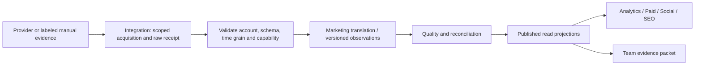

# Marketing — Channel & Measurement Contracts

**Relates to:** [Marketing Domain Design](../CR-018-MARKETING-DOMAIN-DESIGN.md)

| Field | Value |
|---|---|
| **Version** | 0.1.0b |
| **Status** | Candidate; capabilities researched, no live account/API activation verified |
| Parent | [Marketing Domain Design](../CR-018-MARKETING-DOMAIN-DESIGN.md) |

## 1. Scope axes

Provider, channel, account, property, business initiative และ execution plan เป็นคนละแกน
เช่น Meta เป็น provider, Instagram เป็น placement/organic channel ตาม dataset,
GA4 property เป็น measurement scope ไม่ใช่ ad account

ทุก association ต้องมี trusted Business context; connection/account/property UUID ของเรา,
provider external reference, namespace และ mapping version
shared agency account/property ต้องมี authorized Business partition ที่ตรวจได้ก่อน ingest/read
ถ้าข้อมูลแยก Business ไม่ได้ให้ blocked ไม่แสดงรวมในทุก Business ที่ใช้ connection
ห้ามจับคู่หลาย source ด้วย campaign name, display label, phone หรือ UTM text เพียงอย่างเดียว

## 2. Required capability / source matrix

| Capability | Required source / scope | Internal surface | First supported result | Execution limit |
|---|---|---|---|---|
| Meta Ads | Marketing API; ad account → Campaign → AdSet → Ad | Paid Media | Scoped hierarchy, spend/impressions/clicks, provider-defined actions; supported placement breakdown | Read first; create/pause/budget changes require separately approved writer |
| Instagram paid | Meta paid dataset with supported Instagram placement dimensions | Paid Media filtered to Instagram | Placement-specific performance tied to Meta Ad UUID | ไม่เปิด Instagram organic permission แล้วถือว่าอ่าน/เขียน ads ได้ |
| TikTok Ads | TikTok API for Business; advertiser → Campaign → Ad Group → Ad | Paid Media with TikTok filter | Scoped ad reports, advertiser metadata and report quality | ไม่สมมติว่า Meta fields/objectives/attribution windows มีใน TikTok |
| Instagram organic | Instagram Platform; authorized professional account + owned media | Social & Community; Content links | Account/media observations, engagement and post performance when permitted | Separate login/permissions from paid; publishing/messages need their own capability and approval |
| GA4 | Data API; authorized GA4 property and report dimensions | Analytics; Website/CRO consumes scoped projections | Acquisition, landing-page/event/key-event reports; property reporting identity retained | Read reports ≠ access to raw user identity or permission to change tags/property |
| SEO search performance | Search Console property, query/page/device/country/date reports | SEO Performance/Opportunities | Clicks, impressions, CTR, average position with completeness caveat | ไม่แสดงเป็น exhaustive query inventory หรือ guaranteed rank |
| SEO technical evidence | Authorized property URL Inspection + sitemap/robots/canonical/page evidence | SEO Technical/Workplan | Source-specific findings and verification timestamps | URL Inspection เป็น indexed-version evidence; owned-site crawl/CMS edits require separate authorized tool |

All sources ในตารางเป็น required design coverage; live-read support ยัง pending ทุกตัว
Meta/Instagram paid เป็น source family เดียวกัน ไม่เรียกสองครั้งแล้วนับ spend ซ้ำ
Google Ads ไม่ถูกนับเป็น Google Analytics และยังไม่มี requirement ให้เพิ่ม Google Ads connector

## 3. Provider facts verified vs proposed design

**Meta:** official Business SDK แสดง report fields ระดับ account/campaign/adset/ad และ
breakdown keys เช่น `publisher_platform`, `platform_position` จึงเสนอให้ Paid Media
มี placement selector ภายใน common view แทนสร้าง Marketing domain ตาม provider
รายการที่ API อนุญาตให้ใช้ร่วมกันและสิทธิ์บัญชีต้อง verify ที่ integration gate
อ้างอิง [Meta AdsInsights SDK](https://github.com/facebook/facebook-python-business-sdk/blob/main/facebook_business/adobjects/adsinsights.py)

**TikTok:** official SDK มี synchronous integrated reports พร้อม advertiser/data-level/dimension/metric/date parameters
รวมถึง async report methods จึงต้องรองรับ report-job receipts, pagination และ definition mapping
ไม่ถือ TikTok ว่าเป็น Meta adapter ที่เปลี่ยน URL เท่านั้น
อ้างอิง [TikTok Reporting API SDK](https://github.com/tiktok/tiktok-business-api-sdk/blob/main/python_sdk/docs/ReportingApi.md)

**Instagram:** Meta-owned documentation แยก Instagram Login กับ Facebook Login และชุด permissions สำหรับ insights;
owned professional account/media เป็น scope หลักในเอกสารที่ค้นได้
ให้ connection ระบุ login flow และ verified capabilities แทน hard-code ว่าทุก flow ต้องผูก Page
อ้างอิง [Meta Instagram Insights](https://www.postman.com/meta/instagram/folder/23987686-f659d7d1-d74c-44e4-9192-9b1e8694c511)
หลักฐาน Instagram รอบนี้มาจาก indexed excerpt ของ official Meta collection; full-page fetch มี timeout
จึงไม่ freeze รายการ permission strings หรือ account eligibility ทั้งหมดจาก excerpt

**GA4:** Data API ให้ report data และมี metadata/compatibility methods; reporting identity ของ property
มีผลกับผลลัพธ์ ให้เก็บ report definition/property context และใช้ compatibility validation ก่อน run
Funnel แบบ event sequence ต้องมี API/data contract ที่ตอบ sequence ได้จริง;
ห้ามเอา page/event aggregate มาต่อกันแล้วเรียกว่า user-level funnel
อ้างอิง [Google Analytics Data API](https://developers.google.com/analytics/devguides/reporting/data/v1)

**Data quality:** GA4 response metadata มี sampling, thresholding, schema restrictions,
timezone/currency และ empty reasons; preserve flags ไม่ convert restricted/empty เป็น zero
อ้างอิง [GA4 ResponseMetaData](https://developers.google.com/analytics/devguides/reporting/data/v1/rest/v1beta/ResponseMetaData)

**Search Console:** Search Analytics อาจคืนเฉพาะ top rows ไม่รับประกันว่าคืนทุก query;
URL Inspection ตรวจสถานะ version ใน Google index ไม่ใช่ live URL test
อ้างอิง [Search Analytics](https://developers.google.com/webmaster-tools/v1/searchanalytics?hl=en)
และ [URL Inspection](https://developers.google.com/webmaster-tools/v1/urlInspection.index/inspect)

ตรวจแหล่งข้างต้นเมื่อ 2026-09-06; เป็น documentation evidence ไม่ใช่ account-level authorization test
ข้อกำหนด version, OAuth review, quotas, historical window และ optional dimensions ต้องตรวจซ้ำเมื่อ implement

## 4. Shared ingestion and metric contract

Candidate observation envelope (design fields; no schema/enum declaration yet):

| Group | Minimum fields / invariant |
|---|---|
| Identity | internal UUID, Business scope via authorized parent, connection/account/property ref, provider entity namespace/id |
| Grain | source, entity level, metric definition/version, time interval, timezone, complete dimension tuple, attribution/window context |
| Values | observed counters or decimal money + currency; explicit null/unavailable reason; no PII in metric dimensions by default |
| Evidence | raw reference/hash, source API/report version, observed/fetched times, source timezone, covered window, report/job receipt |
| Quality | complete/partial/unsupported/restricted/stale, sampling/thresholding where provided, reconciliation/version |
| Lifecycle | immutable source evidence; versioned corrected projection, timestamps, audit; replay idempotency at natural grain |

Ingestion rules:

1. Trusted scope → owner-resolved connection → scoped secret reference → provider adapter; UI report routes never call provider inline
2. Account/entity parent mappings checked before write; unexpected parent/account is rejected/quarantined with source refs
3. Pagination/async completion must finish before partition is complete; preserve last good result on failure with visible freshness gap
4. Duplicate delivery is unchanged; corrected insight replaces the same logical snapshot with revision lineage, never increments blindly
5. Concurrent acquisition uses atomic lease/fencing, bounded retry/backoff, pagination recovery and rate-limit evidence through Integration owner contracts
6. Source revocation pauses acquisition and invalidates authorized use; approval/knowledge visibility must be rechecked before acting on cached evidence
7. Source-specific raw payload retention/erasure remains Integration/Identity owned; Marketing stores only allowed projections and references
8. Refresh means a new acquisition request/receipt; clearing local display cache alone never claims new provider data

Measurement rules:

- **Spend:** decimal or integer minor units with declared scale; aggregate only compatible currency/time definitions; no automatic FX without policy
- **Meta vs TikTok hierarchy:** normalize common levels only when semantically equivalent; keep provider labels/raw refs for AdSet vs Ad Group and unsupported automated structures
- **CTR/CPC/CPM:** recompute from compatible numerator/denominator totals; zero denominator unavailable; link-click vs all-click definitions remain distinct
- **Reach/active users:** non-additive across days, ads, platforms and properties; require appropriate aggregate report or show separate counts
- **Video metrics:** view/engagement definitions differ; definition label travels with every comparison
- **Attribution:** provider-reported conversions, GA4 key events and Commerce-recognized orders are distinct measures, not additive totals
- **Cross-source joins:** explicit initiative/account/ad/creative/landing references and approved mapping; UTMs are evidence, not UUIDs or authorization
- **Time:** common half-open interval internally; source adapters translate provider date semantics; daily totals in different timezones cannot be relabeled as identical days
- **Quality:** source absence, delayed evidence, restricted output, sampling and observed zero are not interchangeable
- **Experiment:** hypothesis + treatment/control + metric/guardrail + observation window + evidence adequacy before calling a winner; correlation is labeled as such

## 5. SEO / website responsibilities

SEO scope includes search performance, intent/topic opportunities, content brief and on-page review,
technical issue triage, indexing evidence, sitemap/canonical/robots findings and remediation verification
Website & CRO owns page/journey improvement intent and experiment interpretation
Content owns creative/editorial output; code/CMS changes execute through the website's owner via PM handoff

An SEO finding carries inspected URL/property, observation time, method, evidence ref,
severity rationale, recommended action and verification criterion
Do not derive a broken canonical/robots/structured-data claim from GA4 traffic drop alone
external competitor search evidence stays Market Intelligence-owned; SEO consumes it by reference
Backlink/third-party rank data may be attached as labeled evidence, but no unrequested paid provider is provisioned

This boundary follows the distinction between making content understandable/discoverable and guaranteeing search placement;
no ranking promise is part of the product. Reference:
[Google SEO Starter Guide](https://developers.google.com/search/docs/fundamentals/seo-starter-guide)

## 6. Confirmed first-touch revenue

Marketing attribution evidence points to CRM `Conversation.id` and first qualifying inbound `Message.id`
resolved within tenant/channel/**channelAccountId**/Business scope from the current CRM owner contract
the latest baseline uses account-aware conversations (ADR-061); do not merge equal external thread IDs across accounts
tenant-shared conversations require explicit Business-resolving evidence, otherwise unresolved

The first eligible ad touch is insert-once under a versioned policy; duplicate events no-op,
late conflicting evidence requires review rather than silently rewriting history
ad may be inactive now if valid at event time; current active status is not the attribution rule

Confirmed revenue waits for Commerce-owned order/conversion UUID, recognized amount/date,
currency, cancellation/refund and revision contracts. No Order model exists in the inspected schema
Do not use GA4 reported purchase revenue to silently satisfy the missing Commerce contract
Count each recognized conversion once; revisions/refunds recompute results; no many-to-many joins multiplying spend
ROAS divides compatible recognized attributed revenue by spend; absent evidence is unavailable
Erasure/revocation propagates via CRM/Identity owner workflow and recomputes derived results

## 7. External action contract and tests

Publish, pause/resume campaign, change budget, message a partner, modify website or upload an audience
are separate capabilities from reading analytics or drafting a plan
candidate action requires exact Business/account/target UUIDs, action type, approved artifact hash/version,
bounded amount/schedule where applicable, human approver, credential scope and expiry
enqueue/execute both revalidate grants and stale data constraints
provider accepted/failed/unknown and actual delivery/outcome are separate receipts
ambiguous timeout is reconciled before retry; unavailable rollback must be stated on the reviewed action

Required verification: per-source account/property isolation; OAuth expiry/revocation; parent mismatch;
pagination/async retry; replay/correction; partial reports; incompatible metric definitions;
multi-currency/timezone; Meta Instagram overlap; GA4 quality flags; GSC truncation/indexed-version labeling;
attribution account collision/refunds/erasure; external action version/target/authority mismatch
Use source fixtures + local persistence tests first, then provider-by-provider live read evidence
No live test or account provisioning has been performed for this document

## CHANGELOG

| Version | Date | Status | Summary | Commit Hash | Agent |
|---|---|---|---|---|---|
| 0.1.0b | 2026-09-06 | candidate | Define required source coverage, official evidence, source-specific semantics, ingestion and approved action boundaries | See git history | RWANG |
