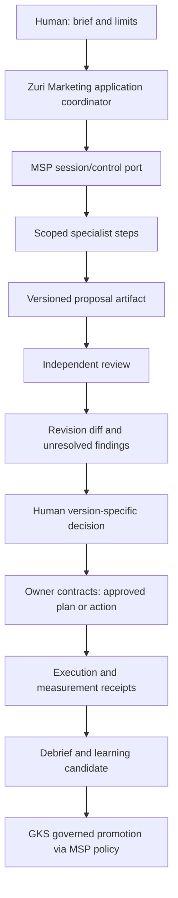
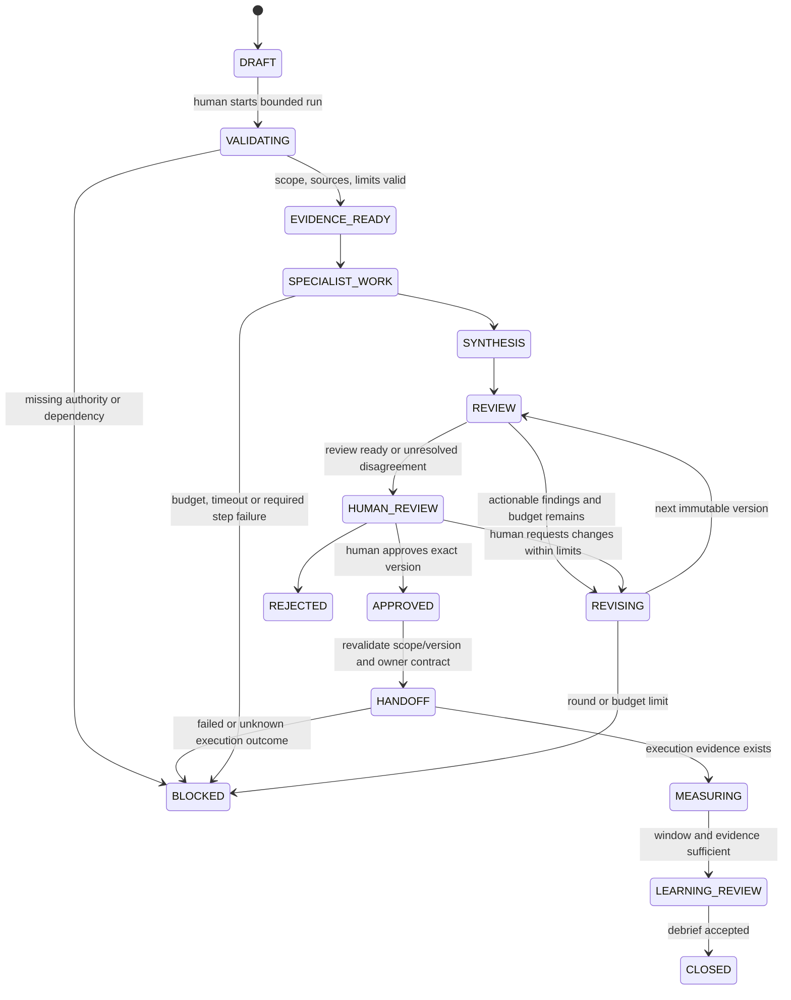

# Marketing — Multi-agent Team & Refinement

**Relates to:** [Marketing Domain Design](../CR-018-MARKETING-DOMAIN-DESIGN.md)

| Field | Value |
|---|---|
| **Version** | 0.1.0b |
| **Status** | Candidate runtime design; no live team runner is claimed |
| Parent | [Marketing Domain Design](../CR-018-MARKETING-DOMAIN-DESIGN.md) |

## 1. Team model and authority

Human CMO/Marketing owner ตั้ง business objective, budget ceiling, constraints และผู้อนุมัติ
runtime coordinator จัด bounded work ให้ specialist roles แล้วรวมผลงานเข้ารอบ review
agent proposer/reviewer เสนอและตรวจหลักฐานได้ แต่ไม่อนุมัติแทนคนหรือยกระดับสิทธิ์กันเอง

Team/TeamMembership ใช้เป็นการจัดกลุ่มคนตาม
[ADR-037](../../decisions/ADR-037-TEAM-IS-AN-ORGANISATIONAL-GROUPING-NOT-AN-AUTHORITY.md)
person ที่ถูกเพิ่มเข้า Marketing team ไม่ได้รับ Business access หรือ spend/publish authority เพิ่ม
agent role assignment เป็น typed runtime configuration แยกจาก Person/TeamMembership
ไม่สร้าง fake Person เพื่อให้ bot ได้ OWNER role

[ADR-026](../../decisions/ADR-026-AGENT-TOPOLOGY-FOR-THE-VISUAL-OFFICE.md) ระบุเองว่าเป็น
topology ของ agents ที่ **build product** ไม่ใช่ LINE/AI runtime นี้
นำหลัก single owner, bounded roles และ evidence projection มาใช้เป็น design rationale ได้
แต่ไม่อ้างว่า ADR นั้นได้ implement/authorize runtime Marketing team แล้ว
runtime queue/control ownership ต้องมี ADR/contract acceptance ของตัวเองก่อน code

## 2. Human and agent role matrix

ทั้งหมดเป็น roles ใน capability ที่มีอยู่ ไม่ใช่ product subdomains/permissions ใหม่
หนึ่ง run เรียกเฉพาะบทบาทที่ต้องใช้; งานเล็กไม่ต้อง spawn ทีมทั้งหมด

| Role | Type | Inputs → outputs | Scope / handoff |
|---|---|---|---|
| CMO / decision owner | Human | Objective/constraints → approve, request changes, reject | Exact Business authority; รับผิดชอบ budget และ accepted outcome |
| Marketing coordinator | Agent, with human operator | Brief/constraints → task graph, dependency map, synthesis | Dispatch allowed roles; no permission delegation beyond caller ceiling |
| Data analyst | Agent | Scoped snapshots/definitions → evidence packet, anomalies, uncertainty | Analytics read contracts; no invented metrics |
| Strategist | Agent + human lead | Evidence/brand/product facts → positioning, channel mix, alternatives | Strategy draft; targets เป็น proposals จน human approves |
| Meta paid specialist | Agent + human channel owner | Meta evidence + objective → campaign/creative/optimization proposals | Paid Media contracts; no direct budget write |
| TikTok paid specialist | Agent + human channel owner | TikTok evidence → platform-specific proposal | Retain provider semantics and capability gaps |
| Social/Instagram specialist | Agent + community owner | Organic insights/approved content → post/calendar/engagement plan | CRM handoff for messages; posting via approved capability only |
| SEO specialist | Agent + human reviewer | GSC/index/page evidence → intent/technical opportunities, prioritized fixes | Content/website work handoff; no unsupported ranking claim |
| Website/CRO specialist | Agent + website owner | GA4/UX evidence → journey hypotheses and experiment design | Website code/CMS write stays owner-controlled |
| Creative strategist / copywriter | Agent + editorial lead | Approved brief → ideas, script/copy, production brief | Brand/claim evidence and approved asset versions |
| Art director | Human or assistive agent | Brand system/brief → visual direction and review findings | Evaluates style/rights/consistency; role is not a publish grant |
| Graphic designer / editor | Human or approved creative tool executor | Production brief → artifact version | File/Artifact references + tool receipt; no claim of finished media without artifact |
| Footage / live production crew | Human by default | Shot list/rundown → captured footage/rehearsal/live evidence | AI can draft shot list; cannot claim it filmed or hosted a live |
| Affiliate / influencer specialist | Agent + partner manager | Program brief/authorized partner info → shortlist, deliverables, rights requests | Outreach is external action; contracts/payment remain owner references |
| Live planner | Agent + live producer | Campaign/offer constraints → rundown, readiness, follow-up brief | Offer/stock from Commerce; host/crew confirmation is human evidence |
| Marketing operations / MDT coordinator | Human or assistive agent | Plan/dependencies → intake/calendar/handoff requests | CRM/Commerce/PM owner services; never direct order/stock edits |
| Independent reviewer | Agent + human reviewer when needed | Draft + source evidence + acceptance rubric → findings, disagreements, verdict | Separate reviewer role/session from proposer; no self-approval |
| Measurement / learning analyst | Agent + human owner | Approved plan + outcome window → evaluation/debrief, learning candidate | No outcome invented before measurement; GKS promotion separately gated |

Model/provider/tool choices are per-role configuration validated against data sensitivity,
capability, cost and evaluation evidence; this design installs or selects no external model
shared model vendor does not prove independence; reviewer has separate task/input/receipt and critique obligation

## 3. Runtime topology and durable state

Domain owners remain the writers; runtime agents never get arbitrary DB/SQL access
parallel specialists read frozen evidence and produce separate candidate artifacts
only the owner service commits accepted state under version checks; no concurrent same-record writers
cross-domain tasks are typed handoffs with receipts, not temporary access to another domain's tables

Four-tier allocation follows [ADR-043](../../decisions/ADR-043-FOUR-TIER-COGNITIVE-ARCHITECTURE.md)
and [ADR-044](../../decisions/ADR-044-UNIFIED-THREAD-ID-AND-OMNI-CHANNEL-CONSOLE.md):

| Tier/owner | Durable responsibility | Zuri UI may display |
|---|---|---|
| Marketing / PM / file owner | Business artifacts, decisions, task/gate state and versioned execution associations | Briefs, diffs, approvals, task receipts, marketing outcomes |
| Agent runtime + MSP | MSP-issued thread/session ID, control/memory policy, bounded step lifecycle through agreed port | Run/step IDs, status/receipt projection, timing/cost, public concise rationale |
| Integration | Provider data acquisition and external-action receipts under approved owner contract | Source freshness, errors, capability readiness, accepted/unknown outcome |
| GKS | Canonical knowledge identity and approved learning promotion | Scoped fact/citation/learning references |
| GenesisBlockDB | Retrieval substrate behind GKS | No direct Marketing access |

Do not put a second MSP session database in Marketing or use the ingestion Pipeline ledger as an unreviewed
general agent scratchpad. The exact durable run/step/lease port and recovery implementation require
MSP/Agent owner acceptance; available production support was not inspected in the other repos this turn
If unavailable, automated runs show **blocked dependency**; human-authored review artifacts can still be managed
Do not present a local mock run as an integrated MSP team

## 4. Run input/output contract

Candidate contract fields below define semantic requirements, not a new JSON Schema yet

| Object | Required semantics |
|---|---|
| Run brief | Business + initiative/project refs, objective, target audience reference, product/brand facts, source window, constraints, human owner, output acceptance |
| Budget policy | Separate model cost/token/time/round/parallelism limits from proposed marketing spend; both explicit and finite |
| Evidence snapshot | Authorized source references/hashes, query/report definition, capture/version/time, currency/timezone, quality flags, visibility and expiry |
| Team configuration | Role, human/agent type, allowed tools/read contracts, model config ref, delegated ceiling, required reviewer, dependency graph |
| Step receipt | MSP run/session reference, step/attempt/role, claimant/lease/version, input refs, output artifact ref/hash, time/cost, state/error class |
| Proposal version | Immutable artifact id/hash/version, parent version, objective/assumptions, alternatives, evidence references, proposed tasks/budget/KPIs and unresolved findings |
| Review record | Reviewer identity/role/session, reviewed version/hash, rubric findings, severity, evidence refs, pass/change-request verdict and dissent |
| Human decision | Approver, trusted Business/capability, exact version/hash, allowed action/target scope, expiry, approve/change/reject, rationale and audit receipt |
| Measurement/debrief | Approved plan/action refs, actual receipts, observed window, comparison method, guardrails, outcome confidence and learning candidates |

UI/storage retains concise rationale and observable evidence, not private chain-of-thought
untrusted source text, web pages, image text and provider content are evidence only;
they cannot override role/system policies, add tools or change the run's Business

## 5. Refinement state machine

Pause/cancel are allowed from any nonterminal state through the controller port
pause freezes new dispatch; resume revalidates scope, evidence freshness and remaining limits
cancel fences outstanding claims and future actions; it cannot recall a provider call already sent
revoked permission or superseded input invalidates pending approval/action and returns for review
expired lease is a visible breach; resume uses input/output receipts and idempotency, not replay from memory

### Bounded default policy (candidate values)

- At most 3 automated critique/revision rounds and 3 parallel specialists; one coordinator per run
- Before start, require approved finite token/cost/time limits; no silent unlimited fallback
- Required step failure, missing material evidence, unresolved blocker or spent budget stops autonomous progression
- Limits cannot be raised by an agent; human amendment produces audited policy revision
- Optional role failure may be omitted only with explicit gap disclosure; no fabricated replacement output
- Planner cannot recursively spawn a manager chain or expand requested scope; additional work becomes a new reviewed brief

These are product design defaults to approve, not claims about current MSP API options

## 6. Review, diff and approval gates

Every refinement review tests six dimensions:

1. **Evidence:** each factual/product/performance claim has scoped provenance; missing data labeled
2. **Business fit:** objective, audience, offer, channel and constraints align; no unauthorized scope growth
3. **Feasibility:** dependencies, owner capacity, production rights, deadlines and source capabilities available
4. **Measurement:** baseline, KPI definition, window, decision rule and guardrail stated; no unsupported ROI conclusion
5. **Brand/content quality:** claims and creative direction match approved evidence/brand guidelines
6. **Authority:** correct Business/account, human decision owner, external-action limits and privacy constraints

Hard blockers must be zero before execution; agent agreement or a high average score never overrides a blocker
No majority vote can make an unsupported factual claim true
Disagreement is recorded with each alternative/evidence, and surfaced to the human owner

Diff must cover additions/removals, budget/target/channel/date/KPI changes, claimed facts,
creative versions/rights, affected downstream tasks and reviewer findings resolved or carried forward
human approves exact artifact hash + policy version; every material edit invalidates that approval
changing targets/account/creative/budget after approval requires new review
Plan approval authorizes only the stated internal handoff; it is not implicit permission to spend or publish
external action approval binds exact targets and ceiling under the Channel contract

## 7. Execution, feedback and learning

Approved planning output enters existing PM `PlanEnvelope` or `ExecutionPlanBundle` flow:
validate → dry-run preview → conflicts/scope check → transactional import → AuditEvent/receipt
proposal version links to committed Workstream/WorkContainer/WorkItem IDs;
`campaignId` aliases are preserved and no eighth execution mode is introduced

Human/tool execution writes through owner contracts; manual execution requires a labeled receipt
model-generated success text is never a delivery receipt
measurement compares actual observations against the approved baseline/window and notes confounders,
data gaps and source-attribution differences before recommending next actions
inconclusive/negative results are valid debrief outcomes; low data volume does not justify inventing uplift

Closing a run means decision + handoff/measurement/debrief are recorded, or cancellation/rejection has a recorded reason
`APPROVED` is not `EXECUTED`, provider `ACCEPTED` is not customer `DELIVERED`, and `EXECUTED` is not business `SUCCESS`
where execution remains manual, status is waiting for evidence until the responsible person submits it

Refinement creates a new proposal version, never rewrites an approved artifact
new market outcome starts a linked follow-up run; accumulated scratchpad is not canonical knowledge
learning candidate stores scope, context, evidence, confidence, limitations and expiry/revisit trigger
Human + GKS governance determine promotion; negative/disputed lessons remain labeled
no automatic cross-Business learning, training on customer PII or direct GenesisBlockDB writes

## 8. Runtime acceptance tests / evidence gates

| Scenario | Expected proof |
|---|---|
| Simple brief | Invoke only required roles; coherent scoped artifact, independent review and human approval |
| Full cross-channel brief | Meta/TikTok/organic/SEO/CRO specialists use defined evidence; shared initiative plan, no duplicated tasks |
| Bad claim / conflicting recommendations | Reviewer records sources/disagreement; hard blocker stops execution; human sees alternatives |
| Stale approval / changed budget/account | Hash/version/target mismatch rejects action before dispatch |
| Added person to Team | No authorization changes without trusted Membership/capability grant |
| Prompt injection in source evidence | Source cannot change scope, role, instructions or allowed tools |
| Two runs / expired lease / restart | Fenced writer, visible breach, idempotent resume; no duplicate side effect |
| Budget/round/time cap | Stop with remaining gaps; agent cannot self-extend |
| Source revocation / cross-Business request | Read and pending action fail closed; no private evidence in review output |
| Optional vs required specialist fails | Optional gap disclosed; required failure blocks; no forged result |
| Provider timeout | UNKNOWN receipt retained, reconcile before retry; no fabricated delivery |
| Learning promotion | Approved scoped lesson only; rejected/unverified finding not promoted |

Required production dependencies: MSP run-control/receipt contract, GKS scoped evidence/promotion contract,
owner-approved role/tool policies and durable recovery; none is marked implemented by this proposal
Verify local orchestration contracts and adversarial fixtures, then real MSP/GKS staging integration,
then permitted provider actions separately. Use the project verification chain for code changes

## CHANGELOG

| Version | Date | Status | Summary | Commit Hash | Agent |
|---|---|---|---|---|---|
| 0.1.0b | 2026-09-06 | candidate | Define runtime Marketing team roles, bounded refinement, version-specific review/approval, recovery and governed learning | See git history | RWANG |
