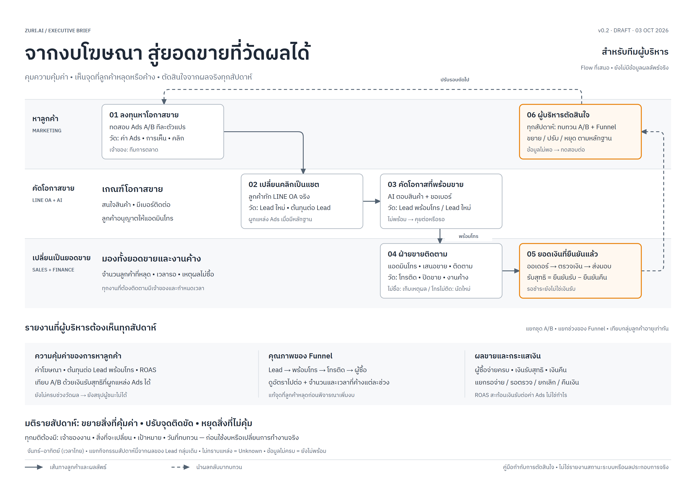

# จากงบโฆษณา สู่ยอดขายที่วัดผลได้

เอกสารนี้เป็นข้อเสนอกระบวนการฉบับร่างใน `docs/change-requests/` ไม่ใช่ requirement หรือหลักฐานว่า Ads, LINE OA, AI, CRM หรือการชำระเงินเชื่อมต่อและทำงานใน production แล้ว

[เปิดภาพฉบับผู้บริหาร (HTML)](zuri-line-oa-executive-flow-v0.2.html) · [ดูภาพ PNG](zuri-line-oa-executive-flow-v0.2.png) · [คู่มือฉบับทีมปฏิบัติงาน](README-flow.md) · [ภาพฉบับทีมปฏิบัติงาน (HTML)](zuri-line-oa-sales-flow-v0.1.html)



ผู้บริหารใช้ภาพนี้ตอบสามคำถาม:

1. งบ Ads เปลี่ยนเป็นโอกาสขายและเงินรับสุทธิได้คุ้มค่าเพียงใด?
2. ลูกค้าหลุดหรือค้างที่ Ads → LINE → พร้อมโทร → ฝ่ายขาย → ยอดเงิน ตรงไหน?
3. สัปดาห์หน้าจะขยาย ปรับ หรือหยุดสิ่งใด ใครรับผิดชอบ และวัดผลเมื่อไร?

ภาพมีห้าช่วงของ Funnel และหนึ่งจุดทบทวน จัดเลนตามความรับผิดชอบ: การตลาด, LINE OA/AI, ฝ่ายขาย/ผู้ตรวจเงิน เป็นภาพย่อสำหรับการตัดสินใจ โดยรายละเอียดการปฏิบัติงาน เงื่อนไขส่งต่อ และสูตรอยู่ใน [คู่มือฉบับทีมปฏิบัติงาน](README-flow.md)

## KPI สำหรับใช้กำกับ

| ประเด็น | ตัววัดหลัก | วิธีอ่าน |
|---|---|---|
| เงินลงทุน | ค่าโฆษณา, ต้นทุนต่อ Lead พร้อมโทร, cash ROAS แยก A/B | CPLq = ค่า Ads / Lead พร้อมโทรที่ผูก variant ได้; cash ROAS = เงินรับที่ยืนยันสุทธิหลังหักเงินคืนและผูก Ads ได้ / ค่า Ads ไม่ใช่อัตรากำไร |
| คุณภาพ Funnel | จำนวนคนและอัตราไปต่อในแต่ละช่วง, เวลารอ, งานค้าง, เหตุผลไม่ซื้อ | เปรียบเทียบ Lead cohort เดียวกันและอายุเท่ากัน แยกส่วนที่ยังรอผล |
| ผลขาย | ผู้ซื้อจ่ายครบ, จำนวนออเดอร์, เงินรับสุทธิ, เงินรอจ่าย/รอตรวจ, ยกเลิก/คืนเงิน | เฉพาะรายการที่ยืนยันแล้วจึงรวมเป็นเงินรับสุทธิ; การรับปากซื้อยังไม่ใช่เงินรับ |

Lead พร้อมโทรยังหมายถึงสนใจสินค้า มีเบอร์ติดต่อที่ลูกค้าให้/ยืนยัน และลูกค้าอนุญาตให้โทร ทุกงานติดตามต้องมีเจ้าของและกำหนดเวลา

## การใช้ในประชุมรายสัปดาห์

- ใช้ช่วงจันทร์–อาทิตย์ตาม Asia/Bangkok และระบุเวลาตัดยอดกับความสดของแหล่งข้อมูล
- แยกกิจกรรมสัปดาห์นี้ออกจากผลของ Lead ที่เริ่มในสัปดาห์ก่อน การเทียบ A/B ใช้ cohort/window และกติกา attribution ที่สอดคล้องกัน
- หากไม่มีหลักฐานแหล่ง Ads ให้เป็น Unknown ไม่เดาเป็น Organic หรือยกยอด CHAT ทั้งหมดเป็นยอด Ads
- ข้อมูลไม่ครบให้แสดงว่าไม่พร้อม; ตัวหารศูนย์ให้เป็น N/A; ยังไม่ครบเวลาวัดผลให้ Pending ห้ามสร้างตัวเลขแทน
- ขยาย/ปรับ/หยุดตามหลักฐานและแผนทดสอบที่กำหนดล่วงหน้า พร้อมระบุเจ้าของ สิ่งที่เปลี่ยน เป้าหมาย และวันทบทวน ไม่มีการกำหนดงบ SLA หรือเกณฑ์ผู้ชนะสมมติ

สูตรเต็ม ขอบเขตแหล่งข้อมูล และหลักฐานโครงการอยู่ใน [README-flow.md](README-flow.md) ข้อเสนอฉบับนี้ไม่กำหนดงบ SLA หรือเกณฑ์ผู้ชนะสมมติ และไม่อ้างว่า integration พร้อมใช้งาน

## Version diff: v0.1 → v0.2

```diff
- เน้นทีม Ads และแอดมิน: 8 ขั้น 4 เลน พร้อมรหัสสถานะและรายละเอียดการส่งงาน
+ เน้นผู้บริหาร: 5 ช่วง Funnel + 1 จุดตัดสินใจรายสัปดาห์ ใน 3 เลน
- ตาราง KPI แยกรายขั้น 7 ช่อง
+ มุมมอง 3 เรื่อง: ความคุ้มค่า / คุณภาพ Funnel / ผลขายและกระแสเงิน
+ เพิ่มรายการมติรายสัปดาห์และเจ้าของการเปลี่ยนแปลง
```

ยังคง Flow Ads A/B → LINE → AI ขอเบอร์ → แอดมินโทร → ออเดอร์/เงินรับ → ทบทวนรายสัปดาห์ ข้อเสนอนี้ไม่แก้ application code หรือ canonical registry และไม่มีตัวเลขผลลัพธ์สมมติ

## ผลตรวจ

- PASS: skill self-check, ฟอนต์ไทย, ไม่มีข้อความซ้อน/ล้นกล่อง, ไม่มีลูกศรผ่านกล่องที่ไม่ใช่ปลายทาง
- PASS: จอแคบเลื่อนเฉพาะกรอบภาพ; print rendering A4 แนวนอน 1 หน้า; PNG 3360 × 2376
- PASS: ตรวจภาพที่ render จริง; geometry, mobile layout และ print CSS summary อยู่ใน [evidence/flow-validation-v0.2.json](evidence/flow-validation-v0.2.json). QA PDF ไม่ได้รวมไว้ใน repository
- NOT_RUN: application tests/build/e2e และการเชื่อมต่อ production เป็นการปรับเอกสารภาพเท่านั้น
