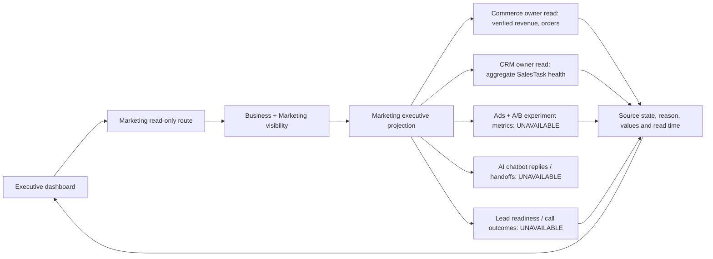

# ข้อเสนอเพิ่มเติมก่อนเริ่ม implementation

## การอนุมัติ

ผู้ใช้อนุมัติ scope migration และ dashboard ในบทสนทนาวันที่ 2026-10-05 (“อนุมัติ migration และทำ dashboard”) จึงเริ่ม implementation ตามขอบเขตด้านล่างได้

ข้อเสนอ [Executive KPI Dashboard](EXECUTIVE-KPI-DASHBOARD-PROPOSAL.md) รุ่น 0.1.0 ได้รับอนุมัติสำหรับ dashboard รุ่นแรกแบบ read-only แล้ว การตรวจสัญญาใน repository พบว่าการทำส่วนสุขภาพ SalesTask ต้องเพิ่ม canonical requirement และ owner-read boundary ก่อนเขียน application code จึงเสนอขอบเขตเพิ่มเติมนี้เพื่อทบทวนแยกจากหน้าจอ dashboard

## หลักฐานและข้อจำกัด

1. `FR-185` กำหนดให้ Marketing Paid Media และ AskMarketing projections คงสถานะข้อมูลจริง และระบุชัดว่า projections เหล่านั้นไม่เรียก CRM readers การใช้ FR-185 อ้างอิงหน้า SalesTask โดยตรงจึงขัดกับขอบเขตที่อนุมัติแล้ว
2. `FR-161` เป็นเจ้าของ SalesTask และมี summary ที่คำนวณสถานะงานเปิด งานเกินกำหนด งานครบกำหนดวันนี้ และงานไม่มีผู้รับผิดชอบตาม Business calendar แต่ Marketing ยังไม่มี CRM owner-read contract สำหรับ executive projection
3. `CANONICAL-FORMAT.md` กำหนดให้การเพิ่ม record ปรับ canonical record และ projection slot ผ่าน document-registry workflow โดย generated index และ exports เป็นของเครื่องมือ ส่วน `tools/document-registry.mjs` ปัจจุบันมีเพียง `--adopt`, `--write` และ `--check` จึงยังไม่มีขั้นตอนที่รองรับ record migration ใหม่โดยรักษา provenance และไม่แก้ generated index เอง

## ขอบเขตที่เสนอ

- เพิ่ม Marketing functional requirement ใหม่สำหรับ Executive LINE OA Sales KPI Dashboard โดยคง `FR-185` และ ID/subject anchor ที่ออกแล้วทั้งหมดไว้ตามเดิม ใช้ ID writer และ reviewed record migration ที่สร้าง provenance จริง ห้ามอ้าง ID ล่วงหน้าก่อน migration ผ่าน
- เพิ่ม CRM owner read แบบ aggregate สำหรับสุขภาพ SalesTask ใช้ Business scope และ CRM visibility เดิม ส่งเฉพาะ counts และ source timestamp; ไม่ส่งชื่อลูกค้า เบอร์โทร ข้อความ บทสนทนา หรือรายละเอียดรายงานรายบุคคล
- ให้ Marketing projection เรียกเฉพาะ owner reads ที่ได้รับอนุมัติ แสดงเงินรับ/ออเดอร์จาก Commerce และ task health จาก CRM พร้อม source state, reason และ `source_as_of`
- Ads spend/impressions/clicks, attribution, Lead readiness/permission-to-call และ call outcomes ยังคง `UNAVAILABLE` ตามข้อเสนอรุ่น 0.1.0 ห้ามสร้างค่าประมาณหรืออนุมานจาก `CHAT`
- เพิ่ม UI หน้าเดียวแบบ read-only และทางเข้าจาก Marketing dashboard ไม่มี database/schema migration, write route, provider integration หรือการเปลี่ยนสิทธิ์
- เพิ่มความสามารถขั้นต่ำให้ document-registry สร้าง canonical record migration ที่ผ่านการตรวจ source revision, ID ledger, unique identity และ projection slots แล้วจึงสร้าง index/exports ด้วย writer เดิม การเปลี่ยนแปลงนี้ต้องรักษา source digests, paths และ identity ของ records เดิมทั้งหมด

## Contract สำหรับ reviewed record

- ใช้ `status: reviewed-migration`, `migration_base_revision` เป็น full Git SHA ที่เป็น ancestor ของ `HEAD` และ `migration_document` ชี้มายังเอกสาร migration ที่มี frontmatter `status: approved` กับหัวข้อยืนยันการอนุมัติ; record ใหม่ไม่ระบุ `source_revision` ของ snapshot เก่า
- `node tools/document-registry.mjs --register-reviewed <path>` รับเฉพาะ FR แบบ standalone, ปฏิเสธ ID/path ที่ซ้ำหรือเคยถูกใช้ใน ID ledger, ตรวจ subject collision และ PRD projection slot แล้วให้ writer แทรก slot หลัง FR สุดท้าย พร้อมสร้าง index/export
- ผู้ทำ migration รัน `npm run docs:ids -- --write` เพื่อ pin subject ใหม่ แล้วรัน `npm run docs:registry` และ `npm run govern`; `--write`/`--check` ตรวจ approval link และ provenance แต่ไม่ทดสอบ ancestry ซ้ำ เพื่อรองรับ shallow CI checkout
- `exportOrder` คำนวณใหม่จากตำแหน่ง placeholder เมื่อ writer สร้าง index; source row hash, path, subject และ ID ของ initial records ยังคงเดิม
- เพิ่ม readiness metadata ของ Standalone FR ใน `registry/document-registry/FEATURES.template.md` โดยจัดหมวด presentation เป็น `marketing`; สร้าง `docs/FEATURES.md` ผ่าน document-registry writer และไม่เพิ่ม FEAT membership

## ภาพสถาปัตยกรรม dashboard รุ่นแรก

Projection reads remain inside the owners' scope gates. It never reads CRM tables directly, sends no customer/conversation data to Marketing, and makes no write or dispatch calls. SalesTask health is a current snapshot; only verified Commerce money uses the selected completed-week window.

## ผลกระทบและความเสี่ยง

งานเปลี่ยนจาก C-2/MEDIUM เป็น **C-3/HIGH** เพราะต้องแก้ workflow ของ canonical registry และเพิ่มสัญญาอ่านข้าม domain นอกจากหน้า UI/API แล้ว parent authority ยังคงเป็น standalone zuri.ai, Business/Tenant scoping และ architecture rule ที่ reporting อ่านข้าม domain ได้แต่ไม่เป็นเจ้าของข้อมูล; peer owners คือ Marketing, CRM และ Commerce

## เกณฑ์รับงานของ scope เพิ่ม

- Registry migration สร้าง FR ใหม่ได้ผ่าน workflow ที่ตรวจสอบได้ โดยไม่แก้ generated index หรือ exports ด้วยมือ และ `npm run docs:registry` กับ `npm run govern` ผ่าน
- ID ที่ออกใหม่ถูก pin อย่างถูกต้อง; source rows, subject anchors, digests และ paths ของ records เดิมไม่เปลี่ยน
- CRM aggregate reader ปฏิเสธ Business ที่มองไม่เห็นหรือไม่มี CRM visibility และคืนเฉพาะข้อมูลรวม
- Marketing endpoint แสดง `READY`, `PARTIAL`, `UNAVAILABLE` หรือ `UNKNOWN` ตาม owner source จริง; error ไม่กลายเป็นศูนย์
- Tests ยืนยัน boundary, aggregation และ rendering ของ unavailable states; no Ads/A/B/chatbot/Lead/call value ถูกนำเสนอเป็นตัวเลข

## Version diff

| Version | Status | Change |
|---|---|---|
| 0.1.0 | approved | เพิ่ม scope migration ที่จำเป็นต่อ dashboard รุ่นแรก หลังพบข้อห้าม CRM reader ใน FR-185 และช่องว่างขั้นตอนเพิ่ม canonical registry record |
| 0.2.0 | approved | บันทึกการอนุมัติ migration/dashboard, รายละเอียด reviewed-record workflow และภาพ owner-read boundary สำหรับ C-3 implementation; เพิ่มข้อกำหนด provenance, scope และ source states ให้ตรวจสอบได้ |
| 0.4.0 | approved | บันทึก flow steps สำหรับ Ads/A-B, AI chatbot, Lead handoff, CRM follow-up, admin call และ Commerce close; แหล่งที่ยังไม่มี owner contract แสดง UNAVAILABLE |
| 0.3.0 | approved | เพิ่ม readiness metadata ที่ governance ต้องใช้สำหรับ Standalone FR โดยแยก presentation domain จาก FEAT membership; export สร้างผ่าน registry writer |
