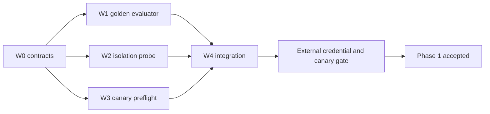

# ZV2-CR-005 — Phase 1 activation readiness

## Goal

Provide deterministic, secret-safe tooling for the remaining Phase 1 evaluation and canary proofs
without enabling production LINE traffic.

## Complexity and risk

- Complexity: `C-3` — AI evaluation, live database security proof and external channel boundary.
- Risk: `HIGH` — incorrect tooling could leak credentials, overstate delivery or activate a wider
  audience than the single approved canary.

## Current inventory

| Capability | Existing authority | Gap |
|---|---|---|
| Knowledge query | `BusinessKnowledgeReadPort`, private `zuri_core`, FR-051 | No versioned golden corpus/evaluator |
| Provider | `ModelProviderPort`, five adapters, FR-048 | No approved real credential or scored evaluation artifact |
| Answer verification | `grounded-business-answer.js`, FR-049 | No 20-question business acceptance runner |
| Runtime isolation | `production_tenant_isolation.sql`, FR-051/052 | Static remote proof exists; live dedicated-login probe pending |
| Binding | server-owned resolver, remote row `PENDING`, FR-052 | No deterministic activation preflight/plan |
| LINE receipt | single reply owner, FR-050 | No real signed canary; display/read cannot be proven |

Machine-readable inventory: `.agent/inventories/FR-053-054-ACTIVATION-READINESS.json`.

## Scope

### W0 — Contract and governance

- register FR-053/054, NFR-012, BR-013, SDD-027 and SEC-011;
- freeze evidence schemas, task ownership and DAG;
- keep secrets and production mutations outside the implementation worktree.

### W1 — Golden question evaluation

- schema and at least 20 approved-question placeholders spanning product lookup, comparison,
  missing data, denied private data and unsupported numbers;
- deterministic evaluator with injected knowledge/provider ports;
- redacted JSON evidence report and focused tests.

### W2 — Runtime database isolation probe

- dedicated-login URL accepted from environment only;
- positive scope, cross-Tenant denial, direct-grant denial and rolled-back mutation assertions;
- redacted result artifact, deterministic fake-client tests and no remote execution in code review.

### W3 — Canary preflight and runbook

- dry-run-only canary plan validation;
- exact binding/project/business/provider/golden-report prerequisites;
- truthful receipt states and a rollback-first operator runbook;
- no binding update and no LINE API call in this slice.

### W4 — Integration and release proof

- public module exports and package scripts owned by the integrator;
- full tests, build, docs graph/preflight and secret scan;
- phase report that distinguishes implemented, evaluated, activated and accepted states.

## DAG and exclusive ownership

W1 owns only golden contract/evaluator/tests. W2 owns only isolation probe/tests. W3 owns only
canary contract/preflight/runbook/tests. W4 alone edits shared indexes, `package.json`, generated
docs and phase status.

## Acceptance criteria

| ID | Criterion |
|---|---|
| AC-053-01 | Corpus validates at least 20 uniquely identified questions with expected query, evidence and policy assertions. |
| AC-053-02 | Corpus and evidence artifacts contain no credentials, PII, cost, margin, invoice data or unrestricted SQL. |
| AC-053-03 | Evaluator is deterministic with injected ports and detects unsupported numbers, missing evidence, denied private requests and fallback behavior. |
| AC-053-04 | Real-provider mode reads credential only from environment and redacts it from errors and reports. |
| AC-053-05 | A passing report requires 20/20 assertions and zero unsupported numeric claims. |
| AC-054-01 | Runtime probe proves exact positive scope, cross-Tenant denial, direct-grant denial and rolled-back mutation behavior. |
| AC-054-02 | Probe reports host/role only in redacted form and never serializes a password or full database URL. |
| AC-054-03 | Canary preflight defaults to dry-run and refuses missing, stale, mismatched or non-PENDING prerequisites. |
| AC-054-04 | Receipt states preserve `ACCEPTED_BY_LINE` separately from display/read unknown. |
| AC-054-05 | Failure guidance disables routing first and never deletes migrated knowledge or source data. |
| AC-054-06 | No implementation in this CR activates a binding or sends LINE traffic. |

## Merge exit gates

1. All ACs pass with fake/injected dependencies.
2. No secret-like value or raw connection URL exists in tracked files or generated evidence.
3. Full Vitest, Python, Playwright, build, docs graph/preflight/check and diff check pass.
4. Runtime activation stays disabled and all real-provider/LINE claims remain `NOT_RUN`.

## External activation gates

- approved secret manager and dedicated runtime password;
- approved provider/model/credential and owner-approved golden question content;
- live database isolation report;
- approved physical backup/PITR policy and rollback rehearsal;
- destination/credential hashes and one signed canary under explicit operator approval.

## Out of scope

- creating, storing or rotating production secrets;
- changing the remote binding or Supabase data;
- calling LINE Reply API;
- Phase 2 hosting, outbox, observability or general traffic;
- new UI or design tokens.

## Implementation result

W0-W4 are implemented. Focused readiness tests pass 32/32, full Vitest passes 89 files / 461 tests,
Python passes 8/8, Playwright passes 34 with 4 documented skips, and the production build passes.
The deterministic fake evaluator passes 20/20 with zero unsupported numeric claims. Real-provider
evaluation, live database isolation and the signed LINE canary are intentionally `NOT_RUN`; the
binding remains `PENDING`, hash-free and traffic-disabled.

## CHANGELOG

| Version | Date | Status | Summary | Commit Hash | Agent |
|---|---|---|---|---|---|
| 0.1.0b | 2026-08-14 | beta | Owner-approved W0-W4 readiness envelope and external activation boundary | working-tree | ATHER |
| 0.2.0b | 2026-08-14 | beta | W0-W4 implemented and regression-tested; external activation gates remain NOT_RUN | working-tree | ATHER |
