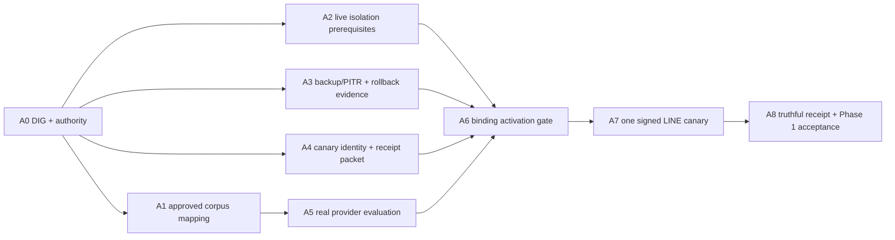

# ZV2-CR-006 — Phase 1 external activation

## Authority

The owner authorized parallel execution preparation on 2026-08-14 after requiring the dependency
impact graph first. ADR-019 remains binding: no agent may invent a credential, select a destination,
install binding hashes or call LINE without exact operator inputs and all predecessors passing.

## Complexity and risk

- Complexity: `C-3` — production database identity, provider output and external LINE delivery.
- Risk: `HIGH` — credential disclosure, cross-Tenant access or reply to the wrong destination.

## DIG

The graph is acyclic. A1-A4 are parallel. A6 is the hard join and cannot run with any predecessor
in `NOT_RUN`, `FAIL`, `STALE` or `UNKNOWN`.

## Acceptance criteria

| ID | Criterion |
|---|---|
| AC-006-01 | DIG has no cycle and every remote mutation has all predecessors. |
| AC-006-02 | Corpus maps to approved public production evidence with no PII/financial leakage. |
| AC-006-03 | Real provider report passes 20/20 with zero unsupported numeric claims and is redacted. |
| AC-006-04 | Dedicated login live probe proves positive scope, cross-Tenant zero, no direct grants and rollback. |
| AC-006-05 | Backup/PITR policy and rollback rehearsal are approved before binding activation. |
| AC-006-06 | Canary plan pins one exact destination and expected project/Tenant/Business/provider/model hashes. |
| AC-006-07 | One signed canary records `ACCEPTED_BY_LINE` separately from display/read unknown. |
| AC-006-08 | Any failed/stale prerequisite leaves routing disabled and preserves migrated data. |

## Exit gates

1. A1-A5 evidence artifacts are fresh, redacted and hash-pinned.
2. Owner confirms the exact canary destination and controlled mutation window.
3. Binding is re-read immediately before mutation and remains `PENDING` and hash-free.
4. Canary produces a truthful receipt or routing-first rollback.
5. Phase 1 acceptance is recorded only after all evidence is reviewed.

## W1 audit result

| Lane | Reviewed result | Activation effect |
|---|---|---|
| A1 Golden mapping | PASS_WITH_WARN; mapping gate BLOCKED | 14/14 `ANSWER` cases use placeholder codes absent from the approved 74-row artifact; seven numeric allowlists lack approved evidence. |
| A2 isolation | PASS | Dedicated credential is loaded process-locally from Windows Credential Manager; the live Supavisor probe passes 74 exact-scope rows, zero foreign scope, denied direct grants and denied mutation with rollback. |
| A3 canary | PASS_WITH_WARNINGS; A6/A7 BLOCKED | No controlled hash installer, fresh recovery/rehearsal evidence or post-LINE receipt artifact exists. |
| A4 cross-review | PASS_WITH_WARNINGS | Focused local contracts pass 28/28 including PostgreSQL 17; they do not replace real provider, production database or LINE evidence. |

The production-disabled routing boundary is preserved. The dedicated credential was read into one
process tree and remote read/rollback-only probe SQL was run; no credential was printed or written,
no binding was changed and no LINE request was made.

## FR-055 local implementation result

ADR-020 and FR-055 are implemented through W4 locally. Strict activation/rollback/receipt schemas,
a dedicated operator role and event migration, a dry-run-default CLI, redacted `zuri-cli` adapter
and composed PostgreSQL 17 proof pass. Mutation capability remains outside the generic agent surface.
No production migration, binding mutation, provider request or LINE call occurred. W5 remains
blocked by A1/A2/recovery/destination/provider/operator gates.

## CHANGELOG

| Version | Date | Status | Summary | Commit Hash | Agent |
|---|---|---|---|---|---|
| 0.1.0b | 2026-08-14 | beta | Owner-authorized DIG and parallel read-only activation preparation | working-tree | ATHER |
| 0.2.0b | 2026-08-14 | beta | Approved isolation probe remediation passes dedicated-loopback PostgreSQL 17; remote gates unchanged | working-tree | ATHER |
| 0.3.0b | 2026-08-14 | beta | FR-055 W0-W4 local operator boundary implemented and verified; W5 external gate unchanged | working-tree | ATHER |
| 0.3.1b | 2026-08-14 | beta | A2 live dedicated-login isolation passes through the approved project pooler; LINE and binding remain disabled | working-tree | ATHER |
