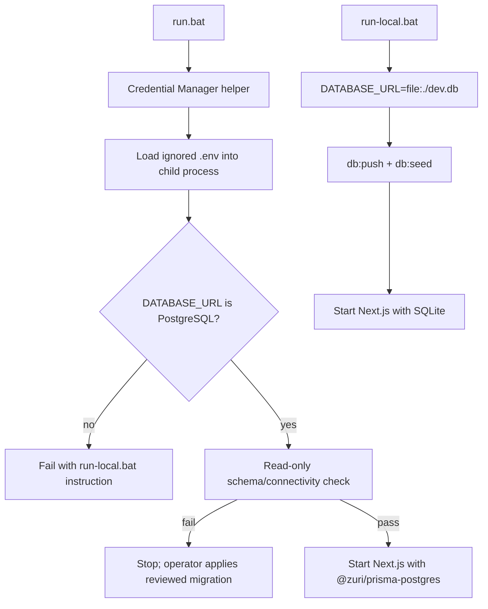

# ZV2-CR-009 — PostgreSQL primary application runtime

## Delivery status

Owner-approved on 2026-08-19. Runtime implementation is complete. The authorized read-only
`npm run db:pg:verify` probe passed against the configured server-side PostgreSQL target on
2026-08-19; no migration or seed mutation was performed. The branch must not claim full live
Supabase readiness because the existing migration/role/RLS/production gates remain separate.

## Root cause of the startup gap

The application code already had a PostgreSQL Prisma client selector, but the Windows startup
path did not use it reliably: the batch file did not load `.env`, defaulted to SQLite, invoked the
SQLite `db:push` workflow and the seed imported `@prisma/client` unconditionally. A PostgreSQL URL
could therefore be ignored, rejected by the SQLite schema workflow, or receive demo data without an
explicit target confirmation.

## Goal

Make `run.bat` a safe PostgreSQL/Supabase runtime entry point while preserving a clearly named
SQLite offline/demo runner. The default PostgreSQL path must verify and start; it must not silently
apply schema changes or seed data into a remote database.

## Complexity and risk

- Complexity: `C-3` — architecture, provider selection, generated clients and operational gates.
- Risk: `HIGH` — a mistake can write demo data to a production database or select the wrong store.

## Scope

### In scope

- process-local `.env` loading for the Windows runner;
- PostgreSQL runtime URL and required application-schema verification;
- explicit `run-local.bat` for SQLite schema sync and demo seed;
- provider-aware Prisma seed with a PostgreSQL opt-in guard;
- fail-closed guards for SQLite-only commands;
- tests, migration notes, ADR-035 and generated governance views.

### Out of scope

- applying migrations to the Supabase project from this branch;
- importing or exporting production data;
- changing Supabase roles, RLS, private schemas or LINE activation;
- changing the canonical SQLite data model; and
- MSP/GKS/GenesisBlockDB storage.

## Runtime flow

## Safety rules

1. A PostgreSQL URL never enters the SQLite `db:push`, `db:clean` or `db:reset` path.
2. `run.bat` performs no PostgreSQL mutation.
3. PostgreSQL demo seed requires `ZURI_ALLOW_POSTGRES_SEED=1`; normal startup skips it.
4. PostgreSQL startup does not enable `ZURI_LOCAL_DEMO_AUTH`; the separate
   `ZURI_ALLOW_POSTGRES_LOCAL_DEMO=1` flag is required for an approved non-production target.
5. The runtime and tests never echo `DATABASE_URL`, `DIRECT_URL` or `ZURI_LINE_DB_URL`.
6. `DIRECT_URL` is an operator/migration connection, not a browser or MSP connection.
7. Missing tables are reported as a bootstrap gap; the runner does not auto-create them.

## Acceptance checklist

- [x] PostgreSQL env is loaded process-locally and secret-safe.
- [x] PostgreSQL runtime client is generated/selected and verified before Next.js startup.
- [x] Missing/non-PostgreSQL URL fails closed with a local-runner instruction.
- [x] SQLite runner preserves local demo startup.
- [x] Local-only Prisma commands reject PostgreSQL URLs.
- [x] Provider-aware seed rejects PostgreSQL without explicit opt-in.
- [x] PostgreSQL local demo session is opt-in and absent by default.
- [x] Unit tests pass: 191 files passed, 1,344 tests passed; 3 files/9 tests skipped.
- [x] Build passes.
- [x] Governance graph/preflight passes: critical 0, warning 0.
- [x] Live Supabase read-only probe passed; this does not imply migration/production acceptance.

## Rollback and evidence

Rollback is `run-local.bat` for offline work or a Git revert of this change. The default runtime
path is read-only against PostgreSQL, so no database rollback is expected from this change. Any
operator-applied schema/data mutation must use its own migration, backup and reconciliation record.

## CHANGELOG

| Version | Date | Status | Summary | Commit Hash | Agent |
|---|---|---|---|---|---|
| 0.1.0b | 2026-08-19 | beta | Owner-approved PostgreSQL primary runtime change request | working-tree | ATHER |
| 0.2.0b | 2026-08-19 | beta | Runtime implementation and read-only PostgreSQL verification complete | working-tree | ATHER |
