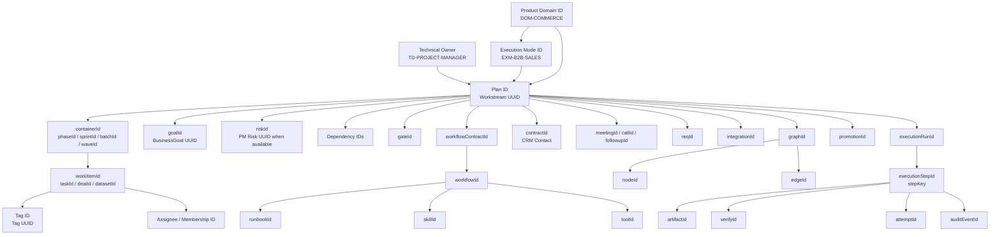

# ADR-029 — Stable identity bindings for execution plans, tags, domains and supporting references

**Status:** Proposed — documentation boundary written; schema/code implementation pending
**Date:** 2026-08-17
**Decided by:** Boss (requested design correction, owner review still required before migration)
**Relates to:** [ADR-025](ADR-025-DOMAIN-DRIVEN-DOCS-ARCHITECTURE.md), [ADR-028](ADR-028-HUMAN-VISIBLE-EXECUTION-ROADMAP.md), [FR-069](../domains/project-manager/features/FR-069-plan-blueprint-and-intake.md), [FR-070](../domains/project-manager/features/FR-070-stable-execution-domain-and-tag-identities.md), [EXECUTION-MODES.md](../EXECUTION-MODES.md), [SITEMAP-DOMAIN-NAV.md](../SITEMAP-DOMAIN-NAV.md)

## Context

The seven execution contracts currently describe mode names, labels, subtypes
and evidence, but a production plan cannot use those labels as relational
identity. The current runtime still carries `executionMode` as a string, the
Project Manager schema has no first-class Tag model, and the domain navigation
registry has route keys and display labels but no stable domain IDs.

That creates four collision risks:

1. `B2B_SALES` can be displayed as B2B Sales, B2B/ขายส่ง or Sales without a
   stable mode identity.
2. `Execution Plan` is a UI label for a Workstream, so creating a second
   `planId` risks two records for one plan.
3. A tag label such as `High`, `doc` or `blocked` can be recreated with a
   different meaning because there is no `tagId` reference.
4. A business capability domain such as Marketing or CRM can be confused with
   the technical domain that owns the execution records.

## Decision

### D1 — Every identity has an explicit axis

The system separates identity axes instead of overloading one `domainId`:

| Axis | Canonical identity | Meaning |
|---|---|---|
| Product domain | `primaryDomainId`, `supportingDomainIds[]` | Business-facing capability/domain shown in the domain map, e.g. `DOM-COMMERCE` or `DOM-MARKETING` |
| Technical owner domain | `technicalOwnerDomainId` | Code/schema ownership from a domain charter, e.g. `TD-PROJECT-MANAGER` |
| Execution mode | `executionModeId` | Stable catalog identity for one of the seven execution contracts, e.g. `EXM-B2B-SALES` |
| Execution contract | `executionContractId` | Versioned seven-mode Execution contract selected by the Project Manager; SQL/storage key is `execution_contract_id` |
| Execution Plan | `planId` | Server UUID of the owning `Workstream`; `Execution Plan` remains a UI alias, not a new model |
| Goal link | `goalId` / `goalIds[]` | Server UUID of `BusinessGoal` through `ProjectGoal`; goal code/title are projections |
| Risk link | `riskId` / `riskIds[]` | Server UUID of an authorized Project Manager Risk record; unavailable until that model exists |
| Tag | `tagId` | Server UUID of a Tag record; labels are projections, never foreign keys |
| Supporting graph | `graphId`, `nodeId`, `edgeId` | Knowledge/GKS projection identities; distinct from the generated document graph and PM work IDs |
| Evidence | `artifactId`, `verifyId` | Approved source/evidence artifact and verification occurrence identities |
| Gate | `gateId` | Existing Project Manager `Gate.id`; gate status is a projection |
| CRM Contact | `contractId` | User-defined CRM Contact identity; not an Execution or multi-agent workflow contract |
| CRM interaction | `meetingId`, `callId`, `followupId` | Meeting, call and follow-up occurrence identities; distinct from Project Manager work IDs |
| Requirement reference | `reqId` | Declared FR/NFR/BR/SEC/SDD/FEAT key; not a transport request occurrence |
| Integration | `integrationId` | Adapter/bridge identity; legacy `intId` normalizes to this field |
| Multi-agent workflow contract | `workflowContractId` | Contract for multi-agent roles, handoffs, inputs, outputs, tools, failure handling and approval |
| Workflow | `workflowId` | Selected workflow definition governed by `workflowContractId` |
| Runbook | `runbookId` | Concrete operational procedure selected by a workflow; distinct from `workflowId` |
| Knowledge promotion | `promotionId` | Governed candidate-to-canonical promotion occurrence; distinct from fact and execution identities |
| Agent capability | `skillId`, `toolId` | Allow-listed capability references; Agent consumes them and owns no PM model |
| Entity | `projectId`, `workstreamId`, `containerId`, `workItemId` | Server UUIDs for the records created by the Project Manager domain |

### D2 — Domain IDs are stable catalog IDs, not labels or route keys

Product domain IDs are defined in the accepted sitemap and map to the existing
route keys without changing those keys:

```text
DOM-COMMERCE    → route key commerce  → Commerce
DOM-CRM         → route key customer  → CRM
DOM-MARKETING   → route key growth    → Marketing
DOM-OPERATIONS  → route key operations→ Operations
DOM-PEOPLE      → route key people    → HR / People
DOM-DEVELOPMENT → route key projects  → Development
DOM-PLATFORM    → route key platform  → Platform
DOM-BUSINESS-HOME → route key business-home → Business Home (shell projection)
```

`DOM-BUSINESS-HOME` is a cross-domain shell projection. It may aggregate a
Project's status but cannot own an execution plan or be selected as an execution
plan's primary capability domain.

Technical owner IDs come from charters:

```text
TD-PROJECT-MANAGER → domain: project-manager → owns Project/Workstream/WorkItem/Tag attachment
TD-CRM             → domain: crm             → owns Person/Customer/Conversation/Message
TD-IDENTITY        → domain: identity        → owns identity and viewer contracts
TD-KNOWLEDGE       → domain: knowledge       → owns governed knowledge records
TD-AGENT           → domain: agent           → owns agent runtime boundary, no Prisma work models
```

All seven execution-plan records have `TD-PROJECT-MANAGER` as their technical
owner. A B2B Sales plan may reference `DOM-COMMERCE` and `DOM-CRM`, but that does
not transfer ownership of its Workstream or WorkItems to those domains.

### D3 — Execution mode has a canonical ID and a compatibility alias

The canonical mode registry uses immutable IDs:

| Execution mode ID | Existing enum alias | Contract |
|---|---|---|
| `EXM-SOFTWARE-SPRINT` | `SOFTWARE_SPRINT` | Software Sprint |
| `EXM-DATA-MIGRATION` | `DATA_MIGRATION` | Data Migration |
| `EXM-B2B-SALES` | `B2B_SALES` | B2B Sales |
| `EXM-B2C-CAMPAIGN` | `B2C_CAMPAIGN` | B2C Campaign |
| `EXM-PRODUCT-LAUNCH` | `PRODUCT_LAUNCH` | Product Launch |
| `EXM-OPERATIONS` | `OPERATIONS` | Operations |
| `EXM-BUSINESS-EXPANSION` | `BUSINESS_EXPANSION` | Business Expansion |

`executionModeId` is the new canonical reference. The existing
`executionMode` value is a compatibility alias during envelope migration; the
server resolves it through this registry and never stores a new, arbitrary mode
label. The progress strategy, container subtypes, item subtypes and metric keys
come from the resolved ID's contract.

### D4 — Execution Plan is the Workstream identity

The product label `Execution Plan` maps to the existing `Workstream`:

```text
planId       = workstream.id       // server UUID after commit
planCode     = workstream.code     // stable human/reference code
projectId    = workstream.projectId
executionModeId
primaryDomainId
supportingDomainIds[]
technicalOwnerDomainId = TD-PROJECT-MANAGER
```

No `ExecutionPlan` table is introduced. In an import envelope, `code` values are
temporary reference keys used for dry-run and dependency resolution. After
commit, the server returns UUIDs and all read models expose both the UUID and
the human code.

### D4a — Every work period has a canonical container ID

Phase, Sprint, Stage, Batch, Wave, Period, Process, Initiative and Site are
mode-specific names for `WorkContainer` subtypes. Their IDs are aliases of the
same canonical `containerId = WorkContainer.id`:

```text
releaseId / sprintId / epicId / stageId / batchId / pipelineId / phaseId
  / campaignId / waveId / channelId / periodId / processId / initiativeId
  / siteId
  = containerId
```

The alias is accepted only when the subtype matches. The same rule applies to
work-item aliases such as `taskId`, `dealId`, `datasetId`, `deliverableId` and
`approvalId`, which all resolve to `workItemId = WorkItem.id`. Generic APIs use
`containerId`/`workItemId` plus subtype; Human-facing mode views may use the
typed alias.

Every period read model also carries `projectId`, `planId`, `containerId`, its
typed alias, `parentContainerId`, `subtype` and `code`. Here
`parentContainerId` is the read-model name for the existing
`WorkContainer.parentId`; a root period returns `null`. Work-item read models
carry `projectId`, `planId`, `containerId`, `workItemId`, the typed item alias,
`subtype` and `code`. This keeps Roadmap, Structure Plan, Board, Schedule and
Dependency Map on the same node identity.

### D5 — Tags are references, not labels

Every attached tag is represented as:

```text
tagRef = {
  tagId,
  tagCode,       // read projection / diagnostics, never the FK
  label,         // read projection, never the FK
  ownerDomainId, // TD-PROJECT-MANAGER
  productDomainId?
}
```

The committed mutation requires `tagId`. A Human creating a new tag first
creates the Tag record and then attaches its returned ID. An Agent may propose a
tag code during dry-run, but the preview must resolve it to an existing `tagId`
or ask for explicit Tag creation before commit. A raw label cannot silently
create a new tag or attach to a different domain's tag.

### D6 — Every execution plan has a domain binding

The binding is explicit and auditable:

```text
domainBinding = {
  primaryDomainId,
  supportingDomainIds[],
  technicalOwnerDomainId
}
```

The mode-to-domain map is defined in FR-070. It distinguishes a default domain
from an allowed user-selected domain for cross-domain modes. `B2B_SALES` maps to
Commerce as primary and CRM as supporting — not Marketing by default. A
`B2C_CAMPAIGN` maps to Marketing as primary and CRM as supporting. Operations
maps to Operations. Cross-domain modes must record the Human-selected binding
when the default is not truthful.

### D7 — IDs are resolved before authorization and commit

The intake pipeline becomes:

```text
Human form / Agent envelope
  → normalize legacy labels to catalog IDs
  → resolve domainId, executionModeId, plan refs, goalId/riskId refs, tagId refs and supporting identity refs
  → reject unknown/unauthorized refs
  → dry-run + conflict check
  → Human-visible preview showing IDs and labels
  → transactional commit to existing models
  → AuditEvent with entityId, executionModeId, domain IDs and tag IDs
```

Unknown IDs, mismatched mode/domain bindings, unresolved goal/risk/tag references
and cross-domain assignments without authority fail closed. No client-selected
label or route key is an authorization input. A missing first-class Risk model
returns `unavailable`; it does not permit a client-created `riskId`.

### D8 — Business identity and execution-trace identity are separate

The plan graph answers which business object is being worked on:

```text
projectId
  ├→ goalId / goalIds[]
  ├→ riskId / riskIds[]
  └→ planId → containerId → workItemId → tagId
```

The trace graph answers which contract run and step handled it:

```text
executionContractId → executionRunId → executionStepId → attemptId → auditEventId
```

Every common intake step and every mode-specific evidence step carries the
applicable project/plan/container/item/goal/risk IDs plus the trace IDs. `stepKey` is the stable semantic
catalog key; `executionStepId` is the unique occurrence. A sequence number is
ordering metadata only and can never replace the step ID.

### D9 — Tags, failures and replay attach to the exact step

An execution step may carry `tagIds[]`, but a tag is not the failure record.
`FAILED` requires `failureCode`, `errorRef`, `retryable` and `auditEventId`.
Downstream steps are explicitly `SKIPPED` or `NOT_STARTED` so the first failed
step is observable. Full and partial replay creates new run/step/attempt IDs,
records `replayOfExecutionRunId`/`replayOfExecutionStepId`, revalidates the
contract/version/authorization/input hash, retains applicable `goalId`/`riskId`
business context and never mutates the original trace.

### D10 — Supporting identities are typed references, not a second graph

The requested supporting IDs are normalized through one registry shared by the
Human Roadmap, the seven execution contracts, Agent import and the data-pipeline
lineage:

| Storage ID | API/event ID | Meaning | Owner/status |
|---|---|---|---|
| `node_id` | `nodeId` | one Knowledge/GKS graph node | target; current project graph exposes generic `id` only |
| `edge_id` | `edgeId` | one Knowledge/GKS graph relationship | target; current project graph has no stable edge ID |
| `artifact_id` | `artifactId` | approved source/evidence artifact | target; `FileAsset.id`/hash/path are not aliases |
| `contract_id` | `contractId` | CRM Contact context | target; not `execution_contract_id` or `workflow_contract_id`, no Contact model yet |
| `meeting_id` | `meetingId` | CRM meeting occurrence | target; distinct from Milestone and Gate |
| `call_id` | `callId` | CRM call/interaction occurrence | target; distinct from Conversation and execution run |
| `followup_id` | `followupId` | CRM follow-up action/reminder | target; distinct from Project Manager WorkItem |
| `req_id` | `reqId` | declared requirement/feature reference | resolves to an existing `FR-*`/`NFR-*`/`BR-*`/`SEC-*`/`SDD-*`/`FEAT-*` key; not a transport request ID |
| `verify_id` | `verifyId` | verification result/decision occurrence | target; distinct from artifact, step and audit IDs |
| `gate_id` | `gateId` | Project Manager Gate record | existing `Gate.id` |
| `integration_id` | `integrationId` | Integration adapter/bridge | target; legacy `int_id` is a compatibility alias only, not Intent |
| `int_id` | `intId` (legacy input only) | compatibility alias for Integration | normalize one-to-one to `integration_id`; never persist or emit as the canonical field |
| `graph_id` | `graphId` | graph/projection containing nodes and edges | target Knowledge/GKS identity |
| `workflow_contract_id` | `workflowContractId` | multi-agent workflow contract | target contract for roles, handoffs, inputs, outputs, tools, failure handling and approval |
| `workflow_id` | `workflowId` | workflow definition | target selected workflow identity governed by `workflow_contract_id`; concrete procedure is `runbook_id` |
| `runbook_id` | `runbookId` | concrete workflow procedure | target selected runbook; distinct from `workflow_id` |
| `promotion_id` | `promotionId` | governed knowledge promotion occurrence | target promotion ledger identity; distinct from `fact_id`, `knowledge_id` and execution trace IDs |
| `skill_id` | `skillId` | allow-listed Agent skill | target Agent capability identity |
| `tool_id` | `toolId` | allow-listed Agent tool | target Agent capability identity; tool name is not the ID |

All rows are optional by mode and lifecycle step, but when present they must be
resolved by the owning service before authorization and commit. Unknown,
cross-scope or owner-unavailable references fail closed for writes and are
explicitly `unavailable` on reads. None of these references grants authority.

`execution_contract_id` is the seven-mode Execution contract and is deliberately
separate from `workflow_contract_id`, the multi-agent workflow contract.
`contract_id` is CRM Contact by product contract. `integration_id` is the
canonical Integration identity; `int_id` is a compatibility alias only and is
not an Intent identity. `req_id` is a declared requirement reference, while
`runbook_id` is a concrete procedure and `promotion_id` is a governed
promotion occurrence. These meanings are fixed before code or schema work.

## Identity graph



## Rejected alternatives

| Alternative | Rejection reason |
|---|---|
| Store display labels as foreign keys | Labels change and already have multiple synonyms |
| Add a new `ExecutionPlan` table beside Workstream | Creates two identities for the same UI concept |
| Use `executionMode` string as the permanent identity | It is a legacy enum alias, not a catalog ID |
| Attach tags by `label` or `tagCode` only | Allows duplicate meanings and cross-domain collisions |
| Treat B2B Sales as Marketing because it is an Agent plan | Sitemap places B2B/wholesale under Commerce; CRM is supporting identity/data context |
| Use Business Home as the execution domain | Business Home is a non-owning cross-domain projection |
| Treat `contract_id` as a document or execution contract | Product contract defines `contract_id` as CRM Contact; it must remain distinct from both contract families |
| Collapse `execution_contract_id` and `workflow_contract_id` | Execution mode behavior and multi-agent orchestration have different owners, versions and lifecycles |
| Treat `int_id` as a canonical Intent identity | `integration_id` is the canonical Integration key; `int_id` survives only as a compatibility alias |
| Treat `req_id` as a transport request ID | Transport correlation/idempotency IDs already own that concern; `req_id` resolves to a declared requirement/feature key |
| Collapse `workflow_id` and `runbook_id` | A workflow selects/orchestrates a concrete procedure; the two identities have different owners and lifecycles |
| Treat `promotion_id` as `fact_id` or `knowledge_id` | Promotion is an occurrence; fact and destination projection identities must remain stable across promotion/replay |
| Derive graph/evidence IDs from labels, hashes or edge endpoints | Projections can change and do not provide stable, owner-authorized identity |

## Implementation boundary

This ADR defines the identity contract only. It does not yet add Prisma models,
migrations, schema version 1.2, execution-trace persistence, route changes or authorization grants. Those
changes require the FR-070 implementation plan and owner approval. Until then,
the existing string fields remain compatibility input, while new documentation
must not describe them as the final production identity model.
