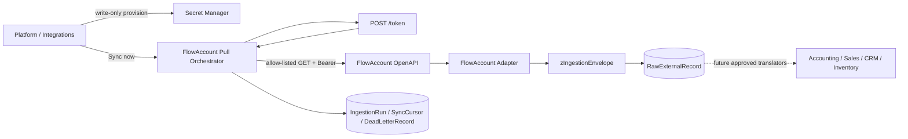

# ADR-039 — FlowAccount read-only pull pipeline and credential provisioning

**Status:** Candidate — เอกสารออกแบบรออนุมัติ; ยังไม่อนุญาตให้แก้ code, schema, secret manager หรือเรียก FlowAccount ด้วย credential จริง

| Field | Value |
|---|---|
| Tech Lead | ATHER |
| Product Owner | Boss |
| Domain owner | Integration |
| Requirement | FR-094 |
| Risk | HIGH |
| Complexity | C-3 — Architecture-driven |
| Target size | Medium, ประมาณ 3–4 สัปดาห์หลังอนุมัติและได้รับ Sandbox credential |

## 1. บริบทและปัญหา

Zuri มี Integration Platform, raw-ingestion substrate และหน้า
`/platform/integrations` อยู่แล้ว แต่ implementation ปัจจุบันสร้างได้เฉพาะ
Phase 1 model-provider metadata และรับเพียง opaque reference รูปแบบ
`supabase-vault:<uuid>` ตาม ADR-032/FR-080 หน้าเว็บจึงยังไม่สามารถ onboard
FlowAccount, ทดสอบ credential, ดึงข้อมูล, แสดง run หรือบอกจุดที่ sync ล้มเหลวได้

เป้าหมายคือเชื่อม FlowAccount ของ Business หนึ่งแห่งเข้ากับ Zuri ผ่านหน้า
Integration ที่ผู้มีสิทธิ์กรอกค่าตามที่ FlowAccount ออกให้ จากนั้นระบบดึงข้อมูล
แบบ read-only เข้าสู่ `RawExternalRecord` ด้วย provenance, idempotency, cursor,
run counter และ dead-letter ที่ตรวจสอบย้อนหลังได้

ข้อมูล FlowAccount มีข้อมูลผู้ติดต่อ ภาษี เอกสาร และจำนวนเงิน จึงเป็นทั้ง PII และ
financial data การทำเป็นฟอร์มธรรมดาที่บันทึก key ลง Prisma/browser storage หรือ
การแปลง payload เป็น Accounting truth โดยตรงไม่ผ่านข้อกำหนดด้านความปลอดภัยและ
domain ownership ของระบบ

## 2. ข้อเท็จจริงที่ยืนยันจาก FlowAccount

ตรวจเมื่อ 2026-08-20 จากเอกสารทางการและ OpenAPI specification ปัจจุบัน:

1. FlowAccount เปิด HTTPS REST OpenAPI ที่
   `https://openapi.flowaccount.com/test` สำหรับ Sandbox และ
   `https://openapi.flowaccount.com/v1` สำหรับ Production
2. Client Credentials Flow เป็นแบบ 1 Client ต่อ 1 บริษัท FlowAccount และใช้
   `POST /token` แบบ `application/x-www-form-urlencoded` โดยส่ง
   `grant_type=client_credentials`, `scope=flowaccount-api`, `client_id` และ
   `client_secret` ตารางและตัวอย่าง JavaScript SDK ยืนยันค่านี้ แต่ curl snippet
   ในหน้า Client Credentials ปัจจุบันพิมพ์ `grant_type=refresh_token` ซึ่งขัดกับ
   เนื้อหาในหน้าเดียวกัน จึงถือเป็น provider-doc discrepancy และต้องยืนยันกับ
   Sandbox contract test ก่อน implementation
3. token ที่ได้เป็น Bearer `access_token`; โดยทั่วไป `expires_in=86400`
   วินาที และ FlowAccount แนะนำให้นำ token เดิมมาใช้จนใกล้หมดอายุแทนการขอใหม่
   ทุก request
4. OpenID Flow เป็นเส้นทาง Partner แบบ 1 Partner Client ต่อหลายบริษัท ผู้ใช้
   login และเลือกบริษัทที่อนุญาต ใช้ authorization code, registered
   `redirect_uri`, `state`, `offline_access` และ refresh token ที่หมุนค่าใหม่ทุก
   ครั้ง โดยทั่วไป refresh token มีอายุ 30 วัน
5. list API ส่งข้อมูล JSON ผ่าน `GET` และแบ่งหน้าด้วย `currentPage` /
   `pageSize`; FlowAccount จำกัด `pageSize` สูงสุด 200 รายการ
6. ตั้งแต่ 2026-07-09 rate limit คือ Sandbox 20 requests/minute และ Production
   100 requests/minute ต่อบัญชี เมื่อเกินจะได้ HTTP 429 และ FlowAccount แนะนำ
   exponential backoff
7. การ enumerate OpenAPI specification ปัจจุบันพบ 130 paths และไม่พบ webhook
   หรือ callback contract ดังนั้น V1 ต้องเป็น server-initiated pull ไม่อ้างว่า
   FlowAccount push event เข้ามา
8. public read surface ครอบคลุมเอกสารขาย/ซื้อ ค่าใช้จ่าย ภาษีหัก ณ ที่จ่าย
   Contacts, Products, Company Info, Chart of Accounts และ Bank Channels บางส่วน
   แต่ไม่มี read endpoint สำหรับ Journal Entry, General Ledger, Trial Balance
   หรือ Profit & Loss จึงห้ามใช้ pipeline นี้เป็นหลักฐานว่า Zuri มีชุดบัญชีหรือ
   กำไรสุทธิครบถ้วน

แหล่งอ้างอิงทางการ:

- [ภาพรวมการเชื่อมต่อ FlowAccount OpenAPI](https://developers.flowaccount.com/tutorial/connect-open-api)
- [Client Credentials Flow](https://developers.flowaccount.com/tutorial/connect/client-credentials-flow/)
- [JavaScript SDK authentication example](https://developers.flowaccount.com/tutorial/how-to-use-sdk/example-java-script-sdk/)
- [OpenID Flow](https://developers.flowaccount.com/tutorial/connect/open-id-flow)
- [FlowAccount OpenAPI specification](https://developers.flowaccount.com/swagger.yml)
- [Rate limit policy, 2026-07-08](https://developers.flowaccount.com/announcements/Jul-08-2026)
- [Pagination limit, 2026-05-29](https://developers.flowaccount.com/announcements/May-29-2026)

## 3. เป้าหมาย

- เพิ่ม provider `FLOWACCOUNT` เป็น Business-scoped `DATA_SOURCE`
- เพิ่มหน้า onboarding สำหรับกรอก Client ID/Client Secret แบบ write-only
- ทดสอบ token และ `GET /company/info` ก่อนเปิด connection
- ดึงข้อมูลแบบ read-only ผ่าน allow-listed endpoints เท่านั้น
- ส่ง payload ทุก record เข้าสู่ FR-081 `zIngestionEnvelope` และ
  `RawExternalRecord` path เดิม
- รองรับ initial full pull, incremental pull, run counters, cursor, retry และ
  dead-letter โดยไม่ทำข้อมูล raw สูญหาย
- แสดง connection health, last successful sync, resource progress และ failure
  reason โดยไม่แสดง secret/token/raw financial payload
- แยก external evidence ออกจาก Accounting/CRM/Sales truth อย่างชัดเจน

## 4. สิ่งที่ไม่อยู่ในขอบเขต V1

- การสร้าง แก้ไข ลบ อนุมัติ ชำระเงิน หรือเปลี่ยนสถานะเอกสารใน FlowAccount
- OpenID Partner onboarding หลายบริษัท
- webhook, realtime sync หรือการสมมติว่า FlowAccount มี webhook
- scheduler อัตโนมัติ; V1 มี `Sync now` และ `Full reconciliation` แบบผู้ใช้สั่ง
- attachment และ PDF export
- Bank Channel data ซึ่งมีความอ่อนไหวสูงกว่าและยังไม่มี use case ที่อนุมัติ
- การอ่าน Journal Entry, GL, TB, P&L หรือประกาศว่าคำนวณกำไรสุทธิได้
- การแปลง raw record เป็น Accounting, Sales, CRM หรือ Inventory truth; แต่ละ
  owner domain ต้องมี FR/contract และ approval ของตนก่อน
- การลบ raw evidence; retention/deletion ต้องเป็นนโยบายแยกต่างหาก

## 5. การตัดสินใจสถาปัตยกรรม

### D1 — V1 ใช้ Client Credentials ต่อหนึ่ง Business

V1 เลือก Client Credentials เพราะเป็น flow ที่ FlowAccount ระบุสำหรับลูกค้า
ทั่วไปแบบ 1 Client ต่อ 1 บริษัท และตรงกับ `IntegrationConnection.businessId`
ในปัจจุบัน

ค่าที่ผู้ใช้กรอก:

| Field | Required | Storage/handling |
|---|---:|---|
| Connection name | yes | Prisma metadata |
| Environment (`SANDBOX`/`PRODUCTION`) | yes | Prisma metadata; server maps base URL from allow-list |
| Client ID | yes | secret bundle only; response shows masked fingerprint |
| Client Secret | yes | write-only secret bundle; never returned |
| Backfill start date | yes | Prisma metadata/cursor policy |
| Resource groups | yes | allow-listed metadata |

`grant_type` และ `scope` เป็นค่าคงที่ของ adapter ไม่ใช่ช่องกรอก เพื่อป้องกัน
configuration drift ส่วน custom base URL ถูกห้ามเพื่อปิด SSRF

OpenID เป็น V2 สำหรับ partner/multi-company และต้องมี ADR เพิ่มเติมเรื่อง
redirect URI, state/PKCE posture, consent, rotating refresh token และ account
unlink; ห้ามเพิ่ม refresh-token text box ลงใน V1

### D2 — หน้า FlowAccount เป็น provider-specific wizard ใต้ Platform Integrations

คงหน้า `/platform/integrations` เป็น list/health authority เดิม และเพิ่ม
`/platform/integrations/flowaccount/new` เป็น wizard เดียว:

1. **Business & environment** — แสดง Business ที่ trusted viewer เลือกแบบ
   read-only, ชื่อ connection และ Sandbox/Production
2. **Credentials** — Client ID และ password field สำหรับ Client Secret;
   ปิด autocomplete ที่ไม่เหมาะสม, ไม่บันทึกใน local/session storage และล้าง
   component state เมื่อ submit/unmount
3. **Data scope** — resource groups และ backfill start date พร้อมข้อความว่า
   public API ไม่ใช่ full ledger
4. **Review & connect** — สรุป scope โดยไม่สะท้อน secret แล้วส่งครั้งเดียวผ่าน
   TLS ไปยัง server-owned provisioner

```text
┌─ Platform / Integrations / FlowAccount ───────────────────────────┐
│ Business          SmartGift (trusted scope, read-only)            │
│ Connection name   [ FlowAccount - SmartGift                  ]    │
│ Environment       (•) Sandbox   ( ) Production                    │
│                                                                  │
│ Client ID         [ ........................................ ]    │
│ Client Secret     [ •••••••••••••••••••••••••••••••••••••• ]    │
│                  ค่า secret จะไม่แสดงอีกหลังบันทึก               │
│                                                                  │
│ Backfill from     [ 2026-01-01 ]                                 │
│ Resources         [x] Company  [x] Contacts  [x] Products        │
│                   [x] Sales docs  [x] Purchase/expense docs      │
│                                                                  │
│ [Cancel]                       [Test and connect]                 │
└──────────────────────────────────────────────────────────────────┘

หลังเชื่อม: [DEGRADED — ยังไม่เคย sync] [Sync now] [Full reconcile]
            Last success — · 429 — · Dead letters —
```

ผลลัพธ์หลังเชื่อมแสดงเฉพาะ company name, FlowAccount `companyId`, environment,
resource scope, masked Client ID fingerprint, credential version, last test,
last successful sync และ computed health

### D3 — Browser ส่ง secret แบบ write-only ไปยัง provisioner; Prisma เก็บแต่ reference

FlowAccount wizard เป็นการทำให้ deferred `SecretManagerProvisionPort` ของ
ADR-032 ใช้งานจริงเฉพาะ provider นี้ ไม่เปลี่ยน generic FR-080 form ให้รับ raw
secret

```text
Browser password field
  -> owner-scoped server route over TLS
  -> SecretManagerProvisionPort
  -> Supabase Vault secret bundle { clientId, clientSecret }
  -> opaque secretRef in IntegrationCredential
```

- route ไม่ log request body และ response ไม่มี secret, access token, full Vault
  reference หรือ authorization header
- audit บันทึกเพียง Business, provider, environment, connection id,
  credential version และผลสำเร็จ/ล้มเหลวแบบ redacted
- server แลก token และ cache ใน memory จนถึง `expires_in - 5 minutes`; token ไม่
  ถูก persist ใน Prisma, raw payload หรือ audit
- การ rotate สร้าง Vault version ใหม่และสลับ reference แบบ compare-and-swap;
  ค่าเดิมไม่ถูกส่งกลับ
- ถ้า Vault write สำเร็จแต่ metadata transaction ล้มเหลว provisioner ต้อง revoke
  orphan version หรือบันทึก cleanup receipt; ห้ามปล่อย orphan แบบมองไม่เห็น

### D4 — Connection identity และ company verification

ใช้ค่า:

```text
provider.code        = FLOWACCOUNT
connection.kind      = DATA_SOURCE (computed/read-model classification)
authorizationType    = OAUTH2_CLIENT_CREDENTIALS
purpose              = ACCOUNTING_DATA_PULL
externalAccountId    = companyId จาก GET /company/info หลัง test สำเร็จ
```

`companyId`, `companyTaxId` และ document/contact/product ids เป็น external
identifiers เท่านั้น ไม่เป็น primary key ของ Zuri หาก FlowAccount record ไม่มี
stable external id adapter ต้องส่งเข้า dead letter ด้วย
`FLOWACCOUNT_EXTERNAL_ID_MISSING` แทนการสร้าง id จาก page/row position

หนึ่ง Business มีได้หนึ่ง ACTIVE FlowAccount connection ต่อ
`provider + externalAccountId + purpose`; connection ใหม่เริ่มที่ `DRAFT` และ
เปลี่ยนเป็น `ACTIVE` หลัง token exchange กับ company verification สำเร็จเท่านั้น

### D5 — ใช้ pull adapter เหนือ FR-081 raw-ingestion path เดิม



adapter ต้องเรียก `ingestRawExternalRecord` เดิม ไม่สร้าง persistence path ที่สอง
ทุก envelope ระบุ trusted Tenant/Business/connection จาก server scope,
`provider=FLOWACCOUNT`, `sourceType=PULL`, lane, entity type, external id,
schema version, source URI ที่ไม่มี credential, payload และ payload hash

### D6 — Resource catalog V1 เป็น allow-list แบบ read-only

| Resource code | FlowAccount GET | Lane | External ID | Pull strategy |
|---|---|---|---|---|
| `COMPANY_INFO` | `/company/info` | BUSINESS | `companyId` | full snapshot |
| `CONTACTS` | `/contacts` | CUSTOMER | provider contact id | full paginated hash reconciliation |
| `PRODUCTS` | `/products` | PRODUCTION_SUPPLY | provider product id | full paginated hash reconciliation |
| `QUOTATIONS` | `/quotations` | SALES | `documentId`/`recordId` | date-window + pagination |
| `BILLING_NOTES` | `/billing-notes` | SALES | `documentId`/`recordId` | date-window + pagination |
| `TAX_INVOICES` | `/tax-invoices` | ACCOUNTING | `documentId`/`recordId` | date-window + pagination |
| `RECEIPTS` | `/receipts` | ACCOUNTING | `documentId`/`recordId` | date-window + pagination |
| `CASH_INVOICES` | `/cash-invoices` | ACCOUNTING | `documentId`/`recordId` | date-window + pagination |
| `PURCHASE_ORDERS` | `/purchases-orders` | PRODUCTION_SUPPLY | `documentId`/`recordId` | date-window + pagination |
| `PURCHASES` | `/purchases` | PRODUCTION_SUPPLY | `documentId`/`recordId` | date-window + pagination |
| `EXPENSES` | `/expenses` | ACCOUNTING | `documentId`/`recordId` | date-window + pagination |
| `WITHHOLDING_TAXES` | `/withholding-taxes` | ACCOUNTING | provider record id | date-window + pagination |
| `CHART_OF_ACCOUNTS` | `/chart-of-accounts/accounts` | ACCOUNTING | provider account id/code | full snapshot |

เริ่มต้นเปิด `COMPANY_INFO` เสมอเพื่อยืนยันบริษัท Resource อื่นเป็น explicit
selection และระบบไม่เรียก POST/PUT/DELETE แม้ OpenAPI จะมี operation เหล่านั้น

### D7 — Cursor ไม่แสร้งว่ามี updated-since ที่ FlowAccount ไม่ได้ประกาศ

เอกสาร list รองรับ date filter ของเอกสาร ไม่ได้ประกาศ cursor หรือ `updatedSince`
ทั่วไป ดังนั้น:

- initial sync ใช้ `backfillStartDate..today`, `pageSize=200`
- incremental sync ใช้ watermark พร้อม configurable lookback เริ่มต้น 7 วัน
  เพื่อจับเอกสารที่แก้ย้อนหลัง แล้วให้ FR-081 payload hash ตัดสิน
  `CREATED/UNCHANGED`
- Contacts, Products, Company Info และ Chart of Accounts ทำ full snapshot ทุก
  manual sync เพราะไม่มี documented update cursor
- `SyncCursor` เลื่อนได้ต่อเมื่อ resource run จบครบทุกหน้าและไม่มี failure ที่ทำ
  ให้ผลไม่สมบูรณ์; partial success ห้ามเลื่อน cursor
- `Full reconciliation` เป็น action แยกที่สแกนช่วงที่ผู้ใช้ยืนยัน และใช้
  idempotency path เดิม

### D8 — Rate limiting, retry และ failure semantics

- account-wide limiter ตั้งเป้าสูงสุด 15 req/min Sandbox และ 80 req/min
  Production เพื่อเหลือ headroom จากเพดาน 20/100
- HTTP 429, 502, 503 และ 504 retry ด้วย exponential backoff + jitter ภายใน
  bounded attempt budget; 400/401 และ provider body ที่มี `error` ไม่ retry แบบ
  blind
- token endpoint อาจตอบ HTTP 200 พร้อม `error`; adapter ต้องตรวจ body ไม่ใช้
  status code อย่างเดียว
- แต่ละ resource เปิด `IngestionRun` ของตนเองและบันทึก fetched/created/
  unchanged/failed counts
- record failure สร้าง `DeadLetterRecord`; page/network failure ทำ run เป็น FAILED
  พร้อม safe error code และ cursor เดิม
- การกด sync ซ้ำเป็น recovery mechanism ของ V1; raw idempotency ป้องกัน duplicate

### D9 — Health ของ DATA_SOURCE คำนวณจากหลักฐานจริง

ใช้ vocabulary เดิม `CONNECTED · DEGRADED · ERROR · DISABLED · MISCONFIGURED`
แต่ DATA_SOURCE ไม่ใช้ inbound-traffic silence แบบ CHANNEL:

- `MISCONFIGURED`: credential/reference/resource scope ไม่ครบ
- `DISABLED`: connection ไม่ ACTIVE
- `ERROR`: test ล่าสุดหรือ run ล่าสุดล้มเหลว
- `DEGRADED`: test ผ่านแต่ยังไม่เคย sync หรือ last success เก่าเกิน policy
- `CONNECTED`: company verification ผ่านและมี successful run ภายใน policy

health คำนวณจาก connection/credential/run/cursor evidence ไม่เก็บเป็น status
snapshot แยก

### D10 — Raw evidence ไม่ใช่ Accounting truth

`RawExternalRecord` เก็บสิ่งที่ FlowAccount ตอบกลับพร้อม provenance และ hash
เท่านั้น ไม่เขียนตาราง Accounting/CRM/Sales/Inventory และไม่คำนวณ revenue,
gross profit หรือ net profit จากการมีเอกสารบางประเภท

translator ในอนาคตต้อง:

1. เป็นของ owner domain ที่รับข้อมูล
2. resolve trusted raw record ผ่าน scope-bound read port
3. มี mapping/version/conflict/validation contract ของตนเอง
4. สร้าง `ExternalEntityRef` โดยไม่เปลี่ยน raw evidence
5. แสดง missing source classes (เช่น GL/TB/P&L) ก่อนทำ financial claim

## 6. Internal API contract ที่เสนอ

| Method | Path | Contract |
|---|---|---|
| `POST` | `/api/platform/integrations/flowaccount` | owner-scoped write-only provision + token/company test + DRAFT/ACTIVE metadata; response redacted |
| `POST` | `/api/platform/integrations/{id}/test` | resolve stored secret, exchange token, call company info; no raw secret input/output |
| `POST` | `/api/platform/integrations/{id}/sync` | enqueue/start one manual sync request, returns run references only |
| `GET` | `/api/platform/integrations/{id}/runs` | authorized run/resource/cursor/dead-letter summary; no raw payload |
| `POST` | `/api/platform/integrations/{id}/disable` | disable future pulls and revoke/invalidate runtime token cache; audited |

`businessId` ที่ browser ส่งเพื่อเลือกบริบทเป็น routing hint เท่านั้น server ต้อง
re-resolve viewer และ `ownsBusiness` ก่อนอ่าน connection หรือเรียก external API
ทุกครั้ง id ของ connection ภายนอก scope ตอบเหมือนไม่มีอยู่

### Safe create request

```json
{
  "businessId": "business-routing-hint",
  "connectionName": "FlowAccount - SmartGift",
  "environment": "SANDBOX",
  "clientId": "write-only",
  "clientSecret": "write-only",
  "backfillStartDate": "2026-01-01",
  "resourceCodes": ["COMPANY_INFO", "CONTACTS", "PRODUCTS", "TAX_INVOICES", "EXPENSES"]
}
```

### Safe create response

```json
{
  "id": "internal-uuid",
  "provider": "FLOWACCOUNT",
  "kind": "DATA_SOURCE",
  "environment": "SANDBOX",
  "externalAccountId": "123456",
  "companyName": "Example Co., Ltd.",
  "credential": {
    "configured": true,
    "version": 1,
    "clientIdMasked": "abcd...wxyz"
  },
  "status": "ACTIVE",
  "health": {
    "state": "DEGRADED",
    "reasons": ["NO_SUCCESSFUL_SYNC"]
  }
}
```

## 7. ความปลอดภัยและข้อมูลส่วนบุคคล

- Client Secret, access token, authorization code/refresh token (V2), full Vault
  ref, tax ID, contact data และ document payload ห้ามเข้า log/audit/error message
- server endpoints และ environment เป็น allow-list คงที่; redirect ถูกปิดสำหรับ
  provider calls เพื่อไม่ให้ Bearer token หลุดไป host อื่น
- outbound client บังคับ TLS, timeout, response-size limit และ JSON content type
- connection/read/run routes ใช้ trusted viewer และ Business isolation ก่อน external
  call; client payload ไม่เลือก Tenant หรือขยาย scope
- browser ไม่ได้รับ raw `RawExternalRecord` ใน V1; run view เป็น redacted summary
- SQLite raw financial evidence ต้องอยู่ใน managed application DB และไม่ถูก export,
  backup หรือส่งเข้า prompt โดยปริยาย; hosted/Postgres path ต้องมี forced RLS และ
  least-privilege role ก่อนใช้งานจริง
- การ disconnect ไม่ลบ raw evidence; การลบ/retention ต้องมี policy, approval และ
  audit แยก

## 8. Observability

| Signal | แสดง/แจ้งเตือน |
|---|---|
| token exchange failures | safe provider error code, count, last occurrence |
| requests / minute | current limiter budget per connection/environment |
| HTTP 429 count | DEGRADED หลังเกิน threshold; แสดง retry-after/backoff state แบบไม่เผย header ลับ |
| run duration/counts | fetched, created, unchanged, failed ต่อ resource |
| cursor lag | last successful watermark และ resource ที่ค้าง |
| dead letters | count by safe error code/stage, no raw payload |
| last test / last success | input หลักของ DATA_SOURCE health |

correlation ID หนึ่งค่าผูก user action, external calls, IngestionRun, raw records,
dead letters และ AuditEvent โดย emitter ใช้ allow-list ตาม SDD-048

## 9. Testing strategy และ acceptance evidence

### Unit

- token request encoding, 200-with-error handling, expiry-minus-skew cache
- fixed environment/base URL และ redirect/SSRF rejection
- page iterator 200 rows, empty page, malformed provider response
- account-wide limiter, 429 exponential backoff+jitter, bounded retry
- date-window/lookback, cursor advances only after complete success
- resource-to-lane/entity/external-id mapping และ missing-id dead letter
- redaction snapshots: secret/token/full Vault ref ไม่ปรากฏ

### Integration

- owner Business A สร้าง/test/sync Business A ได้ แต่หา Business B ไม่พบ
- Vault provision success + DB failure cleanup; rotation CAS conflict
- initial/incremental/full sync เข้าสู่ `RawExternalRecord` path เดียว
- same external payload เป็น `UNCHANGED`; changed payload เป็น raw version ใหม่
- partial page failure ไม่เลื่อน cursor และสร้าง run/dead-letter evidence
- FlowAccount adapter ไม่มี write method และ reject resource นอก allow-list

### E2E

- wizard loading/validation/error/success, keyboard flow และ WCAG 2.2 AA
- secret ถูกล้างหลัง submit และไม่อยู่ใน DOM, URL, browser storage หรือ response
- connection row แสดง DATA_SOURCE health, last sync และ run summary อย่างถูกต้อง
- disable แล้วกด sync ไม่ได้

### External gates

- FlowAccount Sandbox credential ที่เจ้าของจัดหา
- live sandbox contract test กับ token + company info + resource sample
- operator review ว่าบัญชี/บริษัทที่ตอบกลับตรงกับ Business ที่เลือก
- `npm run verify` ผ่านหลัง implementation และ generated governance artifacts ถูก
  regenerate ใน pass เดียว

## 10. แผน implementation หลังอนุมัติ

| Phase | Deliverable | Estimate | Exit gate |
|---|---|---:|---|
| 0 | ยืนยัน scope/resources, Sandbox access, retention และ V1 auth mode | 1–2d | owner sign-off + usable sandbox credential |
| 1 | Provider contract, token client, resource catalog, fixtures, limiter | 3–4d | unit/contract tests pass; no write operation reachable |
| 2 | FlowAccount-specific SecretManagerProvisionPort + redacted API | 3–4d | isolation/redaction/orphan-cleanup tests pass |
| 3 | onboarding wizard + DATA_SOURCE health/read model | 3–4d | E2E/a11y states pass |
| 4 | pull orchestrator, runs, pagination, cursor, dead letter | 5–7d | initial/incremental/failure/retry tests pass |
| 5 | live Sandbox verification, docs/governance, rollback drill | 2–3d | `npm run verify` + operator evidence; production remains disabled |

ทุก phase ต้องเสนอ/ปรับเอกสารก่อนแก้ code ของ phase นั้นตามคำสั่งเจ้าของ

## 11. Risks

| Risk | Impact | Probability | Mitigation |
|---|---|---|---|
| credential/token รั่วผ่าน UI/log/error | High | Medium | write-only provisioner, allow-listed logging, redaction tests, Vault only |
| ข้าม Business/Tenant | High | Low | trusted viewer first, scope-bound repositories, indistinguishable 404, isolation tests |
| rate limit ทำให้ sync ไม่ครบ | Medium | Medium | headroom limiter, bounded backoff, cursor commit after full success |
| old document ถูกแก้ย้อนหลังนอก lookback | High | Medium | 7-day lookback + explicit full reconciliation; no false completeness claim |
| API/schema เปลี่ยน | Medium | Medium | versioned adapter, raw payload retention, official release-note review, contract fixtures |
| ข้อมูลไม่พอทำ full accounting | High | High | raw-evidence label, missing-source matrix, block P&L/GL/TB claims |
| Vault สำเร็จแต่ DB ล้มเหลว | Medium | Low | compensating revoke/cleanup receipt and orphan audit |
| manual V1 ไม่ทันความสดที่คาดหวัง | Medium | Medium | show last sync/lag honestly; scheduler requires separate approval |

## 12. Rollback

1. disable `FLOWACCOUNT` connection และหยุดรับ sync request ใหม่
2. invalidate token cache และ revoke/disable current Vault credential version
3. คง `RawExternalRecord`, IngestionRun, SyncCursor, DeadLetterRecord และ AuditEvent
   ไว้เป็น evidence; rollback ห้ามลบข้อมูล
4. revert application deployment/schema additive changesตาม migration plan
5. ตรวจว่าไม่มี outbound request และ connection health เป็น DISABLED
6. RCA ก่อนเปิดใหม่; resync ภายหลังผ่าน idempotency path เดิม

เพราะ V1 ไม่เขียนกลับ FlowAccount และไม่ publish domain truth การ rollback ไม่ต้อง
undo ข้อมูลธุรกิจใน provider หรือ downstream domain

## 13. Success criteria

- owner เชื่อม Sandbox ได้โดย secret ไม่ปรากฏใน response/log/audit/Prisma
- company verification ผูก connection กับ external `companyId` ที่ตรวจสอบได้
- selected resources ทำ initial sync ครบทุกหน้าโดยไม่เกิน rate limit
- same payload sync ซ้ำไม่สร้าง duplicate logical raw record
- page/run failure ไม่เลื่อน cursor และมี safe failure evidence
- cross-Business tests, redaction tests, build, govern และ E2E ผ่าน
- UI ระบุชัดว่า data set ไม่ใช่ GL/TB/P&L และยังไม่ใช่ Accounting truth

## 14. คำถามเปิดก่อน implementation

1. V1 ต้องเชื่อมเพียง Business เดียวด้วย Client Credentials ตามสมมติฐานนี้ หรือ
   เจ้าของต้องการสมัคร FlowAccount Partner/OpenID ตั้งแต่รอบแรก
2. resource ใดเป็น must-have รอบแรก และต้อง backfill ตั้งแต่วันใด
3. raw financial/PII retention กี่วัน และ backup/export policy คืออะไร
4. ต้องการ manual-only ตาม V1 หรือให้เสนอ scheduler ในเอกสาร phase ถัดไป
5. เจ้าของได้รับ Sandbox Client ID/Client Secret และยืนยันข้อกำหนดแพ็กเกจแล้วหรือยัง

คำถามเหล่านี้ไม่อนุญาตให้ implementation เดา ค่า default ในเอกสารนี้ใช้เพื่อทำให้
architecture review ได้เท่านั้น

## 15. Approval

การอนุมัติ ADR นี้อนุญาตเฉพาะให้จัดทำ implementation plan ราย phase ต่อไป
ก่อนเริ่ม code ของแต่ละ phase ต้องเสนอ documentation diff และได้รับ approval ตาม
R5 อีกครั้ง

## CHANGELOG

| Version | Date | Status | Summary | Commit Hash | Agent |
|---|---|---|---|---|---|
| 0.1.0b | 2026-08-20 | candidate | Proposed FlowAccount Client Credentials onboarding, read-only pull, FR-081 raw evidence, cursor/rate-limit/failure and non-accounting-truth boundary | working-tree | ATHER |
