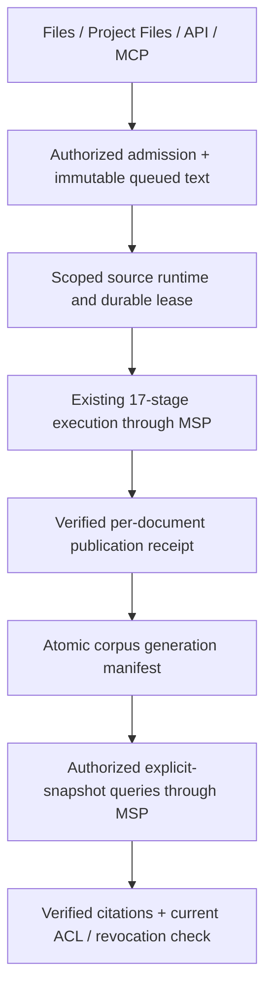

# ADR-072 — Knowledge admission and corpus publication

Isolated acceptance: Business owner Files browser admission and session HTTP/MCP reached the real native pipeline; four document runs each have 17 successful evidence rows, four native snapshots and five corpus generations. Project-scoped and bearer/API-grant paths have unit/Prisma authorization evidence, not native browser proof. Browser query controls and production activation are not claimed. See the [phase report](../../.brain/reports/2026-09-08-knowledge-admission-phase0-4.md) for versions, test counts and limits.

**Status:** beta — phases 0–4 implemented and validated in the isolated profile; production excluded.

## Authority and scope

The owner approved phases 0–4 of the shared-admission plan on 2026-09-08. C-3 / HIGH: documents first, then UI/API/MCP admission, source adapters, status/query/citation and multi-document correction/revocation in isolated test systems. Production, PDF/OCR, external URL fetch, connectors, org-wide sharing and cross-business federation remain subsequent phases. The approved scope does not require another implementation approval.

## Root cause and boundaries

At the audited baseline, FileAsset, document staging, legacy business knowledge and internal GenesisRAG17 were distinct paths. UI/API/MCP callers stopped at files or staging; the tested 17-stage chain started at an internal operator entrypoint. Treating their separate successes as one end-user flow was the readiness gap. This ADR's admission service now connects the approved surfaces. Evidence and source enumeration are in the surface inventory; the RCA records prevention through actual HTTP/browser entrypoint acceptance.

## Decisions

1. One knowledge admission service handles text/Markdown and existing readable FileAsset text/Markdown. UI and MCP use that same service. No direct binary/OCR parser, remote URL fetching, fabricated stage report or caller-supplied worker credential is added.
   **Amended by [ADR-090](ADR-090-LINE-ANSWERS-GROUNDED-BY-THE-PUBLISHED-GKS-CORPUS-AND-REVIEWED-KNOWLEDGE-CANDIDATES.md) (2026-09-14):** two TEXT source kinds are added — `LINE_FAQ_CANDIDATE` (a locator-only question and answer an OWNER or `LINE_OA_PUBLISHER` approved) and, later, `LINE_STUDIO_DESCRIPTION`; both are text and admitted before Stage 1 through this same service.
2. The knowledge domain owns four additive models: KnowledgeCorpus, KnowledgeSource, KnowledgeIngestion and KnowledgeCorpusGeneration. Repository interfaces own their persistence. Corpus identity is Business plus optional Project; the Project must be live and belong to that Business. Corpus association is explicit at Tier 1 and is not silently inserted into the frozen six-field wire scope.
3. Each authorized immutable source version becomes one durable queued ingestion with text hash, idempotency identity, source link, actor and monotonically ordered source revision. Same request/key returns the same job; changed input/key or changed content at an existing source version conflicts. The raw executor source identity is namespaced by corpus/source UUIDs, not user display names.
4. End-user authorization occurs before source content/configuration is disclosed. Business writers use existing owner authority; Business readers use existing visibility. Project corpora additionally use the existing Project read/write ancestry guards; this does not invent finer per-project ACLs than the product currently has. Machine credentials cannot gain new authority merely because an API route was added; any admitted API key must have an explicit configured knowledge grant and matching tenant. Scope/policy are server-resolved, never copied unchecked from a request.
5. Runtime execution uses an unforgeable in-process scoped knowledge capability, distinct from installation-operator authority. It can execute only GenesisRAG knowledge runs of its exact authorized scope; it does not unlock backup/restore, general pipeline definitions or unrelated tenant operations. Request JSON and a caller actor/isOperator field cannot mint it. Existing operator and external reporter behavior stays intact.
6. An opt-in source runtime starts/resumes from durable queue and persisted GenesisRAG intent/batches. Admission is accepted only for an explicitly configured source binding/policy. Leases and compare-and-set prevent concurrent application workers from publishing the same job or overwriting newer corrections. Loss after remote writes reuses the same source/attempt identity; recorded failure never becomes success by hand.
7. GKS and the native worker remain authorities for one document's 17-stage publication. A corpus generation is an immutable Tier 1 manifest of verified per-source snapshot receipts, not a replacement GKS fact store or an invented Tier 4 receipt. Publishing a document atomically merges its verified snapshot into the previous corpus manifest in one database transaction. The native worker's latest pointer alone is not a multi-document corpus.
8. Only an ingestion whose underlying run succeeded and whose source/scope/exact receipt validate may update corpus membership. Older admitted revisions cannot overwrite a newer admitted source revision; a withdrawn source cannot be republished by a late receipt. Unchanged sources retain their prior snapshot references.
9. Query pins one corpus manifest, asks MSP for each active source's explicit snapshot, validates result/source/snapshot/generation/lineage and combines per-snapshot ranks with explicit reciprocal-rank fusion (k=60, stable source/chunk tie-break). Native hybrid/BM25 scores are not globally comparable and remain snapshot-local evidence. It does not silently search the worker's latest snapshot. A required snapshot/read failure fails the query rather than claiming a complete answer. Current authorization and source revocation are rechecked before returning results.
10. Citation identifiers bind corpus generation, source, ingestion and chunk. Resolution checks manifest membership, immutable source hashes/lineage and current source/Project/Business access. An old citation may resolve after a correction while still authorized; revocation or deleted source file/Project denies access. Audit retention is not permission to read withdrawn content.
11. FileAsset metadata removal does not mutate historical snapshots. Serving checks its current state before returning file-backed evidence; explicit knowledge-source withdrawal atomically removes membership and retains audit history. Restore includes corpus/source/job/generation data along with existing immutable lineage, without claiming a zuri-only backup restores native stores.
12. Existing Files and Project Files gain bounded knowledge controls for Text/Markdown, queue/status, query/citations and source withdrawal. No new navigation domain, arbitrary source crawler, LLM extractor or public reporter-success button is introduced.

The `/knowledge/documents` page is a local convenience surface inside the existing
Knowledge slot, not a second admission authority. It sends only Text/Markdown content
through the same `/api/knowledge/ingestions` service and can admit existing readable
Text/Markdown FileAssets. It does not advertise direct JSON/catalog, binary/OCR or
remote-URL ingestion. Queue, query and withdrawal states on this page remain local and
isolated evidence; they do not claim production activation.

The atomic corpus manifest is a Tier 1 read set of independently gated document snapshots, not one FR-110 native knowledge_snapshot_id. This phase proves multi-document retrieval and membership, not corpus-wide graph deduplication, cross-document traversal or one aggregate native quality gate. All selected snapshots use the same configured scope/store; cross-store routing is a later phase.

## Amendment (2026-09-24)

Owner approval: the owner approved remediation item C2 of the 2026-09-24 gap
board with the single word **"approve"**, after being told "start C1 and C2 in
parallel". C2's definition of done: "a TEXT containing a phone number or a LINE
user id fails Stage 5 with terminal evidence"; board detail: "at least use the
candidate prose policy or the FR-111 lattice for documents an OWNER admits, and
record the policy identity in Stage 5 evidence as done for SMARTGIFT_CATALOG".

**Gap closed:** an OWNER-admitted TEXT/FILE document (Decision 1's
"text/Markdown and existing readable FileAsset text/Markdown" path) carries
provider `KNOWLEDGE_ADMISSION` into `genesisrag17-executor.js`
(`apps/server/src/modules/knowledge/knowledge-runtime.js:358`). Before this
amendment, `ZERO_PII_POLICY_BY_PROVIDER`
(`apps/server/src/platform/integrations/core/genesisrag17-executor.js:90`)
named only `SMARTGIFT_CATALOG` (FR-187) and `LINE_FAQ_CANDIDATE` (FR-236); a
provider absent from that map "carries no Stage 5 Zero-PII gate at all" (the
map's own comment), so an owner document containing a phone number or a LINE
user id reached GKS/GenesisBlockDB with no check.

**Rule set adopted — reused, not copied:** `KNOWLEDGE_ADMISSION` now runs a new
provider-scoped policy, identity `knowledge-document-zero-pii-1`
(`apps/server/src/modules/knowledge/knowledge-document-zero-pii.js`), checking
only four identifier-shaped rules: LINE user id, Thai phone number
(0-prefixed/+66), international phone number, and e-mail address. The first
three are the exact same patterns FR-236's candidate prose policy
(`knowledge-candidate-zero-pii.js`) already exports and uses — imported, never
re-typed, so the two policies cannot silently disagree on what a phone number
or LINE id looks like. E-mail address is this policy's own addition; FR-236's
policy has no e-mail rule because a LINE FAQ candidate answer is not the shape
that carries one.

**Rule set deliberately NOT extended to owner documents:** the Thai-honorific
personal-name heuristic and the quoted-wording rule, both from FR-236's
candidate prose policy, are excluded here on purpose. An owner's own admitted
document (a policy page, a procedure, a product manual) legitimately quotes
wording and legitimately names staff, roles or brands by honorific far more
often than a two-sentence FAQ answer does — ADR-090 D6's reasoning that a rule
shaped for one payload denies ordinary, approved content of a different shape
applies at least as strongly here. See the module header for the full
argument.

**Wiring:** `KNOWLEDGE_ADMISSION: { assert: assertDocumentProseZeroPii, policy:
DOCUMENT_ZERO_PII_POLICY }` is added to `ZERO_PII_POLICY_BY_PROVIDER`. A
violation stops the run at Stage 5 with terminal `STEP_FAILED` evidence, the
same failure code family as `SMARTGIFT_CATALOG`/`LINE_FAQ_CANDIDATE`
(`KNOWLEDGE_DOCUMENT_ZERO_PII_DENIED`, status 422), the policy identity
recorded in Stage 5 evidence (`zeroPiiPolicy: 'knowledge-document-zero-pii-1'`,
matching how `smartgift-zero-pii-1` is already recorded for
`SMARTGIFT_CATALOG`), and the violated rule named — **never the matched value
itself**, so evidence cannot leak the PII it caught. Both a TEXT source and a
FILE source admitted as `KNOWLEDGE_ADMISSION` reach Stage 5 through the same
`value.content` field and are covered by the same path.
`SMARTGIFT_CATALOG`/`LINE_FAQ_CANDIDATE` behaviour is byte-identical to before
this amendment; their existing tests are unchanged and still pass.

**Production note:** SmartGift production sources use provider
`SMARTGIFT_CATALOG`, so this changes no published record. The one production
`KNOWLEDGE_ADMISSION` TEXT source already failed at Stage 16 for an unrelated
reason, so no live corpus content is affected by this gate's addition.

**No new FR/NFR/BR/SEC/SDD/ADR id is declared.** This amendment cites existing
FR-173 (KNOWLEDGE_ADMISSION provider), FR-187, FR-236, ADR-072 (this
document), ADR-073, ADR-075 and ADR-090.

@tested tests/unit/knowledge-document-zero-pii.test.js,
tests/integration/genesisrag17-tier1-knowledge-admission-zero-pii.test.js

## Public operations

| Operation | Purpose |
|---|---|
| POST /api/knowledge/ingestions | Admit text or existing file reference under a requested Business/Project, return durable job identity |
| GET /api/knowledge/ingestions | List scoped source jobs and publication state for existing Files/Project context |
| GET /api/knowledge/ingestions/{runId} | Read the opaque admission job; include executionRunId separately when bound |
| POST /api/knowledge/queries | Query one authorized corpus, return manifest identity and citations |
| GET /api/knowledge/citations/{citationId} | Resolve authorized version-bound evidence |
| DELETE /api/knowledge/sources/{sourceId} | Withdraw source membership with optimistic concurrency and audit |

The opaque `{runId}` in the public admission API identifies KnowledgeIngestion.id, not a caller-created FR-071 execution run. Responses name both admission id and executionRunId explicitly. Corresponding MCP tools call the same services and resolve viewers through the existing authenticated transport.

## Data flow

## Acceptance

- Actual UI/API/MCP admission, not a direct internal raw call standing in for a surface.
- Two documents searchable together; correcting one preserves the other; stale completion cannot undo a newer correction; old authorized citations still resolve.
- Source withdrawal, deleted FileAsset/Project and changed viewer grants cannot leak text through queries or citations, including delayed responses.
- Duplicate keys, hash/version conflicts, wrong scope, forbidden writes and unsupported source type fail closed.
- Runtime restart resumes queued/admitted work without fabricated stage completion; receipt loss and failure remain truthful.
- Source receipt and corpus publication are separate evidence; PASS without a matching receipt is never user-visible READY.
- Relevant tests/build/govern and actual native acceptance pass; production remains a separate release gate.

## CHANGELOG

| Version | Date | Status | Summary | Commit Hash | Agent |
|---|---|---|---|---|---|
| 1.0.4b | 2026-09-24 | beta | Amendment: KNOWLEDGE_ADMISSION (owner-admitted TEXT/FILE documents) gets its own Stage 5 Zero-PII gate, identity `knowledge-document-zero-pii-1` (identifier rules only — LINE id, phone, e-mail; no name/quote rules); owner approved remediation item C2 2026-09-24 ("approve") | working-tree | Claude Sonnet 5 |
| 1.0.3b | 2026-09-16 | beta | Bound `/knowledge/documents` to the existing Text/Markdown admission path and removed unsupported direct JSON/catalog and binary intake claims; local/isolated evidence only | working-tree | RWANG |
| 1.0.2b | 2026-09-14 | beta | Pointer only: D1 gains the `LINE_FAQ_CANDIDATE` and `LINE_STUDIO_DESCRIPTION` TEXT source kinds under ADR-090 | working-tree | Claude Opus 5 |
| 1.0.1b | 2026-09-08 | beta | Record isolated Business surface/native acceptance and distinguish Project/API-grant test evidence | 03256b74 + integration | RWANG |
| 1.0.0b | 2026-09-08 | beta | Owner-approved phases 0–4: scoped admission, explicit corpus snapshot manifests and current-access citation serving | base dfdbaf11 | RWANG |
