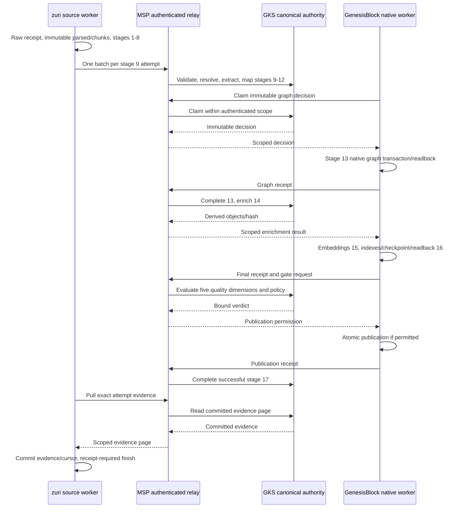

# ADR-073 — GenesisRAG17 isolated execution and publication

Version 1.4.0b adds the dated Amendment (2026-09-11) below. It lifts the "no production
deployment" statement for the SmartGift structured-record profile on the edge device only,
under ADR-075's Phase 3 conditions. Everything else in this ADR stands.

Version 1.3.0b moves this unmerged branch declaration from ADR-071 to ADR-073
because main d36f9a61 published ADR-071 for CRM first. The ID ledger retains
the branch abandonment and trunk identity history under AGENTS.md §18.

Previously, version 1.2.0b moved this branch declaration from ADR-070 to ADR-071.
Main published ADR-070 for execution trace/replay in PR #290 first. Its subject
and identity remain authoritative; this branch resolves the collision under
AGENTS.md §18 using the ID-ledger tooling. GenesisRAG requirements, stage IDs,
wire schema and runtime behavior do not change. Historical pinned acceptance
links retain the old branch-era path.

**Status:** User approved implementation, 2026-09-07. C-3 / HIGH. Acceptance remains evidence-gated.

## Context

ADR-067 supplied reporting/run-close and ADR-068 supplied evidence pull, but the source-to-GKS forward worker, durable parsed/chunk lineage, remaining GKS stages and physical publication were outside those slices. A run cannot complete by installing only its reporter. The RCA is [the seventeen-stage integration investigation](../../.brain/rca/2026-09-07-genesisrag-17-stage-incomplete.md).

## Decision

This authorizes the user-approved [isolated execution and wire contract](../plans/GENESISRAG17-CONTRACT.md), version `genesisrag17.v1`, with three Luna 5.6 Max workers on disjoint worktrees and one integration owner. Scope is synthetic raw artifacts and separate databases in each repo. No production deployment, new UI, LLM extraction or parallel multi-source ingestion. (The production-deployment exclusion is lifted for one profile by the 2026-09-11 Amendment below; the other three exclusions stand.)

1. Tier1 owns immutable versioned raw -> parsed -> chunks, linking the existing integration RawExternalRecord. This amends ADR-050 D4's historical no-new-model slice limit and the knowledge charter; the FR-071 ledger remains the only execution ledger. All six stage metrics persist. Stage1 is evidenced by the real raw acquisition receipt.
2. One document per run, one batch per Stage9 attempt. Scope derives from the run's Portfolio/Tenant/Business. Occurrence sourceMentionId differs from the semantic resolution key. Exact source/chunk hashes and positions accompany the complete batch. GKS validates before use.
3. Every terminal report binds run/stage/step/attempt with actual outcome and execution times. Delivery retries retain idempotency; true reruns use FR-071 attempts. Old legacy evidence stays readable but cannot complete newer attempts. Cursor movement follows durable writes.
4. GKS remains passive, reached only through MSP. The separate worker package in GenesisBlock pulls decisions through MSP and holds the one native store process. GKS decides knowledge and the final combined five-dimension quality gate. Tier4 supplies physical receipts and performs publication. This resolves ambiguous historical arrows/combined-owner wording without authorizing Tier1 substrate access.
5. Stage10 is rule_v1 (.90 explicit, .85 structured, <=.70 inferred; .80 write floor). Stage11 ontology_v1 freezes WORKS_FOR and PURCHASED aliases/types. Stage12 uses the accepted GKS temporal ADR and parity fixtures pinned to MSP `8b8667dadf01fd7f421260af8b8b260f6cac267f`. Stage13 immutable decisions complete only on actual write evidence; Stage14 enrich_v1 derived counts remain distinct from verified facts.
6. GenesisBlock is pinned to `e15e35b0093394e0a8880af7f4e6f63cf81223b7`. Embedded NAPI transactions, flush and checkpoint are required. Actual CPU multilingual-e5-small uses revision `614241f622f53c4eeff9890bdc4f31cfecc418b3`, 384 dimensions, cosine, with verified artifact hashes and no revision fallback. The six-lane manifest identifies native versus worker-derived implementations honestly.
7. Worker writes a separate candidate generation, flushes, checkpoints, reads back and benchmarks, then asks GKS for permission. Physical publication atomically switches a pointer and produces a scope/run/attempt/decision/snapshot/generation/model/transaction-bound receipt. Queries bind one generation, historical snapshots remain addressable. MSP authenticates runtime principals; no caller-supplied actor may assert physical reporter identity.
8. Successful run finish requires both the allowed gate and its matching publication receipt. This strengthens ADR-067 D3/D4: a successful gate alone is not publication. Missing provenance, unreadied required index, security critical or scope/policy denial blocks publication. Start/stop/resume loops are runtime workers, never OS scheduled tasks.

## Alternatives and consequences

Direct GKS-to-Genesis calls violate passive GKS. A Tier1 local writer violates ADR-063. Reporting Stage13 from decided counts conflates decisions with writes. Mock embeddings, manually inserted success rows and a gate-only finalizer cannot prove the user's acceptance flow. The chosen approach needs migrations and cross-repo recovery tests, confined to isolated stores.

The detailed wire contract is an architecture-support document under `docs/plans/`, linked here rather than a new requirement registry. Existing requirement subjects and IDs are unchanged. Each owning repo records matching ADR/charter changes before its implementation.

## Verification

The [specification](../KNOWLEDGE-INGESTION-17-STAGE-SPEC.md) now marks the actual
profile at each stage; the [execution flow and extension map](../KNOWLEDGE-INGESTION-17-STAGE-FLOW.md)
names owners, inputs/outputs, terminal receipts and code/test locations for future
changes. [Recorded acceptance](../../.brain/reports/GENESISRAG17-ACCEPTANCE.md) contains
the implementation run evidence. This documentation revision does not change the
wire schema, pins, scope or production authorization.

Acceptance starts at raw entrypoint, never direct promotion or stage-result injection. Required evidence includes all17 stages/six metrics, repeated mentions/multiple chunks, real retrieval citations and restart lineage, duplicate/reply-loss/crash/replay/cursor tests, wrong-tenant/policy rejection, pointer crash recovery, correction with old citations, and receipt-required finish. Frozen test fixture thresholds are Recall@5 >= .80, MRR >= .65, citation correctness 1.00 and cross-tenant leakage zero. They are test-corpus results, not production quality claims. All repo tests/build/checks, non-skipped integration and governance must pass before completion.

## Amendment (2026-09-11) — production deployment for the SmartGift structured-record profile on the edge device

**Decided by:** Owner, 2026-09-11. The instruction, verbatim: "approve phases 3–5 of
ADR-075 and fix issues pararell". It is recorded in
[ADR-075](ADR-075-SMARTGIFT-CATALOG-ENTERS-VIA-17-STAGE-SOURCE-ADAPTER.md) D8. It follows
the owner's answer to ADR-075 question 2: MSP, GKS and the GenesisBlock worker run on the
edge device.

The Decision's "No production deployment" statement is lifted for exactly one case:

| Dimension | Lifted for | Still excluded |
|---|---|---|
| Source and profile | The SmartGift structured-record profile: the FR-187 source adapter plus the FR-188 parser profile and `ontology_v2`, as accepted by all four repositories in ADR-075 Phase 2 | Every other source and profile, including text/Markdown documents admitted through FR-173 for any other Business |
| Host | The edge device. Today that is `DESKTOP-VETATMQ`, which also runs the zuri-ai production Compose stack | A server host, or any topology that needs a network transport between the tiers (none exists) |
| Scope | One runtime binding for the SmartGift Business. `ZURI_KNOWLEDGE_BINDINGS` holds exactly one entry, which the runtime already enforces | Multiple bindings, stores or Tenants |
| Timing | After the ADR-075 Phase 2 acceptance passes. That is the four-process run from the raw entrypoint, with no skips and this ADR's Verification thresholds unchanged, run against the images the deployment ships | Any time before that |
| Act | A separate operator step that the owner triggers, following [`GENESISRAG17-EDGE-DEPLOYMENT.md`](../plans/GENESISRAG17-EDGE-DEPLOYMENT.md) | A merge, a CI job, or an agent deploying on its own reading of this text |

Everything else in this ADR stands. In particular:

- **The wire contract and the change protocol are unchanged.** Pins move only through a
  contract revision agreed by the four repositories (ADR-075 Phase 2, revision 2), never
  through this amendment.
- **No new UI, no LLM extraction and no parallel multi-source ingestion.** These still hold.
- **The Verification thresholds are still test-corpus results.** Deploying is not a claim
  about production quality. Production answer quality is measured by ADR-075 Phase 4's
  shadow comparison.
- **Migrations stay owner-instructed operator steps (ADR-057).** This amendment applies none.
- **The call directions in D4 are unchanged.** GKS stays passive and reachable only through
  MSP, and Tier 1 never calls GKS or Tier 4 directly. The deployment design shares a
  container network namespace and a data volume, but it does not change who calls whom.
- **The contract's scope line still applies elsewhere.** The scope line in
  [`GENESISRAG17-CONTRACT.md`](../plans/GENESISRAG17-CONTRACT.md) ("No deployment") is read
  through this amendment for this profile only.

## Amendment (2026-09-24) — the Stage 16/17 retrieval benchmark stays a per-record publish condition

**Decided by:** Owner, 2026-09-24. The instruction, verbatim: "ตัดสิน B1: คง fixture ต่อ
record ทำ B2 เลย" ("Ruling on B1: keep the per-record fixture; do B2 now"). B1 and B2 are
items of the 2026-09-24 GenesisRAG17 review's remediation board. The question came from
that review's production probe,
[`.brain/reports/2026-09-24-genesisrag17-production-probe.md`](../../.brain/reports/2026-09-24-genesisrag17-production-probe.md),
which found one Stage 16 `BENCHMARK_NO_APPLICABLE_QUERIES` failure for a text source on
2026-09-21.

**What was open.** Verification above calls the thresholds test-corpus results. In
production the benchmark does more than that. Since 2026-09-21 the worker has booted
with a fixture of real catalog records on the `ki17-state` volume, and it scores each
candidate only on the queries whose gold texts are byte-equal to that candidate's own
chunks (`scopedBenchmarkFixture`, GenesisBlock worker at the pinned `5156f412`). A
candidate generation holds only the record being published. So a record with no entry
fails Stage 16 with `BENCHMARK_NO_APPLICABLE_QUERIES`, and the benchmark is in effect a
per-record publish condition. There were two ways to read that:

| Option | What it means | Cost |
|---|---|---|
| **A. Keep it** | A record publishes only once the fixture holds its entry. Adding or changing a record is an operator step before the upload | One operator step and one worker restart per catalog change set |
| B. Replace the retrieval dimension | Gold identified by chunk id, queries built from record fields with a tolerance, no byte-equal texts (board item B3) | A four-repository contract revision under ADR-075 D6: worker, GKS, MSP and zuri-ai |

**Decision: option A.**

1. For the SmartGift structured-record profile, the Stage 16 retrieval benchmark, judged
   at the Stage 17 gate, stays a per-record publish condition. Every record that
   publishes has an entry in the worker's fixture whose gold texts equal the sections
   production renders for it: the FR-187 adapter split, then the FR-188 renderer. The
   thresholds are unchanged: Recall@5 ≥ .80, MRR ≥ .65, citation correctness 1.00,
   cross-tenant leakage 0.
2. A new record, or a record whose rendered text changed, gets its entry **before** it is
   uploaded. That is an owner-triggered operator step,
   [`GENESISRAG17-EDGE-DEPLOYMENT.md` §10.1](../plans/GENESISRAG17-EDGE-DEPLOYMENT.md#101-adding-or-changing-a-catalog-record-the-per-record-benchmark-step).
   It installs one file on the `ki17-state` volume and restarts only the worker. It
   rebuilds no image.
3. The fixture is cumulative, since the worker boots with exactly one file. Each record
   carries its own `fixtureVersion`, and a change set that adds or replaces a record takes
   a new one. An unchanged record keeps the version it was first judged under.
4. Entries are derived mechanically by `apps/server/deploy/ki17/build-smartgift-real-corpus.mjs`
   through the production render path. Queries are natural phrasings from record fields
   and claim triples, never the chunk text itself, so the benchmark measures retrieval
   rather than an echo.
5. Option B is not pursued. Re-opening it is a new owner decision and a contract revision,
   not a change to this procedure.

**What passing still does not claim.** The queries are generated from the record under
test. A pass proves that the record's own chunks are retrievable by its own descriptive
words, that citations resolve, and that no other scope leaks in. It is not a claim about
production answer quality, which is still measured by ADR-075 Phase 4's shadow comparison.

**Consequences.**

- **Free text cannot publish on this profile.** Text and Markdown sources admitted
  through FR-173 are still outside the 2026-09-11 amendment's production scope, and under
  this decision a text chunk could not pass Stage 16 without a benchmark entry anyway. The
  failed `test01` run of 2026-09-21 is the expected outcome, not a defect. A future
  profile must say how its per-record benchmark is produced before its production
  deployment is lifted.
- **TASK-ZAI-051 cannot publish new or changed records on its own.** A scheduler or
  replay surface over FR-081 can re-run a record the deployed fixture already covers. A
  new or changed record waits for the §10.1 step. So TASK-ZAI-051 needs a "needs
  benchmark" stopping state that the operator step clears, or a later decision that
  re-opens option B. The dependency is recorded here, and the roadmap row is left as it
  is.
- **No pin, wire field or threshold moves.** The worker, GKS, MSP and the contract are
  unchanged.

Everything else in this ADR and in its 2026-09-11 amendment stands.

## CHANGELOG

| Version | Date | Status | Summary | Commit Hash | Agent |
|---|---|---|---|---|---|
| 1.5.0b | 2026-09-24 | beta | Amendment: owner ruled (remediation item B1) that the Stage 16/17 retrieval benchmark stays a per-record publish condition for the SmartGift profile; new or changed records get their entry through the owner-triggered EDGE-DEPLOYMENT §10.1 step before upload; option B (fixture-independent retrieval dimension) not pursued; consequences for free text and TASK-ZAI-051 recorded; no pin, wire field or threshold moves | — | Claude Opus 5.5 |
| 1.4.0b | 2026-09-11 | beta | Amendment: "no production deployment" lifted for the SmartGift structured-record profile on the edge device, only after ADR-075 Phase 2 acceptance and as an owner-triggered operator step; everything else stands | — | Claude Opus 5 |
| 1.3.0b | 2026-09-08 | beta | ADR-071 abandoned by this unmerged branch in favor of ADR-073 because main published CRM first; runtime unchanged | main d36f9a61 | RWANG |
| 1.2.0b | 2026-09-08 | beta | ADR-070 abandoned by this unmerged branch in favor of ADR-071 because main published execution trace/replay first | main bd385c1d | RWANG |
| 1.1.0b | 2026-09-08 | beta | Link actual per-stage profile, extension map and recorded acceptance without changing runtime scope | base b64b46df | RWANG |
| 1.0.0b | 2026-09-07 | beta | Approved isolated durable 17-stage execution and receipt-bound atomic publication | base b17e7258 | RWANG |
