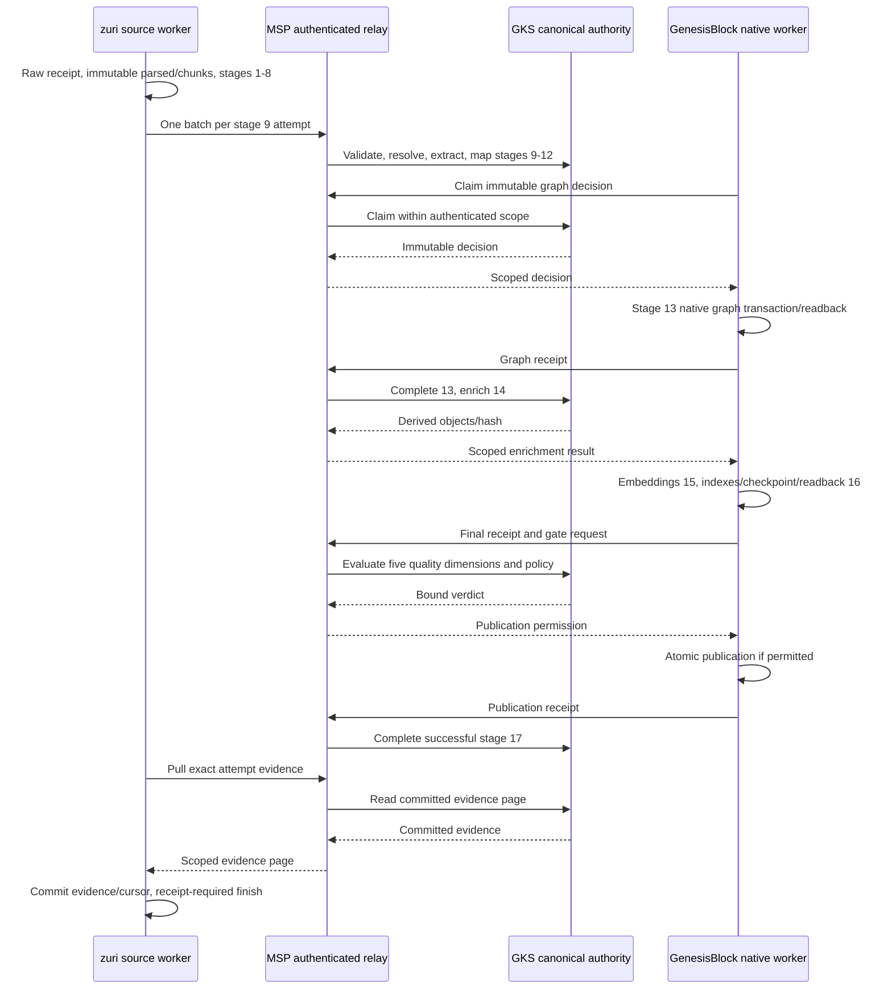

# ADR-073 — GenesisRAG17 isolated execution and publication

Version 1.3.0b moves this unmerged branch declaration from ADR-071 to ADR-073
because main d36f9a61 published ADR-071 for CRM first. The ID ledger retains
the branch abandonment and trunk identity history under AGENTS.md §18.

Previously, version 1.2.0b moved this branch declaration from ADR-070 to ADR-071.
Main published ADR-070 for execution trace/replay in PR #290 first. Its subject
and identity remain authoritative; this branch resolves the collision under
AGENTS.md §18 using the ID-ledger tooling. GenesisRAG requirements, stage IDs,
wire schema and runtime behavior do not change. Historical pinned acceptance
links retain the old branch-era path.

**Status:** User approved implementation, 2026-09-07. C-3 / HIGH. Acceptance remains evidence-gated.

## Context

ADR-067 supplied reporting/run-close and ADR-068 supplied evidence pull, but the source-to-GKS forward worker, durable parsed/chunk lineage, remaining GKS stages and physical publication were outside those slices. A run cannot complete by installing only its reporter. The RCA is [the seventeen-stage integration investigation](../../.brain/rca/2026-09-07-genesisrag-17-stage-incomplete.md).

## Decision

This authorizes the user-approved [isolated execution and wire contract](../plans/GENESISRAG17-CONTRACT.md), version `genesisrag17.v1`, with three Luna 5.6 Max workers on disjoint worktrees and one integration owner. Scope is synthetic raw artifacts and separate databases in each repo. No production deployment, new UI, LLM extraction or parallel multi-source ingestion.

1. Tier1 owns immutable versioned raw -> parsed -> chunks, linking the existing integration RawExternalRecord. This amends ADR-050 D4's historical no-new-model slice limit and the knowledge charter; the FR-071 ledger remains the only execution ledger. All six stage metrics persist. Stage1 is evidenced by the real raw acquisition receipt.
2. One document per run, one batch per Stage9 attempt. Scope derives from the run's Portfolio/Tenant/Business. Occurrence sourceMentionId differs from the semantic resolution key. Exact source/chunk hashes and positions accompany the complete batch. GKS validates before use.
3. Every terminal report binds run/stage/step/attempt with actual outcome and execution times. Delivery retries retain idempotency; true reruns use FR-071 attempts. Old legacy evidence stays readable but cannot complete newer attempts. Cursor movement follows durable writes.
4. GKS remains passive, reached only through MSP. The separate worker package in GenesisBlock pulls decisions through MSP and holds the one native store process. GKS decides knowledge and the final combined five-dimension quality gate. Tier4 supplies physical receipts and performs publication. This resolves ambiguous historical arrows/combined-owner wording without authorizing Tier1 substrate access.
5. Stage10 is rule_v1 (.90 explicit, .85 structured, <=.70 inferred; .80 write floor). Stage11 ontology_v1 freezes WORKS_FOR and PURCHASED aliases/types. Stage12 uses the accepted GKS temporal ADR and parity fixtures pinned to MSP `8b8667dadf01fd7f421260af8b8b260f6cac267f`. Stage13 immutable decisions complete only on actual write evidence; Stage14 enrich_v1 derived counts remain distinct from verified facts.
6. GenesisBlock is pinned to `e15e35b0093394e0a8880af7f4e6f63cf81223b7`. Embedded NAPI transactions, flush and checkpoint are required. Actual CPU multilingual-e5-small uses revision `614241f622f53c4eeff9890bdc4f31cfecc418b3`, 384 dimensions, cosine, with verified artifact hashes and no revision fallback. The six-lane manifest identifies native versus worker-derived implementations honestly.
7. Worker writes a separate candidate generation, flushes, checkpoints, reads back and benchmarks, then asks GKS for permission. Physical publication atomically switches a pointer and produces a scope/run/attempt/decision/snapshot/generation/model/transaction-bound receipt. Queries bind one generation, historical snapshots remain addressable. MSP authenticates runtime principals; no caller-supplied actor may assert physical reporter identity.
8. Successful run finish requires both the allowed gate and its matching publication receipt. This strengthens ADR-067 D3/D4: a successful gate alone is not publication. Missing provenance, unreadied required index, security critical or scope/policy denial blocks publication. Start/stop/resume loops are runtime workers, never OS scheduled tasks.

## Alternatives and consequences

Direct GKS-to-Genesis calls violate passive GKS. A Tier1 local writer violates ADR-063. Reporting Stage13 from decided counts conflates decisions with writes. Mock embeddings, manually inserted success rows and a gate-only finalizer cannot prove the user's acceptance flow. The chosen approach needs migrations and cross-repo recovery tests, confined to isolated stores.

The detailed wire contract is an architecture-support document under `docs/plans/`, linked here rather than a new requirement registry. Existing requirement subjects and IDs are unchanged. Each owning repo records matching ADR/charter changes before its implementation.

## Verification

The [specification](../KNOWLEDGE-INGESTION-17-STAGE-SPEC.md) now marks the actual
profile at each stage; the [execution flow and extension map](../KNOWLEDGE-INGESTION-17-STAGE-FLOW.md)
names owners, inputs/outputs, terminal receipts and code/test locations for future
changes. [Recorded acceptance](../../.brain/reports/GENESISRAG17-ACCEPTANCE.md) contains
the implementation run evidence. This documentation revision does not change the
wire schema, pins, scope or production authorization.

Acceptance starts at raw entrypoint, never direct promotion or stage-result injection. Required evidence includes all17 stages/six metrics, repeated mentions/multiple chunks, real retrieval citations and restart lineage, duplicate/reply-loss/crash/replay/cursor tests, wrong-tenant/policy rejection, pointer crash recovery, correction with old citations, and receipt-required finish. Frozen test fixture thresholds are Recall@5 >= .80, MRR >= .65, citation correctness 1.00 and cross-tenant leakage zero. They are test-corpus results, not production quality claims. All repo tests/build/checks, non-skipped integration and governance must pass before completion.

## CHANGELOG

| Version | Date | Status | Summary | Commit Hash | Agent |
|---|---|---|---|---|---|
| 1.3.0b | 2026-09-08 | beta | ADR-071 abandoned by this unmerged branch in favor of ADR-073 because main published CRM first; runtime unchanged | main d36f9a61 | RWANG |
| 1.2.0b | 2026-09-08 | beta | ADR-070 abandoned by this unmerged branch in favor of ADR-071 because main published execution trace/replay first | main bd385c1d | RWANG |
| 1.1.0b | 2026-09-08 | beta | Link actual per-stage profile, extension map and recorded acceptance without changing runtime scope | base b64b46df | RWANG |
| 1.0.0b | 2026-09-07 | beta | Approved isolated durable 17-stage execution and receipt-bound atomic publication | base b17e7258 | RWANG |
